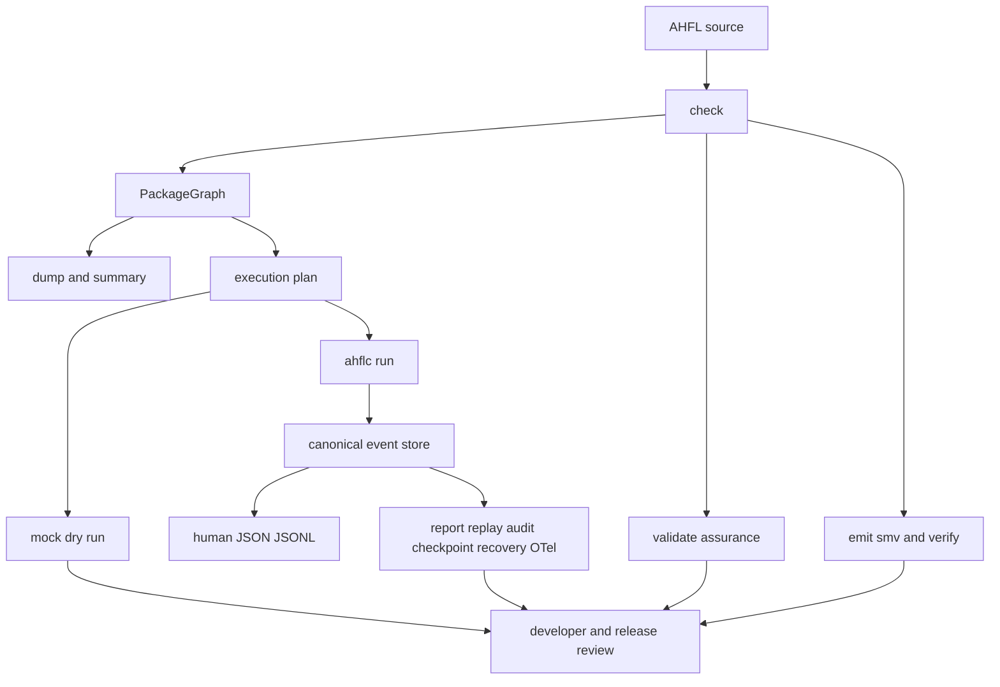

# AHFL 用户指南总览

AHFL（Agent Handoff Flow Language）是面向**可审计 Agent 工作流**的强类型 DSL 与
C++23 编译器。它不是聊天框架或通用模型 SDK；它为已有或将要接入的模型、工具和外部
系统提供可检查的控制面：谁能调用什么 capability、哪些状态可达、节点如何依赖、失败
如何终态化，以及哪些证据足以支持一次受控发布评审。

本文是中文用户手册的入口。语言语法和静态语义以
[AHFL 语言规范](../spec/core-language.zh.md) 为准；本系列说明如何实际使用当前
checkout 的工具链与 reference workflow。

## 先读这一页

| 你的目标 | 从哪里开始 | 接下来阅读 |
|---|---|---|
| 写一个新的 Agent workflow | [建模指南](./user-guide-authoring.zh.md) | [CLI 工作流](./user-guide-cli.zh.md) |
| 将现有 `.ahfl` 文件升级为工程 | [CLI 工作流](./user-guide-cli.zh.md) | [Package Usage](./project-usage.zh.md) |
| 运行带 LLM capability 的工作流 | [执行与包指南](./user-guide-execution.zh.md) | [运行期 artifact 参考](./native-runtime-artifacts.zh.md) |
| 为高风险调用增加 gate | [保障与生产证据指南](./user-guide-assurance.zh.md) | [Assurance Spec](../spec/assurance.zh.md) |
| 排查编译、配置或运行失败 | [CLI 工作流](./user-guide-cli.zh.md) 的诊断顺序 | [错误码参考](./error-codes.zh.md) |

## 产品边界

AHFL 当前最适合做 Agent 系统的**类型化控制与 assurance 层**：

1. **结构可见**：Agent 状态、状态转移、capability 白名单、workflow DAG 依赖都在源码中。
2. **边界可查**：workflow/agent 输入输出与 runtime JSON 在边界精确匹配，错误附带
   可定位的 `SourceRange`。
3. **行为可约束**：`requires`、`ensures`、`invariant`、`forbid` 与 workflow
   safety/liveness 条款表达可检查的控制要求。
4. **执行可演练**：PackageGraph、execution plan 与 deterministic dry-run trace
   让真实调用前的路径可检查。
5. **运行可审计**：`ahflc run` 以 typed canonical event store 为唯一动态事实源，
   从同一事实派生 human、JSON、JSONL、report、replay、audit、scheduler、checkpoint、
   recovery 与 OTLP-compatible trace。
6. **外部调用可治理**：LLM、HTTP/gRPC JSON transcoding binding、工具和 secret 都在
   capability/runtime 配置边界处理；配置或 schema 不满足时 fail closed。

AHFL 不将外部数据库、支付网关、LLM 服务的内部实现或真实世界业务状态“编译进” DSL。
Assurance 与 formal verification 证明的是有限控制模型和已声明的效果事实，不等于证明
外部系统、模型输出或无限数据域。

## Readiness Vocabulary

不要把“仓库里有模块、CLI 命令或绿色单测”理解成某项产品能力已经 ready。当前项目使用
evidence-first 的分层口径：

| 层级 | 代表什么 | 用户应如何使用 |
|---|---|---|
| 已验证 Beta | `config/beta-gate.json` 的十项合同有当前 revision evidence | 可作为当前 beta surface 使用与评估 |
| Controlled pilot | 30 秒以上 reference workflow、网络故障矩阵、recovery、OTel 和预算路径 | 适合受控集成，不等于生产就绪 |
| Production confidence | CI-only 一小时 single-long-lived-worker soak、RSS/allocator 趋势与 provider retry 证据 | 仅从专用 CI evidence 判断；本地不能运行 hour-scale |
| 开发者 / 实验入口 | 编译器模块、额外 backend、工具或 CLI 命令存在 | 先查具体文档和测试，不自动获得 beta/production claim |

当前 verified beta 事实见根目录 `README.md` / `README.zh.md` 与
`config/beta-gate.json`。例如 manifest run profile、numeric runtime identity、
canonical event projections、lifecycle terminal invariant、formatter、reference
recovery、干净安装与 scope freeze 都有单独证据合同。

以下内容**不属于当前已验证 beta 产品面**：native gRPC / Protobuf transport、
multi-region 运行、官方 registry service、浏览器 playground、Marketplace 正式发布。
已有 `gRPC JSON transcoding` capability binding 时，它仍是 HTTP/JSON 边界能力，
不能据此宣称 native gRPC 已可用。

## End-to-End Path



推荐按以下顺序推进一个真实项目：

1. 先定义 `struct`、`enum`、`capability`、`agent`、`flow` 和 `workflow`。
2. 运行 `ahflc check`，先消除 parse、resolve、typecheck 与 validation diagnostics。
3. 用 `dump ast`、`dump types`、`emit summary` 查看编译器理解的结构。
4. 加入 `ahfl.toml`；多 package 工程再加入 `ahfl.workspace.toml`，并从
   `PackageGraph` 进入工具链。
5. 审查 `dump package-graph`、`emit execution-plan` 与 `emit package-review`。
6. 用 `emit dry-run-trace` 和 capability mocks 验证静态 DAG 与演练路径。
7. 使用 manifest `[run]` profile、secret handle 和 schema-correct input 运行
   `ahflc run`；自动化消费者读取 JSON/JSONL，不解析 human 输出。
8. 对有外部效果的 workflow 运行 `validate`；对有限控制性质运行 `verify`。
9. 需要发布评审时，组合当前 revision 的 beta / pilot / CI-only production-confidence
   evidence，而不是引用旧报告或测试总数。

## Reference Workflow

仓库的唯一 beta reference workflow 位于
[`examples/execution-demo`](../../examples/execution-demo)：

```text
IncidentRequest
  -> IntakeAgent
  -> DecisionAgent
  -> ResponderAgent
       -> DraftIncidentSummary capability
  -> IncidentResponse
```

它同时展示：

- package manifest、`[run]` 与 `low-risk` profile；
- 具名 input/output schema 与 enum JSON 表示；
- 多 Agent DAG 和 `after` 依赖；
- 一个 OpenAI-compatible LLM capability；
- token/cost policy、fallback/cache/diagnostic 的 canonical event 投影；
- crash/resume、side-effect dedupe、bounded pilot 与 CI-only production-confidence
  evidence 的共同基础。

先构建后可完成不调用真实 provider 的检查与审查：

```bash
cmake --preset dev
cmake --build --preset build-dev

AHFLC=./build/dev/src/tooling/cli/ahflc

"$AHFLC" check --manifest examples/execution-demo/ahfl.toml \
  --target workflow --sysroot .
"$AHFLC" dump package-graph --manifest examples/execution-demo/ahfl.toml \
  --sysroot .
"$AHFLC" emit execution-plan --manifest examples/execution-demo/ahfl.toml \
  --target workflow --sysroot .
```

真实 run 需要按照[执行与包指南](./user-guide-execution.zh.md)配置
`AHFL_GLM_API_KEY` 或替换 `llm_config.example.json` 中的 endpoint/model/secret handle；
不要把密钥写入 manifest、源码或提交到仓库。

## Guide Map

| 文档 | 解决的问题 | 不负责什么 |
|---|---|---|
| [建模指南](./user-guide-authoring.zh.md) | 将业务约束拆成类型、capability、Agent、flow、DAG | 完整语法逐条定义 |
| [CLI 工作流](./user-guide-cli.zh.md) | 选择输入模式、命令、artifact 与诊断顺序 | 解释 provider 配置的全部字段 |
| [执行与包指南](./user-guide-execution.zh.md) | package run、runtime JSON、provider、events、recovery | 宣称任意 provider 或部署已生产就绪 |
| [保障与生产证据指南](./user-guide-assurance.zh.md) | effect profile、formal、release evidence 和 CI-only soak | 证明外部系统或模型语义 |
| [Package Usage](./project-usage.zh.md) | manifest/workspace/sysroot 的完整工程语义 | workflow 运行配置细节 |
| [运行期 artifact 参考](./native-runtime-artifacts.zh.md) | JSON/JSONL、ID、event/projection/recovery contract | 日常命令教程 |

## Normative Sources

- 语言语法、类型和运行时边界：[`core-language.zh.md`](../spec/core-language.zh.md)。
- effect profile、assurance 和 formal gate：[`assurance.zh.md`](../spec/assurance.zh.md)。
- 运行期 ID、event、projection 与 recovery schema：
  [`native-runtime-artifacts.zh.md`](./native-runtime-artifacts.zh.md)。
- 当前命令面：实际构建产物的 `ahflc --help`；补充参数见
  [`cli-commands.zh.md`](./cli-commands.zh.md)。
- 当前能力状态与后续优先级：[`project-status.zh.md`](../plans/project-status.zh.md) 与
  [`issue-backlog-global-gaps.zh.md`](../plans/issue-backlog-global-gaps.zh.md)。
