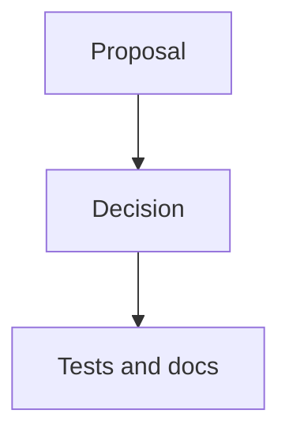

# RFC 0000: Short Title

## Summary

One paragraph describing the proposed decision.

## Motivation

Explain why AHFL needs this now and what fails if no decision is made.

## Goals

1. Write concrete, verifiable outcomes.

## Non-Goals

1. State what is explicitly out of scope.

## Design

Describe language, compiler, runtime, tooling, and documentation behavior. Use Mermaid for every architecture or state diagram.

## User Impact

Describe source, CLI, LSP, runtime, stdlib, diagnostic, or artifact changes users can observe.

## Compatibility and Migration

State whether this is a breaking change. If it is, include impact scope and migration steps.

## Implementation Plan

List implementation slices by subsystem.

## Test Plan

List required unit, integration, golden, conformance, negative, fuzz, or release-evidence tests.

## Rollout and Stabilization

Describe how the RFC moves from draft to review, accepted, implemented, and stabilized.

## Alternatives

1. Compare at least two serious alternatives and explain why they lose.

## Open Questions

1. List unresolved questions while the RFC is draft. Clear or transfer them before acceptance.

## Decision History

- YYYY-MM-DD: Draft opened.
