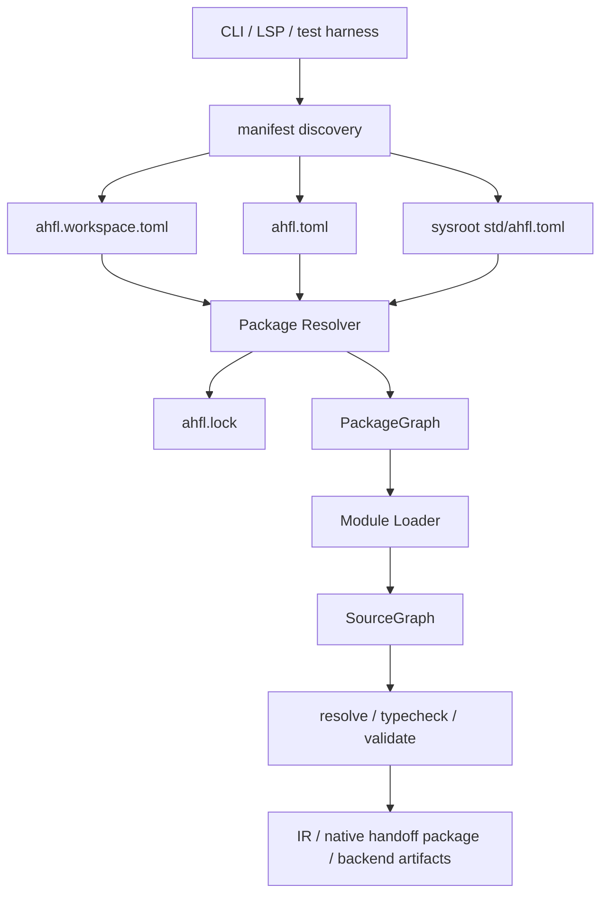

# RFC 0005: Package Configuration System

## Summary

本 RFC 提议把 AHFL 的工程配置从当前 `ahfl.project.json` / `ahfl.workspace.json` / `ahfl.package.json` 三条浅输入路径，重构为以 `ahfl.toml` 为中心的一等包体系。新的体系把 workspace、package、target、dependency、module root、sysroot `std` 和 runtime handoff target 放进同一条可验证的 PackageGraph 构建链路中。

接受本 RFC 后，`std/` 必须成为带 manifest 的 sysroot package；`ahfl.project.json`、`ahfl.workspace.json` 和当前 runtime-facing `ahfl.package.json` 不再作为公开工程入口继续存在。

## Motivation

当前工程配置体系暴露出四个结构性问题。

第一，AHFL 已经有 `std/` 源码树，但 `std` 不是一等 AHFL package。编译器通过搜索根和 `std/prelude.ahfl` 探测把它加入编译流程，这使标准库身份、模块前缀、prelude 策略、builtin hook 权限和测试入口都散落在代码、文档和测试约定里。

第二，`project descriptor` 只描述 source graph 装载，`package authoring descriptor` 只描述 runtime handoff metadata。它们都不是成熟语言生态里通常意义上的 package manifest。用户必须理解多个描述文件的叠加顺序，而编译器也没有一个统一 PackageGraph 来表达依赖、包身份、module prefix 和 target。

第三，现有路径把 `ProjectInput` 过早暴露成用户概念。`ProjectInput` 应该是 frontend loader 的内部数据结构，而不是 AHFL 工程模型的公开界面。

第四，旧配置入口和 std 特判会继续制造双事实来源。AHFL 处于未成熟阶段，应按照仓库原则做破坏式重构，而不是长期维护平行入口。

## Goals

1. 定义 AHFL 一等 package manifest：`ahfl.toml`。
2. 定义 workspace manifest、lockfile、target、dependency 和 sysroot package 的职责。
3. 让 `std/` 通过 `std/ahfl.toml` 进入 PackageGraph，而不是由 compiler 特判目录结构。
4. 让 package resolution 先于 source graph loading，形成稳定的 `PackageId` / `ModuleId` / `SymbolId` 身份链。
5. 把 runtime handoff authoring 从“包描述文件”降级为 package target 配置。
6. 明确破坏性迁移路径，删除旧公开入口，避免双事实来源。
7. 给出可执行测试计划，覆盖 manifest 解析、PackageGraph、CLI、stdlib、诊断和迁移 fixture。

## Non-Goals

1. 不在本 RFC 中设计远程 registry 协议、发布认证、签名或供应链安全。
2. 不在本 RFC 中稳定 dependency feature flags。
3. 不在本 RFC 中改变 AHFL 源码的 `import std::option as option;` 表面语法。
4. 不在本 RFC 中设计 registry source 的 wire protocol；v1 dependency source model 只包含 `sysroot`、`path` 和 `workspace`。
5. 不为旧 JSON descriptor 提供长期兼容层。

## Design

新的工程入口由三个文件类别组成：

| 文件 | 作者 | 作用 |
| --- | --- | --- |
| `ahfl.toml` | 人类 | 单个 package 的源码、target、依赖、module prefix 和 package metadata |
| `ahfl.workspace.toml` | 人类 | 多 package workspace 的成员列表、统一 resolver 策略和共享覆盖 |
| `ahfl.lock` | 工具 | resolver 产物，冻结依赖版本、来源、checksum 和 sysroot identity |

整体编译链路如下：



### Package manifest

普通 package 的最小 `ahfl.toml`：

```toml
manifest_version = 1

[package]
name = "refund-audit"
version = "0.1.0"
edition = "2026"
kind = "application"

[module]
prefix = "refund_audit"
root = "src"

[exports]
modules = ["main", "agents"]

[targets.lib]
kind = "library"
entry = "src/lib.ahfl"

[targets.workflow]
kind = "handoff"
entry = "refund_audit::main::RefundAuditWorkflow"
exports = ["refund_audit::main::RefundAuditWorkflow"]

[dependencies]
std = { source = "sysroot" }
```

`manifest_version` 是 manifest schema 版本，不等于语言 edition、package version、IR format version 或 handoff artifact format version。

`package.kind` 的初始取值为：

| Kind | 含义 |
| --- | --- |
| `library` | 可被其他 package 依赖的库 |
| `application` | 有一个或多个用户可运行 target 的 package |
| `standard-library` | 只有 sysroot 可使用，允许声明 compiler intrinsic 权限 |

`targets.*.kind` 的初始取值为：

| Target kind | 含义 |
| --- | --- |
| `library` | 编译并检查 module surface，不产生 runtime handoff package |
| `handoff` | 以某个 workflow / agent / capability surface 生成 native handoff package |
| `test` | 测试入口，允许 test harness 聚合 fixture |

### Manifest schema v1

`ahfl.toml` 使用 TOML 1.0 语法。Manifest parser 必须保留 key、value、table header 和 array item 的 source range，以便所有 manifest diagnostics 指向具体字段。

通用规则：

1. 未知字段和未知 table 一律报错，不做 forward-compatible ignore。
2. 重复 table、重复 key、错误类型和空字符串字段一律报错。
3. `manifest_version` 必须是整数 `1`，不得写成字符串。
4. 相对路径以当前 manifest 所在目录为基准解析，规范化后不得逃出 package root；唯一例外是 dependency `source = "path"` 的 `path` 字段，因为它显式指向另一个 package root。
5. package name 使用 kebab-case：`^[a-z][a-z0-9]*(?:-[a-z0-9]+)*$`。
6. module prefix 使用 AHFL module identifier：`^[A-Za-z_][A-Za-z0-9_]*$`，不得包含 `::`。
7. target name 使用 kebab-case 或 snake_case，但在同一个 package 内规范化后不得重复。
8. `version` 在 v1 必须是 exact semantic version：`MAJOR.MINOR.PATCH`。Version range 属于后续 registry RFC。
9. `edition` 在 v1 只允许 `"2026"`。

`ahfl.toml` 字段 contract：

| 字段 | 必填 | 类型 | 约束 |
| --- | --- | --- | --- |
| `manifest_version` | 是 | integer | 只允许 `1` |
| `[package].name` | 是 | string | kebab-case；依赖 key 默认必须与它一致 |
| `[package].version` | 是 | string | exact SemVer |
| `[package].edition` | 是 | string | v1 只允许 `"2026"` |
| `[package].kind` | 是 | string | `library` / `application` / `standard-library` |
| `[module].prefix` | 是 | string | package 对外 module prefix |
| `[module].root` | 是 | string | package 内源码根目录 |
| `[exports].modules` | library 和 standard-library 必填 | array string | 对依赖方可 import 的 public modules |
| `[targets.<name>].kind` | 非 standard-library package 至少一个 target | string | `library` / `handoff` / `test` |
| `[targets.<name>].entry` | 是 | string | `library` / `test` 为文件路径，`handoff` 为 canonical symbol name |
| `[targets.<name>].exports` | handoff 必填 | array string | native handoff package 输出 surface |
| `[[targets.<name>.capability_bindings]]` | 否 | array table | 只允许 handoff target |
| `[dependencies]` | 否 | table | dependency source spec map |

Schema diagnostics 使用固定分层前缀：

| 层级 | 示例 message |
| --- | --- |
| `E::manifest_syntax` | `manifest must be valid TOML` |
| `E::manifest_unknown_field` | `unsupported manifest field 'package.license'` |
| `E::manifest_type` | `manifest field 'manifest_version' must be an integer` |
| `E::manifest_required` | `manifest is missing required field 'package.name'` |
| `E::manifest_invalid_value` | `package.name must be kebab-case` |
| `E::manifest_path_escape` | `manifest field 'module.root' must not escape package root` |
| `E::package_graph` | `dependency cycle: a -> b -> a` |

### Manifest parser strategy

本 RFC 选择仓库内 C++23 TOML 1.0 parser，而不是 vendored third-party TOML runtime dependency。原因是仓库当前只允许 vendored ANTLR4 作为外部 runtime dependency，而 manifest parser 还必须把 key、value、table header 和 array item 映射回 AHFL `SourceRange`。

Parser 分成两层：

1. `toml::Document` syntax layer：接受完整 TOML 1.0 语法，输出带 source range 的 typed TOML DOM。它必须支持 comments、bare / dotted / quoted keys、basic string、multi-line basic string、literal string、multi-line literal string、integer、float、boolean、offset datetime、local datetime、local date、local time、array、inline table、standard table 和 array of tables。它不得把 AHFL manifest schema 限制下推成 TOML 方言。
2. `manifest::Schema` layer：把 TOML DOM 降成 `PackageManifest` / `WorkspaceManifest`。未知字段、未知 table、类型不匹配、重复 key / table、路径逃逸和无效值都在这一层产生 `E::manifest_*` 或 `E::package_graph` diagnostic，并指向 syntax layer 保留的原始 source range。

实现约束：

1. 不新增非 vendored runtime dependency；如果未来决定引入 TOML library，必须先通过单独 RFC 修改 dependency policy，并说明 source range、license、release packaging 和 supply-chain 影响。
2. 不实现 AHFL-only TOML subset。凡 TOML 1.0 语法合法但 AHFL manifest schema 不接受的值，必须先被 syntax layer 接受，再由 schema layer 给出字段级 diagnostic。
3. Canonical TOML printer 只能从 schema layer 的 typed model 生成，用于 lockfile checksum；它不是通用 TOML formatter。
4. Parser error recovery 至少要在同一个文件内继续发现后续 table header 和 top-level key，避免第一个 TOML syntax error 屏蔽所有 schema diagnostics。

Conformance 测试矩阵：

1. TOML 1.0 positive fixtures：覆盖 string escaping、multi-line strings、numeric bases、float edge values、datetime、dotted keys、inline tables、array of tables 和 nested tables。
2. TOML 1.0 negative fixtures：覆盖 invalid escape、unterminated string、duplicate keys、invalid dotted key、mixed array element rules、malformed table header 和 inline table closure。
3. Source-range fixtures：断言 key、value、table header、array item 和 duplicate declaration diagnostic 均落在精确字段上。
4. Manifest schema fixtures：断言 TOML 合法但 manifest schema 不接受的字段和值进入 `E::manifest_*`，而不是 `E::manifest_syntax`。
5. Lockfile checksum fixtures：断言 canonical TOML 表示、换行规范化、路径排序和 hash 输入稳定。
6. Dependency-policy fixture：CMake target graph 不链接新的非 vendored TOML runtime library。

当前 `ahfl.package.json` 里的 entry、exports 和 capability bindings 必须迁移到 `handoff` target 内，而不是继续作为独立 package descriptor。

### Sysroot `std`

`std/ahfl.toml` 必须存在，并且由 compiler 作为 sysroot package 加载：

```toml
manifest_version = 1

[package]
name = "std"
version = "0.1.0"
edition = "2026"
kind = "standard-library"

[module]
prefix = "std"
root = "."

[prelude]
module = "std::prelude"
injection = "explicit"

[exports]
modules = [
  "prelude",
  "option",
  "result",
  "string",
  "collections",
  "cmp",
  "fmt",
  "decimal",
  "json",
  "time",
  "uuid",
  "traits",
]

[compiler_intrinsics]
allow = [
  "option_*",
  "result_*",
  "list_*",
  "set_*",
  "map_*",
  "string_*",
  "decimal_*",
  "json_*",
  "time_*",
  "uuid_*",
]
```

`std` 的 PackageId 固定为 `PackageId(0)`。用户 package 从 `PackageId(1)` 开始分配。这个固定编号是编译器内部身份规则，不进入用户源码语义。

`compiler_intrinsics.allow` 是标准库调用 `@builtin` 的显式权限清单。非 `standard-library` package 使用 `@builtin` 必须报错。

v1 prelude 策略在本 RFC 中冻结为 `explicit`：编译器不会默认注入 `std::prelude`。用户必须显式 import，或者由后续 stdlib/language RFC 修改该策略。`prelude.injection` 在 v1 只允许 `explicit`，保留该字段是为了让 sysroot package 明确声明当前语言体验，而不是依赖编译器默认值。

### Workspace manifest

多 package workspace 使用 `ahfl.workspace.toml`：

```toml
manifest_version = 1

[workspace]
name = "commerce-workflows"
members = [
  "packages/refund-audit",
  "packages/risk-review",
]

[resolver]
version = 1

[dependencies]
std = { source = "sysroot" }
```

Workspace 不直接生成 SourceGraph。它只选择 package、统一 resolver 策略，并在需要时生成锁文件。

`ahfl.workspace.toml` 也使用 TOML 1.0 语法，并遵循与 package manifest 相同的未知字段、重复字段、source range 和路径规范化规则。Workspace manifest v1 字段 contract：

| 字段 | 必填 | 类型 | 约束 |
| --- | --- | --- | --- |
| `manifest_version` | 是 | integer | 只允许 `1` |
| `[workspace].name` | 是 | string | kebab-case |
| `[workspace].members` | 是 | array string | 非空；每项指向一个包含 `ahfl.toml` 的 package root |
| `[resolver].version` | 是 | integer | 只允许 `1` |
| `[dependencies]` | 否 | table | 只允许 workspace-wide default dependency specs |

Workspace member 规则：

1. `members` 路径相对 workspace manifest 所在目录解析，规范化后不得逃出 workspace root。
2. `members` 不能重复；两个不同路径不能声明相同 `[package].name`。
3. member package 不能包含另一个 member package，嵌套 package 必须拆成 sibling member。
4. workspace root 下若发现未列入 `members` 的嵌套 `ahfl.toml`，该 package 不属于 workspace context；显式 `--manifest` 仍可单独加载它。
5. workspace `[dependencies]` 只提供默认 dependency spec。Package 自己的 `[dependencies]` 优先；两者同时声明同一 dependency 且 spec 不同时报 `E::package_graph`，不得静默覆盖。
6. workspace dependency default 不会自动添加依赖；package 仍必须显式列出 dependency key，除非该 dependency 是 `std = { source = "sysroot" }`。
7. workspace manifest 不允许声明 targets、module roots、exports 或 handoff metadata。

### Dependency source model v1

v1 只允许三种 dependency source：

| Source | 语法 | 解析规则 |
| --- | --- | --- |
| `sysroot` | `std = { source = "sysroot" }` | 只允许 dependency key 为 `std`；解析到当前 sysroot 的 `std/ahfl.toml` |
| `path` | `audit-core = { source = "path", path = "../audit-core", version = "0.1.0" }` | `path` 相对当前 manifest；目标目录必须包含 `ahfl.toml`；若写 `version`，必须 exact match |
| `workspace` | `audit-core = { source = "workspace" }` | 只在 workspace context 中合法；dependency key 必须匹配某个 workspace member 的 `[package].name` |

`registry` source、version range、feature flags 和 package alias 均不属于 v1。Dependency key 必须匹配目标 package name，避免早期引入别名导致 module prefix、artifact identity 和 diagnostics 分裂。

Workspace members 不会自动成为依赖。一个 package 只能 import 自己、`std` 以及显式列在 `[dependencies]` 中的 package。

Package dependency graph 必须是有向无环图。任何 package cycle 都是 `E::package_graph` 错误。`std` 不能依赖用户 package；用户 package 不能声明第二个 `std` 或覆盖 `PackageId(0)`。

### Lockfile contract v1

`ahfl.lock` v1 使用 JSON。Manifest 使用 TOML 是为了人类编辑；lockfile 使用 JSON 是为了机器校验、稳定 diff 和后续 schema validation。最小格式如下：

```json
{
  "format_version": "ahfl.lock.v1",
  "resolver_version": 1,
  "root_package": "refund-audit",
  "packages": [
    {
      "id": 0,
      "name": "std",
      "version": "0.1.0",
      "source": "sysroot",
      "manifest": "<sysroot>/std/ahfl.toml",
      "checksum": "sha256:<hex>"
    },
    {
      "id": 1,
      "name": "refund-audit",
      "version": "0.1.0",
      "source": "path",
      "manifest": "ahfl.toml",
      "checksum": "sha256:<hex>"
    }
  ],
  "edges": [
    { "from": 1, "dependency": "std", "to": 0 }
  ]
}
```

Lockfile drift 是 PackageGraph 阶段错误，不是 warning。下列任一情况必须失败：

1. manifest dependency spec 变化但 lockfile 未更新。
2. dependency target package name/version/source 与 lockfile 不一致。
3. sysroot std checksum 与 lockfile 不一致。
4. lockfile package id 分配与 resolver 输出不一致。
5. lockfile 中存在 PackageGraph 未使用的 package 或 edge。

不带 lockfile 的 `--manifest` 开发模式可以生成新 lockfile；CI 和 release 模式必须使用 existing lockfile 并拒绝 drift。

Checksum 规范：

1. `checksum` 是 SHA-256，编码为小写 hex，并带 `sha256:` 前缀。
2. hash 输入使用 UTF-8 文本，所有换行规范化为 `\n`。
3. 文件条目按相对路径字节序排序；路径分隔符规范化为 `/`。
4. 绝对路径、mtime、权限位、当前工作目录和环境变量不得进入 hash。
5. 对 root package，checksum 覆盖 `ahfl.toml` 的 canonical TOML 表示和解析后的 dependency source specs，不覆盖用户 `.ahfl` 源码内容。
6. 对 `path` / `workspace` dependency，checksum 覆盖目标 package 的 `ahfl.toml` canonical 表示和解析后的 dependency source specs，不覆盖 `.ahfl` 源码内容。
7. 对 `sysroot std`，checksum 覆盖 `std/ahfl.toml` canonical 表示以及 `std/` module root 下所有 `.ahfl` 源码文件内容。这样 release lockfile 能检测标准库源码与声明不一致。
8. Canonical TOML 表示由 manifest parser 的 typed model 重新打印：table 和 key 使用 schema order，array 元素保持源顺序，字符串按 TOML basic string escaping 输出。

`ahfl.lock` v1 锁定 package graph identity、dependency source specs、PackageId 分配和 sysroot std 内容。它不承诺冻结 root / path / workspace package 的 `.ahfl` 源码内容；这些源码仍由当前 checkout 提供并由普通 build/test/release artifact 机制验证。若后续需要完整源码可复现性，应由 registry / source archive RFC 定义 source snapshot、artifact attestation 或 content-addressed package source，而不是把本地开发 checkout 的全部源码塞进 v1 lockfile。

### PackageGraph

PackageGraph 是新的深 Module。它的 Interface 是：

1. 输入：root manifest、可选 workspace manifest、sysroot manifest、lockfile policy。
2. 输出：PackageGraph、PackageId 分配、package dependencies、target metadata、module root table、diagnostics。
3. 错误模式：manifest parse error、schema error、duplicate package name、duplicate module prefix、missing dependency、dependency cycle、sysroot mismatch、lockfile drift。

PackageGraph 内部使用 index-based identity：

| 身份 | 用途 |
| --- | --- |
| `PackageId` | 包身份，替代内部字符串包名 |
| `TargetId` | package 内 target 身份 |
| `ModuleId` | module 身份，绑定 `PackageId + module path` |
| `SymbolId` | 现有符号身份，继续作为语义层 canonical identity |

字符串只保留在源码名、manifest 字段、diagnostic 和 artifact display 中。

### Module resolution

Resolver 不再直接从全局 search roots 猜测所有模块。PackageGraph 先建立 module root table：

| Prefix | PackageId | Root |
| --- | --- | --- |
| `std` | `PackageId(0)` | `<sysroot>/std` |
| `refund_audit` | `PackageId(1)` | `<workspace>/packages/refund-audit/src` |

`import std::option as option;` 解析为：

1. 找到 prefix `std`。
2. 取得 `PackageId(0)` 和 root。
3. 将剩余 path `option` 映射到 `<root>/option.ahfl` 或 `<root>/option/mod.ahfl`。
4. 生成 `ModuleId`，并把 SourceUnit 归属到对应 PackageId。

若两个 package 声明相同 module prefix，PackageGraph 阶段报错，不能等到 resolver 阶段产生 ambiguous import。

### Module visibility and exports

Package 内部 module 对同 package 代码可见；跨 package import 只能访问目标 package `[exports].modules` 声明的 public modules。

`[exports].modules` 中的条目使用相对 module path，不带 package prefix。例如：

```toml
[module]
prefix = "audit_core"
root = "src"

[exports]
modules = ["lib", "types", "policy/review"]
```

这允许依赖方 import：

```ahfl
import audit_core::types as types;
```

但不允许 import 未导出的内部 module：

```ahfl
import audit_core::internal::parser as parser;
```

`handoff` target 的 `exports` 与 package module exports 是两套 Interface：前者描述 native handoff artifact 的 runtime-facing surface，后者描述源码 package 对依赖方可见的 module surface。两者不得互相推断。

Export 条目解析规则：

1. `foo` 导出 `<module.root>/foo.ahfl`，或目录模块 `<module.root>/foo/mod.ahfl`。
2. `foo/bar` 导出 `<module.root>/foo/bar.ahfl`，或目录模块 `<module.root>/foo/bar/mod.ahfl`。
3. 导出目录模块不隐式导出其子模块。若要公开 `foo/bar`，必须单独写入 `[exports].modules`。
4. 导出父模块不让依赖方 import 未导出的子模块。
5. v1 不支持 re-export、glob export 或 alias export；这些语义必须由后续 RFC 定义。
6. `[exports].modules` 中不存在、路径逃逸、重复或同时命中 single-file 和 directory-module 的条目，都是 PackageGraph 阶段错误。
7. LSP、formatter 和 diagnostics 必须使用同一 export table；不得在工具层重新推断 public/private。

### CLI and tooling

公开 CLI 入口改为：

```bash
ahflc check --manifest ahfl.toml
ahflc check --workspace ahfl.workspace.toml --package refund-audit --target workflow
ahflc emit native-json --manifest ahfl.toml --target workflow
ahflc dump package-graph --manifest ahfl.toml
```

`--search-root` 只能保留为 compiler developer 的低层调试入口，并且不得作为文档推荐路径。

LSP 从 workspace root 向上发现 `ahfl.workspace.toml` 或 `ahfl.toml`，通过同一 PackageGraph builder 获取 module roots、target 和 std sysroot。Formatter、diagnostics、semantic tokens 和 hover 不再各自重新推断 search roots。

Manifest discovery precedence：

1. 显式 `--manifest <path>` 优先级最高。它只加载该 package；不得同时传 `--workspace`。
2. 显式 `--workspace <path>` 加载该 workspace；若 workspace 有多个 member，必须传 `--package <name>`；若选中 package 有多个 target，必须传 `--target <name>`。
3. 未显式传 manifest/workspace 时，CLI 从输入文件目录或当前工作目录向上寻找最近的 `ahfl.toml`。
4. 找到最近 `ahfl.toml` 后，继续向上寻找最近的 `ahfl.workspace.toml`。只有当该 workspace 显式列出该 package 路径时，才以 workspace context 构建 PackageGraph。
5. 嵌套 package 以最近的 `ahfl.toml` 为准；父 package 不会隐式包含子 package。
6. Sysroot 选择优先级为：`--sysroot <path>`、`AHFL_SYSROOT`、编译期默认 sysroot。选中的 sysroot 必须包含 `std/ahfl.toml`。
7. LSP 使用同一规则，但 discovery 起点是当前文档路径；多 workspace folder 各自独立建图。

### Handoff target

Runtime handoff package 是 compiler 输出，不是工程输入。用户在 target 中声明 handoff authoring 信息：

```toml
[targets.workflow]
kind = "handoff"
entry = "refund_audit::main::RefundAuditWorkflow"
exports = [
  "refund_audit::main::RefundAuditWorkflow",
  "refund_audit::agents::RefundAudit",
]

[[targets.workflow.capability_bindings]]
capability = "OrderQuery"
binding_key = "order.query"
```

`emit native-json` 读取 target metadata，生成 stable handoff package artifact。后续 runtime-adjacent artifact 继续消费 handoff package，而不是回读 manifest 或 source。

### Diagnostics

所有 manifest diagnostics 必须携带 source range，并按层分组：

1. Manifest syntax：TOML 语法错误。
2. Manifest schema：字段缺失、类型错误、未知字段。
3. Package graph：重复 package、重复 module prefix、依赖不存在、循环依赖。
4. Source loading：entry 缺失、module 文件缺失、module 名和路径不一致。
5. Semantics：源码语言语义错误。

Diagnostic message 不能只说 internal error。

## User Impact

用户将从多个 JSON descriptor 迁移到一个 package manifest：

```text
before:
  ahfl.project.json
  ahfl.workspace.json
  ahfl.package.json

after:
  ahfl.toml
  ahfl.workspace.toml
  ahfl.lock
```

标准库用户不再依赖编译器搜索当前目录上方是否存在 `std/prelude.ahfl`。`std` 是 sysroot package，CLI、LSP、formatter、tests 和 release packaging 都通过同一 manifest 发现它。

工具作者获得一个稳定 Interface：PackageGraph。新增工具不需要复制 project descriptor、package descriptor 和 std search root 规则。

## Compatibility and Migration

BREAKING CHANGE: 本 RFC 接受后，AHFL 的公开工程配置入口从 JSON descriptors 迁移到 TOML package manifests。影响范围包括 CLI 参数、测试 fixture、VS Code/LSP workspace discovery、docs/reference 示例、stdlib packaging 和 release artifact packaging。

本 RFC 还显式 supersede 现有 corelib P6 “prelude 默认导入/默认注入”叙事。`std/ahfl.toml` v1 固定 `prelude.injection = "explicit"`，因此接受本 RFC 后：

1. [corelib-rfc.zh.md](../design/corelib-rfc.zh.md) 中关于 P6 默认 prelude 注入的状态记录必须改为历史实现记录，而不是新包体系的语言默认。
2. CLI / LSP / test helper 中为用户便利设置的 `inject_prelude = true` 必须迁移到显式 import、test fixture helper 或后续单独 RFC；不能在 PackageGraph 入口继续作为默认语言语义。
3. 需要无 import 使用 prelude 的测试必须改写为显式 `import std::prelude as prelude;` 或改成验证旧入口被拒绝的 migration negative test。

迁移规则：

| 旧输入 | 新位置 |
| --- | --- |
| `ahfl.project.json.name` | `[package].name` |
| `ahfl.project.json.entry_sources` | `[targets.<name>].entry` |
| `ahfl.project.json.search_roots` | `[module].root` 和 dependency module roots |
| `ahfl.workspace.json.projects` | `ahfl.workspace.toml [workspace].members` |
| `ahfl.package.json.package` | `[package]` |
| `ahfl.package.json.entry` | `[targets.<name>].entry` |
| `ahfl.package.json.exports` | `[targets.<name>].exports` |
| `ahfl.package.json.capability_bindings` | `[[targets.<name>.capability_bindings]]` |

不保留双入口。迁移 PR 必须删除旧 descriptor fixture 或把它们改造成 negative tests，证明旧入口会给出明确诊断。

## Implementation Plan

实施以 reviewable PR slice 推进。每个 slice 必须删除或隔离对应旧入口，不能新增平行兼容层。

| Slice | Scope | Primary changes | Validation | Deletion / exit criterion |
| --- | --- | --- | --- | --- |
| 1. TOML syntax layer | `src/base` 或 `src/compiler/manifest`、unit tests | 新增仓库内 TOML 1.0 parser、source-ranged typed DOM、positive / negative conformance fixtures | TOML parser unit tests；dependency-policy fixture | 无非 vendored TOML runtime link；合法 TOML 不被降级成 AHFL-only subset |
| 2. Manifest schema layer | manifest model、diagnostics | 新增 `PackageManifest`、`WorkspaceManifest`、`TargetManifest`、`DependencySpec`、`SysrootManifest`，实现 unknown field、type、path、duplicate diagnostics | Manifest schema unit tests；source-range fixtures | 所有 manifest diagnostics 携带字段级 `SourceRange` |
| 3. PackageGraph core | frontend loader boundary | 新增 PackageGraph builder、PackageId / TargetId 分配、dependency DAG、module root table、duplicate prefix diagnostics | PackageGraph unit tests；dependency source tests | `ProjectInput` 退为内部 loader 数据，不再作为公开工程模型 |
| 4. Lockfile | resolver、JSON support | 新增 `ahfl.lock` reader/writer、canonical TOML checksum、drift checker、CI/release lock policy | Lockfile tests；checksum fixtures | drift 在 PackageGraph 阶段失败，不产生 warning-only path |
| 5. Sysroot std | `std/`、stdlib tests、release packaging | 新增 `std/ahfl.toml`，固定 `PackageId(0)`，显式 builtin allowlist 和 `prelude.injection = "explicit"` | Stdlib tests；prelude migration tests | 删除基于 `std/prelude.ahfl` 的内建目录探测 |
| 6. CLI migration | `ahflc` public entry | 新增 `--manifest`、`--workspace --package --target`、`dump package-graph`，迁移 `emit native-json` target 输入 | CLI integration tests | 公开 `--project` 和旧 runtime-facing `--package` 输入路径被删除或变成 migration negative tests |
| 7. Tooling migration | LSP、formatter、test harness | LSP / formatter / diagnostics / semantic tokens / hover 统一复用 PackageGraph builder | LSP / formatter focused tests；discovery precedence tests | 工具层不再重新推断 search roots 或 public/private module visibility |
| 8. Fixture and docs migration | `tests/`、`examples/`、`docs/reference`、`docs/design`、README | 迁移 integration fixtures、golden commands 和工程配置示例 | `python3 scripts/check-rfc.py`；`ctest --preset test-dev --output-on-failure` | 旧 JSON descriptor fixture 删除或改为明确 negative tests |

全量验收命令：

```bash
python3 scripts/check-rfc.py
cmake --preset dev
cmake --build --preset build-dev
ctest --preset test-dev --output-on-failure
```

## Test Plan

必须新增或迁移以下测试：

1. Manifest parser unit tests：TOML 1.0 positive / negative conformance、必填字段、未知字段、类型错误、重复 table、source range。
2. Workspace manifest tests：member path escape、duplicate member、duplicate package name、nested member rejection、workspace dependency conflict。
3. Dependency source tests：`sysroot`、`path`、`workspace`、registry source rejection、dependency key/name mismatch。
4. Lockfile tests：生成、读取、canonical checksum、checksum mismatch、unused package、edge mismatch、PackageId drift。
5. PackageGraph unit tests：sysroot std、single package、workspace members、duplicate package name、duplicate module prefix、dependency cycle。
6. Module visibility tests：public module import、private module rejection、same-package private import、directory module export、parent export does not expose child module、re-export rejection。
7. Module resolution integration tests：`std::option`、用户 package prefix、目录模块 `mod.ahfl`、missing module diagnostic。
8. CLI tests：`check --manifest`、`check --workspace --package --target`、`emit native-json --target`、`dump package-graph`。
9. Discovery precedence tests：explicit manifest/workspace、nested package、workspace membership、sysroot override。
10. Stdlib tests：`std/ahfl.toml` 被 release package、dev build、LSP 和 ctest 同时消费。
11. Prelude migration tests：旧 implicit prelude fixture 失败并给出迁移诊断；显式 prelude import fixture 通过。
12. Migration negative tests：旧 JSON descriptor 入口给出明确错误。
13. `python3 scripts/check-rfc.py` 必须继续通过。

## Rollout and Stabilization

治理记录：

1. `tracking_issue` 和 `discussion` 指向同一个 GitHub issue，因为该 issue 同时承载 review discussion、owner sign-off、FCP gate、implementation slice tracking 和 validation checklist。
2. Frontmatter 中的 `owners` 是 area owner role，不是个人签核记录。具体签核人、签核时间、blocking concern 和 implementation / testing owner confirmation 必须记录在 `tracking_issue` 中。
3. RFC 进入 `fcp` 前，`tracking_issue` 中必须完成 required reviewer sign-off、implementation owner feasibility confirmation 和 testing owner coverage confirmation。
4. RFC 进入 `accepted` 前，必须在 Decision History 中追加 `accepted_at`、`accepted_by` 和 `decision_summary`，并把 `implementation_prs` 更新为真实 PR URL 列表。

状态推进规则：

1. `draft`：owner、tracking record、manifest schema、parser conformance strategy 和 migration PR 切片已补齐。
2. `review`：必须有 compiler、stdlib、runtime、ir、tooling、process owner review。
3. `accepted`：允许开始破坏式迁移；不得再新增旧 descriptor 功能。
4. `implementing`：以 PackageGraph builder、sysroot std、CLI migration、fixture migration 分 PR 推进。
5. `implemented`：所有旧公开入口删除，docs/reference 示例全部迁移，ctest 全绿。
6. `stabilized`：spec/reference/release evidence 均反映新包体系。

## Alternatives

1. 扩展现有 `ahfl.project.json`。缺点是 project descriptor 仍只描述 source graph，无法自然表达 dependency、target、sysroot std、lockfile 和 package identity。
2. 扩展现有 `ahfl.package.json`。缺点是它目前语义是 runtime handoff authoring，把它继续扩成 package manifest 会混淆输入 package 和输出 handoff package。
3. 保留 `std` compiler 特判。缺点是标准库继续不是 AHFL package，builtin 权限、prelude 策略和 release packaging 继续分散。
4. 使用 JSON 作为新 manifest。缺点是人类编辑体验差，注释和多 target 结构不如 TOML 清晰；JSON 更适合 lockfile、IR 和 handoff artifact。
5. 直接复制 Cargo manifest。Cargo 的很多字段和 Rust crate 生态绑定太深；AHFL 应吸收 workspace/package/target/dependency 的结构思想，而不是复制字段名和语义。

## Open Questions

1. Registry source 的最小字段集合是否另开 registry RFC。
2. Dependency feature flags 是否等 trait/std/package graph 稳定后再引入。
3. Package publishing metadata 是否由后续 registry RFC 定义为 manifest v2 字段。

## Decision History

- 2026-07-02: Draft opened to replace the current descriptor split with a first-class AHFL package configuration system.
- 2026-07-02: Moved to review after owner fields, tracking records, and TOML parser conformance strategy were completed.
- 2026-07-02: Added GitHub issue #13 as the real tracking / discussion record, clarified lockfile checksum boundaries, and replaced the linear implementation list with reviewable PR slices.
