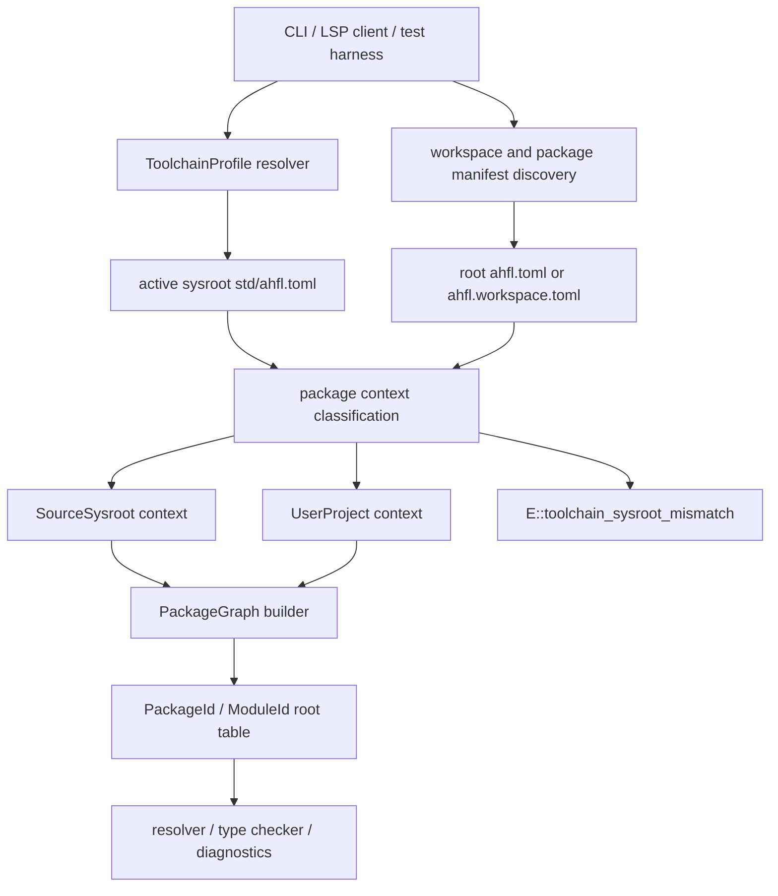

# RFC 0006: Corelib Development Sysroot

## Summary

本 RFC 提议把 AHFL 的 corelib 开发场景建模为一等 `ToolchainProfile`：CLI、LSP、VS Code extension 和测试工具必须先解析出唯一 active sysroot，再用该 sysroot 构建 [RFC 0005](./0005-package-configuration-system.zh.md) 定义的 PackageGraph。`std/` 源码在开发 AHFL 自身时可以作为 active sysroot 的 source package 参与分析，但不得同时被当成用户 workspace package 和外部 sysroot package。

本 RFC 不引入第二套 package graph builder。它把当前已经存在的 sysroot-only discovery、`ProjectContextKind::SysrootPackage` 和 `build_package_graph_from_sysroot` 正规化为 ToolchainProfile 驱动的公开契约，并删除 LSP / VS Code 中旧的隐式 sysroot 配置入口。

接受本 RFC 后，打开 `std/json.ahfl` 或 `std/collections.ahfl` 时出现的 duplicate package name、duplicate module prefix、user package cannot be named `std` 等错误，必须被替换为正确的 source-sysroot 分析结果，或在 sysroot 配置确实冲突时给出明确的 `E::toolchain_sysroot_mismatch` 诊断。

## Motivation

当前问题不是 `std` 单文件写法问题，而是工具链身份问题：VS Code extension 可以把随 extension 打包的 `std` 作为 sysroot，同时 LSP 又从当前 workspace 发现仓库里的 `std/ahfl.toml`，于是同一个逻辑标准库被加载成两个 package。PackageGraph 只能看到两个都叫 `std`、都声明 `module.prefix = "std"` 的包，因此报 duplicate package name / duplicate module prefix；当 workspace 里的 `std` 被当成普通用户 package 时，还会触发 user package cannot be named `std`。

成熟语言都会遇到类似问题。调研结论如下：

1. Rust 把 sysroot 作为工具链事实处理，rust-analyzer 有显式 `rust-analyzer.cargo.sysroot` 配置；rustc bootstrap 也区分构建 compiler、standard library 和 staged toolchain 的边界。参考 [rust-analyzer configuration](https://rust-analyzer.github.io/book/configuration.html) 与 [rustc bootstrap guide](https://rustc-dev-guide.rust-lang.org/building/bootstrapping/what-bootstrapping-does.html)。
2. Go 用 `GOROOT` 表示 Go distribution root，标准库属于工具链根，而不是当前 module 的普通依赖。参考 [cmd/go environment variables](https://pkg.go.dev/cmd/go#hdr-Environment_variables)。
3. Clang/clangd 把 builtin headers 和 system headers 作为 compiler resource / toolchain include graph 处理，避免用户 include root 与 compiler resource 混淆。参考 [clangd system headers guide](https://clangd.llvm.org/guides/system-headers)。
4. TypeScript 把默认库建模为 compiler options：`lib` 显式选择内建声明集合，`noLib` 显式关闭默认库。参考 [TSConfig lib](https://www.typescriptlang.org/tsconfig/lib.html) 与 [TSConfig noLib](https://www.typescriptlang.org/tsconfig/noLib.html)。
5. LSP 规范把 workspace folder、initialization options 和 configuration 作为 server 初始化输入；语言服务器不应把任意当前目录搜索结果当作工具链身份。参考 [LSP initialize](https://microsoft.github.io/language-server-protocol/specifications/lsp/3.17/specification/#initialize)。

这些系统的共同最佳实践是：标准库源码、工具链资源目录和用户工程根必须是不同概念。IDE 可以自动发现 project manifest，但不能靠模糊目录搜索决定 corelib 的身份。

## Goals

1. 定义 AHFL `ToolchainProfile`，让 sysroot 成为 CLI/LSP/package graph 的显式输入。
2. 定义 source-sysroot 模式，使 AHFL 仓库里的 `std/` 在开发 corelib 时被视为 active sysroot，而不是用户 package。
3. 禁止同一分析会话加载两个逻辑 `std` package。
4. 定义唯一 canonical LSP / VS Code 配置 schema，删除旧 `initializationOptions.sysroot`、`initializationOptions.ahfl.sysroot` 和 LSP 侧 `AHFL_SYSROOT` 读取路径。
5. 定义 `ToolchainProfileSet`，让 multi-root workspace 可以按 workspace folder 维护不同 profile。
6. 给出用户可理解的 sysroot mismatch diagnostics，显示 active sysroot 与当前文件所属 manifest。
7. 保持 [RFC 0005](./0005-package-configuration-system.zh.md) 的 PackageGraph、`PackageId(0)` 和 sysroot dependency model，不另起一套 std 特判。
8. 明确实现切片与测试矩阵，覆盖 CLI、LSP、多 workspace folder、VS Code extension、PackageGraph 和 stdlib fixtures。

## Non-Goals

1. 不改变 AHFL 源码 `import std::option as option;` 的表面语法。
2. 不设计 registry、version range、remote toolchain download 或 signed toolchain distribution。
3. 不设计标准库 overlay、SDK overlay 或多版本 std 并存机制；v1 一次分析只允许一个 active `std`。
4. 不让 workspace manifest 自动选择任意 sysroot。Workspace 可以声明 package 成员；toolchain profile 由 CLI 参数、LSP 配置、CLI 环境变量或 release 默认值提供。
5. 不为旧 JSON descriptor、旧 LSP initialization option 或旧 search-root 语义增加兼容路径。

## Design

### Design principle

AHFL 必须把三类 root 分开：

| 概念 | 作用 | 是否可被 import discovery 替代 |
| --- | --- | --- |
| Workspace root | 限定 LSP / CLI 从哪里找 `ahfl.workspace.toml` 和 package manifests | 否 |
| Package root | 某个 `ahfl.toml` 所在目录，产生用户 package / target / module root | 否 |
| Sysroot | 工具链根目录，必须包含 `std/ahfl.toml`，产生 `PackageId(0)` | 否 |

核心规则：manifest discovery 只能发现用户工程；toolchain profile 只能决定 sysroot。任何实现层把 `std` 作为“刚好搜到的 package”加载，都是错误分层。

整体流程如下：



### ToolchainProfile

所有公开入口都必须先构造 `ToolchainProfile`：

```text
ToolchainProfile
  sysroot_root: canonical directory whose std/ahfl.toml is active
  std_manifest: canonical path to <sysroot>/std/ahfl.toml
  origin: cli-flag | lsp-configuration | bundled-extension | environment | compile-default
  scope: global-default | workspace-folder-uri
  std_identity: checksum from RFC 0005 sysroot std checksum rules
  server_compatibility: same-build | compatible | incompatible
```

`ToolchainProfile` 是 analysis session 的输入，不是用户 package manifest 的字段。这样用户 package 不会偷偷改变 compiler 的工具链身份。

外部输入先归一化为 `std_manifest`，再派生 `sysroot_root`：

| 输入形态 | 合法性 | 归一化 |
| --- | --- | --- |
| `<root>` | 合法，若 `<root>/std/ahfl.toml` 存在 | `sysroot_root = canonical(<root>)` |
| `<root>/std/ahfl.toml` | 合法，若它是 standard-library manifest | `sysroot_root = canonical(<root>)` |
| `<root>/std` | 不合法 | 用户必须传 `<root>` 或 `<root>/std/ahfl.toml` |
| 任意其他 `ahfl.toml` | 不合法 | 报 `E::toolchain_sysroot_invalid` |

CLI 可以继续接受 `--sysroot` 和 `AHFL_SYSROOT`，因为它们是显式 command/process inputs。LSP 不得把 server process `AHFL_SYSROOT` 当成 profile source；LSP profile 必须来自 canonical LSP schema、VS Code extension bundled fallback 或 server compile-time default。

Sysroot 校验规则：

1. `sysroot_root` 和 `std_manifest` 必须规范化为绝对 canonical path。
2. `std_manifest` 必须存在。
3. `std/ahfl.toml` 必须声明 `[package].name = "std"`、`[package].kind = "standard-library"`、`[module].prefix = "std"`。
4. 任何未知 profile origin、缺失 sysroot、无效 std manifest 都是 hard error。
5. `std_identity` 按 RFC 0005 的 sysroot checksum 规则计算，用于 lockfile drift 和 LSP cache invalidation。
6. `server_compatibility = incompatible` 时，LSP 必须停止语义分析并报告配置错误，不能退回另一个 sysroot。

### ToolchainProfileSet

LSP 使用 `ToolchainProfileSet`，而不是单个 process-global path：

```text
ToolchainProfileSet
  default_profile: ToolchainProfile
  workspace_profiles: map<workspace-folder-uri, ToolchainProfile>
```

Profile selection 规则：

1. 每个 document 先归属最近的 containing workspace folder。
2. 若该 workspace folder 有显式 profile，使用它。
3. 否则使用 `default_profile`。
4. 同一个 PackageGraph 不得跨两个 profile；跨 profile path dependency 报 `E::toolchain_profile_ambiguous`。
5. Cache key 必须包含 workspace folder URI、`std_manifest` 和 `std_identity`。

`ToolchainProfileSet` 是 LSP server state 的一部分。当前实现中的单个 `explicit_sysroot_path` / `sysroot_path_` 必须迁移为 profile set；不能用一个 process-global optional path 近似 multi-root 行为。

### Source-sysroot context

当当前文档或显式 root manifest 归属的 `ahfl.toml` 与 `ToolchainProfile.std_manifest` 是同一个 canonical path 时，server 进入 source-sysroot context：

1. PackageGraph 只创建一个 `std` package，并固定为 `PackageId(0)`。
2. 该 package 的 source files 来自当前 checkout 的 `std/`，而不是 extension bundled `std`。
3. `package.kind = "standard-library"` 被允许，因为它正是 active sysroot。
4. `@builtin` 权限按 `std/ahfl.toml` 的 `compiler_intrinsics.allow` 校验。
5. 对 `std` 内文件的 diagnostics、semantic tokens、hover、completion 必须与用户工程使用同一个 resolver/typechecker。
6. Source-sysroot context 不创建用户 root package，因此不会触发 user package cannot be named `std`。

这不是针对 `std` 名字的局部绕过，而是 canonical path 驱动的 context classification：同一个 manifest 不能既是 sysroot manifest 又是用户 root manifest。

AHFL 当前已经有 sysroot-only graph 入口。实现本 RFC 时必须复用并正规化这条路径：

1. `ProjectContextKind::SysrootPackage` 仍表示 source-sysroot context。
2. `build_package_graph_from_sysroot` 仍是只创建 `PackageId(0)` 的构图入口。
3. `discover_project_context` 中“package manifest canonical path 等于 active `std_manifest`”的分支，必须从 `explicit_sysroot_path` 改为 `ToolchainProfile` 判定。
4. 不得新增平行的 sysroot-only builder 或 LSP-only std 特判。

### User project context

当 root manifest 与 active `std_manifest` 不是同一个 canonical path 时，PackageGraph 进入普通用户工程模式：

1. `std` 来自 active sysroot，并固定为 `PackageId(0)`。
2. 用户 package 从 `PackageId(1)` 开始分配。
3. 用户 package 不得声明 `[package].name = "std"`。
4. 用户 package 不得声明 `[package].kind = "standard-library"`。
5. 用户 package 不得声明 `[module].prefix = "std"`。
6. 如果用户工程依赖 `std = { source = "sysroot" }`，该依赖解析到 active `std_manifest`。

这些错误仍属于 PackageGraph / manifest diagnostics；source-sysroot context 只改变“当前 root manifest 是否就是 active sysroot manifest”的分类。

### Sysroot mismatch diagnostics

如果当前文档位于一个 `std/ahfl.toml` 包内，但该 manifest 与 active `ToolchainProfile.std_manifest` 不同，必须报新的工具链诊断，而不是继续构图直到 duplicate package name：

```text
error [E::toolchain_sysroot_mismatch]: this standard-library package is not the active AHFL sysroot
  active sysroot: <active>/std/ahfl.toml
  opened package: <workspace>/std/ahfl.toml
  help: configure ahfl.toolchain.sysroot to <workspace> when developing corelib
```

诊断 source range：

1. 如果 `std/ahfl.toml` 可解析，primary range 指向 `[package].kind = "standard-library"` 或 `[package].name = "std"`。
2. 如果 LSP 是从 `.ahfl` 文件触发并且 manifest 未打开，primary range 指向文件开头，related information 指向 manifest path。
3. 如果是配置错误，related information 必须显示 profile origin，例如 `bundled-extension` 或 `lsp-configuration`。

新增 diagnostic code：

| Code | 场景 |
| --- | --- |
| `E::toolchain_sysroot_missing` | profile 指向的 sysroot 不含 `std/ahfl.toml` |
| `E::toolchain_sysroot_invalid` | active `std/ahfl.toml` 不是合法 standard-library manifest |
| `E::toolchain_sysroot_mismatch` | 打开的 standard-library package 不是 active sysroot |
| `E::toolchain_profile_ambiguous` | 同一 workspace folder 被配置出多个互斥 sysroot |
| `E::toolchain_incompatible` | LSP server 与 sysroot identity / schema 不兼容 |

### CLI behavior

CLI sysroot precedence：

1. `--sysroot <path>`
2. `AHFL_SYSROOT`
3. compile-time default sysroot

`--sysroot` 和 `AHFL_SYSROOT` 接受两种输入：包含 `std/ahfl.toml` 的工具链根，或 `std/ahfl.toml` 本身。二者必须归一化到同一个 `ToolchainProfile.std_manifest`。例如，在 AHFL repo 内开发 corelib：

```bash
ahflc check --manifest std/ahfl.toml --sysroot .
ahflc check --manifest std/ahfl.toml --sysroot std/ahfl.toml
ahflc check std/json.ahfl --sysroot .
ahflc dump package-graph --manifest std/ahfl.toml --sysroot .
```

如果传入 `--manifest std/ahfl.toml --sysroot <other>`，而 `<other>/std/ahfl.toml` 不是同一个 canonical manifest，CLI 必须报 `E::toolchain_sysroot_mismatch`。它不得把 workspace `std` 当成用户 package 加载。

### LSP behavior

LSP 必须按 workspace folder 独立维护 `ToolchainProfile`。`workspaceFolders` 只定义配置和 manifest discovery 边界，不直接定义 sysroot。

LSP profile precedence：

1. `workspace/configuration` 中按 resource 查询到的 `ahfl.toolchain.sysroot`。
2. `initializationOptions.ahfl.toolchain.profiles[]` 中匹配 workspace folder URI 的 profile。
3. `initializationOptions.ahfl.toolchain.defaultSysroot`。
4. VS Code extension bundled sysroot，由 client 作为 initialization options 发送。
5. server compile-time default sysroot。

配置值为空字符串表示“没有显式配置”，不能表示当前目录。相对路径如果来自 workspace configuration，按对应 workspace folder 解析；如果来自 initialization options，client 必须发送绝对 URI 或绝对文件系统路径。

唯一 canonical initialization schema：

LSP 初始化输入示例：

```json
{
  "ahfl": {
    "toolchain": {
      "defaultSysroot": "/repo/AHFL",
      "profiles": [
        {
          "workspaceFolder": "file:///repo/AHFL",
          "sysroot": "/repo/AHFL"
        }
      ]
    }
  }
}
```

下列旧 schema 必须删除，server 不得继续读取：

1. `initializationOptions.sysroot`
2. `initializationOptions.ahfl.sysroot`
3. LSP server process `AHFL_SYSROOT`

如果 client 仍发送旧字段，server 可以忽略并产生 `E::toolchain_profile_ambiguous` / `E::toolchain_sysroot_missing` 诊断；不得静默把旧字段当作 active sysroot。

`didChangeConfiguration` 修改 sysroot 时，server 必须：

1. 用 resource-scoped `workspace/configuration` 重新构造对应 workspace folder 的 `ToolchainProfile`。
2. 清空该 profile 相关 PackageGraph、SourceGraph、semantic token 和 completion caches。
3. 对打开文档重新发布 diagnostics。
4. 如果新 profile 无效，保留语法级 diagnostics，但停止 resolver/typechecker。

多 workspace folder 规则：

1. 每个 workspace folder 可以有自己的 profile。
2. 一个 document 归属最近的 containing workspace folder。
3. 一个 PackageGraph 不得跨两个不同 sysroot profile。
4. 如果一个 workspace package 通过 path dependency 指向另一个 workspace folder，而双方 profile 不同，报 `E::toolchain_profile_ambiguous`。

### VS Code extension behavior

VS Code extension 必须提供 `ahfl.toolchain.sysroot` 设置，默认值为空。Release extension 可以把 bundled `std` 作为 fallback profile，但只有在用户没有 workspace/resource 配置且 initialization options 没有显式 profile 时才启用。

AHFL 仓库自身必须提交 repo-local `.vscode/settings.json`，显式声明：

```json
{
  "ahfl.toolchain.sysroot": "${workspaceFolder}"
}
```

该设置让打开 `std/json.ahfl` 时 active sysroot 指向当前 checkout，而不是 extension bundled sysroot。`${workspaceFolder}` 展开由 client 完成；server 只接收 canonical path。

Extension 不得再通过 server process environment 注入 `AHFL_SYSROOT`。它必须把 resolved bundled sysroot 或 workspace sysroot 写入 canonical initialization options，并在 `workspace/didChangeConfiguration` 中发送 `ahfl.toolchain.sysroot` 的变化。这样 profile origin 对 server、diagnostics 和用户都可见。

### PackageGraph integration

RFC 0005 的 PackageGraph builder 继续保持 `PackageId(0)` 和 sysroot package 规则。本 RFC 的重构边界在 project discovery / tooling entry，而不是新增一套 PackageGraph implementation。

当前 project discovery 入口从“document path + optional sysroot path”提升为：

```text
ProjectDiscoveryInput
  document_path: path
  workspace_boundaries: vector<WorkspaceBoundary>
  explicit_manifest_path: optional<path>
  explicit_workspace_manifest_path: optional<path>
  toolchains: ToolchainProfileSet
```

Discovery 先为 document 选择 `ToolchainProfile`，再把 root 归类为：

| Classification | 条件 | 行为 |
| --- | --- | --- |
| `SourceSysroot` | root manifest canonical path 等于 selected `toolchain.std_manifest` | 复用 `build_package_graph_from_sysroot`，只创建 `PackageId(0)` |
| `UserProject` | root manifest canonical path 不等于 `toolchain.std_manifest` | active `std` 为 `PackageId(0)`，root package 从 `PackageId(1)` 开始 |
| `Mismatch` | root package 声明 standard-library / name `std`，但 canonical path 不等于 `toolchain.std_manifest` | 报 `E::toolchain_sysroot_mismatch` |

所有内部 identity 继续使用 `PackageId` / `ModuleId` / `SymbolId`。路径和字符串只用于输入解析、cache key normalization 和 diagnostics。

实现要求：

1. 当前 `explicit_sysroot_path` 必须被 `ToolchainProfileSet` 替代。
2. 当前 `build_package_graph_from_sysroot` 必须保留为 source-sysroot 构图入口。
3. 当前 `build_package_graph_from_manifests` / `build_package_graph_from_workspace` 继续服务 `UserProject`。
4. `Mismatch` 必须在调用 user-project builder 前诊断，避免退化成 duplicate package name / duplicate module prefix。
5. 不得把 `std` 目录名、module prefix 或 package name 作为 source-sysroot 判定依据；判定只看 canonical manifest path。

### Cache and invalidation

LSP cache key 必须包含：

1. workspace folder URI
2. canonical root manifest path
3. `ToolchainProfile.std_manifest`
4. `ToolchainProfile.std_identity`
5. `ToolchainProfile.scope`
6. manifest checksum / lockfile identity

只用 package name 或 module prefix 做 cache key 是错误的，因为 source-sysroot 与 bundled-sysroot 可以同名但不是同一工具链输入。

## User Impact

用户工程的默认体验不变：未配置 sysroot 时，release extension 仍可使用 bundled `std`，CLI 仍可使用编译期默认 sysroot。

开发 AHFL 自身或修改 corelib 的贡献者需要显式配置当前 checkout 为 sysroot。配置完成后，打开 `std/*.ahfl` 将获得正常的 diagnostics、hover、semantic tokens 和 import resolution，不再出现 duplicate `std` 或 user package cannot be named `std`。

配置错误时，用户会看到工具链级诊断，包含 active sysroot、当前 package manifest 和修复建议。

## Compatibility and Migration

这是 developer-facing breaking change。

影响范围：

1. LSP server initialization options schema 增加 `ahfl.toolchain.defaultSysroot` 和 `ahfl.toolchain.profiles[]`，并删除 `initializationOptions.sysroot` / `initializationOptions.ahfl.sysroot`。
2. VS Code extension 需要新增 `ahfl.toolchain.sysroot` setting，并调整 bundled sysroot fallback 优先级。
3. Project discovery 入口需要接受 `ToolchainProfileSet`，不能继续从任意 search root 猜测 sysroot。
4. stdlib / corelib 开发文档需要要求 AHFL repo workspace 配置 `"ahfl.toolchain.sysroot": "${workspaceFolder}"`。
5. 依赖旧 LSP `AHFL_SYSROOT` 或旧 initialization option 隐式覆盖 VS Code bundled sysroot 的流程，需要迁移到显式 LSP/extension setting。
6. `ProjectInput.include_stdlib`、`ProjectInput.stdlib_search_roots`、`builtin_stdlib_search_roots()`、`AHFL_SOURCE_DIR` std probe 和 cwd upward std probe 不得继续服务 CLI / LSP / formatter / public project-aware entry。

迁移步骤：

1. 为 CLI 保留 `--sysroot` 和 `AHFL_SYSROOT`，但先归一化为 `ToolchainProfile` 再调用 discovery / builder。
2. 为 VS Code extension 增加 setting；AHFL repo 提交 `.vscode/settings.json`，设置 `"ahfl.toolchain.sysroot": "${workspaceFolder}"`。
3. LSP 删除旧 sysroot initialization option parser 和 process-env sysroot fallback；extension 改为发送 canonical initialization options。
4. 将 duplicate `std` 错误替换为 source-sysroot classification 或 `E::toolchain_sysroot_mismatch`。
5. 更新 `docs/reference/lsp-vscode-extension.zh.md`、stdlib cookbook 和 contributor guide。
6. 删除工具层独立 std search-root 推断路径，或将底层 `ProjectInput` 的 std 入口限制为无法被 public CLI/LSP 触达的 isolated unit-test helper。

## Implementation Plan

1. Toolchain profile model：新增 `ToolchainProfile`、`ToolchainProfileSet`、origin enum、scope、canonical path normalization、std manifest validation、checksum 计算入口。
2. Project discovery integration：把 `explicit_sysroot_path` / `sysroot_path_` 迁移为 `ToolchainProfileSet`，在 discovery 阶段完成 SourceSysroot / UserProject / Mismatch 分类。
3. PackageGraph reuse：保留 `build_package_graph_from_sysroot` 作为 SourceSysroot 入口；普通 manifest / workspace builder 不新增 std 特判。
4. Diagnostics：新增 `E::toolchain_*` codes，确保所有 diagnostic 携带 source range 和 related information。
5. CLI：将 `--sysroot`、`AHFL_SYSROOT`、compile default 解析为 `ToolchainProfile`；补 `std/ahfl.toml --sysroot .` 和 `std/ahfl.toml --sysroot std/ahfl.toml` 开发路径。
6. LSP server：实现 canonical `initializationOptions.ahfl.toolchain` parser；删除旧 `initializationOptions.sysroot`、`initializationOptions.ahfl.sysroot` 和 LSP process `AHFL_SYSROOT` fallback；按 workspace folder 缓存 profile。
7. VS Code extension：新增 `ahfl.toolchain.sysroot` setting，解析 `${workspaceFolder}`，通过 initialization options / didChangeConfiguration 发送 canonical profile，不再注入 `AHFL_SYSROOT`。
8. Repository config：为 AHFL 自身开发提交 `.vscode/settings.json`，确保 corelib 文件默认使用 repo sysroot。
9. Std search cleanup：删除或隔离 `ProjectInput.include_stdlib`、`ProjectInput.stdlib_search_roots`、`builtin_stdlib_search_roots()`、`AHFL_SOURCE_DIR` std probe 和 cwd upward std probe 对 public entry 的影响。
10. Reference docs：更新 LSP/VS Code reference、contributor guide、stdlib cookbook 和 package configuration examples。

## Test Plan

1. ToolchainProfile unit tests：valid sysroot root、valid `std/ahfl.toml` path、missing `std/ahfl.toml`、invalid standard-library manifest、canonical path equivalence、checksum change invalidation。
2. Project discovery tests：manifest 等于 selected `std_manifest` 时走 `ProjectContextKind::SysrootPackage`；manifest 是另一个 standard-library package 时产生 `E::toolchain_sysroot_mismatch`；普通 package 继续走 UserProject。
3. PackageGraph tests：`build_package_graph_from_sysroot` 只生成 `PackageId(0)`；用户 package name/prefix `std` 仍报错；普通 builder 不新增 std 特判。
4. CLI integration tests：`ahflc check std/json.ahfl --sysroot .`、`ahflc check std/json.ahfl --sysroot std/ahfl.toml`、普通用户 package import `std`、lockfile sysroot checksum drift。
5. LSP schema tests：canonical `initializationOptions.ahfl.toolchain.defaultSysroot` / `profiles[]` 生效；旧 `initializationOptions.sysroot` 和 `initializationOptions.ahfl.sysroot` 不再生效。
6. LSP behavior tests：workspace configured sysroot opens `std/collections.ahfl` without duplicate diagnostics；bundled sysroot plus workspace `std` reports mismatch；didChangeConfiguration rebuilds diagnostics。
7. VS Code extension tests：setting resolution、`${workspaceFolder}` expansion、initializationOptions payload、bundled fallback ordering、no `AHFL_SYSROOT` injection。
8. Multi-root tests：不同 workspace folder profile 隔离；cross-folder path dependency with different profiles 报 `E::toolchain_profile_ambiguous`。
9. Std search cleanup tests：public CLI/LSP path 不受 `AHFL_SOURCE_DIR`、cwd upward std probe、`ProjectInput.stdlib_search_roots` 影响。
10. Regression fixtures：覆盖当前 duplicate package name、duplicate module prefix、user package cannot be named `std` 三类现象。

## Rollout and Stabilization

1. `draft`：确认 ToolchainProfile schema、ToolchainProfileSet schema、LSP setting 名称、diagnostic code 名称。
2. `review`：compiler、stdlib、tooling owner 评审 source-sysroot classification 是否与 RFC 0005 PackageGraph 一致。
3. `accepted`：冻结 profile precedence、canonical LSP schema、VS Code setting 和 AHFL repo `.vscode/settings.json` 策略。
4. `implementing`：按 implementation plan 拆分 PR；每个 PR 必须包含对应测试。
5. `implemented`：CLI、LSP、VS Code extension、PackageGraph、docs 全部落库，当前 corelib 文件不再产生 duplicate `std`。
6. `stabilized`：release evidence 记录 VSIX bundled sysroot、repo source-sysroot 和普通用户工程三条路径均通过。

## Alternatives

1. 在 LSP 里特判 `std` 目录。缺点是把 package identity 问题放到工具层字符串判断，绕过 PackageGraph，并且无法解释 CLI 和测试中的同类问题。
2. 总是优先使用 workspace 中的 `std`。缺点是普通用户工程若有名为 `std` 的目录，会意外覆盖 release extension bundled sysroot；这与 Rust/Go/Clang/TypeScript 的工具链资源分层相反。
3. 继续只使用 `AHFL_SYSROOT`。缺点是 VS Code / LSP 配置不可见，multi-root workspace 无法表达，diagnostics 不能解释 profile origin。
4. 允许两个 `std` 并存并做 overlay。缺点是需要 SDK overlay、版本匹配、shadowing 和 symbol identity 规则；AHFL v1 没有需求，也会破坏 `PackageId(0)` 的简单性。
5. 把 sysroot 写入 `ahfl.toml`。缺点是用户 package manifest 会改变 compiler toolchain 身份，构建可复现性和 IDE 配置边界都变差；package 可以声明需要 `std`，但不能选择工具链根。
6. 保留 `initializationOptions.sysroot` 和 `initializationOptions.ahfl.sysroot` 作为 alias。缺点是继续制造双入口，extension、tests 和第三方 client 会分裂到不同 schema；AHFL 当前阶段应删除旧入口。
7. LSP 只维护一个 process-global sysroot。缺点是 multi-root workspace 无法表达不同工具链，且 path dependency 跨 workspace folder 时无法给出明确 profile conflict diagnostic。

## Open Questions

1. `server_compatibility` 第一版是否只校验 manifest schema version，还是也校验 compiler build id？
2. 未来是否需要 SDK overlay RFC，用于平台标准库扩展？本 RFC v1 明确不实现。

## Decision History

- 2026-07-03: Draft opened after diagnosing corelib development duplicate `std` diagnostics in VS Code/LSP.
- 2026-07-03: Implementation started for ToolchainProfile-driven discovery, canonical LSP/VS Code sysroot configuration, and CLI sysroot normalization.
