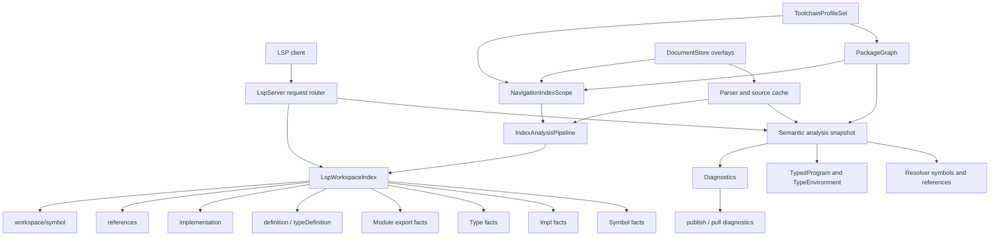
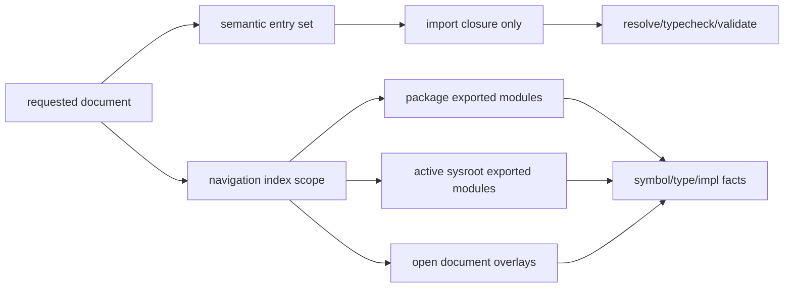
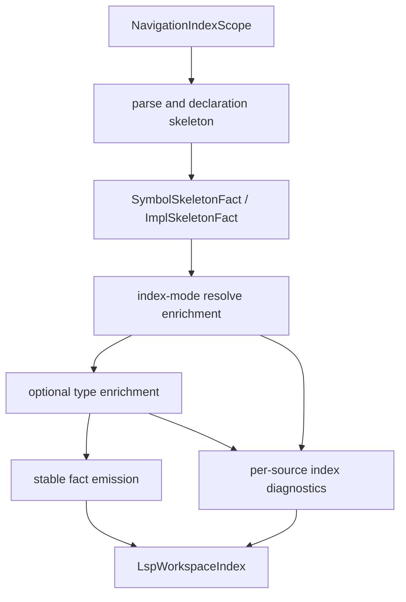
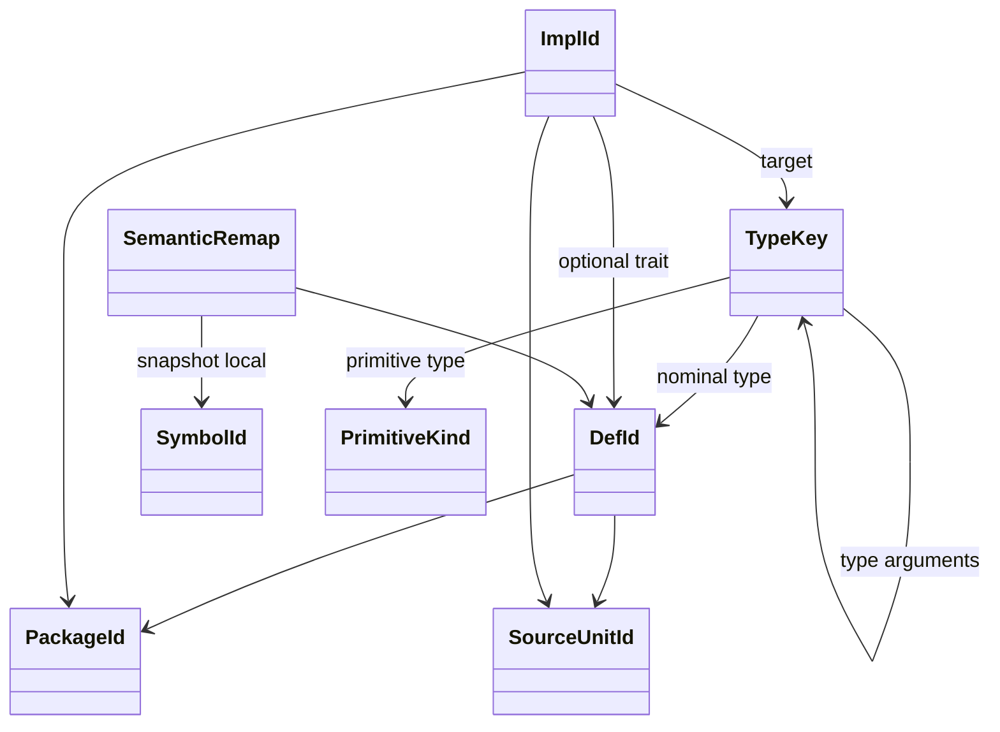

# RFC 0007: LSP Workspace Navigation Index

## Summary

本 RFC 提议把 AHFL LSP 的「编译语义图」和「IDE 导航索引」拆成两个一等子系统：编译语义图继续只表达语言可见性、import 闭包、typecheck 和 diagnostics；导航索引按 PackageGraph、sysroot profile 和打开文档 overlay 构建 package-wide facts，用于 `definition`、`typeDefinition`、`implementation`、`references`、workspace symbol、code lens 和后续 rename 预览等 IDE 功能。

接受本 RFC 后，LSP 不再通过把额外 std 模块塞进当前编译入口来获得 `impl` 候选。打开 `std/collections.ahfl` 时，`Int` 的定义跳转可以看到 canonical primitive home，`textDocument/implementation` 可以看到 `std::fmt`、`std::json` 等 exported std 模块里的 `impl Int`；但这些导航事实不得让 `std::prelude::some`、`std::fmt::format` 等没有 import 的符号变成当前文件的可见语义。

本 RFC 继承 [RFC 0005](./0005-package-configuration-system.zh.md) 的 PackageGraph 规则和 [RFC 0006](./0006-corelib-development-sysroot.zh.md) 的 ToolchainProfile/source-sysroot 规则；它只定义 LSP 如何消费这些事实形成 IDE 索引，不改变 AHFL 语言 import 语义。

## Motivation

当前 LSP 的 `LspAnalysisSnapshot` 同时承担两个职责：

1. 编译职责：按当前文件和 import 闭包构建 SourceGraph，执行 resolve/typecheck/validate，并产生 diagnostics。
2. IDE 职责：给 hover、definition、implementation、references、workspace symbol 等功能提供导航事实。

这两个职责在普通用户工程中经常重合，但在 corelib/sysroot 开发时会分裂：`std/collections.ahfl` 不 import `std::fmt`，因此编译语义图不应看见 `std::fmt` 的 free functions；但 IDE 导航又应该知道 `std::fmt` 里存在 `impl Int`，否则用户点击 `Int` 时只能跳到 `std/int.ahfl`，看不到 `std/fmt.ahfl` 中真正影响用户体验的 formatting 实现。

成熟语言服务器通常把「当前文件 AST/语义」和「全工程索引」分开。LSP 3.17 明确定义了 `textDocument/definition` 与 `textDocument/implementation` 两类请求，二者都可以返回多个 location，见 [LSP 3.17 specification](https://microsoft.github.io/language-server-protocol/specifications/lsp/3.17/specification/)。clangd 的 index 明确服务于「当前文件 AST 不足以回答的 LSP 功能」，见 [clangd indexing design](https://clangd.llvm.org/design/indexing)。rust-analyzer 的 `ide` crate 也把 IDE-facing API 与 HIR/semantic analysis 分层，见 [rust-analyzer ide crate docs](https://rust-lang.github.io/rust-analyzer/ide/)。

AHFL 需要同样的边界：

1. 语义图必须保守，不能因为 IDE 需要导航就扩大语言可见性。
2. 导航索引必须宽，不能因为当前文件没有 import 某个 exported module 就漏掉用户期望的 impl/reference 候选。
3. 两者必须共享 canonical identity，而不是在 LSP 层用字符串路径和文本扫描补洞。

## Goals

1. 定义 `LspWorkspaceIndex`，为 LSP 提供 package-wide navigation facts。
2. 明确 `SemanticSourceGraph` 与 `NavigationIndexGraph` 的边界：前者驱动 diagnostics，后者驱动 IDE 导航。
3. 支持 source-sysroot/corelib 开发：active std package 的 exported modules 可以参与导航索引，但不改变当前文件的 import 可见性。
4. 为 primitive types 建立结构化导航身份：使用 `PrimitiveKind` / `TypeKey`，不得以 `"primitive:Int"` 字符串作为 canonical identity。
5. 为 declarations 和 impl blocks 建立结构化 `DefId` / `ImplId` 与 source location store，使 `textDocument/implementation` 能稳定返回所有可见索引候选。
6. 规范 `definition`、`typeDefinition`、`implementation` 和 `references` 的职责，避免把所有跳转都塞进一个 handler。
7. 支持 open-document overlay、增量 invalidation、workspace folder/toolchain profile cache key 和 package graph drift。
8. 给出当前过渡实现到最终架构的迁移计划和测试矩阵。

## Non-Goals

1. 不改变 AHFL import、module visibility、prelude injection 或 package dependency 语义。
2. 不引入 remote index server、持久磁盘索引、daemon 共享索引或跨 checkout 缓存；这些可以后续单独设计。
3. 不设计 registry/package version solving；索引只消费 RFC 0005/0006 已定义的 PackageGraph 和 ToolchainProfile。
4. 不让普通用户工程自动加载整个 std exported module 集合作为编译语义输入。
5. 不把 `definition` 规定为必须展示所有 impl。`implementation` 才是 impl 列表的规范入口；`definition` 对 primitive 的多候选行为只是过渡期 UX fallback。
6. 不要求 rename 立即跨未打开文件安全执行。跨索引 rename 必须等 source edit planning 和 conflict detection 完整落地后再启用。

## Design

### Architecture



核心规则：

1. `SemanticSnapshot` 是编译事实；它必须只加载当前 target entry、显式 import 闭包、profile 决定的 sysroot primitive home，以及 typechecker 必须要看的依赖。
2. `LspWorkspaceIndex` 是 IDE 事实；它可以索引当前 package、workspace dependencies、active sysroot exported modules 和打开文档 overlay。
3. `LspWorkspaceIndex` 不能向 resolver/typechecker 注入可见符号，不能改变 diagnostics。
4. `LspWorkspaceIndex` 中的每条 fact 必须能追溯到 `(PackageId, SourceUnitId, SourceRange, revision)`。

### Graph separation

当前 `ProjectInput.entry_files` 同时决定了编译和导航范围。RFC 0007 接受后必须拆开：



`SemanticEntries` 与 `IndexScope` 可以共享 parser、source cache 和 diagnostics rendering，但不得共享「可见性」结论。

### Index analysis pipeline

`LspWorkspaceIndex` 必须由独立的 `IndexAnalysisPipeline` 产生，不能通过扩大 `ProjectInput.entry_files` 或复用当前 `SemanticSnapshot` 的可见性集合来间接生成。



Pipeline 阶段：

1. `parse and declaration skeleton`：只要求 parse 成功到足以抽取 module header、import header、type/function/enum/trait/impl declaration header。该阶段产出 `Parsed` completeness 的 skeleton facts。
2. `index-mode resolve enrichment`：在 index scope 内解析 qualified names、impl target、trait target 和 reference target，但解析结果只写入 index builder，不得写回当前文件的 resolver scope。
3. `optional type enrichment`：在依赖 facts 可用时为 signatures、impl target、generic arguments 生成 `TypeKey`；失败时写入 `ErrorTypeKey` 或 `UnknownTypeKey`，不得阻断 skeleton facts。
4. `stable fact emission`：把临时 AST/resolver handles remap 成 `DefId`、`ImplId`、`ReferenceFactId` 等 index IDs，并记录 completeness。

这意味着 index 可以复用 parser、token ranges、source cache 和部分 resolver/typechecker 代码路径，但必须运行在显式的 index mode 中。index mode 的输出是导航 facts；它不是一个更宽的编译输入集合。

### Index scope rules

`LspWorkspaceIndex` 的 scope 是一个显式数据结构，不能由 LSP handler 临时拼文件列表。v1 采用以下 scope 矩阵：

| Scope | Index policy | Required facts | Semantic visibility |
| --- | --- | --- | --- |
| 当前文件的 semantic import closure | eager | declarations、references、types、impls | 按语言规则可见 |
| 当前 package 可证明归属的 sources | eager for open package, lazy refresh allowed for cold files | declarations、exported/private module facts、impls | 只有 import closure 可见 |
| workspace/path dependencies | lazy, query-triggered | exported declarations、exported impls、imported private facts | 只有显式 dependency/import 可见 |
| active sysroot in ordinary user package | lazy for implementation/workspace-symbol/references queries | exported primitive homes、exported declarations、exported impls | 不自动进入 SemanticSourceGraph |
| active source-sysroot development | eager for active std package exported modules | exported declarations、impls、module facts、per-source diagnostics | `std::prelude` 不自动注入 |
| open document overlays outside resolved graph | eager while open | parsed skeleton facts and best-effort enrichment | 不改变当前 package resolution |

当前 package 的“可证明归属 sources”包括 PackageGraph 已知的 target entries、exports、transitive imports，以及位于当前 package module root 下并已打开的 overlay。RFC 0005 后续如果增加完整 source enumeration，这一集合会自然扩大；RFC 0007 不通过文件系统递归扫描来发明 package ownership。

第 4 条意味着普通用户在 `Int` 上执行 `implementation` 时可以看到 `std::fmt` 的 `impl Int`；但 `std::fmt::format` 不能在未 import 时成为 callable。

### Identity model

索引内部必须使用稳定、结构化、index-owned identity。`SymbolId` 和 compiler `SourceId` 是单次 semantic snapshot 的局部 handle，不能作为 `LspWorkspaceIndex` 的 canonical key。



要求：

1. Primitive type identity 使用 `PrimitiveKind::{Unit, Bool, Int, Float, String, UUID, Timestamp, Duration, Decimal(scale)}`。
2. Source identity 使用 PackageGraph 分配的 `SourceUnitId`。文件路径、module spelling 和 URI 只能参与 PackageGraph 输入解析，不能在 LSP index 层直接作为 canonical key。
3. Nominal declarations 使用 `DefId`。`DefId` 由 index flat store 分配，输入维度至少包含 `PackageId`、`SourceUnitId`、declaration ordinal 和 namespace；实现可以维护 numeric fingerprint 作为 drift detection，但不得把字符串 spelling 当 key。
4. `SymbolId` 只存在于 `SemanticRemap`：`DefId -> optional<SymbolId>`。semantic snapshot 重建后 remap 可以变化，index facts 不因此失效。
5. Generic type identity 使用 interned `TypeKey`，内部可复用 `TypeContext` hash-consed type，但索引 key 必须可比较，并能表达 `UnknownTypeKey` 与 `ErrorTypeKey`。
6. Impl identity 使用 `ImplId`。`ImplId` 由 `(PackageId, SourceUnitId, impl ordinal)` 对应的 flat store 位置稳定派生，不能把 `impl Int` 的文本 spelling 或 byte offset 当唯一身份。
7. 用户可见字符串只用于 diagnostic、hover、workspace symbol display 和排序 tie-breaker。

### Fact model

第一版 `LspWorkspaceIndex` 至少包含：

```text
SymbolFact {
  def_id: DefId
  package_id: PackageId
  source_unit_id: SourceUnitId
  kind: SymbolKind
  namespace: SymbolNamespace
  display_name: string
  declaration_range: SourceRange
  selection_range: SourceRange
  completeness: FactCompleteness
}

ImplFact {
  impl_id: ImplId
  package_id: PackageId
  source_unit_id: SourceUnitId
  target_type: TypeKey
  trait_def: optional<DefId>
  declaration_range: SourceRange
  trait_range: optional<SourceRange>
  target_range: optional<SourceRange>
  methods: vector<ImplMethodFact>
  completeness: FactCompleteness
}

ReferenceFact {
  source_unit_id: SourceUnitId
  range: SourceRange
  target_def: optional<DefId>
  reference_kind: ReferenceKind
  completeness: FactCompleteness
}
```

`FactCompleteness` 至少包含：

1. `Parsed`：parse declaration skeleton 可用，但 names/types 尚未可靠解析。
2. `Resolved`：name resolution 可用，部分 type facts 可能未知。
3. `Typed`：`TypeKey` 和 impl target facts 完整可用。
4. `Invalid`：source 当前无法产生可靠 skeleton；该状态必须保留 per-source diagnostics，不得清空其他 source 的 facts。

实现时应放进 flat stores：

1. `std::vector<SymbolFact>` + `SymbolFactId`
2. `std::vector<ImplFact>` + `ImplId`
3. `std::vector<ReferenceFact>` + `ReferenceFactId`
4. index maps 只用于查询：`TypeKey -> vector<ImplId>`、`DefId -> vector<ReferenceFactId>`、`PackageId -> vector<SourceUnitId>`。

partial facts 是产品语义，不是异常路径。一个 std helper module 处于 `Parsed` 或 `Resolved` 状态时，`workspace/symbol` 仍可返回它的 declarations；`implementation` 只返回 target type 已达到 `Typed` 或可证明等价的 impl facts；`references` 可以返回 resolved references，并把 unresolved references 留给 diagnostics。

### LSP request semantics

`definition`：

1. 对普通 symbol reference，返回 declaration location。
2. 对 primitive type，返回 synthetic primitive declaration location。当前可继续以 std home module 的 `impl <Primitive>` selection range 作为过渡锚点。
3. 不应长期混入 impl list。LSP `LocationLink` 只能携带 origin/target ranges，不能携带 command；如果需要提示 `Go to Implementation`，server 必须通过 CodeLens、CodeAction 或客户端命令绑定实现。

`typeDefinition`：

1. 对 value expression 返回其 type declaration。
2. 对 primitive expression 返回 primitive home 或 synthetic primitive declaration。
3. 第一版可以只声明 capability，不立即实现。

`implementation`：

1. 对 trait symbol 返回所有 `impl Trait for Target` 或未来 trait impl facts。
2. 对 nominal type 返回所有 target type 等于该 type 的 inherent impl 和 trait impl。
3. 对 primitive type 返回所有 target type 等于该 primitive `TypeKey` 的 impl facts，包括 `std::fmt`、`std::json` 等 exported std modules。
4. 返回 `Location[]` 或 `LocationLink[]`，排序稳定：package order、source order、impl order。

`references`：

1. 对 source-visible symbol 使用 semantic references。
2. 对 workspace-wide symbol 使用 index references。
3. 对 impl-target references 可以提供 future code lens，而不是把 impl target 当普通 reference。

### Source-sysroot and std behavior

RFC 0006 已定义 active sysroot。RFC 0007 只补充 LSP index behavior：

1. active sysroot package 的 exported modules 可以进入 `LspWorkspaceIndex`。
2. `std::prelude` 可以被索引为 module/symbol facts，但不得被自动加入 SemanticSourceGraph。
3. source-sysroot 开发时，打开 `std/*.ahfl` 不应退化为普通用户 package。
4. `std` module indexing 必须来自 PackageGraph exports，不得硬编码 `fmt`、`json` 或任意文件名。
5. 如果 exported module parse/resolve/typecheck 有错误，索引必须记录 partial facts、`FactCompleteness` 和 per-source diagnostics，不得让一个 std 辅助模块错误阻塞当前文件的基础编辑体验。

### Cache and invalidation

`LspWorkspaceIndex` cache key 必须包含：

1. workspace folder uri
2. root/workspace manifest path
3. active sysroot manifest path
4. active sysroot identity/checksum
5. package graph revision
6. open document overlay revision set
7. compiler schema / index schema version
8. index identity schema version

失效规则：

1. 当前文件内容变化：重建该 source 的 parse facts、semantic facts 和 index facts。
2. import/module declaration 变化：重建 semantic graph 和 impacted package index。
3. `ahfl.toml` / `ahfl.workspace.toml` 变化：重建 PackageGraph 和 index scope。
4. toolchain profile 变化：丢弃 sysroot facts，重建 active sysroot index。
5. 非打开文件变化：通过 file watcher 标记对应 source stale；下一次查询可同步刷新或返回 stale-safe partial results。

### Transitional compatibility

当前已经落地的过渡行为只能作为未完成状态的描述，不构成兼容性承诺。RFC 0007 implemented 时必须删除这些路径：

1. `definition` 对 primitive 返回 canonical home + impl candidates，满足 VS Code 默认 Cmd-click UX。
2. `implementation` 返回语义层已有 `TypeEnvironment::impls()` 里的 impl locations。
3. source-sysroot 打开 std 文件时临时加载 std exported modules。

但这些行为必须被标记为临时实现细节。最终架构中：

1. std exported modules 属于 `LspWorkspaceIndex` scope，不属于 SemanticSourceGraph entries。
2. primitive identity 不再使用 string normalized key。
3. impl candidate 查询不再依赖当前 source graph 是否恰好 typecheck 了某个 module。

## User Impact

用户可见变化：

1. 在 `std/collections.ahfl`、`std/json.ahfl`、`std/time.ahfl` 等 corelib 文件中，对 `Int`、`Bool`、`String` 等 primitive 执行 `Go to Implementation` 会显示所有 relevant std impl，而不是只显示 primitive home。
2. 在普通用户工程中，LSP 仍不会因为 sysroot index 看到了 `std::prelude` 就让 `some`、`Ok`、`format` 成为隐式可调用符号。
3. `definition`、`implementation`、`references` 的候选顺序稳定，不随 hash map iteration 改变。
4. 大型 workspace 中首次打开文件可能多一次 background indexing；后续导航应少做 full recompute。
5. diagnostics 不因 navigation index 扩大而新增未 import symbol 的成功解析。

## Compatibility and Migration

本 RFC 对 AHFL 源码语义不构成 breaking change。它改变的是 LSP 内部架构和 IDE 导航行为。

迁移要求：

1. `src/tooling/lsp/analysis_service.cpp` 中把额外 entry files 用作导航索引的过渡实现，必须迁移到独立 `LspWorkspaceIndex` builder。
2. `src/tooling/lsp/server.cpp` 中 primitive normalized string key 必须迁移为 `PrimitiveKind` / `TypeKey`，declaration identity 必须迁移到 `DefId`。
3. `textDocument/definition` 中 primitive 多候选 fallback 必须被标注为 compatibility UX；长期应把 impl list 放在 `textDocument/implementation`。
4. 现有 LSP handler tests 继续保留，新增 index-builder unit tests 后应把“std exported impl modules”测试下沉到 index 层。
5. VS Code extension 不需要改变配置 schema；它只会看到更多标准 LSP candidates。

## Implementation Plan

1. 数据模型：新增 `include/ahfl/tooling/lsp/workspace_index.hpp` 或同等内部 header，定义 `LspWorkspaceIndex`、`DefId`、`ImplId`、`SymbolFact`、`ImplFact`、`ReferenceFact`、`FactCompleteness`、`TypeKey`、`PrimitiveKind` 和 flat-store IDs。
2. Source unit registry：在 PackageGraph/LSP 边界建立 `SourceUnitId` 分配和 overlay remap，禁止 LSP index 以 URI/path string 作为 canonical key。
3. Index scope：从 PackageGraph 构建 `NavigationIndexScope`，按 scope 矩阵覆盖 root/workspace packages、dependencies、active sysroot exports 和 open overlays。
4. Parser reuse：让 semantic analysis 和 workspace index 共用 parse cache；不得重复读取同一 source 文件。
5. Skeleton extraction：从 AST module/declaration/impl headers 产出 `Parsed` skeleton facts，即使 resolver/typechecker 失败也保留可用 declarations。
6. Index-mode enrichment：新增 index mode resolve/type enrichment，把 resolved names、references、impl target `TypeKey` 写入 index facts，但不得写入当前 semantic resolver scope。
7. Primitive model：把 primitive type syntax、TypeEnvironment normalize key、LSP primitive fallback 统一改成 `PrimitiveKind` / `TypeKey`。
8. Handler migration：让 `definition`、`typeDefinition`、`implementation`、`references`、`workspace/symbol` 查询 `LspWorkspaceIndex`，再按请求语义回退到 current semantic snapshot。
9. Source-sysroot cleanup：删除 LSP 层把 std exported modules 加进 semantic entry files 的过渡路径。
10. Incrementality：把 index cache key 接入 `workspace_revision`、toolchain cache key、open document revision、manifest watcher 和 index identity schema version。
11. Diagnostics guard：增加测试证明 index-only module 不影响 resolver/typechecker 的可见性，index diagnostics 不覆盖当前 semantic diagnostics。
12. Documentation：更新 LSP/VS Code reference、developer docs 和 RFC 0006 decision history。

## Test Plan

1. Unit tests：`PrimitiveKind` / `TypeKey` / `DefId` / `ImplId` equality、hashing、serialization、ordering 和 semantic remap。
2. Source unit tests：PackageGraph source、open overlay、manifest change、file watcher change 均生成稳定 `SourceUnitId`，且 URI/path string 不进入 canonical identity。
3. Index scope tests：root package exports、当前 package private/open modules、workspace dependencies、path dependencies、active sysroot exports、prelude exclusion、open overlay priority。
4. Index pipeline tests：parse skeleton 成功但 resolve/typecheck 失败时保留 `Parsed`/`Resolved` facts，并记录 per-source index diagnostics。
5. LSP protocol tests：`definition`、`typeDefinition`、`implementation`、`references`、workspace symbol 使用 index facts；`LocationLink` payload 不包含 command。
6. Corelib tests：打开 `std/collections.ahfl`，`set_raw_size -> Int` 的 implementation 包含 `std/int.ahfl`、`std/fmt.ahfl`、`std/json.ahfl`。
7. Visibility negative tests：普通用户工程未 import `std::prelude` 时，`some<Int>(1)` 仍报告 unknown callable；index-only module 中存在的 `Duration` 不会让当前文件的 undefined type diagnostic 消失。
8. Multi-root tests：两个 workspace folder 使用不同 ToolchainProfile 时，index facts 不互相污染。
9. Stale overlay tests：未保存的 `std/fmt.ahfl` 新增 `impl Decimal(0)` 后，implementation 查询立刻反映 overlay。
10. Ordering tests：同一 `TypeKey` 的多个 impl 按 package/source/impl order 稳定返回。
11. Performance tests：普通用户工程首次 hover/definition 不 eager typecheck 所有 std exported modules；source-sysroot std 开发按 active std package eager index。
12. RFC checker：`python3 scripts/check-rfc.py` 必须通过。

## Rollout and Stabilization

1. `draft`：确认 index scope、primitive identity、LSP request semantics 和 prelude guard。
2. `review`：compiler、stdlib、tooling owner 评审语义图与导航索引边界。
3. `accepted`：冻结 `LspWorkspaceIndex` 数据模型、cache key 和 handler fallback 策略。
4. `implementing`：按 implementation plan 分 PR；每个 PR 必须带 index-layer tests。
5. `implemented`：LSP handler 不再通过扩大 semantic entry files 获得 package-wide navigation candidates。
6. `stabilized`：release evidence 覆盖 ordinary user package、source-sysroot std development、multi-root workspace 和 VS Code extension bundled sysroot。

## Alternatives

1. 继续把 std exported modules 加入当前 semantic entries。优点是实现简单；缺点是导航需求污染编译语义，会让 prelude、fmt、json 等模块的符号可见性变得难以解释。
2. 只让 `textDocument/implementation` 查当前 TypeEnvironment。优点是符合 LSP 请求语义；缺点是当前 TypeEnvironment 只覆盖当前 semantic graph，漏掉未 import 但 package-wide relevant 的 impl。
3. 在 primitive definition handler 里硬编码 `std::fmt`、`std::json`。优点是能修当前用户截图；缺点是违反 PackageGraph 和 structured identity 原则，后续每加一个 std module 都要改 LSP。
4. 强制 corelib 模块 import 所有 impl-bearing modules。优点是 LSP 不用改；缺点是改变源码依赖图，把 IDE 导航问题转嫁给标准库设计。
5. 普通用户工程也总是全量 typecheck std exported modules。优点是索引完整；缺点是启动成本高，且容易把 std internal diagnostics 和用户编辑体验耦合。
6. 只做 full-text search。优点是快；缺点是泛型、type alias、trait impl、primitive types 和 source ranges 都不可靠，违背 AHFL 的 typed compiler architecture。

## Open Questions

1. `typeDefinition` 是否在 RFC 0007 第一阶段就公开 provider，还是先内部实现、等 coverage 达标后再 advertise？
2. `LspWorkspaceIndex` 是否需要磁盘缓存，还是 v1 只做进程内 cache？
3. Trait impl 语法 `impl Trait for Target` 落地后，现有 inherent-impl-with-matching-methods 的 std 表达方式如何迁移到同一 `ImplFact` model？
4. RFC 0005 是否需要补充完整 package source enumeration，以便 current package private modules 在未打开、未 import 时也能进入 index？
5. `DefId` 的 v1 source-order ordinal 在大规模编辑下是否足够稳定，还是需要后续引入语法节点级 numeric fingerprint？
6. `definition` primitive 多候选 fallback 何时移除，是否需要 VS Code extension 侧绑定默认快捷键到 implementation？

## Decision History

- 2026-07-04: Draft opened after debugging primitive type navigation in `std/collections.ahfl` and identifying the need to separate navigation index scope from semantic source graph scope.
