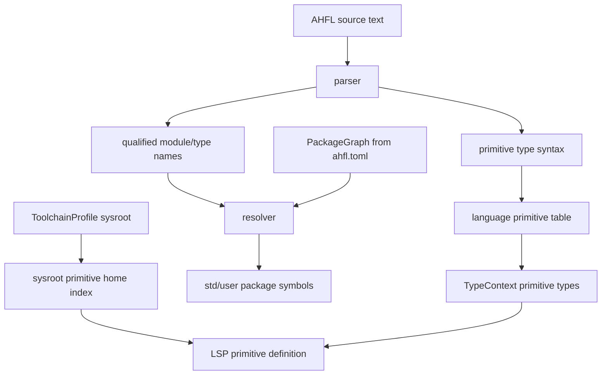
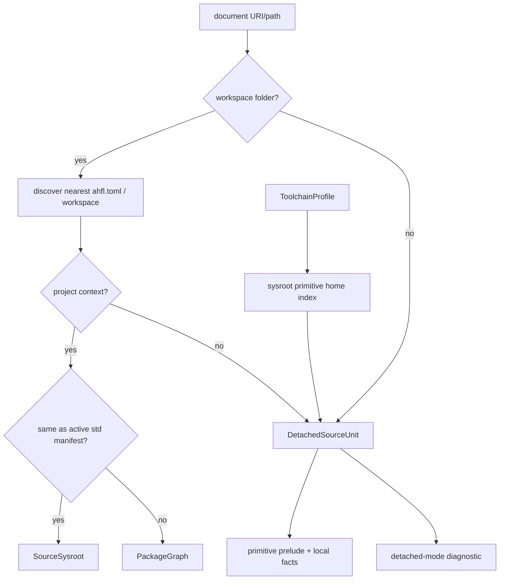
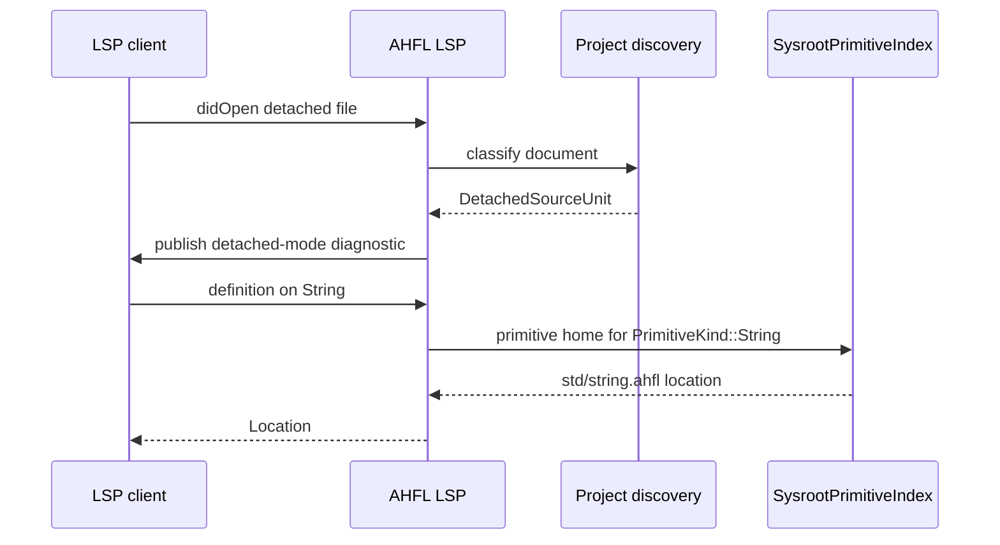

# RFC 0008: Single-File Primitive and Std Resolution

## Summary

本 RFC 提议把 AHFL 的无工程配置单文件行为正规化为一等 `DetachedSourceUnit` 分析模式，并明确区分三类名字来源：语言 primitive prelude、`std` package module namespace、用户 package dependencies。

接受本 RFC 后，`String`、`Bool`、`Int` 等语言 primitive 类型在任何 `.ahfl` 文件中都不需要 `import std::*`；但 `std::collections::List`、`std::json::JsonValue`、`std::fmt::*` 等标准库模块符号必须通过 [RFC 0005](./0005-package-configuration-system.zh.md) 定义的 package graph、`std = { source = "sysroot" }` dependency 和显式 import 共同进入作用域。无 `ahfl.toml` 的裸文件只能获得 primitive 语义和有限诊断；LSP 可以使用 active sysroot 提供 primitive canonical home 跳转，但不得因此隐式暴露整个 `std`。

本 RFC 继承 [RFC 0006](./0006-corelib-development-sysroot.zh.md) 的 ToolchainProfile/sysroot identity，以及 [RFC 0007](./0007-lsp-workspace-navigation-index.zh.md) 的 semantic graph 与 navigation index 分离原则。

## Motivation

当前用户打开 `tests/golden/formatter/formatted_struct_2spaces.ahfl` 这类没有 `ahfl.toml` 的裸文件时，`String` 不报缺 import，但 go-to-definition 又不能跳转到 `std/string.ahfl`。这暴露出一个产品级不一致：编译器把 `String` 当作 primitive 类型处理，LSP 导航却只有在 package/workspace index 存在时才知道它的 canonical home。

这个问题不应通过“裸文件隐式 import 整个 std”修复。那会让单文件语义、package 语义和 LSP 语义分裂，并破坏 AHFL 对显式 package/import 边界的设计。

成熟语言生态的共同做法是把内建语言名、标准库模块和工程配置分开：

1. Rust 区分 language prelude、standard library prelude 和 extern prelude；language prelude 中的内建类型始终在作用域内。参考 [Rust Reference: Preludes](https://doc.rust-lang.org/reference/names/preludes.html)。
2. Go 把 `bool`、`int`、`string` 等定义为 predeclared identifiers；标准库包仍通过 import declaration 进入当前文件。参考 [Go spec: Predeclared identifiers](https://go.dev/ref/spec#Predeclared_identifiers)、[Go spec: Import declarations](https://go.dev/ref/spec#Import_declarations)。
3. Go module root 由 `go.mod` 定义；工具链不会把任意裸文件目录自动当作完整 module graph。参考 [Go Modules Reference](https://go.dev/ref/mod)。
4. TypeScript 的 `lib` 选项提供默认全局声明集合，但模块解析仍受 `tsconfig` 和 import 规则约束。参考 [TSConfig lib](https://www.typescriptlang.org/tsconfig/#lib)。
5. clangd 在没有 `compile_commands.json` 等 project setup 时只能用 fallback command，完整 include graph 和跨文件语义依赖工程配置。参考 [clangd project setup](https://clangd.llvm.org/installation#project-setup)。
6. rust-analyzer 的完整项目语义来自 Cargo workspace 或 `rust-project.json` 等显式 linked project。参考 [rust-analyzer configuration](https://rust-analyzer.github.io/book/configuration.html)。

AHFL 应采用同一模式：裸文件可以帮助用户编辑和理解 primitive，但不能变成一个隐式 package manager。

## Goals

1. 规范 AHFL primitive prelude：列出无需 import 的语言 primitive 类型，并定义其与 `std` facade impl 的关系。
2. 规范裸文件 `DetachedSourceUnit` 模式：无 `ahfl.toml` 时 compiler/LSP 能做什么、不能做什么。
3. 规范 `std::*` module import 规则：裸文件不得隐式获得标准库 package namespace。
4. 让 LSP 在裸文件模式下仍可通过 active sysroot 提供 primitive canonical home 跳转。
5. 让 CLI、LSP、formatter、golden fixture harness 使用同一套 project discovery 和 detached-mode 判定。
6. 增加明确 diagnostics，告诉用户当前文件处于 detached mode，package imports 和 workspace navigation 被降级。
7. 保持 RFC 0005/0006/0007 的 PackageGraph、ToolchainProfile 和 NavigationIndex 边界，不新增 std 特判。

## Non-Goals

1. 不让裸文件自动依赖 `std` package。
2. 不改变 import grammar 的基本形态；`import std::option;` 和 `import std::option as option;` 都是合法语法，本 RFC 只定义它们何时因 package/dependency 边界可见。
3. 不设计远程 registry、single-file package publishing 或 dependency fetching。
4. 不为旧 JSON descriptor 或旧 LSP sysroot 初始化字段提供兼容路径。
5. 不把 `definition` 重新定义成 impl 查询入口；impl 查询仍属于 RFC 0007 定义的 `implementation`/workspace index 能力。
6. 不稳定 REPL、notebook、playground 的完整语义；它们可以后续复用 `DetachedSourceUnit`，但不在本 RFC 中定义。

## Design

### Name source taxonomy

AHFL 名字来源分为三层：

| 层 | 示例 | 是否需要 import | 是否需要 `ahfl.toml` | 语义来源 |
| --- | --- | --- | --- | --- |
| Language primitive prelude | `Unit`、`Bool`、`Int`、`Float`、`String`、`UUID`、`Timestamp`、`Duration`、`Decimal` | 否 | 否 | 语言规范和 compiler primitive type table |
| Std package module namespace | `std::collections::List`、`std::json::JsonValue`、`std::fmt::format` | 是 | 是，且 package 必须声明 `std = { source = "sysroot" }` dependency | active sysroot `std/ahfl.toml` 和 PackageGraph |
| User package namespace | `refund::audit::Workflow`、path/workspace dependency modules | 是 | 是 | root/workspace `ahfl.toml` 和 PackageGraph |

Primitive 类型可以有 std facade impl，例如 `impl String { ... }` 或 `impl Int { ... }`。这些 impl 属于 active sysroot 的 std package，用于 PackageGraph/SourceSysroot 模式下的方法解析、hover、documentation 和 implementation candidates；但 primitive 类型本身不是从 `std::string` import 得到的普通 nominal type。Detached mode v1 只使用 sysroot 提供 primitive canonical home，不暴露 std facade impl candidates。

关键分界：primitive type name visibility 不等于 primitive method visibility。裸写 `String` 是语言 primitive prelude；调用 `s.length()` 是对 std facade impl method 的使用，必须满足本 RFC 的 std dependency/import 规则。



### Primitive prelude contract

AHFL primitive prelude v1 包含：

| Primitive | Source syntax | Canonical type identity | Canonical home |
| --- | --- | --- | --- |
| Unit | `Unit` | `PrimitiveKind::Unit` | `std/unit.ahfl` if present, otherwise compiler virtual location |
| Bool | `Bool` | `PrimitiveKind::Bool` | `std/bool.ahfl` if present, otherwise compiler virtual location |
| Int | `Int` | `PrimitiveKind::Int` | `std/int.ahfl` if present, otherwise compiler virtual location |
| Float | `Float` | `PrimitiveKind::Float` | `std/float.ahfl` if present, otherwise compiler virtual location |
| String | `String` / bounded string syntax | `PrimitiveKind::String` plus bounds metadata | `std/string.ahfl` |
| UUID | `UUID` | `PrimitiveKind::UUID` | `std/uuid.ahfl` |
| Timestamp | `Timestamp` | `PrimitiveKind::Timestamp` | `std/time.ahfl` |
| Duration | `Duration` | `PrimitiveKind::Duration` | `std/time.ahfl` |
| Decimal | `Decimal` / scaled decimal syntax | `PrimitiveKind::Decimal` plus scale metadata | `std/decimal.ahfl` |

规则：

1. Parser/type resolver 必须把这些语法降成 primitive type，不经过 ordinary name lookup。
2. 用户 package 不能声明同名 top-level type 来覆盖 primitive prelude。
3. `import std::string as string;` 不影响裸写 `String` 的解析结果。
4. Primitive methods 只能来自 PackageGraph/SourceSysroot 中按模块可见性可见的 std facade impl，或来自未来单独规范的 compiler builtin method table；裸文件没有 full PackageGraph 时，compiler 可以解析 primitive type 本身，但不得解析、补全或展示 std facade methods。
5. 如果某个 canonical home 文件在当前 sysroot 不存在，LSP 仍可返回 compiler virtual location 或 hover 文档，但必须记录 index completeness 为 `VirtualPrimitiveHome`。
6. `SysrootPrimitiveIndex` v1 只提供 primitive canonical home；它不得索引 impl methods、trait impls、ordinary std exports 或 completion candidates。

### Package std dependency semantics

PackageGraph 模式下，`std` namespace 的可见性由 dependency graph 决定，不由 active sysroot 单独决定。Active sysroot 只说明“如果某个 package 声明依赖 `std`，它解析到哪个 standard-library package”；它不能把 `std` 隐式加入所有 package。

用户 package 使用标准库模块必须同时满足三件事：

1. 当前文件属于某个 `ahfl.toml` package。
2. 该 package 的 `[dependencies]` 包含 `std = { source = "sysroot" }`，或等价 workspace dependency 解析到 active sysroot。
3. 当前 source unit 按语言规则显式 import 需要的 std module。

例如：

```toml
manifest_version = 1

[package]
name = "scratch"
version = "0.1.0"
edition = "2026"
kind = "library"

[module]
prefix = "scratch"
root = "."

[exports]
modules = ["main"]
```

```ahfl
module scratch::main;

import std::collections as collections;

struct A {
    values: collections::List<Int>;
}
```

上例必须报 `E::package_dependency_missing`，因为 package manifest 没有声明 `std` dependency。编译器不得因为 ToolchainProfile 有 active sysroot 就接受该 import。

SourceSysroot 模式是唯一例外：当前 package 本身就是 active `std` package 时，`std::*` imports 在同一个 standard-library package 内解析，不需要再声明对自己的 dependency。

### Primitive facade method visibility

Std facade impl method 是 std package 的语义事实，不是 language primitive prelude 的一部分。Method lookup 必须把 receiver type 与 impl 所在 module 的可见性同时纳入判断。

用户 package 调用 primitive facade method 必须同时满足：

1. Receiver type 是语言 primitive，例如 `String`。
2. 所属 package 声明 `std = { source = "sysroot" }` dependency。
3. 当前 source unit 显式 import 定义该 impl 的 std module，或通过未来单独 RFC 定义的 prelude injection 使该 module 可见。

例如：

```toml
[dependencies]
std = { source = "sysroot" }
```

```ahfl
module scratch::main;

fn length_of(s: String) -> Int effect Pure decreases 0 {
    return s.length();
}
```

上例必须报 method-not-found diagnostic，因为 `String` primitive type 可见，但 `std::string` module 中的 `impl String` 不可见。

正确写法：

```ahfl
module scratch::main;

import std::string;

fn length_of(s: String) -> Int effect Pure decreases 0 {
    return s.length();
}
```

同理，`std::fmt`、`std::json` 等模块中的 `impl Int` / `impl String` 是 extension impl。它们不会因为 `Int` / `String` primitive type 可见而自动进入 method lookup；只有对应 module 可见时，method lookup 才能把这些 impl 作为候选。

该规则保持三个不变量：

1. `String` 本身无需 import。
2. `std` module 符号和 std extension behavior 仍受 dependency/import 控制。
3. LSP navigation index 可以展示 implementation candidates，但不得改变 resolver/typechecker 的 method visibility。

### Analysis modes

AHFL frontend 公开入口必须先分类当前文档：

| Mode | 触发条件 | 可用语义 | 可用导航 | Diagnostics |
| --- | --- | --- | --- | --- |
| `PackageGraph` | 文档位于 root/workspace `ahfl.toml` 可达 package 内 | 完整 resolve/typecheck/validate | RFC 0007 workspace index | 完整工程 diagnostics |
| `SourceSysroot` | 文档位于 active `std/ahfl.toml` 对应 sysroot package 内 | 完整 std package 语义 | active std exported modules index | RFC 0006 sysroot diagnostics |
| `DetachedSourceUnit` | 没有 workspace folder，或在当前 workspace boundary 内向上找不到可用 `ahfl.toml` | parse、format、primitive typecheck、单文件局部符号 | primitive home、当前文件局部 symbol、best-effort hover | detached-mode core note / LSP information 和单文件 diagnostics |



`DetachedSourceUnit` 是显式模式，不是异常 fallback。实现上应有结构化 enum，例如：

```text
AnalysisContext
  PackageGraph { graph, root_manifest, toolchain_profile }
  SourceSysroot { graph, std_manifest, toolchain_profile }
  DetachedSourceUnit { source, optional_workspace_folder, toolchain_profile, detached_reason }
```

CLI、LSP、formatter 和测试 harness 不得各自重复实现“向上搜索 manifest，然后失败时单文件解析”的逻辑。

### Detached source semantics

`DetachedSourceUnit` 允许：

1. Parse 当前文件。
2. Format 当前文件。
3. 建立当前文件局部 declaration/symbol skeleton。
4. 解析 language primitive types。
5. 执行不依赖 package graph 的单文件 typecheck 子集。
6. 通过 active ToolchainProfile 的 sysroot primitive home index，为 primitive 类型提供 definition/typeDefinition。
7. 对 import declarations、unknown nominal type、unknown local symbol 产生 best-effort diagnostics。

`DetachedSourceUnit` 禁止：

1. 自动加载 `<workspace>/std/` 或 active sysroot 的全部 exported modules。
2. 让 `std::*` qualified path 在没有 package graph 的情况下解析成功。
3. 让 `List`、`Map`、`Option`、`Result` 等 std nominal types 因 prelude 或 sysroot 存在而裸名可见。
4. 让 std facade impl 改变当前文件 typecheck 结论。
5. 把裸文件目录当作 implicit package root。
6. 接受任何 `import` declaration。Detached v1 没有 module root、package root 或 dependency graph，因此无法可靠区分 local module import、package import 和 std import。
7. 为了 LSP completion 临时注入 std imports。

示例：

```ahfl
struct A {
    value: String;        // OK: String 是 primitive
    enabled: Bool;        // OK: Bool 是 primitive
    values: List<Int>;    // error: List 不是 primitive，也未定义
}
```

```ahfl
import std::collections as collections;

struct A {
    values: collections::List<Int>;
}
```

在 detached mode 中，上例 import 必须报 diagnostic：当前文件没有 module root、package context 或 dependency graph。用户需要创建 `ahfl.toml`，或者通过 CLI/LSP 显式指定 root manifest，而不是依赖裸文件隐式 std。

未来如果 AHFL 需要多文件 scratch 或 playground，可以通过单独 RFC 设计 `--root`、`--include` 或 scratch package 模式；不得把这些规则塞进 detached v1。

### LSP behavior

LSP 对裸文件必须做到“语义降级可见、primitive 导航不降级”：

1. 打开无 `ahfl.toml` 的 `.ahfl` 文件时，server 构建 `DetachedSourceUnit` snapshot。
2. Server 发布一个 core note / LSP information 级别 diagnostic，说明当前文件没有 package manifest，package imports、workspace references、cross-file rename 和 ordinary std module symbol navigation 被禁用；primitive canonical home navigation 仍按下一条规则可用。
3. `textDocument/definition` / `textDocument/typeDefinition` 在 primitive type token 上应返回 sysroot primitive canonical home。该能力使用 `SysrootPrimitiveIndex`，不要求当前文件有 PackageGraph。
4. `textDocument/implementation` 在 detached primitive type token 上必须返回空结果或 capability-limited result；完整 impl candidates 只在 PackageGraph/SourceSysroot 模式下保证。
5. `completion` 可以推荐创建 `ahfl.toml`、补全当前文件局部符号或补全 language primitive type；不得在 detached mode 下提供 import completion、import code action，或推荐未导入 std module item 为可直接使用的 symbol。
6. `workspace/symbol`、`references`、`rename` 在 detached mode 下只覆盖当前打开文件，或返回 capability-limited result。



`SysrootPrimitiveIndex` 是 ToolchainProfile 级 cache。Cache key 至少包含：

1. `std_manifest` canonical path。
2. `std_identity`。
3. primitive home schema version。

它只索引 primitive canonical home，不索引 primitive facade impl metadata、trait impls、ordinary std module exports 或 completion candidates。这样裸文件能跳到 `String` 文档，但不能解析 `std::json::JsonValue`，也不能列出 `impl String` 方法候选。

### CLI behavior

CLI 需要显式区分 package mode 和 detached mode：

| Command shape | Mode | Behavior |
| --- | --- | --- |
| `ahflc check --manifest path/to/ahfl.toml` | `PackageGraph` or `SourceSysroot` | 完整工程检查 |
| `ahflc check path/to/file.ahfl` 且向上找到 `ahfl.toml` | `PackageGraph` | 以所属 package graph 检查 |
| `ahflc check path/to/file.ahfl` 且没有 `ahfl.toml` | `DetachedSourceUnit` | 单文件检查，返回 core note / LSP information 级 detached diagnostic；只要没有 error，退出码为 0 |
| `ahflc format path/to/file.ahfl` | parse/format only | 不要求 manifest |
| `ahflc lsp` | per-document classification | 按 LSP 规则 |

裸文件 `check` 不应静默成功地接受任何 `import` declaration。如果 CLI 需要“把裸文件临时当作工程入口”的体验，应提供显式选项，例如后续 RFC 设计 `--manifest-template` 或 `ahflc init --single-file`；本 RFC 不引入该功能。

### Diagnostics

新增 diagnostics：

| Code | Severity | 场景 |
| --- | --- | --- |
| `N::detached_source_unit` | note / LSP information | 文件不属于任何 `ahfl.toml`，语义进入 detached mode；CLI 不因该 diagnostic 返回非零 |
| `E::detached_import` | error | detached 文件出现任何 `import` declaration |
| `E::package_dependency_missing` | error | package 文件 import `std::*`，但所属 package 未声明 `std = { source = "sysroot" }` dependency |
| `E::detached_unknown_nominal_type` | error | detached 文件使用非 primitive、非本文件声明的 nominal type |
| `E::primitive_shadowing_forbidden` | error | 用户声明试图覆盖 primitive prelude 名字 |
| `W::primitive_home_unavailable` | warning | active sysroot 无法提供 primitive canonical home，或没有可用 default ToolchainProfile |

`N::detached_source_unit` message 示例：

```text
note [N::detached_source_unit]: this file is not part of an AHFL package
  help: create ahfl.toml or open a workspace containing one to enable std imports and workspace navigation
```

`E::detached_import` message 示例：

```text
error [E::detached_import]: import declarations require an AHFL package manifest
  import: std::collections
  help: add ahfl.toml, or run ahflc with --manifest
```

`E::package_dependency_missing` message 示例：

```text
error [E::package_dependency_missing]: package import requires a declared dependency
  import: std::collections
  dependency: std
  help: add `std = { source = "sysroot" }` to [dependencies]
```

### Interaction with std prelude

`std::prelude` 不等于 language primitive prelude。

1. Language primitive prelude 永远在作用域内，不能关闭。
2. `std::prelude` 是 standard-library package module，只有 PackageGraph/SourceSysroot 模式能加载。
3. AHFL v1 的 `std::prelude` injection 仍按 RFC 0005 的 manifest 字段控制；当前标准库 manifest 使用 `injection = "explicit"`。
4. Detached mode 不注入 `std::prelude`。
5. 如果后续 RFC 允许用户 package 自动注入 std prelude，也不得改变 detached mode 的 std module import 边界，除非同时明确 single-file package model。

### Source ownership and workspace boundaries

LSP workspace folder 只定义 project discovery 边界，不等于 package root。Server 必须：

1. 对有 workspace folder 的文件，只在当前 workspace folder 边界内向上搜索 `ahfl.toml` / `ahfl.workspace.toml`。
2. 若找不到 manifest，进入 `DetachedSourceUnit`。
3. 不因为 workspace folder 下存在某个 sibling `std/ahfl.toml` 就把裸文件绑定到该 sysroot package。
4. 不跨 workspace folder 搜索 package manifest。
5. 对 multi-root workspace，每个 document 先选择最近 workspace folder，再使用该 folder 的 ToolchainProfile。
6. 对不属于任何 workspace folder 的打开文件，直接进入 `DetachedSourceUnit { optional_workspace_folder = null }`，使用 default ToolchainProfile；如果 default ToolchainProfile 不存在，则仍执行 parse/format/local diagnostics，但 primitive canonical home lookup 返回 `W::primitive_home_unavailable`。

### Implementation constraints

1. `AnalysisContext` 必须成为 CLI/LSP 共享的 project-discovery 输出，不允许 LSP handler 自己猜模式。
2. `SysrootPrimitiveIndex` 必须以 `PrimitiveKind` / `TypeKey` 为 key，不允许用 `"String"` 或 `"primitive:String"` 字符串作为 canonical identity。
3. `DetachedSourceUnit` 的 source id、symbol id 和 diagnostics 必须与 PackageGraph mode 隔离，避免单文件事实污染 workspace cache。
4. LSP snapshot cache key 必须包含 analysis mode、workspace folder URI、toolchain profile identity 和 source revision。
5. Formatter golden fixtures 可以继续没有 manifest；formatter 不应要求 package mode。
6. Typecheck/resolver golden fixtures 如果依赖 std module item，必须迁移到 package fixture 或显式 manifest harness。

## User Impact

用户可观察到的变化：

1. 裸文件中的 `String`、`Bool`、`Int` 等 primitive 不再表现为“能用但不能跳转”；配置了 sysroot 的 LSP 应能跳到 canonical home。
2. 裸文件中的任何 `import` declaration 都会明确报错，而不是静默半解析。
3. 裸文件中的 `List<Int>` 会报 unknown nominal type，除非同文件定义了 `List`。
4. 普通工程文件仍需要 `ahfl.toml`、`std = { source = "sysroot" }` dependency 和显式 import 才能使用 std modules。
5. 有 `ahfl.toml` 但没有 std dependency 的工程 import `std::*` 会报 `E::package_dependency_missing`。
6. 有 `std` dependency 但没有 `import std::string;` 的工程仍不能调用 `String` 的 std facade methods，例如 `s.length()`。
7. VS Code 用户会看到 LSP information 级 detached-mode 诊断；CLI 用户会看到 core note，知道为什么 workspace navigation、references、rename 或 std imports 不完整。
8. formatter fixture、scratch 文件和文档示例可以继续不创建 manifest；只要没有 error，CLI `check` 对 primitive-only detached 文件返回 0。

## Compatibility and Migration

这是 developer-facing breaking change，因为它会改变裸文件和测试 fixture 的诊断行为。

影响范围：

1. 裸文件里当前被 LSP/CLI 误接受的任何 `import` declaration 将变为错误。
2. 依赖 std nominal types 的 golden fixture 必须移动到 package-aware fixture，或增加 `ahfl.toml`。
3. LSP tests 需要区分 detached mode 和 package mode 的 diagnostics。
4. 使用 `String`、`Bool`、`Int` 等 primitive 的裸文件不需要迁移。
5. 已有 manifest 但缺少 `std` dependency 的 package 必须补 `[dependencies] std = { source = "sysroot" }`，否则 `std::*` imports 变为错误。
6. 已有 manifest 和 `std` dependency、但依赖 primitive facade methods 的 package，必须 import 定义对应 impl 的 std module，例如 `std::string`、`std::fmt` 或 `std::json`。

迁移步骤：

1. 对真实工程：在 package root 添加 `ahfl.toml`，并声明 `std = { source = "sysroot" }`。
2. 对测试 fixture：formatter-only fixture 维持裸文件；semantic fixture 若使用 std module item，应迁移到 package fixture。
3. 对 IDE 用户：打开包含 `ahfl.toml` 的 workspace folder；如果只是 scratch 文件，接受 detached-mode 限制。
4. 对 LSP client：不要把 workspace folder 当作 sysroot；按 RFC 0006 配置 ToolchainProfile。
5. 对 no-workspace scratch 文件：依赖 default ToolchainProfile 获得 primitive home；没有 default profile 时只获得 parse/format/local diagnostics。

## Implementation Plan

1. 在 project discovery 层新增共享 `AnalysisContext` / `DetachedSourceUnit` 模型。
2. 把 CLI 和 LSP 的“无 manifest fallback”迁移到该模型，删除 handler 内部临时判定。
3. 建立 `SysrootPrimitiveIndex`，从 active ToolchainProfile 的 std source 构建 primitive canonical home。
4. 修改 LSP `definition` / `typeDefinition`：primitive lookup 先查当前 workspace index，再查 ToolchainProfile 级 primitive index。
5. 修改 `textDocument/implementation`：detached primitive 不返回 std facade impl candidates；impl candidates 只来自 PackageGraph/SourceSysroot navigation index。
6. 修改 method lookup：std facade impl 只有在所属 std module 按 import/prelude 规则可见时参与候选集合；primitive type 可见性不得自动导入 impl。
7. 修改 detached completion/code action：不得提供 import completion 或 import code action。
8. 增加 detached-mode diagnostics，并让任何 `import` declaration 在 detached mode 下报 `E::detached_import`。
9. 增加 package-mode dependency gate：`std::*` import 在所属 package 未声明 std dependency 时报 `E::package_dependency_missing`。
10. 审计 resolver/typechecker golden fixtures，把依赖 std module 的裸 fixture 迁移到 package-aware harness。
11. 更新用户文档，解释 primitive prelude、std package dependency/imports 和 detached mode。
12. 将 RFC 0007 中 primitive navigation 的过渡行为收敛到本 RFC 定义的 mode matrix。

## Test Plan

必须新增或更新以下测试：

1. LSP detached file：`String` definition 跳到 `std/string.ahfl`。
2. LSP detached file：`Bool`、`Int`、`Duration` 等 primitive 都能返回 canonical home 或 virtual home。
3. LSP detached file：任意 `import` declaration 报 `E::detached_import`。
4. LSP detached file：`List<Int>` 报 `E::detached_unknown_nominal_type`。
5. LSP detached file：primitive 上 `textDocument/implementation` 不返回 std facade impl candidates。
6. LSP package file：带 `ahfl.toml` 和 std dependency 时，`std::collections::List` 可解析并可跳转。
7. LSP package file：有 `ahfl.toml` 但没有 std dependency 时，`import std::collections as collections;` 报 `E::package_dependency_missing`。
8. Package file：有 std dependency 但没有 `import std::string;` 时，`s.length()` 报 method-not-found。
9. Package file：有 std dependency 且 `import std::string;` 时，`s.length()` 可解析并可跳转到 `std/string.ahfl` 的 `impl String` method。
10. LSP detached completion/code action：不提供 import completion 或 import code action。
11. CLI `ahflc check` 裸文件：primitive-only 文件通过并带 core note / LSP information 级 detached diagnostic，退出码为 0。
12. CLI `ahflc check` 裸文件：任意 import 文件失败。
13. LSP no-workspace-folder file：进入 detached mode，使用 default ToolchainProfile 查询 primitive home；无 default profile 时返回 `W::primitive_home_unavailable`。
14. Formatter golden：无 manifest 的 formatter fixture 仍可格式化。
15. Sysroot cache：切换 ToolchainProfile 后 primitive home index invalidates。
16. Negative fixture：用户声明 `struct String {}` 报 `E::primitive_shadowing_forbidden`。

## Rollout and Stabilization

1. `draft`：完成本 RFC，并审查 RFC 0005/0006/0007 是否有冲突措辞。
2. `review`：补齐 tracking issue 中的实现任务，确认 language/compiler/stdlib/tooling owners 都同意 primitive prelude 边界。
3. `accepted`：在 spec/design/reference 文档中同步 primitive prelude 和 detached mode 定义。
4. `implementing`：按 Implementation Plan 分片落地，并保持 `scripts/check-rfc.py` 通过。
5. `implemented`：CLI、LSP 和测试 fixture 迁移完成，`ctest --preset test-dev --output-on-failure` 通过。
6. `stabilized`：用户文档明确解释单文件模式，VS Code extension 对 detached diagnostic 有可接受 UX。

当前实现进度：

1. 已落库 `AnalysisContext` / `DetachedSourceUnit` 共享 project discovery 模型。
2. 已落库 CLI detached check：primitive-only 裸文件带 `N::detached_source_unit` 成功，任何 import 带 `E::detached_import` 失败。
3. 已落库 LSP detached primitive home：`String`、`Bool`、`Duration` 等 primitive 可用 active sysroot canonical home 跳转，且 `implementation` 不暴露 std facade impl candidates。
4. 已落库 package dependency gate：无 `std` dependency 的 package import `std::*` 报 `E::package_dependency_missing`。
5. 已落库 primitive facade method visibility：`String` 类型本身无需 import，但 `s.length()` 必须显式 import `std::string`。
6. 已落库 primitive shadowing 专用诊断：用户声明 `struct String {}` 报 `E::primitive_shadowing_forbidden`。
7. 已落库 `W::primitive_home_unavailable`：active sysroot 缺少 primitive home，或没有可用 default ToolchainProfile 时，LSP detached diagnostics 可见。
8. 已同步 [core-language.zh.md](../spec/core-language.zh.md)、[single-file-mode.zh.md](../reference/single-file-mode.zh.md)、[cli-commands.zh.md](../reference/cli-commands.zh.md)、[lsp-vscode-extension.zh.md](../reference/lsp-vscode-extension.zh.md)、[stdlib-cookbook.zh.md](../reference/stdlib-cookbook.zh.md) 与 [error-codes.zh.md](../reference/error-codes.zh.md)。

## Alternatives

1. 裸文件隐式加载整个 `std`。拒绝：这会让裸文件获得比普通 package 更宽的隐式语义，破坏显式 dependency/import 规则，并让 LSP 与 compiler 更难保持一致。
2. 要求所有 `.ahfl` 文件都必须有 `ahfl.toml`。拒绝：formatter、scratch 文件、文档示例和最小复现会变重；成熟工具链通常仍提供单文件降级体验。
3. 把 `String` 改成普通 `std::string::String` nominal type，要求 import。拒绝：这会破坏现有语言设计和大量源代码，也不符合 AHFL 当前 TypeContext primitive model。
4. 在 LSP 层硬编码 `String -> std/string.ahfl` 路径。拒绝：路径字符串不是 canonical identity，且无法处理 ToolchainProfile、sysroot identity、虚拟 home 和多 workspace。
5. 只修复 `String` 跳转，不定义 detached mode。拒绝：问题会在 `Bool`、`Int`、`Duration`、`std` imports、completion、references 和 diagnostics 上反复出现。

## Open Questions

无。以下问题已在实现中决议。

## Resolved Questions

1. `Unit` v1 不强制新增实际 `std/unit.ahfl`。若 active sysroot 缺少该 home，
   `SysrootPrimitiveIndex` 记录 missing home，并由 LSP 发
   `W::primitive_home_unavailable`。
2. `Decimal` v1 继续使用 `PrimitiveKind::Decimal` 加 `TypeKey::primitive_parameter`
   表示 scale；不引入独立 `PrimitiveTypeKey` payload。

## Decision History

- 2026-07-05: Draft opened from LSP single-file `String` navigation and std import boundary analysis.
