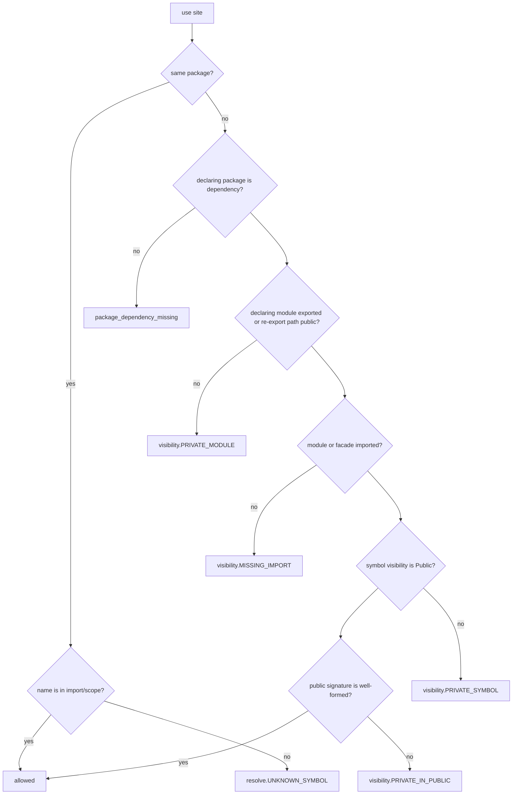
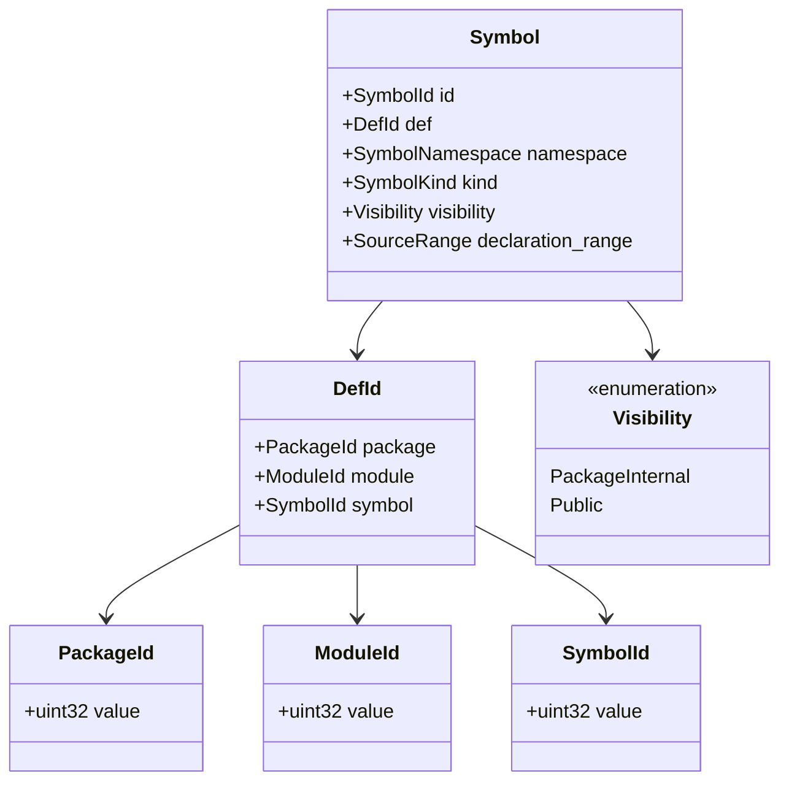
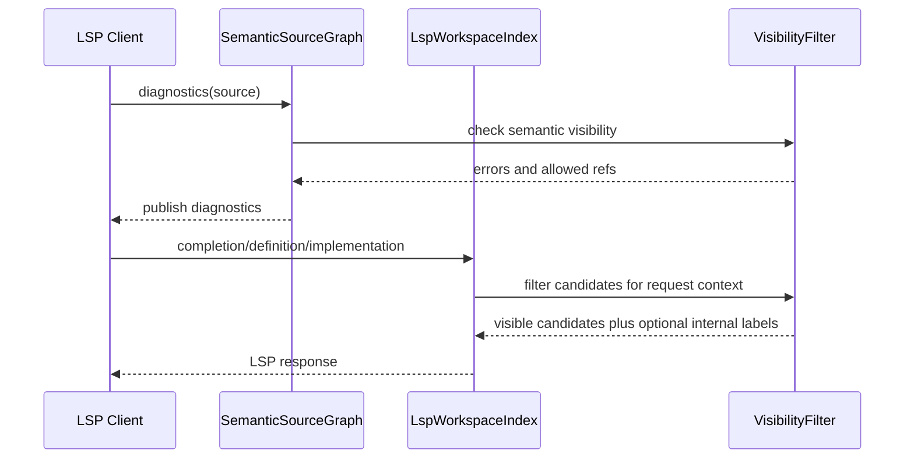

# RFC 0009: Symbol Visibility and Public API Surface

## Summary

本 RFC 提议把 AHFL 的符号可见性提升为一等语言语义：package 的 `[exports].modules` 继续只表达“哪些 module 可以被依赖方 import”，而 module 内部的跨 package API surface 必须由源代码中的 `pub` 显式声明。未标记 `pub` 的符号默认是 package-internal：同 package 内可以按 import/name-resolution 规则使用，跨 package 不可见。

接受本 RFC 后，跨 package 使用一个符号必须同时满足四个 gate：

1. 调用方 package 显式依赖被调用方 package。
2. 被调用方 module 在 `[exports].modules` 中导出。
3. 调用方 source unit 显式 import 该 module，或通过本 RFC 定义的 `pub use` facade 暴露的 module 导入路径访问。
4. 目标符号本身是 `pub`，并且其 public signature 不泄漏 package-internal 类型或能力。

这会替代当前“导出 module 内所有顶层符号都等价公开”的粗粒度模型。该变化是 breaking change，但 AHFL 仍处于快速成长期，不为旧模型保留 legacy 兼容路径。

本 RFC 继承 [RFC 0005](./0005-package-configuration-system.zh.md) 的 package/module export 规则、[RFC 0007](./0007-lsp-workspace-navigation-index.zh.md) 的 semantic graph 与 navigation index 分离原则，以及 [RFC 0008](./0008-single-file-std-primitive-semantics.zh.md) 的 primitive/std 分层。

## Motivation

AHFL 当前已经有 package graph 和 module export：

1. `ahfl.toml` 的 `[exports].modules` 决定依赖方能 import 哪些 module。
2. 同 package 内 module 对同 package 代码可见。
3. 导出父 module 不隐式导出子 module。
4. LSP、formatter、diagnostics 必须使用同一 export table。

但现有模型缺少符号级 public API。只要一个 module 被导出，依赖方理论上就可以看到 module 内所有顶层 `struct`、`enum`、`type`、`fn`、`trait`、`impl` surface、`agent`、`workflow` 和 `capability`。这会带来四类架构问题：

1. `std` 无法把 compiler builtin hooks、raw intrinsics、测试辅助类型和稳定 facade API 分开。
2. 用户 package 无法建立明确的 public contract；一个 helper type 被放进 exported module 就会意外变成外部依赖。
3. LSP completion 和 go-to-definition 很难区分“IDE 可索引事实”和“语言可见事实”。
4. 未来 registry、API diff、semver、文档生成和 public assurance artifact 都没有可靠输入。

成熟语言生态的共同结论是：package/module 解决可达性，symbol visibility 解决 API surface，二者不能混为一谈。

参考系统：

1. Rust 使用 `pub`、`pub(crate)`、`pub(super)`、`pub(in path)`，默认 private；外部访问还要求 ancestor modules 可见。参考 [Rust Reference: Visibility and privacy](https://doc.rust-lang.org/reference/visibility-and-privacy.html)。
2. Swift 把 access control 建立在 source file 和 module 边界上，默认 `internal`，需要显式 `public` 才跨 module 可见。参考 [Swift Book: Access Control](https://docs.swift.org/swift-book/documentation/the-swift-programming-language/accesscontrol/)。
3. Go 用 exported identifiers 和 import declaration 共同决定跨 package 访问；import 只启用被导入 package 的 exported identifiers。参考 [Go spec: Exported identifiers](https://go.dev/ref/spec#Exported_identifiers) 和 [Go spec: Import declarations](https://go.dev/ref/spec#Import_declarations)。
4. OCaml 通过 signatures 描述 module 的外部形状，并支持 abstract type 隐藏表示。参考 [OCaml manual: Module types and signatures](https://ocaml.org/manual/5.2/modtypes.html)。

AHFL 应吸收这些系统的核心原则，但不照搬其全部复杂度：v1 只引入 `pub` 与默认 package-internal，不引入 Rust scoped visibility、Swift `open/fileprivate/private` 或 OCaml 完整 signature language。

## Goals

1. 定义 AHFL v1 符号可见性模型：`pub` 与默认 package-internal。
2. 明确 `[exports].modules` 是 module gate，不是 symbol export list。
3. 定义哪些 declaration 可以标记 `pub`，以及 public signature well-formedness。
4. 定义 `pub use` 作为 curated facade/re-export 机制，避免强迫用户暴露内部 module path。
5. 定义 resolver/typechecker 如何用结构化 `SymbolId`、`DefId`、`PackageId`、`ModuleId` 检查可见性，不得用字符串作为 canonical identity。
6. 定义 std/corelib 的公开 facade 与 internal builtin hook 边界。
7. 定义 LSP completion、definition、implementation、workspace symbol 如何过滤或标注符号可见性。
8. 给出 breaking migration、implementation slices、test matrix 和 stabilization gate。

## Non-Goals

1. 不把 visibility 当作 runtime security boundary。权限、secret、capability authorization 仍由 runtime/provider/assurance 体系定义。
2. 不引入 class/protected/friend/inheritance 风格可见性。AHFL 数据模型遵循 `std::variant`/trait/impl，不采用 OO 继承层级。
3. 不在 v1 引入 field-level privacy。`pub struct` 的字段和 `pub enum` 的 variants 在 v1 视为该 type public representation 的一部分。
4. 不引入 Rust `pub(crate)`、`pub(super)`、`pub(in path)`。AHFL v1 的内部边界是 package，不是任意 module subtree。
5. 不引入完整 signature/module-interface language。`pub use` 与 `pub` declaration 足够覆盖 v1 public API。
6. 不设计 registry version solver、semver enforcement 或 API-diff artifact；本 RFC 只提供这些能力所需的语义基础。
7. 不改变 RFC 0008 定义的 primitive prelude：`String`、`Bool`、`Int` 等 primitive type name visibility 不来自 `std` module import。
8. 不在 v1 引入 module re-export、glob re-export 或 import-all 语义；`pub use` 只 re-export named symbols。

## Design

### Terminology

| Term | Definition |
| --- | --- |
| Package | 由 `ahfl.toml` 定义的编译与依赖单元。 |
| Module | `module foo::bar;` 声明的 source unit 名称，与 package module root 共同形成 source ownership。 |
| Exported module | 在 `[exports].modules` 中声明、允许依赖方 import 的 module。 |
| Public symbol | 源码中显式标记 `pub`，且通过 exported module 或 public re-export 可从跨 package 访问的 symbol。 |
| Package-internal symbol | 默认可见性；仅同 package source units 可见。 |
| Public signature | `pub` symbol 对外暴露的类型、参数、返回值、effects、decreases、where bounds、capability schema、agent/workflow IO schema。 |
| Semantic visibility | resolver/typechecker 决定某引用是否合法的可见性。 |
| Navigation visibility | LSP index 可观察到的事实范围；它可以比 semantic visibility 宽，但不得改变 diagnostics。 |

### Visibility lattice

AHFL v1 只有两个 source-level visibility levels：

| Source marker | Semantic level | Cross-package visible | Notes |
| --- | --- | --- | --- |
| absent | `PackageInternal` | 否 | 默认。可被同 package 内按 import/name-resolution 规则使用。 |
| `pub` | `Public` | 是，前提是 package dependency、module export、import/re-export path 同时满足 | 进入 public API surface，并受 public signature checker 约束。 |



规则：

1. `PackageInternal` 不等于 module-local private。同 package 内其他 module 可以 import 所在 module 并使用该符号。
2. `Public` 不会绕过 module gate。`pub` symbol 如果位于未 exported module，则对跨 package 不可达。
3. `pub` symbol 位于未 exported module 时，compiler 应产生 `visibility.UNREACHABLE_PUBLIC` warning；如果该 symbol 被 `pub use` 暴露，则不警告。
4. 跨 package lookup 必须先通过 package/module/import gate，再检查 symbol visibility。
5. Visibility 是 semantic fact，必须存入 typed symbol store；字符串只可用于 source spelling 和 diagnostics。

### Syntax

新增 `visibilityModifier`：

```antlr
visibilityModifier: 'pub';
```

顶层 declaration 支持可选 `pub`：

```antlr
topLevelDecl:
      visibilityModifier? constDecl
    | visibilityModifier? typeAliasDecl
    | visibilityModifier? structDecl
    | visibilityModifier? enumDecl
    | visibilityModifier? capabilityDecl
    | visibilityModifier? predicateDecl
    | visibilityModifier? agentDecl
    | visibilityModifier? workflowDecl
    | visibilityModifier? fnDecl
    | visibilityModifier? traitDecl
    | contractDecl
    | flowDecl
    | implDecl
    | useDecl;
```

`contractDecl` 和 `flowDecl` 不接受 `pub`，因为它们不是独立可 import 的命名实体；它们的 public artifact 可见性由所绑定的 `pub` agent/workflow/fn/type 决定。

`impl` block 本身 v1 不接受 `pub`；inherent impl 的 item 可以带 `pub`，trait impl 的 item 不接受 `pub`，因为 trait contract 决定其外部可调用 surface：

```antlr
implDecl:
    'impl' typeParams? (traitRef 'for')? type_ whereClause? '{' implItem* '}';

implItem:
      visibilityModifier? implFnItem
    | visibilityModifier? assocConstDef
    | visibilityModifier? assocTypeDef;
```

`pub use` 声明 public re-export：

```antlr
useDecl:
    visibilityModifier? 'use' qualifiedIdent ('as' identifier)? ';';
```

`useDecl` 的 target path 语义：

1. `qualifiedIdent` 至少包含两个 segments。
2. 最后一段是 top-level symbol name。
3. 最后一段之前的 prefix 是 module path。
4. `use audit_core::types::Request as Req;` 因此加载 `audit_core::types` module，并在当前 source 引入 symbol alias `Req`。
5. `pub use audit_core::types::Request;` 还会在当前 module 定义 public alias symbol `Request`。
6. v1 不支持 re-export enum variants、associated items 或 nested members；这些必须通过拥有它们的 top-level type/trait/impl surface 暴露。

Source examples：

```ahfl
module audit_core::types;

import std::option as option;

pub struct Request {
    id: String;
    amount: Decimal;
}

struct NormalizedRequest {
    request: Request;
    risk_score: Int;
}

pub fn parse_request(raw: String) -> option::Option<Request> effect Pure decreases 0 {
    return parse_request_internal(raw);
}

fn parse_request_internal(raw: String) -> option::Option<Request> effect Pure decreases 0 {
    return option::none<Request>();
}
```

Facade re-export：

```ahfl
module audit_core::lib;

pub use audit_core::types::Request;
pub use audit_core::policy::ReviewPolicy;
```

### Module gate versus symbol gate

`[exports].modules` 保持 RFC 0005 的含义：依赖方可以 import 哪些 module。它不再隐式公开 module 内全部 symbol。

```toml
[module]
prefix = "audit_core"
root = "src"

[exports]
modules = ["lib", "types"]
```

```ahfl
module audit_core::types;

pub struct Request {}
struct ParserState {}
```

依赖方：

```ahfl
module app::main;

import audit_core::types as types;

fn ok(x: types::Request) -> Unit effect Pure decreases 0 {
    return ();
}

fn bad(x: types::ParserState) -> Unit effect Pure decreases 0 {
    return ();
}
```

`types::Request` 合法，`types::ParserState` 必须报 `visibility.PRIVATE_SYMBOL`。

### Analysis modes

Visibility semantics depend on RFC 0008's analysis mode:

| Mode | `pub` meaning | `pub use` behavior | Cross-package visibility |
| --- | --- | --- | --- |
| `PackageGraph` | Full language visibility. `pub` contributes to package public API. | Allowed if dependency/module gates pass. | Enforced. |
| `SourceSysroot` | Full std package visibility. `pub` defines std public facade. | Allowed inside active sysroot package and checked against std exports. | Enforced for consumers of std; same-package std internals remain package-internal. |
| `DetachedSourceUnit` | Parsed as source syntax but has no package API effect. | Rejected like imports because detached mode lacks package/module/dependency graph. | Not available. |

Detached mode rule：

1. A detached file may contain `pub` declarations for editing convenience; they are treated as local declarations plus a note that no package public API can be formed without `ahfl.toml`.
2. A detached file containing `pub use` must report the same class of diagnostic as detached imports, because re-export requires package ownership and dependency facts.
3. LSP in detached mode may display `pub` in semantic tokens/hover, but completion and go-to-definition must not use it to infer a package boundary.

### Re-export and facade rules

`pub use` 用于构建 curated public API facade。v1 只支持 symbol re-export，不支持 module re-export、glob re-export 或 import-all：

1. `use` 不带 `pub` 时只在当前 module 内引入 alias，不改变外部 API。
2. `pub use` 在当前 module 定义一个 public alias symbol。
3. `pub use` 所在 module 必须 exported，或者通过另一个 public re-export 可达，才能跨 package 生效。
4. `pub use` 可以把同 package internal module 中的 `pub` symbol 通过 public facade 暴露。
5. `pub use` 不能 re-export 当前 package 不可见的外部 symbol。
6. `pub use` 不能绕过依赖方的 dependency gate；依赖方仍必须依赖 facade package。
7. `pub use foo::bar::Baz as Qux;` 暴露的是当前 module member `Qux`；依赖方仍通过 module import 访问，例如 `import audit_core::lib as api;` 后写 `api::Qux`。
8. `use`/`pub use` 都创建 source graph dependency edge，edge target 是 use path 中最后一段之前的 module prefix。
9. Alias 的 canonical identity 保留 target `DefId`，但 source-level public path 使用 alias declaration location。

Example：

```ahfl
module std::prelude;

pub use std::option::Option;
pub use std::result::Result;
```

禁止：

```ahfl
module app::lib;

pub use missing_dep::types::Request;
```

如果 `app` 没有依赖 `missing_dep`，必须报 `visibility.REEXPORT_MISSING_DEPENDENCY`。

### Name binding, collisions, and diagnostics

Visibility 不是后置文本过滤器。它必须在候选收集之后参与 name binding，因此 compiler 能区分“确实找不到”和“找到但当前位置不可见”。

Rules：

1. Resolver must collect all declaration skeletons and re-export aliases before checking use-site visibility.
2. If an exact candidate exists but is hidden from the current package, the diagnostic is `visibility.PRIVATE_SYMBOL`, not `resolve.UNKNOWN_SYMBOL`.
3. If both a visible candidate and hidden candidates match the same spelling in the requested namespace, the visible candidate wins and hidden candidates may appear only as diagnostic notes or LSP internal results.
4. If multiple visible candidates with the same namespace and effective public path exist, the declaration site reports the existing duplicate/ambiguous-symbol diagnostic; visibility must not make ambiguity nondeterministic.
5. `pub use` aliases participate in the same namespace-specific duplicate checks as native declarations.
6. Import aliases remain source-local module aliases per [module-resolution-rules](../design/module-resolution-rules.zh.md).
7. `use` aliases are source-local symbol aliases in a specific namespace; `pub use` additionally registers a module member alias for downstream qualified access.
8. `pub use` does not create a source-local import alias for downstream files.
9. `pub use` cannot shadow a same-module declaration in the same namespace. The compiler reports the duplicate at the alias declaration and notes the original declaration.
10. `pub` is not allowed on `module` declarations. Module visibility remains manifest-driven through `[exports].modules`.

### Public signature checker

任何 `pub` symbol 的 public signature 不得暴露 package-internal symbol。

```ahfl
module audit_core::types;

struct InternalToken {}

pub struct PublicRequest {
    token: InternalToken,
}
```

必须报：

```text
visibility.PRIVATE_IN_PUBLIC: public struct 'audit_core::types::PublicRequest' exposes package-internal type 'audit_core::types::InternalToken' in field 'token'
```

Public signature 包括：

| Declaration | Checked public surface |
| --- | --- |
| `pub type` | RHS type expression、bounds、where clauses。 |
| `pub struct` | type params、bounds、all fields and field types。 |
| `pub enum` | type params、bounds、all variants and payload types。 |
| `pub fn` | params、return type、effects、decreases dependencies、where clauses。 |
| `pub trait` | type params、supertraits、associated item signatures。 |
| `pub predicate` | params、return type、referenced effects/contracts。 |
| public impl method | receiver type、params、return type、effects、decreases、where clauses。 |
| `pub capability` | inputs、outputs、effect/capability schema。 |
| `pub agent` | inputs、outputs、state references、capability requirements。 |
| `pub workflow` | exported workflow schema、entry signature、state/event schema references。 |
| `pub use` | target symbol visibility and exposed alias signature。 |
| contract/flow bound to public symbol | referenced predicates、capabilities、states and value-flow types。 |

Primitive types from RFC 0008 are always public language types. Std facade impl methods are not implicitly public to every package; method lookup still requires the defining module or facade path to be semantically visible.

### Struct fields and enum variants

AHFL v1 does not introduce field-level privacy.

Rules：

1. Fields of a `pub struct` are public representation.
2. Variants of a `pub enum` are public constructors/patterns.
3. If representation hiding is required, expose a `pub` opaque handle type only after a future opaque-type RFC, or keep the concrete type package-internal and expose `pub` constructor/query functions returning public facade types.
4. A `pub struct` or `pub enum` cannot mention package-internal field/payload types.

这有意比 Rust 的 public struct with private fields 更严格。AHFL workflow artifacts 和 assurance schemas 必须保持可检查、可序列化；representation opacity 需要单独的类型系统设计，不能用临时 field privacy 拼出来。

### Traits and impls

Trait visibility:

1. `pub trait` makes the trait name and required item signatures public.
2. Trait items inside `pub trait` are public as part of the trait contract.
3. Non-`pub trait` cannot be named in cross-package bounds or where clauses.
4. A `pub trait` cannot require package-internal associated types, parameter types, return types, effects, or supertraits.

Inherent impl visibility:

```ahfl
module std::string;

impl String {
    pub fn length(self) -> Int effect Pure decreases 0 {
        return string_length(self);
    }

    fn raw_bytes(self) -> List<Int> effect Pure decreases 0 {
        return string_raw_bytes(self);
    }
}
```

Rules：

1. Inherent methods default to package-internal.
2. Cross-package method lookup only considers public inherent methods from semantically visible impl modules.
3. Same-package method lookup may consider package-internal methods.
4. `pub fn` inside impl must pass public signature checking if callable cross-package.

Trait impl visibility:

1. `impl SomeTrait for SomeType` is a conformance fact, not a named declaration.
2. A trait impl item must not carry `pub`; if written, semantic analysis reports a visibility-placement error. The `pub trait` contract determines the public method signatures.
3. Same-package code may use package-internal trait impls after ordinary scope/type rules pass.
4. Cross-package trait conformance is visible only when all of these hold:
   - The trait is `pub`.
   - The target type is public, primitive, or otherwise visible to the caller.
   - The impl source module is exported or the impl is exposed through a public facade path.
   - The caller imports the module/facade that makes the conformance visible, unless a future prelude RFC explicitly imports that facade.
5. Coherence/orphan checking is unchanged by this RFC; visibility filters candidate use, not duplicate-impl legality.
6. LSP `implementation` may index all impls in `NavigationIndex`, but semantic method/typeclass lookup must filter by package/module/symbol visibility.

这有意不同于 Rust 的 crate-global impl visibility。AHFL 已经在 RFC 0008 中选择了 primitive facade method 必须服从显式 module import；trait conformance 也必须遵循同一 source-graph 规则，避免隐藏的 std/user impl module 静默改变 typecheck 结果。

### Capabilities, agents, workflows

AHFL 的 public API 不只是 functions/types；workflow DSL 的 public contract 也必须受 visibility 控制。

Rules：

1. `pub capability` 是跨 package 可引用的 capability schema。
2. `pub predicate` 是 public contract/flow 可以跨 package 引用的 pure predicate surface。
3. `pub agent` 是跨 package 可引用的 agent contract。
4. `pub workflow` 是 cross-package handoff/source API 的 workflow entry。
5. `contract for X` 和 `flow for X` 的 public artifact 可见性从 target `X` 派生；如果 `X` 是 public，则 contract/flow 中引用的 predicate、capability、agent、type 也必须满足 public signature checking。
6. Handoff target `[targets.<name>.exports]` 仍描述 runtime-facing artifact；它不能自动把 source symbol 变成 public。
7. Handoff target export 引用的 source symbol 必须是 `pub`，否则 PackageGraph/semantic validation 必须报 `visibility.HANDOFF_EXPORT_PRIVATE_SYMBOL`。

Example：

```toml
[targets.audit]
kind = "handoff"
entry = "audit_core::workflow"
exports = [
  { kind = "workflow", name = "audit_core::workflow::ReviewWorkflow" },
]
```

```ahfl
module audit_core::workflow;

pub workflow ReviewWorkflow {
    input: Request;
    output: Decision;
    node Review: audit_core::agents::review(input) after [];
    return: Review;
}
```

### Std and corelib policy

Std/corelib must use visibility as a hard API boundary:

1. User-facing std API is `pub` facade only.
2. Compiler builtin hooks annotated with `@builtin(...)` default package-internal unless explicitly intended as source-level API.
3. Raw hooks such as low-level collection accessors remain internal even when located in exported modules.
4. Public primitive facade methods, container APIs, formatting APIs, JSON APIs and time/UUID helpers must be explicitly `pub`.
5. `compiler_intrinsics.allow` authorizes declaration of compiler-backed hooks; it does not imply public visibility.
6. `std/prelude.ahfl` must expose curated public names via `pub use`, not by implicit resolver injection.

Bad pattern：

```ahfl
module std::collections;

@builtin("list_raw_get")
fn list_raw_get<T>(xs: List<T>, i: Int) -> T effect Pure;
```

Good pattern：

```ahfl
module std::collections;

import std::option as option;

@builtin("list_raw_get")
fn list_raw_get<T>(xs: List<T>, i: Int) -> T effect Pure;

impl List<T> {
    pub fn get(self, i: Int) -> option::Option<T> effect Pure decreases 0 {
        return list_get_checked(self, i);
    }
}
```

### Resolver and semantic model

Visibility must be represented with structured IDs.



Required compiler data:

1. AST declarations carry `VisibilitySyntax`.
2. Lowered symbol declarations carry `Visibility`.
3. `Symbol` gains owner package/module identity.
4. `ResolvedReference` records whether a reference crossed package boundary.
5. PackageGraph exposes module export facts by `PackageId` and `ModuleId`, not by canonical string keys in semantic hot paths.
6. Re-export aliases store `AliasDefId` and target `DefId`.

Phase ordering：

1. Parse source units and module/import/use headers.
2. Build package/module ownership and dependency facts.
3. Collect declaration skeletons and re-export alias skeletons into flat stores.
4. Resolve names to candidate `DefId` sets without dropping hidden candidates.
5. Apply visibility filtering and emit hidden/private diagnostics.
6. Typecheck declaration signatures、where clauses、effects and capability schemas.
7. Run public signature checking after signature types are resolved, before body checking and public API artifact lowering.
8. Typecheck bodies, contracts and flows using the visibility-filtered semantic graph.

Visibility check API:

```cpp
enum class Visibility : std::uint8_t {
    PackageInternal,
    Public,
};

struct VisibilityContext {
    PackageId from_package;
    ModuleId from_module;
    PackageId target_package;
    ModuleId target_module;
    bool target_module_exported;
    bool dependency_allowed;
    bool import_path_in_scope;
};

VisibilityDecision check_visibility(VisibilityContext context, SymbolId target);
```

Normative algorithm:

1. Resolve lexical/local names first.
2. Resolve imports to candidate modules using PackageGraph.
3. Resolve candidate symbols by namespace and local/canonical/effective re-export path.
4. If no candidate exists, report `resolve.UNKNOWN_SYMBOL`.
5. If candidates exist but all are hidden, report the strongest visibility error in this order: missing dependency, private module, missing import/facade, private symbol.
6. If `from_package == target_package`, allow package-internal symbols after normal scope/import checks.
7. If packages differ, require dependency edge.
8. Require exported target module or public re-export path.
9. Require import/facade path in scope.
10. Require target symbol `Visibility::Public`.
11. If the target is public but its signature is invalid, report the declaration-site `visibility.PRIVATE_IN_PUBLIC` diagnostic and suppress downstream cascading errors where possible.

### LSP behavior

LSP must keep RFC 0007's separation：

1. `SemanticSourceGraph` drives diagnostics and filters hidden symbols exactly like CLI.
2. `LspWorkspaceIndex` may index broader facts for navigation, references and implementation candidates.
3. Completion in user code must hide cross-package package-internal symbols.
4. Workspace symbol search may include hidden symbols only when the requesting workspace owns the package; hidden results must be labeled internal and must not be offered as importable API to dependent packages.
5. `textDocument/definition` for a hidden external symbol should not jump as if the symbol were legal; it should either return no result or return the visible facade if the reference resolves through `pub use`.
6. `textDocument/implementation` may show multiple impl candidates, but candidates hidden from the current semantic context must be marked internal or omitted according to client capability.
7. Rename must not rename symbols across package boundaries unless the symbol is public and the edit plan includes API compatibility checks.



### Diagnostics

New diagnostic codes:

| Code | Severity | Trigger |
| --- | --- | --- |
| `visibility.PRIVATE_SYMBOL` | error | Cross-package reference targets package-internal symbol. |
| `visibility.PRIVATE_MODULE` | error | Cross-package import/reference enters non-exported module. |
| `visibility.MISSING_IMPORT` | error | Public symbol exists in a dependency/exported module, but the current source has not imported the module or facade path that exposes it. |
| `visibility.PRIVATE_IN_PUBLIC` | error | Public declaration signature exposes package-internal symbol. |
| `visibility.UNREACHABLE_PUBLIC` | warning | `pub` symbol has no exported module or public re-export path. |
| `visibility.REEXPORT_MISSING_DEPENDENCY` | error | `pub use` references an external package without dependency edge. |
| `visibility.REEXPORT_PRIVATE_SYMBOL` | error | `pub use` tries to expose a symbol not visible to the re-exporting module. |
| `visibility.HANDOFF_EXPORT_PRIVATE_SYMBOL` | error | Handoff target export references non-public source symbol. |
| `visibility.PUBLIC_IMPL_PRIVATE_RECEIVER` | error | Public impl method exposes a receiver type not public to dependents. |

Diagnostic requirements:

1. Every diagnostic includes the use-site range or declaration-site range.
2. For hidden symbols, include the declaring module and suggested fix when safe: add `pub`, import facade module, or move through `pub use`.
3. Do not suggest adding `pub` for compiler builtin hooks unless the symbol is already documented as user-facing.
4. If a public declaration leaks multiple internal types, emit one primary diagnostic and notes for the remaining leaks.

### Documentation and API artifacts

Public API documentation must be generated from semantic visibility facts:

1. Public docs include `pub` symbols reachable through exported modules or public re-exports.
2. Internal docs can be generated with an explicit developer flag.
3. API diff tools compare public `DefId`/signature facts, not text names only.
4. Std cookbook and user guide must avoid documenting package-internal builtin hooks as public APIs.
5. RFC/spec docs must define source-level rules; design docs may describe implementation stores and indexes.

## User Impact

Source impact:

1. Public libraries must add `pub` to exported API symbols.
2. Internal helper declarations in exported modules stop being accessible to dependents.
3. Public handoff workflows/agents/capabilities must be explicitly `pub`.
4. Public structs/enums cannot expose internal field or variant payload types.
5. Primitive names such as `String` remain available per RFC 0008; std facade methods still require visible std modules/facades.

Tooling impact:

1. LSP completion becomes more accurate and stops offering internal external helpers as importable API.
2. Go-to-definition respects semantic visibility while implementation/reference navigation can still use workspace index facts.
3. Documentation generation gets a real public API input.
4. Future package publishing can reject accidental API leakage.

Std impact:

1. `std` must explicitly mark stable facade types/functions/methods as `pub`.
2. `@builtin` raw hooks remain internal by default.
3. `std/prelude.ahfl` should use `pub use` for curated names.

## Compatibility and Migration

This RFC is a breaking language change.

BREAKING CHANGE: Exported modules no longer implicitly export every top-level symbol. Cross-package users can only reference symbols that are explicitly marked `pub` and reachable through an exported module or public re-export path.

Impact scope:

1. User packages with library/standard-library exports.
2. Std/corelib source files.
3. Handoff targets whose exported source symbols are currently not marked public.
4. LSP completion/definition tests that assumed exported module equals public symbol set.
5. Golden fixtures that reference helper symbols across package boundaries.

Migration guide:

1. For every exported module, classify symbols into public API and internal implementation.
2. Add `pub` only to symbols intended as stable public API.
3. Move curated public facade exports to `lib.ahfl` or `prelude.ahfl` using `pub use`.
4. Add public wrapper functions/methods around raw builtin hooks instead of marking raw hooks public.
5. Fix `visibility.PRIVATE_IN_PUBLIC` by making leaked types public, replacing them with public facade types, or making the parent declaration internal.
6. Update tests to assert private cross-package access is rejected.

No legacy mode:

1. There is no compiler flag to restore old implicit symbol export.
2. The parser should not accept deprecated visibility keywords.
3. The LSP should not show hidden external symbols as valid completions.

## Implementation Plan

1. Grammar and AST
   - Add `pub` token/visibility modifier parsing.
   - Attach visibility syntax to supported declarations.
   - Add `pub use` AST node.
   - Validate `useDecl` target paths as `module_path::Symbol`.
   - Reject `pub impl` and unsupported item placements with source-range diagnostics.
   - Reject `pub` on `module`, `contract`, `flow`, trait impl items, local statements and expressions.

2. Semantic IDs and symbol store
   - Add `Visibility` enum.
   - Extend symbol declarations with owner `PackageId`/`ModuleId` and visibility.
   - Replace string-only module ownership checks in semantic hot paths with indexed package/module facts.
   - Preserve strings only for diagnostics and source display.

3. Resolver visibility checking
   - Teach source graph construction that `useDecl` adds a dependency edge to the target module prefix.
   - Enforce dependency/module/import/symbol gates.
   - Distinguish same-package package-internal access from cross-package access.
   - Preserve hidden candidates long enough to emit private diagnostics instead of unknown-symbol diagnostics.
   - Add diagnostics listed in this RFC.
   - Add `pub use` alias resolution and alias target canonical identity.
   - Add namespace collision checks for public aliases and native declarations.

4. Public signature checker
   - Walk public declaration signatures.
   - Detect private type, trait, capability, agent, workflow and method receiver leaks.
   - Emit declaration-site diagnostics with notes for nested leaks.

5. Traits and impls
   - Add visibility to inherent impl items.
   - Filter method lookup by semantic visibility.
   - Filter trait bounds, trait conformance and trait method dispatch by public trait/type/impl-module visibility.
   - Keep trait impl coherence unchanged.

6. Std/corelib migration
   - Mark public facade symbols and methods.
   - Keep raw builtin hooks package-internal.
   - Add `pub use` entries to `std/prelude.ahfl` and facade modules.
   - Update std integration tests to assert raw hooks are hidden.

7. Handoff/export validation
   - Require `[targets.<name>.exports]` source names to resolve to `pub` symbols.
   - Keep handoff export surface separate from package module exports.

8. LSP/tooling
   - Add visibility facts to workspace index.
   - Filter completion/import suggestions by request context.
   - Adjust definition/implementation/reference handlers per this RFC.
   - Update hover to display `pub`/internal status for workspace-owned symbols.
   - Ensure detached mode treats `pub use` as invalid and does not infer package API from `pub`.

9. Documentation/spec
   - Promote accepted semantics into `docs/spec/core-language.zh.md`.
   - Update `docs/reference/error-codes.zh.md`.
   - Update std cookbook and contributor guide.

## Test Plan

Parser tests:

1. Accept `pub` before every supported top-level declaration.
2. Accept `pub` on inherent impl methods and associated items.
3. Accept `pub use path::Name as Alias;`.
4. Reject `pub impl`.
5. Reject `pub` in expression/local binding positions.
6. Reject `pub` on `module`, `contract`, `flow` and trait impl items.
7. Reject single-segment `use Name;` because v1 `useDecl` requires `module_path::Symbol`.

Resolver/package tests:

1. Same-package code can use package-internal symbols through normal imports.
2. Cross-package code cannot use package-internal symbol in exported module.
3. Cross-package code can use `pub` symbol in exported module with dependency and import.
4. `pub` symbol in non-exported module is not externally reachable.
5. Exported parent module still does not export child module.
6. `pub use` exposes curated facade path.
7. `pub use` cannot reference missing dependency.
8. `pub use` preserves target `DefId` for references.
9. Hidden exact matches report private-symbol diagnostics, not unknown-symbol diagnostics.
10. Public symbols in exported dependency modules report `visibility.MISSING_IMPORT` when the current source has not imported the exposing module/facade.
11. `pub use` duplicate aliases conflict with same-namespace declarations deterministically.
12. Detached files reject `pub use` and do not form public API from `pub` declarations.
13. `use` and `pub use` load the target module prefix as a source graph dependency.

Type/signature tests:

1. `pub struct` field cannot use internal type.
2. `pub enum` variant payload cannot use internal type.
3. `pub fn` parameter/return/effect/decreases signature cannot use internal symbol.
4. `pub trait` bound/supertrait/assoc item cannot use internal symbol.
5. Public impl method cannot expose private receiver or parameter type.
6. Public contract/flow artifacts bound to public targets cannot reference internal predicates, capabilities or types.
7. Trait conformance lookup respects public trait/type/impl-module visibility.

Std/corelib tests:

1. Raw builtin hooks are hidden outside `std`.
2. Public facade methods resolve only when defining module/facade is visible.
3. `std/prelude.ahfl` exposes curated `pub use` names only.
4. Public std docs exclude internal builtin hooks.

LSP tests:

1. Completion hides external package-internal symbols.
2. Workspace symbol shows internal labels only for workspace-owned packages.
3. Definition does not jump to hidden external symbol as if it were legal.
4. Implementation candidates are visibility-filtered or labeled.
5. Open overlay changes to `pub` update diagnostics and completions.

Golden/conformance tests:

1. Public/private cross-package fixtures.
2. Handoff export private symbol rejection.
3. API docs snapshot includes only public reachable symbols.
4. Error-code golden output includes source ranges and actionable suggestions.

## Rollout and Stabilization

Draft exit criteria:

1. Language owners agree v1 only needs `pub` and package-internal.
2. Compiler owners agree symbol identity and visibility storage use indexed IDs.
3. Std owners agree raw builtin hooks stay internal by default.
4. Tooling owners agree LSP index does not widen semantic visibility.

Review exit criteria:

1. Grammar and semantic model design is reflected in implementation plan issues.
2. Test matrix covers parser, resolver, public signature, std, handoff, and LSP behavior.
3. Migration strategy for std is explicit.

Accepted exit criteria:

1. `docs/spec/core-language.zh.md` update plan is approved.
2. Error-code additions are approved.
3. No open question blocks implementation.

Implemented exit criteria:

1. `ctest --preset test-dev --output-on-failure` passes.
2. Std source compiles with explicit `pub` facade.
3. Cross-package private symbol usage fails consistently in CLI and LSP.
4. LSP completion/definition behavior matches this RFC.
5. RFC index and docs references are current.

Stabilized exit criteria:

1. Public API docs generated from visibility facts are stable.
2. At least one non-std package fixture exercises curated public facade.
3. No legacy implicit-symbol-export code path remains.

## Alternatives

1. Keep current exported-module-only model.
   - Advantage: no syntax change.
   - Rejected because it leaks helpers, raw hooks and unstable implementation symbols as public API.

2. Put symbol exports in `ahfl.toml`.
   - Advantage: public surface can be audited from manifest.
   - Rejected because it duplicates source truth, drifts easily, and forces string names as semantic identity.

3. Go-style capitalization exports.
   - Advantage: small grammar.
   - Rejected because AHFL naming should not encode semantic visibility through casing; this also conflicts with DSL readability and future generated names.

4. Rust full scoped visibility in v1.
   - Advantage: expressive module-subtree controls.
   - Rejected for v1 because AHFL package/module model is not yet deep enough to justify `pub(in path)` complexity. Package-internal plus public is the right first semantic cut.

5. Swift-style `open/public/internal/fileprivate/private`.
   - Advantage: mature module/file model.
   - Rejected because AHFL has no inheritance or source-file privacy need in v1; `open`/`fileprivate` would add concepts with no immediate language role.

6. OCaml-style complete signatures.
   - Advantage: strongest interface abstraction and opaque types.
   - Rejected for v1 because AHFL first needs stable symbol IDs, package graph and public signature checking. Opaque/signature modules should be a future RFC.

## Open Questions

1. Should AHFL later add explicit opaque public types for representation hiding?
2. Should `pub(crate)`-like package visibility syntax be introduced, or is the default package-internal enough permanently?
3. Should generated API docs include internal symbols behind an explicit `--document-internal` flag?
4. Should `pub use` support glob imports, or should AHFL keep re-export lists explicit?
5. Should public API diff become part of package publish validation in the registry RFC?

## Decision History

- 2026-07-05: Draft opened to define symbol-level visibility and public API surface.
