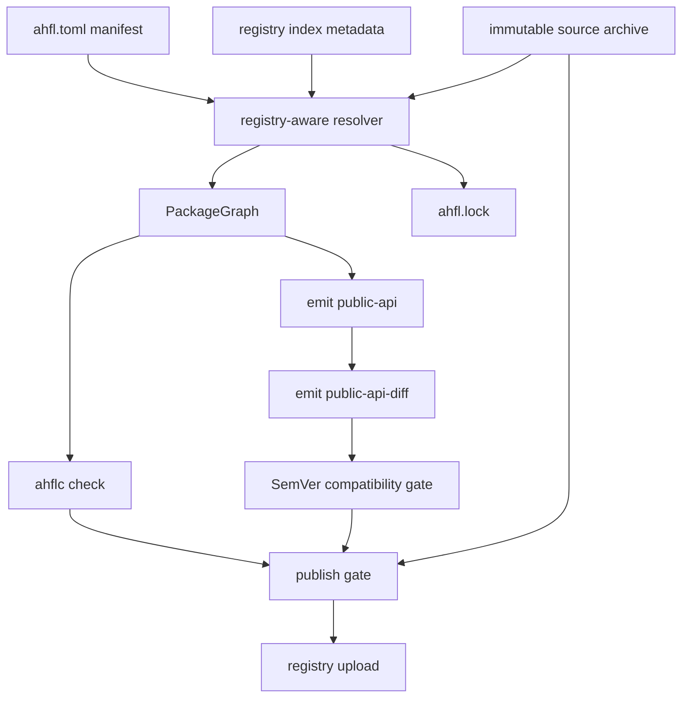
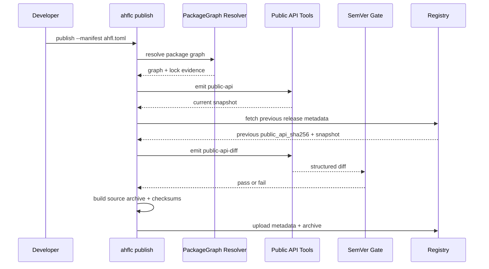

# RFC 0010: Registry Publishing and SemVer Gates

## Summary

本 RFC 定义 AHFL package registry、package publishing、SemVer compatibility gate 和 publish-time public API diff 的 v1 设计边界。它接续 [RFC 0005](./0005-package-configuration-system.zh.md) 的 package manifest / PackageGraph / lockfile 基础，以及 [RFC 0009](./0009-symbol-visibility.zh.md) 的 public API surface artifact，但不把 registry、publishing 或 SemVer 规则回填到 RFC 0005 的 manifest v1 contract。

核心决策是：registry package 是不可变 source archive 加可变 registry index metadata；dependency resolution 生成结构化 PackageGraph 和 lockfile；publishing 必须先生成 public API snapshot，并根据 SemVer bump 对 `emit public-api-diff` 的结构化结果执行 fail-closed gate。

## Motivation

RFC 0005 已经把 AHFL 工程输入统一到 `ahfl.toml`，但它明确不设计远程 registry、version range、发布认证、签名或 supply-chain metadata。RFC 0009 已经稳定 symbol visibility 和 public API artifact，但它只定义“什么是 public API”，不定义“发布一个新版本时是否允许这个 API 变化”。

如果没有独立 registry / publishing RFC，后续实现会出现三个结构性问题：

1. 把 registry source 和 version range 临时塞进 manifest v1，破坏 RFC 0005 的 v1 identity contract。
2. 把 public API diff 当作普通 CLI 报告，而不是 package publishing 的强制门禁。
3. 让 resolver、lockfile、source archive、registry metadata 和 SemVer policy 各自发明身份规则，重新落回 display string 或 ad-hoc JSON 的双事实来源。

成熟生态通常把这些层次拆开：manifest 描述 package intent，resolver 选择具体版本，lockfile 固定解析结果，registry index 保存可查询 metadata，source archive 保存不可变源码，publish gate 执行兼容性与供应链检查。AHFL 应采用同样边界，并继续坚持内部 canonical identity 使用结构化 ID / hash / flat facts，而不是用展示字符串代替语义身份。

## Goals

1. 定义 registry package coordinate、registry source、source archive、registry index metadata 和 lockfile 扩展的职责。
2. 定义 manifest schema v2 如何引入 registry dependency 和 version requirement，而不改变 manifest v1 contract。
3. 定义 publish pipeline：package graph check、public API snapshot、public API diff、SemVer gate、source archive、registry upload 和 lockfile evidence。
4. 定义 SemVer compatibility matrix，明确哪些 public API diff 需要 major、minor 或 patch bump。
5. 定义 yanking、immutability、checksum、provenance 和 registry failure semantics。
6. 定义 CLI、LSP、CI/release evidence 和 tests 的最小产品化切片。

## Non-Goals

1. 不设计 dependency feature flags；feature flags 需要 trait/std/package graph 语义稳定后另行 RFC。
2. 不设计 binary artifact cache、remote build cache 或 native runtime binary distribution。
3. 不设计私有企业 registry 的权限模型细节；本 RFC 只定义客户端和公开 registry protocol 的语义边界。
4. 不改变 RFC 0008 的 detached source unit 语义；单文件模式仍不隐式发现 registry dependency。
5. 不改变 RFC 0009 的 public API 定义；本 RFC 只消费 public API snapshot 和 diff。
6. 不允许 registry 发布路径重新引入旧 JSON descriptor 或 exported-module-equals-public-symbol 规则。

## Design

### Layering



规则：

1. Manifest 描述 source intent；registry index 描述已发布版本；lockfile 描述一次解析结果。
2. `PackageId` 仍由 PackageGraph builder 分配，是当前解析图内部身份；registry coordinate 不是 compiler 内部 canonical ID。
3. Registry coordinate 是外部包坐标：`registry_id + package_name + version`。它只能进入 resolver input、lockfile 和 diagnostics，不得替代 `PackageId` / `SourceUnitId` / `SymbolId`。
4. Source archive digest、manifest digest、public API digest 和 registry metadata digest 必须分别记录；任何一项变化都不能被 display string 合并。

### Manifest Schema V2

RFC 0005 manifest v1 保持不变。Registry dependency 和 version requirement 只能进入 manifest schema v2：

```toml
manifest_version = 2

[package]
name = "refund-audit"
version = "1.2.0"
edition = "2026"
kind = "library"

[module]
prefix = "refund_audit"
root = "src"

[exports]
modules = ["main"]

[dependencies]
std = { source = "sysroot" }
risk-model = { source = "registry", registry = "default", version = "^2.1.0" }
local-fixture = { source = "path", path = "../local-fixture" }
```

V2 rules:

1. `source = "registry"` requires `version` and may specify `registry`; missing `registry` means workspace default registry.
2. Registry dependency key must equal the resolved package name unless a future alias RFC changes import identity. V2 does not introduce package alias.
3. Version requirement supports exact, caret and tilde requirements: `1.2.3`, `^1.2.0`, `~1.2.0`。Wildcard、Git branch、date range 和 arbitrary predicate 不进入 v2。
4. `std = { source = "sysroot" }` remains special only because sysroot is toolchain-provided; registry std is out of scope.
5. Manifest v1 parser must reject registry dependency fields; it must not silently accept and ignore them.

### Registry Metadata

Registry index entry format is a structured JSON document:

```json
{
  "format_version": "ahfl.registry.index.v1",
  "registry_id": "default",
  "package": "risk-model",
  "version": "2.1.3",
  "yanked": false,
  "source_archive_sha256": "sha256:...",
  "manifest_sha256": "sha256:...",
  "public_api_sha256": "sha256:...",
  "dependencies": [
    {
      "name": "std",
      "source": "sysroot"
    }
  ]
}
```

Invariants:

1. A published `(registry_id, package, version)` is immutable. The only mutable field is `yanked`.
2. Registry index metadata must not contain source text, generated API docs or lockfile contents.
3. Source archive is content-addressed and fetched by digest after resolver selects a version.
4. Yanked versions remain resolvable only when already pinned in `ahfl.lock`; fresh resolution skips them unless explicitly requested for forensic reproduction.
5. Invalid live metadata is a hard registry error. Cache fallback is allowed only for transport unavailability and only when checksum evidence still matches.

### Resolver And Lockfile

Registry-aware resolution has two phases:

1. Candidate selection: for each registry dependency, query registry index metadata and choose the highest non-yanked version satisfying the requirement and current lockfile preference.
2. Graph materialization: fetch source archives by digest, verify manifest digest, build PackageGraph, then write `ahfl.lock`.

`ahfl.lock` must record:

1. Registry coordinate: `registry_id`, package name, version.
2. Source archive digest and manifest digest.
3. Public API digest for package versions that expose public API.
4. Resolved dependency edges, including original requirement and selected version.
5. Toolchain sysroot identity for `std`.

Lockfile identity remains graph-structured. The lockfile may print package coordinates for humans, but resolver equality uses parsed coordinates, `PackageId`, dependency edge IDs and digest fields.

### Publish Pipeline



Publish gate order:

1. Parse manifest and require package kind `library` or `application`; `standard-library` can only be released by toolchain release workflow.
2. Resolve full PackageGraph and run `ahflc check`.
3. Generate public API snapshot for every published library package.
4. Fetch previous release in the relevant compatibility line.
5. Run structured public API diff.
6. Check SemVer bump against diff severity.
7. Build normalized source archive from package root, excluding build outputs and VCS metadata.
8. Re-parse archive contents and verify manifest / public API digests match pre-archive values.
9. Upload source archive and registry index metadata transactionally.

### SemVer Gate

SemVer gate consumes public API diff facts, not Markdown docs and not display strings.

| Diff class | Required bump | Examples |
| --- | --- | --- |
| Breaking | major | public symbol removed, visibility narrowed, public signature changed, enum variant removed, variant payload changed, required trait item added, public module removed |
| Additive | minor | new public symbol, new public module, new enum variant explicitly marked additive-safe, new defaulted trait item |
| Internal | patch | private implementation changes, docs-only changes, source formatting, non-public helper changes |
| Unsafe unknown | major | diff contains unknown kind, missing previous API snapshot, malformed snapshot, API identity drift without stable mapping |

Pre-1.0 rule:

1. `0.y.z` packages may make breaking changes only by incrementing `y`.
2. Patch releases in `0.y.z` are never allowed to break public API.
3. Once a package publishes `1.0.0`, normal SemVer major/minor/patch rules apply.

### CLI Surface

Initial commands:

1. `ahflc registry resolve --manifest ahfl.toml --lockfile ahfl.lock`
2. `ahflc package archive --manifest ahfl.toml --out dist/`
3. `ahflc package publish [--dry-run] --manifest ahfl.toml --registry default --out dist/`
4. `ahflc package yank <package>@<version> --registry default`
5. `ahflc emit public-api-diff --semver-gate <old.json> <new.json> --from 1.2.3 --to 1.3.0`

The existing `emit public-api`、`emit public-api-docs` and `emit public-api-diff` remain lower-level artifact commands. Publishing consumes them; it does not duplicate their identity model.

### LSP And Tooling

LSP must not fetch registry packages on ordinary hover/definition requests. It can consume already resolved lockfile/package graph state. If a registry dependency is unresolved, LSP diagnostics should report the missing resolution and offer an explicit command action; it must not silently fetch remote code during typing.

Formatter does not change registry semantics. Test helpers must use local fixture registries with deterministic metadata and content-addressed archives.

## User Impact

Users gain a standard package publishing path:

1. Library authors can depend on registry packages through manifest v2.
2. `ahfl.lock` pins exact published versions and source digests.
3. Publishing fails before upload when public API changes do not match the version bump.
4. Yanked versions are excluded from fresh resolution but remain reproducible through existing locks.
5. LSP behavior remains deterministic and does not perform surprise network fetches.

## Compatibility and Migration

This RFC introduces a new manifest schema version for registry dependency support. It does not change manifest v1 semantics.

Breaking impact:

1. Packages that want registry dependencies must migrate from `manifest_version = 1` to `manifest_version = 2`.
2. Manifest v1 files containing registry fields remain invalid.
3. Publishing may reject version bumps that previously would have been accepted as plain source changes.

Migration:

1. Keep v1 packages on sysroot/path/workspace dependencies.
2. Move registry dependencies to manifest v2 only when package publishing is needed.
3. Run `ahflc emit public-api` before first publish to establish the public API baseline.
4. Use SemVer gate diagnostics to choose major/minor/patch bump.

## Implementation Plan

1. Manifest v2 parser and diagnostics.
   - Add schema v2 tables for registry dependency source and version requirement.
   - Keep manifest v1 rejection paths explicit.
   - Add source ranges for registry fields.
   - Initial implementation slice: `manifest_version = 2` package/workspace manifests accept registry dependency tables with exact/caret/tilde version requirements; manifest v1 keeps rejecting registry fields. PackageGraph materialization currently fails closed until the registry resolver slice lands.

2. Registry metadata model.
   - Add typed structs for registry coordinate, version requirement, registry package version, source archive digest and public API digest.
   - Add JSON parser/printer with fail-closed unknown field behavior.
   - Initial implementation slice: `RegistryIndexEntry` parses and serializes `ahfl.registry.index.v1` metadata with immutable package coordinate, yanked flag, source archive digest, manifest digest, public API digest and dependency metadata. Unknown fields, invalid digest shape and local path/workspace dependency leakage fail closed.

3. Resolver.
   - Add registry source to PackageGraph resolution.
   - Implement deterministic SemVer candidate selection.
   - Extend lockfile with registry coordinate and digest fields.
   - Initial implementation slice: registry candidate selection consumes typed `RegistryIndexEntry` values, selects the highest non-yanked version satisfying exact/caret/tilde requirements, and permits yanked versions only when an explicit locked version is supplied. Source archive payload materialization is available as a verified lower layer. PackageGraph now accepts resolver-provided registry packages as structured inputs, verifies registry id and exact/caret/tilde version requirements during graph materialization, records registry digest metadata on package nodes and dependency edges, serializes it in package graph JSON, and round-trips it through `ahfl.lock` with drift detection. Archive-backed registry `PackageInput` materialization verifies registry metadata, source archive digest, manifest digest and dependency metadata before producing a PackageGraph input. Remote registry artifact fetch now retrieves package index metadata, per-version registry index, source archive manifest and source archive payload with cache fallback only on transport unavailability. Manifest-mode CLI PackageGraph construction now turns root registry dependencies and transitive registry dependencies into fetched, verified PackageGraph inputs. `ahflc registry resolve --manifest <ahfl.toml> --lockfile <ahfl.lock>` now exposes the same resolver as the explicit lockfile-writing product path and requires a canonical `ahfl.lock` filename. Workspace-mode registry fetch remains a productization follow-up.

4. Source archive.
   - Add normalized source archive builder.
   - Verify archive round-trip by re-parsing manifest and public API snapshot.
   - Initial implementation slice: `SourceArchive` builds a deterministic `ahfl.source_archive.v1` payload from package roots, includes only `.ahfl` / `.toml` source inputs, excludes VCS/build/cache/lockfile artifacts, rejects symlinks, requires root `ahfl.toml`, normalizes CRLF/CR to LF, records per-file `sha256:<digest>`, `manifest_sha256` and `archive_sha256`, and parses/prints archive manifests with fail-closed unknown-field, digest, duplicate-path and path-escape validation. `ahflc package archive --manifest <ahfl.toml> --out <dir>` is implemented as the first CLI entrypoint and writes metadata/payload artifacts. `materialize_source_archive` verifies payload/archive/file digests, rejects duplicate or escaping paths, requires an empty output root, and writes a source tree suitable for registry resolver input; archive-backed registry `PackageInput` materialization is implemented for resolver use. Remote artifact fetch verifies fetched source archive payload digest before caching it. Public API snapshot re-check remains follow-up.

5. Publish gate.
   - Wire `ahflc package publish` through check, public API snapshot, diff, SemVer gate and registry upload.
   - Initial implementation slice: `ahflc emit public-api-diff --semver-gate --from <old> --to <new>` evaluates the RFC SemVer matrix directly on structured public API diff facts. `ahflc package publish --dry-run --manifest <ahfl.toml> --registry <id> --out <dir>` runs the local publish gate subset without upload: it builds and validates the PackageGraph, checks any present lockfile, typechecks and validates exported public API input, emits a public API snapshot and digest, builds the normalized source archive, rejects local path/workspace dependency leakage, emits `ahfl.registry.index.v1` metadata, and writes `ahfl.publish_dry_run.v1` evidence. Registry public API snapshot artifact fetch is available as the lower layer for previous-release SemVer comparison: it retrieves `/public-api`, verifies `public_api_sha256`, validates `ahfl.public_api.v1` schema and uses cache fallback only on transport unavailability. `package publish --dry-run --semver-gate --from <previous-version>` now fetches the previous release's public API snapshot from registry metadata, compares it with the current snapshot, fails closed on incompatible bumps and writes previous-snapshot evidence on success. `ahflc package publish --manifest <ahfl.toml> --registry <id> --out <dir>` runs the same gates and then sends an `ahfl.registry.publish_request.v1` envelope to the registry; the client validates returned registry index coordinates, digests, dependency metadata and `yanked=false` before writing `ahfl.publish.v1` evidence with `upload_performed=true`. `ahflc package yank <package>@<version> --registry <id> [--reason <text>]` sends an `ahfl.registry.yank_request.v1` mutation and accepts only a registry index response for the same coordinate with `yanked=true`.

6. Tooling integration.
   - Keep LSP network-free by default.
   - Add diagnostics/code action for unresolved registry dependencies.
   - Initial implementation slice: manifest-mode `ahflc dump package-graph --manifest <ahfl.toml>` resolves registry dependencies through package index metadata, fetches the selected version artifacts, materializes verified source archives and injects registry packages into PackageGraph construction. `ahflc registry resolve --manifest <ahfl.toml> --lockfile <ahfl.lock>` writes the corresponding lockfile registry metadata through the same resolver. The LSP remains network-free; workspace-mode registry fetch and editor diagnostics/code actions remain follow-up.
   - Initial implementation slice: release evidence archive now uses a local fixture registry to prove publish dry-run with SemVer gate, real registry upload, yanking and SemVer rejection without external network.

## Test Plan

1. Manifest tests: v1 rejects registry fields; v2 accepts registry dependency with valid version requirement; invalid requirement reports source-range diagnostic.
2. Registry metadata tests: parse/print round trip, unknown field rejection, digest mismatch, yanked flag mutation only.
3. Resolver tests: exact/caret/tilde selection, highest compatible version, yanked skip, lockfile preference, checksum mismatch, cache fallback only on transport unavailability.
4. PackageGraph tests: registry package `PackageId` assignment is stable within a graph and never uses package name strings as canonical identity.
5. Source archive tests: normalized payload, excluded artifacts do not affect digest, root manifest requirement, manifest parse/print validation and path-escape rejection.
6. Public API gate tests: breaking/additive/internal/unknown diff classes map to correct SemVer bump requirements.
7. CLI tests: resolve, archive, publish dry run, publish rejection, yank, locked yanked version reproduction.
8. LSP tests: unresolved registry dependency diagnostic, no network fetch during hover/definition/completion.
9. Release evidence tests: local fixture registry proves resolve/publish/yank/public API gate without external network.

## Rollout and Stabilization

Draft exit criteria:

1. Owners agree manifest v2 is the right boundary for registry dependency fields.
2. Public API diff severity taxonomy is sufficient for RFC 0009 public API facts.
3. Registry cache fallback semantics match the package registry transport failure model.

Accepted exit criteria:

1. CLI command names and manifest v2 fields are approved.
2. SemVer matrix has owner sign-off.
3. Source archive normalization and digest strategy are approved.

Implemented exit criteria:

1. Manifest v2, registry resolver, lockfile extension and publish workflow are implemented. The manifest v2 parser, registry metadata parser/printer, candidate-selection resolver, normalized source archive builder/parser, verified source archive payload materialization, archive-backed registry `PackageInput` construction, remote registry artifact fetch, registry public API snapshot artifact fetch, manifest-mode CLI registry dependency resolution, explicit `registry resolve` lockfile writing, `package archive` CLI, PackageGraph resolver-provided registry package materialization, lockfile registry digest, local publish dry-run, publish-time previous-release SemVer gate, real registry upload, yanking and release evidence slices are implemented; workspace-mode registry fetch remains follow-up only if productized.
2. Local fixture registry tests pass under CTest. Current local tests cover metadata parse/print fail-closed behavior, deterministic candidate selection, remote artifact fetch with cache fallback, public API snapshot fetch/digest/schema validation, source archive normalization/manifest validation, verified payload materialization, archive-backed registry `PackageInput` construction, CLI archive artifact creation, manifest-mode CLI registry dependency resolution, explicit registry lockfile resolution, PackageGraph registry package materialization, lockfile digest drift detection, publish dry-run artifact/evidence creation, publish-time SemVer gate pass/fail, registry publish upload envelope validation and package yanking.
3. Public API SemVer gate blocks incompatible publish attempts. The standalone CLI gate slice, publish dry-run previous-release gate slice and real publish pre-upload gate are implemented.
4. LSP never fetches registry packages implicitly.

Stabilized exit criteria:

1. Release evidence archive covers registry resolve, publish dry run, SemVer gate and yanking.
2. Public reference docs describe registry dependency syntax and publishing workflow.
3. At least one non-std package fixture publishes to a local fixture registry and resolves from a lockfile.
4. No old descriptor path participates in package publishing.

## Alternatives

1. Put registry fields into manifest v1.
   - Rejected because RFC 0005 v1 deliberately excludes registry source and version range. Mutating v1 would make existing release evidence ambiguous.

2. Use Git URLs as the first remote dependency source.
   - Rejected because Git branch/tag resolution is not a package registry, does not provide immutable package version metadata, and weakens reproducibility.

3. Treat public API diff as advisory.
   - Rejected because publishing without a fail-closed compatibility gate makes SemVer unenforceable and turns RFC 0009 artifacts into documentation only.

4. Let LSP fetch missing packages automatically.
   - Rejected because editor navigation should not silently execute network dependency resolution or introduce unreviewed source into diagnostics.

5. Copy Cargo registry behavior exactly.
   - Rejected because AHFL should reuse the manifest/resolver/lockfile/source-archive shape but keep AHFL-specific public API, visibility and runtime artifact gates.

## Open Questions

1. Should registry authentication and provenance use Sigstore/OIDC in v1, or begin with token auth plus signed checksum manifest?
2. Should package namespace be flat package names only, or should AHFL introduce organization scopes before public registry launch?
3. Should `application` packages be publishable to the same registry as libraries, or should runtime handoff bundles use a separate artifact registry?
4. Should SemVer gate allow an explicit owner-approved override, and if so how is that override represented in release evidence?

## Decision History

- 2026-07-07: Draft opened to move registry, publishing, SemVer and publish-time public API compatibility out of RFC 0005 and RFC 0009 into a dedicated RFC.
- 2026-07-07: Landed the first implementation slice for the public API SemVer gate as an explicit `emit public-api-diff` mode; registry resolver, manifest v2, source archives and publish workflow remain draft/implementation follow-up.
- 2026-07-07: Landed the manifest v2 parser slice for registry dependency syntax and fail-closed PackageGraph diagnostics; registry resolver, source archive, lockfile registry fields and publish dry run remain follow-up.
- 2026-07-07: Landed the registry metadata model slice with typed `ahfl.registry.index.v1` parser/printer and fail-closed validation; resolver candidate selection and archive materialization remain follow-up.
- 2026-07-07: Landed registry candidate selection over typed metadata, including highest compatible non-yanked selection and locked yanked reproduction; PackageGraph materialization, source archive fetch/verify and lockfile registry fields remain follow-up.
- 2026-07-07: Landed the normalized source archive builder/parser slice with deterministic source payloads, source-only file filtering, digest metadata and fail-closed archive manifest validation; CLI archive/publish wiring, PackageGraph archive materialization and lockfile registry digest fields remain follow-up.
- 2026-07-07: Landed `ahflc package archive --manifest <ahfl.toml> --out <dir>` as the first source archive CLI productization slice, with smoke coverage for artifact creation and option validation; at that point publish wiring, registry upload/yank and archive-backed PackageGraph materialization were still follow-up.
- 2026-07-07: Landed verified source archive payload materialization for registry resolver use: payload/archive/file digests, duplicate paths, path escape and non-empty output roots fail closed before any source tree is accepted.
- 2026-07-07: Landed PackageGraph materialization for resolver-provided registry packages, including registry id/version validation, package graph JSON metadata, lockfile registry digest fields and drift detection.
- 2026-07-07: Landed `ahflc package publish --dry-run` as the network-free local publish gate slice, emitting source archive, public API snapshot, registry index metadata and dry-run evidence artifacts before the later upload/yank slice.
- 2026-07-07: Landed archive-backed registry `PackageInput` construction from verified source archive payloads and `ahfl.registry.index.v1` metadata, including fail-closed digest, manifest version and dependency metadata validation.
- 2026-07-07: Landed remote registry artifact fetch for registry index, source archive manifest and source archive payload, with cache fallback only on transport unavailability and fail-closed validation before producing artifacts for PackageInput materialization.
- 2026-07-07: Landed manifest-mode CLI registry dependency resolution from package index metadata to fetched source archive artifacts and PackageGraph registry packages, with cache-backed smoke coverage and no LSP network fetch.
- 2026-07-08: Landed `ahflc registry resolve --manifest <ahfl.toml> --lockfile <ahfl.lock>` as the explicit lockfile-writing registry resolver CLI and extended cache-backed smoke coverage to assert registry package and edge metadata in `ahfl.lock`.
- 2026-07-07: Landed registry public API snapshot artifact fetch with `public_api_sha256` verification, `ahfl.public_api.v1` schema validation and cache fallback only on transport unavailability, preparing the previous-release SemVer gate wiring.
- 2026-07-07: Landed publish dry-run previous-release SemVer gate wiring: `package publish --dry-run --semver-gate --from <previous-version>` fetches registry package index metadata and previous public API snapshot, compares against the current snapshot, records pass evidence and fails closed on incompatible bumps.
- 2026-07-07: Landed registry upload/yank wiring and RFC0010 release evidence: `package publish` now uploads a validated publish request envelope after local gates, `package yank` requires a yanked registry index response, and the release evidence archive covers dry-run SemVer pass, upload, yank and SemVer rejection through a local fixture registry.
