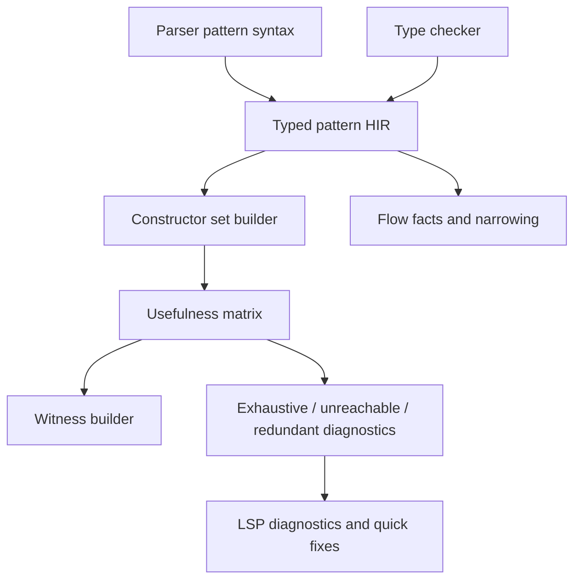
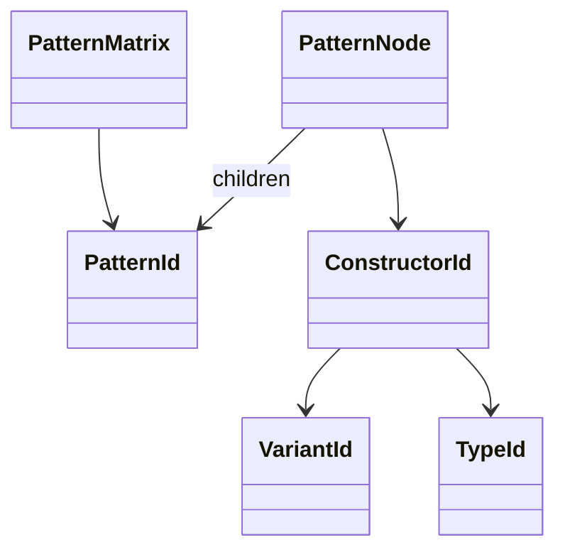
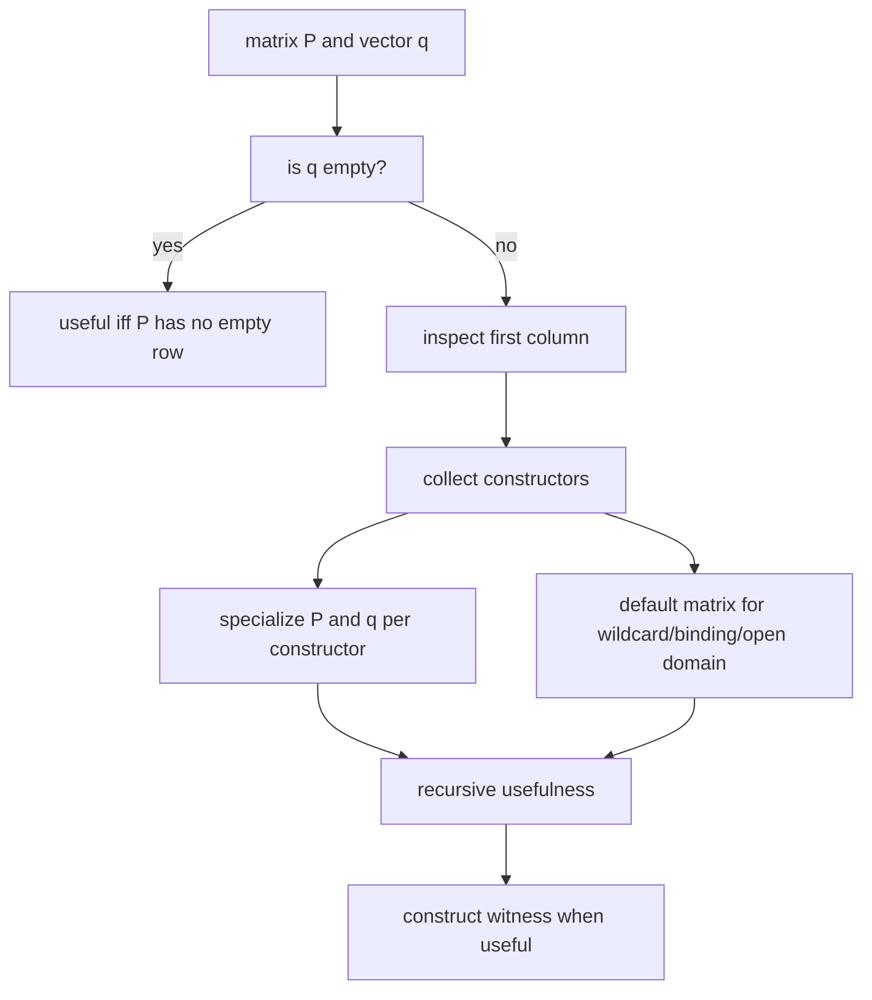

# RFC 0011: Pattern Usefulness Matrix

## Summary

本 RFC 定义 AHFL 后续完整 pattern usefulness matrix：在 `match`、`if let` 和未来 pattern binding 中，用统一算法判断 exhaustiveness、unreachable arm、redundant subpattern 和 missing witness。它接续 [RFC 0003](./0003-match-exhaustiveness-diagnostics.zh.md) 的基础 exhaustiveness diagnostics，但不把 nested pattern、literal/range pattern 或 enum payload destructuring 的半成熟规则塞回 RFC 0003。

## Motivation

RFC 0003 已经让 match exhaustiveness 从缺失能力推进到可用诊断，但它不是完整 usefulness 系统。随着 enum variant payload、if-let、optional narrowing、nested pattern、literal/range pattern 和 payload destructuring 进入语言，简单按顶层 constructor 枚举缺失 case 会产生三个问题：

1. 不能准确识别嵌套结构里的 unreachable arm。
2. 不能给出最小 missing witness，例如 `Some(JBool(_))` 或 `Err(_)`。
3. 不能在 guards、bindings、wildcards 和 range/literal pattern 混合时保持诊断稳定。

成熟编译器通常把这个问题建模成 usefulness matrix：把已有 arms 当作 pattern matrix，把候选 pattern 或 wildcard 当作 vector，通过 constructor specialization、default matrix 和 witness construction 判定一个 pattern 是否贡献新覆盖。AHFL 应采用同一模型，同时保持内部 canonical identity 使用 typed constructors、`TypeId`、`SymbolId`、`VariantId` 和 flat stores，而不是 variant spelling strings。

## Goals

1. 定义 AHFL pattern domain：wildcard、binding、enum variant、tuple-like payload、struct-like payload、bool、unit、literal、range 和 or-pattern 的 usefulness 语义。
2. 定义 match exhaustiveness、unreachable arm、redundant subpattern 和 witness diagnostics 的统一算法。
3. 让 if-let、optional narrowing 和 Result/Option convenience pattern 使用同一 pattern compiler。
4. 明确 guard 对 usefulness 的保守处理规则。
5. 定义 diagnostics 的 source range、stable code、witness rendering 和 LSP 展示行为。
6. 给出实现顺序，避免在语法和 AST 还未稳定时冻结半成熟 pattern 域。

## Non-Goals

1. 不在本 RFC 中设计 pattern matching 的新 surface syntax；它消费已经被 parser/RFC 接受的 pattern forms。
2. 不设计 regex、collection spread、slice pattern 或 SMT-backed arbitrary predicate coverage。
3. 不让 guards 参与证明 exhaustiveness；guarded arm 对 exhaustiveness 必须保守处理。
4. 不改变 RFC 0001 enum variant payload 的 constructor/typecheck 规则。
5. 不改变 RFC 0002 optional narrowing 的已稳定语义；本 RFC 只把 narrowing 的 pattern evidence 接入统一算法。

## Design

### Architecture

Pipeline:

1. Parser produces syntax-level pattern nodes with source ranges.
2. Type checker lowers syntax patterns into typed pattern HIR using type context and resolver symbols.
3. Constructor set builder maps each typed pattern column to finite or open constructor domains.
4. Usefulness matrix computes whether each arm adds coverage and whether wildcard over the scrutinee type is fully covered.
5. Witness builder renders missing cases using source-level names from resolver facts.
6. Flow facts consume successful pattern refinements for arm bodies and if-let bodies.

### Pattern HIR

Pattern HIR must be flat-store based:

`PatternNode` variants:

1. `Wildcard`
2. `Binding`
3. `Unit`
4. `BoolLiteral`
5. `IntLiteral`
6. `StringLiteral`
7. `Range`
8. `EnumVariant`
9. `StructVariant`
10. `TuplePayload`
11. `StructPayload`
12. `Or`

Every node records `SourceRange`, scrutinee `TypeId`, optional binding target and child `PatternId` list.

### Constructor Domains

| Type domain | Constructors | Exhaustiveness policy |
| --- | --- | --- |
| `Unit` | `()` | finite |
| `Bool` | `true`, `false` | finite |
| Enum | declared variants | finite if all variants known |
| `Option<T>` / `Result<T, E>` | std enum variants through normal enum model | finite |
| Int / Float / String literals | observed singleton constructors plus default | open |
| Range-capable numeric types | normalized interval constructors plus default | open |
| Struct nominal | single struct constructor | finite if all fields pattern-matchable |
| Unknown/Error | unknown | suppress cascading usefulness errors |

Open domains can prove redundancy against prior literal/range coverage, but cannot prove full exhaustiveness unless the covered interval set is complete for the type domain. For unbounded `Int`, wildcard/default remains required.

### Usefulness Algorithm

Rules:

1. Wildcard and binding are equivalent for coverage; binding additionally emits flow facts.
2. Or-pattern is useful if any alternative is useful against the current matrix; alternatives after fully-covered alternatives are redundant subpatterns.
3. A guarded arm is useful for unreachable-arm diagnostics if its pattern is useful, but it does not contribute to exhaustiveness unless guard is statically known true.
4. Unknown/Error typed patterns do not emit exhaustiveness misses; they allow type diagnostics to remain primary.
5. Constructor specialization must use `VariantId` / `ConstructorId`, not variant spelling strings.

### Diagnostics

| Code | Meaning |
| --- | --- |
| `typecheck.MATCH_MISSING_PATTERNS` | match does not cover all constructors or open-domain default witnesses |
| `typecheck.MATCH_UNREACHABLE_ARM` | arm pattern is not useful after previous arms |
| `typecheck.MATCH_OVERLAP` | arm pattern structurally overlaps a previous arm while still possibly contributing coverage |
| `typecheck.MATCH_REDUNDANT_PATTERN` | an or-pattern alternative is shadowed |
| `typecheck.MATCH_OR_PATTERN_BINDING_MISMATCH` | or-pattern branches bind different names or non-equivalent binding types |
| `typecheck.UNREACHABLE_IF_LET_ELSE` | if-let else branch is statically unreachable |
| `typecheck.INVALID_RANGE_PATTERN` | integer range pattern lower bound exceeds upper bound |

Range pattern syntax v1 is implemented for signed integer literal pattern bounds (`-?INT_LITERAL..-?INT_LITERAL`) as closed intervals. This is a pattern-only bound grammar; AHFL expression syntax still parses `-1` as unary expression syntax rather than changing the global integer literal token contract.

Diagnostics must include primary range, structured missing witness payload, related information pointing to prior covering arm when relevant, and LSP quick fixes only when the structured witness data can be converted into source-safe match arms. LSP clients must not parse rendered diagnostic text to recover pattern semantics.

## User Impact

Users get more precise diagnostics:

1. Missing cases show concrete witnesses instead of broad enum names.
2. Redundant arms are reported at the arm that is actually shadowed.
3. if-let and match behave consistently for Option/Result-like patterns.
4. LSP can surface quick fixes for structured missing enum variant, literal, range or payload witnesses.

## Compatibility and Migration

This RFC may add new diagnostics to programs that currently typecheck but contain unreachable or redundant match arms. That is a source compatibility break for diagnostics, not for runtime semantics.

Migration:

1. Remove unreachable arms.
2. Replace broad earlier patterns with narrower patterns when later arms are intended to run.
3. Add wildcard/default arms for open domains.
4. Prefer explicit enum variant arms for finite enum domains.

## Implementation Plan

1. Pattern HIR.
   - Add flat pattern store and typed pattern lowering.
   - Map enum variants and struct variant payloads through stable IDs.
2. Constructor set builder.
   - Implement finite enum/bool/unit domains first.
   - Add literal/range domains only after their language syntax stabilizes.
3. Matrix engine.
   - Implement specialization, default matrix and witness construction.
   - Keep guard handling conservative.
4. Diagnostics.
   - Replace RFC 0003 ad-hoc exhaustiveness checks with matrix-backed diagnostics.
   - Add related information and witness rendering.
5. Flow integration.
   - Route if-let and optional narrowing through typed pattern HIR.
   - Preserve RFC 0002 narrowing behavior.
6. Tooling.
   - Surface LSP diagnostics and quick fixes.
   - Add formatter coverage for new pattern forms when syntax exists.

## Current Implementation Status

截至 2026-07-09，本 RFC 仍保持 `draft`，但多条编译器基础设施切片已经落库：

1. `PatternUsefulnessContext` 提供 ID-based flat stores：`PatternDomainId`、`PatternConstructorId`、`PatternId` 作为 canonical identity；字符串仅用于 witness/debug rendering。
2. `analyze_pattern_usefulness()` 已支持 finite constructor domains、nested constructor payload、or-pattern branch redundancy、guarded row 不参与 exhaustiveness、wildcard unreachable row 和 missing witness construction。
3. `ahfl_semantics_pattern_usefulness_tests` 覆盖 wildcard、finite enum-like constructors、bool、or-pattern、nested constructor、guarded row 和 open domain fallback。
4. RFC 0003 的 `match_exhaustiveness` 已改为 matrix-backed analyzer：现有 `MATCH_MISSING_PATTERNS` / `MATCH_UNREACHABLE_ARM` / `MATCH_OVERLAP` 行为继续由 ADT match 回归测试覆盖。
5. `match_exhaustiveness` 已接入 typed enum-payload lowering：typechecker 会把 scrutinee type 和 enum resolver 传给 matrix analyzer，nested enum payload pattern 可产生 `Some(Off)` 这类 witness，并能诊断重复 nested payload arm。
6. Bool payload literal lowering 已落库：`Some(true)` / `Some(false)` 会进入有限 Bool constructor domain，missing witness 可精确到 `Some(false)`；`none` literal pattern 会覆盖 unit `None` variant；不兼容 literal pattern 现在由 typechecker 报 `TYPE_MISMATCH`，不再被静默当成 empty coverage。
7. Struct payload witness rendering 已落库：constructor flat store 记录 payload display kind 和字段名，missing witness 会渲染为 `Data { flag: false, other: false }`，而不是丢失字段语义的 tuple 形式。
8. Redundant or-pattern branch diagnostic 已落库：matrix core 的 redundant branch analysis 现在通过稳定 warning code `MATCH_REDUNDANT_PATTERN` 暴露到 typechecker，range 指向冗余分支本身，并携带 related information 指向覆盖该分支的前序 match arm 或同一 or-pattern 内的前序 branch。
9. TypedProgram 一等 pattern fact store 的首个切片已落库：typechecker 的 `match` pattern lowering 会把 literal、variant、wildcard、binding、tuple 和 or-pattern 记录到 `TypedProgram::patterns`，包含 `SourceRange`、`SourceId`、matched type、enum symbol、variant payload kind、bindings 和 child pattern index；JSON typed HIR serialization/deserialization 已覆盖该 flat store。
10. `match_exhaustiveness` matrix consumer 已迁移到 typed pattern root rows：typechecker 传递每个 match arm 的 `TypedProgram::patterns` root index、source range 和 guard exhaustiveness flag，matrix analyzer 从 typed pattern flat store lowering 到 constructor matrix，不再为常规 typed match 重新从 AST pattern lower 一套局部结构。
11. `if let` statement 的 typed pattern fact 已落库：typechecker 会把 `if let` 根 pattern 写入 `TypedProgram::patterns`，并在 `TypedStatement::pattern_index` 记录 root index；typed HIR JSON round-trip 和 monomorphization remap 已覆盖该 statement-local pattern reference。
12. `if let` 的第一条 usefulness consumer 已落库：typechecker 使用同一个 typed-row matrix analyzer 判断 `if let` pattern 是否覆盖 enum 全部 constructor，并在 `else` 分支不可达时发出 `typecheck.UNREACHABLE_IF_LET_ELSE` warning；单 constructor / 多 constructor enum 回归测试已覆盖。
13. LSP pattern quick fixes v1 已落库：`typecheck.MATCH_MISSING_PATTERNS` 只从结构化 `Diagnostic.data["missing_witnesses"]` 插入具体 missing arms（例如 `B => <TODO>,`、`Data { flag: false, other: false } => <TODO>,` 或多行 struct payload witness arm）；当结构化 payload 缺失、为空或 witness 不是 source-safe pattern fragment 时，LSP 不提供 missing-pattern rewrite，避免从用户文案反解析语义或插入过宽 wildcard arm；`typecheck.MATCH_UNREACHABLE_ARM` 可在诊断 range 对应 source-safe match arm 时删除整条 unreachable arm，覆盖单行 arm 和多行 struct payload destructuring pattern arm。handler 单元测试覆盖编辑位置、struct witness 字段逗号解析、多行 witness 插入、结构化 payload gate、unreachable-arm deletion 和 quickfix metadata。
14. `if let` narrowing consumer 已迁移到 typed pattern fact store：typechecker 从 `TypedStatement::pattern_index` 指向的 `TypedProgram::patterns` root 派生 then/else `FlowFacts` 和 branch-local payload bindings，保留 RFC 0002 Option narrowing 行为，同时避免 flow narrowing 再从 AST pattern 重新推导一套并行语义。
15. `MATCH_MISSING_PATTERNS` structured witness diagnostic payload 已落库：base diagnostic JSON、LSP protocol diagnostic JSON 和 typecheck emission 都会保留 `missing_witnesses` 字段；LSP diagnostics 回归测试覆盖从真实 typechecker 诊断到 JSON-RPC 输出的结构化 witness 数据。
16. 非 Bool open literal usefulness 已落库：Int / Float / String 类开放 payload domain 会保留 `_` 默认 witness，并把已出现 literal 降为 singleton constructor；String literal singleton identity 使用 decoded value，Float literal singleton identity 使用解析后的 binary64 值，source spelling 只用于渲染，因此等价 escape 写法或等价 Float 拼写不会产生两个不同 constructor；`Some(1), None` 不再错误地证明 `Option<Int>` exhaustiveness，`Some(_)` 才覆盖开放剩余值，重复 literal 会继续产生 unreachable / overlap warning。
17. match-arm narrowing consumer 已迁移到 typed pattern fact store：typechecker 先 lower match arm pattern root，再从 `TypedPatternKind::Variant` fact 派生 arm-local `FlowFacts`；普通 enum variant narrowing 和 std `Option::Some(_)` arm 内的 non-none narrowing 均不再从 AST spelling 单独推导。
18. 当前已实现 pattern usefulness diagnostic taxonomy 已与代码和 `docs/reference/error-codes.zh.md` 对齐：稳定用户码保持在 `typecheck.MATCH_MISSING_PATTERNS`、`typecheck.MATCH_UNREACHABLE_ARM`、`typecheck.MATCH_OVERLAP`、`typecheck.MATCH_REDUNDANT_PATTERN`、`typecheck.MATCH_OR_PATTERN_BINDING_MISMATCH`、`typecheck.UNREACHABLE_IF_LET_ELSE` 和 `typecheck.INVALID_RANGE_PATTERN`；range 反向 bounds 现在有稳定用户诊断码，并通过结构化 `Diagnostic.data["range_start"]` / `Diagnostic.data["range_end"]` 暴露 source-safe quick fix 所需事实。
19. LSP pattern binding hover v1 已落库：hover index 会遍历 `TypedProgram::patterns` 中的 `TypedPatternBinding` fact，为 `match` 和 `if let` pattern binding 声明位点注册 `LocalBinding` hover target；hover payload 在没有 expression fact 的声明位点仍显示 binding 名称和 typed pattern 推导出的类型。
20. `if let` 源语法和 AST 已迁移到通用 `PatternSyntax`：grammar 直接消费 `pattern` rule，frontend、formatter、semantic tokens、IR lowering 和 typechecker 共用 match pattern surface；旧 `IfLetPatternSyntax` 和 statement-local typed-pattern 构造路径已删除。
21. LSP pattern completion v1 已落库：completion 在光标位于 `TypedProgram::patterns` 的 pattern range 内时，使用最小 containing typed pattern 的 `matched_type` 查询 `TypeEnvironment::get_enum`，只返回该 scrutinee enum 的 variant 候选；光标位于 struct variant payload braces 内时，使用 typed variant pattern 的 enum/variant facts 返回尚未出现的 payload field 候选；当 client 声明 `completionItem.snippetSupport` 时，tuple/struct enum variant payload completion 会返回可直接展开的 destructuring snippet。`match`、`if let`、nested enum payload pattern、struct payload field filtering 和 snippet capability gating 均由 handler 回归测试覆盖。
22. LSP pattern payload signatureHelp v1 已落库：`textDocument/signatureHelp` 会优先检查 typed enum variant pattern payload 光标位置，并从 `EnumVariantInfo` 渲染 tuple payload 和 struct payload 的签名、参数标签与 active parameter；handler 回归测试覆盖 tuple payload 第二参数和 struct payload 字段位置。
23. LSP unreachable-arm quick fix 已能跨多行 pattern/body source scan：删除 `MATCH_UNREACHABLE_ARM` 时不再要求 arm 的 pattern 与 `=>` 在同一行，可完整删除多行 struct payload destructuring arm，同时保留前后 match arms。
24. LSP if-let usefulness quick fix 已落库：`typecheck.UNREACHABLE_IF_LET_ELSE` 现在可从诊断指向的 else block 反向定位 `else` keyword，source-safe 删除整个不可达 `else { ... }` 分支，同时保留 then block 和后续 statement。
25. LSP redundant or-pattern quick fix 已落库：`typecheck.MATCH_REDUNDANT_PATTERN` 可在诊断 range 对应 source-safe or-pattern branch 时删除冗余分支及相邻 `|` 分隔符，例如把 `Some(true | true)` 修正为 `Some(true)`；该编辑已覆盖多行 struct payload destructuring branch，不再局限于单行 branch。
26. Int range usefulness core 已落库：`PatternUsefulnessContext` 提供 ID-based `IntRange` pattern node，matrix matching 会在 open Int domain 中覆盖已枚举的离散 literal witness，同时保留 `_` 默认 witness，因此不会把无界 Int range 误判为穷尽；单元测试覆盖 range 覆盖、非 Int constructor 不匹配和反向 bounds fail-fast。
27. Int range pattern source surface v1 已落库：grammar 接受 `-?INT_LITERAL..-?INT_LITERAL` pattern，frontend AST、formatter、semantic tokens、typechecker、typed-HIR serialization、match usefulness lowering、IR lowering/printing/JSON 和 runtime evaluator 都以一等 range pattern 处理；typecheck 回归覆盖 open Int payload 的默认 witness、range 覆盖 literal arm、反向 bounds 诊断和非 Int payload type mismatch。LSP 已为 `typecheck.INVALID_RANGE_PATTERN` 提供结构化 quick fix：只有诊断 data 中的 signed integer bounds 与 source range 完全匹配时，才把 `a..b` source-safe 改写为 `b..a`。
28. Signed Int range bounds 已落库：`signedIntegerPatternBound` 支持负数下界/上界，AST/formatter/semantic tokens/typed-HIR/IR/runtime evaluator 继续使用解析后的 `int64` range fact；matrix core 覆盖负数 constructor witness，source tests 覆盖 `-3..3` 和 `-1..-3`。
29. Bounded Int domain matrix infrastructure 已落库：`PatternDomainKind::BoundedInt` 和 constructor-level `int_value` fact 让 range matching 不再从 debug string 反解析数值；小闭区间仍可 materialize singleton constructor witness，大闭区间会改用 normalized interval set，不枚举所有值也能证明 exhaustiveness、生成 inline Int missing witness、识别 overlap / unreachable interval row 和 redundant interval or-branch。
30. Source-level bounded Int type 首个切片已落库：源码可写 `Int(min, max)` primitive refinement type，grammar/AST/formatter/type resolver/type relations/typed-HIR JSON/IR/LSP primitive navigation 均已接入；`BoundedInt <: Int`，更窄闭区间是更宽闭区间的子类型；enum payload match 可用 `Int(0, 2)` 形成有限 pattern domain，`Some(0..1), Some(2), None` 能证明 exhaustive，域外 literal pattern 不会错误覆盖 bounded domain witness。
31. 大型嵌套 bounded Int product 已落库：当 finite constructor domain 的 payload 字段包含无法物化的 `Int(min, max)` 时，matrix 会使用 symbolic constructor space + interval product subtraction，而不是退回非 finite；`Some(Int(0, 10000))` 可通过分段 range 证明 exhaustive，也能渲染 `Some(5000)` 这类缺失 witness；多字段 constructor product 会保留有限 sibling dimension，例如 `Pair(Int(0, 10000), Bool)` 可证明两维覆盖或给出 `Pair(0, True)` witness。
32. Bounded Int literal singleton inference 首个切片已落库：当表达式检查带有 expected `Int(min, max)` 类型时，integer literal 和表达式层 signed integer literal（`+INT_LITERAL` / `-INT_LITERAL`）会先被建模成 singleton `Int(value, value)`，再交给现有 subtype relation 接受域内值、拒绝域外值；该路径覆盖 `let` 初始化和 enum constructor payload，不改变无 expected type 时 literal 仍为普通 `Int`、`-1` 仍是 unary expression 的行为。
33. Bounded Int arithmetic range inference 首个切片已落库：一元 `-` 作用于 bounded Int operand 时推导 `Int(-max, -min)`；二元 `+`、`-`、`*` 和静态排除零除数的 `/` 在两个 operand 都是 `BoundedInt` 时会推导闭区间结果；`%` 在 divisor magnitude interval 可物化时给出精确 remainder 闭区间，当所有 divisor magnitude 都严格大于所有 dividend magnitude 时给出精确 identity 闭区间，对其他 large-domain variable divisor 使用 quotient-partition 推导精确 remainder hull，只有在分析预算耗尽、溢出或边界无法证明时才回退保守 remainder 闭区间；expected bounded Int 会向 arithmetic operand 传递 literal singleton hint，因此 `let x: Int(0, 5) = 1 + 2` 可通过、`let x: Int(0, 2) = 1 + 2` 会由既有 subtype relation 拒绝；溢出、除数区间可能包含 0 或触发 `int64` `min / -1` 边界时保守回退普通 `Int`，不猜测错误区间。
34. Decimal multiplication product-scale semantics 已落库：源码表达式 `Decimal(p) * Decimal(q)` 推导为 `Decimal(p + q)`，并继续通过既有 assignability 检查拒绝错误 scale annotation；`Decimal` 加减仍要求同 scale。
35. Decimal division rounding / target-scale policy 已落库：源码层 `Decimal(p) / Decimal(q)` operator 仍保持未定义，避免引入隐式 rounding；标准库提供 `std::decimal::div(a, b, target_scale, mode)`，要求调用点显式给出目标 runtime scale 和 `RoundingMode`，runtime 按该 mode 舍入并在除数为 0 时失败。
36. Bounded String validation / literal singleton inference 首个切片已落库：源码可写 `String(min, max)` 会在 type resolver 阶段 fail-closed 拒绝反向区间；当表达式检查带有 expected `String(min, max)` 类型时，string literal 会按当前 escape 规则计算 decoded UTF-8 byte length，并先建模成 singleton `String(length, length)` 再交给既有 subtype relation 接受域内值、拒绝域外值；该路径覆盖 `let` 初始化和 enum constructor payload，不改变无 expected bounded String 时 literal 仍为普通 `String`。
37. Bounded String concatenation range inference 首个切片已落库：`String(min, max) + String(min, max)` 会推导 decoded byte length 闭区间和，边界溢出时保守回退普通 `String`；expected bounded String 会作为 concatenation operand hint，让 literal operand 先产生 singleton bounded String，再由结构化 length range 判断最终 assignability；混入裸 `String` operand 时仍保守推导普通 `String`，不凭 source spelling 猜测长度。
38. LSP local pattern binding navigation / rename v1 已落库：`textDocument/definition`、`textDocument/references`、`prepareRename` 和 `rename` 会从 AST lexical scope 与 typed expression path-root facts 识别 `match` / `if let` pattern binding 的声明和使用位点；rename 使用同文件 lexical local binding index，尊重 `let` / lambda parameter shadowing，避免把 pattern binding 改名越过更内层局部绑定。
39. LSP struct payload field completion snippets 已落库：当 client 声明 `completionItem.snippetSupport` 且光标位于 struct enum variant payload braces 内，field completion 会返回 `field: ${1:_}` snippet；不支持 snippet 的 client 继续得到 plain field label；两条路径都继续消费 typed pattern fact store 过滤已出现字段。
40. LSP local binding documentHighlight v1 已落库：`textDocument/documentHighlight` 会优先消费同一套 AST lexical scope 与 typed expression path-root facts，为 pattern binding / let binding 只高亮同一个 lexical binding 的声明和使用；找不到 semantic local binding 时才回退到旧的文本级 identifier highlight。
41. LSP pattern-aware selectionRange v1 已落库：`textDocument/selectionRange` 会把 `TypedProgram::patterns` 中同 source、包含光标位置的 typed pattern ranges 注入选择链；nested payload destructuring 可以从 identifier / bracket range 继续扩展到 inner variant pattern、outer variant pattern，再到 arm/block/file，通用文本 selection range 仍保持 compiler-agnostic。
42. Pattern semantics reference cleanup 已落库：`docs/spec/core-language.zh.md` 现在规范化列出 `IntRangePattern`、open literal payload coverage、if-let usefulness warning 和 pattern-only signed range bound；未发射的 legacy `MATCH_NOT_YET_SUPPORTED` / `LAMBDA_NOT_YET_SUPPORTED` / `FN_DECL_NOT_YET_SUPPORTED` 诊断已从 SoT 与 error-code reference 删除，避免旧阶段占位码继续污染 RFC0011 的稳定诊断面。
43. Witness cap symbolic fallback 已落库：finite constructor product 的 witness 枚举触达 `PatternUsefulnessOptions::max_witnesses` 时，matrix 不再用部分 witness 集合继续证明穷尽性，而是切换到 bounded-int interval / symbolic closed-space analyzer；如果闭合结构化 domain 可分析，仍能精确给出缺失 witness（例如 `Pair(True, True)`），避免大型 product 被错误判为 exhaustive。
44. LSP nested enum payload snippet choices 已落库：tuple enum variant pattern completion、struct enum variant pattern completion 和 struct payload field completion 现在会读取 payload `TypePtr` 与 `TypeEnvironment`，当 payload 类型本身是 enum 时，在 snippet placeholder 中提供该 enum 的 unit variant choices 与 `_` fallback；handler 回归测试覆盖 `Pair(Level, String)`、`Data { label: Level }` 和字段补全三条路径。
45. LSP Bool literal pattern completion 已落库：pattern completion 会读取最小 containing typed pattern 的 `matched_type`，当 domain 是 primitive `Bool` 时只返回 `true` / `false` literal pattern 候选，并阻止普通表达式符号或无关 enum variant 混入 pattern 位置；handler 回归测试覆盖该 typed primitive domain。
46. LSP bounded Int pattern completion v1 已落库：pattern completion 直接读取 `types::BoundedIntT` payload，小闭区间会返回域内整数字面量和完整 range pattern（例如 `0` / `1` / `2` / `0..2`），大闭区间只返回完整 range pattern（例如 `0..100`），不枚举大型 domain，也不让普通表达式符号或外层 enum variant 混入 bounded Int pattern 位置。
47. LSP open primitive pattern completion v1 已落库：open `Int` pattern domain 返回 `_`、`0` 和完整 range pattern template `0..0`，open `Float` 返回 `_` 和 `0.0`，open `String` 返回 `_` 和 `""`；bounded `String(min,max)` 默认保持 wildcard-only，因为完整 bounded string literal pattern domain 尚未进入 matrix；唯一闭合 singleton `String(0,0)` 会额外返回 `""` literal pattern。所有这些路径都会阻止普通表达式符号或外层 enum variant 混入 primitive pattern 位置。
48. Bounded String singleton pattern matrix 首个切片已落库：`String(0,0)` payload domain 会被 lower 为唯一 `""` constructor，`Some(""), None` 可证明 exhaustive，非空 string literal pattern 不会覆盖该 singleton；非 singleton `String(min,max)` 仍保持 open domain，不声明完整 string pattern domain 已进入 matrix。
49. Or-pattern binding equivalence 已落库：pattern lowering 现在以 pattern-local binding set 检测同一 pattern 内重复绑定，允许 pattern binding 合法 shadow 外层 value binding；or-pattern 每个分支独立收集 binding set，仅当所有分支绑定同一组名字且同名类型等价时才把 binding 合并进 arm / if-let 局部作用域，否则报告 `typecheck.MATCH_OR_PATTERN_BINDING_MISMATCH`。
50. Struct variant missing-field quick fix 首个切片已落库：`typecheck.MISSING_VARIANT_FIELD` 现在携带结构化 `Diagnostic.data["variant_name"]` / `["missing_field"]`，LSP 只在 diagnostic range 精确覆盖 struct variant pattern、字段名 source-safe 且能定位 payload braces 时提供 `Insert missing variant field` quick fix；单行 `Data { code }` 会插入 `, label`，多行 destructuring 会按 close-brace indent 插入 `label,`，不从用户文案反解析语义。
51. Struct variant unexpected-field quick fix 首个切片已落库：`typecheck.UNEXPECTED_VARIANT_FIELD` 现在携带结构化 `Diagnostic.data["variant_name"]` / `["unexpected_field"]` / `["variant_field_context"]`，LSP 只在 `variant_field_context = "pattern"` 且 diagnostic range 覆盖 source-safe field fragment 时提供 `Remove unexpected variant field` quick fix；单行 `Data { code, extra, label }` 会删除相邻逗号分隔片段，多行独立 field 会删除整行。constructor 场景只暴露结构化 data，不自动改构造表达式。
52. Struct variant duplicate-field quick fix 首个切片已落库：`typecheck.DUPLICATE_VARIANT_FIELD` 现在携带结构化 `Diagnostic.data["variant_name"]` / `["duplicate_field"]` / `["variant_field_context"]`，覆盖 declaration / pattern / constructor 三类来源；LSP 只在 `variant_field_context = "pattern"` 且 diagnostic range 覆盖 source-safe field fragment 时提供 `Remove duplicate variant field` quick fix。declaration / constructor 场景只暴露结构化 data，不自动决定保留哪个字段语义。
53. Struct variant rest-pattern-aware field completion 已落库：LSP `CompletionItem` 现在支持标准 `textEdit`；当 struct payload field completion 的光标落在顶层 `..` rest pattern token 上时，completion 不再让客户端做裸插入，而是 source-safe 替换 `..` 为字段 pattern 或 snippet，例如把 `Data { .. }` 的 `..` 替换为 `code`，把 `Data { code, .. }` 的 `..` 替换为 `label: ${1|Low,High,_|}`。普通非 rest 位置仍保持原有 `insertText` 行为。
54. Wildcard-pattern replacement completion 已落库：LSP pattern completion 现在在当前最小 typed pattern 是源码 `_` token 时，为 enum / Bool / bounded Int / open primitive / bounded String 等候选统一发出 `CompletionItem.textEdit`，source-safe 替换 `_` 而不是让客户端裸插入相邻文本；snippet-capable 的 enum payload destructuring 也把 snippet 写入 `textEdit.newText` 并保留 `insertTextFormat = Snippet`。struct payload braces 内部现在优先检查最小子 pattern，因此 `Data { label: _ }` 的 `_` 会按 `label` 的 enum 类型补 `Low` / `High`，不会被父 payload 的缺失字段补全遮蔽。

尚未完成：

1. 未来 destructuring UX 仍需继续推进：更深 completion / code-action 编辑序列还需要继续消费 typed pattern fact store；pattern binding 基础导航与 rename v1、documentHighlight v1、selectionRange v1、struct payload field snippet completion v1、struct variant rest-pattern-aware field completion textEdit v1、wildcard-pattern replacement completion v1、struct payload child-pattern priority completion v1、struct variant missing-field quick fix v1、struct variant unexpected-field quick fix v1、struct variant duplicate-field quick fix v1、nested enum payload snippet choices、Bool literal pattern completion v1、bounded Int pattern completion v1 和 open primitive pattern completion v1 已完成。
2. range pattern v1 仍只覆盖 signed integer literal 闭区间；非 literal refinement propagation 已有 bounded operand `+` / `-` / `*`、非零 `/`、finite variable-divisor 精确 `%`、divisor-dominates oversized exact `%`、quotient-partition large-domain exact `%` 和 bounded String concatenation range inference，Decimal multiplication product-scale semantics 与显式 Decimal division target-scale / rounding API 已落库；未来 Float refinement semantics 仍未稳定。
3. typed-pattern-driven LSP diagnostics 已完成结构化 missing witness code-action gate；后续只剩更深 destructuring 编辑序列的 UX 产品化。

## Test Plan

1. Unit tests for matrix usefulness: wildcard, enum variants, bool, or-pattern, nested constructor, guarded arm, open domain default, Int range matching, bounded Int interval analysis, symbolic bounded constructor products and witness-cap symbolic fallback.
2. Typecheck diagnostics tests: non-exhaustive match, unreachable arm, redundant or-pattern, or-pattern binding mismatch, invalid range, non-Int range mismatch, bounded Int literal/arithmetic/division/modulo assignability, bounded String literal/concatenation assignability, bounded String singleton pattern exhaustiveness, decoded String literal canonicalization, Float literal numeric canonicalization and large bounded enum payload witnesses.
3. Witness golden tests: enum payload, nested enum, bool, Result/Option and open Int with default.
4. if-let tests: else reachable/unreachable and narrowing preservation.
5. LSP tests: diagnostics ranges, related information, quick fix availability, structured missing/unexpected/duplicate variant field data, multi-line unreachable-arm edits, unreachable if-let else edits, redundant or-pattern branch edits, struct variant missing-field insertion edits, struct variant unexpected-field deletion edits, struct variant duplicate-field deletion edits, rest-pattern-aware struct field completion text edits, wildcard-pattern replacement completion text edits, struct payload child-pattern priority completion, payload completion snippets, struct payload field snippets, Bool literal pattern completion, bounded Int pattern completion, open primitive pattern completion, bounded String singleton completion, pattern payload signatureHelp, lexical pattern binding navigation/rename, local-binding documentHighlight and pattern-aware selectionRange.
6. Regression tests proving RFC 0001 enum payload and RFC 0002 optional narrowing behavior remain stable.

## Rollout and Stabilization

Draft exit criteria:

1. Pattern syntax roadmap is aligned with parser/frontend owners.
2. Typed pattern HIR shape is approved.
3. Diagnostic codes and witness syntax are approved.

Accepted exit criteria:

1. Literal/range/nested payload pattern surface is stable enough to implement.
2. Owners agree guarded arms do not prove exhaustiveness.
3. Test matrix covers finite and open domains.

Implemented exit criteria:

1. Matrix engine replaces RFC 0003 exhaustiveness checker.
2. Existing RFC 0001 / RFC 0002 / RFC 0003 tests still pass.
3. New diagnostics and LSP tests pass.

Stabilized exit criteria:

1. `docs/spec/core-language.zh.md` describes full pattern semantics. 状态：v1 已覆盖现有 `Pattern` surface、Int range pattern、literal/open-domain coverage、guard exhaustiveness、if-let usefulness 与 narrowing 规则；未来 Float refinement semantics 仍需另行稳定。
2. `docs/reference/error-codes.zh.md` lists stable pattern diagnostics. 状态：v1 已列出现行 pattern 诊断码，并删除不再发射的旧阶段 `*_NOT_YET_SUPPORTED` 占位码。
3. Release evidence includes representative finite/open/nested pattern cases.

## Alternatives

1. Keep RFC 0003's current top-level exhaustiveness diagnostics.
   - Rejected because it cannot scale to nested payloads, ranges or precise unreachable-arm diagnostics.
2. Lower match into chained if statements and rely on typecheck.
   - Rejected because it loses constructor coverage information and cannot produce missing witnesses.
3. Use SMT for all pattern coverage.
   - Rejected for v1 because finite constructor matrix handles AHFL's near-term pattern domain more simply and deterministically.
4. Treat guards as proving exhaustiveness.
   - Rejected because arbitrary guard predicates are not decidable by the pattern compiler and would create unsound coverage claims.

## Open Questions

1. Closed for v1: or-pattern syntax and signed Int range pattern syntax have both landed. Future ordering questions are migration/product rollout questions, not RFC0011 semantic blockers.
2. `Int(min, max)` 已有 source syntax 和大型嵌套 bounded product matrix 支持；literal/refinement inference 应采用什么边界，才能在不牺牲可判定性的前提下继续喂给完整矩阵？
3. Closed for v1: missing witness rendering uses the scrutinee enum context and emits source-safe variant pattern fragments, while keeping canonical identity in `PatternConstructorId` / typed facts rather than display strings. If AHFL later requires qualification-sensitive variant pattern spelling, that belongs in a follow-up LSP/source-edit display policy and must not alter matrix identity.

## Decision History

- 2026-07-07: Draft opened as the follow-up home for RFC 0003's full usefulness matrix work after enum payload, optional narrowing and if-let support landed.
- 2026-07-08: Landed the first compiler infrastructure slice: an ID-based flat pattern usefulness context plus finite constructor matrix tests for wildcard, bool/enum-like constructors, nested payload witnesses, guarded rows, or-pattern redundancy and open-domain fallback.
- 2026-07-08: Routed RFC 0003 `match_exhaustiveness` through the matrix core for top-level enum coverage while preserving existing diagnostics and ADT match regression behavior.
- 2026-07-08: Added `TypedProgram::patterns` as the first typed pattern HIR flat-store slice for `match` typechecking, including typed HIR JSON round-trip coverage.
- 2026-07-08: Migrated regular `match` exhaustiveness analysis to consume typed pattern root rows from `TypedProgram::patterns`, leaving the AST lowering path only as compatibility fallback for callers without typed rows.
- 2026-07-08: Added typed pattern HIR roots for `if let` statements and serialized `TypedStatement::pattern_index`, so statement-local patterns now share the same flat-store evidence model as `match` arms.
- 2026-07-08: Routed `if let` unreachable-else diagnostics through the typed pattern matrix consumer and documented `typecheck.UNREACHABLE_IF_LET_ELSE` as the first if-let usefulness diagnostic.
- 2026-07-08: Added the first LSP pattern quick fix: `MATCH_MISSING_PATTERNS` can insert a wildcard match arm when the affected match block is source-locatable.
- 2026-07-08: Migrated `if let` flow narrowing and payload binding introduction to consume `TypedProgram::patterns`, making the statement's narrowing behavior use the same typed pattern evidence as usefulness diagnostics.
- 2026-07-08: Upgraded the LSP `MATCH_MISSING_PATTERNS` quick fix to insert rendered missing witness arms when the diagnostic message exposes a source-safe witness list, while keeping wildcard fallback for unsafe or unstructured diagnostics.
- 2026-07-08: Promoted missing-pattern witnesses into structured diagnostic payloads (`Diagnostic.data["missing_witnesses"]`) and taught the LSP quick fix to prefer that stable data over user-facing message parsing.
- 2026-07-08: Removed the legacy `MATCH_MISSING_PATTERNS` rendered-message parsing and wildcard fallback path from LSP code actions. Missing-pattern quick fixes now require structured `missing_witnesses` data and skip unsafe or unstructured diagnostics.
- 2026-07-08: Added symbolic open-domain literal usefulness for Int / Float / String payloads, including default `_` witnesses, literal singleton constructors and `Option<Int>` typecheck regressions for incomplete literal-only matches.
- 2026-07-08: Migrated match-arm flow narrowing to consume the typed pattern root fact instead of re-deriving the selected variant from AST pattern syntax.
- 2026-07-08: Aligned the RFC0011 diagnostic taxonomy with the shipped `typecheck.MATCH_*` / `typecheck.UNREACHABLE_IF_LET_ELSE` codes and removed the unimplemented range-code placeholder.
- 2026-07-08: Added an LSP quick fix for `typecheck.MATCH_UNREACHABLE_ARM` that removes a source-safe single-line unreachable match arm using the typed-row diagnostic range.
- 2026-07-08: Added typed-pattern-driven LSP hover for pattern binding declaration sites, covering both `match` and `if let` bindings through `TypedProgram::patterns`.
- 2026-07-08: Generalized `if let` source syntax and AST to consume the same `PatternSyntax` as `match`, removing the dedicated `IfLetPatternSyntax` path.
- 2026-07-08: Added typed-pattern-driven LSP signatureHelp for enum variant pattern payloads, covering tuple payload positions and struct payload fields through `TypedProgram::patterns`.
- 2026-07-08: Added LSP payload destructuring snippets for enum variant pattern completions when the client advertises snippet support.
- 2026-07-08: Extended the `MATCH_UNREACHABLE_ARM` LSP quick fix to delete source-safe multi-line destructuring arms, including struct payload pattern arms.
- 2026-07-08: Added an LSP quick fix for `UNREACHABLE_IF_LET_ELSE` that removes the source-safe unreachable else branch while preserving the then branch and following statements.
- 2026-07-08: Added non-enumerated bounded Int interval analysis so large closed integer domains can prove usefulness and render representative missing witnesses without materializing every constructor.
- 2026-07-08: Added an LSP quick fix for `MATCH_REDUNDANT_PATTERN` that removes a source-safe redundant or-pattern branch and its adjacent separator.
- 2026-07-08: Added Int range support to the pattern usefulness matrix core. This is a non-syntax infrastructure slice: it matches enumerated Int literal witnesses conservatively while keeping open-domain default witnesses, and leaves parser/typechecker/LSP range-pattern surface work for the next slice.
- 2026-07-08: Landed Int range pattern source surface v1 for `INT_LITERAL..INT_LITERAL`, including AST/formatter/semantic tokens/typecheck/typed-HIR/IR/runtime evaluator support and the stable `typecheck.INVALID_RANGE_PATTERN` diagnostic for reversed bounds.
- 2026-07-08: Extended Int range pattern bounds to signed integer pattern bounds (`-?INT_LITERAL..-?INT_LITERAL`) without changing expression integer literal tokenization; tests cover frontend roundtrip, typed-HIR serialization, matrix matching, source typecheck diagnostics, and runtime evaluation for negative bounds.
- 2026-07-08: Added bounded Int domain infrastructure to the matrix core. Int witnesses now carry structured `int_value` facts instead of deriving range semantics from display strings, and finite bounded Int tests cover missing witnesses, exhaustive range coverage and singleton unreachable diagnostics.
- 2026-07-08: Landed source-level `Int(min, max)` as the first bounded integer type slice, including syntax/AST/type resolver/type relations/typed-HIR JSON/IR/LSP primitive navigation and enum payload match exhaustiveness tests.
- 2026-07-08: Added symbolic bounded Int constructor product analysis. Finite constructor domains whose fields contain non-materialized `Int(min, max)` now use interval product subtraction, preserving precise missing witnesses such as `Some(5000)` without materializing every payload value.
- 2026-07-08: Added bounded Int literal singleton inference under expected `Int(min, max)` types, covering let initializers and enum constructor payloads through existing subtype checks.
- 2026-07-08: Added bounded Int arithmetic range inference for `+`, `-` and `*`, including expected-type propagation for literal singleton operands and conservative fallback for overflow or unstable operators.
- 2026-07-08: Added bounded Int division/modulo range inference. Division infers closed intervals when the divisor range statically excludes zero; modulo infers exact singleton results for singleton operands and conservative bounded remainder intervals otherwise.
- 2026-07-09: Tightened bounded Int modulo inference for singleton divisor intervals. The typechecker now derives exact positive, negative and mixed-sign remainder ranges for fixed divisors, while variable-divisor intervals remain conservative.
- 2026-07-09: Extended expected bounded Int singleton inference to expression-level signed integer literals and propagated unary bounded Int negation as `Int(-max, -min)` with conservative overflow fallback.
- 2026-07-09: Added exact bounded Int modulo hulls for materialized finite divisor magnitude intervals, covering positive, negative, mixed-sign lhs intervals and negative divisor ranges; non-dominating oversized divisor domains still use the conservative hull.
- 2026-07-09: Settled Decimal division as an explicit stdlib API rather than a source-level `/` operator. `std::decimal::div(a, b, target_scale, mode)` now requires target scale and rounding mode at the call site, with runtime tests for exact, fractional, half-even and signed ceiling/floor rounding.
- 2026-07-09: Added the first oversized variable-divisor modulo exact slice: when every divisor magnitude is greater than every dividend magnitude, `%` now preserves the dividend bounded interval exactly instead of falling back to the conservative remainder hull.
- 2026-07-09: Added quotient-partition exact hull inference for large-domain variable-divisor bounded Int modulo. The analyzer now computes fixed-endpoint modulo extrema and reachable `0` / `d - 1` witnesses without enumerating every divisor magnitude, with a bounded segment budget and conservative fallback when proof cost or integer boundaries exceed that budget.
- 2026-07-09: Added bounded String interval validation and expected-type string literal singleton inference, covering let initializers and enum constructor payloads through existing subtype checks.
- 2026-07-09: Added bounded String concatenation range inference, including expected-type literal singleton propagation for concatenation operands and conservative fallback for unbounded operands or length-bound overflow.
- 2026-07-09: Extended the `MATCH_REDUNDANT_PATTERN` quick fix to remove source-safe multi-line or-pattern branches, including struct payload destructuring branches, while preserving the existing adjacent-separator deletion contract.
- 2026-07-09: Added type-directed nested enum payload choices to LSP pattern snippets. Tuple/struct enum variant pattern snippets and struct payload field snippets now inspect payload types and offer unit enum variant choices plus `_` fallback instead of always inserting an untyped placeholder.
- 2026-07-09: Extended the `MATCH_MISSING_PATTERNS` quick fix to insert source-safe multi-line witness arms from structured diagnostic data, improving complex payload destructuring edits without parsing rendered messages.
- 2026-07-09: Added LSP lexical local binding navigation and rename for pattern bindings. Definition, references, prepareRename and rename now identify `match` / `if let` pattern bindings through AST scope plus typed expression path-root facts, and respect inner `let` / lambda parameter shadowing.
- 2026-07-09: Added client-gated LSP snippets for struct enum variant payload field completion. Field completions inside destructuring braces now insert `field: ${1:_}` for snippet-capable clients while preserving typed-pattern field filtering for all clients.
- 2026-07-09: Added semantic local-binding documentHighlight. The LSP now highlights pattern and let binding declarations/references by lexical identity before falling back to text-level identifier matching.
- 2026-07-09: Added pattern-aware selectionRange. The LSP now augments generic text selection chains with nested typed pattern ranges from `TypedProgram::patterns`.
- 2026-07-09: Added related information for `MATCH_REDUNDANT_PATTERN`. The usefulness matrix now propagates prior covering row and prior or-branch ranges through match exhaustiveness diagnostics so CLI and LSP diagnostics point at the source that made the branch redundant.
- 2026-07-09: Synchronized the pattern semantics reference and stable diagnostic surface with the implemented RFC0011 state. `core-language.zh.md` now includes Int range pattern and if-let usefulness semantics, and the unused legacy `*_NOT_YET_SUPPORTED` typecheck diagnostics were removed from the diagnostics SoT and error-code reference.
- 2026-07-09: Added witness-cap symbolic fallback for closed constructor products. `analyze_pattern_usefulness()` now refuses to prove exhaustiveness from a partial materialized witness set and falls back to interval / symbolic closed-space analysis when `max_witnesses` is reached.
- 2026-07-09: Added typed primitive domain completion for Bool patterns. LSP pattern completion now returns only `true` / `false` in Bool pattern contexts and does not leak generic expression symbols into that pattern domain.
- 2026-07-09: Added typed bounded Int pattern completion. LSP pattern completion now enumerates small `Int(min, max)` domains, offers a range pattern for larger domains, and suppresses unrelated expression-symbol completion in bounded Int pattern contexts.
- 2026-07-09: Added typed open primitive pattern completion. LSP pattern completion now offers source-safe skeletons for open `Int`, `Float` and `String` pattern domains, keeps general bounded `String(min,max)` conservative at wildcard-only completion, and suppresses unrelated expression-symbol completion in those pattern contexts.
- 2026-07-09: Added typed `String(0,0)` singleton pattern completion. LSP pattern completion now offers `""` for the only closed bounded String singleton while leaving non-singleton bounded String domains wildcard-only.
- 2026-07-09: Added bounded `String(0,0)` singleton pattern matrix semantics and decoded String literal constructor identity. `String(0,0)` payload matches now treat `""` as the only constructor, while open String domains canonicalize escaped-equivalent literal patterns by decoded value instead of source spelling.
- 2026-07-09: Added numeric constructor identity for open Float literal patterns. Open Float domains now canonicalize equivalent literal spellings through the parsed binary64 value, so `1.0` and `1.00` are one singleton constructor while display spelling remains source-preserving.
- 2026-07-09: Added a structured LSP quick fix for reversed Int range patterns. `INVALID_RANGE_PATTERN` diagnostics now carry `range_start` / `range_end` data, and the LSP swaps bounds only when that structured data matches the diagnostic source range.
- 2026-07-09: Added or-pattern binding equivalence semantics. Branches now bind names independently and merge them only when every branch binds the same names with equivalent types, while pattern bindings can shadow outer locals without triggering duplicate-binding diagnostics.
- 2026-07-09: Added structured `MISSING_VARIANT_FIELD` diagnostic data and an LSP quick fix that inserts missing struct variant pattern fields from that data instead of parsing diagnostic text.
- 2026-07-09: Added structured `UNEXPECTED_VARIANT_FIELD` diagnostic data and an LSP quick fix that removes source-safe unexpected struct variant pattern fields while leaving constructor diagnostics manual.
- 2026-07-09: Added structured `DUPLICATE_VARIANT_FIELD` diagnostic data and an LSP quick fix that removes source-safe duplicate struct variant pattern fields while leaving declaration and constructor diagnostics manual.
- 2026-07-09: Added rest-pattern-aware struct variant field completion. Field completion now emits a `textEdit` that replaces a source-safe top-level `..` rest pattern token instead of producing invalid adjacent text insertion.
- 2026-07-09: Added wildcard-pattern replacement completion and nested struct payload child-pattern priority. Pattern completions now replace source-safe `_` tokens via `CompletionItem.textEdit`, including snippet completions, and `Data { label: _ }` completion now follows the child pattern type before parent struct-field completion.
