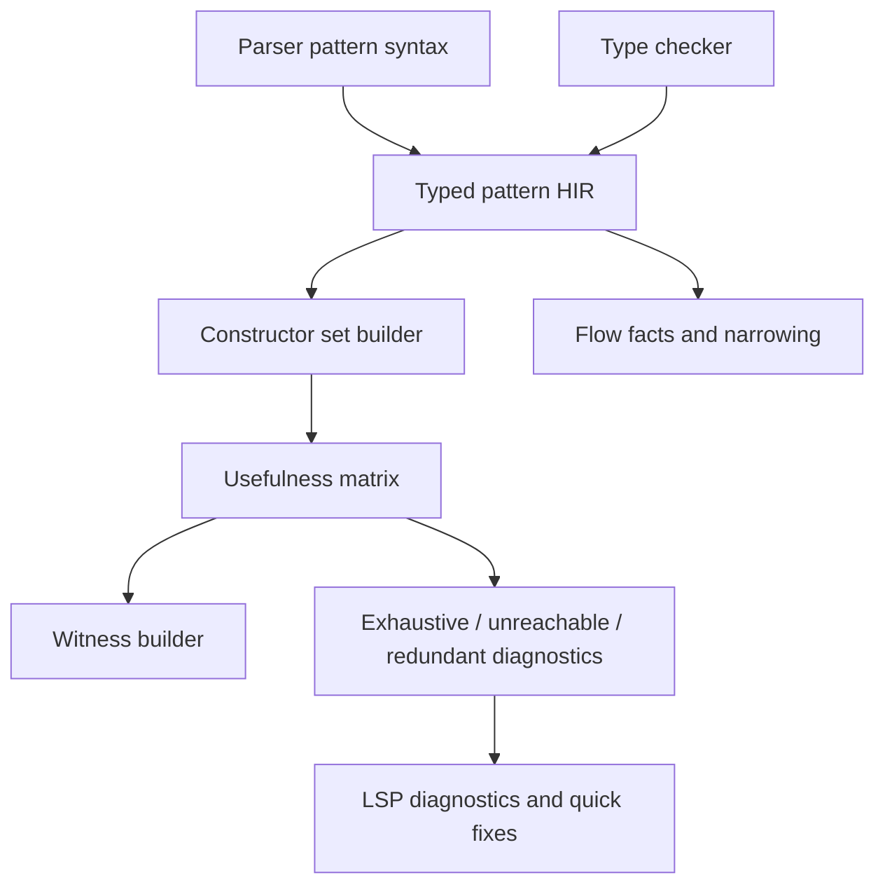
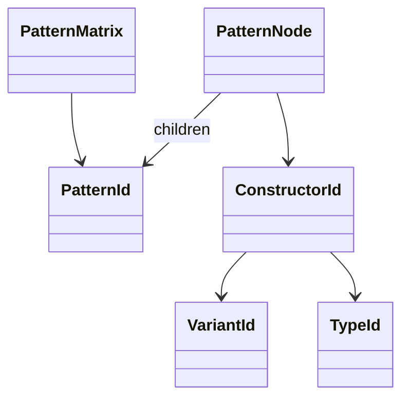
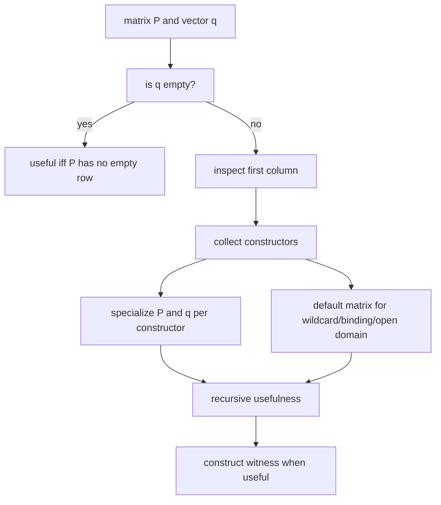

# RFC 0011: Pattern Usefulness Matrix

## Summary

本 RFC 定义 AHFL 后续完整 pattern usefulness matrix：在 `match`、`if let` 和未来 pattern binding 中，用统一算法判断 exhaustiveness、unreachable arm、redundant subpattern 和 missing witness。它接续 [RFC 0003](./0003-match-exhaustiveness-diagnostics.zh.md) 的基础 exhaustiveness diagnostics，但不把 nested pattern、literal/range pattern 或 enum payload destructuring 的半成熟规则塞回 RFC 0003。

## Motivation

RFC 0003 已经让 match exhaustiveness 从缺失能力推进到可用诊断，但它不是完整 usefulness 系统。随着 enum variant payload、if-let、optional narrowing、nested pattern、literal/range pattern 和 payload destructuring 进入语言，简单按顶层 constructor 枚举缺失 case 会产生三个问题：

1. 不能准确识别嵌套结构里的 unreachable arm。
2. 不能给出最小 missing witness，例如 `Some(JBool(_))` 或 `Err(_)`。
3. 不能在 guards、bindings、wildcards 和 range/literal pattern 混合时保持诊断稳定。

成熟编译器通常把这个问题建模成 usefulness matrix：把已有 arms 当作 pattern matrix，把候选 pattern 或 wildcard 当作 vector，通过 constructor specialization、default matrix 和 witness construction 判定一个 pattern 是否贡献新覆盖。AHFL 应采用同一模型，同时保持内部 canonical identity 使用 typed constructors、`TypeId`、`SymbolId`、`VariantId` 和 flat stores，而不是 variant spelling strings。

## Goals

1. 定义 AHFL pattern domain：wildcard、binding、enum variant、tuple-like payload、struct-like payload、bool、unit、literal、range 和 or-pattern 的 usefulness 语义。
2. 定义 match exhaustiveness、unreachable arm、redundant subpattern 和 witness diagnostics 的统一算法。
3. 让 if-let、optional narrowing 和 Result/Option convenience pattern 使用同一 pattern compiler。
4. 明确 guard 对 usefulness 的保守处理规则。
5. 定义 diagnostics 的 source range、stable code、witness rendering 和 LSP 展示行为。
6. 给出实现顺序，避免在语法和 AST 还未稳定时冻结半成熟 pattern 域。

## Non-Goals

1. 不在本 RFC 中设计 pattern matching 的新 surface syntax；它消费已经被 parser/RFC 接受的 pattern forms。
2. 不设计 regex、collection spread、slice pattern 或 SMT-backed arbitrary predicate coverage。
3. 不让 guards 参与证明 exhaustiveness；guarded arm 对 exhaustiveness 必须保守处理。
4. 不改变 RFC 0001 enum variant payload 的 constructor/typecheck 规则。
5. 不改变 RFC 0002 optional narrowing 的已稳定语义；本 RFC 只把 narrowing 的 pattern evidence 接入统一算法。

## Design

### Architecture

Pipeline:

1. Parser produces syntax-level pattern nodes with source ranges.
2. Type checker lowers syntax patterns into typed pattern HIR using type context and resolver symbols.
3. Constructor set builder maps each typed pattern column to finite or open constructor domains.
4. Usefulness matrix computes whether each arm adds coverage and whether wildcard over the scrutinee type is fully covered.
5. Witness builder renders missing cases using source-level names from resolver facts.
6. Flow facts consume successful pattern refinements for arm bodies and if-let bodies.

### Pattern HIR

Pattern HIR must be flat-store based:

`PatternNode` variants:

1. `Wildcard`
2. `Binding`
3. `Unit`
4. `BoolLiteral`
5. `IntLiteral`
6. `StringLiteral`
7. `Range`
8. `EnumVariant`
9. `StructVariant`
10. `TuplePayload`
11. `StructPayload`
12. `Or`

Every node records `SourceRange`, scrutinee `TypeId`, optional binding target and child `PatternId` list.

### Constructor Domains

| Type domain | Constructors | Exhaustiveness policy |
| --- | --- | --- |
| `Unit` | `()` | finite |
| `Bool` | `true`, `false` | finite |
| Enum | declared variants | finite if all variants known |
| `Option<T>` / `Result<T, E>` | std enum variants through normal enum model | finite |
| Int / Float / String literals | observed singleton constructors plus default | open |
| Range-capable numeric types | normalized interval constructors plus default | open |
| Struct nominal | single struct constructor | finite if all fields pattern-matchable |
| Unknown/Error | unknown | suppress cascading usefulness errors |

Open domains can prove redundancy against prior literal/range coverage, but cannot prove full exhaustiveness unless the covered interval set is complete for the type domain. For unbounded `Int`, wildcard/default remains required.

### Usefulness Algorithm

Rules:

1. Wildcard and binding are equivalent for coverage; binding additionally emits flow facts.
2. Or-pattern is useful if any alternative is useful against the current matrix; alternatives after fully-covered alternatives are redundant subpatterns.
3. A guarded arm is useful for unreachable-arm diagnostics if its pattern is useful, but it does not contribute to exhaustiveness unless guard is statically known true.
4. Unknown/Error typed patterns do not emit exhaustiveness misses; they allow type diagnostics to remain primary.
5. Constructor specialization must use `VariantId` / `ConstructorId`, not variant spelling strings.

### Diagnostics

| Code | Meaning |
| --- | --- |
| `pattern.NON_EXHAUSTIVE_MATCH` | match does not cover all constructors |
| `pattern.UNREACHABLE_ARM` | arm pattern is not useful after previous arms |
| `pattern.REDUNDANT_OR_PATTERN` | an or-pattern alternative is shadowed |
| `pattern.UNREACHABLE_IF_LET_ELSE` | if-let else branch is statically unreachable |
| `pattern.INVALID_RANGE_PATTERN` | range pattern is malformed or not allowed for the type |

Diagnostics must include primary range, missing witness, related information pointing to prior covering arm when relevant, and LSP quick fix only when inserting a wildcard arm is source-safe.

## User Impact

Users get more precise diagnostics:

1. Missing cases show concrete witnesses instead of broad enum names.
2. Redundant arms are reported at the arm that is actually shadowed.
3. if-let and match behave consistently for Option/Result-like patterns.
4. LSP can surface quick fixes for missing wildcard or missing enum variant arms.

## Compatibility and Migration

This RFC may add new diagnostics to programs that currently typecheck but contain unreachable or redundant match arms. That is a source compatibility break for diagnostics, not for runtime semantics.

Migration:

1. Remove unreachable arms.
2. Replace broad earlier patterns with narrower patterns when later arms are intended to run.
3. Add wildcard/default arms for open domains.
4. Prefer explicit enum variant arms for finite enum domains.

## Implementation Plan

1. Pattern HIR.
   - Add flat pattern store and typed pattern lowering.
   - Map enum variants and struct variant payloads through stable IDs.
2. Constructor set builder.
   - Implement finite enum/bool/unit domains first.
   - Add literal/range domains only after their language syntax stabilizes.
3. Matrix engine.
   - Implement specialization, default matrix and witness construction.
   - Keep guard handling conservative.
4. Diagnostics.
   - Replace RFC 0003 ad-hoc exhaustiveness checks with matrix-backed diagnostics.
   - Add related information and witness rendering.
5. Flow integration.
   - Route if-let and optional narrowing through typed pattern HIR.
   - Preserve RFC 0002 narrowing behavior.
6. Tooling.
   - Surface LSP diagnostics and quick fixes.
   - Add formatter coverage for new pattern forms when syntax exists.

## Current Implementation Status

截至 2026-07-08，本 RFC 仍保持 `draft`，但前两条编译器基础设施切片已经落库：

1. `PatternUsefulnessContext` 提供 ID-based flat stores：`PatternDomainId`、`PatternConstructorId`、`PatternId` 作为 canonical identity；字符串仅用于 witness/debug rendering。
2. `analyze_pattern_usefulness()` 已支持 finite constructor domains、nested constructor payload、or-pattern branch redundancy、guarded row 不参与 exhaustiveness、wildcard unreachable row 和 missing witness construction。
3. `ahfl_semantics_pattern_usefulness_tests` 覆盖 wildcard、finite enum-like constructors、bool、or-pattern、nested constructor、guarded row 和 open domain fallback。
4. RFC 0003 的 `match_exhaustiveness` 已改为 matrix-backed analyzer：现有 `MATCH_MISSING_PATTERNS` / `MATCH_UNREACHABLE_ARM` / `MATCH_OVERLAP` 行为继续由 ADT match 回归测试覆盖。
5. `match_exhaustiveness` 已接入 typed enum-payload lowering：typechecker 会把 scrutinee type 和 enum resolver 传给 matrix analyzer，nested enum payload pattern 可产生 `Some(Off)` 这类 witness，并能诊断重复 nested payload arm。
6. Bool payload literal lowering 已落库：`Some(true)` / `Some(false)` 会进入有限 Bool constructor domain，missing witness 可精确到 `Some(false)`；`none` literal pattern 会覆盖 unit `None` variant；不兼容 literal pattern 现在由 typechecker 报 `TYPE_MISMATCH`，不再被静默当成 empty coverage。
7. Struct payload witness rendering 已落库：constructor flat store 记录 payload display kind 和字段名，missing witness 会渲染为 `Data { flag: false, other: false }`，而不是丢失字段语义的 tuple 形式。
8. Redundant or-pattern branch diagnostic 已落库：matrix core 的 redundant branch analysis 现在通过稳定 warning code `MATCH_REDUNDANT_PATTERN` 暴露到 typechecker，range 指向冗余分支本身。

尚未完成：

1. Parser/typechecker 还没有独立的一等 typed pattern HIR；当前 `match` path 是 source pattern 到 matrix pattern 的局部 typed lowering。
2. 非 Bool 的 open literal usefulness、range pattern、if-let/optional narrowing flow integration、完整 pattern diagnostic code taxonomy 和 LSP quick fixes 仍未实现。

## Test Plan

1. Unit tests for matrix usefulness: wildcard, enum variants, bool, or-pattern, nested constructor, guarded arm and open domain default.
2. Typecheck diagnostics tests: non-exhaustive match, unreachable arm, redundant or-pattern and invalid range.
3. Witness golden tests: enum payload, nested enum, bool, Result/Option and open Int with default.
4. if-let tests: else reachable/unreachable and narrowing preservation.
5. LSP tests: diagnostics ranges, related information and quick fix availability.
6. Regression tests proving RFC 0001 enum payload and RFC 0002 optional narrowing behavior remain stable.

## Rollout and Stabilization

Draft exit criteria:

1. Pattern syntax roadmap is aligned with parser/frontend owners.
2. Typed pattern HIR shape is approved.
3. Diagnostic codes and witness syntax are approved.

Accepted exit criteria:

1. Literal/range/nested payload pattern surface is stable enough to implement.
2. Owners agree guarded arms do not prove exhaustiveness.
3. Test matrix covers finite and open domains.

Implemented exit criteria:

1. Matrix engine replaces RFC 0003 exhaustiveness checker.
2. Existing RFC 0001 / RFC 0002 / RFC 0003 tests still pass.
3. New diagnostics and LSP tests pass.

Stabilized exit criteria:

1. `docs/spec/core-language.zh.md` describes full pattern semantics.
2. `docs/reference/error-codes.zh.md` lists stable pattern diagnostics.
3. Release evidence includes representative finite/open/nested pattern cases.

## Alternatives

1. Keep RFC 0003's current top-level exhaustiveness diagnostics.
   - Rejected because it cannot scale to nested payloads, ranges or precise unreachable-arm diagnostics.
2. Lower match into chained if statements and rely on typecheck.
   - Rejected because it loses constructor coverage information and cannot produce missing witnesses.
3. Use SMT for all pattern coverage.
   - Rejected for v1 because finite constructor matrix handles AHFL's near-term pattern domain more simply and deterministically.
4. Treat guards as proving exhaustiveness.
   - Rejected because arbitrary guard predicates are not decidable by the pattern compiler and would create unsound coverage claims.

## Open Questions

1. Should AHFL introduce or-pattern syntax before or after range pattern syntax?
2. Should Int range exhaustiveness ever be complete for bounded integer types, or should all numeric domains remain open until bounded numeric types exist?
3. Should missing witness rendering prefer fully-qualified module paths or imported local aliases?

## Decision History

- 2026-07-07: Draft opened as the follow-up home for RFC 0003's full usefulness matrix work after enum payload, optional narrowing and if-let support landed.
- 2026-07-08: Landed the first compiler infrastructure slice: an ID-based flat pattern usefulness context plus finite constructor matrix tests for wildcard, bool/enum-like constructors, nested payload witnesses, guarded rows, or-pattern redundancy and open-domain fallback.
- 2026-07-08: Routed RFC 0003 `match_exhaustiveness` through the matrix core for top-level enum coverage while preserving existing diagnostics and ADT match regression behavior.
