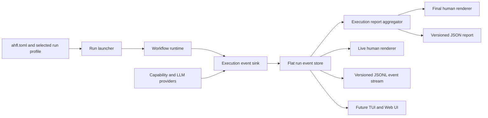
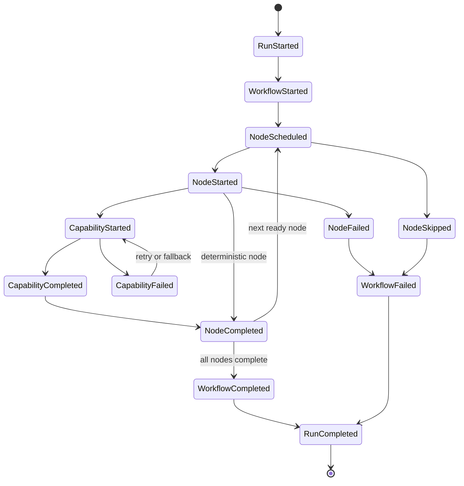

# RFC 0012: Structured Workflow Execution Events and CLI Presentation

## Summary

本 RFC 重新定义 `ahflc run` 的工程启动体验和执行展示契约。默认运行必须从工程配置中发现 workflow、输入和 LLM 配置，使常规启动收敛为 `ahflc run`；运行时必须产生结构化、带稳定标识的执行事件；CLI 默认以面向人的业务摘要展示 workflow、节点状态、LLM 使用和最终结果，完整节点值、provider 健康、预算、缓存和 secret audit 等细节仅在 verbose、trace 或机器可读输出中出现。

本 RFC 不把现有文本 dump 重新着色，而是拆分 runtime execution、event collection、report aggregation 和 presentation renderer。相同事件模型必须能够驱动终端、JSON/JSONL、未来 TUI 或 Web UI，避免每个界面重新解析运行日志。

## Motivation

当前 `ahflc run` 已经能够执行真实 AHFL workflow，也能够通过 LLM provider 调用外部模型，但默认输出仍是运行时内部结构的直接展开：

1. `execution_demo::types::IncidentResponse` 等 canonical type name 和完整结构值直接泄漏到主界面。
2. 每个节点输出与最终输出重复展示，业务结论被实现细节淹没。
3. `LLM Provider Observability` 无条件展开 cache、health、streaming、token budget 和 secret lifecycle；健康路径也会打印大量计数为零的字段。
4. 节点是否调用 LLM、执行耗时、失败位置、重试和降级不能在节点时间线上直接识别。
5. `WorkflowRuntime` 只在执行结束后返回 `WorkflowResult`，CLI 无法在节点运行期间提供可靠进度，也无法自然驱动可视化界面。
6. 默认运行仍要求通过 `--input "$(...)"` 注入 JSON；manifest、input fixture 和 LLM 配置之间没有完整的工程级启动配置。
7. 现有 smoke tests 依赖标题字符串，机器消费者没有版本化的 run report 或 event stream contract。

这些问题并非颜色、缩进或终端 spinner 能解决。根因是业务执行结果、runtime trace、provider observability 和 presentation 被压在同一个输出函数中。继续扩展当前 printer 会让 TUI、Web UI、CI 集成和运行审计各自维护不一致的日志解析器。

## Goals

1. 让配置完整的 AHFL 工程通过 `ahflc run` 直接启动，无需重复指定 manifest、workflow、input 和 LLM config。
2. 定义 runtime-owned、`std::variant` 表达、数值 ID 关联的结构化执行事件模型。
3. 定义默认 human renderer，使用户首先看到 workflow 进度、节点职责、关键结果、LLM 调用和最终业务输出。
4. 定义 normal、verbose、trace 三个信息层级，并把 provider 内部遥测移出默认输出。
5. 定义版本化 JSON report 和 JSONL event stream，禁止脚本解析 human output。
6. 支持 TTY 实时刷新和非 TTY 确定性输出，同时保持相同业务语义和退出码。
7. 为耗时、失败、重试、降级、token/cost 和 secret-free observability 建立可测试的关联关系。
8. 删除现有 ad-hoc workflow/observability printer，不保留旧输出兼容模式。
9. 在 beta gate 关闭前冻结新的 CLI action、emitted artifact、provider artifact 和 backend，优先删除或合并重复事实源。

## Non-Goals

1. 不在本 RFC 中实现完整 TUI 或 Web UI；本 RFC 只提供它们需要的事件和 report contract。
2. 不为 workflow 输入新增 AHFL 语言级 `io` 语法。workflow 输入仍是运行边界数据，本 RFC只改善工程配置和 CLI 输入来源。
3. 不使用 LLM 自动总结任意节点输出；默认摘要必须可重复、可离线生成。
4. 不改变 AHFL workflow、agent、flow 或 capability 的语言语义。
5. 不定义远程分布式 tracing protocol，也不直接采用 OpenTelemetry wire format；后续 adapter 可以从本 RFC 的事件模型导出。
6. 不隐藏失败诊断、预算超限或 provider 降级；这些信息必须提升到相关节点和最终状态，而不是被静默折叠。

## Design

### Architecture



Runtime 和 provider 只产生结构化事实，不负责终端措辞。renderer 不调用 workflow，也不从已格式化字符串恢复状态。所有输出模式消费同一个 run event store 或由其聚合出的 execution report。

### Reference Workflow

`examples/execution-demo` 是 RFC 0012 和 AHFL beta 的唯一 reference workflow。它必须同时承担：

1. PackageGraph 与 `[run]` 配置发现。
2. deterministic agent 节点与 LLM capability 节点混合执行。
3. success、retry/fallback、budget rejection、timeout、dependency skip、process interruption、checkpoint 和 resume 证据。
4. human、JSON、JSONL、replay 和 audit 五种投影的一致性验证。
5. secret handle、redaction、token/cost/latency budget 和 durable store 的端到端验证。

`default` profile 使用 `inputs/high-severity.json`，`low-risk` profile 使用 `inputs/low-risk.json`。自动测试可以使用本地 deterministic provider fixture 替代公网 LLM，但不得绕过 `WorkflowRuntime -> ExecutionEventSink -> ExecutionEventStore -> ExecutionReport` 主路径。新增第二个“参考工程”不能作为绕过该路径的理由；其他 example 只承担语法或局部能力展示。

### Product Scope Freeze

从本 RFC `accepted` 到 beta gate 关闭期间，仓库进入 runtime product scope freeze：

1. 禁止新增 `CommandKind`、`BackendKind`、`ProviderArtifactKind` 或新的公开 `emit` artifact。
2. 允许删除、重命名、合并现有 action/artifact/backend，但 breaking change 必须同步迁移测试和文档。
3. 允许为 RFC 0012 增加 `--profile`、`--input-file`、`--output-format` 和 `--verbosity`；这些是已接受合同的一部分，不视为扩面。
4. Native gRPC、K8s/OpenAPI/Terraform 深化、多 region scheduler、NuSMV library mode、DAP 深集成、独立 incremental daemon、官方 registry service、Web Playground 和生态 adapter 保持冻结。
5. 机器门禁必须以已接受的 catalog baseline 为上限：删除条目允许通过，新增条目必须先修改本 RFC、tracking issue 和 baseline，并重新进入 RFC review。

冻结门禁只约束产品面扩张，不阻止修复、重构、删除、测试强化、性能优化和安全加固。

### Project Run Configuration

`ahfl.toml` 新增可选 `[run]` 配置，用于描述工程的默认可执行场景：

```toml
[run]
target = "workflow"
input = "inputs/high-severity.json"
llm_config = "llm_config.glm.json"
output_format = "human"
verbosity = "normal"

[run.profiles.low-risk]
input = "inputs/low-risk.json"
```

字段语义：

| Field | Required | Meaning |
| --- | --- | --- |
| `target` | 否 | `[targets.<name>]` 中要运行的 workflow target；未配置且只有一个 workflow target 时自动选择 |
| `input` | 否 | 相对 manifest 目录解析的 JSON 输入文件 |
| `llm_config` | 否 | 相对 manifest 目录解析的本地 LLM 配置路径；配置文件可被版本控制忽略 |
| `output_format` | 否 | `human`、`json`、`jsonl` 或 `quiet`，默认 `human` |
| `verbosity` | 否 | `normal`、`verbose` 或 `trace`，默认 `normal` |
| `run.profiles.<name>` | 否 | 对默认 `[run]` 字段做稀疏覆盖的命名运行场景 |

启动解析顺序：

1. `--manifest` 显式路径。
2. 从当前目录向父目录查找最近的 `ahfl.toml`，到文件系统根或 workspace boundary 为止。
3. `--profile <name>` 选择命名 profile；未指定时使用 `[run]`。
4. workflow 选择顺序为 `--workflow`、profile target、`[run].target`、唯一 workflow target。
5. 输入选择顺序为 `--input`、`--input-file`、profile input、`[run].input`。
6. LLM 配置选择顺序为 `--llm-config`、profile llm_config、`[run].llm_config`、`~/.ahfl/llm_config.json`。

同一层同时提供 `--input` 和 `--input-file` 必须报参数冲突，不做隐式覆盖。没有可解析输入时，CLI 必须返回用法错误并明确列出 `--input`、`--input-file` 和 `[run].input` 三种修复方式，不进行交互式 stdin 提问。

### Event Identity and Storage

runtime 内部必须使用数值 ID 作为 canonical identity：

1. `RunId`
2. `WorkflowId`
3. `WorkflowNodeId`
4. `AgentId`
5. `CapabilityId`
6. `ProviderId`
7. `AgentStateId`
8. `InvocationId`
9. `RuntimeValueId`
10. `DiagnosticId`
11. `ExecutionEventId`

这些 ID 是独立强类型 index wrapper，引用 flat stores 中的记录。source-level name 和 canonical name 只在 report materialization 与 diagnostic/presentation 边界解析，不参与事件关联、预算累计或状态机判断。

`ExecutionEvent` 使用 `std::variant` 表达 payload，不建立事件继承层次：

| Event | Required payload |
| --- | --- |
| `RunStarted` | run ID、profile、monotonic start point |
| `WorkflowStarted` | workflow ID、input type ID |
| `NodeScheduled` | node ID、dependency node IDs、execution slot |
| `NodeStarted` | node ID、agent ID、monotonic offset |
| `AgentStateEntered` | node ID、agent ID、state ID |
| `CapabilityStarted` | invocation ID、node ID、capability ID、provider kind |
| `CapabilityCompleted` | invocation ID、usage summary、attempt count、cache outcome |
| `CapabilityFailed` | invocation ID、diagnostic ID、retryable、attempt count |
| `ProviderDegraded` | invocation ID、provider ID、fallback provider ID、reason code |
| `NodeCompleted` | node ID、status、output value ID、duration |
| `NodeFailed` | node ID、diagnostic IDs、duration |
| `NodeSkipped` | node ID、blocking dependency IDs |
| `WorkflowCompleted` | workflow ID、output value ID、duration |
| `WorkflowFailed` | workflow ID、status、diagnostic IDs、duration |
| `RunCompleted` | final status、total duration、aggregate usage |

Event store 按单次运行的 `ExecutionEventId` 顺序追加。事件中的时间使用单调时钟相对值；wall-clock timestamp 只作为可选 run metadata，不能参与排序。并行执行引入后，event ID 定义观察顺序，dependency ID 定义因果关系，不能把 vector 顺序误当成 DAG 因果关系。

### Execution State



每个 started event 必须有且只有一个 terminal event。异常展开、provider exception 和预算策略失败也必须经过 terminal event 收口，不能只打印诊断后提前返回。

### Execution Report

`ExecutionReport` 是事件流的确定性聚合结果，不是另一个独立事实来源。它至少包含：

1. run、workflow 和 profile metadata。
2. workflow status、total duration 和退出分类。
3. 按 scheduling/execution index 排列的 node reports。
4. 每个 node 的 agent、状态、duration、output value、capability invocation summary 和 diagnostics。
5. 最终 typed value，使用 canonical value JSON serializer 表达。
6. aggregate LLM calls、attempts、prompt/completion/total tokens、estimated cost、cache hits 和 degraded providers。

`WorkflowResult` 中以字符串保存的 `execution_order`、node name 和 target 必须被 ID-based report references 替代。名称仅在 renderer 通过 program metadata 解析。

### Human Presentation

`human + normal` 是 `ahflc run` 默认模式。它必须遵守以下规则：

1. 首屏显示短 workflow name、profile 和运行状态，不显示 LLM config 文件路径。
2. 每个节点只占一个主状态行，显示 source node name、短 agent name、状态和 duration。
3. 确定性节点与 capability/LLM 节点必须可区分；LLM 节点在同一节点下显示 model、attempts 和 total tokens。
4. 中间结构值使用通用 compact value renderer：隐藏 package-qualified type prefix，优先展示 scalar fields，长字符串截断；不得调用 LLM 生成摘要。
5. 最终输出只完整展示一次。若最终输出与最后节点输出相同，节点摘要不得再次完整展开。
6. cache、secret lifecycle、accepted budget 和健康 provider 的零事件不显示。
7. retry、fallback、budget warning 和 failure 必须显示在所属节点下，并在最终摘要中计数。
8. 成功结尾显示 completed nodes、LLM calls、total tokens 和 total duration。

示例：

```text
IncidentWorkflow  completed
Profile: default

Input
  ticket_id="INC-1001", service="checkout", severity=High

Steps
  completed  intake   IntakeAgent      1 ms
    severity=High, service="checkout", customer_impact=true
  completed  decide   DecisionAgent    1 ms
    action=Escalate, channel=OnCall
  completed  respond  ResponderAgent   2.4 s
    LLM glm-4.5-flash, 1 call, 566 tokens

Result
  ticket_id="INC-1001", service="checkout"
  action=Escalate, channel=OnCall
  summary="INCIDENT SUMMARY: ..."

Completed 3/3 nodes, 1 LLM call, 566 tokens, 2.4 s
```

TTY 可以原地刷新 running line 和使用 ANSI color。重定向到文件或 pipe 时必须输出 append-only、无 ANSI 的确定性文本。`NO_COLOR` 必须关闭颜色；终端能力检测只能改变样式和刷新方式，不能改变字段语义。

### Verbosity

| Level | Human output | JSON/JSONL behavior |
| --- | --- | --- |
| `normal` | 节点状态、compact output、异常、LLM usage、最终结果 | report/event 的稳定公共字段 |
| `verbose` | 完整节点 input/output、完整 diagnostic notes、capability result metadata | 增加 value detail 和 diagnostic related data |
| `trace` | provider attempts、cache、stream chunks、budget decisions、secret-free audit metadata | 输出全部允许导出的 execution/observability events |

预算拒绝、预算超限、provider 降级和运行失败不受 verbosity 抑制。verbosity 只控制成功路径细节，不控制安全或正确性告警。

### Machine-readable Output

`--output-format json` 在 stdout 输出一个 `ahfl.run-report.v1` JSON document。`--output-format jsonl` 每行输出一个 `ahfl.run-event.v1` event，最后一行必须是 `RunCompleted`。两者都必须包含 `schema` 和 `schema_version`，并使用 shared JSON DOM/serializer，禁止手工字符串拼接。

JSON report 的最小形状：

```json
{
  "schema": "ahfl.run-report",
  "schema_version": 1,
  "run": {"id": 1, "status": "completed", "duration_ms": 2400},
  "workflow": {"id": 0, "name": "execution_demo::main::IncidentWorkflow"},
  "nodes": [],
  "result": {"type": "execution_demo::types::IncidentResponse", "value": {}},
  "usage": {"llm_calls": 1, "total_tokens": 566}
}
```

机器模式下 stdout 只能包含所选 schema 的数据；进度、普通日志和 renderer warning 进入 stderr。运行失败仍必须输出合法的 report 或 terminal JSONL event，并通过非零进程退出码表达失败。

`quiet` 只输出最终 value 的 canonical JSON；没有最终 value 或执行失败时 stdout 为空，诊断进入 stderr。它不适合作为审计格式。

### Observability and Security

provider 原有 cache、health、streaming、token usage、token budget 和 secret audit 数据必须通过 invocation ID 关联到 capability/node event。默认 human output 仅展示聚合使用量和异常事件。

所有输出模式必须遵守：

1. API key、Authorization header、secret value 和原始 credential reference 永不进入 event store。
2. provider telemetry 默认不记录完整 prompt 或 response body。
3. secret event 只允许 secret-free kind、provider ID、fingerprint、accessor ID 和 success 状态。
4. user input 和 workflow output 属于业务数据，不承诺 secret-free；verbose、JSON 和 JSONL 使用者必须把产物按业务敏感数据管理。
5. renderer 只能消费经过 redaction policy 的 event/report，不能直接读取 provider config 或 secret manager。

### CLI Surface

新增公共选项：

```text
--profile <name>
--input-file <path>
--output-format <human|json|jsonl|quiet>
--verbosity <normal|verbose|trace>
```

这些选项用于覆盖工程默认值，不是常规启动的必填项。配置完整的 `examples/execution-demo` 必须能够直接运行：

```bash
../../build/dev/src/tooling/cli/ahflc run
```

选择另一个场景时只需：

```bash
../../build/dev/src/tooling/cli/ahflc run --profile low-risk
```

`--llm-observability` 被新的 JSON/JSONL trace contract 替代并删除。需要独立 trace 文件时，shell 重定向 `--output-format jsonl --verbosity trace`；后续若增加 artifact path，必须复用同一 serializer，不能恢复第二套 schema。

### Beta Gate

AHFL beta 不能以“存在源码、CLI handler 或 golden”为完成依据。以下条件必须全部由 release evidence 证明：

1. `ahflc run` 能从 `[run]` 或 named profile 直接启动，不要求重复传 workflow、input 或 LLM config。
2. runtime 的 workflow、node、agent、capability、invocation、value 和 event 关联全部使用强类型 numeric ID。
3. 单一 flat event store 能生成 human、JSON、JSONL、replay 和 audit；这些投影不得重新读取 AST、runtime 私有状态或 human log。
4. success、failure、dependency skip、retry、fallback、cancellation、budget rejection、capability timeout、process interruption、checkpoint 和 resume 都满足 started/terminal 唯一配对。
5. formatter 对 formatter fixtures 和 `std/` 幂等，CI 不再用 `continue-on-error`。
6. beta package 路径不再使用 legacy `Optional/List/Set/Map` semantic fallback。
7. `examples/execution-demo` 完成 fault injection、crash/restart/replay、idempotency 和 partial-write recovery 证据。
8. release workflow 产出可安装 CLI、sysroot 和 VSIX，并在干净环境通过 version/schema migration smoke。
9. README 只声明 release evidence 能证明的能力。
10. product scope freeze gate 保持通过，未引入未经 RFC 接受的新 backend、artifact 或 action。

beta gate 的 machine report 必须逐项输出 `passed`、`failed` 或 `missing_evidence`，并列出证据路径；聚合测试绿色不能替代单项证据。

## User Impact

工程作者可以在 `ahfl.toml` 中定义默认运行场景，普通用户从工程根目录执行 `ahflc run` 即可。默认终端输出以 workflow 和 agent 节点为中心，LLM 使用量归属到实际调用节点，最终业务结果不再被 provider 内部遥测淹没。

CI、IDE 和未来可视化工具必须改用版本化 JSON/JSONL，不再依赖 `=== AHFL Workflow Execution ===`、`Node Results` 或 `Token Budget Events` 等英文标题。失败、重试、fallback 和预算超限会获得稳定的结构化关联。

## Compatibility and Migration

这是破坏性 CLI 输出和 runtime result contract 变更。AHFL 当前仍是未成熟项目，本 RFC 不保留 forward compatibility wrapper 或旧文本输出模式。

影响范围：

1. 解析当前 `ahflc run` stdout 的 shell、Python 和 CTest smoke scripts。
2. 直接读取 `WorkflowResult.execution_order`、string node name 或 string target 的 runtime tests/consumers。
3. 使用 `--llm-observability <path>` 的调用者。
4. 依赖 `--input` shell substitution 的 example 和文档。

迁移步骤：

1. 人类调用者删除额外参数，改由 `[run]` 或 run profile 提供默认值。
2. 文件输入调用者改用 `[run].input` 或 `--input-file`。
3. 自动化调用者改用 `--output-format json` 并解析 `ahfl.run-report.v1`。
4. 流式观察者改用 `--output-format jsonl` 并按 event ID、node ID 和 invocation ID 关联。
5. provider audit 调用者改用 `--output-format jsonl --verbosity trace`。
6. runtime consumer 改用 ID-based `ExecutionReport` 和 flat event store。

实现该 RFC 的 breaking commit 必须在 footer 写明：

```text
BREAKING CHANGE: ahflc run now emits the structured human presentation by default,
removes --llm-observability, and replaces string-based WorkflowResult fields with
ID-based execution events and reports. Use --output-format json or jsonl for
automation and configure input/LLM defaults under [run] in ahfl.toml.
```

## Implementation Plan

1. Runtime identity：引入 execution IDs、flat event store、`ExecutionEvent` variant 和 event sink interface。
2. Runtime instrumentation：在 workflow scheduling、agent states、capability invocation 和 terminal paths 发出成对事件；使用可注入 monotonic clock。
3. Provider bridge：把 LLM usage、retry、fallback、cache、budget 和 secret audit 映射到 invocation-scoped events。
4. Report aggregation：从 event store 构造 `ExecutionReport`，并把 runtime value 接入 canonical JSON serializer。
5. Renderer layer：实现 human、JSON、JSONL 和 quiet renderer；删除 `print_workflow_result` 与 `print_llm_provider_observability`。
6. Project launch：实现 manifest ancestor discovery、`[run]`、profiles、`--input-file` 和配置优先级。
7. CLI integration：接入 TTY/`NO_COLOR` 检测、stdout/stderr contract 和 unchanged exit-code semantics。
8. Consumer migration：迁移 smoke tests、examples、CLI/reference docs，删除依赖旧标题字符串的断言。

每个实现 commit 只承担一个逻辑切片，并使用 Conventional Commits。删除 string-based runtime contract 的 commit 必须标记 breaking change。

## Test Plan

1. Event model unit tests：验证 ID 引用、event sequence、started/terminal 配对、dependency causality 和 flat-store bounds。
2. Runtime integration tests：覆盖 deterministic node、LLM node、失败、dependency skip、retry、fallback、budget reject 和 budget exceed。
3. Fake-clock tests：固定 duration，避免 golden output 依赖 wall clock。
4. Human golden tests：覆盖 normal、verbose、trace、TTY、non-TTY、`NO_COLOR`、长字符串和重复 final output 折叠。
5. JSON schema tests：解析 `ahfl.run-report.v1`，验证 typed value、diagnostics、usage 和失败 report。
6. JSONL tests：逐行解析 event，验证最后一行是 `RunCompleted`，sequence 单调且 invocation 关联完整。
7. Redaction tests：扫描所有模式，确保 API key、Authorization header、secret value 和完整 credential reference 不出现。
8. Configuration tests：覆盖 manifest ancestor discovery、唯一 target、default profile、named profile、CLI precedence、相对路径和冲突参数。
9. Pipe tests：验证 non-TTY 输出无 ANSI、无原地刷新控制字符，stdout 只有所选机器 schema。
10. Example smoke：`examples/execution-demo` 的 default 和 `low-risk` profile 都必须通过真实 `ahflc run` 路径。
11. RFC/doc gates：`scripts/check-rfc.py`、文档链接检查和 CLI help golden 必须通过。
12. Scope freeze tests：catalog baseline 删除允许通过，新增 CLI action、emitted artifact、provider artifact 或 backend 必须失败。
13. Beta gate tests：缺任一 evidence、错误 schema、过期 commit、失败状态或未覆盖 lifecycle kind 都必须报告 `missing_evidence` 或 `failed`。

## Rollout and Stabilization

1. `draft`：已确认 event taxonomy、run manifest fields、JSON schema 和 breaking migration。
2. `review`：已确认 ID model、renderer boundary、security policy、scope freeze 和 test ownership。
3. `accepted`：冻结 v1 report/event 字段、CLI option names、reference workflow 和 beta gate，不冻结 future optional fields。
4. `implementing`：按 event core、instrumentation、renderers、project launch、consumer migration 顺序提交。
5. `implemented`：旧 printers、旧字符串断言和 `--llm-observability` 已删除，example default run 可执行。
6. `stabilized`：同步 CLI reference、execution user guide、package configuration contract 和 release migration note，并有真实 LLM run evidence。

实现期间不提供 hidden compatibility mode。若中间分支无法一次迁移所有 consumer，应通过 stacked commits/PRs 保持每个集成点可构建，而不是让两套输出 contract 长期并存。

## Alternatives

1. 只给当前输出加颜色、表格和 spinner。拒绝：它仍然把 runtime result 与 provider telemetry 绑定在 printer 中，无法支持稳定机器消费或未来 UI。
2. 保留当前文本作为默认，新增一个 Web dashboard。拒绝：dashboard 仍需解析日志或建立第二套事件来源，CLI 的默认体验和自动化契约继续恶化。
3. 默认只输出 JSON，让所有人依赖外部 formatter。拒绝：机器契约清晰，但人类运行本地 agent workflow 的反馈质量过低，也无法提供自然的实时进度。
4. 直接采用 OpenTelemetry spans 作为唯一 runtime model。拒绝：OTel 适合导出 observability，但不能自然承载 typed workflow value、dependency skip、final result 和 CLI presentation 所需的领域状态；可以在 event model 之上增加 OTel adapter。
5. 为旧输出增加 `--legacy-output`。拒绝：项目尚未稳定，维护两套 formatter 和测试会延长错误抽象的寿命。

## Open Questions

当前没有阻塞实现的开放问题。后续扩展遵守以下已接受决定：

1. `ahfl.run-event.v1` 在 beta 前保持 `developer-facing`；至少一个 replay/audit 之外的独立 consumer 通过兼容性测试后，另行 RFC 决定是否升级 `stable-artifact`。
2. v1 compact value renderer 不引入语言级 display metadata，只使用结构化字段、稳定字段顺序和确定性截断。
3. ancestor manifest discovery 完全复用 RFC 0005 的 nearest package 与 workspace boundary；发现歧义时 fail closed，不新增第二套 discovery 规则。
4. v1 trace JSONL 只写 stdout，由调用者重定向；原生 artifact path 不进入本 RFC。

## Decision History

- 2026-07-10: Draft opened after validating the real `examples/execution-demo` LLM run output and identifying the current printer/observability coupling.
- 2026-07-11: Product direction accepted; issue #16 became the implementation tracker, `examples/execution-demo` became the sole reference workflow, and the scope-freeze and beta gates became normative acceptance conditions.
