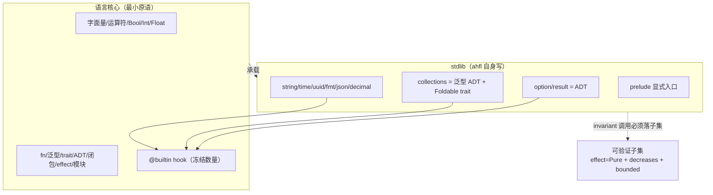

# RFC 0013: Corelib and Type System Evolution

## Summary

本 RFC 确立 AHFL 标准库（corelib / `std`）与类型系统的演进终点：**完整现代类型系统**（带 payload 的 ADT、用户泛型、`trait`/typeclass、一等闭包、统一 effect 系统）**+ 容器 stdlib 化 + 可验证子集**（`effect Pure` + `decreases` 终止度量 + bounded refinement）。定位是 Rust/Swift 的类型系统形态 + Dafny/F\* 的可验证子集机制 + Lean/Zig 的 stdlib 自举。核心原则一句话：**语言表达力与可验证性正交，用可验证子集连接二者，不用降级语言换可判定性。** 迁移分 P0–P7 七阶段推进，本 RFC 即实施与验收的唯一跟踪单元。

四份 detail 附件承载可实施细节（原开放问题已在其中全部决议）：

- [corelib-type-system.zh.md](../design/corelib-type-system.zh.md) — 完整 EBNF + trait / 泛型 / 闭包 / 单态化（决议 Q1 / Q2 / Q7）
- [corelib-effect-system.zh.md](../design/corelib-effect-system.zh.md) — effect 推导 + decreases + 可验证子集检查（决议 Q3）
- [corelib-stdlib-api.zh.md](../design/corelib-stdlib-api.zh.md) — stdlib 完整接口 + `@builtin` 清单（决议 Q4 / Q5）
- [corelib-container-migration.zh.md](../design/corelib-container-migration.zh.md) — P5 容器库化迁移策略（决议 Q6）

## Motivation

 RFC 立项时（2026-06）AHFL 的现状问题：

- **零 corelib**：96 个 `.ahfl` 全是测试 / 示例，无任何用 AHFL 自身写的库代码。
- **容器 / 原语焊死成关键字 + evaluator switch**：`Optional/List/Set/Map` 是文法写死的内置构造子；算术 / `list.length` / `list[i]` 在 `evaluator.cpp` 硬编码。
- **死类型**：`Set/Map/UUID/Timestamp` 语法合法、runtime 返回 `'not supported in v0.51'`，`value.hpp` 无对应 `Value` 变体。
- **`enum` 无 payload** → 无法表达 `Option/Result` 这类 ADT → 只能焊成关键字。
- **无 `fn` / 用户泛型 / `trait` / 闭包 / 一等函数**。
- `core-language.zh.md` 曾把"通用高阶函数与用户自定义泛型"列为 out-of-scope（该条目已撤销，见 [core-language.zh.md](../spec/core-language.zh.md)）。

不做决策的后果：容器与原语继续以关键字形式膨胀，每加一个容器方法就要动文法 + evaluator + typecheck 三处；`fold/map/filter` 必须按类型重复实现或放弃抽象；可验证性叙事无法闭环。

## Goals

1. **最小语言核心**：一个能力若离开特定文法形态就无法表达，则属于语言核心；否则属于 stdlib。核心只保留字面量 / 运算符 / `Bool/Int/Float` 数值类型 / `fn` / 泛型 / `trait` / ADT / 一等函数 / 闭包 / 模块 / effect 系统，以及数量冻结的 `@builtin` hook。
2. **类型系统四大支柱**：带 payload 的 ADT（`enum` variant）、用户泛型 + `trait`/typeclass、一等函数 + 真闭包、统一 effect 系统。
3. **stdlib 用 AHFL 自身写**：`option/result/collections/string/time/uuid/fmt/json/decimal/prelude` 模块全部入库，`String` 类型与方法也是 stdlib（对标 Rust `&str`/`String`、Swift `String`）。
4. **可验证子集**：进入 `contract/requires/ensures/invariant/safety/liveness/flow guard` 的调用必须满足 `effect = Pure` + 有 `decreases` 终止度量 + 输入 bounded refinement，typecheck 阶段静态检查。
5. **泛型走单态化**：零运行时开销，与 typed HIR / SMV bounded 编码天然兼容。
6. **七阶段迁移**：P0–P7 每阶段有独立验收标准，阶段间依赖明确，P4/P5/P7 可部分并行。

## Non-Goals

1. **union type**：AHFL 没有 union type，也不引入（ narrowing 语义见 RFC 0002）。
2. **effect 多态**（`effect <R>` + effect-variable unification）：首版仅固定 effect 字面量，多态是 P4 后续独立子项目。
3. **跨链泛型推断**（`xs.map(f).filter(p)` 免显式 type args）：属体验级改进，不阻塞功能；P2 交付显式 type args 全链路。
4. **闭包捕获列表**（`[&ctx, a]`）：首版闭包默认 Pure、无 `self` 捕获，stdlib 完全够用。
5. **const 泛型参数**（`Array<T, const N: Int>`）：与 bounded refinement 共享基础设施，合并到 P4 后续。
6. **装箱 / 动态派发泛型**：明确不采用（破坏 typed-IR 可验证等价性，与 SMV bounded 冲突）。
7. **wall-clock 进 SMV invariant**：时序约束用 SMV step/phase 计数 + temporal 算子建模；`now` 进 invariant 直接报错。
8. **GC / FFI / allocator / macros 2.0**：语言演进范围外。
9. **完整 CFA / 过程间分析**：narrowing 仅限局部（见 RFC 0002 的保守失败原则）。

## Design

### 设计哲学（核心原则）

> **语言表达力与可验证性正交。用"可验证子集"连接二者，而不是用降级语言换可判定性。**

这是可形式化验证语言领域的共识：

| 语言 | 类型系统完整度 | 可验证性如何保证 |
| --- | --- | --- |
| **Dafny** | 完整：类 / trait / 泛型 / 共归纳数据类型 / 高阶函数 | `requires/ensures/decreases` + SMT；编译器证终止、查 contract |
| **F\*** | 完整：依赖类型 / effect / ADT / 高阶 | effect 系统（`TOT` 全函数 / `GT` / `ST` 状态 / `IO`）；纯函数必须 `TOT` |
| **SPARK Ada** | 完整 Ada 子集 | `Global/Depends/Contract` + proof；不降级语言 |
| **Lean** | 完整：归纳类型 / typeclass / 单子 | `Init/Std/Mathlib` 分层；基本类型也是 stdlib 归纳类型 |

**共性**：语言本身完整，验证靠 effect / 终止度量 / refinement 子集。**没有任何一个靠砍掉 trait / 闭包 / ADT 来保证可判定性。**

### 语言核心（最小原语集）

| 原语 | 为何必须内置 |
| --- | --- |
| 字面量 `123 / 3.14 / true / "s" / 30s / none` | 离开词法 / 文法无法表达 |
| 运算符 `+ - * / % == != < > and or not is` | 同上 |
| `Bool / Int / Float` 数值类型 | 数值 / 布尔语义无法在库中无损复刻（所有语言如此） |
| `fn` / 泛型 / `trait` / ADT / 一等函数 / 闭包 / 模块 / effect 系统 | 抽象机制，"库化不了承载库的东西" |

**显式不在此列**（属于 stdlib）：`String` 类型、`Optional/Result/List/Set/Map`、`UUID/Timestamp/Duration`、所有容器算法 / 字符串方法 / 序列化 / 格式化。`String` 字面量 `"..."` 内置，但 `String` 类型与方法是 stdlib。

### 类型系统四大支柱

#### ADT（代数数据类型，`enum` 带 payload）

```ebnf
EnumDecl ::= DocComment? "enum" Ident TypeParams? "{" { Variant } "}" ;
Variant  ::= Ident [ "(" Type { "," Type } ")" ] ;     (* payload 可选 *)
TypeParams ::= "<" TypeParam { "," TypeParam } ">" ;
```

```ahfl
enum Option<T>    { Some(T), None }
enum Result<T, E> { Ok(T), Err(E) }
enum List<T>      { Nil, Cons(T, Box<List<T>>) }     // 也可由 stdlib 用底层 array 实现
```

带 payload 的 `enum` 是表达 `Option/Result` 及任意用户 ADT 的前提。配套：`match` 模式匹配 + exhaustiveness 检查（见 RFC 0001 / RFC 0003 / RFC 0011）。

#### 用户泛型 + `trait`/typeclass

```ebnf
TraitDecl ::= "trait" Ident TypeParams? "{" { FnSignature } "}" ;
ImplBlock ::= "impl" [ TraitRef "for" ] TypeRef "{" { FnDef } "}" ;   (* 含 inherent impl *)
FnSignature ::= "fn" Ident TypeParams? "(" [ParamList] ")" (":" Type)? EffectClause? ";" ;
```

```ahfl
trait Foldable<T> {
    fn length(self) effect Pure -> Int;
    fn fold<A>(self, init: A, f: Fn(A, T) -> A) effect Pure decreases length(self) -> A;
}

impl<T> Foldable<T> for List<T>      { /* fold 写一遍 */ }
impl<T> Foldable<T> for Set<T>       { /* 复用 trait 契约 */ }
impl<K, V> Foldable<(K, V)> for Map<K, V> { /* ... */ }
```

`trait` 让 `fold/map/filter` 写一遍服务所有容器。`Eq/Ord/Hash/Foldable/Functor/Iterable` 构成 corelib 的接口骨架。

**coherence（Q1 决议）**：严格版 orphan rule——`impl Trait for Type` 必须位于定义 Type 或定义 Trait 的模块，其余报 `E::orphan_impl`。AHFL 是单根模块树（`std` 唯一权威来源），冲突候选 ≤ 2，编译期确定。

#### 一等函数 + 真闭包

```ebnf
FnType ::= "Fn" "(" [ TypeList ] ")" "->" Type ;
Lambda ::= "\\" ParamList "->" Expr  |  "{" ParamList "->" Block "}" ;
```

```ahfl
fn sum_squares(xs: List<Int> where length <= 16) effect Pure decreases length(xs) -> Int {
    fold(xs, 0, \a, x -> a + x * x)     // 闭包作为值传递，在 fold 体内被调用
}
```

闭包是**真一等值**（可传递、返回、存储）。`Fn(A,T)->A` 是一等类型。

**闭包捕获 refinement（Q2 决议）**：闭包捕获 bounded `List<T>` 时，长度上界在**定义点固化**为 `N_def`（该点最紧上界），调用实参须 `<= N_def`（SMV bounded 强制）。

#### 统一 effect 系统

```ebnf
EffectClause ::= "effect" EffectSpec [ "decreases" Expr ] ;
EffectSpec   ::= "Pure" | "Nondet" | EffectName { "+" EffectName } ;
```

- `effect Pure`：纯、确定、终止、无副作用。
- `effect Nondet`：非确定（`now` / 随机源）。
- `effect <Capability>+`：使用某 capability（effectful）。
- `decreases <度量>`：终止度量（Dafny 式），编译器证明每次递归度量严格下降 ⇒ 终止。

**effect 统一（Q3 决议）**：现有 `ExprEffect` 六级（Pure/ConstOnly/PredicateCall/CapabilityCall/ExternalEffect/Unknown）保留为表达式层推导中间结果，经 `project` 投影到最终判断层 `EffectJudgement`（Pure / Nondet / CapabilitySet）；`CapabilityEffectKind` 留在 capability 声明作 effect profile。

### stdlib（用 AHFL 自身写）

| 模块 | 内容 | 语言机制 |
| --- | --- | --- |
| `std::option` / `std::result` | `Option<T>` / `Result<T,E>` | ADT |
| `std::collections` | `List/Set/Map` + `Foldable/Functor/Iterable` trait + `fold/map/filter/contains` | 泛型 ADT + trait |
| `std::string` | `String` 类型 + `contains/starts_with/upper/format/parse` | inherent impl + `@builtin` |
| `std::time` / `std::uuid` | `Timestamp/Duration/UUID` 构造与算术 | 包装 `@builtin now/uuid_new` |
| `std::fmt` / `std::json` / `std::decimal` | 格式化 / 序列化 / 精度 | fn + trait（`Display`/`FromJson`） |
| `std::prelude` | 显式预置模块（`Option/Result/length/fold/...`） | 重导出 |

**`@builtin` hook**：stdlib 访问真正原语（raw list 下标、wall-clock、raw bytes、raw string）的**极少数编译器入口**，数量冻结，新增必须经 RFC。对标 Rust lang items、Swift `Builtin` module、Zig `callconv`。



依赖约束：stdlib 模块间无环；`@builtin` 单向出边（只有 std 可调，用户代码不可直接调）。

**错误模型（Q4 决议）**：分层共存——capability 失败（provider 崩溃 / 超时 / 网络）走 fail-closed effect，不经 `Result::Err`；`Result<T,E>` 仅承载值层业务可恢复失败；`?`/`try` 仅 fn 体内合法，禁止进 predicate / contract / flow handler / workflow return。

**prelude stability（Q5 决议）**：prelude 是 lang stability boundary，v1 清单冻结（Option / Result / 容器 / 高阶函数 / 核心 trait / format）；public PackageGraph 入口显式导入；semver：新增 minor、删除/重命名 major + deprecated alias。

### 可验证子集（effect 维度，非降级）

进入 `contract/requires/ensures/invariant/safety/liveness/flow guard` 的调用**必须满足**：

1. `effect = Pure`
2. 有 `decreases` 度量，且编译器证明终止
3. 输入 bounded refinement（`List<T> where length <= N`，编译器能推出有限界）

编译器在 typecheck 阶段**静态检查**，违反报 `E::not_in_verified_subset`（细分 `E::effect_not_pure` / `E::no_decreases` / `E::unbounded`）。

```ahfl
// ✅ 可验证：Pure + decreases + bounded
fn sum_le(xs: List<Int> where length <= 16)
    effect Pure decreases length(xs) -> Int {
    fold(xs, 0, \a, x -> a + x)
}

// ✅ 合法但不可验证：递归无度量 / IO / Nondet —— 服务 runtime，不进 invariant
fn render(ui: Widget) effect IO -> String { ... }
fn backoff(n: Int) effect Nondet -> Int { ... }
```

**库里非 Pure / 无度量的代码合法存在**，只是不能进 invariant——它们服务 runtime / capability / IO 路径。

### 泛型实现：单态化

| 路线 | 适配 AHFL | 选择 |
| --- | --- | --- |
| 单态化（Rust / C++ / Zig） | ✅ 每实例独立 typed 节点，与 typed HIR / SMV bounded 编码天然兼容；零运行时开销 | **采用** |
| 装箱 / 动态派发（Java / OCaml 旧式） | ❌ 引入间接、破坏 typed-IR 可验证等价性；与 SMV bounded 冲突 | 不采用 |

实例化爆炸用编译期预算 + 缓存缓解。**泛型 × refinement（Q7 决议）**：`List<T> where length <= N` 的 T（trait bound）与 length（refinement）正交、N 必须字面量/const（不可 `length = f(T)`），P2 一并支持。

### SMV 编码约束（AHFL 特有）

AHFL 用 SMV 模型检测（CTL/LTL），**必须有限状态**——比 Dafny（SMT，可处理部分无限/归纳）更硬：

- 可验证子集的 **bounded 约束比 Dafny 更严**：进入验证的数据必须能编码为有限 SMV 状态。
- **这只收紧子集定义，不构成砍语言特性的理由**——子集外代码（递归算法、高阶库、IO）照常存在于 runtime 路径。

容器在 SMV 中的编码（依赖 refinement 提供 finite bound）：

| stdlib 类型 | SMV 编码 | 前置 refinement |
| --- | --- | --- |
| `List<T> where length <= N` | fixed-size array（N 槽 + valid bit） | `length <= N` |
| `Set<T>` | bit-vector over finite domain | `T` 有限域 |
| `Map<K,V>` | array over finite `K` | `K` 有限域 |
| `Option<T>` | `T` + valid bit | `T` 可编码 |
| `String` | bounded char array | `length <= N` |

**`now` / wall-clock**：真非确定环境输入，SMV 无法直接建模。时序约束用 **SMV step/phase 计数 + temporal 算子**建模，而非 wall-clock；`now` 进 invariant 直接报 `E::nondet_in_invariant`。

**单态化预算**：进可验证子集的函数特化数设上限（默认 ≤ 32，stdlib 自身特化单独预算不计入用户额度），超出报 `E::monomorphization_budget_exceeded`。

**容器库化对 SMV 的影响（Q6 决议）**：风险为中——经逐行核查 SMV backend **不消费**容器类型（只建模 agent 状态机 / workflow phase / temporal / contract），容器库化不改 SMV 输出；主要风险是 typecheck 行为等价性，由 P5 等价性测试覆盖。

## User Impact

- **语法新增**：`enum` variant payload（unit / tuple / struct 三种）、`match` + 模式匹配、`fn` 声明（参数 / 返回 / `effect` / `decreases`）、用户泛型 `<T>` 与显式 type args、`trait` / `impl`（含 inherent impl）、lambda `\x -> ...`、`where` 子句、`?` / `try` 运算符、`if let` / `let else`。
- **stdlib 入库**：`import std::collections;` 等 13 个模块可用；prelude 需显式 `import std::prelude;`（public PackageGraph 入口不隐式注入）。
- **容器身份变化**：`Optional/Result/List/Set/Map` 从关键字变为 stdlib nominal 类型；`some/none`、`[...]`、`set[...]`、`map[...]` 保留为语法糖，语义在库。
- **新增诊断**：`E::not_in_verified_subset`（含 `E::effect_not_pure` / `E::no_decreases` / `E::unbounded`）、`E::orphan_impl`、`E::nondet_in_invariant`、`E::monomorphization_budget_exceeded`、`COHERENCE_CONFLICT`、`MISSING_SUPER_TRAIT`、`TRAIT_METHOD_NOT_IN_TRAIT`。
- **LSP**：trait/impl navigation、pattern completion、typed-pattern hover 等随 RFC 0007 / RFC 0011 交付。
- **runtime**：`Set/Map/UUID/Timestamp/Duration/Decimal` 值类型生产可用，消除 `'not supported'` 占位错误。

## Compatibility and Migration

本 RFC 不承诺向前兼容（项目约定），但迁移路径要求行为等价：

- **无 payload `enum` 平滑升级**：payload 可空，旧声明不受影响。
- **容器关键字 → stdlib 类型**：语法糖保留，typecheck / IR / SMV 改为消费 stdlib 类型；结构性 op（`length`/下标/字面量构造）下沉为 `@builtin`，算法（`fold/map/filter`）在库。**SMV golden 必须等价**（容器不参与 SMV 编码，已逐行核查）。
- **`core-language.zh.md` 修订**：删除"通用高阶函数与用户自定义泛型"out-of-scope 条目，写入"表达力 ⟂ 可验证性正交"为语言演进原则（已完成）。

七阶段迁移（阶段间有依赖；P4/P5/P7 可部分并行）：

```mermaid
gantt
    title Corelib 与类型系统演进（相对时间）
    dateFormat X
    axisFormat %s
    section 边界
    P0 哲学+边界冻结           :p0, 0, 2W
    section 类型系统
    P1 ADT (enum payload)      :p1, after p0, 6W
    P2 fn+泛型+闭包 (XL)       :p2, after p1, 10W
    P3 trait/typeclass         :p3, after p2, 6W
    P4 effect系统+可验证子集   :p4, after p2, 6W
    section 库化
    P5 容器 stdlib 化          :p5, after p3 p4, 8W
    P6 stdlib 实现+prelude     :p6, after p5, 6W
    section runtime
    P7 runtime 补全(可并行)    :p7, after p0, 4W
```



| 阶段 | 内容 | 验收标准 |
| --- | --- | --- |
| P0 | 哲学与边界冻结 | RFC 评审通过；spec §1 修订合并 |
| P1 | ADT（`enum` 带 payload） | `enum Option<T> { Some(T), None }` 可声明、`match` 穷尽 |
| P2 | `fn` + 用户泛型 + 一等闭包 | `fn id<T>(x: T) -> T { x }` 编译 + 单态化；闭包作高阶参数可用 |
| P3 | `trait`/typeclass | `impl<T> Foldable<T> for List<T>` 可写、可 resolution、可调用；6 核心 trait 定义 |
| P4 | effect 系统 + 可验证子集 | `Pure`+`decreases`+bounded 函数可进 invariant 且 SMV 编码成功；非 Pure 进 invariant 报错 |
| P5 | 容器 stdlib 化 | 5 容器为 stdlib 类型，关键字仅语法糖；SMV golden 等价 |
| P6 | stdlib 实现 + prelude | 13 模块可 import；prelude 显式入口 |
| P7 | runtime 补全 | `Set/Map/UUID/Timestamp` 可构造与运算；evaluator 不再 `not supported` |

## Implementation Plan

RFC 即跟踪单元。当前进度（验收以 ctest 终态与 stdlib_units 实际断言数为准）：

| 阶段 | 状态 | 完成率 | 剩余工作 |
| --- | --- | --- | --- |
| P0 哲学 + 边界冻结 | ✅ 完成 | 100% | — |
| P1 ADT（enum 带 payload） | ✅ 完成 | 100% | 索引式模式匹配留作 follow-up |
| P2 fn + 用户泛型 + 一等闭包 | 🟡 进行中 | 85% | 跨链泛型推断（argument-type → callee-type-param 反推 sub-engine）；method-level `<A>/<U>` tparam 传播；闭包捕获列表；const 泛型参数 |
| P3 trait / typeclass | 🟡 进行中 | 92% | impl-body parser 3 语法 gap（wildcard `let _`、`{}` unit 消歧、closure tparam 作用域）；Option/Result/List/Set/Map × container-family traits 批量 impl；JsonValue/Decimal/UUID/Timestamp trait impl；IR 一等 TraitDecl/ImplDecl 节点；MethodCallExpr variant；where-clause 端到端传播 |
| P4 effect 系统 + 可验证子集 | 🟡 进行中 | 75% | bounded refinement `List<T> where length <= N` grammar + SMV fixed-size array 接线；`decreases` 单调性证明与 SMV/BMC 消费；effect 多态 |
| P5 容器 stdlib 化 | 🟡 进行中 | 92% | 5/5 nominal wrapper 终态（Option/Result/List 为 nominal enum，Set/Map 为 nominal struct）；剩余 8% 是 P3 trait impl 层（Foldable/Iterable/Functor × 容器） |
| P6 stdlib 实现 + prelude | 🟡 进行中 | 88% | 13 模块 + prelude 已落地；剩余 prelude semver 策略与 `#![no_prelude]` 语法 |
| P7 runtime 补全 | ✅ 完成 | 100% | — |

执行顺序原则：同组内可并行，组间有阻塞关系。当前关键路径是 P3 的 impl-body parser gap（阻塞 container-family trait 批量 impl），其后是 P2/P3 共享的跨链推断与 where-clause 传播，最后是 P4 的 bounded refinement SMV 接线（与 const 泛型合并 ROI 最高）。

> **P3c 阻塞（2026-08-21 并入，原 `docs/plans/trait-self-blocker.en.md`）**：container-family trait 批量 impl（`impl Eq for Option<T>` 等）被 `Self` 关键字缺失阻塞。根因：`typecheck.cpp` 的 `signatures_match()` 对 trait 方法参数类型做指针相等比较，而 `std/traits.ahfl` 的 trait 声明用具体占位类型（`Bool`、`Int`、`collections::List<Int>`）作为 receiver，导致 `impl Eq for Option<T>` 报 `TRAIT_METHOD_SIGNATURE_MISMATCH`（trait expects `(Bool, Bool)`，impl provides `(Option<T>, Option<T>)`）。需要：(1) trait 方法签名支持 `Self` 接收者；(2) `signatures_match` 做 Self 替换而非指针相等；(3) 或支持 trait-level 类型参数在 impl 解析时替换。在 Self 落地前，inherent impl 路径（`impl<T> Option<T>` 上的方法）可用，覆盖大部分 stdlib API 需求；B-5~B-9 trait impl 批次（Option/Result × 7、List/Set/Map × container-family、JsonValue × 6、primitives × 4）整体挂起。

## Test Plan

- **单元 / 集成**：`tests/unit/compiler/semantics/`（trait_impl、diagnostic_matrix、COHERENCE_CONFLICT 专项）、`tests/unit/runtime/evaluator/set_map_uuid_timestamp.cpp`（87 assertions）。
- **stdlib 断言**：`tests/integration/stdlib_units/` 13 模块 / 523 assertions（set_ut 84、map_ut 84、prelude_ut 40，及 option/result/string/list/cmp/time/uuid/json/decimal）。
- **golden 等价**：P5 容器库化前后 SMV golden 输出等价（容器类型不参与 SMV 编码）；formatter golden 无回归。
- **验收基线（2026-06-30）**：ctest 1003/1003 全绿；-Werror 三主机（macOS arm64 / Linux x86_64 / Linux aarch64）0 告警；LSP handler 478/478。
- **最终验收（七阶段 100%）**：§Implementation Plan 全部 ✅；ctest 随 P3/P4 剩余工作增长（预估 ≥ 1515）；spec / reference / release evidence 同步完成，本 RFC 推进到 `implemented` → `stabilized`。

## Rollout and Stabilization

- 当前状态 `implementing`：每个阶段拆成独立 Conventional Commit 落地，落地后更新本文件 Implementation Plan 与 `updated` 日期。
- `implemented` 出口：P0–P7 全部 100%，代码、测试、文档均已落库。
- `stabilized` 出口：决策反映到 [core-language.zh.md](../spec/core-language.zh.md)、CLI/reference 文档与 release evidence archive（`ctest -L release-evidence-archive`），不以"代码大体能跑"替代稳定化。
- 后续演进（effect 多态、跨链推断、const 泛型、更深 destructuring）若超出本 RFC 范围，必须新开 RFC，不得回填破坏本 RFC 已稳定的契约。

## Alternatives

1. **单态化 vs 装箱 / 动态派发**：装箱引入间接、破坏 typed-IR 可验证等价性、与 SMV bounded 编码冲突；单态化零运行时开销且与 typed HIR 天然兼容，实例化爆炸用预算 + 缓存缓解。**采用单态化。**
2. **可验证子集 vs 降级语言**：Dafny / F\* / SPARK Ada / Lean 的共识是语言完整、验证靠 effect / 终止度量 / refinement 子集，没有任何主流可验证语言靠砍掉 trait / 闭包 / ADT 保证可判定性。**采用子集路线。**
3. **容器保留关键字 vs stdlib 化**：关键字路线每加一个容器方法就要动文法 + evaluator + typecheck 三处，且无法表达用户 ADT；stdlib 化后 `fold/map/filter` 写一遍服务所有容器。**采用 stdlib 化 + 语法糖保留。**

业内对标总表：

| 语言 | 类型系统 | stdlib 自举 | 可验证性 | AHFL 借鉴 |
| --- | --- | --- | --- | --- |
| **Rust** | fn/泛型/trait/ADT/闭包 | ✅ 几乎全 stdlib | 不验证（靠 unsafe 边界） | 类型系统形态 + 单态化 + stdlib 自举 |
| **Swift** | 同上 | ✅ `String/Array/Dictionary/Set` 全 stdlib | 不验证 | 容器 stdlib 化（`String` 也是库类型） |
| **Dafny** | 完整：类/trait/泛型/共归纳/高阶 | — | `requires/ensures/decreases` + SMT | 可验证子集 = effect + decreases + refinement |
| **F\*** | 完整 + 依赖类型 + effect | — | effect 系统 `TOT/GT/ST` + refinement | effect 维度划分验证性 |
| **SPARK Ada** | 完整 Ada 子集 | — | `Global/Depends/Contract` + proof | 子集不降级语言 |
| **Lean** | 归纳类型/typeclass/单子 | ✅ `Init/Std/Mathlib` 分层 | 归纳类型在 stdlib，编译器识少量归约 | ADT + typeclass + stdlib 分层 |
| **Move** | 整数/bool/vector/address 内置 | ✅ stdlib 用 Move 自写 | 资源/abilities | vector 原语 + stdlib 自举（部分对标） |

## Open Questions

原 7 个开放问题已全部决议（Q1 orphan rule / Q2 闭包捕获 refinement / Q3 effect 统一 / Q4 错误模型分层 / Q5 prelude stability / Q6 SMV 影响 / Q7 泛型 × refinement，见 Design 各节与四份附件）。

剩余开放项（均有归属阶段，不阻塞当前实施）：

1. impl-body parser 3 语法 gap 的具体消歧规则（wildcard `let _`、`{}` 在 unit-literal 与 block/empty-struct 间消歧、closure param name 与 impl-level tparam 作用域）——P3 blocker，方案待实现时定稿。
2. 跨链泛型推断 sub-engine 的算法形态（`check_call_expr` 入口反推）——P2/P3 共享。
3. 闭包捕获列表与 `DecreasesClause` / `ExprEffect` 的交互语义——P2 后续。
4. const 泛型参数的 grammar 与 TypeEnvironment literal-int family 设计——P2/P4 合并实现。
5. bounded refinement 的 SMV fixed-size array 编码细节与预算策略——P4。
6. effect 多态（`effect <R>`）的作用域与 unification 设计——P4 后续独立子项目。

## Decision History

- 2026-06-21: Draft opened（原 `docs/design/corelib-rfc.zh.md`）。
- 2026-06-30: 四份 detail 附件定稿，原 7 个开放问题全部决议；P0/P1/P7 完成，P5 容器 nominal wrapper 与 P6 prelude 落地。
- 2026-07-06: 迁移前最后一次更新（P3 trait 链路层 12 项 Bug 全闭环）。
- 2026-08-20: 迁入 RFC registry 为 RFC 0013，状态 `implementing`；原文件删除，inbound 链接改指本文件。
