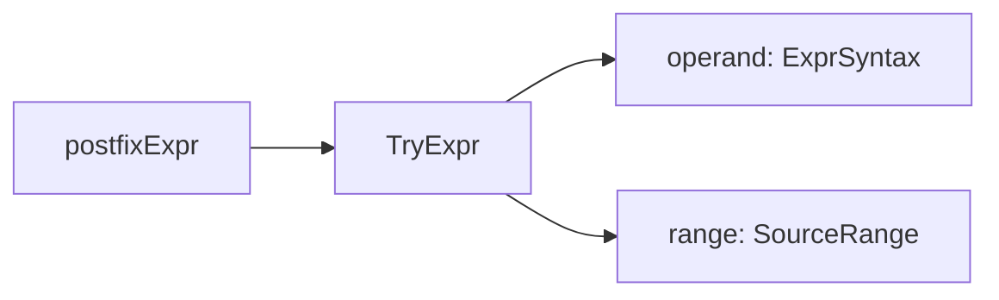
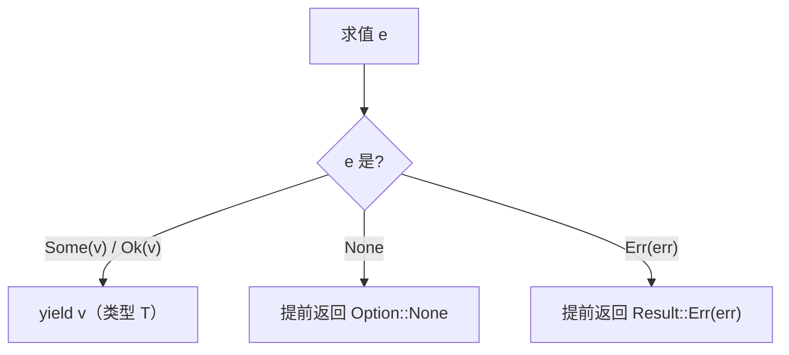

# RFC 0014: Try Operator (`expr?`)

## Summary

为 `Option<T>` 与 `Result<T, E>` 引入后缀 `?` 失败传播运算符：`e?` 在成功路径解包出 `T`，在失败路径（`None` / `Err(e)`）令外层函数体提前返回对应的失败值。`?` 只允许出现在 `fn` 函数体中。

## Motivation

错误传播是 Agent 工作流里最常见的控制流之一：解析输入、调用 capability、查表，每一步都可能失败。没有 `?` 时，每一步都要手写 `match` 分支并在失败路径构造返回值，三层嵌套的 Option/Result 链会让业务逻辑淹没在样板代码里。Rust 的 `?` 是经过大规模验证的先例（AHFL 参考层级第一位），D3 决策（workplan decision register）已采纳 Rust 风格后缀形式。当前 grammar 已接受 `e?`，但 frontend 报 "unsupported postfix expression suffix"——语言承诺了一半，需要本 RFC 把语义、类型规则和禁止上下文定死并落地。

## Goals

1. `e?` 在返回 `Option<R>` 的 fn 中对 `e: Option<T>` 类型检查通过：成功路径 yield `T`，`None` 路径提前返回 `None`。
2. `e?` 在返回 `Result<R, F>` 的 fn 中对 `e: Result<T, E>`（要求 `E: F`）类型检查通过：`Err` 路径提前返回 `Err(e)`。
3. 禁止上下文（predicate / contract / flow handler / workflow）在 sema 层给出带 SourceRange 的诊断。
4. grammar → AST → frontend → sema → typed HIR → IR 全链路落地，每阶段可独立验证。
5. 正反向集成测试覆盖 Option / Result / 非法 operand 类型 / 禁止上下文。

## Non-Goals

1. 不引入 try/catch 块或异常机制。
2. 不引入 Rust 稳定化的自定义 `Try` trait——`?` 硬编码只对 `Option` / `Result` 生效。
3. 不改变 effect 系统：`?` 本身不引入新 effect，所在 fn 的 effect 由其函数体决定。
4. 不在 predicate / contract / flow handler / workflow 上下文支持 `?`。
5. 不做 `?` 与 `decreases` / 可验证子集的交互扩展：verifiable subset 内的 `?` 遵循纯表达式求值，失败路径即提前返回，不引入新的验证义务。

## Design

### 语法

grammar 脚手架已落地：`postfixExpr` 新增 `'?'` 后缀 arm，`?` 是单 token 后缀，与 `[index]` 同级。parser 已通过 `scripts/regenerate-parser.sh` 重新生成。

### AST

- `ExprSyntaxKind` 新增 `Try`（位于 `UnwrapExpr` 之后）。
- `struct TryExpr { Owned<ExprSyntax> operand; SourceRange range; }`，镜像 `IndexAccessExpr` 的形态。
- `ExprSyntax` variant 与 visitor 各 lambda 站点同步新增。

### 类型规则

1. `operand` 类型必须是 `Option<T>` 或 `Result<T, E>`，否则报类型错误（带 SourceRange）。
2. 外层 fn 返回类型必须是兼容的 `Option<_>` 或 `Result<_, F>`；Result 情形要求错误类型兼容（`E == F`，或 `E: F` 的 trait 约束成立）。
3. `e?` 的表达式类型是 `T`。
4. 所在 fn 必须有可判定的返回签名；闭包体内的 `?` 跟随闭包签名，闭包无显式返回类型时按 Open Questions 的决议处理。

### 语义

`e?` 是表达式位置的提前返回。在 fn 体内：

实现路径二选一（见 Open Questions）：在 typechecker/lowering 阶段 desugar 为 `match e { Some(x) => x, None => <return None> }` 形态，或引入专用的 TryExpr typed-HIR 节点，复用现有 return + match lowering。

### 禁止上下文

`?` 只允许出现在 `fn` 函数体。以下上下文在 sema 层拒绝：

1. `predicate` 体：谓词必须是可判定的纯表达式，提前返回破坏谓词语义。
2. `contract` 的 ensures / requires 表达式。
3. `flow` handler 体：状态迁移逻辑由状态机语义管辖。
4. `workflow` 的 return 表达式与节点表达式。

## User Impact

- 新语法：`?` 此前是 parse error（grammar 落地后是 unsupported-postfix 诊断），实现后成为合法后缀表达式。
- stdlib cookbook 已有 `?` 的用法章节（Option / Result 示例），实现后示例从"文档先行"变为可运行。
- 诊断新增：operand 非 Option/Result、外层 fn 返回类型不兼容、禁止上下文中使用 `?`。
- prelude 无需改动：`?` 是语法级构造，不依赖新的 stdlib API。

## Compatibility and Migration

非 breaking：`?` 此前不构成合法程序，没有既有程序改变语义。grammar 已接受 `?` 的窗口内，frontend 对其报 unsupported 诊断而非静默接受，因此不存在"旧编译器接受、新编译器改义"的程序。

## Implementation Plan

grammar 脚手架已落地（`AHFL.g4` 的 `postfixExpr` `'?'` arm + 重新生成的 parser）。Open Questions 已全部决议（2026-08-22）。剩余切片：

1. **AST**：`ExprSyntaxKind::Try`、`TryExpr` 结构体、variant 与 visitor 站点。
2. **Frontend**：`build_postfix_expr` 后缀循环中识别 `?`（单 terminal，`child_index += 1`），构造 `TryExpr`。
3. **AST printer + desugar**：新增 `TryExpr` case。
4. **Sema**：类型规则（§类型规则）与禁止上下文检查（§禁止上下文）。闭包无显式返回类型时 `?` 报 SourceRange 诊断。
5. **typed HIR + IR lowering**：dedicated `TryExpr` typed-HIR 节点；HIR->IR statement-level lowering——`let x = e?;` 展开为 temp 绑定 + 失败检查（if + return）+ unwrap。**Slice 1 限制 `?` 仅出现在 let-binding 位置**；任意表达式位置（`f(e?)`）需要 statement-buffer lowering，是独立 follow-up。
6. **测试**：见 Test Plan。

每阶段独立可验证，按阶段单独提交 Conventional Commit，并在本 RFC 的 `implementation_prs` 中登记。

## Test Plan

1. **集成**：`tests/integration/` 新增 `try_option.ahfl`（`fn f(o: Option<Int>) -> Option<Int> { let x = o?; Some(x + 1) }`）、`try_result.ahfl`（错误传播与错误类型兼容情形）。
2. **反向诊断**：`?` 作用于非 Option/Result 类型、外层 fn 返回类型不兼容、在 predicate/contract/flow/workflow 上下文使用——各一条 golden 诊断。
3. **单元**：AST printer / desugar 的 `TryExpr` case。
4. **回归**：`ctest --preset test-dev` 全量；formatter golden 无回归（`?` 的格式化行为）。
5. **stdlib**：cookbook 中 `?` 章节示例转为可运行测试或接入 `stdlib_units`。

## Rollout and Stabilization

1. `draft` → `review`：Open Questions 清零（实现路径二选一、闭包情形决议）、owner sign-off。
2. `accepted` 后按 Implementation Plan 切片实现，每切片登记 `implementation_prs`。
3. `implemented`：代码、测试、cookbook 示例全部落库。
4. `stabilized`：[core-language.zh.md](../spec/core-language.zh.md) 补充 `?` 的语法与类型规则章节；cookbook 章节标记稳定；stability 升级为 `stable-language`。

## Alternatives

1. **保持现状（显式 match）**：每个失败点手写 match。D3 决策已拒绝——样板代码淹没业务逻辑，且 Rust 已证明后缀形式的工程价值。
2. **Swift 风格 `try` 前缀关键字**：`try e` 在链式调用中组合性差，且引入新关键字可能与标识符冲突。后缀 `?` 无新关键字、链式组合自然。
3. **desugar 到 match vs 专用 TryExpr HIR 节点**：见 Open Questions。desugar 复用现有 lowering，但要求 typechecker 能在表达式上下文 lower 提前返回；专用节点语义直接，但新增 HIR/IR 节点与序列化 schema 变更。

## Open Questions

1. ~~实现路径~~（已决议，2026-08-22）：**dedicated `TryExpr` typed-HIR 节点 + HIR->IR statement-level lowering**。IR 的 match arm 是表达式（`ExprRef body`），不是 block，无法承载 `return` 语句；evaluator 的 `eval_expr` 返回 `EvalResult`（值 + 诊断），不支持控制流 outcome。因此 `?` 不走 desugar-to-match，也不改 evaluator 表达式模型。HIR->IR lowerer 对 `let x = e?;` 做语句级展开：(1) `let tmp = e;` 求值 operand；(2) `if (is_none/is_err(tmp)) { return None/Err(...); }` 失败分支提前返回；(3) `let x = unwrap(tmp);` 成功路径解包。复用现有 IR 构造（LetStatement / IfStatement / ReturnStatement / UnwrapExpr / MatchExpr），不引入新 IR 节点。**Slice 1 限制 `?` 仅出现在 let-binding 位置**（`let x = e?;`）；任意表达式位置（`f(e?)`）需要 statement-buffer lowering（A-Normalization 式提升），是独立 follow-up。
2. ~~Frontend child 步进~~（已决议，2026-08-22）：`?` 是单 terminal 节点，`child_index += 1`（对比 `[index]` 步进 3：`[` + expr + `]`）。`build_postfix_expr` 新增 `token_text == "?"` 分支，构造 `TryExpr` 后 `child_index += 1; continue;`。
3. ~~闭包中的 `?`~~（已决议，2026-08-22）：闭包无显式返回类型时，`?` 报 SourceRange 诊断（与 Rust 一致：闭包返回类型须可判定）。`?` 的类型规则要求外层 fn 返回类型可判定，闭包无显式返回类型时无法满足此约束。

## Decision History

- 2026-06（D3，workplan decision register）：采纳 Rust 风格后缀 `expr?`，禁止用于 predicate / contract / flow-handler / workflow-return 上下文。
- 2026-08-21：从 `docs/design/try-operator-impl-plan.zh.md` 转写为 RFC（按"RFC 即跟踪单元"惯例）；grammar 脚手架已落地，状态 `draft`。
- 2026-08-22：Open Questions 全部决议，状态 `draft` → `review`。(1) 实现路径：dedicated `TryExpr` typed-HIR 节点 + HIR->IR statement-level lowering（let-binding 位置展开为 temp + if-return + unwrap），不走 desugar-to-match（IR match arm 是表达式，无法承载 return），不改 evaluator 表达式模型；Slice 1 限制 `?` 仅出现在 let-binding 位置，任意表达式位置是独立 follow-up。(2) Frontend child 步进：`?` 是单 terminal，`child_index += 1`。(3) 闭包中的 `?`：闭包无显式返回类型时报 SourceRange 诊断（Rust 一致）。
