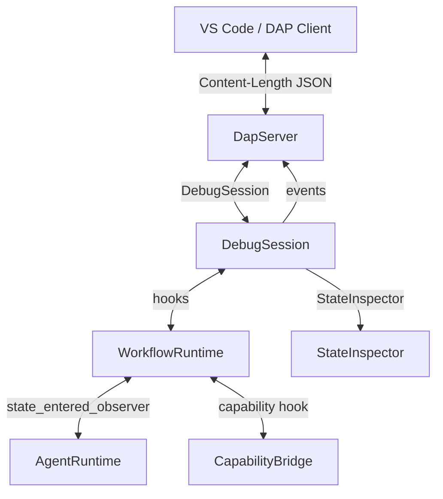
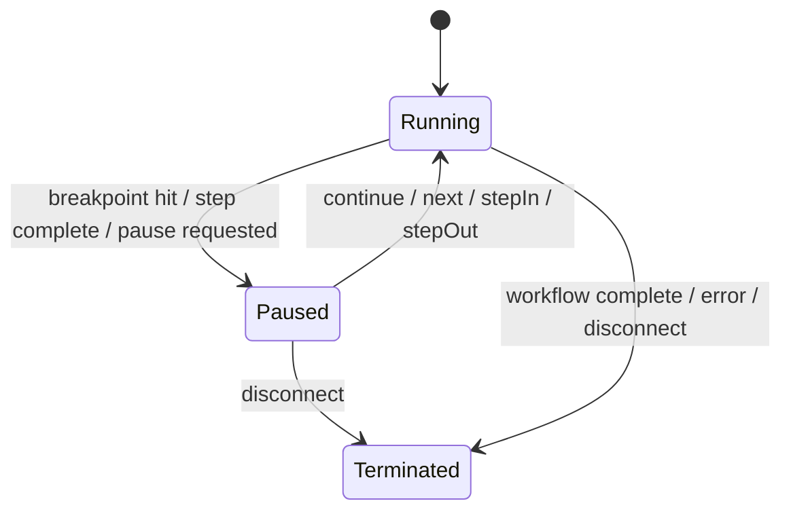

# RFC 0015: DAP Runtime Integration

## Summary

将 `src/tooling/dap/` 的协议骨架接入 `src/runtime/` 的真实执行引擎：在 AgentRuntime 状态迁移、capability 调用、workflow 节点边界插入调试钩子，通过 DAP 事件（`stopped` / `terminated` / `output`）通知客户端，并用 IR `SourceRange` 实现源码行到运行时位置的映射。调试模型面向 AHFL 的 workflow / state-machine 语义，而非传统命令式语言的逐语句执行。

## Motivation

当前 `ahfl-dap` 是一个半双工协议骨架：`main.cpp` 不注入任何 handler，`launch` 不启动程序，`StateInspector` 永远为空，breakpoint 检查从未被调用，没有任何事件发射。backlog（`docs/plans/issue-backlog-global-gaps.zh.md:134`）将"DAP 接入 runtime state、capability breakpoint、step execution"列为未完成项。没有运行时集成，DAP 对用户毫无价值——IDE 无法在状态迁移或 capability 调用处暂停，无法查看 agent 状态，无法单步调试 workflow。

## Goals

1. `launch` 请求启动真实的 workflow 执行（通过 `WorkflowRuntime`），`disconnect` 干净地终止执行。
2. State breakpoint：当 agent 进入指定状态时，执行暂停并发射 `stopped` 事件（reason: `breakpoint`）。
3. Capability breakpoint：当指定 capability 被调用时，执行暂停并发射 `stopped` 事件。
4. Line breakpoint：通过 IR `SourceRange` 将源码行映射到 IR declaration，在对应声明求值时暂停。
5. Step 语义：`next`（step over）、`stepIn`（step into capability / sub-workflow）、`stepOut`（step out to caller）、`continue`（resume）。
6. `stackTrace` / `scopes` / `variables` 返回真实的运行时调用栈和结构化变量值（agent state、context、input、output、workflow variables）。
7. `evaluate` 在当前暂停上下文求值表达式。
8. `terminated` 事件在 workflow 完成或失败时发射。
9. `output` 事件在 capability 产生输出或 runtime 发射日志时发射。
10. VS Code extension 注册 `debuggers` contribution，提供 launch schema 和 debug adapter factory。

## Non-Goals

1. 不做条件断点 / logpoint（`supportsConditionalBreakpoints: false` 保持不变）。
2. 不做函数断点（`supportsFunctionBreakpoints: false` 保持不变）。
3. 不做 `setVariable`（运行时变量只读）。
4. 不做远程调试 / attach 到已运行进程（Slice 1 只支持 launch）。
5. 不做 hot reload / edit-and-continue。
6. 不做多线程调试（AHFL runtime 是单线程事件循环；多 agent 通过 threads 请求暴露为逻辑线程）。
7. 不改变 evaluator 的表达式求值模型——调试钩子只在声明 / 语句 / 状态迁移 / capability 调用边界，不在表达式内部。

## Design

### 架构总览



`DebugSession` 是新增的核心类，位于 `src/tooling/dap/debug_session.hpp`。它持有：
- `DapServer&` — 用于发射事件和响应请求
- `BreakpointManager&` — 断点存储和匹配
- `StateInspector&` — 运行时状态快照
- `std::unique_ptr<WorkflowRuntime>` — 被调试的 runtime 实例
- `DebugStepper` — 步进状态机

### 调试钩子

#### State 迁移钩子（已有，需接线）

`AgentRuntime::set_state_entered_observer`（`src/runtime/engine/agent_runtime.cpp:64`）已存在。`DebugSession` 在 launch 时注入 observer：

```cpp
agent_rt.set_state_entered_observer(
    [this](AgentId agent, std::string_view state) {
        inspector_.set_agent_state(agent, state);
        if (should_pause_on_state(agent, state)) {
            pause(PauseReason::Breakpoint, agent, state);
        }
    });
```

`should_pause_on_state` 检查 `BreakpointManager::check_state_breakpoints(agent_id, state)`。

#### Capability 调用钩子（新增）

在 `WorkflowRuntime::eval_workflow_expression`（`src/runtime/engine/workflow_runtime.cpp:286`）的 capability 调用路径上，或在 `CapabilityBridge` 的 dispatch 层，新增 `capability_invoked_observer`：

```cpp
using CapabilityInvokedObserver =
    std::function<void(AgentId, std::string_view capability_name)>;
```

`DebugSession` 注入 observer，检查 `BreakpointManager::check_capability_breakpoints(agent_id, capability_name)`。

#### Workflow 节点边界钩子（已有 interruption_requested，需扩展）

`WorkflowRunConfig::interruption_requested`（`src/runtime/engine/workflow_runtime.hpp:51`）已在节点边界检查。`DebugSession` 复用此机制实现 pause：将 `interruption_requested` 设为返回 true，在节点边界暂停。

#### Line 断点映射

IR declaration 携带 `SourceRange`。`DebugSession` 在 launch 时构建 `source_line → IR declaration index` 的映射：

1. 遍历 `ir::Program` 的所有 declaration
2. 对每个 declaration 的 `SourceRange`，记录 `(file_path, line) → declaration_index`
3. Line 断点通过此映射找到对应 declaration
4. 在 declaration 求值前检查断点

声明求值的钩子点：`AgentRuntime` 的 handler 执行循环（`src/runtime/engine/agent_runtime.cpp:123`）和 `WorkflowRuntime` 的节点执行循环。

### 步进状态机



`DebugStepper` 管理步进状态：

```cpp
enum class StepKind { None, Over, Into, Out };

struct DebugStepper {
    StepKind pending_step{StepKind::None};
    std::size_t current_depth{0};  // workflow nesting depth
    AgentId current_agent;
    std::string current_state;
};
```

- **Continue**：`pending_step = None`，resume runtime。
- **Next (step over)**：记录当前 `(agent, state)`，resume；在下一个状态迁移或 capability 调用处暂停（不深入子 workflow）。
- **StepIn**：resume；如果下一步是 capability 调用或子 workflow，进入并在其第一个状态迁移处暂停；否则同 next。
- **StepOut**：记录当前 workflow nesting depth，resume；在 depth 减 1 时暂停。

### 事件发射

`DapServer` 新增 `send_event` 方法：

```cpp
void DapServer::send_event(std::string_view event_type,
                           std::unique_ptr<json::JsonValue> body);
```

`DebugSession` 在以下时机发射事件：

| 事件 | 时机 | body |
|------|------|------|
| `initialized` | launch 成功后 | `{}` |
| `stopped` | 断点命中 / 步进完成 / pause | `{reason, threadId, allThreadsStopped}` |
| `terminated` | workflow 完成 / 失败 / disconnect | `{}` |
| `output` | capability 输出 / runtime 日志 | `{category, output, variablesReference}` |

### 线程模型

每个活跃 agent 暴露为一个 DAP thread：

```cpp
// threads 请求处理
for (const auto& [agent_id, state] : inspector_.agent_states()) {
    threads.push_back({.id = agent_id_to_int(agent_id), .name = state.agent_name});
}
```

### 变量作用域

`scopes` 请求返回三个作用域：

| Scope | variablesReference | 内容 |
|-------|-------------------|------|
| `Agent State` | 100 + agent_id | 当前状态名、状态变量 |
| `Context` | 200 + agent_id | agent context 字段 |
| `Input/Output` | 300 + agent_id | workflow input / output |

`variables` 请求递归展开结构化值（struct fields、enum payloads）。`Value` 类型通过 `value_to_json`（`src/runtime/evaluator/value_json.cpp`）序列化，嵌套值使用 `variablesReference` 链式展开。

### 栈帧

`stackTrace` 返回当前暂停位置的调用栈：

```
Frame 0: agent::state_name (source.ahfl:line)
Frame 1: workflow_node_name (source.ahfl:line)
Frame 2: parent_workflow_node (source.ahfl:line)
```

栈帧从 `DebugSession` 维护的 `DebugFrame` 栈构建，每次状态迁移 / capability 调用 / workflow 节点进入时 push，退出时 pop。

### Evaluate

`evaluate` 在当前暂停上下文求值表达式。复用 `Evaluator::eval_expr`，将 `EvalContext` 的 environment 设为当前 agent 的变量绑定。表达式结果通过 `value_to_json` 序列化返回。

### VS Code 集成

`tools/vscode/package.json` 新增 `debuggers` contribution：

```json
{
  "type": "ahfl",
  "label": "AHFL Debug",
  "program": "./node_modules/.bin/ahfl-dap",
  "configurationAttributes": {
    "launch": {
      "properties": {
        "program": { "type": "string", "description": "Path to .ahfl file" },
        "workflow": { "type": "string", "description": "Workflow name to debug" }
      }
    }
  }
}
```

### launch 配置

`launch` 请求的 `program` 字段指定 `.ahfl` 文件，`workflow` 字段指定要调试的 workflow 名。`DebugSession`：

1. 用 `Frontend::parse_file` + `Resolver::resolve` + `TypeChecker::check` 编译源文件
2. 构建 `WorkflowRuntime`，注入调试钩子
3. 在独立线程中启动 workflow 执行
4. 发射 `initialized` 事件

## User Impact

- `ahfl-dap` 从协议骨架变为可用的调试适配器。
- VS Code 用户可以按 F5 启动 AHFL workflow 调试，在状态迁移和 capability 调用处设置断点，单步执行，查看 agent 状态。
- `setBreakpoints` 的 `verified` 字段现在反映真实的断点验证结果（源码行是否有可映射的 IR declaration）。
- 新增 `stopped` / `terminated` / `output` 事件——客户端不再需要轮询。

## Compatibility and Migration

非 breaking。DAP 协议层面：
- `initialize` 能力不变（`supportsConditionalBreakpoints: false` 等保持不变）。
- 新增事件类型是 DAP 标准的一部分，客户端默认支持。
- `setBreakpoints` 响应格式不变，但 `verified` 语义从"无条件 true"变为"真实验证"。

## Implementation Plan

1. **DebugSession 骨架**：`src/tooling/dap/debug_session.hpp` + `.cpp`，持有 `DapServer&` / `BreakpointManager&` / `StateInspector&`，launch/disconnect 接线。
2. **事件发射**：`DapServer::send_event` + `initialized` / `terminated` 事件。
3. **State 断点**：`AgentRuntime::set_state_entered_observer` 接线 + `stopped` 事件（reason: breakpoint）。
4. **Capability 断点**：`CapabilityInvokedObserver` + `BreakpointManager::check_capability_breakpoints` 接线。
5. **Line 断点**：`source_line → IR declaration` 映射 + declaration 求值钩子。
6. **步进**：`DebugStepper` + `next` / `stepIn` / `stepOut` / `continue` 实现。
7. **栈帧和变量**：`DebugFrame` 栈 + `stackTrace` / `scopes` / `variables` 真实实现。
8. **Evaluate**：暂停上下文表达式求值。
9. **Output 事件**：capability 输出 / runtime 日志 → `output` 事件。
10. **VS Code contribution**：`tools/vscode/package.json` debuggers contribution。
11. **测试**：见 Test Plan。

每阶段独立可验证，按阶段单独提交 Conventional Commit。

## Test Plan

1. **单元**：`tests/unit/tooling/dap/dap_basic.cpp` 扩展——DebugSession launch/disconnect 生命周期、state breakpoint 命中、capability breakpoint 命中、line breakpoint 映射、步进状态机。
2. **集成**：`tests/scripts/dap_smoke.py` 扩展——initialize → setBreakpoints → launch → stopped 事件 → stackTrace → scopes → variables → continue → terminated 全链路。
3. **反向**：断点设在无 IR 映射的行 → `verified: false`；disconnect 后 runtime 干净终止。
4. **回归**：`ctest --preset test-dev` 全量；现有 DAP 测试无回归。
5. **VS Code**：手动验证 launch config 和 debug session（不作为自动化测试）。

## Rollout and Stabilization

1. `draft` → `review`：Open Questions 清零、owner sign-off。
2. `accepted` 后按 Implementation Plan 切片实现。
3. `implemented`：代码、测试、VS Code contribution 全部落库。
4. `stabilized`：`docs/reference/` 补充调试指南；VS Code extension 发布包含 debugger。

## Alternatives

1. **在 evaluator 表达式层做逐语句调试**：AHFL 的语义核心是 workflow / state-machine，不是表达式求值。逐语句调试对用户没有意义——用户关心的是"agent 在哪个状态"、"capability 返回了什么"，不是"这个表达式先求值左子树还是右子树"。声明级 / 状态迁移级 / capability 调用级调试更符合 AHFL 的心智模型。
2. **用 GDB / LLDB 的 MI 协议代替 DAP**：GDB/MI 是为 C/C++ 设计的，不理解 AHFL 的 workflow / state-machine 语义。DAP 是语言无关的调试协议，VS Code 和其他 IDE 原生支持，是正确的选择。
3. **在 LSP 服务器中内嵌调试支持**：LSP 和 DAP 是不同的协议，有不同的生命周期和能力模型。混用会导致 LSP 服务器复杂化。独立的 `ahfl-dap` 进程是正确的架构。

## Open Questions

1. ~~Capability 断点的粒度~~（已决议，2026-08-23）：按 capability 名断（如 `http.get`），不按调用点。同名 capability 可能在多处调用，用户通常想在所有调用处断。
2. ~~StepIn 到 capability 内部~~（已决议，2026-08-23）：capability 是外部调用（HTTP / LLM），无法 step into。StepIn 到 capability 时在其返回处暂停。
3. ~~多 agent 并发暂停~~（已决议，2026-08-23）：`allThreadsStopped: true`。AHFL runtime 是单线程事件循环，一个 agent 暂停意味着整个 runtime 暂停。
4. ~~Workflow 变量的作用域~~（已决议，2026-08-23）：新增 `Workflow` scope（variablesReference = 400 + workflow_id），暴露 workflow-level 变量（input / output / node results）。

## Decision History

- 2026-08-23: Draft opened.
- 2026-08-23: Open Questions all resolved; status draft → review.
- 2026-08-23: Status review → implementing; Slice 1 (DebugSession + event emission + state breakpoint) started.
- 2026-08-23: Slice 1 landed (85608c4e): DebugSession, send_event, state breakpoint wiring, 32/32 DAP tests.
- 2026-08-23: Slice 2 implemented: `capability_invoked_hook` on `WorkflowRuntimeConfig` wired into the runtime capability dispatch path; `DebugSession` installs a stub contextual invoker so capability calls reach the hook and pauses on `check_capability_breakpoints` hits; 38/38 DAP tests.
- 2026-08-23: Slice 3 implemented: `DebugSession` builds a breakable source-line set from the IR Program (FlowDecl state handlers, AgentDecl, WorkflowNode) via `SourceFile::locate`, registers it with `BreakpointManager::set_breakable_lines`; `setBreakpoints` now verifies each line against the set; line breakpoints are checked on state entry via a reverse `state_name -> (file, line)` map; 47/47 DAP tests.
- 2026-08-23: Slice 4 implemented (2fc2f337): stepping state machine — `DebugStepper` (StepKind None/Over/Into/Out) armed by `next` / `stepIn` / `stepOut` from the last reported (agent, state); StepOver/StepIn complete at the first state transition to a different position, StepOut at a transition in a different agent (depth tracking arrives with sub-workflow support); capability invocations also complete a pending step; `continue` cancels armed steps; breakpoints take precedence over steps at the same position; `stopped` events carry reason "step"; `DapServer` routes `stepIn` / `stepOut`; 56/56 DAP tests.
- 2026-08-23: Slice 5 implemented: real frame stack and structured variable expansion. `DebugSession` maintains a `DebugFrame` stack (Workflow / Node / State / Capability) pushed by debug hooks; the runtime exposes no exit events, so frames use replacement semantics (a state entry for the same agent replaces the top state frame; a new node input pops the previous node's frames; a capability invocation replaces the top capability frame) rather than fabricated push/pop pairs. `stackTrace` returns the real frame stack with source locations from reverse `state_name -> (file, line)` and `node_name -> (file, line)` maps. `scopes` returns the RFC scope scheme ("Agent State", "Context", "Input/Output", "Workflow") with deterministic variablesReference ids (100+agent / 200+agent / 300+agent / 400). `variables` expands structured values recursively via `value_to_json`; nested struct / enum-payload / list / map values receive their own chained variablesReference (>= 1000) for multi-level expansion. Two new runtime hooks on `WorkflowRuntimeConfig` — `agent_input_hook` (the only way to observe the live agent input before it is moved into `AgentRuntime::run`) and `node_completed_hook` (exposes live node results for the Workflow scope) — and `state_entered_hook` extended with `agent_name` / `node_name` parameters so the debugger can build human-readable frames without re-deriving runtime metadata IDs. The Context scope and handler-local variables are not observable through the current runtime API and return empty; this is documented as a limitation, not fabricated. `StateInspector` and its stub `stackTrace` / `scopes` / `variables` implementations deleted as superseded dead code. 97/97 DAP tests.
- 2026-08-23: Slice 6 implemented: `evaluate` in the paused context. `DebugSession::evaluate_json(expression, frame_id)` resolves an identifier root followed by a chain of `.field` accesses against the live runtime values the session already holds — `input` / `output` name the frame agent's input / output value, an unqualified identifier names a workflow node result or (mirroring the runtime's flattening of the input struct into its input scope) an agent-input struct field, and each `.field` segment indexes a struct field or a named enum payload. The result is serialized via `value_to_json`; a structured result gets a chained `variablesReference` (>= 1000) reusing the Slice 5 variable store. `handle_evaluate` in `dap_server.cpp` delegates to the session, returning `{"error": "no active debug session"}` when none exists and `{"error": "..."}` for empty/malformed/unresolvable expressions. **Honest limitation (as anticipated by Non-Goal 7 and the Alternatives section):** the debugger cannot drive the full `Evaluator::eval_expr`. `eval_expr` consumes an `ir::Expr`, which only exists after a parse → resolve → typecheck → lower pipeline over a complete, well-formed program; the frontend exposes no expression-level parse entry point, and the paused session holds live `Value` bindings rather than a synthetic compilable program. Fabricating an `EvalContext` + synthetic IR to reach the evaluator would violate the "no fabricated environment" constraint, so evaluate is scoped to live-value path resolution (identifiers + field-access chains), which is exactly what an IDE hover / watch on `input.field` needs. Arbitrary sub-expressions (arithmetic, calls, operators, indexing) are rejected with a clear error rather than silently mis-evaluated. 115/115 DAP tests.
- 2026-08-24: Slice 8 (VS Code debuggers contribution) implemented. `tools/vscode/package.json` gains a `debuggers` contribution (`type: "ahfl"`, `label: "AHFL Debug"`) with `configurationAttributes.launch` exposing `program` (required, defaults to `${file}`), `workflow`, and `stopOnEntry`, plus `initialConfigurations` and two `configurationSnippets`; a `breakpoints` contribution enables breakpoints for the `ahfl` language; `activationEvents` add `onDebug:ahfl` / `onDebugResolve:ahfl`. Because `ahfl-dap` speaks DAP over stdin/stdout, the manifest deliberately does **not** hard-code a `program` path (unlike the RFC sketch's `./node_modules/.bin/ahfl-dap`, which does not match how the binary is built or shipped); instead the extension registers a `DebugAdapterDescriptorFactory` (`AhflDebugAdapterFactory` in `src/extension.ts`) returning a `DebugAdapterExecutable`. Adapter path resolution lives in a `vscode`-free, unit-testable module `src/debug.ts` (`resolveDebugAdapterCommand`) mirroring the LSP `resolveServerCommand` precedence: `ahfl.debugAdapterPath` setting → bundled `server/ahfl-dap[.exe]` → `ahfl-dap` on PATH, with a new `ahfl.debugAdapterArgs` setting. New standalone test `test/debugContribution.js` (script `test:debug-contribution`) bundles `debug.ts` in isolation to assert the resolution precedence and validates the manifest contribution shape. `tsc --noEmit` and the esbuild bundle are clean; the new debug-contribution test plus the existing `test:toolchain-config` and `test:syntax-grammar` JS suites pass. The C++ DAP suite is unchanged by this slice (last recorded 115/115; Slice 7 output-events landing concurrently updates that count). VS Code launch/attach behavior remains manual-verification per the RFC test plan. Follow-up left for the release owner: bundle the release `ahfl-dap` into `server/` in `scripts/package-vscode-vsix-release.sh` and add `test:debug-contribution` to the extension CI workflow (both outside this slice's `tools/vscode/**` file boundary).
- 2026-08-24: Slice 7 implemented: `output` events for capability results and runtime errors. `DebugSession::launch` now installs `WorkflowRuntimeConfig::capability_result_observer` (the pre-existing runtime hook that fires on the workflow thread right after every capability invoker returns) rather than adding a new hook — a successful call with a value emits an `output` event on the `stdout` category carrying `value_to_json(result.value)`, and a non-success status emits `stderr` with the capability's `error_message` so runtime failures surface instead of being swallowed. `DebugSession::execute` renders the `WorkflowResult` diagnostics to a `stderr` `output` event when `result.has_errors()`, before the `terminated` event, so a failed workflow reports its cause on the debug console. Both paths honor `stopping_` (no output events during disconnect). Launch-config validation and compile-error paths already emitted `stderr` output via `emit_output` (Slice 1); those remain and are now covered by a regression test. `output` event bodies follow the DAP spec shape `{"category", "output"}` (the RFC's `variablesReference` column is optional and omitted; the debugger streams scalar-serialized values, not expandable handles). Two new tests in `dap_basic.cpp`: a successful `DoWork()` capability call emits a `stdout` output event, and an empty launch config emits a `stderr` output event. 119/119 DAP tests.
