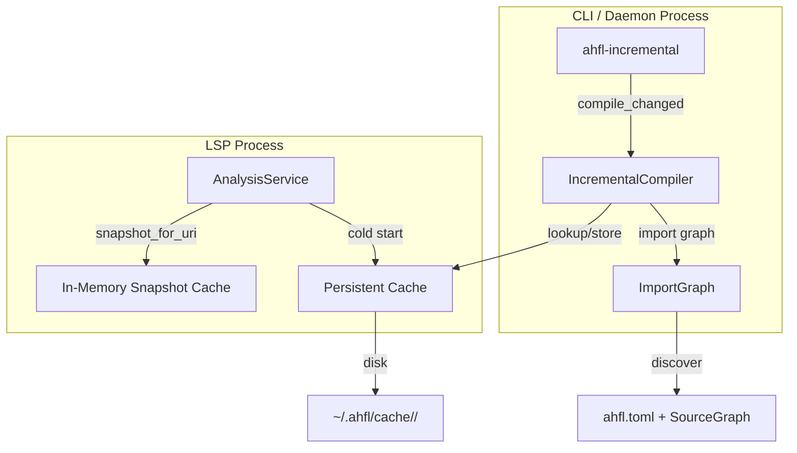
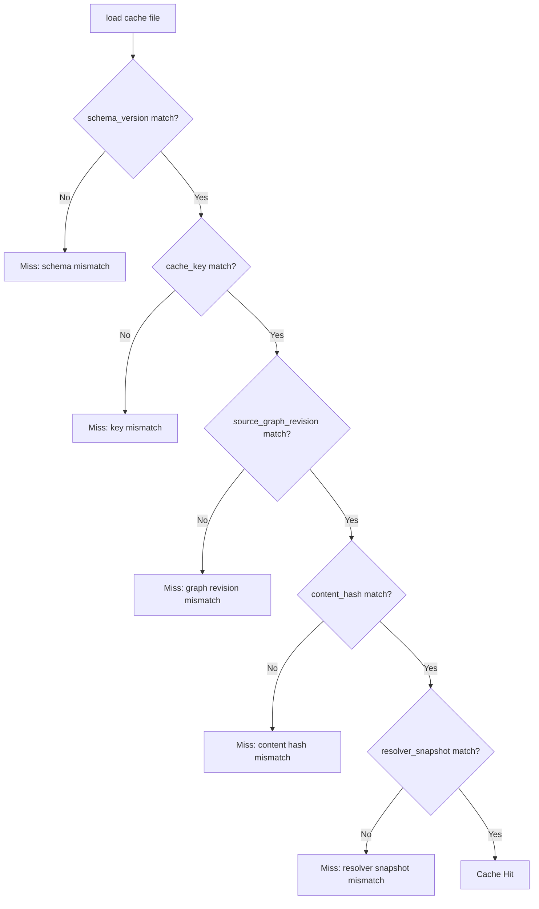
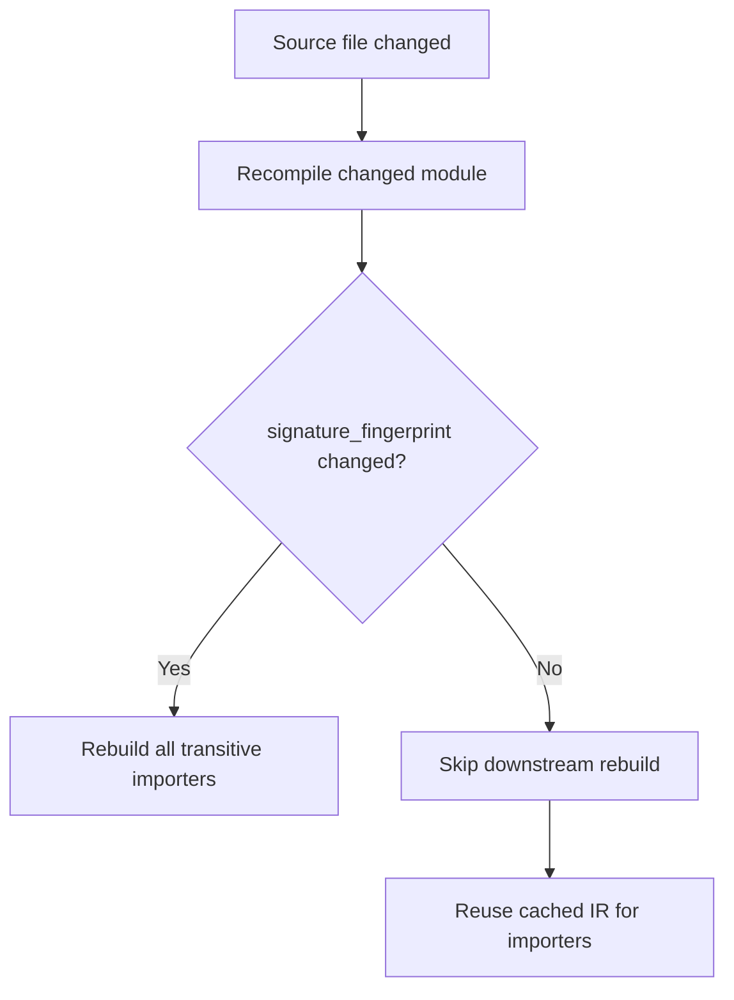

# RFC 0016: Incremental Cache Contract

## Summary

为 AHFL 增量编译定义持久化 cache contract：统一 `ahfl::incremental`（standalone 骨架）和 LSP `AnalysisService`（生产级）两套独立缓存系统，采用 `docs/design/ir-backend-architecture.zh.md` 已设计的 Typed HIR cache envelope 作为持久化格式，定义 project-aware import graph 发现、daemon invalidation contract、以及 signature fingerprint 驱动的下游跳过优化。

## Motivation

当前存在两套完全独立的缓存系统：

1. **`ahfl::incremental`**（`src/tooling/incremental/`）：in-memory `IrCache` + `DependencyGraph`，但 CLI 创建的 graph 节点 imports 为空——transitive dependent 计算是 no-op。无持久化、无 project-aware graph 发现、无 daemon 模式。
2. **LSP `AnalysisService`**（`src/tooling/lsp/analysis_service.cpp`）：生产级 5 字段 composite cache key + transitive import closure invalidation，但同样无持久化——每次 LSP 重启都全量重编译。

backlog（`docs/plans/issue-backlog-global-gaps.zh.md:136`）明确列出未完成项："为 incremental compiler 定义 project-aware import graph、持久 cache 和 daemon invalidation contract"。没有持久化 cache，大型项目的 LSP 冷启动和 CLI 重复编译都付出全量编译代价。

## Goals

1. **持久化格式**：定义 cache 文件格式（Typed HIR cache envelope），支持原子写入和 schema 版本化。
2. **Project-aware import graph**：从 `ahfl.toml` manifest + `SourceGraph` 自动发现 import 依赖图，替代 CLI 的空 graph。
3. **Unified cache key**：统一两套系统的 cache identity 模型，使 LSP 和 standalone compiler 可以共享 cache 目录。
4. **Signature fingerprint 下游跳过**：当模块内容变化但 signature fingerprint 不变时（注释、空白、函数体变化），下游 importer 跳过重编译。
5. **Daemon invalidation contract**：定义长驻进程的文件变更通知 → cache invalidation 映射规则。
6. **Cache 生命周期**：TTL、LRU eviction、大小上限。
7. **统一缓存核心**：提取共享 cache 库，消除两套系统的重复代码。

## Non-Goals

1. 不做分布式缓存 / 远程缓存服务器——cache 是本地的。
2. 不做跨项目 cache 共享——cache 目录按 project root 隔离。
3. 不做 query-based 增量编译（Rust 的 salsa 模式）——AHFL 的编译管线是 phase-based 的，不是 query-based。
4. 不做 AST 级别的细粒度复用——cache 粒度是 source unit（文件级），不是 declaration 级。
5. 不改变 LSP 的 snapshot 模型——LSP 继续使用内存 snapshot，持久 cache 是 snapshot 的冷启动加速层。
6. 不做并发 cache 写入——单写者模型（daemon 或 CLI 进程）。

## Design

### 架构总览



### Cache Identity（统一 cache key）

每个 cache entry 由以下字段唯一标识：

```cpp
struct CacheKey {
    std::string project_root_hash;    // SHA-256 of canonical project root path
    std::string source_path;          // project-relative path (e.g. "src/main.ahfl")
    std::uint64_t content_hash;       // FNV-1a of source content
    std::string toolchain_fingerprint; // compiler version + flags + stdlib identity
};
```

- `project_root_hash`：隔离不同项目的 cache。
- `source_path`：project-relative，不包含绝对路径（artifact identity 的确定性要求）。
- `content_hash`：源文件内容的 FNV-1a hash，与 LSP `DocumentStore` 和 `IrCache` 的现有 hash 一致。
- `toolchain_fingerprint`：编译器版本 + 编译 flags + stdlib identity 的组合 hash。编译器升级或 stdlib 变化时自动失效。

### 持久化格式（Typed HIR cache envelope）

持久化 envelope 的设计来自 IR backend 设计文档的 "Typed HIR cache envelope" 一节。envelope 的 JSON 结构如下：

```json
{
  "schema_version": "AHFL_TYPED_HIR_CACHE_V1",
  "cache_key": { ... },
  "source_graph_revision": "<hash of import graph structure>",
  "source_content_hash": "<FNV-1a>",
  "resolver_snapshot_version": "<hash of resolver state>",
  "signature_fingerprint": "<TypeEnvironment digest>",
  "typed_program": { ... }
}
```

加载时按以下顺序校验，任一失败则 cache miss：



`signature_fingerprint` 不参与 cache hit 判定——它用于下游跳过（见下节）。

### Cache 目录布局

```
~/.ahfl/cache/
  <project-root-hash>/
    manifest.json          // project root path + toolchain fingerprint
    <source-path-hash>.json // one file per source unit
    index.json             // source_path → cache file mapping + timestamps
```

- 原子写入：先写 `<file>.tmp`，再 `rename` 到 `<file>.json`。
- `index.json` 记录每个 cache entry 的最后访问时间，用于 LRU eviction。

### Signature Fingerprint 下游跳过

`TypeEnvironment::signature_fingerprint`（`src/compiler/semantics/type_environment.cpp:574`）已计算但仅用于 stats。本 RFC 将其用于实际的下游跳过决策：



- **Fingerprint 不变**：注释、空白、函数体变化（签名不变）→ 下游 importer 的 cache 仍然有效。
- **Fingerprint 变化**：struct 字段、enum variant、fn 签名、capability 签名变化 → 所有 transitive importer 必须重编译。

这要求 `IncrementalCompiler` 在重编译一个模块后，比较新旧 fingerprint，只对 fingerprint 变化的模块传播 invalidation。

### Project-Aware Import Graph 发现

`IncrementalCompiler` 当前接受外部传入的 `DependencyGraph`，但 CLI 传入空 graph。本 RFC 定义自动发现：

1. 从 `ahfl.toml` manifest 解析 package 配置。
2. 用 `project_discovery::discover_project_context()`（LSP 已有的发现逻辑）发现项目结构。
3. 用 `parse_project()` 解析 `SourceGraph`，提取 `import_edges`。
4. 从 `import_edges` 构建 `DependencyGraph`：每个 `SourceUnit` 是一个节点，每条 `ImportEdge` 是一条边。

这使 `ahfl-incremental` CLI 能自动发现项目依赖，无需外部传入 graph。

### Daemon Invalidation Contract

`ahfl-incremental --daemon` 启动长驻进程，监听文件变更：

1. **文件变更通知**：通过 stdin 接收 JSON Lines 格式的变更通知（与 LSP 的 `didChange` / `didSave` 对齐）：
   ```json
   {"type": "didChange", "uri": "file:///path/to/src/main.ahfl", "text": "..."}
   {"type": "didSave", "uri": "file:///path/to/src/main.ahfl"}
   {"type": "didClose", "uri": "file:///path/to/src/main.ahfl"}
   ```
2. **Invalidation 映射**：
   - `didChange` / `didSave` → `invalidate_paths({path})`，使用 transitive import closure 确定受影响的 cache entry。
   - Manifest 变更（`ahfl.toml` / `ahfl.workspace.toml`）→ `invalidate_all()`。
   - `didClose` → 不 invalidate（文件可能仍在磁盘上）。
3. **响应**：daemon 在每次 invalidation 后输出 stats（recompiled modules, cache hits/misses, fingerprint skips）。

### 统一缓存核心

提取 `src/tooling/incremental/cache_core.hpp` + `.cpp`，包含：

- `CacheKey`（上述统一 identity）
- `CacheEntry`（envelope + metadata）
- `PersistentCache`（磁盘 I/O + 原子写入 + LRU eviction）
- `ImportGraph`（从 `SourceGraph` 构建的依赖图）
- `SignatureFingerprint`（从 `TypeEnvironment` 提取 + 比较）

`ahfl::incremental::IrCache` 和 LSP `AnalysisService` 都改为使用 `CacheCore` 的组件，消除重复代码。

### Cache 生命周期

- **TTL**：默认 7 天。`index.json` 中的 `last_accessed` 超过 TTL 的 entry 被清除。
- **LRU eviction**：cache 目录总大小超过上限（默认 1 GB）时，按 `last_accessed` 最旧的 entry 开始清除。
- **手动清除**：`ahfl-incremental --clear-cache` 清除整个项目 cache。

## User Impact

- `ahfl-incremental` CLI 从骨架变为可用的增量编译器：自动发现项目依赖、持久化 cache、signature fingerprint 跳过。
- LSP 冷启动加速：重启后从持久 cache 加载 Typed HIR，跳过全量编译。
- 新增 `--daemon` 模式：长驻进程监听文件变更，持续维护 cache。
- 新增 `--clear-cache` 选项。
- Cache 目录 `~/.ahfl/cache/` 是用户可见的新文件系统路径。

## Compatibility and Migration

非 breaking。现有 `ahfl-incremental` CLI 的命令行接口不变，新增 `--daemon` 和 `--clear-cache` 是可选 flag。LSP 的行为不变——持久 cache 是透明的加速层。

Cache schema 版本化（`AHFL_TYPED_HIR_CACHE_V1`）确保未来格式变化时旧 cache 自动失效。

## Implementation Plan

1. **CacheCore 提取**：`src/tooling/incremental/cache_core.hpp` + `.cpp`——`CacheKey`、`CacheEntry`、`PersistentCache`（磁盘 I/O + 原子写入）。
2. **Import graph 发现**：从 `ahfl.toml` + `SourceGraph` 自动构建 `DependencyGraph`，替换 CLI 的空 graph。
3. **Signature fingerprint 传播**：`IncrementalCompiler` 比较新旧 fingerprint，只对变化的模块传播 invalidation。
4. **LSP 持久 cache 集成**：`AnalysisService` 冷启动时从 `PersistentCache` 加载 Typed HIR。
5. **Daemon 模式**：`ahfl-incremental --daemon`，stdin JSON Lines 监听 + invalidation。
6. **Cache 生命周期**：TTL + LRU eviction + `--clear-cache`。
7. **统一 IrCache**：`ahfl::incremental::IrCache` 改为 `CacheCore` 的薄封装。
8. **测试**：见 Test Plan。

每阶段独立可验证，按阶段单独提交 Conventional Commit。

## Test Plan

1. **单元**：`tests/unit/tooling/incremental/incremental.cpp` 扩展——CacheKey hash 一致性、PersistentCache store/load/evict、import graph 发现、signature fingerprint 跳过、daemon invalidation。
2. **集成**：`tests/scripts/incremental_smoke.py` 扩展——首次编译（cache miss）、第二次编译（cache hit）、修改注释后编译（fingerprint skip）、修改签名后编译（downstream rebuild）。
3. **LSP 集成**：`tests/unit/tooling/lsp/server_handlers.cpp` 新增——LSP 冷启动从持久 cache 加载、cache 失效后回退到全量编译。
4. **反向**：损坏的 cache 文件 → 优雅回退到全量编译；schema 版本不匹配 → cache miss。
5. **回归**：`ctest --preset test-dev` 全量；现有 incremental 和 LSP 测试无回归。

## Rollout and Stabilization

1. `draft` → `review`：Open Questions 清零、owner sign-off。
2. `accepted` 后按 Implementation Plan 切片实现。
3. `implemented`：代码、测试、CLI flag 全部落库。
4. `stabilized`：`docs/reference/` 补充增量编译指南；cache format 标记为 stable-artifact。

## Alternatives

1. **Rust salsa 风格的 query-based 增量编译**：salsa 要求将编译管线重构为 query 系统，这是对 AHFL phase-based 管线的根本性重写。AHFL 的编译管线（parse → resolve → typecheck → lower）是天然分层的，文件级 cache + signature fingerprint 跳过已经能覆盖主要场景（注释/空白/函数体变化不触发下游重编译）。query-based 是未来方向，但不是当前的最佳投入点。
2. **LLVM 风格的 ThinLTO 缓存**：ThinLTO 缓存的是后端优化结果，不是前端类型信息。AHFL 的瓶颈在前端（parse + resolve + typecheck），不在后端。Typed HIR cache 直接缓存前端产物，更匹配 AHFL 的实际瓶颈。
3. **不持久化，只做内存 cache**：LSP 已经有内存 cache，但每次重启都全量重编译。大型项目的冷启动延迟是用户可感知的。持久化 cache 以相对小的实现复杂度（磁盘 I/O + 原子写入）换取显著的冷启动加速。
4. **统一到 LSP 的 AnalysisService**：将 `ahfl-incremental` 改为 LSP 的客户端。这引入了进程间通信的复杂度，且 LSP 不是为 CLI 设计的。独立的 `CacheCore` 库让两套系统共享实现，同时保持各自的接口。

## Open Questions

1. ~~Resolver snapshot version 的计算~~（已决议，2026-08-23）：hash `ResolveResult` 的规范化表示——symbol table 的 (symbol_id, kind, name, source_range) 元组列表 + import 表的 (importer, imported) 元组列表，按确定性顺序序列化后 FNV-1a。import 顺序变化不影响 hash（排序后 hash）。
2. ~~Cache 目录位置~~（已决议，2026-08-23）：遵循 XDG base directory spec——`$XDG_CACHE_HOME/ahfl/`，fallback 到 `~/.cache/ahfl/`。
3. ~~Daemon 的生命周期~~（已决议，2026-08-23）：Slice 1 做独立 daemon（`ahfl-incremental --daemon`），LSP 集成是 follow-up。LSP 和 CLI 都可以连接到同一个 daemon。
4. ~~多进程 cache 访问~~（已决议，2026-08-23）：文件锁（`flock`）——cache 目录下的 `.lock` 文件，写者获取排他锁，读者获取共享锁。实现简单且足够。

## Decision History

- 2026-08-23: Draft opened.
- 2026-08-23: Open Questions all resolved; status draft → review.
- 2026-08-23: Status review → implementing; Slice 1 (CacheCore + import graph discovery) started.
- 2026-08-23: Slice 1 landed (1c6f5aed): CacheKey, PersistentCache, import graph discovery, CLI wiring, 10/10 incremental tests.
- 2026-08-23: Slice 2 implemented: signature fingerprint propagation in `IncrementalCompiler::compile_changed` — old vs new fingerprint compared after recompile; transitive dependents invalidated (in-memory + persistent) only on fingerprint change or missing old entry; `fingerprint_unchanged` stat renamed to `fingerprint_skipped`; 13/13 incremental tests.
- 2026-08-23: Slice 3 implemented: daemon mode — `ahfl-incremental --daemon --project <root>` reads JSON Lines notifications from stdin (`didChange` / `didSave` / `didClose` with `file://` URIs); didChange/didSave map to `compile_changed({path})` (transitive invalidation + fingerprint propagation), didClose is a no-op, manifest changes (`ahfl.toml` / `ahfl.workspace.toml`) call the new `IncrementalCompiler::invalidate_all()` + `reset_stats()`; one compact stats JSON object emitted per invalidation, malformed lines / unknown types emit error objects and the loop continues; daemon loop extracted into `ahfl::incremental::run_daemon()` for testability; 16/16 incremental tests.
- 2026-08-23: Slice 4 implemented (4294b105): cache lifecycle — `IndexEntry` gains `last_accessed` (persisted in `index.json` as epoch seconds; legacy index files without it default to `cached_at`); every `PersistentCache::lookup` hit refreshes `last_accessed` and re-saves the index; `evict_expired(ttl)` runs lazily at the start of `lookup()` and `store()` with the default 7-day TTL (`kDefaultTtl`); `evict_lru(max_bytes)` runs eagerly after `store()` with the default 1 GB budget (`kDefaultMaxCacheBytes`), evicting oldest-`last_accessed` entries first (source path breaks ties for determinism); `invalidate()` refactored onto a shared `remove_entry()` helper; new `--clear-cache` CLI flag (requires `--project`, mutually exclusive with source files and `--daemon`) wipes the project cache and prints `Cache cleared for <root>`; 21/21 incremental tests.
- 2026-08-23: Slice 5 implemented: LSP persistent cache integration — `AnalysisService` gains an opt-in persistent typed-HIR cache (`set_persistent_cache_enabled(bool)`, default off) that reuses the RFC 0016 `PersistentCache` and the unified `CacheKey`, sharing the same on-disk directory as the standalone incremental compiler (`$XDG_CACHE_HOME/ahfl/<project-root-hash>/`). On a cold start (no in-memory snapshot for a URI) the service looks up the persistent cache before falling back to full analysis; a hit deserializes the typed program via `load_typed_program_cache_json` and returns a degraded snapshot (typed HIR only) without incrementing `analysis_runs_`; a miss, schema mismatch, or deserialization failure falls through to `build_snapshot` (graceful fallback). After a successful full analysis the typed program is persisted via `serialize_typed_program_cache_json` into `PersistentCacheEntry::serialized_typed_hir`. `invalidate_paths` now also removes the persistent entries for the changed paths plus their transitive importers (computed from in-memory project import graphs), and `invalidate_all` clears every managed persistent cache. The LSP 10-field `LspToolchainCacheKey` is mapped onto the 4-field unified `CacheKey` (project root from `root_manifest`, project-relative source path, `incremental::fnv1a64` content hash, `default_toolchain_fingerprint`) without altering the in-memory cache or its key (Slice 7 boundary respected). The cache is opt-in because only `TypedProgram` is round-trippable through the current envelope — `TypeEnvironment`, `ResolveResult`, `workspace_index`, and `hover_indices` are not serializable, so a cold-start hit cannot serve environment-dependent features (hover, completion, references) until a full rebuild; the LSP server therefore does not enable it yet. Three new tests in `server_handlers.cpp` (cold-start hit with `analysis_runs()==0`, didChange invalidation with next cold-start miss, corrupt entry file fallback to full analysis) bring the LSP handler suite to 1259/1259; incremental 21/21 and DAP 2/2 remain green.
- 2026-08-23: Slice 6 implemented: IrCache unification (Implementation Plan item 7). The standalone incremental compiler previously maintained a parallel in-memory cache model — its own `CacheEntry` (module_path / content_hash / serialized_ir), `CacheHitKind` (Hit/Miss/Stale), `CacheLookupResult`, and a `module_path`-keyed store — duplicating the CacheCore identity and envelope introduced in Slice 1. Those three types are deleted. `IrCache` is now a thin in-memory tier over CacheCore: it stores `PersistentCacheEntry` envelopes keyed by `CacheKey::source_path` and validates the full four-field `CacheKey` (content hash included) on `lookup`, returning the shared `PersistentCacheLookupResult`. The in-memory tier and the disk-backed `PersistentCache` now share one identity model and one envelope type, so the two caches can never disagree on what "the same artifact" is. `IncrementalCompiler` drops its translation layer (`hydrate_from_persistent` / `persist_entry`): a recompile builds a single `PersistentCacheEntry` stored into both tiers, a persistent hit hydrates the in-memory tier by storing the same envelope, and the old-fingerprint read for downstream-skip propagation uses the new `IrCache::find_by_source_path` (content-hash-agnostic) instead of the former `lookup(mod_path, 0)` Stale-path hack. Invalidation on both tiers is now keyed on the same project-relative `source_path`. The public `IncrementalCompiler` interface (`compile_changed`, `stats`, `invalidate_all`, `reset_stats`) is unchanged; the daemon and CLI required no changes (they touch only `IncrementalStats`). Two new tests: unified-key isolation on `project_root_hash` + `toolchain_fingerprint`, and persistent-hit hydration of the in-memory tier across two compiler instances sharing one `PersistentCache`. Incremental suite 23/23; LSP 3/3 and DAP 2/2 remain green. Gap: full unification is achieved for the standalone path, but the in-memory tier retains a distinct storage instance from the persistent index rather than being a literal view over it — a source unit that is present on disk but never looked up in this process is not resident in memory (by design: the in-memory tier is a per-process hot set, and reads lazily hydrate it). This is the intended two-tier caching model, not residual duplication. The LSP `AnalysisService` still uses its own 10-field `LspToolchainCacheKey` for the in-memory snapshot cache and maps it to the unified `CacheKey` only at the persistent boundary (unchanged from Slice 5); collapsing the LSP in-memory key onto the unified `CacheKey` is out of scope for this slice and remains open.
