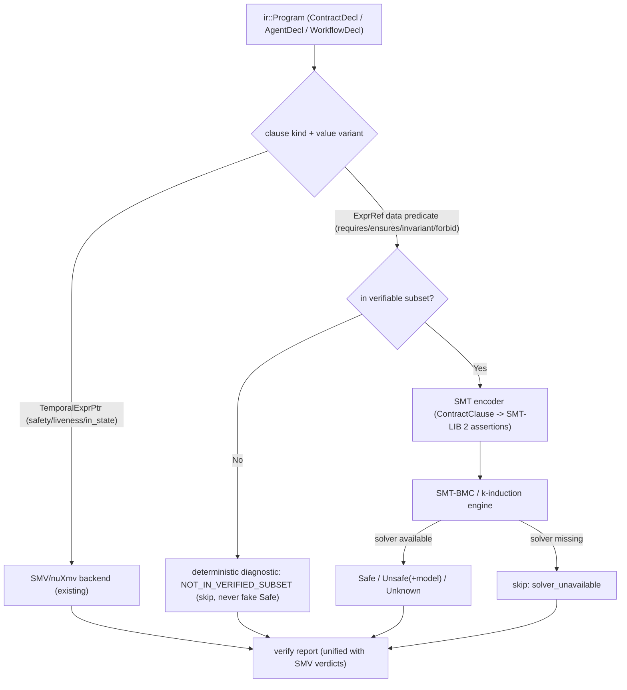
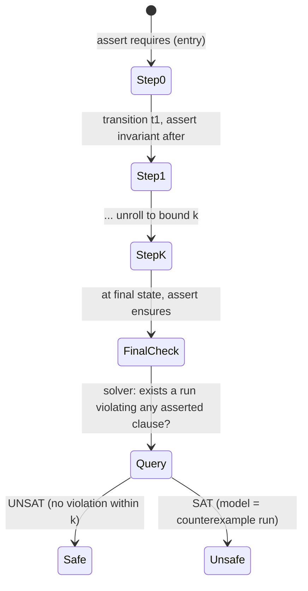

# RFC 0017: BMC Contract Semantics

## Summary

将 `src/verification/formal/bmc.{hpp,cpp}` 的有界模型检查（BMC / k-induction）从
"状态图可达性"提升到"AHFL contract 语义级"验证。当前 `BmcStateMachine` 只携带
`states` / `transitions` / `properties`（裸 LTL 字符串），`parse_properties` 只识别
`never(X)` 形式，且没有 SAT/SMT 求解器后端（`run_cegar` 是 stub，遇到需要求解的场景
返回 `Unknown`）。本 RFC 定义一个 SMT 编码层：把 AHFL contract 子句
（`requires` / `ensures` / `invariant` / `forbid`，见 `include/ahfl/compiler/ir/types.hpp:105`
的 `ContractClauseKind`）中对 agent context / input / output 字段的**数据谓词**编码为
SMT-LIB 约束，交给 SMT 求解器判定，从而回答"这个 `ensures` 后置条件在所有 ≤k 步执行下
都成立吗"这类语义级问题，而不只是"这个状态可达吗"。本 RFC 同时明确 **可验证子集
（verifiable subset）** 的边界（复用 `include/ahfl/compiler/semantics/effect_judgement.hpp:232`
已有的 §4.2 概念），以及新的 SMT-BMC 后端与现有 SMV/nuXmv 后端的**共存与分工**。

## Motivation

AHFL 的 contract 是语言核心构造：`contract for Agent { requires ...; ensures ...;
invariant ...; }`，在 IR 中是 `ContractDecl` / `ContractClause`
（`include/ahfl/compiler/ir/decl.hpp:196`），其 `value` 是
`std::variant<ExprRef, TemporalExprPtr>` —— 既可以是一个引用 context/input/output 字段的
**普通数据表达式**，也可以是一个**时序逻辑表达式**。

今天的两条验证路径都不能验证前者的语义：

1. **SMV/nuXmv 后端**（`src/compiler/backends/smv/smv.cpp`）擅长时序/状态属性
   （`safety` / `liveness` / `in_state` / `called`），通过 `LTLSPEC` + `AHFL_MAP` 发射到
   外部模型检查器。但它工作在**有限状态抽象**上，不解释数据域上的算术/关系谓词
   （`context.balance >= 0`、`output.total == input.qty * input.price`）。

2. **内置 BMC**（`src/verification/formal/bmc.cpp`）只在 `BmcStateMachine` 的
   `states`/`transitions` 图上做可达性；`parse_properties`（`bmc.cpp:33`）仅识别
   `never(X)` 字符串；`run_cegar`（`bmc.cpp:264`）显式返回
   `"CEGAR: requires SAT solver backend for sound verification"`。它**完全不消费
   contract 的数据谓词**。

结果：一个写了 `ensures: output.total == input.qty * input.price;` 的 agent，其后置条件
**没有任何验证路径**——SMV 抽象掉了数据，BMC 根本没读 contract。backlog
（`docs/plans/issue-backlog-global-gaps.zh.md` §3.5 第一项）明确列出："将 BMC/k-induction
从简单状态图 reachability 推进到 AHFL contract/property semantics"。不做这个决策，
contract 的数据部分永远是"能写但不能证"的死语法。

## Goals

1. 定义一个 **SMT 编码契约**：把 `ContractClause`（`Requires`/`Ensures`/`Invariant`/`Forbid`）
   中引用 agent context / input / output 字段的数据谓词，确定性地编码为 SMT-LIB 2 断言。
2. 定义 **可验证子集边界**：明确哪些 AHFL 表达式/类型可编码（整数、布尔、有界 Decimal、
   struct 字段投影、比较/算术），哪些落在子集之外（`String` 内容谓词、`List`/`Map`
   量化、capability 调用结果、非纯表达式），落在子集之外时给出确定诊断而非静默放弃。
3. 定义 SMT-BMC 的 **状态展开语义**：在 agent 状态机迁移的每一步，前置断言 `requires`、
   在迁移后断言 `invariant`、在 `final` 状态断言 `ensures`，展开到 bound k，用 SMT
   求解器判定"是否存在违反的 ≤k 步执行"。
4. 定义 **k-induction 的数据扩展**：把现有 `run_k_induction`（`bmc.cpp:198`）的归纳
   从状态集扩展到"状态 + 数据不变式"，以获得无界证明。
5. 定义 **与 SMV/nuXmv 后端的分工与共存**：SMV 继续负责时序/状态属性
   （`safety`/`liveness`/`in_state`/`called`），SMT-BMC 负责数据谓词 contract；
   `verify` 报告统一呈现两者的结论与 skip reason。
6. 定义 **反例的语义级映射**：SMT 模型（satisfying assignment）反向映射为 AHFL 层的
   具体输入/context/迁移序列，复用 RFC 0015/counterexample 已有的 source-range 映射
   基础设施（`src/verification/formal/counterexample.hpp`）。

## Non-Goals

1. **不引入外部 SMT 求解器作为强依赖**。求解器（Z3 / cvc5）是可选后端；不可用时给出
   确定 skip 语义（与 nuXmv 缺失时一致，见 `src/verification/formal/checker.cpp` 的
   工具能力矩阵），绝不伪造 `Safe`。
2. **不验证 String 内容语义**。字符串只在相等/非等层面编码为未解释常量；不做正则、
   长度算术、子串谓词。
3. **不做无界数据结构的完整量化**。`List`/`Set`/`Map` 上的 `forall`/`exists` 谓词落在
   可验证子集之外（见 Open Questions 的渐进方向）。
4. **不替换 SMV/nuXmv 后端**。时序属性仍走 SMV；本 RFC 只新增数据谓词这条正交路径。
5. **不改变 contract 的源语法或 IR 形状**。`ContractClause` / `ContractDecl` 结构不变；
   本 RFC 只新增一个消费它们的验证后端。
6. **不做 CEGAR 抽象精化**。`run_cegar` 保持 stub 或独立演进；本 RFC 的 SMT-BMC 是直接
   编码，不是抽象-精化循环。

## Design

### 架构总览

新增一条与 SMV 正交的验证路径：contract 的数据谓词经 SMT 编码层进入 SMT-BMC 引擎，
时序属性继续走 SMV/nuXmv。`verify` 驱动统一编排两者。

### 分工判定：哪条路径处理哪个子句

判定完全由 `ContractClause` 的 `kind` 与 `value` variant 决定（`decl.hpp:196`）：

| 子句 | `value` 形态 | 路径 |
| --- | --- | --- |
| `safety` / `liveness`（`WorkflowDecl.safety/liveness`） | `TemporalExprPtr` | SMV/nuXmv |
| `invariant` 含 `in_state`/`called` 时序算子 | `TemporalExprPtr` | SMV/nuXmv |
| `requires` / `ensures` / `forbid` 数据谓词 | `ExprRef` | SMT-BMC |
| `invariant` 数据谓词（无时序算子） | `ExprRef` | SMT-BMC |
| `decreases` | 终止度量 | 既不属此路径（由 RFC 关于终止的既有机制处理），不在本 RFC 范围 |

分工是**静态可判定**的：对 `value` 做 `std::visit`，`TemporalExprPtr` → SMV，`ExprRef`
→ 进入子集判定。不引入字符串匹配来分类。

### 可验证子集边界

复用并扩展 `effect_judgement.hpp:232` 的 §4.2 概念（当前判定 `Pure && has_decreases`）。
一个 contract 数据谓词进入 SMT-BMC 的**充要条件**：

1. 表达式是 **纯的**（`EffectJudgement::Kind::Pure`）——含 capability 调用结果的谓词落在
   子集外。
2. 每个叶子引用解析为 **可编码类型**：`Bool`、`Int`、有界 `Decimal(p)`、以及这些类型
   构成的 struct 的字段投影（context / input / output 的字段）。
3. 只使用 **可编码算子**：布尔连接（`&&`/`||`/`!`/`=>`）、关系（`==`/`!=`/`<`/`<=`/`>`/`>=`）、
   整数与定点算术（`+`/`-`/`*`；除法见 Open Questions）、struct 字段访问、
   enum 判别（tag 相等）。

落在子集外的谓词（`String` 内容、`List`/`Map` 量化、capability 结果、浮点非确定性）
产生确定诊断 `formal.NOT_IN_VERIFIED_SUBSET`（复用现有稳定 code，见
`docs/reference/error-codes.zh.md`），并在 `verify` 报告中记为 skip，**不**降级为 `Safe`。

### SMT 编码契约

编码是 IR → SMT-LIB 2 的确定性映射（无 wall clock / 无随机 / 无 host path，遵守
artifact 确定性边界）：

- **类型映射**：`Bool` → SMT `Bool`；`Int` → SMT `Int`（数学整数）。运行时 `Int` 是
  `int64_t`（`src/runtime/evaluator/value.hpp:34`，`+`/`-`/`*` 环绕、无检查），但 contract
  验证关心的是逻辑正确性,故默认编码为**数学整数**（可判定、更快）；溢出检查作为
  **可选**附加断言（在每个算术节点旁发射 `INT64_MIN ≤ result ≤ INT64_MAX`），仅在用户
  显式请求时开启,不默认拖慢求解。spec 的有界子类型 `Int(lo,hi)`
  （`docs/spec/core-language.zh.md:176`）额外发射 `lo ≤ x ≤ hi` 约束。
  `Decimal(p)` → 按 scale 提升为 `Int` 的定点表示；struct → 每个字段一个 SMT 常量，
  按 `SymbolId` 而非字段名生成稳定的 SMT 符号名（索引式身份，遵守 AGENTS.md 原则）；
  enum → 判别式为有界 `Int`（variant index），payload 递归编码。
- **除法 / 取模映射**：`/` 与 `%` 编码为 SMT 的**向零截断整除 / 截断取模**，对齐运行时
  语义（`src/runtime/evaluator/evaluator.cpp:1364`：整数 `/` 用 C++ `/` 截断，`1377`：`%`
  用 C++ `%`；除零/模零在运行时是 `make_error`）。因此对每个 `/` 与 `%` 节点**自动附加
  一条 `divisor != 0` 的验证义务**：若求解器能满足 `divisor == 0`，则该表达式在某执行下
  会触发运行时除零错误,报为 `Unsafe` 反例；能证明 `divisor != 0` 则安全。这把"除零"
  从运行时崩溃提升为可静态验证的 contract 属性。
- **谓词映射**：`ExprRef` 指向的 IR 表达式树按 `std::variant` visitor 递归下降为 SMT
  term；每个 IR 表达式节点有唯一 SMT 编码规则，不存在字符串模板拼接谓词。
- **符号命名**：SMT 符号从 `SymbolId` + 展开步索引 i 确定性生成（如
  `ctx__<symbol_id>__<step>`），保证同一程序多次编码字节一致。

### SMT-BMC 状态展开语义

给定 agent 状态机（`AgentDecl` 的 `states` / `transitions`）与其 contract，展开到 bound k：

- 第 0 步断言 `requires`（把前置条件作为对 input/context 初值的约束）。
- 每步迁移后断言该状态的 `invariant`。
- 到达 `final` 状态断言 `ensures`。
- 查询"是否存在 ≤k 步执行违反任一断言"：`UNSAT` → 该 bound 下 `Safe`；`SAT` → `Unsafe`，
  satisfying model 就是反例（具体 input/context 值 + 迁移序列）。

`BmcOptions.max_bound`（`bmc.hpp:18`）继续控制 k；`use_k_induction` 时把归纳假设从
"状态集封闭"扩展为"状态 + 数据不变式在迁移下保持"，用两次 SMT 查询（base case +
inductive step）获得无界证明。

### 反例的语义级映射

`SAT` 时求解器返回一组变量赋值。编码层保留 SMT 符号 → `(SymbolId, step)` 的逆映射，
把赋值反向物化为 AHFL 层的 `BmcCounterexample`（`bmc.hpp:23`）：具体 input/context 字段
取值 + 触发违反的迁移序列 + 被违反的子句。source-range 复用
`src/verification/formal/counterexample.hpp` 已有的映射基础设施（RFC 0015 Slice 5 已把
capability/contract 子句映射到 source range）。

### 求解器后端接线

SMT 求解器初期**只接 Z3**（经 `checker.cpp` 已有的工具能力矩阵接入）：
`missing_binary`（求解器未安装）→ 确定 skip；`solver_error` → 确定 failure；正常
→ `Safe`/`Unsafe`。与 nuXmv 的 skip 语义对齐，CI 在求解器缺失时不 fail、不伪造结论。
cvc5 作为后续可选后端——能力矩阵天然支持多后端,但本 RFC 不同时接入两者,避免初期
维护面过宽。

### `emit smt` artifact

新增 `ahflc emit smt`（与 `emit smv` 对称），把编码后的 SMT-LIB 2 作为可检查 artifact
输出到 stdout。用途：调试编码层、外部复用（用户自己的 SMT 工作流）、以及作为 golden
测试的稳定快照。该 artifact 遵守确定性边界（无 wall clock / pid / host path / 随机），
同一程序多次 `emit smt` 字节一致。它是继 `emit ir` / `emit smv` 之后的又一 emit 目标,
不引入新的运行时依赖(SMT 文本由编码层直接生成,不需要求解器在场)。

## User Impact

- `ahflc verify` 对写了数据谓词 contract 的 agent 现在会真正验证 `requires`/`ensures`/
  `invariant`，而不是静默略过。
- 落在可验证子集外的谓词产生 `formal.NOT_IN_VERIFIED_SUBSET` 诊断（带 source range），
  用户能明确知道"这条 contract 没被证，因为它用了 String 内容谓词/量化/capability 结果"。
- `verify` 报告新增 SMT-BMC 段：每条数据谓词 contract 的 `Safe`/`Unsafe`/`Unknown`/`skip`
  结论；`Unsafe` 附具体反例赋值。
- SMT 求解器未安装时，报告明确标注 `solver_unavailable` skip，退出码语义与 nuXmv 缺失
  一致。
- 新增 `ahflc emit smt`：把 contract 数据谓词的 SMT-LIB 2 编码输出为可检查 artifact,
  供调试与外部 SMT 工具复用。
- 涉及 `/` 或 `%` 的 contract:验证层会尝试证明除数非零,不能证明时报除零反例——此前
  除零只在运行时以 error 暴露。
- 时序属性（`safety`/`liveness`）行为完全不变，仍走 SMV/nuXmv。

## Compatibility and Migration

**非 breaking。** contract 的源语法、`ContractClause`/`ContractDecl` IR 形状、SMV 后端
输出、`emit smv` 的 `AHFL_MAP`/`LTLSPEC` 格式均不变。本 RFC 只新增一条消费既有 IR 的
验证后端与一个新诊断路径。

- 对既有程序：此前"能写但不被验证"的数据谓词 contract 现在会被验证或明确 skip——这可能
  **暴露此前隐藏的 `Unsafe`**。这不是回归而是新增的正确性发现；`verify` 是显式命令，
  不影响 `check`/`run`。
- 新诊断 `formal.NOT_IN_VERIFIED_SUBSET` 用于 contract 数据谓词场景是新的触发点，但 code
  本身已存在，消费方（LSP/CLI）无需改动。
- 无 artifact 格式 breaking：新增的 `emit smt` 是一个新 emit 目标（不改动既有
  `emit ir` / `emit smv` 输出），SMT-LIB 编码遵守确定性边界。

## Implementation Plan

按子系统切片，每片独立可验证、单独 Conventional Commit：

1. **子集判定**（`src/compiler/semantics/` + `src/verification/formal/`）：扩展
   `is_verifiable_subset_eligible` 的调用，新增 contract-数据谓词的可编码性判定，产出
   `formal.NOT_IN_VERIFIED_SUBSET` 诊断。
2. **SMT 编码层**（`src/verification/formal/smt_encode.{hpp,cpp}` 新增）：IR 表达式 →
   SMT-LIB 2 term 的 visitor；类型映射（含 `Int(lo,hi)` 边界约束、`/`/`%` 的 `divisor != 0`
   验证义务、可选溢出检查）；`SymbolId` 确定性符号命名。纯函数、可单测。
3. **`emit smt` artifact**（`src/compiler/backends/driver.cpp` + CLI）：新增 `emit smt`
   目标，输出编码层产物到 stdout；不需要求解器在场。
4. **SMT 求解器 seam**（`src/verification/formal/`）：Z3 进程后端（cvc5 后续），接入
   `checker.cpp` 工具能力矩阵，`missing_binary`/`solver_error`/正常三态。
5. **SMT-BMC 引擎**（`src/verification/formal/bmc.cpp` 扩展）：状态展开 + requires/invariant/
   ensures 断言 + bound-k 查询；替换 `run_cegar` stub 或新增 `run_smt_bmc`。
6. **k-induction 数据扩展**（`bmc.cpp`）：base case + inductive step 两次查询；inductive
   step 无法强化时回退到有界结论并标注 `bounded_safe`。
7. **反例物化**（`bmc.cpp` + `counterexample.cpp`）：SMT model → `BmcCounterexample` +
   source-range 映射。
8. **verify 报告集成**（`checker.cpp` + `src/tooling/cli/`）：统一呈现 SMV + SMT-BMC 结论
   与 skip reason。
9. **测试**：见 Test Plan。

## Test Plan

- **单元**（`tests/unit/verification/formal/`）：SMT 编码 visitor 逐节点（关系/算术/布尔/
  struct 投影/enum 判别）→ 期望 SMT-LIB term；确定性（同程序两次编码字节一致）；子集
  边界（String 内容/量化/capability 结果 → `NOT_IN_VERIFIED_SUBSET`）；`Int(lo,hi)` 发射
  边界约束；`/`/`%` 发射 `divisor != 0` 义务；可选溢出检查断言。
- **`emit smt` golden**：一个数据谓词 contract 程序 `emit smt` → 与捕获的 SMT-LIB golden
  字节比对；两次 emit 字节一致（确定性）。
- **Golden 正例**：`ensures: output.total == input.qty * input.price;` 之类可证 contract →
  `Safe`；k-induction 无界证明；可证"除数非零"的 `/` contract → `Safe`。
- **Golden 负例**：故意违反的 `ensures`（如 off-by-one）→ `Unsafe` + 具体反例赋值；
  可能除零的 `/` contract → `Unsafe`（除零反例）。
- **集成**（`tests/scripts/`）：`ahflc verify` 全链路——SMV 时序 + SMT-BMC 数据谓词
   混合程序，报告同时呈现两者。
- **反向/工具缺失**：SMT 求解器（Z3）不可用 → 确定 `solver_unavailable` skip，退出码正确，
   绝不 `Safe`。
- **回归**：`ctest --preset test-dev`；现有 `ahfl.formal.bmc_all` /
   `ahfl.formal.bmc_depth_customization_all`（`tests/cmake/LabelTests.cmake:341/370`）无回归。
- **Fuzz**：`tests/fuzz/fuzz_smv_emitter.cpp` 同款——对 SMT 编码器喂随机合法 IR，断言
   不 crash、编码确定。

## Rollout and Stabilization

1. `draft` → `review`：Open Questions 清零、formal + compiler owner sign-off。
2. `accepted` 后按 Implementation Plan 切片实现。
3. `implemented`：编码层、SMT-BMC 引擎、求解器 seam、verify 集成、测试全部落库。
4. `stabilized`：`docs/spec/` 补充可验证子集的规范定义，`docs/reference/` 补充 `verify`
   数据谓词验证指南；SMT 编码若作为可发布 artifact 则标记 stable-artifact。

## Alternatives

1. **只扩展 SMV/nuXmv 到数据域（bounded integer variables in NuSMV）**：NuSMV 支持有界
   整数变量，理论上可把数据谓词塞进 SMV 模型。但 NuSMV 的数据类型极有限（无定点
   Decimal、无 struct、状态爆炸严重），且把数据编码进有限状态会使状态空间指数膨胀
   （`checker.cpp` 已有的 state-space estimator 会立即触发 tractability warning）。SMT
   求解器天生处理数据域约束，是正确工具。SMV 继续做它擅长的时序部分。**失败原因**：
   工具与问题域不匹配，状态爆炸。
2. **走 Dafny 式的 verification-condition generation + 通用 SMT（放弃 BMC）**：直接为每个
   contract 生成 VC 交给 SMT，不做有界展开。这对无循环的纯函数很好，但 AHFL 的核心是
   **状态机**——agent 在状态间迁移，contract 是对迁移序列的断言。有界展开 + k-induction
   更贴合状态机语义，且能给出"第 k 步的具体反例执行"，比一个不可满足的 VC 对用户更有
   诊断价值。**失败原因**：丢失状态机执行序列语义与反例可读性。本 RFC 借鉴 Dafny 的
   verifiable-subset 思想（可判定子集 + 明确 skip），但保留 BMC 的执行序列模型。
3. **等价性/抽象解释代替 SMT**：抽象解释能给出无界的不变式推断，但对"这条具体 `ensures`
   成不成立"这类精确判定过于保守（会报大量 false alarm），且实现复杂度远高。SMT-BMC 在
   有界内是精确的（无 false alarm），k-induction 提供无界证明的渐进路径。**失败原因**：
   精度不足、实现成本过高。

## Open Questions

1. ~~整数溢出语义~~（已决议，2026-08-24）：`Int` 编码为**数学 `SMT Int`**（可判定、快）;
   溢出检查作为**可选**附加断言（`INT64_MIN ≤ result ≤ INT64_MAX`），仅在显式请求时开启;
   `Int(lo,hi)` 有界子类型额外发射 `lo ≤ x ≤ hi`。不默认用 bitvector——contract 验证关心
   逻辑正确性,溢出是可选的独立检查维度。
2. ~~除法/取模~~（已决议，2026-08-24）：编码为向零截断整除 / 截断取模,对齐运行时
   （`evaluator.cpp:1364/1377`）;每个 `/`/`%` 自动附加 `divisor != 0` 验证义务,可能除零
   报 `Unsafe` 反例（对齐运行时"除零 error"）。
3. ~~SMT 求解器选型~~（已决议，2026-08-24）：初期只接 **Z3**,经 `checker.cpp` 能力矩阵
   三态接入;cvc5 作为后续可选后端,不同时接入以控制维护面。
4. ~~是否新增 `emit smt`~~（已决议，2026-08-24）：**是**,新增 `ahflc emit smt` 与
   `emit smv` 对称,SMT-LIB 作为可检查 artifact（确定性、无需求解器在场）。
5. ~~List/Map 量化~~（已决议，2026-08-24）：**明确排除**,列为后续独立 RFC;本 RFC 不
   预留 hook（避免 YAGNI 抽象）,落在子集外的量化谓词报 `NOT_IN_VERIFIED_SUBSET`。
6. ~~k-induction 回退~~（已决议，2026-08-24）：inductive step 无法强化时**自动回退到纯
   BMC 有界结论**,报告标注 `bounded_safe`（"仅 ≤k 步安全"）,绝不谎报无界 `Safe`。

## Decision History

- 2026-08-24: Draft opened.
- 2026-08-24: All six Open Questions resolved (Int→math SMT Int + optional overflow
  check; `/`/`%`→truncating with `divisor != 0` obligation; Z3-only initially; add
  `emit smt`; List/Map quantification excluded to a follow-up RFC; k-induction falls
  back to bounded `bounded_safe`). Design / User Impact / Implementation Plan / Test
  Plan updated to match. Status draft → review.
