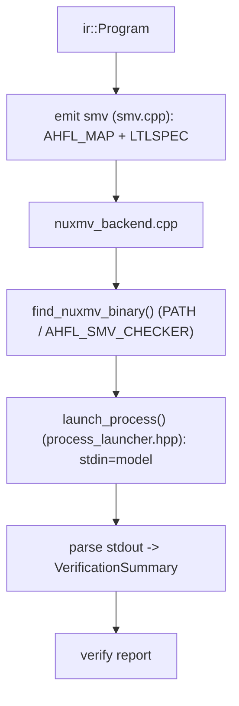
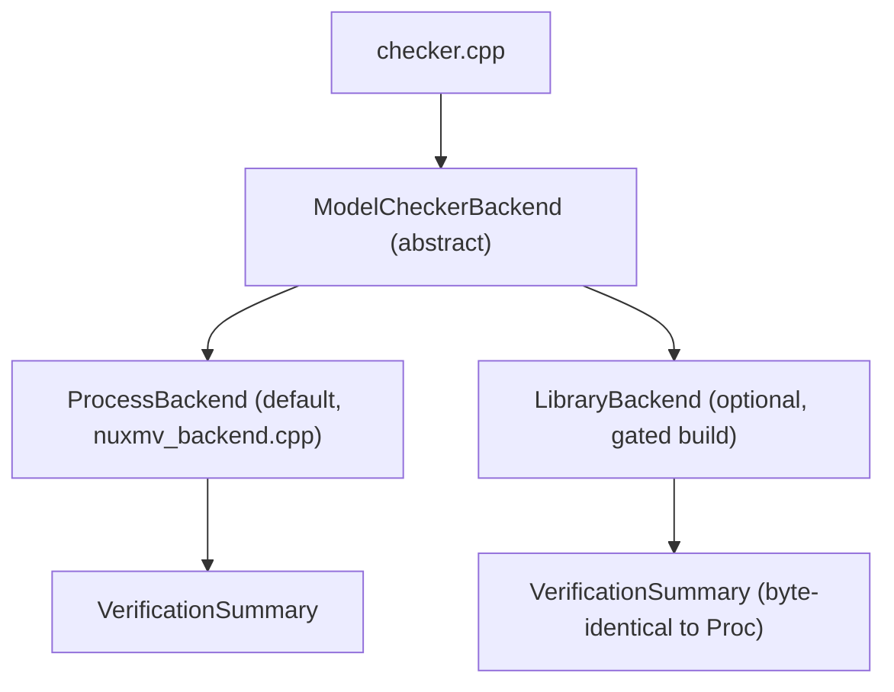

# RFC 0018: NuSMV Library-Mode Embedding

## Summary

评估并决策是否把 AHFL 的形式化验证从"外部 nuXmv/NuSMV 进程 seam"演进到"in-process
library-mode embedding"。当前 `src/verification/formal/nuxmv_backend.cpp` 通过
`find_nuxmv_binary()`（在 PATH / `AHFL_SMV_CHECKER` 查找二进制）+
`launch_process()`（`src/verification/formal/process_launcher.hpp`，替代 popen 的进程启动
seam）调用外部检查器，并把 SMV 模型经 stdin 传入、解析 stdout。本 RFC 定义 library-mode
的**接入契约、边界与可行性判定**——包括许可证/构建耦合分析、抽象接口保持
（`ModelCheckerBackend`，`src/verification/formal/model_checker_backend.hpp`）、以及为何
本 RFC 的结论倾向"保持进程 seam 为默认、library-mode 作为受限可选后端而非替换"。

## Motivation

外部进程 seam 已在 backlog（`docs/plans/issue-backlog-global-gaps.zh.md` §四）被记为
"NuSMV/nuXmv library-mode embedding：当前是外部进程 seam，library-mode 仍是研究项"。
进程模型有真实成本：

1. **启动开销**：每次 `verify` fork/exec 一个 nuXmv 进程，对大量小 workflow 的批量验证
   （LSP 实时反馈、CI 矩阵）累积可观。
2. **数据往返**：SMV 模型经 stdin 序列化、结果经 stdout 反序列化解析
   （`nuxmv_backend.cpp` 的 parse 逻辑），是文本层的脆弱边界——nuXmv 输出格式变化会打断
   parser（RFC/既有 fixture matrix 已在防这个）。
2. **诊断粒度**：进程只能给最终文本输出；library-mode 理论上能拿到结构化的中间状态
   （trace、bound、solver 统计）而不必解析文本。

但 library-mode 也有真实阻碍，本 RFC 的核心是**把这些阻碍量化成可决策的事实**，而不是
默认"embedding 一定更好"。不做这个决策，"要不要 embed nuXmv"会一直是模糊的研究项，
既不推进也不明确放弃。

## Goals

1. **明确抽象边界**：确认 `ModelCheckerBackend` 接口
   （`model_checker_backend.hpp` 的 `ModelCheckerCapabilities` / `ModelCheckerAvailability`
   / `VerificationSummary`）足以让 process-mode 与 library-mode 作为两个后端实现共存，
   调用方（`checker.cpp`）不感知底层是进程还是库。
2. **许可证与构建耦合分析**：判定把 nuXmv/NuSMV 作为库链接进 AHFL 是否与
   Apache-2.0（本项目 LICENSE）及"无外部运行时依赖（除 vendored ANTLR4）"原则
   （CLAUDE.md）相容——这是 go/no-go 的硬约束。
3. **接入契约**：若 library-mode 可行，定义它的可选构建开关、availability 三态
   （`Available` / `MissingBinary`→`MissingLibrary` / `VerificationUnsupported`）、以及与
   process-mode 完全一致的 `VerificationSummary` 输出，使二者对报告层无差别。
4. **确定性与 artifact 边界**：library-mode 的结果必须与 process-mode 字节级一致
   （同一 SMV 模型 → 同一 verdict / counterexample），不引入 wall-clock / host-path /
   pid 进入 artifact。
5. **给出结论性建议**：本 RFC 应产出一个明确的 go/no-go（含中间态"仅作受限可选后端"），
   而不是继续把它挂在研究列表。

## Non-Goals

1. **不移除 process seam**。无论 library-mode 是否落地，外部进程 seam 保持为默认路径
   （最兼容、无链接/许可证耦合）。
2. **不 vendor nuXmv 源码**。nuXmv 非开源可自由分发，本 RFC 不涉及把其源码纳入
   `third_party/`。
3. **不改变 SMV 模型的发射格式**。`emit smv` 的 `AHFL_MAP` / `LTLSPEC` 输出
   （`src/compiler/backends/smv/smv.cpp`）不变——library-mode 消费的是同一份 SMV 文本。
4. **不做 NuSMV 之外检查器（SPIN/TLA+）的 embedding**。它们当前是 emit-only
   （`model_checker_backend.hpp` 的 `ModelCheckerKind`），不在本 RFC 范围。
5. **不改变可用性/skip 语义的用户可见契约**。检查器不可用时的确定 skip 行为
   （`checker.cpp` 工具能力矩阵）保持不变。

## Design

### 当前进程 seam

### 抽象后端接口（已存在，是共存的关键）

`model_checker_backend.hpp` 已把检查器抽象为 capability + availability + summary 三组
结构。这意味着 process-mode 与 library-mode 天然可以是同一接口的两个实现，`checker.cpp`
只依赖抽象：

关键设计约束：`LibraryBackend` 的 `VerificationSummary` 必须与 `ProcessBackend` 对同一
SMV 模型**逐字段一致**。这是 library-mode 能作为可选后端而非分叉行为的前提，也是
Test Plan 的核心断言。

### 许可证与构建耦合（go/no-go 的硬约束）

本项目是 Apache-2.0，且 CLAUDE.md 明确"无外部运行时依赖（除 vendored ANTLR4）"。
nuXmv 的分发许可（非 OSI 开源，学术/评估许可）与"链接进发布二进制"存在根本张力：

- **静态链接**：几乎确定与 nuXmv 许可及本项目"无外部运行时依赖"原则冲突——no-go。
- **动态加载可选库（dlopen）**：AHFL 二进制不链接 nuXmv，用户自行提供共享库路径，
   AHFL 在运行时 `dlopen`——这把许可责任留在用户侧、AHFL 分发物不含 nuXmv 代码，
   可能相容。这是唯一可能的 library-mode 形态。
- **NuSMV（LGPL）** 而非 nuXmv：NuSMV 是 LGPL，动态链接相容性更好，但功能弱于 nuXmv
   （无 IC3/部分 BMC 增强）。若 library-mode 落地，NuSMV-via-dlopen 是更干净的候选。

**本 RFC 的倾向结论**：library-mode 只可能以"可选、dlopen、默认关闭、用户自备库"的形态
存在；静态链接 no-go。默认路径永远是 process seam。这把决策从"embed 还是不 embed"
收敛为"是否值得为边际性能收益维护一条 dlopen 可选后端"。

### 若落地：接入契约

- 可选构建开关 `AHFL_ENABLE_SMV_LIBRARY_MODE`（默认 OFF），OFF 时 `LibraryBackend`
   不编译，零耦合。
- availability 扩展 `MissingLibrary` 态（库路径未提供/`dlopen` 失败）→ 与 `MissingBinary`
   同款确定 skip。
- `AHFL_SMV_LIBRARY` 环境变量/CLI flag 指定共享库路径；未指定则退回 process-mode。
- 输出经同一 `VerificationSummary`，报告层无感知。

## User Impact

- **默认无变化**：process seam 仍是默认，用户不装库则行为完全不变。
- 若 library-mode 落地且用户显式启用：批量 `verify` 更快、诊断更结构化，但需自备 nuXmv/
   NuSMV 共享库并自担许可责任。
- 若结论是 no-go：backlog 的"library-mode 研究项"被明确关闭为"经分析决定不做"，不再是
   悬而未决的模糊项——这本身是有价值的用户可见结论（文档明确说明为何用进程 seam）。

## Compatibility and Migration

**非 breaking。** process seam 保持默认；library-mode（若落地）是默认关闭的可选后端，
不改变任何现有用户的行为、SMV 发射格式、或报告契约。

- 无 artifact 格式变化：SMV 模型文本不变，`VerificationSummary` 结构不变。
- 若结论为 no-go：无代码变更，只在 `docs/reference/` 与本 RFC 记录决策依据。
- 若结论为可选后端：新增一个默认 OFF 的构建开关；不影响不启用它的构建。

## Implementation Plan

本 RFC 的第一产出是**决策**，其次才是可选实现。切片：

1. **许可证/构建可行性调研**（无代码）：确认 nuXmv/NuSMV 许可与 Apache-2.0 + dlopen
   形态的相容性；产出 go/no-go/limited 结论并更新本 RFC Decision History。
2. **接口对齐验证**（若 go/limited）：确认 `ModelCheckerBackend` 抽象无需为 library-mode
   改形状；补齐 availability 的 `MissingLibrary` 态。
3. **LibraryBackend 骨架**（gated on `AHFL_ENABLE_SMV_LIBRARY_MODE`，默认 OFF）：dlopen
   seam + 与 process-mode 一致的 `VerificationSummary` 组装。
4. **一致性测试**：见 Test Plan。
5. **文档**：`docs/reference/` 记录 process vs library 的选择与许可注意事项。

若第 1 步结论为 no-go，则只执行"文档记录决策"，其余切片作废。

## Test Plan

- **单元**（`tests/unit/verification/formal/`）：`ModelCheckerBackend` 接口对 process 与
   library 两个实现的多态调用；availability 三/四态判定。
- **一致性（黄金）**：同一 SMV 模型分别经 process-mode 与 library-mode 验证，断言
   `VerificationSummary` 逐字段一致（verdict / bound / counterexample）。这是 library-mode
   可信的核心 gate。
- **工具缺失（反向）**：库路径未提供 / `dlopen` 失败 → 确定 `MissingLibrary` skip，
   退出码与 `MissingBinary` 一致，绝不伪造 verdict。
- **回归**：`ctest --preset test-dev -L v0.59-formal-integration`；默认（OFF）构建的现有
   nuXmv process 测试无回归。
- **确定性**：library-mode 结果无 wall-clock / host-path 泄漏进 artifact。

## Rollout and Stabilization

1. `draft` → `review`：完成许可证可行性调研（Open Questions 清零），formal + tooling
   owner sign-off，给出 go/no-go/limited 明确结论。
2. 若 no-go：直接进 `accepted`（决策=不实现），文档记录后 `implemented`（决策落文档即完成）。
3. 若 limited：`accepted` 后按 Implementation Plan 实现可选后端。
4. `stabilized`：`docs/reference/` 与 spec 反映最终决策。

## Alternatives

1. **静态链接 nuXmv 进发布二进制**：性能最优、无 dlopen 复杂度，但几乎确定违反 nuXmv
   许可与本项目"无外部运行时依赖"原则。**失败原因**：许可 + 原则双重 no-go。
2. **保持纯 process seam，不做任何 embedding**：零许可风险、零维护增量。代价是放弃
   library-mode 的性能/诊断收益。**这实际上是本 RFC 倾向的默认结论**——除非调研证明
   dlopen 可选后端的收益值得其维护成本。列为 alternative 是因为它可能就是最终决策。
3. **自研/vendor 一个开源模型检查器替换 nuXmv**：彻底摆脱许可问题，但重写一个成熟度
   接近 nuXmv 的检查器是巨大工程,远超 embedding 的收益。**失败原因**：投入产出比
   不成立;RFC 0017 的 SMT-BMC 已在为数据谓词提供自研验证路径,时序部分继续依赖成熟
   外部工具更务实。

## Open Questions

1. nuXmv 当前分发许可的确切条款（能否 dlopen 而不违反）？NuSMV 的 LGPL 是否是更干净的
   library-mode 载体？——这是 go/no-go 的决定性调研项。
2. dlopen 形态下,nuXmv/NuSMV 是否暴露稳定的 C API 供 in-process 调用,还是只有 CLI/
   交互式接口(若只有后者,library-mode 无从谈起)？
3. 边际性能收益的量化：批量 verify 中进程启动开销占比多少?若 <10%,可选后端的维护
   成本可能不划算。
4. 若结论 limited,`MissingLibrary` 与 `MissingBinary` 是否合并为单一 "checker
   unavailable" 态以简化报告？

## Decision History

- 2026-08-24: Draft opened.
