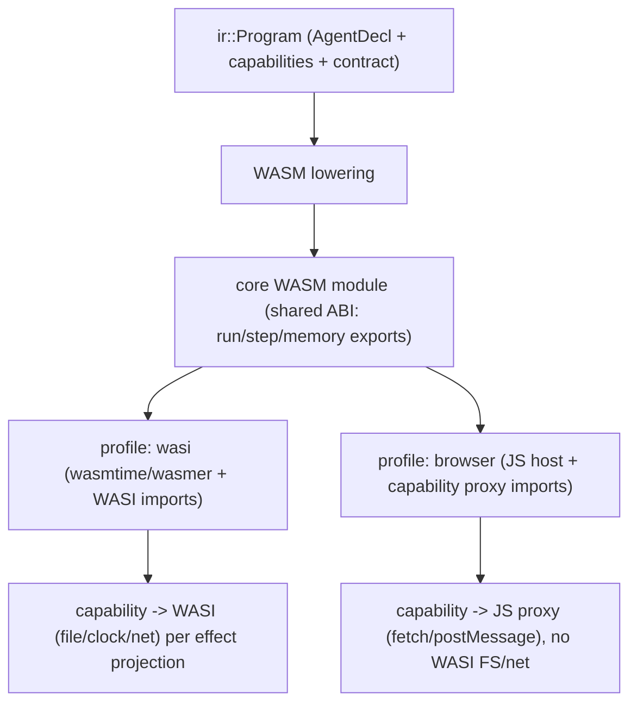

# RFC 0019: WASM Backend Runtime Model

## Summary

为 AHFL 的 WASM 后端定义 **runtime model**：WASM 模块与 host 的执行契约、AHFL capability
到 WASI / host import 的映射、以及 browser-side 执行边界。当前 WASM 后端
（`src/compiler/backends/infra/wasm_backend.cpp`）只发射一个**结构性 WAT 骨架**——
`emit_wat_header` 声明 `$state_fn`/`$cap_fn` 类型、线性内存、`$current_state` 全局，
`emit_wat_state_table` 展开状态表，`generate_wasm` 从 `WasmAgentConfig`（agent 名 / 状态 /
迁移 / capability 名字符串）产出 WAT。`wasm_runtime.hpp` 已有 `WasiCapability` 枚举
（FileRead/FileWrite/NetworkAccess/EnvironmentVars/ClockAccess）+ `WasiConfig` +
`WasmRuntimeConfig`（内存页/栈深上限）——但**这些结构与 AHFL 的 capability 语义、runtime
执行引擎、以及 agent 的 input/output/context 数据流没有任何连接**。本 RFC 定义把 WASM
从"状态图 WAT 骨架"提升为"可执行 agent runtime"所需的模型决策,并明确 browser 边界。

## Motivation

backlog（`docs/plans/issue-backlog-global-gaps.zh.md` §3.6 与 §四）列出两项相关未决：
"为 WASM backend 定义 runtime model、WASI/capability mapping、browser-side execution
boundary",以及"浏览器端 Online Playground：WASM backend 有基础,playground product path
未证明"。

当前 WASM 后端的根本缺口是**它不是一个 runtime,而是一张状态图的 WAT 渲染**:

1. **capability 是字符串,不是调用契约**：`WasmAgentConfig.capabilities` 是
   `vector<string>`,`$cap_fn` 是 `(func (param i32) (result i32))` 的空类型声明——
   没有定义一个 AHFL capability（HTTP/LLM/gRPC,见 `src/runtime/engine/capability_bridge.hpp`
   的 `CapabilityInvocationContext`）如何映射为一个 WASM host import,如何传递结构化
   input/output,如何 fail closed。
2. **数据流缺失**：WAT 骨架有 `$current_state` 全局和线性内存,但没有定义 agent 的
   `input`/`context`/`output`（结构化 `Value`,见 `src/runtime/evaluator/`）如何在线性内存
   中布局、如何与 host 交换。
3. **WASI 映射悬空**：`WasiCapability` 枚举存在,但没有定义哪个 AHFL capability 对应哪个
   WASI 能力,以及 AHFL 的 capability gating / effect 系统如何投影到 WASI 的能力沙箱。
4. **browser 边界未定义**：`NetworkAccess` 在 WASI 与在 browser（fetch/CORS 沙箱）语义
   完全不同;playground 的执行边界（无文件系统、无真实网络、capability 需 host-side
   代理）从未定义。

不做这个决策,WASM 后端永远是"能 `emit wasm` 出一段跑不了真实 agent 的 WAT",Online
Playground 无从落地。

## Goals

1. **定义 WASM ↔ host 执行契约**：一个编译出的 agent WASM 模块导出什么函数
   （`run`/`step`/`current_state`）、导入什么 host 函数、线性内存中 input/context/output
   的布局与所有权。
2. **定义 capability → host import 映射**：每个 AHFL capability 编译为一个 WASM import;
   结构化参数/返回值经线性内存 + 长度前缀（或 host 提供的 alloc）交换;capability 失败
   在 WASM 侧 fail closed,与 native runtime 的 `CapabilityCallResult` 语义一致。
3. **定义 WASI capability 映射与 effect 投影**：把 AHFL effect 系统 / capability gating
   （`include/ahfl/compiler/semantics/effect_judgement.hpp`）投影为 `WasiConfig`
   的能力子集——一个只需 `ClockAccess` 的纯 agent 不获得 `NetworkAccess`。
4. **定义 browser 执行边界**：browser 目标下无 WASI 文件系统/真实网络;所有 capability
   经 host-side JS 代理(fetch/postMessage);playground 的确定性执行契约(无 wall clock 泄漏
   进 artifact)。
5. **明确两个部署 profile**：`wasi`(命令行 wasmtime/wasmer,有 WASI)与 `browser`
   (JS host,无 WASI,capability 走 JS 代理),二者共享模块 ABI、profile 化 host import 集。
6. **与既有 native runtime 语义对齐**：WASM 执行的可观察行为(状态迁移序列、capability
   调用、output)必须与 native `WorkflowRuntime`(`src/runtime/engine/workflow_runtime.cpp`)
   对同一 agent 一致,以便 WASM 是"另一个执行目标"而非"另一套语义"。

## Non-Goals

1. **不做完整的 WASM 代码生成器**。本 RFC 定义 runtime model 与 ABI 契约;把完整
   AHFL evaluator 语义 lower 到 WASM 指令是后续大工程,本 RFC 只定契约与边界。
2. **不实现 Online Playground 产品**。playground 是 §四 的独立冻结项;本 RFC 只定义它
   依赖的 browser 执行边界,不建 UI/托管。
3. **不引入新的 WASM 运行时依赖到核心构建**。WASM 是可选 emit 目标;wasmtime/wasmer/
   浏览器由用户提供,不进 `third_party/`。
4. **不改变 native runtime 语义**。WASM 是 native 语义的另一个执行目标,`WorkflowRuntime`
   行为不变。
5. **不做 WASM 组件模型(Component Model / WIT)**。初期用 core WASM + 手写 import 契约;
   Component Model 作为 Open Question 的未来方向。
6. **不定义 capability 的 host 实现**。host 如何真正执行 HTTP/LLM 是 host 侧的事;本 RFC
   只定义 WASM↔host 的 import 边界契约。

## Design

### 两个部署 profile,共享模块 ABI



模块 ABI 是 profile 无关的;差异只在 host import 集与 capability 绑定方式。

### WASM ↔ host 执行契约

编译出的 agent 模块导出稳定 ABI:

- `(memory (export "memory"))` — 线性内存(已存在于 `emit_wat_header`)。
- `(func (export "run") (param i32 i32) (result i32))` — 传入 input 的 (ptr,len),
   执行 agent 到 final 状态,返回 output 的 (ptr) / 错误码。
- `(func (export "step") (result i32))` — 单步迁移(供 DAP/playground 步进,复用 RFC 0015
   的调试语义)。
- `(func (export "current_state") (result i32))` — 当前状态 index(映射回 AHFL 状态名)。
- `(global (export "transition_count"))` — quota 计数(已存在),对齐 native 的 agent quota。

input/context/output 作为长度前缀的序列化 `Value`(复用 `value_json` 或一个紧凑二进制
编码,见 Open Questions)布局在线性内存;所有权契约:host 写 input、WASM 写 output、
双方经导出的 alloc 协商内存。

### capability → host import 映射

每个 agent 用到的 AHFL capability 编译为一个 WASM import,类型统一:

```
(import "ahfl_cap" "<capability_symbol>" (func (param i32 i32) (result i32)))
```

- 参数 (ptr,len) 指向线性内存中序列化的 capability 参数;返回值 (ptr) 指向序列化结果
   或错误。import 名按 capability 的 `SymbolId` 稳定生成(索引式身份),不用源名做规范身份。
- **fail closed**：capability import 返回错误码时,WASM 侧终止 agent 并传播错误,语义
   对齐 native 的 `CapabilityCallResult`（`capability_bridge.hpp`）——WASM 不得静默吞掉
   capability 失败。
- host 侧(wasi profile 的 wasmtime embedder / browser profile 的 JS)提供这些 import 的
   真实实现;本 RFC 只定 import 边界签名。

### WASI capability 映射与 effect 投影

AHFL 的 effect 系统 / capability gating 决定一个 agent 需要哪些 WASI 能力:

| AHFL 能力来源 | WASI 投影 | browser 投影 |
| --- | --- | --- |
| 纯 agent(effect Pure) | 无 WASI 能力 | 无代理 import |
| clock/时间读取 | `ClockAccess` | JS `Date` 代理(确定性模式可注入固定时钟) |
| HTTP/network capability | `NetworkAccess`(受限 preopen) | JS `fetch` 代理(受 CORS) |
| 文件读写 capability | `FileRead`/`FileWrite`(preopen dirs) | 不支持(browser 无 FS)→ 编译期诊断 |

投影规则:`WasiConfig.allowed_capabilities` 由 agent 的 effect judgement 静态推导,而非
用户手填——只授予 agent 实际需要的能力(最小权限,对齐 capability gating)。一个 agent
在 browser profile 下用了 FS capability → 编译期确定诊断,而非运行时失败。

### browser 执行边界

browser profile 的硬约束:

- **无 WASI**：不导入 `wasi_snapshot_preview1`;所有 host 交互经命名的 `ahfl_cap` import
   由 JS 实现。
- **无真实文件系统/网络**：网络经 `fetch`(受 CORS/CSP),文件 capability 编译期拒绝。
- **确定性**：playground 执行不得把 wall clock / 随机 / host 信息泄漏进可持久化的执行
   trace(对齐 artifact 确定性边界);时钟 capability 在确定性模式下由 host 注入固定值。
- **调试**：`step`/`current_state` 导出支持 playground 步进,复用 RFC 0015 的 DAP 调试
   语义(状态迁移级,而非指令级)。

## User Impact

- `ahflc emit wasm` 从"状态图 WAT 骨架"演进为"带明确 host ABI 与 capability import 契约
   的可执行模块"(渐进,本 RFC 定契约,codegen 后续 RFC/实现)。
- 用户能把 agent 编到两个 profile:`wasi`(命令行 wasm runtime)与 `browser`(JS host)。
- effect 系统直接决定 WASM 模块的能力足迹——纯 agent 产出零能力模块,用网络的 agent
   显式声明 `NetworkAccess` import,最小权限可审计。
- browser 下用了不支持的 capability(如文件 FS)→ 编译期确定诊断,而非运行时炸。
- 为 Online Playground 提供了明确的执行边界契约(playground 本身仍是独立冻结项)。

## Compatibility and Migration

**非 breaking。** WASM 是可选 emit 目标;native runtime 语义、`emit` 其他目标、以及
不使用 WASM 的用户完全不受影响。

- 当前 `emit wasm` 输出的 WAT 骨架格式会演进为带 ABI 契约的形态——但 WASM 输出尚未
   作为稳定 artifact 承诺(stability: experimental),此演进不构成对稳定契约的 breaking。
- `WasmAgentConfig` / `WasmRuntimeConfig`（`wasm_runtime.hpp`）会扩展以携带 capability
   import 与 effect 投影信息;这些是内部结构,非用户 API。
- 无 native runtime / 其他 backend 的行为变化。

## Implementation Plan

本 RFC 优先产出**模型与 ABI 契约决策**;codegen 实现按契约分片:

1. **ABI 契约定义**（`wasm_runtime.hpp` + 文档）：导出/导入函数签名、线性内存布局、
   input/context/output 序列化格式。无行为变更,纯契约。
2. **effect → WASI 投影**（`src/compiler/backends/infra/wasm_runtime.cpp` + 消费
   `effect_judgement`）：从 agent effect judgement 静态推导 `WasiConfig`;最小权限。
3. **capability import 生成**（`wasm_backend.cpp`）：每个用到的 capability 发射
   `ahfl_cap` import(按 `SymbolId` 命名),类型统一。
4. **browser profile 诊断**：browser profile 下不支持的 capability(FS)→ 编译期
   确定诊断。
5. **profile 化 emit**（`src/compiler/backends/driver.cpp` + CLI）：`emit wasm --profile
   wasi|browser`。
6. **一致性框架**（后续,依赖 codegen）：WASM 执行的可观察行为 vs native runtime 的
   等价性测试骨架。
7. **测试**：见 Test Plan。

Codegen 的完整 lowering（AHFL evaluator 语义 → WASM 指令）超出本 RFC,是后续工作;本
RFC 让契约先落地。

## Test Plan

- **单元**（`tests/unit/compiler/backends/`）：effect judgement → `WasiConfig` 投影
   (纯 agent → 空能力;网络 agent → NetworkAccess);capability import 名从 `SymbolId`
   确定性生成。
- **Golden 正例**：一个 agent `emit wasm --profile wasi` 与 `--profile browser` 的输出
   golden;断言 ABI 导出(`run`/`step`/`current_state`/`memory`)存在、capability import
   按契约命名。
- **Golden 负例**：browser profile 下用文件 capability → 确定编译期诊断。
- **确定性**：同一 agent 两次 `emit wasm` 字节一致(无 wall clock/host path)。
- **一致性(后续,依赖 codegen)**：WASM 执行的状态迁移序列 / capability 调用序列 / output
   与 native `WorkflowRuntime` 对同一 agent 一致。本 RFC 阶段先建断言骨架。
- **回归**：`ctest --preset test-dev`;现有 `emit wasm` / target-backends 测试
   (`tests/unit/compiler/backends/target_backends.cpp`)无回归。

## Rollout and Stabilization

1. `draft` → `review`：Open Questions 清零(序列化格式、Component Model 取舍、确定性
   时钟注入),runtime + compiler owner sign-off。
2. `accepted` 后按 Implementation Plan 落地 ABI 契约 + effect 投影 + capability import +
   profile 化 emit。
3. `implemented`：契约、投影、import 生成、profile emit、契约级测试落库(完整 codegen
   可为后续 RFC)。
4. `stabilized`：`docs/spec/` 或 `docs/reference/` 定义 WASM ABI 契约;WASM 输出若承诺
   稳定则标记 stable-artifact;Online Playground 可据此边界推进。

## Alternatives

1. **直接用 WASM Component Model + WIT 定义 capability 边界**：Component Model 是 WASM
   的未来标准接口,WIT 能优雅描述 capability 的结构化类型。但工具链尚新、浏览器支持
   不完整、且引入额外的 WIT 生成/绑定复杂度。初期用 core WASM + 手写 (ptr,len) import
   契约更可控。**失败原因**:成熟度与浏览器支持不足;列为 Open Question 的未来方向。
2. **只做 wasi profile,放弃 browser**：wasmtime + WASI 是最成熟的 WASM 执行环境,只支持
   它能大幅简化(直接用 WASI 文件/网络)。但 backlog 的核心动机是 Online Playground,
   那必然是 browser 目标;只做 wasi 等于不解决实际需求。**失败原因**:不满足 playground
   这一主要 use case。
3. **不做 WASM runtime model,保持 WAT 骨架为文档/演示用途**：承认 WASM 只是"能看的
   状态图渲染",不追求可执行。省掉全部工作,但等于放弃 WASM 作为真实执行目标与
   playground 的可能。**失败原因**:放弃 backlog 明确列出的产品方向;且当前 WAT 骨架
   已存在,不定义 runtime model 它就是永久的死代码。

## Open Questions

1. input/context/output 的线性内存序列化格式:复用 `value_json`(文本,简单但慢/大)还是
   定一个紧凑二进制编码(快/小但需维护一个 ABI 契约)?
2. 内存所有权/分配协商:模块导出 `alloc`/`free` 让 host 在 WASM 内存中写 input,还是
   host 提供 import 让 WASM 回调分配?
3. 确定性时钟/随机的注入机制:确定性模式下 `ClockAccess` 由 host 注入固定值的具体
   契约(每次 step 递增?固定?)。
4. Component Model / WIT 迁移路径:何时从手写 core WASM import 迁到 WIT?是否本 RFC
   预留 hook。
5. capability 的异步性:HTTP/LLM capability 本质异步,core WASM 是同步调用——browser
   profile 下如何处理(host 侧 block?Asyncify?JSPI?)。这可能显著影响 ABI。
6. WASM 执行与 native runtime 的一致性验证深度:逐状态迁移一致,还是也要求 capability
   调用参数/返回值一致?后者更强但更难。

## Decision History

- 2026-08-24: Draft opened.
