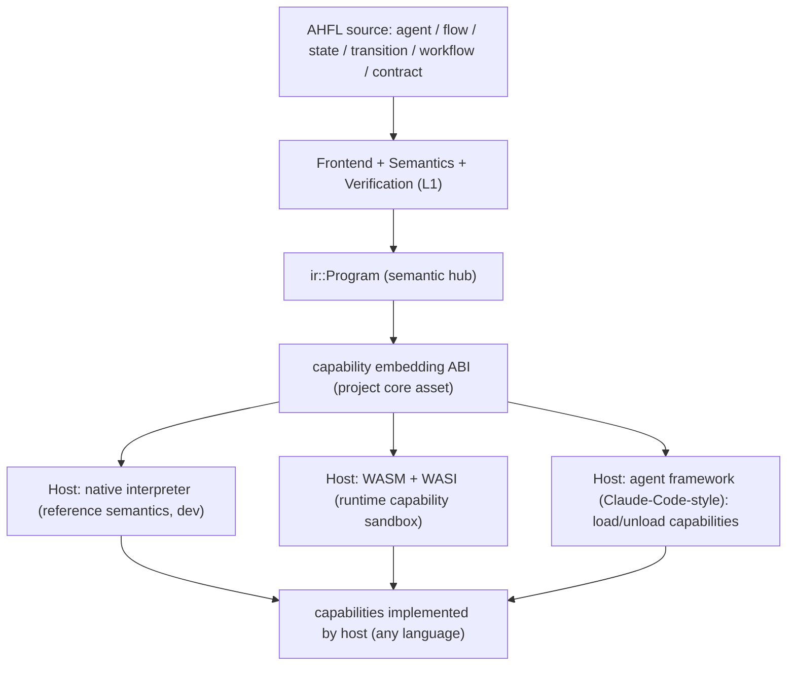
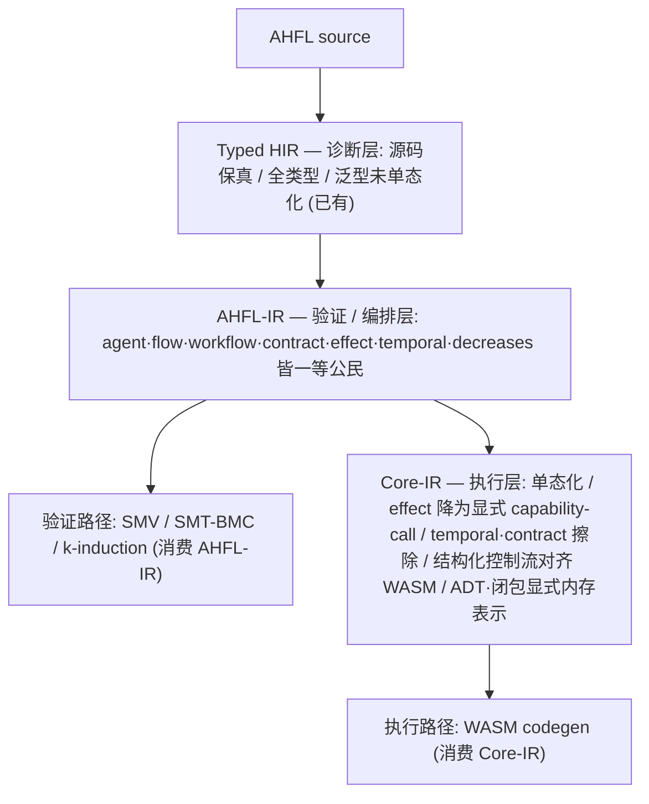

# RFC 0020: AHFL Strategic Positioning — Embeddable Verifiable Agent-Workflow DSL

## Summary

本 RFC 是一份**定位型(positioning)决策**,不引入代码。它为 AHFL 确立一个北极星
定位,供后续所有技术决策(默认执行目标、语言表达力边界、`RFC 0013` 走多远、
capability ABI 演进)对齐:

> **AHFL 是一门可嵌入(embeddable)、可验证(verifiable)的 agent workflow 编排 DSL。
> 它编排 multi-agent workflow 的结构与行为,但**不自己实现底层通用计算能力**——能力由
> 宿主(host,用任意语言实现:C++/Java/JS/…)经一条 **capability 嵌入边界(capability
> embedding ABI)** 提供。AHFL 可嵌入多种宿主:原生解释器(参考语义/开发)、WASM+WASI
> (运行时权限沙箱)、以及 Claude-Code 式的 agent 框架(把宿主的能力当 capability 调用、
> 可模块化装卸)。**

定位锚点:AHFL 之于 agent 时代,如 **Lua 之于游戏引擎/Nginx**、**eBPF 之于 Linux
内核**、**SQL 之于数据库**——一门窄而标准、嵌入宿主、能力由宿主提供、且(像 eBPF 一样)
加载/执行前可被验证的编排语言。

## Motivation

AHFL 已实现的能力面很宽(12 个 emit 目标、SMV + SMT-BMC 形式化验证、原生执行、capability
gating),但**项目缺少一份被记录的定位决策**。这导致一系列反复出现、无锚可依的问题:

1. **默认执行/部署目标是什么?** WASM 该不该是默认?(见 [RFC 0019](0019-wasm-runtime-model.zh.md))
2. **各 emit 目标(K8s CRD / Terraform / OpenAPI)在产品里是核心还是边角?**
3. **AHFL 是不是要长成通用编程语言?** 能不能"写一个 Claude Code"?
4. **表达力边界在哪?** "编排 workflow" 与 "节点内通用计算" 的分界在哪?

这些问题反复消耗讨论,且没有共同的判据。`docs/design/architecture-overview.zh.md` 已经
给出一条关键的架构判断——"L1 是本体……业务层可以替换或砍掉(**换 provider、换部署
目标**),L1 语义不受影响"——但它描述的是**分层**,不是**定位**:它没回答"AHFL 对谁
不可替代、凭什么"。不确立定位,上述问题会持续以"每次重新拍脑袋"的方式消耗决策带宽,
且有把 AHFL 推向"什么都能做但没有一件必须用它"的通用语言坟场的风险。

## Goals

1. **确立 AHFL 的定位陈述**:可嵌入、可验证的 agent workflow 编排 DSL;能力由宿主经
   capability 边界提供;多宿主。作为项目北极星。
2. **确立表达力边界(A 型 vs B 型)**:workflow **建模**表达力(状态/迁移/契约/handoff/
   multi-agent 编排)无上限;节点内**通用计算**(任意算法/IO/数据结构)留在 capability
   边界之外,由宿主实现。这是 AHFL 保持"可验证"与"不打通用语言生态战"的护栏。
3. **把 capability 嵌入 ABI 确立为项目核心资产**,而非某个后端的实现细节。[RFC 0019](0019-wasm-runtime-model.zh.md)
   的 `ahfl_cap` import 契约 + effect→WASI 投影是这条边界的第一个具体实例。
4. **为每个现有 target/后端归位**:原生=参考宿主,WASM+WASI=沙箱宿主,K8s/Terraform/
   OpenAPI=部署视图,SMV/SMT=验证产物,IR-JSON/NativeJson=交换格式。
5. **给后续 RFC 提供判据**:任何新特性提案都能用本定位回答"它增强的是 A 型编排表达力
   还是把 AHFL 推向 B 型通用语言"。

## Non-Goals

1. **不引入任何代码或语言特性**。本 RFC 是定位决策;具体的 embedding ABI、宿主 SDK、
   codegen 由后续实现型 RFC 承载。
2. **不把 AHFL 定义为通用编程语言**。明确拒绝"AHFL 要能写任意系统程序(如实现一个
   Claude Code 本体)"这一方向。
3. **不废弃或改变任何现有能力**。原生运行时、形式化验证、现有 emit 目标语义不变;本
   RFC 只是给它们一个统一的定位坐标。
4. **不选定唯一"默认宿主"**。AHFL 是多宿主的(如 Lua);"默认 target"这一问法被本定位
   溶解——由具体使用场景选择宿主,而非语言钦定单一默认。
5. **不定义 embedding ABI 的具体字节格式**。那是 [RFC 0019](0019-wasm-runtime-model.zh.md)
   与后续宿主 ABI RFC 的事;本 RFC 只确立"它是核心资产"这一定位。

## Design

### 定位模型:嵌入式编排 DSL

AHFL 负责 IR 左侧的一切(编排结构、类型、契约、验证);capability embedding ABI 是
中枢边界;宿主提供右侧的能力实现。**同一份 AHFL workflow 可嵌入不同宿主**,差异只在宿主
提供的能力集与执行环境。

### 表达力边界:A 型(编排)无上限,B 型(通用计算)在边界外

| 维度 | A 型:workflow 建模表达力 | B 型:通用计算表达力 |
| --- | --- | --- |
| 内容 | 状态机、迁移、类型化数据流、capability 声明、契约、multi-agent handoff、动态 workflow 编排 | 任意循环/递归、可变数据结构、裸 IO、字符串处理库、系统调用 |
| 归属 | **AHFL 语言核心,无上限做强** | **capability 边界之外,由宿主实现** |
| 对可验证性 | 天然可分析(结构化构造) | 会破坏全局可判定性 |
| 类比 | eBPF 的编排逻辑 / SQL 的查询结构 | eBPF helper / 数据库存储引擎 |

一个 workflow 节点若需要"读任意文件、正则解析、自定义数值计算",AHFL 的答案是把它声明为
一个 **capability**(宿主实现),而不是在 AHFL 里长出通用计算。这条护栏是 AHFL 能同时
"通用地编排"与"保持可验证 + 不打生态战"的原因。它与 `docs/spec/core-language.zh.md`
§4.6 的 effect 分级、§5.6 的可验证子集一致:`capability` 是唯一的外部效应入口。

### capability 嵌入 ABI 是项目核心资产

嵌入式语言的成败取决于宿主接口(Lua 的 `lua_State` + C API、eBPF 的 helper ABI、WASM 的
import 契约)。AHFL 的对应物是 **capability embedding ABI**,其第一个具体实例已由
[RFC 0019](0019-wasm-runtime-model.zh.md) 落地:

- `ahfl_cap` import 契约:capability 按 `SymbolId`(索引式身份)命名、统一签名
  `(ptr,len) -> ptr`、fail-closed(二进制发射器
  `src/compiler/backends/wasm/core_wasm_codegen.cpp` 直接生成 import 段)。
- effect→宿主权限的最小权限思想:RFC 0019 曾实现为 effect→WASI 文本投影
  (`project_wasi_config`);该投影随 RFC 0019 WAT 路径于 2026-09-29 删除,效应分级
  本身仍由下面的 `CapabilityEffectKind` 向宿主声明。
- capability effect 分级(`read` / `external_side_effect` / `durable_write` /
  `financial_write`,见 `include/ahfl/compiler/ir/decl.hpp` 的 `CapabilityEffectKind`):
  向宿主声明每个能力的风险等级。

本 RFC 把这条边界从"WASM 后端细节"重新归位为"**AHFL 作为嵌入式语言的宿主接口标准**"——
项目最重要的资产之一。

### 现有 target/后端的定位归位

| target/后端 | 定位角色 | 状态 |
| --- | --- | --- |
| WASM + WASI | **唯一执行引擎**:可移植 + 运行时权限隔离(wasmtime / 浏览器) | ABI 契约已定([RFC 0019](0019-wasm-runtime-model.zh.md)),codegen 待做 |
| 原生 tree-walking evaluator(`WorkflowRuntime`) | **过渡期唯一执行器**:WASM codegen 验收通过后原子删除(见下「架构北极星」) | 现役,计划退役 |
| SMV / SMT-BMC | **验证产物**:证明契约([RFC 0017](0017-bmc-contract-semantics.zh.md)) | stabilized / implemented |
| K8s CRD / Terraform / OpenAPI | **部署视图**:把 workflow 结构投影为运维配置 | 结构骨架,深度待补 |
| IR-JSON / NativeJson / ExecutionPlan | **交换格式**:交给下游宿主/工具 | 现役 |

### 架构北极星:定位如何在编译器结构里落地

前面几节确立了**定位**(可嵌入、可验证、多宿主、计算留宿主);本节确立**架构北极星**
——把该定位映射为编译器内部结构的目标形态,作为后续实现型架构 RFC(IR 塔与执行模型、
query 化前端)对齐的判据。它回答的是"用什么结构才能既可验证、又能高效嵌入多宿主",
而非任何具体字节格式或代码。

**这是一次自上而下的重构想:当前的单层 IR 与 tree-walking 执行器被显式判定为过渡形态。**
参照系(按 `AGENTS.md` 优先级):Rust(HIR→THIR→MIR→LLVM 的 IR 塔与单态化 MIR)、
Swift(SIL 的 raw/canonical 分相)、GHC(Core→STG→Cmm 的极小核心)、Dafny(验证路径
与执行路径分叉)、CompCert(逐层 lowering 的语义保持)。

#### 北极星一:IR 塔(purpose-built IR tower),取代当前单层 IR

顶尖编译器没有单层 IR。AHFL 目标形态是三层塔,每层只服务一个"海拔(altitude)":

- **Typed HIR(诊断层)**:源码保真、全类型、泛型未单态化;所有面向用户的诊断住这层
  (已存在,`include/ahfl/compiler/semantics/typed_hir.hpp` 一线)。
- **AHFL-IR(验证 / 编排层)**:AHFL 的独特价值层。agent 状态机、flow、workflow DAG、
  contract、effect、temporal 算子、decreases 度量都是**一等公民**。SMV/SMT/BMC 验证后端
  消费这一层。当前 `ir::Program` 大致对应此层的职责,但混入了执行细节——需净化。
- **Core-IR(执行层)**:单态化后、effect 降为显式 capability-call、temporal/contract
  **擦除**(验证已在上层完成)、控制流结构化以对齐 WASM 的 block/loop region、ADT 与闭包
  拥有显式内存表示。执行后端(WASM codegen)与调试消费这一层。
- **路径分叉(Dafny 式)**:**验证路径消费 AHFL-IR,执行路径消费 Core-IR。** temporal /
  contract 不污染执行层;单态化 / 内存布局不污染验证层。这解决了当前单层 IR 的
  altitude 冲突——今天 temporal 节点(只有验证关心)与执行节点挤在同一个 variant 里,
  逼每个后端"处理或显式拒绝"自己根本不消费的节点。

#### 北极星二:执行模型——WASM 是唯一执行引擎,不自研 VM

- **WASM(+WASI)是唯一执行引擎**:消费 Core-IR,capability 调用降为 `ahfl_cap` import
  (复用 [RFC 0019](0019-wasm-runtime-model.zh.md) 已定契约),用成熟宿主(wasmtime /
  浏览器)执行。**不自研虚拟机**——WASM 生态(引擎、沙箱、调试、组件模型)比任何自研
  字节码 VM 成熟,自研 VM 是"用数倍工作量换更差结果"。这与"多宿主"定位一致:WASM 是
  可移植沙箱宿主,而 embedding ABI 仍允许原生宿主经 C ABI 承载 capability。
- **当前 tree-walking evaluator 是过渡形态,不是最终架构**:它现役、是唯一执行器,但一旦
  WASM codegen(Core-IR → 真 WASM)落地并通过 conformance 验收,**tree-walking evaluator
  被原子删除,一行不留**。AHFL 只有一家实现、只需一条执行语义与一条执行路径;长期共存
  第二个执行引擎既非正统,也违反 `AGENTS.md` Principle 1(禁止"just in case"死代码)。
  codegen 正确性由 conformance 测试套件 + AHFL 自身的语义保持验证(CompCert 式,长期
  可选)保证,**而非**靠养一个慢解释器做差分基准。退役是**目标**,只是不在替代品就绪前
  先删。

#### 北极星三:backend / target 分类学(各消费 IR 塔的哪一层)

| 类别 | 成员 | 消费层 | 角色 |
| --- | --- | --- | --- |
| **执行后端** | WASM codegen | Core-IR | 唯一执行引擎(生产 + 开发内循环) |
| **验证后端** | SMV / SMT-BMC / k-induction | AHFL-IR | 证明契约 / 可验证子集 |
| **视图后端** | K8s CRD / Terraform / OpenAPI | AHFL-IR(编排结构投影) | 部署 / 接口视图,非执行 |
| **交换格式** | IR-JSON / NativeJson / ExecutionPlan | 对应层的机器可读投影 | 下游宿主 / 工具消费 |

分类学的判据:**执行后端消费 Core-IR(擦除了验证专属构造),验证与视图后端消费 AHFL-IR
(保留编排 / 契约 / temporal 语义)。** 这让"该后端消费哪一层"成为架构约束,而非惯例。

#### 北极星四:query 化前端 + IR 单一真相源

- **query-based / demand-driven 前端(salsa 式)**:顶尖 IDE(rust-analyzer / Roslyn /
  rustc)的前端都是**带缓存、按需求值、自动失效**的 query 图,而非"从头跑到尾的 pass
  流水线"。AHFL 目标是把前端建成 query 系统,使 **LSP 的增量、缓存、亚秒级响应成为架构
  自然产物**,而不是像今天 `src/tooling/incremental/` 那样在流水线外**手工模拟**依赖图与
  失效。[RFC 0016](0016-incremental-cache-contract.zh.md) 的 cache contract 是这条路上
  已落地的一块,但目标是让整个前端都 query 化。
- **IR 节点单一真相源(single source of truth)**:当前每新增一个 IR 节点要手改约 8 处
  (analysis / ir_print / verify / ir_json / opt_lower / visitor / typed_hir_lower /
  assurance),漏一处即静默 bug——这是**设计缺陷**,不是纪律问题。目标形态:IR 节点用
  一个声明式定义(宏 / 内建 DSL,对标 Rust derive 宏)一次定义,**自动派生** visitor /
  printer / verifier / serializer。**不引入 MLIR**:对 AHFL 体量,MLIR 属过度工程;当前
  的 `std::variant` + flat arena + hash-consing 存储策略是对的(符合 `AGENTS.md`
  Principle 2/3/4),缺的只是**分层**与**单一真相源派生**。

#### 与既有定位的关系(不改北极星,只补"如何实现")

本节**不改变** RFC 0020 既有定位(可嵌入 / 可验证 / 多宿主 / 计算留宿主 / 拒绝通用
语言);它给该定位补上"用什么编译器结构去实现它"。三层 IR 塔让**可验证**(AHFL-IR 喂
验证后端)与**可嵌入高效执行**(Core-IR 喂 WASM)各得其所;WASM 唯一引擎 + embedding
ABI 让**多宿主**落地而不牺牲执行语义唯一性;query 前端让**工具链**达到 rust-analyzer 档。
具体设计由后续实现型架构 RFC 承载:**RFC 0026(IR 塔 + 执行模型,含 WASM codegen 与
evaluator 退役路径)**、**RFC 0027(query 化前端 + IR 单一真相源)**。本节是它们的北极星
判据来源。

## User Impact

本 RFC 不改变任何可观察行为。它的影响是**决策性的**:

- 后续特性提案有了统一判据("A 型还是 B 型?"),减少反复定位讨论。
- 明确 AHFL **不承诺**成为通用编程语言;用户不应期待用 AHFL 写节点内通用计算,而应
  经 capability 边界调用宿主。
- 明确 AHFL 是**多宿主**的:用户按场景选宿主(开发用原生、沙箱部署用 WASM、嵌入现有
  agent 框架用宿主 SDK),而非被钦定单一默认。

## Compatibility and Migration

**非 breaking。** 本 RFC 是定位决策,不改代码、不改语义、不废弃能力。所有现有 target 与
运行时行为保持不变;它们只是获得了一个统一的定位坐标。若未来某实现型 RFC 依据本定位
引入 breaking 变更,那些变更由各自的 RFC 记录其影响与迁移,不由本 RFC 承担。

## Implementation Plan

本 RFC 无代码实现;其"实现"是把定位落进权威文档并驱动后续 RFC:

1. **定位落文档**:被接受后,在 `docs/design/architecture-overview.zh.md` 增补一节
   "AHFL 定位与宿主模型",引用本 RFC 作为定位真值来源。
2. **capability embedding ABI 提级**:后续开一个实现型 RFC,把 [RFC 0019](0019-wasm-runtime-model.zh.md)
   的 `ahfl_cap` 契约抽象为**语言无关的宿主接口标准**(不绑定 WASM),定义宿主 SDK 的
   最小 C ABI。
3. **表达力护栏成文**:在 `docs/spec/core-language.zh.md` 明确"capability 是通用计算的
   唯一入口"这一表达力边界(A 型/B 型),使其成为规范约束而非口头共识。
4. **后续 RFC 对齐**:`RFC 0013`(通用表达力演进)在本定位下重新评估其边界——哪些属于
   A 型编排(纳入),哪些是 B 型通用计算(应留在 capability 外)。

## Test Plan

定位型 RFC 无常规单测/golden。其"验收证据"是**决策一致性**,通过既有门禁与文档校验保证:

- **文档门禁**:`python3 scripts/check-rfc.py` 通过;`ahfl.docs.rfc_check` /
  `rfc_check_smoke` ctest 通过;index.yml 同步。
- **架构一致性**:落文档后 `ahfl.architecture.boundaries`(`tests/CMakeLists.txt`)无回归。
- **定位可引用性(人工判据)**:后续实现型 RFC 的 Design 段能引用本 RFC 回答"该特性
   属于 A 型编排还是 B 型通用计算"。这是过程性验收,不是自动化测试。

## Rollout and Stabilization

1. `draft` → `review`:清零 Open Questions(定位边界的 4 个决策点),process + language
   owner sign-off。
2. `accepted`:定位被采纳为项目北极星;按 Implementation Plan 把定位落进
   `architecture-overview` 与 `core-language` spec。
3. `implemented`:定位已落进权威文档,且至少一个后续 RFC(embedding ABI 提级)据此开题。
4. `stabilized`:定位在 `docs/design` / `docs/spec` 稳定表述,且项目路线图(`docs/plans/`)
   以本定位为组织轴。

## Alternatives

1. **通用 agent 编程语言(B 型全开)**:让 AHFL 长出通用表达力(循环/IO/库生态),
   目标"用 AHFL 写整个 agent 系统乃至 Claude Code 本体"。**失败原因**:与 Python/TS/
   通用 agent 框架正面竞争表达力与生态,AHFL 作为"更严格更费劲"的语言天然吃亏;且通用
   图灵完备表达力会摧毁形式化验证这一核心差异化。历史上"想表达万物"的语言从未成为
   "人人离不开的基础设施"——基础设施靠窄而标准(SQL/正则/TCP-IP/eBPF),不靠全能。
2. **纯保证层(只做验证,不做编排)**:把 AHFL 缩成"给别人写的 agent 上契约的校验器",
   不承担 workflow 编排。**失败原因**:抛弃了 AHFL 真实的核心竞争力——用状态机/契约/
   handoff 等一等构造**建模 multi-agent workflow** 的表达力。"能表达"与"能验证"在 AHFL
   里是同一枚硬币的两面,只保留验证是把西瓜扔了捡芝麻。
3. **单一默认宿主(钦定 native 或钦定 WASM 为唯一执行器)**:简化"默认 target"问题。
   **失败原因**:嵌入式语言的价值恰恰在于多宿主(Lua 能嵌进任何宿主)。钦定单一默认
   会牺牲可移植性(若定 native)或开发体验与语义锚(若定 WASM)。正确做法是多宿主 +
   一个统一的 embedding ABI。

## Open Questions

四个设计问题已在进入 review 前给出**倾向性结论 + 理由**。它们的共同设计哲学:
**语言核心保持薄、同步、可验证(状态机 + capability 声明);通用计算、异步、宿主差异
全部关在 capability ABI 边界的宿主侧。** 结论来源是 capability-based security + 嵌入式
语言(Lua/eBPF)+ WASI 能力模型三条成熟路线的交集,且每条都强化本 RFC 的定位(薄核心
才好嵌、好验证、好多宿主)。具体的 ABI 字节格式由后续实现型 RFC 承载;本 RFC 只定方向。

1. **embedding ABI 的语言无关形态** → **决策:稳定的 C ABI + `(ptr,len)` 帧 + 版本号,
   一个 `ahfl_host.h` 作为唯一契约。** 宿主用任意语言实现(所有语言都有 C FFI,是最大
   公约数);数据帧为长度前缀序列化字节(沿用 [RFC 0019](0019-wasm-runtime-model.zh.md)
   的 value_json,序列化格式是版本字段可后换);capability 按 `SymbolId` 命名(索引式
   身份,重命名不破 ABI);fail-closed。WASM 的 `ahfl_cap` import 与原生宿主的函数指针表
   都从这个 C 头派生。**理由**:Lua/CPython/eBPF/SQLite 等所有成功嵌入式运行时的宿主
   接口都是 C ABI——它是唯一能被 C++/Rust/Go/Java(JNI)/Node(N-API)/Python(ctypes)
   全部调用的东西。WIT/Component Model 更优雅但浏览器支持未成熟,列为未来 major 版本
   目标(靠版本号留迁移路径);JSON-RPC/gRPC over socket 走进程外,丢掉 in-process 嵌入
   的性能与沙箱红利,那就不是"嵌入"了。**与 Q3 联合决策**(异步 pending 状态影响帧)。
2. **宿主如何模块化装卸能力** → **决策:两层——编译期声明白名单(静态上界,不可越)+
   运行时能力绑定表(动态,可装卸,但只能是白名单的子集)。** agent 的 `capabilities: [...]`
   声明能力上界(typecheck 强制,现状 `CapabilityNotAllowed`);宿主实例化时提供绑定表,
   可运行时装卸,但绝不能提供源码未声明的能力;声明了但未绑定 → 调用时 fail-closed 报
   "capability unbound",不崩溃。**理由**:这正是 WASI 的能力模型(模块声明 import 为
   上界,宿主 grant 实际能力,模块无法调用未 grant 的)与 capability-based security 经典
   形态(能力不可伪造、只能授予、可收窄不可放大)。完美契合 AHFL 已有的编译期白名单 +
   运行时绑定双层,且对 agent-框架宿主场景支持"运行时按信任级别给/收能力,但永远在编译期
   安全上界内"。纯运行时(无白名单)丢掉"上线前证明能力上界"的核心卖点;纯编译期(不可
   装卸)太僵,无法表达不同信任级别。**运行时能力集 ⊆ 编译期声明集**。
3. **异步能力** → **决策:语言语义层 capability 调用保持"同步"(调用→得结果→继续),
   不引入语言级 async/await;异步性下沉给宿主吸收;但 capability ABI 的返回必须支持一个
   "pending/挂起"状态,而非只有成功/失败。** 原生宿主内部 block 等待(现状);server 端
   WASM host import 阻塞([RFC 0019](0019-wasm-runtime-model.zh.md) 已决 host 侧吸收);
   浏览器宿主用 JSPI(WASM 原生挂起等 Promise,长期正解)或 Asyncify(过渡)。挂起语义
   复用 workflow 状态机的"停在某状态等外部事件"——即 [RFC 0015](0015-dap-runtime-integration.zh.md)
   DAP 的 step 语义。**理由**:Deno/Node N-API、gRPC async stub、eBPF 非阻塞 helper 的
   共同智慧是"把异步关在 ABI 边界宿主侧,语言侧保持简单";语言级 async 是 B 型通用计算,
   会炸掉验证复杂度(要证无死锁/竞态),违反定位。纯同步不留 pending 在浏览器/serverless
   (函数有时限,LLM 调用数十秒)会死。
4. **多宿主语义一致性的验证深度** → **决策:分级——L1 逐状态迁移一致(强制,所有宿主)、
   L2 capability 调用序列一致(强制)、L3 capability 参数/返回逐字节一致(codegen 落地后
   作为差分测试回归门,不作语言级保证)。** L1 是"WASM 是另一个执行目标而非另一套语义"
   ([RFC 0019](0019-wasm-runtime-model.zh.md) Goal 6)的最小锚;L2 因 capability 是可观察
   外部行为、顺序不一致即语义分歧;L3 更强但依赖完整 codegen,作差分测试。**理由**:这是
   编译器交叉验证的标准做法——简单参考实现(native 解释器)+ 复杂优化实现(WASM codegen)
   用差分测试保等价(GCC/LLVM/JIT 皆然),这也是 native 解释器必须永久保留的核心理由。
   只要 L1 太弱(状态一致但 capability 参数可能全错);一上来要 L3 在 codegen 未做时无从
   验证且阻塞迭代。分级让验证可渐进。

## Decision History

- 2026-08-25: Draft opened. 定位从多轮讨论收敛而来:AHFL 是可嵌入、可验证的 agent
  workflow 编排 DSL(Lua/eBPF-for-agents),能力由宿主经 capability 边界提供,多宿主
  (native / WASM+WASI / agent 框架)。确立 A 型编排表达力无上限、B 型通用计算留在
  capability 边界外的护栏,并把 capability embedding ABI 提为项目核心资产。
- 2026-08-25: 四个 Open Questions 给出倾向性结论并进入 review:(Q1)语言无关 C ABI +
  `(ptr,len)` 帧 + 版本号,SymbolId 命名,WIT 为未来目标;(Q2)编译期白名单上界 +
  运行时能力绑定子集(WASI 能力模型);(Q3)语言同步语义 + 异步下沉宿主 + ABI 支持
  pending 挂起(JSPI/Asyncify 于浏览器);(Q4)L1 迁移一致 / L2 capability 序列一致强制、
  L3 参数逐字节作差分测试回归门。共同哲学:薄核心 + 脏东西关在宿主侧 ABI。Owners /
  shepherd 分配,tracking_issue / discussion 设为 none。Status draft → review。
- 2026-08-25: Owner sign-off; status review → accepted. 定位被采纳为项目北极星。按
  Implementation Plan 落地:定位写入 `docs/design/architecture-overview.zh.md`,表达力
  护栏(capability 是通用计算唯一入口)写入 `docs/spec/core-language.zh.md`,并开第一个
  实现型后继 RFC(Q1+Q3 合并:语言无关的 capability embedding ABI)。
- 2026-08-25: Implementation Plan 落地——定位入 architecture-overview §1.5、表达力护栏入
  core-language spec §1.3;[RFC 0021](0021-capability-embedding-abi.zh.md)(Capability
  Embedding ABI)开题,承接 Q1+Q3(语言无关 `ahfl_host.h` C ABI + pending/异步语义)。
- 2026-08-25: Status accepted → stabilized。定位已在 `docs/design`(architecture-overview
  §1.5)与 `docs/spec`(core-language §1.3)稳定表述,且项目路线图
  (`docs/plans/project-status.zh.md` 项目概览 + 路线图组织轴)以本定位为组织轴,后续
  RFC(0021)据此开题并已开始实现(slice 1 落库)。Rollout 全部条件满足。
- 2026-08-28: 新增 Design 子节「架构北极星:定位如何在编译器结构里落地」(additive,
  定位陈述与 A/B 型边界不变,故 status 保持 stabilized)。确立四条架构北极星:
  (1) 三层 **IR 塔**(Typed HIR 诊断层 → AHFL-IR 验证/编排层 → Core-IR 执行层)取代当前
  单层 IR,验证路径消费 AHFL-IR、执行路径消费 Core-IR(Dafny 式分叉);
  (2) **WASM 是唯一执行引擎**(消费 Core-IR + `ahfl_cap` import),不自研 VM,当前
  tree-walking evaluator 判定为过渡形态、WASM codegen 验收通过后原子删除(不留 legacy);
  (3) **backend/target 分类学**(执行/验证/视图/交换格式各消费 IR 塔的哪一层);
  (4) **query 化前端 + IR 单一真相源**(消灭 8-location sweep,LSP 增量成为架构自然产物)。
  同步更新「现有 target/后端归位」表:WASM 从「沙箱宿主」提级为「唯一执行引擎」,原生
  evaluator 归位为「过渡期唯一执行器,计划退役」。完整设计由后续 RFC 0026(IR 塔+执行
  模型)/ RFC 0027(query 前端)承载;本节是其北极星判据来源。
