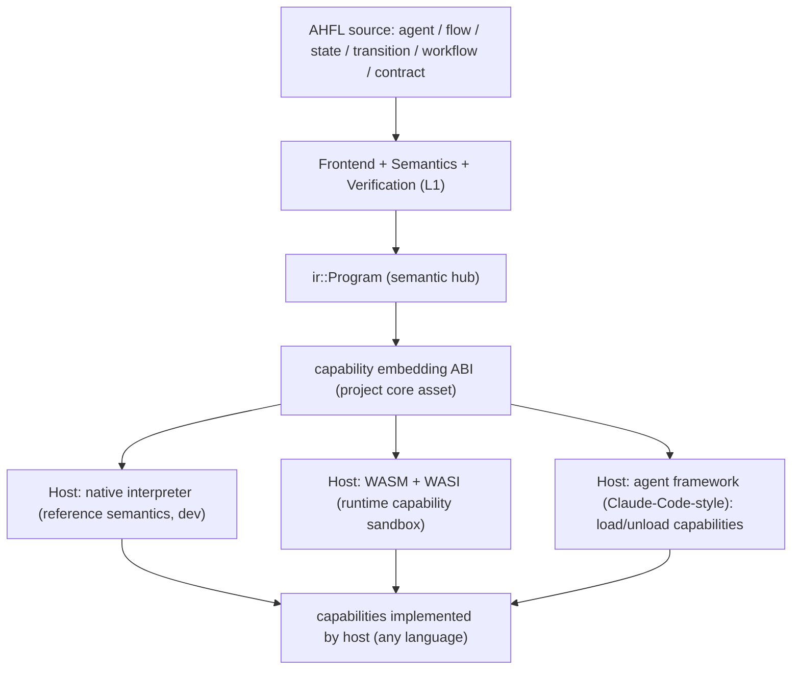

# RFC 0020: AHFL Strategic Positioning — Embeddable Verifiable Agent-Workflow DSL

## Summary

本 RFC 是一份**定位型(positioning)决策**,不引入代码。它为 AHFL 确立一个北极星
定位,供后续所有技术决策(默认执行目标、语言表达力边界、`RFC 0013` 走多远、
capability ABI 演进)对齐:

> **AHFL 是一门可嵌入(embeddable)、可验证(verifiable)的 agent workflow 编排 DSL。
> 它编排 multi-agent workflow 的结构与行为,但**不自己实现底层通用计算能力**——能力由
> 宿主(host,用任意语言实现:C++/Java/JS/…)经一条 **capability 嵌入边界(capability
> embedding ABI)** 提供。AHFL 可嵌入多种宿主:原生解释器(参考语义/开发)、WASM+WASI
> (运行时权限沙箱)、以及 Claude-Code 式的 agent 框架(把宿主的能力当 capability 调用、
> 可模块化装卸)。**

定位锚点:AHFL 之于 agent 时代,如 **Lua 之于游戏引擎/Nginx**、**eBPF 之于 Linux
内核**、**SQL 之于数据库**——一门窄而标准、嵌入宿主、能力由宿主提供、且(像 eBPF 一样)
加载/执行前可被验证的编排语言。

## Motivation

AHFL 已实现的能力面很宽(12 个 emit 目标、SMV + SMT-BMC 形式化验证、原生执行、capability
gating),但**项目缺少一份被记录的定位决策**。这导致一系列反复出现、无锚可依的问题:

1. **默认执行/部署目标是什么?** WASM 该不该是默认?(见 [RFC 0019](0019-wasm-runtime-model.zh.md))
2. **各 emit 目标(K8s CRD / Terraform / OpenAPI)在产品里是核心还是边角?**
3. **AHFL 是不是要长成通用编程语言?** 能不能"写一个 Claude Code"?
4. **表达力边界在哪?** "编排 workflow" 与 "节点内通用计算" 的分界在哪?

这些问题反复消耗讨论,且没有共同的判据。`docs/design/architecture-overview.zh.md` 已经
给出一条关键的架构判断——"L1 是本体……业务层可以替换或砍掉(**换 provider、换部署
目标**),L1 语义不受影响"——但它描述的是**分层**,不是**定位**:它没回答"AHFL 对谁
不可替代、凭什么"。不确立定位,上述问题会持续以"每次重新拍脑袋"的方式消耗决策带宽,
且有把 AHFL 推向"什么都能做但没有一件必须用它"的通用语言坟场的风险。

## Goals

1. **确立 AHFL 的定位陈述**:可嵌入、可验证的 agent workflow 编排 DSL;能力由宿主经
   capability 边界提供;多宿主。作为项目北极星。
2. **确立表达力边界(A 型 vs B 型)**:workflow **建模**表达力(状态/迁移/契约/handoff/
   multi-agent 编排)无上限;节点内**通用计算**(任意算法/IO/数据结构)留在 capability
   边界之外,由宿主实现。这是 AHFL 保持"可验证"与"不打通用语言生态战"的护栏。
3. **把 capability 嵌入 ABI 确立为项目核心资产**,而非某个后端的实现细节。[RFC 0019](0019-wasm-runtime-model.zh.md)
   的 `ahfl_cap` import 契约 + effect→WASI 投影是这条边界的第一个具体实例。
4. **为每个现有 target/后端归位**:原生=参考宿主,WASM+WASI=沙箱宿主,K8s/Terraform/
   OpenAPI=部署视图,SMV/SMT=验证产物,IR-JSON/NativeJson=交换格式。
5. **给后续 RFC 提供判据**:任何新特性提案都能用本定位回答"它增强的是 A 型编排表达力
   还是把 AHFL 推向 B 型通用语言"。

## Non-Goals

1. **不引入任何代码或语言特性**。本 RFC 是定位决策;具体的 embedding ABI、宿主 SDK、
   codegen 由后续实现型 RFC 承载。
2. **不把 AHFL 定义为通用编程语言**。明确拒绝"AHFL 要能写任意系统程序(如实现一个
   Claude Code 本体)"这一方向。
3. **不废弃或改变任何现有能力**。原生运行时、形式化验证、现有 emit 目标语义不变;本
   RFC 只是给它们一个统一的定位坐标。
4. **不选定唯一"默认宿主"**。AHFL 是多宿主的(如 Lua);"默认 target"这一问法被本定位
   溶解——由具体使用场景选择宿主,而非语言钦定单一默认。
5. **不定义 embedding ABI 的具体字节格式**。那是 [RFC 0019](0019-wasm-runtime-model.zh.md)
   与后续宿主 ABI RFC 的事;本 RFC 只确立"它是核心资产"这一定位。

## Design

### 定位模型:嵌入式编排 DSL

AHFL 负责 IR 左侧的一切(编排结构、类型、契约、验证);capability embedding ABI 是
中枢边界;宿主提供右侧的能力实现。**同一份 AHFL workflow 可嵌入不同宿主**,差异只在宿主
提供的能力集与执行环境。

### 表达力边界:A 型(编排)无上限,B 型(通用计算)在边界外

| 维度 | A 型:workflow 建模表达力 | B 型:通用计算表达力 |
| --- | --- | --- |
| 内容 | 状态机、迁移、类型化数据流、capability 声明、契约、multi-agent handoff、动态 workflow 编排 | 任意循环/递归、可变数据结构、裸 IO、字符串处理库、系统调用 |
| 归属 | **AHFL 语言核心,无上限做强** | **capability 边界之外,由宿主实现** |
| 对可验证性 | 天然可分析(结构化构造) | 会破坏全局可判定性 |
| 类比 | eBPF 的编排逻辑 / SQL 的查询结构 | eBPF helper / 数据库存储引擎 |

一个 workflow 节点若需要"读任意文件、正则解析、自定义数值计算",AHFL 的答案是把它声明为
一个 **capability**(宿主实现),而不是在 AHFL 里长出通用计算。这条护栏是 AHFL 能同时
"通用地编排"与"保持可验证 + 不打生态战"的原因。它与 `docs/spec/core-language.zh.md`
§4.6 的 effect 分级、§5.6 的可验证子集一致:`capability` 是唯一的外部效应入口。

### capability 嵌入 ABI 是项目核心资产

嵌入式语言的成败取决于宿主接口(Lua 的 `lua_State` + C API、eBPF 的 helper ABI、WASM 的
import 契约)。AHFL 的对应物是 **capability embedding ABI**,其第一个具体实例已由
[RFC 0019](0019-wasm-runtime-model.zh.md) 落地:

- `ahfl_cap` import 契约:capability 按 `SymbolId`(索引式身份)命名、统一签名
  `(ptr,len) -> ptr`、fail-closed(见 `src/compiler/backends/infra/wasm_backend.cpp` 的
  `emit_capability_imports`)。
- effect→WASI 最小权限投影(`src/compiler/backends/infra/wasm_runtime.cpp` 的
  `project_wasi_config`):把 AHFL capability 的 effect 分级映射为宿主的权限子集。
- capability effect 分级(`read` / `external_side_effect` / `durable_write` /
  `financial_write`,见 `include/ahfl/compiler/ir/decl.hpp` 的 `CapabilityEffectKind`):
  向宿主声明每个能力的风险等级。

本 RFC 把这条边界从"WASM 后端细节"重新归位为"**AHFL 作为嵌入式语言的宿主接口标准**"——
项目最重要的资产之一。

### 现有 target/后端的定位归位

| target/后端 | 定位角色 | 状态 |
| --- | --- | --- |
| 原生解释器(`WorkflowRuntime`) | **参考宿主**:语义真值 + 开发/调试(DAP) | 现役唯一执行器 |
| WASM + WASI | **沙箱宿主**:可移植 + 运行时权限隔离 | ABI 契约已定([RFC 0019](0019-wasm-runtime-model.zh.md)),codegen 待做 |
| SMV / SMT-BMC | **验证产物**:证明契约([RFC 0017](0017-bmc-contract-semantics.zh.md)) | stabilized / implemented |
| K8s CRD / Terraform / OpenAPI | **部署视图**:把 workflow 结构投影为运维配置 | 结构骨架,深度待补 |
| IR-JSON / NativeJson / ExecutionPlan | **交换格式**:交给下游宿主/工具 | 现役 |

## User Impact

本 RFC 不改变任何可观察行为。它的影响是**决策性的**:

- 后续特性提案有了统一判据("A 型还是 B 型?"),减少反复定位讨论。
- 明确 AHFL **不承诺**成为通用编程语言;用户不应期待用 AHFL 写节点内通用计算,而应
  经 capability 边界调用宿主。
- 明确 AHFL 是**多宿主**的:用户按场景选宿主(开发用原生、沙箱部署用 WASM、嵌入现有
  agent 框架用宿主 SDK),而非被钦定单一默认。

## Compatibility and Migration

**非 breaking。** 本 RFC 是定位决策,不改代码、不改语义、不废弃能力。所有现有 target 与
运行时行为保持不变;它们只是获得了一个统一的定位坐标。若未来某实现型 RFC 依据本定位
引入 breaking 变更,那些变更由各自的 RFC 记录其影响与迁移,不由本 RFC 承担。

## Implementation Plan

本 RFC 无代码实现;其"实现"是把定位落进权威文档并驱动后续 RFC:

1. **定位落文档**:被接受后,在 `docs/design/architecture-overview.zh.md` 增补一节
   "AHFL 定位与宿主模型",引用本 RFC 作为定位真值来源。
2. **capability embedding ABI 提级**:后续开一个实现型 RFC,把 [RFC 0019](0019-wasm-runtime-model.zh.md)
   的 `ahfl_cap` 契约抽象为**语言无关的宿主接口标准**(不绑定 WASM),定义宿主 SDK 的
   最小 C ABI。
3. **表达力护栏成文**:在 `docs/spec/core-language.zh.md` 明确"capability 是通用计算的
   唯一入口"这一表达力边界(A 型/B 型),使其成为规范约束而非口头共识。
4. **后续 RFC 对齐**:`RFC 0013`(通用表达力演进)在本定位下重新评估其边界——哪些属于
   A 型编排(纳入),哪些是 B 型通用计算(应留在 capability 外)。

## Test Plan

定位型 RFC 无常规单测/golden。其"验收证据"是**决策一致性**,通过既有门禁与文档校验保证:

- **文档门禁**:`python3 scripts/check-rfc.py` 通过;`ahfl.docs.rfc_check` /
  `rfc_check_smoke` ctest 通过;index.yml 同步。
- **架构一致性**:落文档后 `ahfl.architecture.boundaries`(`tests/CMakeLists.txt`)无回归。
- **定位可引用性(人工判据)**:后续实现型 RFC 的 Design 段能引用本 RFC 回答"该特性
   属于 A 型编排还是 B 型通用计算"。这是过程性验收,不是自动化测试。

## Rollout and Stabilization

1. `draft` → `review`:清零 Open Questions(定位边界的 4 个决策点),process + language
   owner sign-off。
2. `accepted`:定位被采纳为项目北极星;按 Implementation Plan 把定位落进
   `architecture-overview` 与 `core-language` spec。
3. `implemented`:定位已落进权威文档,且至少一个后续 RFC(embedding ABI 提级)据此开题。
4. `stabilized`:定位在 `docs/design` / `docs/spec` 稳定表述,且项目路线图(`docs/plans/`)
   以本定位为组织轴。

## Alternatives

1. **通用 agent 编程语言(B 型全开)**:让 AHFL 长出通用表达力(循环/IO/库生态),
   目标"用 AHFL 写整个 agent 系统乃至 Claude Code 本体"。**失败原因**:与 Python/TS/
   通用 agent 框架正面竞争表达力与生态,AHFL 作为"更严格更费劲"的语言天然吃亏;且通用
   图灵完备表达力会摧毁形式化验证这一核心差异化。历史上"想表达万物"的语言从未成为
   "人人离不开的基础设施"——基础设施靠窄而标准(SQL/正则/TCP-IP/eBPF),不靠全能。
2. **纯保证层(只做验证,不做编排)**:把 AHFL 缩成"给别人写的 agent 上契约的校验器",
   不承担 workflow 编排。**失败原因**:抛弃了 AHFL 真实的核心竞争力——用状态机/契约/
   handoff 等一等构造**建模 multi-agent workflow** 的表达力。"能表达"与"能验证"在 AHFL
   里是同一枚硬币的两面,只保留验证是把西瓜扔了捡芝麻。
3. **单一默认宿主(钦定 native 或钦定 WASM 为唯一执行器)**:简化"默认 target"问题。
   **失败原因**:嵌入式语言的价值恰恰在于多宿主(Lua 能嵌进任何宿主)。钦定单一默认
   会牺牲可移植性(若定 native)或开发体验与语义锚(若定 WASM)。正确做法是多宿主 +
   一个统一的 embedding ABI。

## Open Questions

1. **embedding ABI 的语言无关形态**:把 [RFC 0019](0019-wasm-runtime-model.zh.md) 的
   `ahfl_cap`(WASM import 形态)抽象为语言无关的宿主接口时,采用哪种最小 ABI?
   一个稳定的 C ABI(`extern "C"` + `(ptr,len)` 帧)是主流嵌入式语言(Lua/eBPF)的
   共同选择,是否直接采纳?
2. **宿主如何模块化装卸能力**:Claude-Code 式宿主运行时注册/注销 capability 的机制——
   编译期声明的 capability 白名单如何与运行时可变的宿主能力集协调?(静态声明 +
   运行时绑定检查?)
3. **异步能力**:LLM/HTTP 本质异步,而编排 DSL 的 capability 调用点在语义上是"调用→
   得结果→继续"。这在 WASM 同步 ABI(见 [RFC 0019](0019-wasm-runtime-model.zh.md) 已决:
   host 侧吸收异步)之外,对原生宿主与 agent-框架宿主分别意味着什么?是否需要语言级的
   `await`/续延语义,还是全部下沉到宿主?
4. **多宿主语义一致性的验证深度**:同一 workflow 在 native / WASM / agent-框架宿主下,
   要求"逐状态迁移一致"(已由 [RFC 0019](0019-wasm-runtime-model.zh.md) Goal 6 对 WASM
   确立),还是也要求跨所有宿主的 capability 调用序列一致?后者更强但更难。

## Decision History

- 2026-08-25: Draft opened. 定位从多轮讨论收敛而来:AHFL 是可嵌入、可验证的 agent
  workflow 编排 DSL(Lua/eBPF-for-agents),能力由宿主经 capability 边界提供,多宿主
  (native / WASM+WASI / agent 框架)。确立 A 型编排表达力无上限、B 型通用计算留在
  capability 边界外的护栏,并把 capability embedding ABI 提为项目核心资产。
