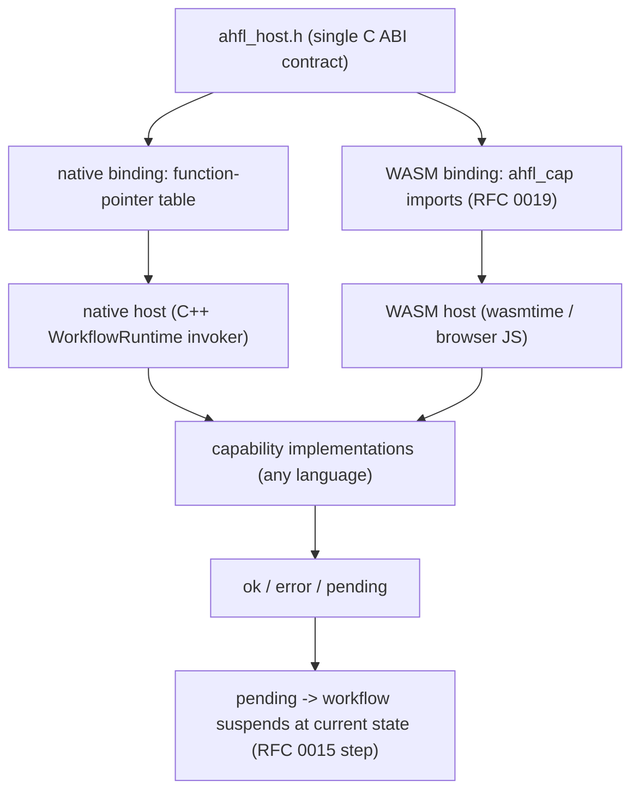

# RFC 0021: Capability Embedding ABI

## Summary

定义 AHFL 的**语言无关宿主接口(host embedding ABI)**:一个稳定的 C ABI,让任意语言
实现的宿主(C++/Rust/Go/Java/Node/浏览器 JS)把能力提供给一个嵌入的 AHFL workflow。
本 RFC 把 [RFC 0019](0019-wasm-runtime-model.zh.md) 的 `ahfl_cap`(WASM import 形态)
抽象为一个不绑定 WASM 的通用契约(`ahfl_host.h`),并落实 [RFC 0020](0020-strategic-positioning-embeddable-workflow-dsl.zh.md)
Open Questions Q1(语言无关 C ABI)与 Q3(异步:语言同步语义 + ABI 支持 pending 挂起)
的合并决策。这是 AHFL 从"多后端编译器"走向"嵌入式语言(Lua/eBPF-for-agents)"的第一块
地基。本 RFC 定义**契约**,不做完整宿主 SDK 实现(见 Non-Goals)。

## Motivation

[RFC 0020](0020-strategic-positioning-embeddable-workflow-dsl.zh.md)(accepted)把 AHFL
定位为可嵌入的 agent workflow 编排 DSL,能力由宿主经 **capability 嵌入边界**提供,并把
这条边界列为项目核心资产。但今天这条边界只存在于**一个宿主形态**里:

1. **WASM 特化**:[RFC 0019](0019-wasm-runtime-model.zh.md) 的 `ahfl_cap` import
   (`(import "ahfl_cap" "cap_<id>" (func (param i32 i32) (result i32)))`,见
   `src/compiler/backends/infra/wasm_backend.cpp` 的 `emit_capability_imports`)是 WASM
   专属的。原生宿主(`src/runtime/engine/workflow_runtime.cpp` 的
   `ContextualCapabilityInvoker`)走的是另一套 C++ 内部接口。**两套 capability 接口没有
   统一契约**——这正是"多宿主"定位缺的那块地基。
2. **异步无位置**:LLM/HTTP 本质异步。现状原生 invoker 同步返回 `CapabilityCallResult`
   (`src/runtime/engine/capability_bridge.hpp`),WASM 侧 [RFC 0019](0019-wasm-runtime-model.zh.md)
   只说"host 侧吸收"。没有一个**跨宿主统一的挂起(pending)语义**,浏览器/serverless
   (执行有时限、不能 block)无从落地。

不定义这条统一 ABI,"AHFL 可嵌入任意宿主"永远停留在愿景——每接一个新宿主都要重新发明
capability 接口,且异步各搞各的。

## Goals

1. **定义 `ahfl_host.h` 作为唯一契约**:一个稳定的 C ABI 头,描述宿主↔AHFL 的
   capability 调用边界。WASM 的 `ahfl_cap` import 与原生宿主的函数指针表都从它派生,
   不再各自定义。
2. **`(ptr, len)` 帧 + 版本号**:capability 参数/返回值为长度前缀的序列化字节
   (初期 value_json,格式是版本字段);ABI 携带版本号,未来可迁 Component Model/WIT
   而不破帧结构。
3. **SymbolId 命名**:capability 按 `SymbolId`(索引式身份)标识,不用源名——重命名
   不破 ABI(延续 [RFC 0019](0019-wasm-runtime-model.zh.md) 与 AGENTS.md 索引式身份原则)。
4. **fail-closed 三态结果**:capability 调用返回 `ok` / `error` / `pending`。`error`
   →AHFL 侧终止并传播(不静默吞);`pending`→workflow 挂起在当前状态,等宿主恢复。
5. **pending/挂起语义(Q3)**:语言层 capability 调用保持同步语义(调用→得结果→继续),
   异步由宿主吸收;ABI 的 `pending` 态让宿主(浏览器/serverless)把"等 LLM"表达为
   "workflow 停在某状态、由后续事件恢复",复用 [RFC 0015](0015-dap-runtime-integration.zh.md)
   的状态机 step 语义。
6. **两个宿主形态从同一契约派生**:原生宿主(函数指针表)与 WASM 宿主(import)是同一
   `ahfl_host.h` 的两个绑定,证明契约的语言无关性。

## Non-Goals

1. **不实现完整宿主 SDK**。本 RFC 定义 C ABI 契约;各语言(Rust/Go/Node)的绑定库是
   后续工作。
2. **不引入新的运行时依赖**。契约是一个头文件 + 编译期约定;不把 wasmtime/wasmer 或
   任何引擎引入核心构建(延续 [RFC 0019](0019-wasm-runtime-model.zh.md) Non-Goal 3)。
3. **不改变语言语义**。capability 调用点的语言语义仍是同步的(见 Goal 5);不引入语言级
   `async`/`await`——那是 [RFC 0020](0020-strategic-positioning-embeddable-workflow-dsl.zh.md)
   拒绝的 B 型通用计算。
4. **不迁移到 Component Model / WIT**。core C ABI + 版本号;WIT 是未来 major 版本目标,
   本 RFC 只保证不关死迁移路径。
5. **不实现完整 evaluator→WASM codegen**。那是 [RFC 0019](0019-wasm-runtime-model.zh.md)
   Non-Goal 1 的后续工作;本 RFC 只统一 capability 边界契约。
6. **不定义具体序列化格式的字节布局**。沿用 value_json(格式是版本字段);紧凑二进制
   是后续独立决策。

## Design

### 边界总览

### C ABI 形态(契约,非最终字节布局)

`ahfl_host.h` 定义(示意,最终签名由实现切片确定):

- **能力身份**:capability 由 `uint32_t cap_id`(`SymbolId`)标识。
- **调用签名**:`ahfl_cap_status ahfl_invoke(uint32_t cap_id, const uint8_t* args_ptr,
  uint32_t args_len, uint8_t** result_ptr, uint32_t* result_len)`——`(ptr,len)` 入、
  `(ptr,len)` 出,返回三态状态码。
- **状态码**:`AHFL_CAP_OK` / `AHFL_CAP_ERROR` / `AHFL_CAP_PENDING`。
- **版本**:`ahfl_abi_version()` 返回 ABI 版本(对齐 [RFC 0019](0019-wasm-runtime-model.zh.md)
  已发射的 `ahfl_abi_version` 全局)。
- **内存所有权**:延续 [RFC 0019](0019-wasm-runtime-model.zh.md) OQ2——宿主经导出的
  `alloc`/`dealloc` 管理帧内存;WASM 绑定直接复用已发射的 `alloc`/`dealloc`,原生绑定用
  等价的分配约定。

WASM 绑定:`ahfl_invoke` 映射为 `ahfl_cap` import(cap_id → import 名 `cap_<id>`),
即 [RFC 0019](0019-wasm-runtime-model.zh.md) 现状,增补 `pending` 返回码。
原生绑定:`ahfl_invoke` 映射为 `WorkflowRuntime` 持有的函数指针表,取代现状的
`ContextualCapabilityInvoker` 直连,使原生与 WASM 走同一契约。

### pending/挂起语义(Q3 落实)

capability 返回 `AHFL_CAP_PENDING` 时:

1. workflow **停在当前状态**,不推进迁移(复用 [RFC 0015](0015-dap-runtime-integration.zh.md)
   的状态机 step——挂起就是"停在某状态等外部事件")。
2. 宿主稍后以 capability 结果**恢复**该 workflow(恢复接口由实现切片定义)。
3. 语言层看到的仍是"调用→得结果→继续"的**同步语义**——挂起/恢复对 AHFL 源码不可见,
   完全由宿主与 runtime 边界处理。

宿主形态映射:
- **原生 / server WASM**:宿主内部 block 等待,直接返回 `OK`,不用 `PENDING`(现状即如此)。
- **浏览器**:JSPI(WASM 原生挂起等 Promise)或 Asyncify;capability 返回 `PENDING`,
  JS host 在 Promise resolve 后恢复。
- **serverless**:capability 返回 `PENDING`,函数返回;后续事件(webhook/回调)携带
  workflow 句柄恢复——避免在有时限的函数里 block 等数十秒的 LLM。

### 与效应/能力模型的一致

capability 的 effect 分级(`read` / `external_side_effect` / `durable_write` /
`financial_write`,`include/ahfl/compiler/ir/decl.hpp` 的 `CapabilityEffectKind`)不进
ABI 调用签名,但**在编译期决定宿主需要哪些权限**——延续 [RFC 0019](0019-wasm-runtime-model.zh.md)
的 `project_wasi_config` 投影。[RFC 0020](0020-strategic-positioning-embeddable-workflow-dsl.zh.md)
Q2 的"编译期白名单上界 + 运行时绑定子集"在本 ABI 上体现为:宿主提供的 `ahfl_invoke`
只会被 AHFL 用编译期声明过的 `cap_id` 调用,宿主可拒绝(返回 `ERROR`)未绑定的能力。

## User Impact

- 宿主作者(集成 AHFL 的框架)获得一个**单一、稳定、语言无关的 C 契约**去提供能力,
  不必理解 AHFL 内部或为每个宿主重发明接口。
- WASM 与原生执行走**同一 capability 契约**,消除两套接口的漂移。
- 异步能力有了**统一的 pending 落地路径**,浏览器/serverless 宿主成为可能。
- 对 AHFL 源码作者**无可见变化**:capability 调用仍是同步语义;这是宿主侧的 ABI。

## Compatibility and Migration

**对语言与现有原生用户非 breaking;对 WASM ABI 是 experimental 阶段的演进。**

- 语言语义、`ahflc run` 的原生执行行为不变(原生 invoker 改为从统一契约派生,但可观察
  行为一致,由 [RFC 0020](0020-strategic-positioning-embeddable-workflow-dsl.zh.md) Q4
  的 L1/L2 一致性保证)。
- [RFC 0019](0019-wasm-runtime-model.zh.md) 发射的 `ahfl_cap` import 增补 `pending`
  返回码;WASM 输出尚未作为稳定 artifact 承诺(stability: experimental),此演进不破稳定
  契约。
- 无其他 backend / 语义变化。

## Implementation Plan

1. **`ahfl_host.h` 契约定义**(`src/runtime/` 或 `include/ahfl/runtime/`):C ABI 头 +
   状态码 + 版本 + 内存所有权约定。纯契约,无行为变更。
2. **原生绑定**:`WorkflowRuntime` 的 capability 派发改为从 `ahfl_host.h` 的函数指针表
   派生,取代 `ContextualCapabilityInvoker` 直连;保持可观察行为一致。
3. **WASM 绑定对齐**:`emit_capability_imports`([RFC 0019](0019-wasm-runtime-model.zh.md))
   增补 `pending` 返回码,声明其 import 契约即 `ahfl_host.h` 的 WASM 投影。
4. **pending/恢复接口**:runtime 层的 workflow 挂起/恢复 API(复用状态机 step)。
5. **参考宿主**:一个最小 C/C++ 参考宿主实现 `ahfl_host.h`,跑通一个带 capability 的
   workflow,作为契约的可执行证据。
6. **测试**:见 Test Plan。

各语言绑定库(Rust/Go/Node SDK)与完整 WASM codegen 超出本 RFC,是后续工作。

## Test Plan

- **单元**(`tests/unit/runtime/`):`ahfl_host.h` 契约的状态码/版本/帧编解码往返;
  cap_id ↔ import 名映射确定性(延续 [RFC 0019](0019-wasm-runtime-model.zh.md) 的
  SymbolId 命名测试)。
- **一致性(差分)**:同一带 capability 的 workflow,经原生绑定与 WASM 绑定,L1 状态迁移
  序列 + L2 capability 调用序列一致([RFC 0020](0020-strategic-positioning-embeddable-workflow-dsl.zh.md) Q4)。
- **Golden 正例**:参考宿主跑通一个 `capability` workflow,输出与 `ahflc run`(原生)一致。
- **Golden 负例**:未绑定能力 → fail-closed `ERROR`,workflow 终止并传播,不静默吞。
- **pending 语义**:一个 capability 返回 `PENDING` → workflow 挂起在当前状态;恢复后
  继续到 final,结果与同步路径一致。
- **回归**:`ctest --preset test-dev`;现有 `ahfl.backends.wasm_all`、capability_bridge、
  workflow_runtime 测试无回归。

## Rollout and Stabilization

1. `draft` → `review`:清零 Open Questions(帧格式版本策略、恢复接口形态),runtime +
   compiler owner sign-off。
2. `accepted` 后按 Implementation Plan 落地契约 + 原生/WASM 绑定 + pending。
3. `implemented`:`ahfl_host.h`、两个绑定、pending、参考宿主、契约级测试落库。
4. `stabilized`:`docs/reference/` 定义宿主 ABI 契约文档;ABI 承诺稳定则标记
   stable-artifact;至少一个第三方语言绑定(Rust/Node)据此实现。

## Alternatives

1. **每个宿主各自定义 capability 接口(现状)**:WASM 用 import、原生用 C++ 内部类。
   **失败原因**:两套接口漂移、异步各搞各的、每接新宿主重发明——与 [RFC 0020](0020-strategic-positioning-embeddable-workflow-dsl.zh.md)
   "capability 边界是核心资产、多宿主"的定位直接冲突。
2. **进程外 IPC(gRPC/JSON-RPC over socket)作为宿主边界**:更松耦合、天然跨语言。
   **失败原因**:引入序列化 + 网络往返开销,且丢掉 in-process 嵌入的性能与 WASM 沙箱
   红利——走 IPC 就不是"嵌入"(参 [RFC 0020](0020-strategic-positioning-embeddable-workflow-dsl.zh.md)
   Q1 结论)。IPC 可作为**可选**远程 capability 传输(现有 HTTP/gRPC transport 已覆盖),
   但不是嵌入边界本身。
3. **直接上 Component Model / WIT**:带类型的接口更优雅。**失败原因**:浏览器支持未
   成熟、工具链新、绑定复杂([RFC 0019](0019-wasm-runtime-model.zh.md)/[RFC 0020](0020-strategic-positioning-embeddable-workflow-dsl.zh.md)
   已列为未来 major 版本目标)。core C ABI + 版本号保留迁移路径而不承担当下复杂度。

## Open Questions

两个设计问题已在进入 review 前给出**倾向性结论 + 理由**。具体字节布局/函数签名由实现
切片确定;本 RFC 定方向。

1. **帧序列化格式的版本演进策略** → **决策:靠 ABI 版本号整体切,不给每帧带格式标签。**
   `ahfl_abi_version()` 决定整个边界用哪种帧格式;一次连接内所有帧同格式,不混用。
   value_json(v1)→ 紧凑二进制(v2)是一次 ABI 版本升级,宿主与模块必须版本匹配才能
   连接(连接握手时校验版本)。**理由**:嵌入式边界是**同一次连接内的紧耦合**(不像网络
   协议要长期向后兼容异构对端),整体版本切换比每帧带标签简单、快(免去每帧解析格式
   标签)、且不给"同一连接内混用格式"留下未定义组合。这与 [RFC 0019](0019-wasm-runtime-model.zh.md)
   已发射的 `ahfl_abi_version` 全局一致——版本是连接级事实,不是帧级事实。每帧带标签会
   引入 N×M 的格式组合测试面,收益(异构混用)在嵌入场景里并不需要。
2. **pending 恢复接口的具体形态** → **决策:复用 runtime 已有的 workflow 恢复机制
   (`WorkflowRecoverySnapshot` / `CheckpointId` / `WorkflowNodeId`,见
   `src/runtime/engine/workflow_recovery.hpp`),不新发明续延机制。** 一个 capability 返回
   `PENDING` 时,runtime 在**当前 workflow 节点**产生一个挂起点,句柄是
   `(WorkflowId, CheckpointId)`——即已有恢复快照的坐标;宿主稍后以该句柄 + capability
   结果(序列化 `Value`,与 `RecoveredNodeState::output` 同类型)恢复,结果按当前节点的
   capability 调用点回注入 workflow 状态,workflow 从该点继续。**理由**:runtime 已经有
   一套成熟的"节点级快照 + 按句柄恢复 + 已完成节点携带 output `Value`"机制(RFC 0015
   DAP step 与 workflow recovery 共用)。pending 挂起本质就是"在某节点等一个外部结果",
   与"崩溃后从某节点恢复"是同一形状——复用它避免引入平行的续延栈/协程状态机,也让
   挂起的 workflow 天然可持久化(serverless 冷启动跨请求恢复)。新发明一套续延机制会与
   既有 recovery 语义漂移,且重复实现"节点级状态捕获"这件已解决的事。

## Decision History

- 2026-08-25: Draft opened. 落实 [RFC 0020](0020-strategic-positioning-embeddable-workflow-dsl.zh.md)
  Q1(语言无关 C ABI + `(ptr,len)` 帧 + 版本号 + SymbolId 命名)与 Q3(语言同步语义 +
  异步下沉宿主 + ABI 三态含 pending 挂起)的合并决策,把 [RFC 0019](0019-wasm-runtime-model.zh.md)
  的 `ahfl_cap` 抽象为语言无关的 `ahfl_host.h`,原生与 WASM 从同一契约派生。
- 2026-08-25: 两个 Open Questions 给出倾向性结论并进入 review:(1)帧格式版本靠连接级
  `ahfl_abi_version` 整体切换,不给每帧带格式标签(嵌入边界是紧耦合,整体版本比逐帧
  标签简单且免格式组合测试面);(2)pending 恢复复用 runtime 已有的
  `WorkflowRecoverySnapshot` / `CheckpointId` 机制,句柄为 `(WorkflowId, CheckpointId)`,
  结果按 `RecoveredNodeState::output` 同型回注入,不新发明续延机制。Owners / shepherd
  分配,tracking_issue / discussion 设为 none。Status draft → review。
- 2026-08-25: Owner sign-off; status review → implementing. 按 Implementation Plan
  切片,从 `ahfl_host.h` C ABI 契约(slice 1)开始。各语言宿主 SDK 与完整 WASM codegen
  仍超出本 RFC 范围。
- 2026-08-25: Slice 1 landed — `include/ahfl/runtime/ahfl_host.h` C ABI 契约。落地前经
  一次多 lens 设计评审(ABI 稳定性 / 内存所有权 / 异步-pending / 双绑定一致性),据其
  must-fix 列表定型:不透明 `ahfl_host*` 句柄作首参(否则 1.0 后不可加)、size-prefixed
  `ahfl_invoke_args`(append-only 扩展,免每次加参新符号)、`uint32_t` 定宽状态 + OK=0 +
  fail-closed(未知状态视作 ERROR)、分离 `ahfl_abi_version()` 与 `ahfl_wire_format`、
  callee-alloc/caller-free 帧所有权(alloc/dealloc 带 `host` 防跨分配器 free)、三态
  post-condition 逐条写进契约、小端长度前缀帧。原生表与 WASM import 皆从此单一头派生。
  验证为有效 C11(`-Wall -Wextra -Wpedantic` clean)。Covered by
  `tests/unit/runtime/engine/ahfl_host_abi.cpp`(`ahfl.runtime.host_abi_all`:定宽/OK=0/
  struct_size 首字段的 static_assert + 版本/wire/args 形态)。原生绑定、WASM pending、
  resume 接口为后续 slice。
