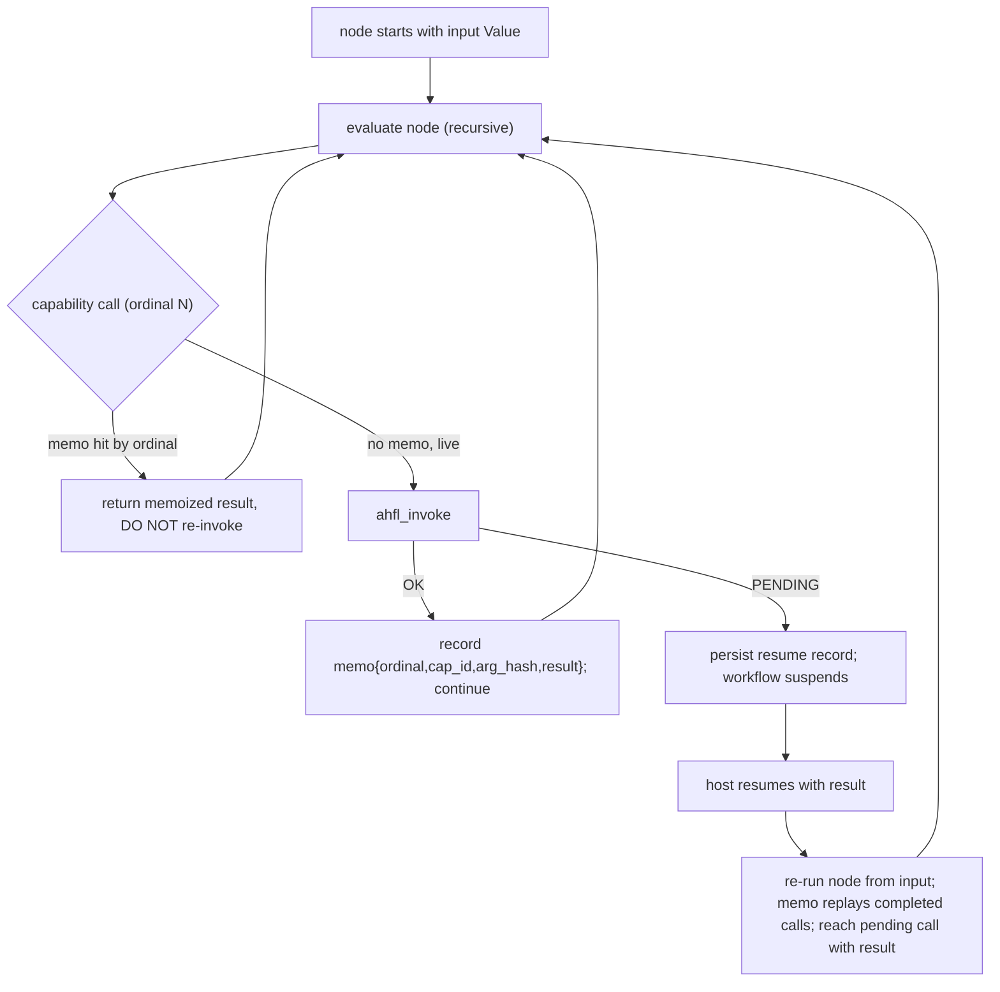

# RFC 0022: Durable Capability Resume

## Summary

定义 AHFL 在一个 capability 返回 `AHFL_CAP_PENDING`([RFC 0021](0021-capability-embedding-abi.zh.md))
时如何**挂起并恢复** workflow 执行。核心决策:采用**确定性重放 + capability 结果
memoization**(Temporal / DBOS 式 durable execution 模型)——挂起点持久化为纯可序列化
数据(节点 input `Value` + memo 表),恢复时从节点 input 重跑该节点,已完成的 capability
调用按 `(ordinal, cap_id)` 返回 memo 结果**且不重新执行**(避免 `durable_write` /
`financial_write` 二次触发),直到到达仍 pending 的调用点带着结果继续。本 RFC 同时明确
重放**可靠性(soundness)前提**——节点内 capability 之间的求值必须确定性可复现——并
列出 AHFL 当前**尚未满足该前提**、必须在实现前关闭的具体缺口(nondet 内建、`unordered_map`
字段序列化)。这是 [RFC 0021](0021-capability-embedding-abi.zh.md) slice 4,因其为语义级
改动(而非接线)而单独立项。

## Motivation

[RFC 0021](0021-capability-embedding-abi.zh.md) 的 ABI 定义了 `AHFL_CAP_PENDING`,但把
恢复机制 defer 到本 RFC,并在其 OQ2 里乐观地假设"复用现有节点级 recovery 即可"。一次
针对该假设的设计评审(4 lens)证明**该假设不成立**,且难度全部源于此:

1. **capability 调用不在节点边界**:它发生在递归表达式求值栈的任意深处
   (`workflow_runtime.cpp` 节点循环 → `AgentRuntime::run` → `exec_block` 状态机循环 →
   `exec_statement` → `eval_expr`(在 `evaluator.cpp` 递归约 215 处)→
   `capability_eval` → `runtime_invoker`)。这是普通 C++ 递归栈,**没有可快照的续延**。
2. **现有 recovery 是整节点、仅已完成**:`WorkflowRecoverySnapshot` / `RecoveredNodeState`
   (`src/runtime/engine/workflow_recovery.hpp`)只存 `{node, agent, output Value}`,**零
   节点内状态**,且**不捕获节点 input**(只存 output)。
3. **C++ invoker 无 Pending 态**:`CapabilityCallStatus`(`capability_bridge.hpp`)目前只有
   Success/Error/...;PENDING 只存在于 C ABI,尚未映射进 C++ 侧;当前每次原生调用都是
   同步的。

若不解决,browser / serverless(函数有时限、不能 block 等数十秒 LLM;冷启动跨进程)这
两个 [RFC 0021](0021-capability-embedding-abi.zh.md) 明确要支持的宿主形态无从落地——而
它们正是 [RFC 0020](0020-strategic-positioning-embeddable-workflow-dsl.zh.md) 多宿主定位
的关键。

## Goals

1. **确立 durable resume 模型**:确定性重放 + capability 结果 memoization。挂起态为纯
   可序列化数据,可跨进程 / serverless 冷启动恢复。
2. **明确重放 soundness 前提并使之成立**:节点内 capability 之间求值确定性可复现;列出
   并关闭 AHFL 当前未满足该前提的缺口。
3. **定义挂起态记录(resume record)**:index/id-based,捕获恢复一个具体 call site 所需
   的最小状态(节点 coord、节点 input、pending call 身份、memo 表)。
4. **exactly-once 效应保证**:重放**绝不**重新执行已完成的 capability;`durable_write` /
   `financial_write` 有 idempotency key + write-ahead intent,防 write-then-crash 二次触发。
5. **fail-closed**:memo / 注入结果的类型不符 = 快照损坏,发 SourceRange 诊断并中止,
   绝不强转、绝不回退到 live 调用。
6. **保持语言同步语义**:挂起/恢复对 AHFL 源码不可见——源码看到的仍是"调用→得结果→
   继续"([RFC 0021](0021-capability-embedding-abi.zh.md) 已确立)。

## Non-Goals

1. **不做 CPS / defunctionalized-continuation 求值器重写,也不用 C++20 coroutine 持久化**
   ——native 帧不可序列化,违反 artifact 确定性,且 kill serverless(见 Alternatives)。
2. **不支持节点内并行/并发 capability 求值**(首版):强制节点内**确定性顺序求值**。
3. **不做 memo 表 checkpoint / 压缩**以约束多次 resume 的二次重放开销:首版对单节点
   suspension 次数设上限;压缩列为后续。
4. **不做结构化 AST call-site 坐标作为规范 key**(首版):先用 per-node ordinal + cap_id +
   arg_hash 交叉校验;结构化坐标为后续 hardening。
5. **不实现宿主侧完整 exactly-once 事务协议**:本 RFC 定 idempotency-key + write-ahead-
   intent 契约,宿主侧去重实现是宿主的责任。
6. **不承诺跨平台字节级 float 渲染一致**(首版):只保证同 formatter;首版 resume 仅
   in-scope 同二进制。

## Design

### 模型:确定性重放 + memoization

挂起 = 持久化节点 input + memo 表。恢复 = 用同一 input 重跑该节点;每个已完成 capability
按 ordinal 命中 memo、返回旧结果、**不再调用**;执行推进到原 pending 点,此时它有了结果,
继续。这与 Temporal / DBOS durable execution、GHC 式 effect replay 同构。

### Soundness 前提(load-bearing)

**约束**:对一个可恢复节点,*相同的节点 input Value + 相同的 memo 表必须复现完全相同的
invocation-ordinal 序列与每个 ordinal 处相同的 resolved args*。这要求节点内 capability
之间的 AHFL 求值是**纯的**——无可变环境、无 IO、无对无序容器的可观察迭代、无未 memoize
的 nondeterminism。

**已保证(AHFL 现有设计)**:文法无循环/可变赋值;节点 input 单次注入;求值期间 context
只读;`Set` / `Map` 运行时值已 order-normalized + 去重。此片段是纯的。

**未保证——本 RFC 必须关闭的缺口**(均已核实存在):

1. `wall_clock_now` / `time_now`(`builtins.cpp:905`,读真实系统时钟)与 `uuid_new` /
   `uuid_new_v4`(`builtins.cpp:967`,基于 `std::random_device`)是语言可调用的 Nondet
   内建——重放会算出不同值。注意 `time_epoch`(`builtins.cpp:915`,返回常量 0)与
   `timestamp_add` / `timestamp_sub` 等是纯函数,**不**在重分类范围内。
   **决策:仅将这 4 个真正 nondet 的内建重分类为零参 host capability**(与
   [RFC 0020](0020-strategic-positioning-embeddable-workflow-dsl.zh.md)
   "宿主拥有 nondeterminism" + 索引式身份一致),使其结果走 InvocationId / memo 路径。
2. `StructValue.fields` / `EnumValue.named_payload`(`value.hpp:56,70`)是 `unordered_map`;
   `value_json` 直接迭代它们 → 跨新进程/allocator 顺序不稳定,违反 artifact 确定性。
   **决策:改为按 field-ordinal 的扁平 vector**(Principle 2/3),或强制排序键序列化;
   优先 ordinal vector。
3. float→string 固定为 locale-independent 的 shortest-round-trip formatter(`to_chars` / Ryū)。
4. **编译期规则**:可恢复节点内任何 `EffectJudgement::Kind == Nondet` 的表达式**必须**被
   memoize(或禁止出现在节点 input 与 pending 调用之间)。fail-closed。

### Resume record(挂起态记录,全 index/id-based)

- `node_coord` — DAG 节点坐标(ordinal/id,非名字)。
- `node_input` — 节点 input `Value`(**新增**:当前只捕获 output;是前置工作项)。
- `pending_call` — `{ cap_id (SymbolId), per-node invocation ordinal, resolved args(fail-
  closed 交叉校验), expected result type(interned TypeContext 句柄) }`。
- `memo_table` — append-only,按 ordinal 排序,条目 `{ ordinal, cap_id, arg_hash, result
  Value }`,覆盖该节点内**所有**已完成调用(所有 effect 等级 + 重分类的 nondet 内建),
  **不只 pending 那个、不按等级过滤**。
- 每个 effectful 调用的 `idempotency_key = hash(workflow_instance, node_coord, ordinal,
  cap_id, arg_hash)`,供宿主 exactly-once 去重。
- 等级 ≥ `durable_write` 的调用:效应发生**前**持久化 "committed, result-pending" 的
  write-ahead intent 标记。

ordinal 是 memo key;cap_id + arg_hash 是每次 memo 命中时断言的冗余完整性校验(不符即
fail-closed,绝不回退到 live 调用)。运行时已经按求值顺序为每次调用铸造 InvocationId
(`workflow_runtime.cpp` `metadata.add_invocation`),复用它作 ordinal。

### Hard cases

| 情形 | 处理 |
| --- | --- |
| 1. 循环/重复状态里同一 capability | ordinal 按严格确定求值序分配;每次命中断言 cap_id+arg_hash;禁 capability 外的 nondet 读 |
| 2. 嵌套 capability(cap 参数是 cap 调用) | post-order 求值(操作数先于操作符)给内层更早 ordinal;规范固定 post-order;args 为交叉校验 |
| 3. resume 后第二次 pending(多次挂起) | memo 表 append-only(非"单 pending"):每次再挂起重建 = 旧 memo + 刚解析的调用 + 中间调用 |
| 4. quota / 迁移计数二次计 | 分离**纯 VM 状态**(重放时重算、不外化)与**宿主可见效应**(必须走 memoized capability);计数只在 resume 后的最终状态提交;重放跑在 effect-suppressed 模式 |
| 5. durable_write 已提交但 crash | 需 host idempotency key + 效应前 write-ahead "committed/result-pending" intent 记录;等级 ≥ durable_write 强制 |
| 6. 注入帧类型不符 | 对注入 Value 与每个 memo Value 按 interned expected type 做 TypeContext 指针相等校验;不符发 SourceRange 诊断并中止(不强转;memo 类型不符=快照损坏,视为致命) |
| 7. 并行节点各自挂起 | 跨节点 SUFFICIENT:ordinal 按节点、记录按 node_coord 键;DAG 调度器管 pending 节点集与 merge-back。节点内并行不支持(见 Non-Goal 2) |

## User Impact

- browser / serverless 宿主可以承载"调 LLM → 挂起 → 由后续事件恢复"的 agent,而不必在
  有时限的函数里 block。
- **语言级可见变化(小但真实)**:`wall_clock_now` / `uuid_new` 等 nondet 内建从语言内建
  重分类为 host capability——用户需经 capability 获取时间/uuid。这与 [RFC 0020](0020-strategic-positioning-embeddable-workflow-dsl.zh.md)
  "nondeterminism 属宿主" 定位一致,但对现有用这些内建的源码是 breaking(见下)。
- 可恢复节点内使用未 memoize 的 nondet 表达式 → 编译期确定诊断。
- 对不使用 pending / durable resume 的用户:无行为变化。

## Compatibility and Migration

**部分 breaking(语言级),但范围明确。**

- **Breaking**:`wall_clock_now` / `time_now` / `uuid_new` / `uuid_new_v4`
  从语言内建移除,重分类为 host capability(`time_epoch` 等纯函数保留为内建)。
  **迁移**:用 capability 声明 + 宿主实现替代;提供迁移期诊断指向替代 capability。
  影响面 = 使用这 4 个 nondet 内建的源码。
- **内部(非用户 API)**:`StructValue` / `EnumValue` 字段存储从 `unordered_map` 改为
  ordinal vector;`WorkflowRecoverySnapshot` 扩展 node input + memo 表(schema bump
  `ahfl.workflow-recovery.v2`);`CapabilityCallStatus` 增 `Pending`。这些不是用户 API。
- 现有 recovery 快照 v1 与 v2 不兼容,但 recovery 快照是 experimental,未承诺稳定。

## Implementation Plan

按前置→核心→收尾切片,每片独立可验证:

1. **确定性前置(soundness 缺口)**:
   a. `StructValue` / `EnumValue` 字段改 ordinal-keyed 扁平 vector,`value_json` 确定性序列化;
   b. float→string 固定 formatter;
   c. nondet 内建(time / uuid)重分类为 host capability + 迁移诊断。
2. **PENDING 映射**:`CapabilityCallStatus::Pending` + invoker 把 ABI 的 `AHFL_CAP_PENDING`
   映射进 C++ 结果;`EvalResult` 增 `Suspended` 控制流逃逸(穿透 eval 递归到节点循环)。
3. **resume record + memo 表**:扩展 `WorkflowRecoverySnapshot`(node input + memo,schema
   v2);节点求值捕获/回放 memo;effect-suppressed 重放模式。
4. **exactly-once**:idempotency key + write-ahead intent(等级 ≥ durable_write)。
5. **fail-closed 校验**:注入/ memo Value 的 interned-type 校验 + SourceRange 诊断。
6. **测试**:见 Test Plan。

编译期"可恢复节点内 nondet 必须 memoize"规则(soundness §4)随切片 1c/2 落地。

## Test Plan

- **单元**:memo 命中不重新调用(mock capability 计数=1);ordinal 在循环/嵌套下的确定
  分配;`value_json` 对含 struct/enum 的 Value 跨两次序列化字节一致(确定性)。
- **重放正确性**:一个节点内多个 capability,第二个返回 PENDING → 挂起 → 恢复 → 断言
  第一个 capability **未**被二次调用,最终 output 与同步路径一致。
- **exactly-once(负例)**:`durable_write` capability 在 write-then-crash 后恢复 → 断言
  idempotency key 生效、未二次提交。
- **fail-closed(负例)**:注入类型不符的 resume 结果 → 确定诊断 + 中止,绝不强转。
- **多次挂起**:同节点连续两次 PENDING → append-only memo 表正确重建。
- **soundness 回归**:重分类后 `wall_clock_now` 等作为语言内建不再可用 → 编译期诊断
  golden;可恢复节点内未 memoize 的 nondet → 编译期诊断。
- **回归**:`ctest --preset test-dev`;现有 workflow_recovery / capability_bridge /
  evaluator / value_json 测试无回归(或按 schema v2 更新)。

## Rollout and Stabilization

1. `draft` → `review`:清零 Open Questions,runtime + language owner sign-off。
2. `accepted` 后按 Implementation Plan 切片(确定性前置必须先于 memo 核心)。
3. `implemented`:模型、resume record、memo、exactly-once、fail-closed 校验、测试落库。
4. `stabilized`:`docs/spec` 定义 durable-resume 语义与 nondet-capability 迁移;recovery
   schema v2 承诺稳定则标记 stable-artifact。

## Alternatives

1. **C++20 coroutine 挂起**:直接挂起 native 求值。**失败原因**:coroutine 帧是含 resume
   地址/裸指针的 native 堆内存,不可跨进程序列化,kill serverless 冷启动;违反
   artifact 确定性。
2. **CPS / defunctionalized-continuation 求值器重写**:把 `evaluator.cpp` 约 215 个求值点
   改写为显式续延状态机,续延可序列化。**失败原因**:与 replay 等价的保证,却付出全求值
   器重写的成本/风险,不成比例。
3. **复用节点级 recovery 原样(RFC 0021 OQ2 的乐观假设)**:handle=`(WorkflowId,
   CheckpointId)`,在"当前节点 call site"注入结果。**失败原因**:现有快照是整节点、
   仅已完成、无节点内状态、不存 input——无法表达 mid-node / mid-expression 挂起。本 RFC
   正是为纠正该假设而立。

## Open Questions

两个问题已给出倾向性结论,进入 review。

1. **多次 resume 的 O(n²) 重执行** → **决策:首版对单节点 suspension 次数设上限**(超限
   则该节点验证为不可恢复失败,fail-closed),intra-node checkpoint / memo 压缩列为后续
   hardening。理由:纯片段的重执行开销在合理 suspension 次数下可接受;先正确再优化。
2. **nondet 内建重分类后的标准 host capability 集** → **决策:提供一个规范的标准 host
   capability 声明集**(time / uuid / random),宿主可覆盖实现但签名标准化。理由:让
   `wall_clock_now` 等的迁移有明确对应物,不把迁移负担全推给用户;与 [RFC 0021](0021-capability-embedding-abi.zh.md)
   的 SymbolId 命名一致。该标准集的具体清单在实现切片 1c 落地。

## Decision History

- 2026-08-25: Draft opened。承接 [RFC 0021](0021-capability-embedding-abi.zh.md) slice 4
  (该 slice 在 RFC 0021 中未直接实现,拆出到本 RFC)。经一次 4-lens 设计评审
  (replay-vs-coroutine / determinism-purity /
  hard-cases / 综合)确立核心决策:确定性重放 + capability 结果 memoization。评审核实了
  两处 AHFL 当前**未满足**重放 soundness 的缺口(nondet 时间/uuid 内建、`unordered_map`
  字段迭代),本 RFC 将其列为实现前必须关闭的确定性前置。
- 2026-08-25: 两个 Open Questions 给出倾向性结论(单节点 suspension 上限;标准 host
  capability 集 time/uuid/random)。Owners / shepherd 分配,tracking_issue / discussion
  设为 none。Status draft → review。
- 2026-08-25: 修正 soundness 缺口清单——实现前核实源码时发现 `time_epoch`
  (`builtins.cpp:915`)返回常量 0、`timestamp_add`/`timestamp_sub` 为纯函数,均非
  nondet;重分类范围收窄为确属 nondet 的 4 个内建
  (`wall_clock_now` / `time_now` / `uuid_new` / `uuid_new_v4`)。确定性前置 1a
  (`FieldMap` 有序扁平存储)与 1b(统一 `format_double`)已实现并落库。
- 2026-08-25: Owner sign-off。Status review → accepted → implementing。按
  [Q4 2026 Roadmap](../plans/q4-2026-roadmap.zh.md) M1 旗舰推进:确定性前置 1c
  (nondet 内建重分类)→ PENDING 映射 → resume record + memo → exactly-once →
  fail-closed。tracking_issue / discussion 保持 none(无外部追踪器)。
- 2026-08-25: 确定性前置全部落库。1a(`FieldMap` 有序扁平字段存储,PR fdfb3136)、
  1b(统一 `format_double`,PR dfb81f7f)、1c(nondet time/uuid 内建重分类为 host
  capability `Clock`/`UuidV4`,PR 5e56325c)。1c 依赖 [RFC 0023](0023-capability-identity-effect-inference.zh.md)
  (capability-identity effect 推断,实现时新发现的类型系统前置——粗粒度 `ExprEffect`
  不携带 capability 身份,std 薄包装 `fn now() effect Clock` 无法通过 under-declared
  检查),该 RFC 已 implemented。zero-config dev 路径经 `standard_capabilities` 默认
  provider(system_clock / random_device)+ `with_standard_capabilities` 保留。
  余下:PENDING 映射 → resume record + memo → exactly-once → fail-closed。
