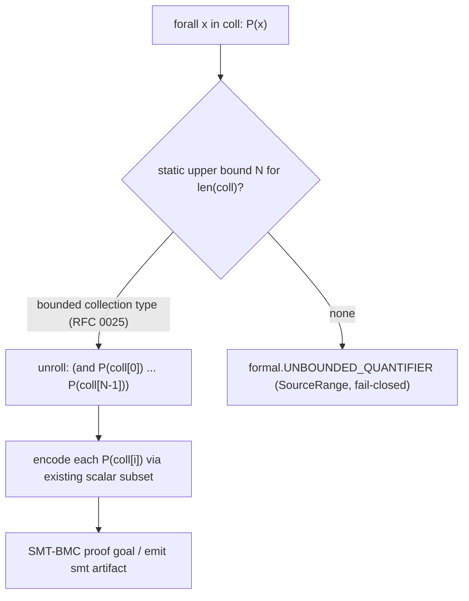

# RFC 0024: Bounded Collection Quantification in the Verifiable Subset

## Summary

Add bounded universal / existential quantification over `List` / `Set` / `Map`
values to AHFL's verifiable subset — `forall x in items: P(x)` and
`exists x in items: P(x)` — usable inside `requires` / `ensures` / `invariant`
contract clauses. Quantifiers are encoded into the existing SMT-BMC engine by
**finite unrolling to a static bound**, not by handing an unbounded `forall` to
the solver. This closes the one data-predicate gap [RFC 0017](0017-bmc-contract-semantics.zh.md)
left as follow-up work (Open Question 5, resolved 2026-08-24: "List/Map
quantification excluded to a follow-up RFC"), and is the roadmap M3 "second
moat" continuation — pushing contract semantics from scalars over the whole of a
node's data.

## Motivation

RFC 0017 stabilized data-predicate contract verification for the scalar subset
(`Bool` / `Int`, arithmetic, struct field access, comparisons) via an SMT-LIB
encoding (`src/verification/formal/smt_encode.cpp`) fed to a bounded / k-induction
engine (`smt_bmc.cpp`). Its `SmtSort` enum has exactly two members — `Bool`,
`Int` (`smt_encode.hpp:49`) — and anything touching a collection leaves the
subset with a `formal.NOT_IN_VERIFIED_SUBSET` diagnostic.

That is a real expressiveness cliff. AHFL's positioning ([RFC 0020](0020-strategic-positioning-embeddable-workflow-dsl.zh.md))
is an *agent workflow orchestration* DSL, and the values that flow between nodes
are overwhelmingly collections: a list of retrieved documents, a set of allowed
tools, a map of per-field scores. Today you cannot state "every retrieved doc is
non-empty" or "no tool outside the allow-set is ever called" as a *verified*
contract — only as an unchecked comment. The core property authors want to prove
about an orchestration is almost always quantified over a collection, so the
scalar-only subset verifies the least interesting contracts.

Without this decision, the verifiable subset stays scalar-only, `forall` /
`exists` never enter the language, and the "second moat" (formal verification of
real agent-workflow contracts) stalls at toy predicates.

## Goals

1. Introduce `forall <binder> in <collection>: <body>` and
   `exists <binder> in <collection>: <body>` expression syntax, usable anywhere
   a contract predicate is expected (`requires` / `ensures` / `invariant`, and
   nested inside other predicates).
2. Type-check the quantifier: the collection operand must be a `List<T>`,
   `Set<T>`, or `Map<K,V>`; the binder is bound at `T` (list/set element) or a
   `(K,V)` pair (map entry); the body must be `Bool` and remain in the verifiable
   subset (`effect Pure`, scalar leaves after the binder is substituted).
3. Encode bounded quantification into SMT-BMC by **finite unrolling** against a
   static per-collection length bound, producing a deterministic conjunction
   (`forall`) or disjunction (`exists`) — no SMT `forall`/array theory, so the
   subset stays decidable and fast.
4. Emit the unrolled encoding through the existing `ahflc emit smt` artifact so
   the SMT-LIB output stays inspectable and byte-deterministic.
5. When the collection's length cannot be statically bounded, reject the clause
   with an actionable `SourceRange` diagnostic — fail-closed, never silently
   drop the quantifier or verify a vacuous instance.

## Non-Goals

1. **No unbounded quantification / SMT array theory.** Handing `(forall ((i Int))
   ...)` over an unbounded array to the solver reintroduces undecidability and
   contradicts the BMC "bounded" contract. Quantifiers are always unrolled to a
   finite bound.
2. **No String content semantics.** Inherited from RFC 0017 Non-Goal 2: strings
   remain uninterpreted constants (equality only); a quantifier body may compare
   string elements for equality but not inspect their content.
3. **No nested-collection element quantification (first version).** `forall x in
   list_of_lists: forall y in x: ...` — quantifying over an element that is
   itself a collection with its own dynamic bound — is out of scope for v1;
   scalar-element and map-entry bodies only. Nested scalar quantifiers over two
   *independently bounded* collections are allowed.
4. **No runtime evaluation change.** `forall` / `exists` already have a natural
   runtime meaning (iterate + short-circuit); this RFC's runtime work is only to
   make the new syntax evaluate consistently with the verified semantics, not to
   change existing evaluation.
5. **No inference of the length bound from data.** The bound is a static property
   of the contract context (see Design); this RFC does not do range analysis to
   discover it.

## Design

### Bound source: where the finite length comes from

Unrolling needs a static length `N` for each quantified collection. That bound
comes from a **bounded collection type** — `List<T>(N)` / `Set<T>(N)` /
`Map<K,V>(N)` — introduced by
[RFC 0025](0025-bounded-collection-types.zh.md), the collection analog of the
scalar `Int(lo,hi)` refinement (RFC 0017). The bound for `forall x in coll` is
the declared capacity of `coll`'s type:

1. The **declared capacity** `N` of `coll`'s bounded collection type
   (`List<T>(N)` etc.) — the canonical, index-based source (RFC 0025).

If the collection type carries no capacity (an unbounded `List<T>`), the clause
is **rejected** (fail-closed) with `formal.UNBOUNDED_QUANTIFIER` — the author
must give the collection a bounded type to verify a quantified property over it.
This mirrors RFC 0017's philosophy: verification is bounded, and the bound is
explicit in the source, not guessed.



### Encoding: finite unrolling

For a bound `N`, with `coll[i]` the i-th element modeled as a fresh subset symbol
of the element sort:

- `forall x in coll: P(x)` → `(and P[x:=coll[0]] ... P[x:=coll[N-1]])`
  (the empty-collection case `N = 0` encodes to `true`, matching vacuous truth).
- `exists x in coll: P(x)` → `(or P[x:=coll[0]] ... P[x:=coll[N-1]])`
  (empty encodes to `false`).
- `Map<K,V>` entries bind a `(k, v)` pair; the body sees two subset symbols per
  entry.

Each `P[x:=coll[i]]` is encoded by the **existing** scalar encoder
(`encode_predicate`, `smt_encode.cpp`) after substituting the binder with the
element symbol — so quantification reuses, rather than replaces, the RFC 0017
subset rules. A body that leaves the scalar subset (touches a capability, a
non-pure expression, a string content op) rejects with the existing
`SmtEncodeRejection` reasons, now reachable through a quantifier body.

`SmtSort` gains no new member: elements are modeled at their **scalar** sort
(`Bool`/`Int`); the collection itself is never a first-class SMT sort — only its
finitely-many element symbols appear. This keeps the encoding inside the already
decidable, already tested fragment.

### Determinism

The unrolled term is generated in index order `0..N-1`, so `emit smt` output
stays byte-deterministic (RFC 0017's determinism guarantee). Element symbol names
are index-based (`coll@i`), never derived from a wall clock, pointer, or
iteration order of an unordered container — consistent with the artifact-identity
principle and Principle 2 (index-based identity).

### Grammar

`temporalExpr` / predicate expression grammar (`grammar/AHFL.g4`) gains a
quantifier production, lower-precedence than boolean connectives:

```
QuantifierExpr ::= ("forall" | "exists") Binder "in" Expr ":" Expr ;
Binder         ::= Ident | "(" Ident "," Ident ")" ;   // element, or (k,v) for Map
```

`forall` / `exists` / `in` become contextual keywords in predicate position
(they are not currently reserved; see Compatibility).

## User Impact

- **Source**: authors can write quantified contract clauses, e.g.
  `ensures: forall d in output.docs: non_empty(d.body);` or
  `invariant: always (forall t in ctx.called_tools: t in ctx.allow_set);`.
- **Diagnostics**: two new `SourceRange`-carrying diagnostics —
  `formal.UNBOUNDED_QUANTIFIER` (no static bound) and the existing
  `formal.NOT_IN_VERIFIED_SUBSET` now reachable from a quantifier body.
- **CLI / artifact**: `ahflc emit smt` output for a quantified clause shows the
  unrolled conjunction/disjunction; `ahflc verify` proves it (or returns a
  counterexample naming the offending index).
- **Counterexample**: a failing `forall` reports the element index and the
  element's modeled value, reusing the RFC 0017 counterexample projection.

## Compatibility and Migration

**Additive, effectively non-breaking.** `forall` / `exists` / `in` become new
reserved words (ANTLR implicit tokens in `grammar/AHFL.g4`). A repo-wide scan of
every `.ahfl` under `examples/`, `std/`, and `tests/` found **zero** uses of
these words as identifiers, so no existing source breaks; reserving them is safe
in practice. No existing contract changes meaning: a scalar-only contract encodes
exactly as before (the quantifier path is entered only for the new syntax), and
`emit smt` output for pre-existing contracts is byte-identical. The only
theoretical breakage is future source that tried to name a value `in` / `forall`
/ `exists`; such a name must be renamed. No migration is required for existing
code; the feature is opt-in per clause.

## Implementation Plan

1. **Grammar + parse** (`grammar/AHFL.g4`, parser): the `QuantifierExpr`
   production and AST node (a `std::variant` payload, index-based binder id — no
   string identity for the binder beyond its source name).
2. **Type check** (`src/compiler/semantics/`): collection-operand type rule,
   binder binding at element / `(K,V)` type, `Bool` body, purity/subset check of
   the body; `formal.UNBOUNDED_QUANTIFIER` when the bound is unresolved.
3. **Subset eligibility** (`src/verification/formal/subset.cpp`): a quantifier is
   eligible iff its collection is statically bounded and its body is eligible
   after binder substitution.
4. **SMT encoding** (`src/verification/formal/smt_encode.cpp`): unroll to the
   bound, substitute the binder with per-index element symbols, delegate the body
   to the existing scalar encoder, fold into `and` / `or`.
5. **BMC + emit** (`smt_bmc.cpp`, `smt_emit.cpp`): thread the unrolled term as a
   proof goal; `emit smt` renders it deterministically.
6. **Counterexample** (`counterexample.cpp`): map a falsifying model back to the
   offending element index.
7. **Spec** (`docs/spec/core-language.zh.md` §5.6): define the bounded-quantifier
   subset rule and replace the "List/Map quantification is follow-up work" note
   (line ~1298) with the now-specified semantics.

## Test Plan

- **Unit** (`tests/unit/verification/formal/`): unrolling of `forall`/`exists`
  over `List`/`Set`/`Map` at bounds 0 (vacuous true / false), 1, N; binder
  substitution correctness; `(k,v)` map binding.
- **Golden positive**: `emit smt` byte-exact output for a quantified clause at a
  fixed bound (determinism / index-ordered symbols).
- **Golden negative**: `formal.UNBOUNDED_QUANTIFIER` on an unbounded collection;
  `formal.NOT_IN_VERIFIED_SUBSET` on a quantifier body that calls a capability.
- **Solver integration** (real Z3, three-state like RFC 0017): a provable
  `forall` (`Safe`), a falsifiable one with a counterexample naming the index
  (`Unsafe`), and `solver_unavailable` skip parity.
- **Type-check negatives**: non-collection operand, non-`Bool` body, impure body.
- **Regression**: existing `ahfl.formal.*` suites and `emit smt` goldens unchanged
  for scalar-only contracts (byte-identical).

## Rollout and Stabilization

1. `draft` → `review`: resolve every Open Question, `language` + `formal` owner
   sign-off.
2. `accepted` → `implementing`: slices per Implementation Plan; grammar/type
   before encoding before emit/counterexample.
3. `implemented`: parse, type check, subset, encoding, BMC/emit, counterexample,
   spec §5.6, and tests all landed.
4. `stabilized`: semantics in `docs/spec`, `emit smt` artifact shape documented in
   reference, real-Z3 evidence green.

## Alternatives

1. **SMT array theory + real `forall`.** Model collections as SMT arrays and emit
   an unbounded `(forall ...)`. **Loses**: reintroduces undecidability (the array
   fragment with quantifiers is not reliably decidable), makes verification time
   unpredictable, and breaks the BMC "everything is bounded" contract that makes
   RFC 0017's results trustworthy and fast. AHFL deliberately trades completeness
   for a decidable bounded fragment.
2. **Keep collections out of the subset; verify only scalars (status quo).**
   **Loses**: the properties authors actually care about in an orchestration DSL
   are quantified over collections; a scalar-only verifier proves the least
   valuable contracts and leaves the second moat shallow.
3. **Runtime-only checking of quantified contracts (assert at execution).**
   **Loses**: gives no static guarantee, only per-run failure, which is exactly
   what formal verification exists to improve on; and it cannot cover inputs not
   seen at runtime.

## Open Questions

All three resolved for review (2026-08-25).

1. ~~Bound-source syntax~~ (resolved): **type-only for v1.** The per-collection
   bound comes solely from the collection's bounded type (`List<T>(N)`,
   introduced by [RFC 0025](0025-bounded-collection-types.zh.md)) — one source
   of truth in the type system, no clause-local bound. A clause-local
   `(bound N)` override is a possible ergonomic follow-up, not v1.
2. ~~Map unrolling order~~ (resolved): **normalized key order.** `Map` runtime
   values are order-normalized (RFC P7); the unrolling keys element symbols on
   that normalized order, so `emit smt` output is deterministic regardless of
   insertion order.
3. ~~Interaction with `always` / temporal wrappers~~ (resolved): **temporal layer
   unchanged.** A quantified `invariant` unrolls its data quantifier to a scalar
   predicate first; the existing temporal encoding then treats that predicate as
   an atom. No new temporal-encoding rule.

## Decision History

- 2026-08-25: Draft opened. Follow-up to [RFC 0017](0017-bmc-contract-semantics.zh.md)
  Open Question 5 (List/Map quantification, resolved 2026-08-24 as "excluded to a
  follow-up RFC"). Scopes bounded `forall`/`exists` over `List`/`Set`/`Map` via
  finite unrolling into the existing scalar SMT-BMC subset; explicitly rejects SMT
  array theory / unbounded quantification to preserve decidability. Roadmap M3
  ("second moat") continuation.
- 2026-08-25: All three Open Questions resolved (bound source = collection type /
  refinement only; Map unrolled in normalized key order; temporal layer unchanged,
  quantifier unrolls to a scalar atom beneath it). Owners / shepherd assigned,
  tracking_issue / discussion set to none. Status draft → review.
- 2026-08-25: Final comment period — no blocking concerns. The design reuses the
  stabilized RFC 0017 scalar encoder unchanged (quantifiers unroll into it) and
  adds no new SMT sort or solver theory, so the verified fragment is unchanged in
  power and decidability; the only new surface is contextual `forall`/`exists`
  syntax and a fail-closed unbounded-collection diagnostic. Status review → fcp.
- 2026-08-25: language + formal owner sign-off; no design changes in fcp. Status
  fcp → accepted. Ready to implement per the Implementation Plan (grammar/type →
  subset → encoding → BMC/emit → counterexample → spec).
- 2026-08-25: Status accepted → implementing. Slice 1 (grammar): `quantifierExpr`
  added to `grammar/AHFL.g4` as a lowest-precedence `expr` alternative
  (`('forall'|'exists') quantifierBinder 'in' expr ':' expr`). Compatibility
  refined: `forall`/`exists`/`in` are new reserved words (implicit tokens), safe
  because a repo-wide scan found zero identifier uses of them in any `.ahfl`.
- 2026-08-26: Slices 1-2 landed (parse + type check + IR lowering). Added
  `ast::QuantifierExprSyntax` and wired it through every exhaustive `ExprSyntax`
  visitor (frontend, ast printer, ast invariant validator, formatter, LSP
  semantic tokens + server, const-sema, typed-HIR lowering dispatch). Type
  checking (`src/compiler/semantics/typecheck_expr.cpp` `visit_quantifier`):
  the collection operand must be a nominal `List`/`Set`/`Map`
  (`typecheck.QUANTIFIER_REQUIRES_COLLECTION`), the binder(s) bind at the
  element / `(K,V)` type in a child scope that shadows outer bindings, and the
  body is checked against `Bool` (`typecheck.QUANTIFIER_BODY_REQUIRES_BOOL`).
  Added `ir::QuantifierExpr` (name-based binders mirroring `LambdaExpr`) with the
  full 8-location IR sweep plus the runtime-evaluator + typed-HIR-serialization
  arms; contract-clause quantifiers now lower to `ir::QuantifierExpr` for the
  formal backend to consume (the runtime evaluator rejects them as
  verification-only). Reserved-word migration exercised: the one identifier use
  of `in` in an inline test fixture was renamed. New unit test
  `tests/unit/compiler/semantics/bounded_quantifier.cpp` (label `rfc0024`)
  covers forall/List, exists/Set, forall/Map `(k,v)`, and both negatives.
  `formal.UNBOUNDED_QUANTIFIER` (fail-closed bound resolution) is reserved for
  the subset-eligibility slice (3).
- 2026-08-26: Prerequisite discovered while starting slice 3. The Design assumed
  a static per-collection length bound already existed in the type layer; it does
  not — AHFL has scalar `Int(lo,hi)` / `String(lo,hi)` refinements only, and
  collections are unrefined nominal `StructT`. Slices 3-7 (SMT unrolling, BMC,
  counterexample, spec) are blocked on a bound source. Resolution: introduce
  bounded collection types `List<T>(N)` via
  [RFC 0025](0025-bounded-collection-types.zh.md) (the collection analog of the
  scalar refinement), then resume slices 3-7 reading the capacity off the IR
  `TypeRef`. Design "Bound source" section + Open Question 1 corrected to cite
  RFC 0025 instead of a non-existent bounded type / `bounded` refinement.
- 2026-08-26: Status implementing → implemented. With [RFC 0025](0025-bounded-collection-types.zh.md)
  supplying the capacity bound, the remaining slices landed: slice 3-4 (subset
  eligibility + SMT encoding by finite unrolling) in db39a056 — the encoder reads
  the collection's IR capacity, unrolls `forall`→`(and …)` / `exists`→`(or …)`
  with index-based element symbols `coll@i`, empty→`true`/`false`, and
  fail-closes unbounded collections with `formal.UNBOUNDED_QUANTIFIER`; slice 5
  (BMC + emit) is delivered by `smt_emit`/`smt_bmc` consuming the encoder output
  unchanged; slice 6 (counterexample) maps `coll@i`→`coll[i]` (b4e0d2ec); slice 7
  (spec §5.6) in b2e77158. Unit coverage: smt_encode forall/exists/vacuous/
  unbounded/determinism. Stabilization pending release-evidence coverage of a
  quantified contract end-to-end.
