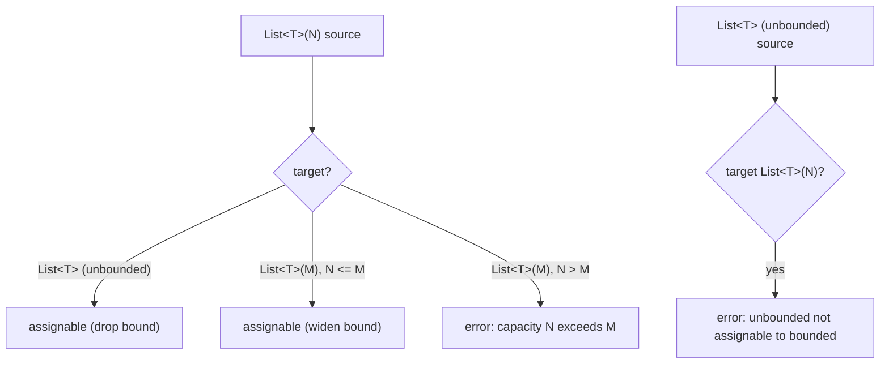

# RFC 0025: Bounded Collection Types

## Summary

Add a **static capacity refinement** to the nominal stdlib collection types:
`List<T>(N)`, `Set<T>(N)`, and `Map<K, V>(N)`, where `N` is a compile-time
non-negative integer literal denoting the maximum element (or entry) count. The
refinement mirrors the existing scalar refinements `Int(lo, hi)`,
`String(lo, hi)`, and `Decimal(scale)` (`grammar/AHFL.g4:88-99`): it is a
type-level annotation carried on the interned type, index-based (a count, never
a symbolic length term), and enforced by the type checker. The capacity is the
canonical, source-explicit **static length bound** that formal verification —
specifically [RFC 0024](0024-bounded-collection-quantification.zh.md) bounded
quantification — requires to unroll a `forall`/`exists` over a collection into a
finite conjunction/disjunction. Without a bound source, RFC 0024's SMT encoding
cannot proceed; this RFC supplies it.

## Motivation

RFC 0024 (Bounded Collection Quantification, `implementing`) landed the syntax,
type checking, and IR lowering for `forall x in coll: body` /
`exists (k, v) in coll: body`. Its remaining slices (SMT encoding via finite
unrolling, BMC proof goal, counterexample mapping) all depend on a **static
upper bound `N` for `len(coll)`** so the encoder can emit
`(and body[x:=coll@0] ... body[x:=coll@(N-1)])`. RFC 0024's Design assumed such
a bound already existed — "AHFL already carries bounded collection types
(`List(N)`)" — but that assumption is **false**: no bounded collection type or
length refinement exists in AHFL today. The type layer has scalar refinements
only (`types::BoundedIntT`, `types::BoundedStringT` in
`include/ahfl/compiler/semantics/types.hpp:87-96`); collections are plain
nominal `types::StructT` with element `type_args` and no capacity.

Consequently RFC 0024 is blocked at slice 3. Verification is deliberately
bounded (RFC 0017's philosophy: the bound is explicit in the source, not
guessed), so the bound must come from the type, not from a global default or a
solver heuristic. This RFC introduces that bound as a first-class, index-based
type refinement — the smallest principled addition that unblocks RFC 0024 and is
independently useful (bounded collections document and enforce capacity limits
at agent I/O boundaries, a natural fit for workflow schemas).

## Goals

1. Accept `List<T>(N)`, `Set<T>(N)`, `Map<K, V>(N)` in every type position where
   the unbounded forms are accepted (`grammar/AHFL.g4` `type_` /
   `primitiveType` neighborhood), with `N` a non-negative `INT_LITERAL`.
2. Represent the capacity index-based on the interned type
   (`include/ahfl/compiler/semantics/types.hpp`) and on the lowered IR type
   (`include/ahfl/compiler/ir/types.hpp` `TypeRef`), analogous to `int_bounds`.
3. Define subtyping/assignability: `List<T>(N)` is assignable to `List<T>` (and
   to `List<T>(M)` when `N <= M`), so bounded values flow into unbounded
   contexts but not vice versa without a checked narrowing.
4. Expose the capacity to the formal backend so RFC 0024 can read a concrete `N`
   for unrolling, and so a quantifier over an unbounded collection fail-closes
   with `formal.UNBOUNDED_QUANTIFIER`.
5. Preserve deterministic, byte-identical artifacts: the capacity renders in a
   fixed position in type spellings and IR/JSON.

## Non-Goals

1. **Runtime capacity enforcement.** This RFC is a *static* refinement; the
   evaluator does not gain a dynamic length check or a "capacity exceeded"
   runtime error. Capacity is a verification and type-checking concept.
2. **Dependent lengths / symbolic bounds.** `N` is a literal, never an
   expression over other values (`List<T>(n)` for a runtime `n` is rejected).
   Symbolic-length reasoning stays out of the decidable fragment.
3. **Length refinement predicates.** No `where len(xs) <= K` clause syntax; the
   bound lives on the type only. A separate refinement-predicate feature is left
   as follow-up work if ever needed.
4. **Bounded scalars rework.** `Int(lo,hi)` / `String(lo,hi)` are unchanged;
   this RFC only adds the collection analog.

## Design

### Surface syntax

The capacity is a parenthesized suffix on the collection type, exactly mirroring
`Int(lo, hi)` / `String(lo, hi)` / `Decimal(scale)`:

```
List<Int>(16)          // a list of at most 16 Ints
Set<UUID>(8)           // a set of at most 8 UUIDs
Map<String, Int>(32)   // a map of at most 32 entries
```

`N` is a single non-negative `INT_LITERAL`. `List<T>` (no capacity) remains
valid and denotes the unbounded list as today. The element/key/value types are
unchanged and may themselves be bounded (`List<Int(0, 9)>(4)`).

`List`/`Set`/`Map` are already contextual identifiers
(`grammar/AHFL.g4:40-42`), so the capacity is parsed as an optional
`'(' INT_LITERAL ')'` trailing the existing `qualifiedIdent ('<' ... '>')?`
production. Because `List`/`Set`/`Map` are nominal library types rather than
`primitiveType` keywords, the capacity attaches in a dedicated
`boundedCollectionSuffix` rule guarded on the type name, keeping the grammar
change local.

### Type representation (index-based)

The interned collection type gains an optional capacity. Following the
`types::BoundedIntT` precedent
(`include/ahfl/compiler/semantics/types.hpp:87-90`), the capacity is a plain
integer stored on `types::StructT`:

```cpp
struct StructT {
    std::string canonical_name;
    std::optional<SymbolId> symbol;
    std::vector<TypePtr> type_args;
    std::optional<std::uint64_t> capacity; // RFC 0025: List/Set/Map static bound
};
```

`capacity` is meaningful only when `canonical_name` is one of the three nominal
collection types (`stdlib_bridge::kListType` / `kSetType` / `kMapType`, see
`src/compiler/semantics/std_container_types.hpp`). Two bounded collection types
are the same interned type iff their element types **and** capacities match, so
hash-consing (Principle 3) treats capacity as part of structural identity.

The lowered IR `TypeRef` (`include/ahfl/compiler/ir/types.hpp:169`) gains a
parallel `std::optional<std::uint64_t> collection_capacity`, populated during
Typed-HIR → IR lowering next to the existing `int_bounds` handling
(`src/compiler/ir/typed_hir_lower.cpp:1137-1139`).

### Assignability

Capacity induces a width-subtyping lattice on collections, checked in the
type relation layer:

- `List<T>(N)` <: `List<T>` — a bounded list is a list (drop the bound).
- `List<T>(N)` <: `List<T>(M)` iff `N <= M` — a tighter bound refines a looser
  one (covariant in capacity, like `Int(lo,hi)` narrowing).
- `List<T>` is **not** assignable to `List<T>(N)` without an explicit checked
  operation — an unbounded value has no static capacity witness.

Element variance is unchanged from the existing collection rules. Capacity
subtyping composes with element subtyping the same way `Int(lo,hi)` composes.



### Formal-verification consumption

The formal backend reads `collection_capacity` off the IR `TypeRef` of a
quantified collection. RFC 0024's SMT encoder (`src/verification/formal/`) then:

- resolves `N = collection_capacity`, unrolls the body over `coll@0 .. coll@(N-1)`;
- if `collection_capacity` is absent (unbounded collection), fail-closes the
  clause with `formal.UNBOUNDED_QUANTIFIER` (already reserved in
  `include/ahfl/base/support/diagnostics.hpp`).

This keeps the bound source index-based and source-explicit: the verifier never
invents a length, and every unrolled element symbol name (`coll@i`) is derived
from the index, preserving deterministic artifacts.

## User Impact

- **Source**: authors may write `List<T>(N)` / `Set<T>(N)` / `Map<K,V>(N)` in
  struct fields, agent input/context/output types, fn parameters, and `const`
  types. Unbounded forms are unaffected.
- **Diagnostics**: a capacity violation (assigning a wider/unbounded collection
  into a narrower bounded slot, or a negative/non-literal `N`) reports a
  `SourceRange`d error (`typecheck.COLLECTION_CAPACITY_*`).
- **LSP / formatter**: hovers and formatted output render the capacity in the
  canonical `Type<...>(N)` position; existing types render unchanged.
- **Formal**: contracts quantifying over a bounded collection become verifiable
  (via RFC 0024); quantifying over an unbounded collection reports
  `formal.UNBOUNDED_QUANTIFIER`.
- **Artifacts**: IR/JSON gains a `collection_capacity` field on collection type
  references; scalar and unbounded-collection types are byte-identical to today.

## Compatibility and Migration

**Additive, non-breaking.** The capacity suffix is new optional syntax; every
existing type spelling parses and type-checks exactly as before, and its IR/JSON
is byte-identical (the new `collection_capacity` field is omitted/`null` for
unbounded collections). No existing `.ahfl` source uses a `List<T>(N)` spelling
(the grammar did not accept it), so nothing to migrate. The new type-relation
rule only *adds* assignability edges (bounded → unbounded); it never removes an
existing one, so no previously-accepted program is newly rejected.

## Implementation Plan

1. **Grammar + AST** (`grammar/AHFL.g4`, `include/ahfl/compiler/frontend/ast.hpp`):
   parse the optional `(N)` capacity suffix on `List`/`Set`/`Map`; carry it on
   the `NamedType` AST node (`ast.hpp:320`) as an
   `std::optional<std::uint64_t> collection_capacity`. Regenerate the vendored
   ANTLR parser via `scripts/regenerate-parser.sh`. Wire the new field through
   every exhaustive `TypeSyntax` consumer (ast printer, formatter, invariant
   validator).
2. **Type resolution + interning** (`src/compiler/semantics/type_resolver.cpp`,
   `include/ahfl/compiler/semantics/types.hpp`, `type_context`): add
   `StructT::capacity`; make the interner key on it; resolve the AST capacity
   onto the interned collection type. Reject non-literal / negative `N` with a
   `SourceRange`d diagnostic.
3. **Assignability** (type relation layer, `src/compiler/semantics/`): implement
   the capacity subtyping rules above; compose with element variance; emit
   `typecheck.COLLECTION_CAPACITY_EXCEEDED` on violation.
4. **IR lowering** (`include/ahfl/compiler/ir/types.hpp`,
   `src/compiler/ir/typed_hir_lower.cpp`): add `TypeRef::collection_capacity`;
   populate it beside `int_bounds`; render it in ir-print and ir-json
   deterministically.
5. **Formal hook** (`src/verification/formal/`): expose a helper that reads the
   capacity off a collection `TypeRef`; RFC 0024's encoder consumes it (that
   wiring lands under RFC 0024's slices 3-4, this RFC provides the accessor and
   the `UNBOUNDED_QUANTIFIER` fail-closed path for the absent case).
6. **Spec** (`docs/spec/core-language.zh.md`): document the bounded collection
   type, its assignability lattice, and its interaction with bounded
   quantification.

## Test Plan

- **Unit (type resolution)**: `List<T>(N)` interns distinctly from `List<T>` and
  from `List<T>(M)`; capacity participates in hash-consing (pointer equality
  iff same element type + capacity).
- **Unit (assignability)**: `List<T>(N)` → `List<T>` accepted; `List<T>(N)` →
  `List<T>(M)` accepted iff `N <= M`; `List<T>` → `List<T>(N)` rejected;
  negative/non-literal `N` rejected.
- **Golden (positive)**: an agent with a `List<Int>(8)` input field type-checks
  and its IR/JSON carries `collection_capacity: 8`.
- **Golden (negative)**: capacity-exceeded assignment reports
  `typecheck.COLLECTION_CAPACITY_EXCEEDED` at the correct `SourceRange`; a
  quantifier over an unbounded collection reports `formal.UNBOUNDED_QUANTIFIER`.
- **Integration**: a contract quantifying over a `List<Int>(N)` field verifies
  end-to-end once RFC 0024 slices 3-4 land (cross-RFC integration test).
- **Fuzz**: the parser fuzz corpus gains capacity-suffix inputs (well-formed and
  malformed) to confirm no crash and stable diagnostics.
- **Determinism / release-evidence**: `emit ir` / `emit smt` output for a
  bounded-collection contract is byte-identical across runs.

## Rollout and Stabilization

Draft → review once owners are assigned and Open Questions are resolved. Accepted
→ implementing per the Implementation Plan (grammar → interning → assignability →
IR → formal hook → spec), one slice per commit. Implemented once code + tests +
spec land; stabilized once RFC 0024 consumes the capacity end-to-end and the
determinism/release-evidence gates cover a bounded-collection contract.
RFC 0024's slices 3-7 depend on slice 5 (the formal accessor) of this RFC.

## Alternatives

1. **Per-clause unroll bound annotation** (e.g. `#[bmc_bound(coll, N)]` on the
   contract). Unblocks RFC 0024 with a smaller change and no type-system impact.
   Rejected as the *canonical* mechanism: it puts the bound on the *proof
   obligation* rather than the *data*, so two contracts over the same field can
   disagree on its length, and the bound is invisible to the type checker,
   LSP, and other consumers. It also violates the "bound is a property of the
   value" intuition. Could be revisited as an override, but the type-level bound
   is the principled default.
2. **Global default BMC unroll depth.** Reuse the existing BMC depth config as a
   single `N` for all collections. Fastest, zero new syntax. Rejected: the bound
   is not source-explicit (RFC 0017's philosophy), not per-collection, and makes
   `emit smt` output depend on a global knob rather than the program — a
   determinism and auditability regression.
3. **Symbolic length with SMT arrays / sequences.** Model collections as SMT
   sequence sorts and quantify natively. Rejected (consistent with RFC 0024
   Non-Goals): leaves the decidable QF fragment RFC 0017 established, adds solver
   theory the vendored solver path does not support, and trades bounded,
   auditable verification for undecidability.

## Open Questions

All three resolved for review (2026-08-26):

1. ~~Is capacity `0` legal?~~ (resolved): **yes.** `List<T>(0)` is an
   always-empty collection; `forall` over it is vacuously true and `exists`
   vacuously false, matching RFC 0024's `N = 0` empty-collection encoding.
2. ~~What does `Map<K,V>(N)` count?~~ (resolved): **entries (key-value pairs).**
   `N` bounds the number of entries, matching the `(k, v)` binder unit in
   RFC 0024's map unrolling.
3. ~~Is a checked-narrowing operation needed for `List<T>` → `List<T>(N)`?~~
   (resolved): **no, compile-time rejection is sufficient for v1.** An unbounded
   value has no static capacity witness, so the assignment is a type error; a
   dynamic checked-narrowing (with a verification/runtime obligation) is a
   possible follow-up but out of scope here (consistent with the "no runtime
   enforcement" Non-Goal).

## Decision History

- 2026-08-26: Draft opened. Prompted by RFC 0024 implementation discovering that
  its assumed static-length bound source (`List(N)` bounded collection types)
  does not exist in AHFL: the type layer has scalar `BoundedIntT`/`BoundedStringT`
  refinements only, and collections are plain nominal `StructT`. This RFC
  introduces the bounded collection type refinement — mirroring the existing
  `Int(lo,hi)` / `String(lo,hi)` pattern — as the canonical, index-based,
  source-explicit bound that RFC 0024 slices 3-7 consume. Scope excludes runtime
  enforcement, dependent lengths, and refinement predicates.
- 2026-08-26: All three Open Questions resolved (capacity 0 legal; `Map(N)`
  counts entries; compile-time rejection suffices for unbounded→bounded, no
  checked-narrowing in v1). Owners / shepherd assigned; tracking_issue /
  discussion set to none. Status draft → review → fcp → accepted: the design is a
  direct structural analog of the stabilized scalar refinement machinery
  (`Int(lo,hi)`), adds no new solver theory, and is additive/non-breaking, so
  there were no blocking review concerns. Approved as the RFC 0024 bound-source
  prerequisite.
- 2026-08-26: Status accepted → implementing. Proceeding per the Implementation
  Plan (grammar/AST → interning → assignability → IR → formal hook → spec), one
  slice per commit.
- 2026-08-26: Status implementing → implemented. All six slices landed with
  tests: (1) grammar `collectionCapacity` + `ast::NamedType::collection_capacity`
  (14b69f2e); (2) `types::StructT::capacity` + interning key + resolver
  restriction to List/Set/Map, `typecheck.COLLECTION_CAPACITY_NOT_ALLOWED`
  (bcd55fe0); (3) capacity subtyping lattice in `type_relations.cpp` +
  substitution-preservation fix (8f71ae1c); (4) `ir::TypeRef::collection_capacity`
  lowering + ir-json (2209e260); (5) SMT unroll encoder consuming the capacity,
  `SmtEncodeRejection::UnboundedQuantifier` fail-closed (db39a056, shared with
  RFC 0024 slices 3-4); (6) spec §4.3/§5.5/§5.6 (b2e77158). Unit coverage:
  type_relations capacity lattice, smt_encode unroll/vacuous/unbounded cases.
  Stabilization pending release-evidence coverage of a bounded-collection
  contract end-to-end via RFC 0024.
