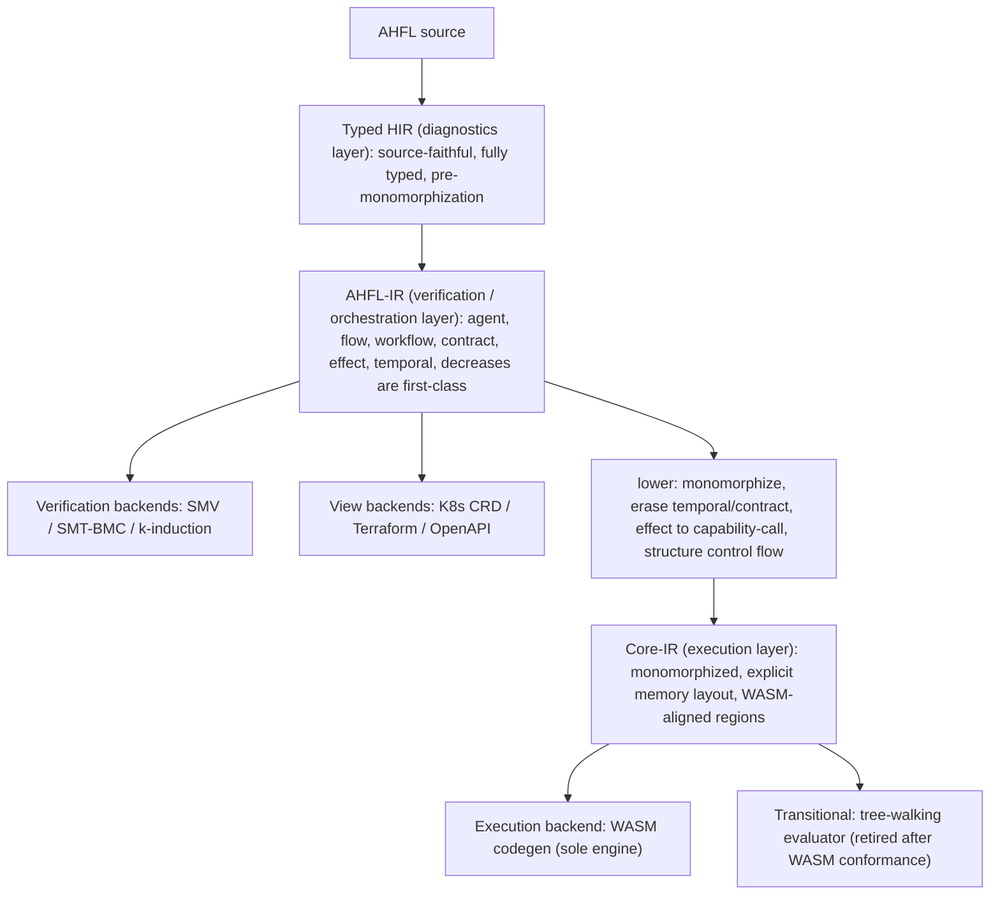
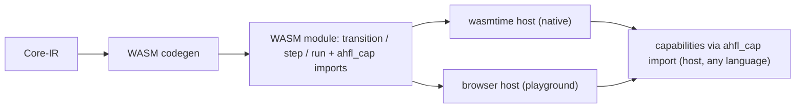

# RFC 0026: IR Tower and Execution Model

## Summary

本 RFC 把 [RFC 0020](0020-strategic-positioning-embeddable-workflow-dsl.zh.md)
「架构北极星」的前两条（IR 塔、WASM 唯一执行引擎）从定位判据展开为可实施的设计。它做两件事：

1. **用三层 IR 塔取代当前的单层 IR**：`Typed HIR`（诊断层，已有）→ `AHFL-IR`（验证 / 编排层）→
   `Core-IR`（执行层）。验证后端（SMV/SMT/BMC）消费 `AHFL-IR`，执行后端（WASM）消费 `Core-IR`，
   两条路径在塔上**分叉**（Dafny 式），互不污染。
2. **确立 WASM 为唯一执行引擎**：`Core-IR → WASM` codegen 消费 [RFC 0019](0019-wasm-runtime-model.zh.md)
   的 `ahfl_cap` capability import 契约；当前的 tree-walking evaluator
   （`src/runtime/evaluator/evaluator.cpp`）判定为**过渡形态**，在 WASM codegen 通过一致性
   （conformance）验收后**原子删除**。不自研虚拟机。

本 RFC 是**架构与分片计划**决策；具体的 WASM 字节序列 lowering 规则由本 RFC 的
Implementation Plan 分片承载并逐片落地，不在本文一次写死指令级细节。

## Motivation

当前 IR 是**单层**的：`ir::Program`（`include/ahfl/compiler/ir/program.hpp`）持有一个扁平
`ExprArena`，`ExprNode` 是一个 20-alternative 的 `std::variant`
（`include/ahfl/compiler/ir/expr.hpp:347`），`Decl` 覆盖 module/const/struct/enum/agent/flow/
workflow/contract/fn/trait/impl 等（`include/ahfl/compiler/ir/decl.hpp`）。**同一层 IR 同时**
被以下所有消费者共享：

- 形式化验证：`src/compiler/backends/smv/smv.cpp`、`src/verification/formal/`（SMT-BMC、
  k-induction、counterexample）。
- 执行：`src/runtime/evaluator/evaluator.cpp`（tree-walking，2000+ 行）。
- 五个 emit backend：WASM（当时仅 WAT 骨架的部署视图后端；RFC 0019 的 WAT 路径
  已于 2026-09-29 删除,本 RFC 的可执行二进制发射器现位于
  `src/compiler/backends/wasm/`）、
  K8s CRD / Terraform / OpenAPI（`src/compiler/backends/infra/`）、IR-JSON
  （`src/compiler/ir/ir_json.cpp`）。

这带来三个不做决策就无法消除的结构性问题：

1. **Altitude 冲突（海拔混装）**：`TemporalExprNode`（`expr.hpp:421`，temporal 算子只有验证
   关心）与执行相关节点、`ContractDecl`（`decl.hpp:213`，验证语义）与 `FnDecl` 执行体挤在
   同一套 IR 里。每个执行后端都被迫"处理或显式拒绝"自己根本不消费的验证节点，反之亦然。
   单态化（执行必需）与 temporal/contract 保真（验证必需）是**互相冲突的降级方向**，压在
   一层 IR 上无法同时最优。

2. **`8-location sweep` 是设计债**：`expr.hpp:329-344` 有一份权威 checklist——每新增一个
   `ExprNode` alternative，必须手改 8 个文件（analysis / ir_print / verify / ir_json /
   opt_lower / visitor / typed_hir_lower / assurance），"漏一处即静默 data-loss bug"。这不是
   纪律问题，是**单层 IR 无分层职责 + 无单一真相源**的必然结果。（消灭 sweep 的机制由
   [RFC 0027](0027-query-frontend-and-ir-ssot.zh.md) 承载；本 RFC 负责把节点按层拆开，缩小每层
   的 variant 面。）

3. **执行路径不是顶尖形态**：唯一执行器是 tree-walking 解释器，无法产出可部署产物、无法上
   浏览器、无法达到编译执行的性能。[RFC 0019](0019-wasm-runtime-model.zh.md) 明确把完整 WASM
   codegen 列为 Non-Goal（只定了 ABI 契约与 WAT 骨架），留下"能 emit 一段跑不了真实 agent 的
   WAT"的缺口。

不做本决策，AHFL 的编译器基座停在"单层 IR + 解释执行",与 RFC 0020 声称的"可验证 + 可高效
嵌入多宿主"北极星有结构性差距。

## Goals

1. **确立三层 IR 塔的职责边界**：明确每层持有什么、擦除什么、被谁消费，使"某构造属于哪一层"
   与"某后端消费哪一层"成为架构约束而非惯例。
2. **确立验证路径与执行路径在塔上的分叉点**：验证后端消费 `AHFL-IR`；执行后端消费 `Core-IR`。
3. **定义 `AHFL-IR → Core-IR` 的降级语义**：单态化、effect 降为显式 capability-call、
   temporal/contract 擦除、控制流结构化（对齐 WASM region）、ADT/闭包显式内存表示。
4. **确立 WASM 为唯一执行引擎**，并定义 `Core-IR → WASM` codegen 的值表示 / 内存模型 /
   capability import 绑定 / 分片交付顺序。
5. **定义 tree-walking evaluator 的退役路径**：conformance 验收标准 + 原子删除条件，使"删除"
   成为可执行的验收门，而非口号。
6. **保持 `AGENTS.md` 非协商原则**：索引式身份、hash-consed 类型 + flat store、
   `std::variant` + visitor、诊断带 `SourceRange`；并保持 RFC 0020 定位不变（计算留宿主、
   capability 是唯一外部效应入口）。

## Non-Goals

1. **不在本 RFC 写死指令级 lowering 表**。`Core-IR → WASM` 的逐节点字节序列由 Implementation
   Plan 分片承载、随实现落地为文档；本 RFC 定层、定值表示、定分叉、定分片。
2. **不引入 MLIR / LLVM**。见 Alternatives：对 AHFL 体量属过度工程；塔用现有
   `std::variant` + flat arena + hash-consing 手写。
3. **不改变 RFC 0020 定位或 A/B 型表达力边界**。计算仍留宿主；本 RFC 只重构编译器内部结构。
4. **不改 capability 嵌入 ABI 的字节契约**。复用 [RFC 0019](0019-wasm-runtime-model.zh.md) /
   [RFC 0021](0021-capability-embedding-abi.zh.md) 的 `ahfl_cap` `(ptr,len)->ptr` 契约。
5. **不做 query 化前端与 IR 单一真相源派生**。那是 [RFC 0027](0027-query-frontend-and-ir-ssot.zh.md)。
   本 RFC 的分层为其铺路，但两者可独立评审。
6. **不承诺 GC**。Core-IR 的内存模型倾向 arena / 区域式管理（见 Open Questions），不引入
   通用垃圾回收。

## Design

### 塔的总览



三层各自的职责、身份、消费者：

| 层 | 持有 | 擦除 / 尚未做 | 主消费者 | 现状锚点 |
| --- | --- | --- | --- | --- |
| **Typed HIR** | 源码 range、完整类型、泛型参数、trait bound、诊断上下文 | 未 lower 到 IR | 诊断 / LSP / const eval | `include/ahfl/compiler/semantics/typed_hir.hpp`、`typed_hir_lower.cpp` |
| **AHFL-IR** | agent 状态机 / flow / workflow DAG / contract / effect 分级 / temporal 算子 / decreases 度量，全为一等公民；泛型**未**单态化 | 无内存布局、无指令级控制流 | 验证后端、视图后端 | 当前 `ir::Program` 的编排 + 验证子集 |
| **Core-IR** | 单态化后的函数体、显式 capability-call、结构化控制流（block/loop/if region）、ADT/闭包显式内存表示、值表示（见下） | temporal / contract / decreases **已擦除**（验证在上层完成）；无源码级泛型 | 执行后端（WASM）、过渡期 evaluator | 新增层 |

**关键不变式**：一个构造只在它该在的层出现。`temporal` / `contract` / `decreases` 在
`AHFL-IR` 是一等公民、在 `Core-IR` 不存在（已被验证消费并擦除）；单态化实例、内存布局在
`Core-IR` 存在、在 `AHFL-IR` 不存在。这消除 Motivation §1 的 altitude 冲突。

### 为什么是三层，而不是两层或四层

- **不能两层**（Typed HIR + 单一 IR，即现状）：验证要保 temporal/contract、执行要单态化擦除
  temporal/contract——同一层无法同时满足，就是今天的冲突。
- **不必四层**（如再插一个 STG/CPS 层）：AHFL 的执行语义是**结构化编排 + capability 调用**，
  不是通用高阶函数求值；闭包是受限的（RFC 0013 Non-Goal：无捕获列表首版），不需要 GHC 那样
  的 STG。Core-IR 直接对齐 WASM 结构化控制流即可。
- **三层的每层都有明确、互斥的消费者**：诊断 / 验证 / 执行。这是 Rust（HIR/MIR 面向不同
  消费者）与 Swift（SIL raw/canonical 分相）验证过的划分。

### AHFL-IR：验证 / 编排层

`AHFL-IR` 是 AHFL 的独特价值层，保留当前 `ir::Program` 里所有**编排与验证语义**：

- **一等公民**：`AgentDecl`（`decl.hpp:180`）状态机、`FlowDecl`（`decl.hpp:261`）、
  `WorkflowDecl`（`decl.hpp:293`）DAG、`ContractDecl`（`decl.hpp:213`）、`CapabilityDecl`
  的 effect 分级（`CapabilityEffectKind`）、`TemporalExprNode`（`expr.hpp:421`）、decreases
  度量（RFC 0013 KR5.3 已接入的 `decreases_recognizer`）。
- **泛型未单态化**：`FnDecl` / `TraitDecl` / `ImplDecl`（`decl.hpp:340/384/402`）保留类型参数与
  trait bound——验证在这一抽象层进行（SMV 建模状态机/temporal，SMT-BMC 建模 bounded 契约）。
- **消费者**：`src/compiler/backends/smv/smv.cpp`、`src/verification/formal/*`、视图后端
  （K8s/Terraform/OpenAPI 投影编排结构）。

`AHFL-IR` 相对今天 `ir::Program` 的**净化**：移出纯执行细节（如把容器字面量 lower 成
`CallExpr` 这类"为执行方便"的构造下沉到 Core-IR 的降级步骤里，`AHFL-IR` 保留更贴近源码语义
的形式），使验证后端看到的 IR 不含"为跑而做"的噪声。

### Core-IR：执行层

`Core-IR` 是 `AHFL-IR` 经 `lower` 得到的执行专用层。降级步骤（每步都是一个 pass，
Implementation Plan 分片）：

1. **单态化（monomorphization）**：泛型 `FnDecl`/`ImplDecl` 按具体类型实例化为单态副本
   （Rust MIR 式，索引式实例身份，复用现有 `include/ahfl/compiler/ir/mangling.hpp` 的
   name mangling 作为实例 key）。Core-IR 无类型参数。
2. **effect 降为显式 capability-call**：`AHFL-IR` 的 capability 调用（带 effect 分级）在
   Core-IR 降为一个显式的 `CapabilityCall{ symbol_id, args_ptr, args_len }` 节点，直接对应
   [RFC 0019](0019-wasm-runtime-model.zh.md) 的 `ahfl_cap` import 帧。这是"计算留宿主"在
   执行层的落点。
3. **temporal / contract / decreases 擦除**：验证已在 `AHFL-IR` 完成，Core-IR 不含这些节点。
   （契约的**运行时检查**若需要，降为普通的 `assert` + 分支，而非 temporal 节点。）
4. **控制流结构化**：`MatchExpr`（`expr.hpp:289`）等降为对齐 WASM `block`/`loop`/`if` 的
   结构化 region（WASM 无任意跳转，必须结构化）；`decreases`-verified 的递归/迭代降为
   WASM `loop`。
5. **ADT / 闭包显式内存表示**：enum payload（RFC 0001 的 variant 形式）、struct、容器
   （RFC 0025 bounded 容量）获得显式线性内存布局；闭包（RFC 0013 首版无捕获列表）降为
   WASM `table` 中的函数索引 + 环境指针。

**值表示（value representation）** —— Core-IR 的核心决策：

| AHFL 类型 | Core-IR / WASM 表示 |
| --- | --- |
| `Bool` / `Int`（有界 `BoundedIntT`） | `i32` / `i64`（按 refinement 宽度选择） |
| `Float` | `f64` |
| `Decimal` / `Duration` | 定点 / 整数纳秒（`i64`），语义见 spec |
| `String` | 线性内存 `(ptr, len)`，UTF-8 |
| enum（带 payload） | `(tag: i32, payload...)`，payload 按最大 variant 对齐 |
| struct | 字段按声明序的线性内存布局 |
| bounded 容器（RFC 0025） | 定长数组 `(ptr, len<=cap)`，cap 是编译期常量 |
| 闭包 | `(func_index: i32, env_ptr: i32)`，env 在线性内存 |
| capability 结果 | `(ptr, len)` 帧，宿主经 `ahfl_cap` 回填 |

内存管理倾向 **arena / bump 分配**（workflow 执行是有界、阶段化的，天然适合区域回收），
**不引入 GC**（见 Open Questions Q1）。

### 执行模型：WASM 唯一引擎 + evaluator 退役



- **唯一执行引擎**：`Core-IR → WASM`，capability 经 `ahfl_cap` import 回调宿主（复用 RFC 0019
  契约与 `emit_capability_imports`）。执行由成熟宿主（wasmtime / 浏览器）承担，**不自研 VM**。
- **evaluator 退役路径**（可执行的验收门，非口号）：
  1. WASM codegen 覆盖 Core-IR 全部节点；
  2. **conformance 套件**：现有 evaluator 的 e2e/golden 测试（`tests/` 下 evaluator 驱动的
     用例）迁移为"输入 `.ahfl` + 期望 output"的**引擎无关** conformance 用例；WASM 执行结果
     逐一匹配；
  3. capability 调用序列、状态迁移序列、workflow output 在 WASM 与旧 evaluator 上对齐（迁移
     期的差分测试，仅作过渡验收，**不长期保留第二引擎**）；
  4. 全绿后，**同一个 commit 内删除 `src/runtime/evaluator/`**（及其 evaluator-only 依赖），
     WASM 成为唯一执行路径。删除是 Implementation Plan 的显式最后一片。

  正确性此后由 conformance 套件 + AHFL 自身的语义保持验证（CompCert 式，长期可选，见 Open
  Questions Q3）保证，**而非**靠养一个慢解释器。

### backend / target 各消费哪一层（分类学落地）

| 类别 | 成员 | 消费层 |
| --- | --- | --- |
| 执行后端 | WASM codegen | Core-IR |
| 验证后端 | SMV / SMT-BMC / k-induction | AHFL-IR |
| 视图后端 | K8s CRD / Terraform / OpenAPI | AHFL-IR |
| 交换格式 | IR-JSON（每层可各有投影） | 对应层 |

IR-JSON（`src/compiler/ir/ir_json.cpp`，RFC 0013 KR5.9 已做到逐字节 round-trip）扩展为
**每层各有一个 JSON 投影**，作为层间边界的机器可读快照与差分测试锚点。

## User Impact

- **产物形态**：`ahflc emit wasm` 从"WAT 骨架"变为"可在 wasmtime / 浏览器真正执行的 WASM
  模块"。这解锁可部署产物与 Online Playground（后者仍是独立冻结项，本 RFC 只提供执行地基）。
- **执行语义唯一化**：开发内循环（REPL `:eval`、DAP、`ahflc run`）最终统一走 WASM 引擎；
  evaluator 删除后不再有"两套执行语义可能不一致"的风险。
- **诊断 / 验证不变**：Typed HIR 诊断与 SMV/SMT 验证的用户可观察行为不变（它们消费的层未改
  语义，只是从"单层"净化为"AHFL-IR"）。
- **IR-JSON 消费者**：下游工具会看到分层的 IR-JSON 投影；这是新增能力，旧的单层 IR-JSON 在
  过渡期保留直至消费者迁移。

## Compatibility and Migration

**这是一次大型内部重构，对语言语义非 breaking，对内部 IR 消费者 breaking。**

- **语言 / 源码层**：非 breaking。`.ahfl` 源码语义不变。
- **IR 内部结构**：breaking。`ir::Program` 单层结构被三层替代；所有直接依赖当前 `ExprNode` /
  `Decl` 布局的内部代码（analysis / verify / ir_json / opt / visitor / assurance / evaluator /
  backends）随分片迁移。这是内部 API，项目不承诺其前向兼容（见 `AGENTS.md`）。
- **执行行为**：evaluator 删除前，`ahflc run` 行为不变；删除后由 WASM 承担，行为须经
  conformance 套件证明等价。**迁移策略**：evaluator 与 WASM 引擎在过渡期并存并差分测试，
  仅当全套件绿才原子删除 evaluator——用户不会经历"能跑变不能跑"的中间态。
- **持久化 artifact**：IR-JSON 分层投影是新格式；旧单层投影在过渡期保留。artifact 仍
  secret-free、确定性（无 wall-clock/pid/host-path），遵守 artifact-chain 边界。

破坏范围与迁移步骤按 Implementation Plan 分片逐片记录；涉及内部 IR schema 的 commit 在 footer
标注 `BREAKING CHANGE:` 及影响子系统。

## Implementation Plan

按分片交付，每片一个可独立评审、可回归的 Conventional Commit。分片顺序尊重依赖：

1. **P1 塔骨架**：定义 `AHFL-IR` 与 `Core-IR` 的头（`include/ahfl/compiler/ir/` 下新增
   `ahfl_ir.hpp` / `core_ir.hpp` 或等价），先建**空壳类型 + 层边界**,不改行为。
2. **P2 AHFL-IR 净化**：把当前 `ir::Program` 的编排 + 验证子集迁移为 `AHFL-IR`；验证后端
   （smv/smt）改为消费 `AHFL-IR`；golden 无回归。
3. **P3 lower pass：AHFL-IR → Core-IR（骨架）**：单态化 + temporal/contract 擦除 + effect→
   capability-call，先覆盖 agent 状态机 + flow/workflow 编排（不含复杂表达式），产出 Core-IR。
4. **P4 Core-IR 值表示 + 内存布局**：实现 Design §值表示表；ADT/struct/bounded 容器/闭包的
   显式布局；单元 + golden。
5. **P5 WASM codegen（编排层）**：`Core-IR → WASM`，agent transition / flow / workflow +
   `ahfl_cap` import；产物在 wasmtime 真正跑起来；conformance 子集绿。
6. **P6 WASM codegen（计算层）**：表达式 / 算术 / 控制流 / match / 闭包全部 lower 到 WASM 指令。
7. **P7 conformance 套件**：把 evaluator e2e/golden 迁移为引擎无关 conformance 用例；WASM 全绿；
   WASM vs evaluator 差分测试通过。
8. **P8 evaluator 退役**：删除 `src/runtime/evaluator/`；`ahflc run` / REPL / DAP 切到 WASM 引擎；
   全套件绿。`BREAKING CHANGE:` 标注。
9. **P9 IR-JSON 分层投影**：每层 JSON 投影 + round-trip；旧单层投影标记弃用。
   **（2026-09-29 修正：末句作废。三层塔定型后 `ir::Program` 是永久的
   verification/orchestration 层，其投影为该层一等检查面，弃用标签已撤销；
   见文末同日 Decision History 条目。）**

front-matter `implementation_prs` 记录**已落地**的实现 commit(短 hash,与既有条目同格式);每个落地片、
设计门、fix-forward 追加一条带日期的 Decision History 条目。**诚实**笔记:`implementation_prs` 自
`cf3fa90e`(2026-08-31)起未再追加,而 Decision History 一直更新,故该列表目前**落后于** Decision History
(含本片 `fef7c322` 这样的设计门,以及若干已落地的 code slice);补齐它是一项独立的 chore,本片不假装已完成。

## Test Plan

- **单元**：每层 IR 的构造 / visitor / 布局计算；lower pass 的单态化正确性、temporal/contract
  擦除完备性、effect→capability-call 映射。
- **golden（正 + 负）**：`AHFL-IR` 与 `Core-IR` 的文本 dump golden；`Core-IR → WASM` 的 WAT/WASM
  golden；负例覆盖"验证节点误入 Core-IR""未单态化残留"等结构违规（由分层 verifier 捕获）。
- **conformance（引擎无关）**：`.ahfl` + 期望 output，同时喂 WASM 与（过渡期）evaluator，逐一
  匹配。这是 evaluator 退役的验收门。
- **一致性 / 差分**：WASM 执行的状态迁移序列 / capability 调用序列 / output vs evaluator（过渡期）。
- **round-trip**：分层 IR-JSON 逐字节 round-trip（沿用 RFC 0013 KR5.9 的方法）。
- **真实执行**：`ahflc emit wasm` 产物在 wasmtime 加载执行的集成测试（对标 RFC 0019 的真实
  执行边界）；浏览器 profile 的最小 smoke。
- **fuzz / property**：lower pass 的语义保持 property（对随机合法程序，Core-IR 执行 ≡ AHFL-IR
  参考语义，延续 RFC 0013 KR5.10 lowering-equivalence 的思路）。
- **release-evidence / budget**：WASM 产物 size budget、codegen compile-time budget（沿用现有
  `quality-gates`）。

## Rollout and Stabilization

1. `draft → review`：清零 Open Questions（内存管理、controlflow 结构化边界、语义保持验证
   深度、单态化爆炸预算），compiler + runtime owner sign-off。
2. `accepted`：塔与执行模型被采纳；开始 P1 分片。
3. `implementing`：填 `tracking_issue` / `discussion`，按分片落地，逐片记 Decision History。
4. `implemented`：P1–P9 全部落地，evaluator 已删除，WASM 为唯一引擎，conformance 全绿。
5. `stabilized`：三层塔在 `docs/design` 稳定表述，`docs/spec` 的执行语义引用 WASM 引擎为准，
   路线图以本架构为组织轴。

## Alternatives

1. **保持单层 IR，只加 pass**（现状延续）。**失败原因**：无法解决 altitude 冲突——验证要保
   temporal/contract、执行要单态化擦除,同层不可兼得；`8-location sweep` 债务随节点增长线性
   恶化。这是"一百个小 workaround"，违反 `AGENTS.md` Principle 1。
2. **采用 MLIR 作为 IR 基础设施**。MLIR 提供 dialect / region / 自动化 pass 基建,看似省事。
   **失败原因**:对 AHFL 体量是过度工程——引入巨大 C++ 依赖与构建复杂度、学习曲线陡、且其
   通用性换来的抽象与 AHFL 已验证的 `std::variant` + flat arena + hash-consing 风格
   （`AGENTS.md` Principle 2/3/4）冲突。Rust 手写 MIR 塔、GHC 手写 Core/STG 都没用 MLIR;
   AHFL 该学它们,不该把地基押在一个重依赖上。
3. **采用 LLVM 直接做 native codegen**（跳过 WASM）。**失败原因**:①与 RFC 0020"多宿主 + 可
   移植沙箱"定位冲突——native 产物不可移植、无沙箱;②LLVM 依赖极重;③放弃浏览器 Playground;
   ④WASM 已提供成熟引擎生态,`ahfl_cap` 契约已定,是更短且战略自洽的路径。
4. **自研字节码 VM**。**失败原因**:自定义字节码 + 解释器/JIT + GC + 跨平台 + 调试接入是
   数十人年工程,换来的东西 WASM 生态（wasmtime/浏览器/组件模型/调试）已免费提供且更成熟。
   今天的新语言（MoonBit/Grain/AssemblyScript）全选 WASM 而非自研 VM。
5. **保留 evaluator 作为长期"参考实现",与 WASM 双引擎共存**。**失败原因**:AHFL 只有一家
   实现,不需要"给第三方对齐用的基准";双引擎意味着两套执行语义要永久同步,是持续的
   一致性负担,且违反 Principle 1 的"禁止 just-in-case 死代码"。正确做法是 conformance 套件 +
   语义保持验证保正确性,evaluator 用完即删。

## Open Questions

进入 `review` 前,五个设计问题已给出**决策 + 理由**(共同哲学:执行层薄而确定、内存有界、
爆炸可控;验证深度分"必做工程级"与"长期可选证明级")。具体阈值与证明深度的落地细节由
Implementation Plan 对应分片承载。

1. **Core-IR 内存管理模型** → **决策:arena / region-based,不引入 GC。** workflow 执行是
   有界、阶段化的(agent 状态迁移 / flow 步 / workflow DAG 节点),天然适合按执行 region 分配
   与整体回收;bounded 容器(RFC 0025)容量编译期已知,布局定长。闭包(RFC 0013 首版无捕获
   列表)的环境是受限的,其跨阶段存活用**显式 region 提升**处理(把需跨阶段存活的环境分配到
   更外层 region),而非引入通用 GC。**理由**:GC 与 WASM 线性内存 + 形式化验证的确定性诉求
   冲突(GC 引入非确定回收时机);arena 的分配/回收确定、可建模、与 bounded 验证子集一致。
   若未来出现 region 无法覆盖的真实存活场景,再按数据升级到区域推断,不预先过度设计。
2. **控制流结构化边界** → **决策:全部降为 WASM 结构化 region,不需 relooper。** AHFL 无任意
   goto;`MatchExpr`(`expr.hpp:289`)降为嵌套 `block`/`br_table`,`?`(RFC 0014 try 算子)与
   early-return 降为 `block` + `br` 到块末(结构化 early-exit,WASM 原生支持)。AHFL 的控制流
   本就是结构化的,不会产生不可归约(irreducible)控制流图,故无需 relooper 级算法。**理由**:
   语言层已无 goto,结构化 lowering 是自然映射;这也与"decreases 可验证终止"一致(结构化
   循环才好证终止)。
3. **语义保持验证的深度** → **决策:conformance 差分测试为必做验收门(工程级);CompCert 式
   形式化 lower-证明为长期可选,本 RFC 只留接口不承诺。** evaluator 退役(KR6.8)严格门控在
   conformance 全绿(KR6.7),这是必做。是否把"lower pass 保持参考语义"上升为形式化证明,作为
   AHFL 验证护城河的延伸,列为 accepted 后可独立立项的增强,不阻塞本 RFC 落地。**理由**:
   工程级差分已足以安全退役 evaluator;形式化证明 ROI 高但工程量大,不该绑死在架构落地的
   关键路径上。
4. **单态化爆炸预算** → **决策:复用 RFC 0013 §Design 的"编译期预算 + 缓存"策略,超限
   fail-closed 报诊断。** 单态化实例按 mangled key(`include/ahfl/compiler/ir/mangling.hpp`)
   缓存去重;设一个编译期实例数预算(具体阈值由 KR6.4 分片定,可配置),超限时报一条带
   SourceRange 的可操作诊断(指出爆炸源的泛型调用链),而非静默生成或 OOM。**理由**:
   fail-closed + 可操作诊断符合 Principle 5;预算可配置留调优空间。
5. **过渡期双 IR-JSON 的弃用时点** → **决策:旧单层 IR-JSON 在 evaluator 退役(KR6.8)后、
   所有下游消费者迁移到分层投影(KR6.9)时删除,以 `BREAKING CHANGE:` 标注。** 过渡期两者
   并存,用 round-trip golden 双守护。**理由**:artifact 消费者迁移是渐进的,弃用时点绑定到
   一个明确的里程碑(KR6.9 完成)而非悬空。

## Decision History

- 2026-08-28: Draft opened。承接 [RFC 0020](0020-strategic-positioning-embeddable-workflow-dsl.zh.md)
  「架构北极星」的北极星一（IR 塔）与北极星二（WASM 唯一执行引擎),展开为三层塔设计 +
  `AHFL-IR → Core-IR` 降级语义 + WASM codegen 值表示/内存模型 + evaluator 退役路径 + 9 片
  Implementation Plan。query 化前端与 IR 单一真相源派生转交
  [RFC 0027](0027-query-frontend-and-ir-ssot.zh.md)。
- 2026-08-28: Status draft → review(KR6.1 部分)。五个 Open Questions 全部给出决策 + 理由:
  Core-IR 内存 = arena/region(无 GC);控制流全部降 WASM 结构化 region(无 relooper);
  语义保持 = conformance 差分必做、形式化证明长期可选;单态化 = 编译期预算 + 缓存 + 超限
  fail-closed 诊断;双 IR-JSON 弃用绑定 KR6.9 里程碑。填 shepherd/tracking/discussion。
  **`review → accepted` 待 compiler + runtime owner sign-off**——该步授权一场删除现役
  evaluator、重写 IR 分层的大型重构,须显式批准。
- 2026-08-28: Status review → accepted(KR6.1 达成)。sign-off 经项目 lead 于 Q4 路线图
  Objective 6 确认:路线图已把本 RFC 的完整落地(三层塔 + WASM 唯一引擎 + evaluator 退役)
  列为 Q4 验收项(KR6.1–6.9)并从"明确排除"表移除"完整 WASM codegen",即授权本 RFC 进入
  实现。实现按 §Implementation Plan 9 片推进,KR6.2 起为**零行为变更**的塔骨架;evaluator
  删除(P8/KR6.8)严格门控在 conformance 全绿(P7/KR6.7)之后,过渡期不破坏 `ahflc run`。
- 2026-08-28: Status accepted → implementing。**P1 塔骨架落地(KR6.2,commit `0243ff10`)**:
  新增 `include/ahfl/compiler/ir/tower.hpp`——`Layer` 枚举(TypedHir=0 → AhflIr=1 → CoreIr=2,
  索引式身份)、`Path` 枚举、`path_of()` 编码 Dafny 式分叉(验证消费 AhflIr、执行消费 CoreIr、
  诊断在分叉之上)、零成本 `LayerTag<L>`(后续分片可把"层身份"带进类型,使读错层成为编译错误)。
  `src/compiler/ir/tower.cpp` 用 `static_assert` 锁死层序与层→路径分叉;`tests/unit/compiler/ir/
  tower.cpp` 3 个 doctest 用例。**零行为变更**:无消费者,现有 backend 仍走 `ir::Program`。
  全套件 463/463 绿。
- 2026-08-28: **P2 AHFL-IR 层边界落地(KR6.3,commit `a1a38d1a`)**:alias-first 增量——
  `program.hpp` 新增 `using AhflIr = Program`(doc 注明这是 `tower::Layer::AhflIr` 验证/编排层,
  今日结构同 Program,节点集净化留后续片)。验证/视图后端入口签名 re-point 到 `const ir::AhflIr&`:
  `print_program_smv` / `SmvPrinter::print`(smv)、`lower_k8s_crd` / `lower_openapi` /
  `lower_terraform`(infra;另有 WAT 专用的 wasm 配置 lowering 与其 effect 索引 helper,
  二者在 2026-09-29 随 WAT 路径删除)、`emit_program_smt`(smt)。
  内部 indexing/collection helper 保留 `ir::Program`(别名同型,只标注顶层边界)。**零行为变更**:
  8 文件 +58/-19,SMV/emit-ir/k8s/openapi/terraform golden 逐字节不变;全套件 exit 0。
- 2026-08-28: **P3 Core-IR 骨架 + lower 脚手架首增量(KR6.4 部分,commit `31eded7f`)**:新增
  `include/ahfl/compiler/ir/core_ir.hpp`(namespace `ahfl::ir::core`)——`CoreProgram`(format
  version `ahfl.core.v1`,flat store)、`CoreDecl = variant<CoreAgentDecl>`(最小起步)、
  `CoreAgentDecl`(状态机投影:`SymbolRef` + `mangle_instance` 实例 key + 索引式 `CoreStateId`
  states/initial/finals/`CoreTransition`)。header 注明 temporal/contract/decreases/quota 在此层
  **不可表示(已擦除)**。新增 `src/compiler/ir/core_lower.cpp` 的 `lower_ahfl_to_core(const
  AhflIr&) -> CoreProgram`:lower AgentDecl 状态机(状态 intern 成索引、确定性),其余 Decl kind
  catch-all 跳过(留后续子片)。3 doctest(states/initial/finals/transitions 保真 + contract 不
  泄漏 + 二次 lower 相等)。**additive、零行为变更**:无 backend/evaluator 消费 CoreProgram(WASM
  codegen 是 KR6.5);3 新文件 + 2 CMake 行,全套件 463/463 绿。**KR6.4 剩余子片**:完整单态化、
  effect→capability-call、flow/workflow lower、值表示/内存布局(P4)。
- 2026-08-28: **P3 effect→capability-call lower 子片(KR6.4,commit `c48e2c18`)**:`core_ir.hpp`
  的 `CoreDecl` variant 扩为 `variant<CoreAgentDecl, CoreCapabilityDecl>`。`CoreCapabilityDecl`
  持 `SymbolRef`(canonical 身份)+ `CapabilityEffectKind`(复用枚举)+ `param_types`(ahfl_cap
  marshalling 签名)+ `return_type_ref`——即 [RFC 0019](0019-wasm-runtime-model.zh.md)/[RFC 0020]
  (0020-strategic-positioning-embeddable-workflow-dsl.zh.md) 的 `ahfl_cap` import 显式边界
  (「计算留宿主」的执行层落点);effect kind 之外的 domain/idempotency/receipt/retry/timeout/
  compensation 全部擦除,param name 丢弃。`lower_ahfl_to_core` 加 `CapabilityDecl` visitor 臂
  (确定性、源序;含 per-TU `clone_type_ref` 深拷贝,TypeRef 是 move-only)。3 新 doctest。
  **additive、零行为变更**:仍无 backend 消费;3 文件,ir 测试 59/59、全套件 463/463 绿。
- 2026-08-31: **P4 coercion(annotated-let 类型调整)三段实现链闭合(KR6.4 子片)**。设计
  `docs/design/core-ir-p4-coercion.zh.md`(Codex-approved rev 4,commit `eff693ac`);实现者
  Codex、审查者 Claude 的分工评审循环。**F1(变体/泛型-decl 元数据 + inert typed
  adjustment-plan 数据模型 + IR-JSON 保真)**:`c3aa3ec2` 落地,`ddf7f391` forward-fix
  (显式 RegistrationOrigin、fail-closed wire enum、真实 variance gate、单 SSOT、mono 保真),
  `fc06245b` 二次 forward-fix(无条件 BackendReady variance 长度门 + typed-HIR 内层 kind 校验),
  roadmap 验收记于 `17fb4cc6`。**F2(witness-carrying memoized solver + let 产出)**:`1e676d3b`
  `feat(sema): persist coercion witnesses for annotated lets`——RelationDecision/witness arena、
  producer 接 annotated-let、BackendReady adjustment verifier。评审发现并修复 1 个 P0:top/bottom
  边界(`let x: Any = y`)产空-ops witness,IR verifier 必拒——修法是新增 `ToAny`/`FromNever`
  双 leaf op 贯通 solver→wire→bridge→verifier,`has_top_bottom` 纳入节点末尾短路。**F3(Core
  plan/expr lowering + verifier + probes)**:`814d3378`
  `feat(core-ir): lower and verify coercion plans`——CoreCoercionPlanId/Op/PlanNode + CoreCoerceExpr
  进 CoreExprNode,flow/workflow 各自 normalized proof arena;Core op **不含** variance/ToAny/
  FromNever/VariantToEnum(方向从 `CoreTypeDecl.variances` SSOT 读)。lower_let_boundary 非
  identity 一律 bind_pure(CoreCoerceExpr) 产 fresh SSA(**绝不 re-label**,P0-4);ToAny/FromNever
  在任何 Core type intern 前早拒(唯一 `core.INVALID_COERCION`,不泄漏 Any/Never materialize
  错误);VariantToEnum 仅 Core source==result 擦除;缺 plan 且 Core 类型不同 -> `core.MISSING_ADJUSTMENT`。
  verifier:从 CoreCoerceExpr root 可达性(no-orphan)、全局 3-color 无环、per-op canonical order +
  唯一性 + bounds + TypeArg cov/contra 方向(读 `CoreTypeDecl.variances`,invariant/非法拒)+
  Fn param-contra/return-cov + unnamed 维度覆盖。新增码 `core.MISSING_ADJUSTMENT`/
  `core.INVALID_COERCION` + `core.verify.{COERCION_INVALID,COERCION_KIND_MISMATCH,
  COERCION_VARIANCE_INVALID,COERCION_IDENTITY}`。**additive、零行为变更**(无 backend 消费
  CoreCoerceExpr;物理实现留待 P4-D):dev -Werror 全量 build clean,ir 262/262
  (1743 assertions)、ir_equal 9、ir_json 10、ir_opt 16 绿。KR6.4 剩余:完整单态化、值表示/
  内存布局(P4 主体)、WASM codegen(KR6.5)。
- 2026-08-31: **P4-C nominal member templates 两段实现链闭合(KR6.4 子片,P4-D layout 硬前置)**。
  目标:消除 struct field / enum payload 的 `kInvalid` 类型洞,让后端能跨成员算 layout。旧
  二元 `CoreTypeTemplateRef{Concrete|Param}` 无法表示 `Option<T>` / `Map<String,T>` /
  `Fn(T)->List<T>(4)`,改为**声明拥有的 flat compositional arena**(kind Concrete|Param|Nominal|Fn,
  postorder child<parent,全节点 root-reachable,无 orphan)。**sourcing pin(P0)**:模板 arena 的
  `Param{index}` 只在 `typed_hir_lower.cpp` 从 semantics 层 `StructTypeInfo.fields[].type` /
  `EnumVariantInfo.payload` / `EnumVariantFieldInfo.type`(保留 `TypeVarT::index` 的 TypePtr)构建,
  绝不从已 Any-erased 的 `ir::FieldDecl.type_ref` 反推(与 F1 variance 同一 bridge SSOT)。
  **C1(inert AHFL bridge,commit `98da0bd9`)**:`feat(ir): persist nominal member type templates`
  ——`ir::MemberTypeTemplateNode` arena 挂 `StructDecl`(`member_type_templates` +
  `field_type_template_roots`)/ `EnumDecl`(共享 arena + 每 variant `payload_type_template_roots`);
  ir_json fail-closed wire;`verify.cpp` BackendReady 锁(roots↔slot 数量、kind field mask、
  param bounds、postorder、nominal arity 含"std 未 inline→交 Core SSOT"fallback、Fn return、
  orphan reachable;enum 聚合全 variant roots 后一次性校验共享 arena)。无 Core consumer。
  **C2(Core consumer,commit `86ea43f3`)**:`feat(core): materialize nominal member type templates`
  ——`CoreMemberTypeTemplateNode` arena 挂 `CoreTypeDecl`;`VariantPayload.slot_types` 替换为
  `slot_type_template_roots`,`field_types` 更名 `field_nominal_types`(注释锁 navigation-only、
  禁 layout/codegen 当逻辑类型)。公共 `instantiate_member_template(program,owner,root,owner_args)`:
  memoized DAG + cycle guard、per-kind field mask、Param 从 owner_args 代入、Nominal/Fn 走同一
  shared `ValueTypeArena` hash-cons(重复实例化得同一 CoreValueTypeId、arena 不增长)、**不展开字段**
  (递归 layout 留 P4-D)。`finalize_member_templates` 时序:全 nominal 注册 + `fixup_field_nominal_types`
  后建 shared arena、按声明序转换、原子 publish(完整成功才 move 到 target),失败
  `core.INVALID_MEMBER_TEMPLATE` 带 range。builtin SSOT:`BuiltinEnumDescriptor.Variant` 从
  `payload_arity` 升为 `payload_type_params`(slot→param position:Option::Some=P0/Result::Ok=P0/
  Err=P1),real builtin cross-check 每 slot root 必是 Param 且 param_index 对上 descriptor,否则
  `core.BUILTIN_METADATA_DRIFT`。variance 仍唯一 SSOT 在 `CoreTypeDecl.variances`,模板不复制。
  **additive、零行为变更**(仍无 backend 消费模板;物理 layout 留 P4-D):dev -Werror 全量 build clean,
  ir 269/269(1902 assertions)、ir_equal 9、ir_json 12、ir_opt 16 绿。KR6.4 剩余:值表示/内存
  布局(P4-D 递归 layout)、WASM codegen(KR6.5)。
- 2026-08-31: **P4-D 值表示/内存布局设计硬化(D0,commit `89109d1e`,docs only)**。硬化
  `docs/design/core-ir-p4-value-representation.zh.md` 并同步 coercion 文档的 layout-equality 措辞。
  裁决(reviewer-ruled):**递归 = 方案 A**——Inline 边(struct field / enum payload aggregate)
  vs Indirect 边(collection element/key/value / 未来 closure env);首访 reserve stable placeholder;
  Inline 重入 => `core.layout.INFINITE_RECURSION`;Indirect 回 placeholder;final verifier 只沿
  Inline 三色判环 + 拒 dangling placeholder。**判等 = `value_layouts_equivalent`**:同
  `CoreValueTypeId` 快路径,否则 pair-memo cycle-safe bisimulation;原始 `CoreLayoutId` 相等
  ≠ 物理等价;`value_layouts` 不 hash-cons、每 CoreValueType 唯一。**P0**:`instantiate_member_template`
  当前 mutate program arena,D1 须把 template evaluator 抽成 supplied `ValueTypeArena` 的同一实现,
  layout 用以 `program.value_types` 副本 seed 的 layout-private arena、绝不回写 `CoreProgram`,
  `value_layouts` domain 严格等于原 program arena。**Decimal = i64 unscaled mantissa**(scale 是
  type metadata;literal/const 越界 fail-closed;dynamic overflow runtime trap;无 silent truncation;
  非 bignum handle)——依据 std/decimal + const_sema + runtime `decimal_raw_*` 现有语义。UUID
  inline16/align1;Fn i32 table index;Closure 任意可达路径显式 `core.layout.UNSUPPORTED`(env 布局
  留 D2);Unit size0/align1;Never Uninhabited(非 loadable ZST);unbounded collection
  `core.layout.UNBOUNDED`;align-up/`stride*capacity` checked → `core.layout.OVERFLOW`。
  `compute_core_layouts` 纯函数/确定性(源序 placeholder、确定性 append、原子 publish、二次 compute
  结构相等)。side artifact `CoreLayoutTable` 绝不进 `CoreProgram`。**D1(实现:supplied-arena
  evaluator 重构 + core_layout model/builder/equivalence/verifier + focused matrix)未开始**;D1
  LGTM 后 P4-D 闭合、解锁 WASM codegen(KR6.5)。
- 2026-08-31: **P4-D layout 实现落地(D1,commit `c60b46fc`)**,`feat(core-ir): compute deterministic
  wasm32 layouts`。新增独立 side artifact `include/ahfl/compiler/ir/core_layout.hpp` +
  `src/compiler/ir/core_layout.cpp`(`compute_core_layouts(const CoreProgram&, TargetDataLayout)` +
  `verify_core_layout_table` + `layouts_equivalent`/`value_layouts_equivalent`),`CoreLayoutTable`
  绝不进/改 `CoreProgram`(builder 持 `const CoreProgram&`,编译期强制只读;scratch 用
  `program.value_types` 副本)。P4-C `instantiate_member_template` 抽成
  `instantiate_member_template_into(value_types,types,...)` 共享 evaluator,原 `CoreProgram&` API 转
  forwarding wrapper(行为不变),layout 以私有副本复用同一 evaluator。**递归 = 方案 A 两阶段**:states
  三色 DFS,Inline 重入 => `core.layout.INFINITE_RECURSION`,Indirect 重入回 stable placeholder;
  container header 先 finalize、`stride`/`value_offset`/`backing_size` 在 inline roots finalize 后
  统一 fixup(checked overflow),故 `Node{children:List<Node>(4)}` 终止;final 拒任何 Pending。
  **verifier 双层**:独立 local(target/root 唯一/shape 算术/bounds/no Pending/inline-acyclic/
  reachable-no-orphan)+ **reprojection**(同一 deterministic builder 重算整表、要求
  `*expected == table`,堵"自洽但 Bool root 被篡成 i64"的 mapping 漏洞)。`CoreTypeDecl` 加
  `source_range`,递归/overflow 诊断带 decl range。representation:i32/i64/f64、PtrLen 8/4、UUID
  Bytes16/align1、FnRef i32、Struct/Tuple decl-order、Enum tag+per-variant aggregate、Container
  element/value/capacity/value_offset/stride/backing;Closure/unbounded/overflow/bad-target 全
  fail-closed(`core.layout.{UNSUPPORTED,UNBOUNDED,OVERFLOW,INFINITE_RECURSION,INVALID}`)。
  **additive、零行为变更**(无 backend 消费 layout;`CoreProgram` 不变——probe 实测
  `program.value_types` 布局后相等 + 二次 compute 结构相等):dev -Werror 全量 build clean,
  ir 277/277(1996 assertions)、P4-D focused 8/8(94)、ir_equal 9、ir_json 12、ir_opt 16 绿。
  **P4-D 闭合,KR6.5 WASM codegen 解锁**;KR6.4 值表示/内存布局收尾。
- 2026-08-31: **KR6.5(P5)WASM 编排 codegen 首片 E1 设计(commit `5c8613f5`,docs only)**。
  新增 `docs/design/core-ir-kr6-5-wasm-codegen.zh.md`(rev2,commit `43918af8`;rev1 `5c8613f5` 的
  "empty final handler" 前提被真实 frontend 否定——grammar 要求 `return expr`、validation 要求
  final handler 必须 return-on-all-paths,故空 final 不可构造)。E1 是**最小可执行 vertical
  slice**:编排结构真跑、表达式计算不 lower(严守 P5/P6 层界——RFC:280-282,P5=编排层不含复杂
  表达式,P6=表达式/算术/控制流/match/闭包)。E1 只收单 agent + 单 flow、非 final handler 恰一个
  `CoreGotoStmt`、final handler = **canonical opaque identity return**(精确 ANF
  `CoreLetStmt(CorePathExpr{root=Input, projection=[]})` + `CoreReturnStmt` 同一 SSA、
  input_type==output_type、逐位 CoreValueTypeId 相等)、goto 图全覆盖且必达 final;
  expr/非-identity let/非-canonical return/if/match/cap/workflow + member-projection/literal/
  construct/coerce/output-type-mismatch 全部 `wasm.UNSUPPORTED_ORCHESTRATION`(identity 是结构识别
  + opaque 指针透传,非 Core 值求值,不偷做 P6)。
  纯函数 `emit_core_wasm(const CoreProgram&, const CoreLayoutTable&, target)`;Core + layout 双
  verifier 前置;**P4-D 是唯一 layout 权威**(codegen 零自算 size/offset/align);in-tree canonical
  wasm binary encoder(不经 WAT/wat2wasm,fixed index 表 + canonical LEB128 + 无 names section →
  确定性逐字节相等);initial/finals 读 Core SSOT(不猜 state0/不从出边推 final)。CLI `emit wasm`
  E1 单 agent 切真 binary、多 agent/workflow fail-closed(不拼接/不选 first)。**差分锚点**:repo
  无 Core evaluator(新增会违背 RFC 0026 删引擎目标),故同一 checked frontend 分叉——旧
  AgentRuntime/evaluator vs AHFL→Core→layout→wasm,`wasmtime --invoke step` 比 final CoreStateId;
  transition_count exact-increment 由 always-on binary/structural probe 锁,跨 instance 完整 trace
  留后续 embedded-host harness(不虚报 CLI 可观测)。**ABI 不偷改**:E1 `run` 返 input ptr 不变(纯
  透传,无 load/store/parse/copy/alloc),output aliases input、len==in_len、host 拥有并只 dealloc 一次;
  该 identity alias 是 E1 唯一窄例外、非通用先例,RFC0019(ptr)vs RFC0021(ptr+len)张力显式记录、
  值返回的 `run2` 类方案留独立评审、不 pre-approve。wasmtime
  optional-gated(P-6A provenance:无工具 exit 77 visible SKIP、显式失败 hard FAIL);无 non-skipped
  evidence 不宣称 KR6.5 execution-proven。诊断码 `wasm.{INVALID_CORE,INVALID_LAYOUT,
  UNSUPPORTED_TARGET,ENTRY_AMBIGUOUS,UNSUPPORTED_ORCHESTRATION,NONTERMINATING_E1_RUN,
  BINARY_OVERFLOW,INTERNAL_INVALID}`。后续片:E2 capability boundary、E3 workflow DAG、E4 P5
  conformance,之后才 KR6.6/P6 表达式/算术/match/闭包。**E1 codegen 实现未开始**(design-only)。
- 2026-08-31: **KR6.5 E1 codegen 落地(commit `3334fba0`)**,`feat(wasm): add Core-IR E1
  orchestration codegen`。新增 `src/compiler/backends/wasm/core_wasm_codegen.{hpp,cpp}`
  (2026-09-29 从 `infra/` 晋升为 peer-tier 后端目录)——纯函数
  `emit_core_wasm(const CoreProgram&, const CoreLayoutTable&, target)`:Core + layout 双 verifier
  前置、single-agent/flow、canonical identity 7 项校验(两句 ANF、Input root/root_type、
  members+projection 空、resolved、result nominal base==input、input==output type、SSA/expr
  CoreValueTypeId 逐位相等、ret==let SSA、no-orphan)、goto total + 三色终止、临时 bytes 完成才
  publish。in-tree 确定性 wasm32 encoder(固定 sections/indices、canonical LEB128、无 import/name/
  custom;`run` 结尾仅 `local.get 0`、frame 零 load/store)。CLI `ahflc emit wasm` 改走
  AHFL→Core→P4-D→binary(取代 WAT 配置 lowering / `WasmAgentConfig` / 手工拼 WAT;
  被取代的 WAT 实现于 2026-09-29 整体删除);多 agent/workflow fail-closed。
  reference-runtime 窄修:`AgentRuntime` 额外 bind reserved local `input`(aggregate),使真实 frontend
  `return input;` 可解析,原 input.field 路径不变。**identity output = E1 唯一窄 alias 例外**
  (run 返 input ptr、len==in_len、host 拥有并只 dealloc 一次、module 不读写 frame),不 pre-approve
  run2。诊断码 `wasm.*` fail-closed 矩阵齐(member-projection/literal/construct/coerce/output-mismatch/
  noncanonical-return -> UNSUPPORTED_ORCHESTRATION 无 artifact;cycle -> NONTERMINATING;multi-agent ->
  ENTRY_AMBIGUOUS;tampered layout -> INVALID_LAYOUT)。**证据分类严格**:always-on binary/structural
  gate(binary_gate/same_frontend_probe/profile/preflight)全绿;real-wasmtime execution differential
  optional-gated,dev 机无 wasmtime 如实 SKIP(exit 77)。**KR6.5 尚未 execution-proven**——需 CI/
  release 有 non-skipped wasmtime pass 才可宣称;本片仅闭合 E1 orchestration spine。验证:full build
  -Werror clean、wasm 33/33、AgentRuntime 43/43、IR 277/1996、ir_equal 9、ir_json 12;reviewer
  独立复核 emit 真 wasm(WebAssembly.validate=true、node 执行 initial_state=1→final=0、
  transition_count=1、run identity alias 运行时确认、双 emit 逐字节相等)。后续:E2 capability
  boundary、E3 workflow DAG、E4 P5 conformance。
- 2026-08-31: **KR6.5 E2 capability boundary 设计(`9ce5f6ef`)+ C1 Core foundation 落地
  (commit `2df0357c`)**。设计 `docs/design/core-ir-kr6-5-e2-capability.zh.md`。审计发现两个 Core-side
  P0 先收成 index-based SSOT(C1,`feat(core): materialize capability signatures and authorization`):
  (1) `CoreCapabilityDecl` 原持 `ir::TypeRef` param/return(双 SSOT、verifier 只能验 arity)→ 收为
  program-global `CoreValueTypeId`(经 body SSA 同一 shared ValueTypeArena 物化,ir::TypeRef 删除)
  + source_range;(2) `CoreAgentDecl` 无 capability whitelist(frontend typecheck_expr.cpp:5006 已验
  agent_info->capability_symbols,但 Core 无法自证)→ 加 declaration-order `vector<CoreCapabilityId>`
  + source_range;两者补 default equality。`CapabilityIndex` 改 strict id-first(present-but-miss
  SymbolId 返 nullopt,不降级 display name)。lower fail-closed:unresolved signature →
  `core.UNRESOLVED_CAPABILITY_SIGNATURE`、unresolved/duplicate agent cap →
  `core.UNRESOLVED_AGENT_CAPABILITY`/`core.DUPLICATE_AGENT_CAPABILITY`,绝不 synth id0。verifier 锁
  capability kind==Capability + 唯一 SymbolId、param/return materialized 非 Never、agent whitelist
  bounds+unique、flow call 逐 arg/result exact CoreValueTypeId + target-agent 授权;**workflow region
  先做同一 signature 检查,再以独立 `CAPABILITY_OUTSIDE_FLOW` 拒(两条 code/两条 path、signature-before-
  reject、不猜 workflow whitelist)**——对齐 frontend「cap 仅 Flow 可调用」语义(typecheck_expr.cpp:4996)。
  新增 verify 码 kCapability{SymbolInvalid,SignatureInvalid,WhitelistInvalid,ArgumentTypeMismatch,
  ResultTypeMismatch,Unauthorized,OutsideFlow}。**additive、零行为变更**(C1 纯 Core foundation、无
  wasm consumer,E1 codegen 不变):dev -Werror clean、compiler_ir 285/285(2077 assertions)、ir_equal 9、
  ir_json 12、wasm 33/33、AgentRuntime 43/43、native_host 17/17、native_wasm_diff 17/17 绿;reviewer
  独立复跑确认。**C2 consumer(wasm import + append-only `run2(in_ptr,in_len)->(status,out_ptr,out_len)`
  + OK/ERROR/PENDING ownership + PENDING latch trap;ahfl_cap 字节契约零改、wire=value_json 非 layout)
  未开始**。KR6.5 仍非 execution-proven(须 CI/release non-skipped conforming-OK wasmtime host)。
- 2026-08-31: **KR6.5 E2-C2 capability consumer 落地(commit `a143cd7f`)**,`feat(wasm): add
  capability run2 boundary`。wasm import section 最小权限(只 import 从 initial 可达的 terminal
  capability,unreachable final cap 不获授权)+ 精确 `ahfl_cap.cap_<SymbolId>` `(i32,i32)->(i32,i32,i32)`
  multi-value ABI、imports 按 CoreCapabilityId 升序、无 source name 泄漏。append-only
  `run2(in_ptr,in_len)->(status,out_ptr,out_len)`、import-aware function indices、ABI ver 仍 1;含 cap
  的 artifact 中 v1 `run` 在任何 effect 前 `unreachable`(不丢 status/len)。三态归一化:OK(nonzero
  ptr+len 透传所有权)/OK-empty→ERROR/ERROR(0,0)/PENDING-null→latch+(PENDING,0,0)/PENDING-nonnull+
  unknown→ERROR。`pending_latched` global 作 run2 **首指令**门禁——suspended instance 再 run2 在读/
  转移新 input 前 `unreachable`(无清 latch 操作,resume 留 E4/RFC0022)。`region_contains_capability`
  递归 CoreIf/CoreMatch,nested/non-final cap → `wasm.UNSUPPORTED_CAPABILITY_FRAME`(不误降 generic
  orchestration)。**零 layout 算术**(P4-D 只读)、wire=value_json opaque forwarding、不做 serializer。
  新增码 `wasm.INVALID_CAPABILITY_ABI`/`wasm.UNSUPPORTED_CAPABILITY_FRAME`。**证据分层诚实**:always-on
  binary/structural 覆盖完整 OK/ownership 路径;Node embedded-host 真执行 run2 OK/result bytes +
  ERROR + PENDING + latch(reviewer 亲跑 PASS);wasmtime CLI `--preload` 仅证 import linkage +
  ERROR/PENDING(无 result frame——preloaded module 无法 alloc target 私有 memory,OK frame 不经此宣称)。
  验证:dev -Werror clean、wasm 50/50、11 wasm ctest(Node + same-frontend + binary gate Passed、
  E1+E2 wasmtime 本机无工具如实 Skipped)、compiler_ir/AgentRuntime/native-host 全绿(reviewer 独立复跑)。
  **KR6.5 仍非 execution-proven**——OK 路径本机 Node 证、wasmtime CLI SKIP,须 CI/release non-skipped
  conforming-OK wasmtime host 才坐实。**E2 完成(C1 `2df0357c` + C2 `a143cd7f`)**;后续 E3 workflow
  DAG scheduler + multi-agent packaging、E4 P5 conformance,之后 KR6.6/P6 表达式/算术/match/闭包。
- 2026-08-31: **KR6.5 E3 workflow DAG + multi-agent packaging 设计(commit `c80a06ac`,docs only)**。
  `docs/design/core-ir-kr6-5-e3-workflow.zh.md`。拆 C1(typed entry + 严格 CLI entry resolution +
  selected-agent plan refactor + deterministic workflow plan/validator,不启 workflow bytes)/ C2
  (workflow codegen)。裁决:**entry identity 解 ENTRY_AMBIGUOUS**——typed
  `CoreWasmEntry = variant<CoreAgentId, CoreWorkflowId>` 为唯一 entry,explicit 缺失无 SymbolId/name
  fallback,metadata-free 仅保 E1 单-agent 兼容、**绝不选 first workflow**,选中 workflow 只 package
  reachable CoreInstanceId(排序去重)、一 module 一 entry。**确定性 topo**:declaration-order FIFO
  Kahn、zero-indegree + successor 升序 CoreWorkflowNodeId、tie 用 node id 破、每 node 恰一次、无
  liveness pruning、与 native WorkflowRuntime 同序。**(A) identity-only borrowed routing**:frame 是
  borrowed opaque wire alias(host 单一所有权、identity runner 不读写不 free、所有 node pair 可 alias),
  首个 reachable capability action/非 identity producer → `wasm.UNSUPPORTED_WORKFLOW_FRAME`;E2
  capability composition(跨 node result ownership/pending/resume)留 E4。**(B) workflow-entry ABI**:
  run2 跑完整 schedule + reset/inc workflow_completed_count;legacy run 安全(本片无 ERROR/PENDING/
  new-length);transition_count 聚合 goto;**step/current_state 在 effect 前 trap**(DAG 无单一 agent
  state);append-only workflow_node_count + workflow_completed_count i32 global;pending_latched 缺席
  (无 cap);E1/E2 agent-entry ABI/bytes 锁不变。workflow-cap 仍 Core-outside-Flow(C1/E2 规则保留);
  P4-D 只读(零 layout 算术);wire=value_json。新增码 `wasm.ENTRY_NOT_FOUND`/
  `wasm.UNSUPPORTED_WORKFLOW_FRAME`(ENTRY_AMBIGUOUS 保留给 metadata-free multi-agent)。证据:
  same-frontend 对 native WorkflowRuntime 差分;Node persistent-instance host 证 counters/schedule/
  OK identity/trap;wasmtime CLI 因分离 instance 不能观测 persistent counter,只证 run passthrough、
  本机无工具 SKIP 77。**KR6.5 仍非 execution-proven**。**E3 codegen(C1/C2)未开始**(design-only)。
- 2026-08-31: **KR6.5 E3-C1 workflow planning foundation 落地(commit `6a2eb394`)**,`feat(wasm):
  add E3 workflow planning foundation`。typed `CoreWasmEntry=variant<CoreAgentId,CoreWorkflowId>`
  成为 target/artifact 唯一 entry(artifact 加 sorted reachable instance metadata);
  `resolve_core_wasm_entry` 是 CLI/package 解析 SSOT:explicit exact-canonical + kind、miss/dup →
  `ENTRY_NOT_FOUND`、unknown ExecutableKind → `ENTRY_NOT_FOUND`(fail-closed,不再 `if Agent else
  Workflow` 误判)、present metadata 无 entry → `ENTRY_AMBIGUOUS`、metadata-free 仅 single-agent/
  no-workflow 兼容、**绝不选 first**;driver 去掉硬编码 agent0。`build_agent_plan` policy 化(去
  whole-program size/workflow gate,explicit agent 在多声明 program 中只取 unique target flow);
  **E1/E2 agent-entry emit 字节逐字节不变**(probe 钉死,reviewer 亲手 emit E1 复核 final_state/
  transition_count/identity 与 node 执行一致),E2 encoder 未改。E3 WorkflowPlan foundation:FIFO Kahn
  (initial/successor 均 id 升序、tie 用 node id)、schedule completeness、reachable CoreInstanceId
  sort+dedup、每 instance 复用同一 agent rule engine(policy 禁 cap)、canonical Path+Yield、exact
  dispatch CVT/node-output/ancestor + schedule/type/finalized-layout,**无二次 subtyping/layout
  engine**;valid plan 返 C1 sentinel `UNSUPPORTED_ORCHESTRATION` 无 bytes(workflow codegen 留 C2)。
  新增码 `wasm.ENTRY_NOT_FOUND`/`wasm.UNSUPPORTED_WORKFLOW_FRAME`。**additive、agent-entry 零回归**:
  dev -Werror clean、wasm 67/67、compiler_ir 285/285、AgentRuntime 43/43、native_host 17/17、
  native_wasm_diff 17/17、11 wasm ctest(Node/gate Passed、3 wasmtime SKIP);reviewer 独立复跑。
  **C2 workflow codegen(internal runner 表 + Kahn dispatch + borrowed alias + run2 schedule +
  counters + step/current_state trap)未开始**;KR6.5 仍非 execution-proven。
- 2026-08-31: **KR6.5 E3-C2 workflow codegen 落地(commit `eb26502f`)**,`feat(wasm): emit
  deterministic E3 workflow modules`。**E3 完成(设计 `c80a06ac` + C1 `6a2eb394` + C2 `eb26502f`)——
  P5 编排 codegen 塔完整:E1 agent + E2 capability + E3 workflow。** 独立 `encode_workflow_module`
  (agent `encode_module` 路径/字节零改——reviewer 亲测 E1 emit md5 C1==C2 相同,证明隔离);private
  runner 按 packaged_instances 升序、逐条执行 C1 已证 goto 链、聚合 transition count、返回
  `(OK,in_ptr,in_len)` **无 frame memory op**。workflow run2 按 C1 Kahn schedule unrolled call、每
  runner OK gate 后 completed++、入口 reset transition/completed、return source 只选 input/completed
  node;legacy run 调 run2 返 ptr;`step`/`current_state` body 首指令 `unreachable` trap(DAG 无单一
  agent state)。globals immutable workflow_node_count/ABI + mutable transition/completed/heap,无
  imports/pending latch。P4-D 仅 C1 finalized-root gate、C2 零 layout 算术;wire=value_json opaque。
  CLI 闭环:EmitWasm 进 package-supported SSOT,`--manifest --target workflow` 真加载 metadata +
  strict typed entry;package CLI vs direct Core target byte-identical(实测 470 bytes)。**additive、
  agent-entry 零回归**:dev -Werror no-work、wasm 69/69、compiler_ir 285/285、AgentRuntime 43/43、
  WorkflowRuntime 194/194、native-wasm 17/17、CLI routing 91/91、15 wasm ctest(Node persistent
  workflow Passed、E3 wasmtime 等 4 项诚实 SKIP);reviewer 独立复跑 + 亲手 emit/Node 执行 workflow
  (schedule=first,second、completed=2、transition=2、identity)。**KR6.5 仍非 execution-proven**——
  workflow 亦 Node 证、wasmtime SKIP。后续 E4 P5 conformance(把 E1-E3 的 wasmtime SKIP 收成真跑
  evidence、坐实 execution-proven),之后 KR6.6/P6 表达式/算术/match/闭包;evaluator 退役(KR6.8)
  严格门控在 conformance 全绿之后。
- 2026-08-31: **KR6.5 E4-A real-Wasmtime conformance closure 设计(commit `3c326f85`,docs only)**。
  `docs/design/core-ir-kr6-5-e4-conformance.zh.md`。**诚实拆 E4-A/E4-B**:E4-A 只把已实现 E1-E3 从
  optional/SKIP 升成 **required real-Wasmtime evidence**,**零 Core/codegen/ABI/字节改动**(reviewer
  后续用 byte-identical gate 证);A 后仅可称"implemented E1-E3 subset execution-evidenced",
  **KR6.5 仍 false**。E4-B(later)才做 capability chain、workflow capability ownership、durable
  resume(RFC0022 P0:runtime type check 不能用 host type-id/layout-id/byte-hash 冒充类型证明,须独立
  design 解)、exact runtime node order。§2.4 honest-status 表 + manifest gate 保 composite-not-exact
  (workflow order 仍 native+structural+executed counters、**非 event log**;`runtime_node_order_observed`
  /`durable_resume_observed` 强制 false)。claim gate fail-closed:拒 any `<skipped>`、错 provenance、
  `execution_proven:true` while resume/order false、unknown manifest field;manifest secret-free +
  deterministic(无 wall-clock/pid/path/allocator/hostname/map-order)。E2 OK 所有权守住(result 从
  callee/target allocator、preallocation 非 shortcut)。**环境 decision gate 显式留 owner**:是否在 CI
  加 Ubuntu required job + wasmtime CLI 28.0.0 + python binding 28.0.0 + importlib_resources 7.1.0
  (全 SHA-256 pin、官方 Bytecode Alliance 源);设计头标 pending,**owner 拍板前不落任何 CI/依赖实现**。
  feasibility audit(文档明确非 evidence):pin 的 toolchain 亲跑 4 harness 全 non-skipped PASS。
  **E4-A 实现(harness required 化 + manifest + checker + CI job)blocked on owner decision**;KR6.5
  仍非 execution-proven。
- 2026-08-31: **KR6.5 E4-B0 wire-type-check / durable-resume seam 设计(commit `7c432b74`,docs only)**。
  `docs/design/core-ir-kr6-5-e4b-wire-resume-seam.zh.md`。E4-B 前置调研,解最硬的 wire runtime type-check
  与 resume record seam。结论:(1) **唯一有资格 decode/验型的是 trusted host adapter**,wasm 保持
  opaque `(ptr,len)`、P4-D 不入 wire,live-args/OK/memo/pending 四路同一规则引擎。(2) **现有两套 check
  不够**(reviewer 独立在代码证实):`value_matches_return_type`(workflow_runtime.cpp:286) 只验外层
  variant(Struct/Enum 不深验、Never→true、bounds 忽略);schema-free `value_from_json`(value_json.cpp:336)
  丢类型(String→String、Array→List、Null→None),故必须 **schema-guided decode**、不能 decode-then-validate。
  (3) SSOT = 从 verified CoreValueType + P4-C member template 投影的 flat cyclic `WireSchemaTable`(index
  identity、非 subtype/layout engine),经确定性 `ahfl.wire-schema.v1` custom section 传输(strict verify +
  import cross-check);module/schema SHA 只 bind artifact、不充当 type proof。(4) **安全**:"literal
  secret-free resume state 不可能"(node input/cap result 是应用数据、可能含 secret)——control record 只
  含 `PayloadSlotId`(无 raw value_json)、payload 走 host-owned confidential+integrity store、现有 plaintext
  `ahfl.workflow-recovery.v2` 不 relabel 成 production-safe;RFC0022 `arg_hash` 只 replay/idempotency、
  命中仍深验;RFC0022 "interned TypeContext handle pointer-equality" 在 fresh process 是 stale 句、expected
  root 从 verified schema table 派生。分片门控:B0-C1 schema model/projector/verifier(无 wasm byte)→
  B0-C2 shared codec + 删 shallow checker(无 resume)→ B1 custom-section transport(首个 capability wasm
  byte change,E1/E3 identity 不变)→ **B2 resume ABI/atomicity/ownership 另审**。**E4-B 实现未开始**
  (design-only);优先级:owner 拍 E4-A 环境 gate 后 E4-A 优先。
- 2026-08-31: **KR6.5 E4-B0-C1 wire-schema projector/verifier/encoder 落地**,链
  `0109054046 -> 049465f2 -> 9abd0569`(均可达、无 amend)。Claude 实现 / Codex 独立复审(FINAL LGTM)。
  - `0109054046` `feat(ir): add Core wire-schema projector/verifier/encoder`:新 `core_wire_schema.{hpp,cpp}`。
    `project_core_wire_schema` 从 verified `CoreProgram` + 严格递增去重的 capability selection 投影 flat
    `CoreWireSchemaTable`(15-shape variant arena、node-id 索引、per-cap params+result);`const CoreProgram&`
    + scratch value-type arena(P4-C `instantiate_member_template_into` 零改 program);reserve-before-descend
    可环;fail-closed:Never/Fn/Closure→`kUnsupported`、非-String Map key→`kUnsupportedMapKey`、
    非 canonical/OOR selection→`kInvalidSelection`、unverified Core→`kInvalidCore`。`verify_core_wire_schema_table`
    = local 图不变量 + 确定性 Core reprojection 等值;`encode_core_wire_schema_table` = magic `AHFLWS` +
    canonical LEB128(**不追加 wasm custom section,transport 属 B1**)。
  - `049465f2` `fix(ir): forward-fix E4-B0-C1 review`:Codex ASan 实锤 2 个同根 P0 + 2 P1。**P0(wire)+P0
    sibling(layout `core_layout.cpp`)**:visitor 前持 scratch arena 的 `const` 引用,descend 中
    `instantiate_member_template_into` hash-cons append 触发 realloc → 第二个 generic field/slot 读悬垂
    nominal = heap-use-after-free;两处均改 **按值 snapshot node 再 visit**。**layout 那处是已落 D1 的
    latent supplied-arena UAF,被本次缺失的 multi-field-generic probe 一并暴露并修复**。P1-1:orphan gate 只在
    首次 `mark()` 才 size `reachable_`,empty-caps 漏检 → `run()` 无条件 `reachable_.assign(nodes.size())`。
    P1-2:node 序改按设计 §2.2 program-global `CoreValueTypeId` first-discovered(原为 cap params/result DFS),
    `canonicalize()` 显式 old→new map 一次 remap 全部 node edge + cap root 后 publish。
  - `9abd0569` `test(ir): close E4-B0-C1 wire-schema coverage per design 7.1`(test-only):补直达
    scalar/refinement(bounds/scale verbatim)、enum Struct payload、shared 两字段 generic UAF regression
    (wire + P4-D layout 双跑 ASan clean)、recursive nominal、Result、以及 dup cap(local gate)/wrong
    source_symbol(reprojection gate)/wrong arity(`kInvalidCore`)/unknown Sequence|Payload kind(local shape
    gate + encoder refuse) negatives(distinctive-message 锁实际 gate)。`compiler_ir 313/313`(dev + 独立
    ASan,detect_leaks=1);**E1 emit md5 `5afff711e859e6db179a1bddd1487333` 不变**;wasm 69/69 + 17 ctest
    (4 real-wasmtime honest SKIP)、agent_runtime 43/43 保持。**下一片:B0-C2 shared schema-guided codec +
    删 shallow `value_matches_return_type`(无 resume)。**
- 2026-09-01: **KR6.5 E4-B0-C2 shared schema-guided codec + durable-resume seam + 全 ingress demotion 落地(C2b/G4 CLOSED)**。
  链:C2b-1/2 codec `e97aa76d`(+ 共享门 P0-9 `6fb77bc7` / P0-10 `6af98e82` / P0-11 `ec21ee7a`)→ durable-resume Stage 3 G1 `9d35464f`(recovery format)→ G2 `58c5ac57`(legacy codec decode)→ G3 `0c599d94`(runtime trust paths)→ ingress demotion G4a `9821046f`(live seam + admission helper)→ G4b `471613af`(two-phase CLI admission)→ G4c `187ca7ad`(raw pending-result subgate)→ G4d `1bc21acc`(删除 legacy `response_schema_validator`)。
  - 行为边界:schema-guided codec 成为下述 schema-guided trust paths 的唯一 type-validation 权威(`decode_json` 处理 raw JSON、`validate_value` 处理 native Value,均 against a verified wire binding;非全局唯一 native-Value 校验器 —— tool-catalog 等 schema-free materialization path 不在此列);CLI `--input` / `--resume-pending-result`、HTTP/gRPC capability response、durable-resume memo/pending 全部 demote 到 verified binding;raw pending-result 走两相 CLI admission(Phase A syntax + runtime identity→binding→decode exact),native/raw 互斥 fail-closed;legacy `response_schema_validator` 及其 TypeRef 递归删除。
  - 项目原生 gates(已独立复核):compiler_ir / core_wire_codec / workflow_runtime / capability_bridge focused、broader `ahflc.run.*`、ASan、`ahfl.product.stdlib_container_evidence_smoke` 均 PASS。**C2 未改 Wasm emitter,E1 emit md5 `5afff711e859e6db179a1bddd1487333` 不变(既有 no-Wasm-byte-change gate);G4a-d 亦未触 Wasm emitter。** 环境限制诚实披露:`beta_evidence_bundle_ready` 因 `pnpm` 未安装(VSIX packaging)FAIL,非 C2 回归,不计为绿。
  - remaining:B1(`ahfl.wire-schema.v1` custom-section transport,首个 reviewed Wasm byte change)、B2(durable-resume ABI/control-record/protected payload/atomic-crash/ownership/node-order 全量)、E4-A(owner-approved pinned Wasmtime,独立且批准后higher priority)。
- 2026-09-02: **KR6.5 E4-B1 wire-schema transport 落地**。链:C1 payload decoder `2d25aa3b` → C2 reachable-cap E2 EOF writer `a73a8991` → C3 internal runtime inspector / reference-host `b75fc8ec`。
  - C1(`2d25aa3b`):`decode_core_wire_schema_table` —— transported payload 的唯一 admission 权威(magic / format_version / local-verify / canonical re-encode byte-equality)。
  - C2(`a73a8991`):`core_wasm_codegen` 只为 `plan.imports` 非空的 E2 agent artifact 在 Code section 之后(module EOF)追加 exactly-one `ahfl.wire-schema.v1`;E1/E3/no-import artifact 逐字节不变。
  - C3(`b75fc8ec`):`core_wasm_schema_transport` runtime inspector —— frame transported module(header + Type/Import exact-consume,其余 section 仅按 canonical size bounded-skip)、定位 EOF 唯一 target custom、剥 name framing 交 C1 decode、再对 module `ahfl_cap` import table 与 schema table 逐 ordinal cross-check(count + source_symbol + 任意 in-range typeidx 的 exact `(i32,i32)->(i32,i32,i32)` 签名),最后经既有 transported-table factory mint 一个 typed verified binding。
  - 分层证据(诚实归因):C++ production inspector symbol;hand-built canonical-framing 矩阵(`native_wasm_differential`,含 single-gate framing/tamper/selector 负例 + uint64 cap-field 边界);real-emitter E2 probe(`emit_core_wasm` → inspector → `decode_json` / `validate_value`);Node `WebAssembly.validate`/instantiate/execute(仅证明 live acceptance,不替代 C++ inspector)。**仓内仍无 production Wasm VM / generic embedder,C3 production symbol 本片真实 caller 是 project-native reference-host test;Wasmtime env lane 4 项 SKIP,不计为绿。**
  - 兼容边界:public C ABI / ABI version / `run` / `run2` / import signature 均未变;新增的是 `src/` 内 `ahfl_runtime_engine` 的 internal C++ symbol(additive,直接内部链接者需重建);single inspect + mint,无 batch / cache / shared-table。§3.2 的 module/schema SHA-256 digest + control record 仍属 **B2 future**,B1/C3 未落任何 digest。
  - 状态:**B1 complete,但 KR6.5 仍非 execution-proven**;remaining = B2(durable-resume ABI/control/payload 等)+ required real-Wasmtime execution proof(前置 P-6A 工具链 preflight)。
- 2026-09-02: **KR6.5 E4-B2-0 durable-resume FOUNDATION design 落定(docs only,设计,未实现)**。owning seam `docs/design/core-ir-kr6-5-e4b-wire-resume-seam.zh.md` §4.2/§4.4/§5/§6 记录设计决定;本条为同一 docs commit,故不自引 hash。
  - 设计决定:full-workflow per-node replay ledger(memo identity =(workflow_node_id, invocation_ordinal),per-node dense/ascending;schedule_pos dense、node_id 仅 unique+plan 一致;control record `resume_state` 仅 Suspended/Injected 两态,完成态由 commit manifest 的 Consumed tombstone 记录,非 record 第三态);Approach A(compiler-emitted `ahfl.wasm-exec-manifest.v1`,无 runtime HMAC/无 bare NodeId,import-time cursor 作 pre-import locator,full coordinate+arg_hash 作 identity,module 40-byte 事件 buffer 作 post-run2 独立完成/顺序证据;既有 `run`/`run2`/`ahfl_cap` 的 public signature 与 function index 不变、E1/E3 no-cap fixture bytes 冻结、E2 agent artifact 不被改写——但新 capability-workflow artifact 的 run2 BODY 必然改变(PENDING 传播 + 事件写入),即首个 capability-workflow byte change;Approach B 为 rejected/history);record `body||auth_header||tag` HMAC-SHA256 integrity-only;admission order framing/authenticity → digest → invariants → identity(cap+source+REQUIRED pending arg_hash)→ binding → source-state → typed payload → atomic append/ownership,loader 对 missing/corrupt fail-closed;txn/KMS CLAIM-fence/kernel advisory lock/resource preflight 均为 FUTURE production contract。
  - 诚实边界(未闭合,均为 named future gate):at-rest confidential `ProtectedPayloadStore`、production key/KMS authority、real rollback protection、self-authored SHA/HMAC security-primitive 实现、production Wasm host/generic embedder。仓内现状仍无 KMS、无 key authority、无 confidential store、无 production Wasm VM;`atomic_file` 仍 rename-only。
  - source_state(memo/injected/live)由 production host 在 import callback 记录,并在 run2 边界按 manifest coordinate join 成 HMAC-authenticated host envelope;module 事件 record tail 保留 0,不单独 attest source_state。no-reinvoke 由该 authenticated envelope + ledger/manifest gate 证明。
  - 状态:**B2-0 仅 foundation design,B2 与 KR6.5 仍 false / 未 execution-proven**;slice ladder B2-S(security primitive)→ B2-A-pre(shared verified-table authority)→ B2-A(record codec + runtime module-context)→ B2-B(integrity-only local store)/ B2-B1/B2-B2(confidential store,UNRESOLVED)→ B2-C(capability-workflow + manifest + module event bytes,首个 capability-workflow byte change)→ B2-D(production host + confidential store/key/KMS/real rollback + fresh replay)→ B2-E(exact evidence/claim gate),每片 foundation-vs-production closure 显式标注。
- 2026-09-02: **KR6.5 E4-B2-S security-primitive FOUNDATION 落地**(base-support,非 B2 闭合)。链:S1 `b0628f25`(`feat(support): add raw SHA-256 digest API`)→ S2 `147da993`(`feat(support): add HMAC-SHA-256 keyed digest`)。
  - S1:新增 `ahfl::support::sha256(span)->Sha256Digest` / `sha256_hex(span)`(raw-byte span 输入 + typed 32-byte digest 输出);保留 `sha256_hex(string_view)` byte-for-byte(委托 span core、raw bytes、不因 NUL 截断),其既有 package/registry/cache/LSP/CLI/compiler 调用方 in-domain 行为不变。`sha256(span)` 增量 digest core 为 allocation-free(无 whole-message vector;`sha256_hex` 仍为返回的 `std::string` 分配);length domain:`> floor(UINT64_MAX/8)` bytes 抛固定 no-echo `std::length_error`,先于任何状态改动。KAT=published FIPS 180-4 向量(empty/abc/56B/1M-'a')+ 独立固定 block-boundary(55..65)/embedded-NUL 向量,硬编码非自比。
  - S2:新增 additive `hmac_sha256(key,data)->Sha256Digest`(RFC 2104/FIPS 198-1,block=64/digest=32,key>64 先 SHA,空/NUL/任意字节)。allocation-free digest path 复用 `Sha256State`(inner=ipad||data 两次 update、outer=opad||inner;无 concat);length preflight 先于 key derivation;`finalize_into(Sha256Digest&)` 令 state 直接写 caller-owned scratch,消除可避免的 key-derived by-value 临时;单一 `best_effort_wipe`(volatile `unsigned char`)覆盖 state/message-schedule/scratch,explicit 非保证(擦不掉寄存器/编译器副本,非 production key erasure / constant-time compare / AEAD / keyring)。KAT=published RFC 4231 cases 1/2/3/4/6/7;`> block` 64/65-byte key boundary + empty-key/data + embedded-NUL + input-immutability 为独立固定 + OpenSSL 交叉核验向量(非 FIPS/RFC 逐字条目)。
  - 诚实边界:FOUNDATION only,新 raw `Sha256Digest`/span API 与 `hmac_sha256` 尚无 B2 production consumer(首个计划消费者为 B2-A);未含 keyring/KMS/AEAD/at-rest confidentiality/`PayloadStore`/record codec;public C ABI 与既有持久化格式未变。**B2 与 KR6.5 仍 false / 未 execution-proven。**
- 2026-09-02: **KR6.5 E4-B2-A-pre shared verified wire-schema table authority 落地**(compiler_ir,FOUNDATION,非 B2 闭合)。commit `5c9dd67c`。
  - `core_wire_migration` 新增 OPAQUE、copy-only `VerifiedWireSchemaTable`(私有持 `shared_ptr<const CoreWireSchemaTable>`,无 raw-table/node/NodeId accessor,无 public/default ctor,仅 verifying factory 可造)+ `VerifiedWireSchemaTableResult` + `make_verified_wire_schema_table`(local-verify 一次/authority,bag 为空才 mint)+ `make_wire_binding_from_verified_table`(零 local 再验,仅跑既有 derive_root SSOT,mint 出的 binding 共享同一 `CoreWireSchemaTable` backing)。`VerifiedWireSchemaBinding::Payload` 改持 `shared_ptr<const CoreWireSchemaTable>`(原按值),`binding.table()` const-ref 签名不变。
  - caller 现状(诚实):新 public factories 尚无 DIRECT production caller(首个计划 consumer 为 B2-A);但既有 `migrate_type_ref_to_wire_binding` / `make_wire_binding_from_transported_table` production paths 已经内部经同一 shared backing 运行——其 source signatures、admission/root-derivation semantics、diagnostic ordering/messages 均保留。`compiler_ir` 不获得任何 Wasm/import/manifest/call-sequence 知识;包裹此 authority 的 runtime module-context 属 future B2-A。
  - 诚实边界:FOUNDATION only,无 runtime `VerifiedCoreWasmSchemaModule`、无 record codec/HMAC consumer、无 manifest/import parsing。additive SOURCE API;installed C++ binary compatibility 不保留(私有 Payload + inline `table()` 解释改变 → 已编译 C++ 消费方须干净重编译);public C ABI、持久化格式、CLI、emitted Wasm bytes 均不变。**B2 与 KR6.5 仍 false / 未 execution-proven。**
- 2026-09-02: **KR6.5 E4-B2-A record codec + runtime module-context 落地**(runtime,FOUNDATION,非 B2 闭合)。链:A1 record codec `8a987ca1`(`feat(runtime): add durable-resume record codec`)→ A2 module-context `5bd812b2`(`feat(runtime): add verified Core-Wasm schema module context`)。本条 SUPERSEDES 上面 B2-S / B2-A-pre 条目里的 current-caller state(旧 dated entries append-only 不改)。
  - A1:`ahfl.wasm-resume.v1`(magic AHFLWR)full-workflow ledger codec —— `encode_and_authenticate`/`decode_and_authenticate`,body||25B auth_header||32B tag,单次 HMAC over on-wire prefix `[0,tag)`(magic||format_version 为 domain sep),TWO-PASS admission(untrusted 57B-tail bounds-only,不读 count/不按 attacker count 分配,fixed-work no-early-exit key_id+tag 比较;authenticated 后才 semantic decode + canonical re-encode)。强类型 ledger(CoreWorkflowId、CoreWorkflowNodeId、CoreCapabilityId、新 PayloadSlotId、InvocationOrdinal)+ sentinel reject;record-internal 结构不变量(dense/unique/frontier/Suspended·Injected)。GREENFIELD on-wire codec,不迁移/不 relabel `ahfl.workflow-recovery.v1|v2`;仅存/解析三个 64-hex digest FIELD,不计算/比较 artifact digest(=B2-D)。`hmac_sha256`(B2-S)由本 codec 直接消费。
  - A2:`make_verified_core_wasm_schema_module` —— frame 一次(A2 自持 framer),AHFLXM(`ahfl.wasm-exec-manifest.v1`)EXACTLY ONCE IMMEDIATELY BEFORE EOF AHFLWS;C1 decode wire-schema + 自带 AHFLXM decoder(canonical ULEB/count-before-reserve/exact-EOF/re-encode);EXACT set-equality(C3 strict import<->schema one-to-one + unique(manifest caps)==authority set,sparse lower_bound→iterator ordinal);EAGER Param{0}+Result mint(param cardinality==1),admitted module 保证每个 call site 可用。opaque copy-only `VerifiedCoreWasmSchemaModule` + `VerifiedCoreWasmCallSite`/`VerifiedCoreWasmNode` 共享单一 immutable payload(module drop 后仍有效,无 raw table/NodeId/manifest);三个不同强类型 ordinal;binding getters 按值。B2-A-pre 的 `make_verified_wire_schema_table`/`make_wire_binding_from_verified_table` 由 A2 直接消费。**consumer-only:A2 不 emit manifest(=B2-C)、不做 artifact digest 比较(=B2-D)、无 production host**;C3 single-shot inspector 行为不变(仅收窄两句陈旧注释);emitter 依赖仅 test-only,production `ahfl_runtime_engine` 无 emitter edge。
  - 诚实边界:FOUNDATION only。A1 是 codec-only,尚无 production persistence caller;A2 是 manifest consumer-only,尚无 non-test production host caller;A1/A2 首个 production caller 为 future B2-D。complexity = 两次线性 wire-schema local verify(C1 decode + authority admission),per-mint 零 verify/copy。public C ABI 与 existing `ahfl.workflow-recovery.v1|v2` formats 不变/无迁移或 relabel、emitted Wasm bytes 不变;`AHFLWR` 是 NEW internal on-wire codec,尚无 production persistence caller。current verification environment 下 Wasmtime lane SKIP,无 real-Wasm durable-resume 证明(Node/native 非 resume evidence)。**B2 与 KR6.5 仍 false / 未 execution-proven。**
- 2026-09-02: **KR6.5 E4-B2-B integrity-only LOCAL durable-resume payload store FOUNDATION 落地**(runtime,FOUNDATION,非 B2 闭合)。链:B0 artifact codecs `d355171b`(`feat(runtime): add payload-store artifact codecs`)→ B1a `IntegrityPayloadStore` `72a062e0`(`feat(runtime): add integrity payload store`)→ B1b cross-process crash evidence `c710a997`(`test(runtime): add payload-store crash-reopen coverage`)。本条 SUPERSEDES 上面 B2-0 条目(line 752 ladder)里 B2-B 的 current-state 命名(旧 dated entries append-only 不改;历史那条仍保留其旧 numbered ladder text)。
  - B0:三类 integrity-only artifact codec —— slot `AHFLPS` / commit-manifest `AHFLCM`(Available + Consumed 两 variant)/ pointer `AHFLGP`,magic 与 A1 `AHFLWR` / A2 `AHFLXM` / wire `AHFLWS` distinct;各 `body || auth_header(alg | key_id16 | generation u64-LE) || tag32 = HMAC(key,[0,tag))`,magic||format_version 作 domain sep。所有 generation-class 字段(current / auth-header / consumed 等)均 fixed u64-LE;其余 numeric 字段 canonical ULEB;digest 64-hex。TWO-PASS admission(pass1 EOF bounds-only、pass2 decode + canonical re-encode byte-equality,无二次 HMAC),`std::expected<T,PayloadStoreError>` bare-enum no-echo。新 strong id `ResumeCheckpointId`(既有 `runtime::CheckpointId` 是 size_t index、非 wire id)。
  - B1a:Linux-only(else `UnsupportedPlatform`)immutable generation-dir publish + atomic pointer swap 的 integrity-only LOCAL 后端。`flock(LOCK_EX)` writer(死进程自动释放)、lock-free single-pointer-read reader、`expected_current_generation` CAS;PURE build(encode + cap + distinct-set)在 directory 创建 / lock 获取 / CAS 检查之后、任何 STAGE / orphan transaction mutation 之前完成;durable syscall order(parent mkdir+fsync、per-file O_EXCL+write_all+fsync、stage fsync、`renameat2(RENAME_NOREPLACE)`[ENOSYS/EOPNOTSUPP/EINVAL→`UnsupportedFilesystem`]、pointer.tmp O_EXCL+fsync+renameat、ckpt fsync)。traversal:caller-supplied root prefix / parent path 是 TRUSTED input,由 normal kernel path resolver 解析——仅 final root(O_NOFOLLOW 打开后 pin 成 root fd)及其下 openat/O_NOFOLLOW traversal 受保护,parent-of-root 不受保护;same-fd fstat(S_ISREG + st_dev==root + euid owner + no group/other write)、EXT-family(0xEF53)/XFS/Btrfs allowlist(NO tmpfs)、12 StorePhase post-syscall observer。已知 classification quirk(landed、header-public internal API 可观察行为):要求 pre-existing root,missing / non-openable root 当前映射为 `UnsupportedFilesystem`(非独立 NotFound)。nlink==0 read race + root 下 `st_dev` submount 仅 code-path review、未 test 覆盖。
  - B1b:cross-process SIGKILL/reopen 证 old-or-new atomic visibility + rebuild-not-adopt + CAS 单赢(worker + Python selectors harness);exit 77 仅 store 自报 `UnsupportedPlatform`/`UnsupportedFilesystem`。诚实:SIGKILL 证 process-death visibility ONLY,NOT power-loss durability(page cache 存活 SIGKILL);rendezvous marker 是 control-plane 信号,非 store durability evidence。
  - 诚实边界:integrity-only FOUNDATION,NON-CONFORMING to seam §4.3 `ProtectedPayloadStore`(`guarantees` bit0 rollback_protected=0 AND bit1 confidential_at_rest=0),绝不可当 conforming protected store 描述;`atomic_file` 仍 rename-only 未改(store 自带 flock/fsync/renameat2);无 KMS/keyring/AEAD/rollback/cross-host/GC/production caller;`ahfl.workflow-recovery.v1|v2` 未改/未 relabel。at-rest confidentiality 仍为 SEPARATE / UNRESOLVED / UNNUMBERED follow-on(不发明新编号)。**B2 与 KR6.5 仍 false / 未 execution-proven。**
- 2026-09-02: **KR6.5 E4-B2-C capability-bearing workflow emitter FOUNDATION 落地**(compiler backend,FOUNDATION,非 B2 闭合)。commit `4224a52f`(`feat(wasm): emit capability-bearing workflow modules`)。
  - 首个 capability-workflow Wasm-byte change:workflow emitter 在 capability-workflow lane 解除 `allow_capability=false` 拒绝;node capability `PENDING` 于 import-time 传播出 schedule(module-side capability-status scheduling,非 host resume state machine);compiler 发 `ahfl.wasm-exec-manifest.v1`(AHFLXM)exec-manifest —— EXACTLY ONCE IMMEDIATELY BEFORE EOF `ahfl.wire-schema.v1`(AHFLWS)—— + module-written node-event buffer(event_log_base 1024、event_count u32-LE、40-byte tagged records、body-before-count publish、defensive coordinate gate)。WorkflowFunctionTable 复用既有 `import_count + base` 函数索引 rule(cap-lane indices 按 import_count 位移,无新 ABI symbol/signature);cap-private checked alloc(超 64KiB 页返 0 不前移)+ 两阶段 sizing(checked wasm32 arith→`wasm.BINARY_OVERFLOW`、legal heap_base>65536→`wasm.RESOURCE_EXHAUSTED`,N=1612 fit@65512 / N=1613 reject@65552);run2 首指令 pending-latch gate + legacy run pre-effect trap(均 cap-lane only)。
  - 冻结/边界:pre-existing E1/E2 与 no-capability E3 fixtures byte-frozen(E1 与 no-cap E3 import_count=0;E2 为既有 ahfl_cap import-bearing artifact、import_count=1、不变;no-cap E3 identity SHA-256 7485b0f9… size 470 gate);新 capability-workflow baseline 加。source_symbol i64.const 受既有 E2 host-ABI gate(<=UINT32_MAX,`a143cd7f`)约束,非本片扩域。emit-only probe 仅链 compiler backend(不链 runtime_engine);genuine emitter→A2 admission 归 runtime schema-module 单测(source_symbol==1 与 binary gate AHFLXM golden 交叉锁)。
  - 诚实边界:FOUNDATION only。module event buffer 是 completion/ordering evidence,非 no-reinvoke 证明(=B2-D host envelope);resume state machine 的 HOST 侧 fresh-instance replay/injection + artifact-digest gate 仍 future B2-D,exact evidence/claim gate 仍 B2-E。Node = 真实 Node-engine layout/count 证据,非 Wasmtime、非 durable-resume;binary gate = structural(非 execution);current verification environment 下 Wasmtime lane SKIP。public C ABI + CLI syntax / established external invocation contract 不变,CLI accepted subset 现额外接纳 capability-bearing workflow,emitted bytes 仅新 capability-workflow baseline 改变;native recovery(`workflow-recovery.v1|v2`)/store formats 不变;driver/LabelTests 未改。**B2 与 KR6.5 仍 false / 未 execution-proven。**
- 2026-09-02: **KR6.5 E4-B2-D0 durable-resume closure CONTRACT correction (docs only; design, not implemented)**. owning seam `docs/design/core-ir-kr6-5-e4b-wire-resume-seam.zh.md` §3.2/§4.2/§4.4/§5/§6 + `docs/design/core-ir-kr6-5-wasm-codegen.zh.md` §6 host-catalogue clause + roadmap KR6.5 remaining-gate cell in-place corrected; this entry is the append-only RFC record (prior dated entries byte-unchanged).
  - Decisions: (1) A1 v1 gains a REQUIRED non-invalid `entry_input_slot: PayloadSlotId` placed after `entry` and before `suspended_node_id`, DISTINCT from every `memo.result_slot`; the B1 store's exact expected DISTINCT slot set becomes {entry_input_slot} U memo result slots and its manifest-cap upper bound is raised by a CHECKED +1; the A1 record field and the B1 set/staged-admission change land in ONE code commit / ONE verification gate; the fresh instance replays that exact opaque entry frame verbatim into run2. AHFLWS carries no entry schema, so the entry frame is admitted OPAQUE (slot auth/length/cap only) and is NOT type-checked; each capability import Param is still Verified-decoded. THIS DOCS COMMIT changes no bytes; the FUTURE D1a code WILL change internal A1 (`AHFLWR`) bytes as a no-production-caller INTERNAL pre-production grammar correction — the new decoder's fixed field order + invariants are the admission authority, enforced by a PERMANENT old-golden reject gate (not by canonical re-encode alone); public C ABI and `ahfl.workflow-recovery.v1|v2` are unchanged, no persisted-data migration (no production persistence caller).
  - (2) The three artifact digests are whole module / raw AHFLWS payload (no custom-name framing) / raw AHFLXM payload (no custom-name framing), computed during A2's SINGLE framing pass and exposed as three named getters returning a header-local `using ArtifactDigest = std::array<uint8_t,32>` by value (no base_support header leak, no wrapper trio, no new dep edge); B2-D compares them AFTER record HMAC authenticity (never digests-first); a mismatch fails even when numeric ids coincide; digests are not a type proof.
  - (3) B2-D is laddered D1a (internal authorities incl. the IdempotencyToken contract) / D1b (host-independent controller, FOUNDATION, deterministic transitions only) / D2a (production VM/host adapter + >=1 non-test caller, Shared-Change Gate, the production-host step) / D2b (durable-effect intent/result authority with read/recover/dedup/result, NOT a write-only hook). The exactly-once dedup authority is an opaque 32B `IdempotencyToken` = SHA-256 over the FIXED preimage: ASCII domain `AHFL-IDEMPOTENCY-v1` (no NUL) || authority_id[16] || CoreWorkflowId u32-LE || ResumeCheckpointId u64-LE || CoreWorkflowNodeId u32-LE || InvocationOrdinal u64-LE || CoreCapabilityId u32-LE || source_symbol u64-LE || SHA-256(canonical typed Param bytes)[32], all integers fixed little-endian, generation/attempt EXCLUDED; it is identity/collision authority only, never authenticity/rollback. `authority_id` is a strong type `IdempotencyAuthorityId` (opaque fixed 16 raw bytes; the preimage `authority_id[16]` is exactly its raw bytes, no wrapper trio), the dedup/intent backend's IMMUTABLE identity (never key_id/path/hostname; not switchable within a checkpoint lifetime); within an `authority_id` scope `(CoreWorkflowId, ResumeCheckpointId)` is the stable checkpoint namespace (no separate WorkflowInstanceId gate raised). This token is SELECTED for Core-Wasm cross-process authority instead of reusing the native process-local key (native `compute_idempotency_key` = workflow index + RunId{0}); the native path is NOT replaced and its void intent sink is unchanged; D1 does NOT claim exactly-once (persisting authority_id into authenticated checkpoint metadata is a D2b gate).
  - (4) The conforming confidential/KMS/rollback protected store is a PREREQUISITE sub-slice of FULL B2-D closure (own owner gate), NOT out-of-Objective; B2-D is NOT FULLY CLOSED until it + the production host/fresh replay + the digest gate all have evidence.
  - (5) The single admission/replay order is framing -> HMAC authenticity -> artifact digests -> coordinate cross-check -> slot-set/typed-payload (entry_input_slot OPAQUE; memo/injected/live Result Verified; Param Verified in callback) -> transition eligibility -> TOTAL result-size preflight -> effect-free replay of below-frontier imports to the pending coordinate -> CAS publish + pending ownership transfer -> frontier-forward live import; the effect-free replay is BEFORE the CAS (a trap during replay leaves no mutation) and every CAS/mutation/live effect is AFTER the preflight. A store-owned STAGED admission is the necessary shared change to make this order implementable (the current atomic `load()` cannot): phase 1 opens a move-only RAII `ResumeSnapshot` that PINS the verified immutable-generation directory fd AND HOLDS the NON-secret authenticated pointer/manifest/record metadata (never any key bytes), auth/canonical-checks the pointer + manifest THEMSELVES, and authenticates + cross-checks the A1 record (record len/digest/namespace/generation against the manifest), but does NOT admit the expected slot set or any slot payload (no reopen-by-name in phase 2); the handle stores NO key bytes and phase 2 RE-BORROWS `(expected_key_id, key)` to admit the exact slot set on the same pinned snapshot; `load()` is unchanged. The 16 `PayloadStoreError` variants map to fixed range-less no-echo host codes (GenerationMismatch -> `resume.store.generation_mismatch`; Truncated/TrailingBytes/Malformed -> `resume.store.artifact_malformed`; IntegrityFailed -> `resume.auth.integrity_failed` with record integrity in phase 1 / slot integrity in phase 2; plus new host codes `resume.event.malformed`, `resume.coordinate.mismatch`, `resume.digest.*`, `resume.payload.schema_invalid`, `resume.transition.invalid`, `resume.preflight.unbounded`, `resume.preflight.resource_exhausted`, `resume.module.error`, `resume.module.trap`). The host result-size preflight owns a runtime catalogue (host `resume.preflight.unbounded` + host `resume.preflight.resource_exhausted`) distinct in owner/call-site from the compile-time `wasm.BINARY_OVERFLOW` / `wasm.RESOURCE_EXHAUSTED` and never reusing them. Host admission/controller/gate failures terminate host execution + keep the record unconsumed and never masquerade as a Wasm status; only real import callbacks return OK/ERROR/PENDING. B2 & KR6.5 stay false / not execution-proven.
- 2026-09-02: **KR6.5 E4-B2-D1a-1..4 internal code/evidence 落地**(runtime,host-independent internal authorities FOUNDATION,非 B2 闭合)。链:D1a-1 `9b8053cc`(`feat(runtime): add staged durable-resume admission`)→ D1a-2 `9a859224`(`feat(runtime): expose Core Wasm artifact digests`)→ D1a-3 `c59a235d`(`feat(runtime): add Core Wasm node-event decoder`)→ locale prerequisite `abf6bd23`(`fix(runtime): make value JSON integers locale-independent`)→ D1a-4 `5fbd1a9b`(`feat(runtime): add canonical wire-JSON size bound`)。
  - D1a-1:A1 `AHFLWR` record 增 REQUIRED non-invalid `entry_input_slot: PayloadSlotId`(entry_id 后 / suspended_node_id 前);GREENFIELD internal grammar change,PERMANENT old-golden reject(pre-`entry_input_slot` golden 永久拒绝,非 canonical re-encode 放行);B1 store expected DISTINCT slot set 变为 {entry_input_slot} U memo result slots + manifest-cap CHECKED +1;新增 additive `open_snapshot` 返回 move-only 一次性 `ResumeSnapshot`(`admit_slots(...)` 消费 pin,二次调用 fail-closed)的 pinned-fd two-phase staged admission(phase1 auth pointer/manifest/record 不 admit slot;phase2 re-borrow (expected_key_id,key) admit exact set,不 reopen-by-name)。既有 `load()` API/observable semantics 保留(additive path);public C ABI 与 `ahfl.workflow-recovery.v1|v2` 不变;无 production persistence caller / 无迁移。
  - D1a-2:A2 `make_verified_core_wasm_schema_module` 在单次 framing pass 计算并暴露三个 raw SHA-256 digest(whole module / raw AHFLWS payload / raw AHFLXM payload,均无 custom-name framing),经三个 named getter 按值返回 header-local `using ArtifactDigest = std::array<uint8_t,32>`(无 base_support header leak / 无 wrapper trio / 无新 dep edge)。仅 COMPUTE + EXPOSE,不做 artifact-digest COMPARISON(比较 gate = future B2-D)。
  - D1a-3:runtime-owned `decode_node_events(span,node_count) -> std::expected<std::vector<NodeEventRecord>,NodeEventError>` —— B2-C node-event buffer 的纯 STRUCTURAL framing decoder(span 为唯一 size authority,decoder 内部从 node_count 重算 heap_base(host 仅提供 span + node_count);13-variant no-echo NodeEventError;固定 validation order)。common-KAT bridge:真实 Node memory[1024:1112] == contract-derived golden == C++ decoder 输入。仅 framing/completion-ordering 证据;Node common-KAT != Wasmtime != durable-resume/no-reinvoke/B2-E。
  - D1a-4:runtime-owned per-Verified-Result CONSERVATIVE never-underestimating max-canonical-JSON-size bound `core_wire_canonical_size` —— `max_canonical_json_size(binding) -> std::expected<std::uint64_t, MaxCanonicalSizeError>`,值 `MaxCanonicalSizeError::Unbounded` / `MaxCanonicalSizeError::SizeOverflow`(后者为 finite-schema bound 的 checked u64 add/mul overflow;不做 size_t/align/one-page verdict);两遍非递归 explicit-worklist(productive-edge reachability + productive-cycle 判定,capacity==0 剪枝;postorder memoized checked-u64 size)。仅 per-Verified-Result 上界,emits no `resume.*` diagnostic string;first production consumer remains future D1b;TOTAL reservation / one-page verdict / u32-host cast / `MaxCanonicalSizeError`->host `resume.preflight.*` 映射 = future D1b。prerequisite:locale commit `abf6bd23` 是 D1a-4 soundness 前提(共享 evaluator value_to_json/write_value_json/hash_values 整数改经 std::to_chars locale-independent;classic/C locale bytes inert,仅纠正 non-classic-locale / 非默认整数 fmtflag)。
  - 诚实边界:FOUNDATION,host-INDEPENDENT internal authorities ONLY;本条限定 D1a-1..4 internal code/evidence closed,不称 'D1a complete'。未落:D1b replay controller、TOTAL reservation/one-page verdict/u32-host casts、artifact-digest COMPARISON gate、event<->manifest coordinate join、real VM/fresh replay、production caller、durable-effect authority、conforming confidential/KMS/rollback store、B2-E。IdempotencyToken 仍 contract-only(code owner D2b,非 D1a landed code)。current env Wasmtime lane SKIP。**B2 与 KR6.5 仍 false / 未 execution-proven。**
- 2026-09-02: **KR6.5 E4-B2-D1b0 durable-resume replay-controller CONTRACT correction (docs only; design, not implemented)**. owning seam §5 步骤 4/6/7 + §5.1 admission-order (5) 与 (8)-(10) + §5 顶部 SINGLE-order 摘要 + §5.2 status/body + §6 D1b bullet in-place 修正;本条为 append-only RFC 记录(此前 dated entries byte-unchanged,B2-D0 的旧 singular 措辞 append-only 保留、由本条 forward-correct)。修正未来 D1b TOTAL result-size preflight 及 replay 状态机,使其 sound:
  - TOTAL 内存基线为精确 heap_base(`align_up(event_log_base + checked(8 + node_count*40), 8)`,已含 [0,1024) baseline + event header + 全部 node-record slots + align),checked_total = heap_base + entry_input_slot ACTUAL bytes + 每个 memo occurrence ACTUAL slot length(按 occurrence 计,重复 result_slot 重复计,含 Injected frontier 的 committed injected memo)+(仅 Suspended)Verified-decode 后的 external injected frame ACTUAL bytes + 未来 UNKNOWN live Result bounds(仅 schedule_pos STRICTLY AFTER frontier 的 call-sites,取 `max_canonical_json_size`);require checked_total <= linear-memory capacity。删除虚构 "allocator framing"(cap-private checked bump 每次仅前进 len,无 framing/align overhead);identity nodes 0;frontier 只计一次(Suspended actual injected / Injected committed memo),绝不 actual+bound 双计;非 distinct-slot 求和;Suspended 无 injected payload 时停在 NeedsInjectedResult、preflight 前,不用 bound 假装 ready。
  - 两遍优先级(traversal-order-independent):pass 1 访问 ALL future-live Result bindings,记录 seen_unbounded 与 seen_size_overflow —— 单个 binding 的 `MaxCanonicalSizeError::SizeOverflow` 只 RECORD 不早退(早退会遮蔽后续 binding 的 Unbounded);任一 Unbounded -> `resume.preflight.unbounded`(先于任何 total 算术);仅当无 Unbounded 时 pass 2 才把 recorded SizeOverflow、event-layout checked add/mul/align overflow、checked total add overflow、size_t/u32-host cast、one-page capacity failure 一起映射 `resume.preflight.resource_exhausted`;early overflow 绝不遮蔽后出现的 Unbounded。
  - §5.1 step (5) 四 owner decode split:ResumeSnapshot phase 2 / payload store 只认证并 admit exact distinct STORED slot bytes({entry_input_slot} U memo result slots),不做 schema decode;THEN D1b controller 对每个 STORED memo occurrence 按该 coordinate Result binding Verified-decode(同 slot 复用 authenticated bytes,但每 coordinate 仍过 gate);Suspended external injected frame 属 D1b PREPARE(frontier binding,仅当已提供,否则 NeedsInjectedResult);module Param 属 IMPORT CALLBACK(Verified-Param decode + arity-1 arg_hash);future LIVE Result 属 live-return(Verified-decode + canonical re-encode + canonical length <= reserved bound,方可 alloc/transfer/persist,schema-invalid 或超界 fail closed)。entry_input_slot 恒 verbatim opaque;committed memo/injected 按 authenticated 原字节 replay、按 actual length 计,不 re-canonicalize(否则改变 B2-C opaque spelling)。
  - A2-baseline coordinate gate(在 record/module/manifest coordinate cross-check、slot admission/preflight 之前):record prefix node_count <= module node_count;identity node memo empty + no pending;每个 non-frontier capability node EXACTLY one memo ordinal 0;Suspended frontier memo empty + exactly one pending ordinal 0;Injected frontier exactly one memo ordinal 0 + no pending;任意 capability node memo_count>1 或 memo/pending ordinal!=0 -> fail closed(host `resume.coordinate.mismatch`,内部可有 typed reason)。此为对当前 A2(cap_call_count∈{0,1}、`invocation_ordinal()`==0)可见证内容的 baseline gate,NOT A1-grammar relaxation;重复 result_slot 跨不同 node/occurrence 仍合法,每 node 各自 ordinal 0、按 occurrence 计。
  - import-step 状态机:每个 import 共通 gate = expected call-site/cursor + event_count == CURRENT expected call-site.schedule_pos + Param Verified-decode + 精确 arity-1 vector + `evaluator::hash_values` compute + 与 A2 manifest call-site 比 capability/source_symbol/invocation_ordinal;ledger arg_hash equality 仅在有 expected hash 处(below-frontier + Injected-frontier ReturnMemo 比 memo entry;Suspended-frontier 比 pending entry)。below-frontier capability = ReturnMemo exact bytes,no CAS/no live;Injected frontier = ReturnMemo committed injected memo,NO second CAS;Suspended frontier(event_count == frontier.schedule_pos 后)= D1b 产生 PublishInjected command -> adapter CAS -> 显式 CAS-success ACK 后才 transfer NEW pending frame(CAS 失败不 transfer,generation 保持 Available/unconsumed)。
  - strictly-after-frontier = ReadyForLive command-only:record 无 expected arg_hash,故无 ledger equality;computed 64-bit arg_hash 不是 D2b IdempotencyToken(D0 锁定 token = SHA-256(canonical typed Param bytes),不用 arg_hash),仅在该 live call 之后形成新 pending/memo coordinate 时写入其 arg_hash 字段。ReadyForLive 不是 terminal 捷径:真实 live call 返回 OK(Result Verified-decode + canonical re-encode + canonical length <= reserved bound 后方 alloc/transfer/persist 并继续)/ PENDING(不伪造 Result frame,形成后续 typed suspend/persist decision,新 pending coordinate 含本步 computed arg_hash,durable publication 属 D2b)/ ERROR·unknown·trap(fail closed,不 transfer/persist/不声称成功);此 OK/PENDING/ERROR response API 为 D1b/D2b follow-on,本 docs slice 不完整定义,不从 ReadyForLive 直达 terminal OK;仅 run2 最终 OK 才做 full-event-prefix terminal gate。
  - 失败按时间边界(替换旧 blanket "invokes no live capability"):gate 在发当前 step command 前失败 -> 当前 step 无 frame transfer/CAS/live command;首个 PublishInjected/ReadyForLive 之前失败 -> 无新 CAS/live effect,当前 authenticated generation 保持 Available;PublishInjected CAS 成功后的后续失败 -> 不回滚/不伪装旧 generation,最新 authenticated generation 保持 Available/unconsumed;一个或多个 live call 已发生后的失败 -> 只 fail closed(不 transfer/persist fabricated result、不声称成功),不可声称 "未调用 live capability",其 durable-effect recovery/exactly-once 仍依赖 D2b。
  - §5.3 frame-lifetime/ownership correction:frame lifetimes 由 five 扩为 SIX,新增 L0 entry-input transfer frame(authenticated entry_input_slot opaque/verbatim/actual-length,D2a alloc+write fresh-instance memory、run2 invocation transfer、不 schema-decode、pre-transfer failure 不交 module);L1 改为按各 owner gate 临时产生的 host-private decoded Value(stored/injected/live Result 作 schema validation、future live 另 canonicalize+bound check;Param Value 在 import callback 作 hash_values;各 gate 后释放、不入 module);L2 澄清为 module-owned import Param VIEW(指向 L0/L3/L4/future-live OK Result 的既有 module-owned storage,经 identity/fan-out routing 到 import,本步 NO new bump allocation,host 仅 borrow decode/hash);L3 ReturnMemo 覆盖 below-frontier + Injected frontier(exact authenticated bytes,no CAS);L4 仅 Suspended frontier NEW injected frame(CAS-success ACK 后 transfer,去除过时的无条件 "step 9" 引用);L5 澄清为 node-output/fan-out VIEW(identity 复用输入 pointer、capability output 复用已 transfer 的 L3/L4/future-live Result storage,scheduler/fan-out NO extra allocation/copy);ownership summary 明确唯一 host bump allocations = L0 entry + 每次 L3 memo return + L4 Suspended injected transfer + future-live OK Result transfer(与 §5.2 checked_total 项完全一致),L2/L5 是 aliases/views、不计入 checked_total,保持 instance-lifetime/no reclaim。
  - D1b 仍是 DECISION-ONLY FOUNDATION(输出 typed commands + terminal verdict;不 instantiate VM、不 produce Param frame、不执行 CAS、不发 live call)。SCG-R4:后续对 core_wasm_node_events 的 additive checked event-region layout authority(decoder 与 D1b 共用一个 SSOT,保留 decoder supplied-span-as-sole-size-authority 语义)记为 DEPENDENCY,本条不实现。roadmap/wasm-codegen 无 active contradiction、未改;KR6.5 ⬜。**B2 与 KR6.5 仍 false / 未 execution-proven。**
- 2026-09-02: **KR6.5 E4-B2-D1b durable-resume replay controller LANDED** (`6d311320`;host-independent decision-only FOUNDATION,code+tests). first production-in-src/runtime direct consumer of the A1 record / A2 module-context+3 digests / B1 staged ResumeSnapshot / D1a-4 canonical-size / SCG-R4 `event_region_heap_base` authorities;first non-test production caller remains D2a. two-phase admission:`open_gated_resume`(fixed-work three-artifact-digest COMPARISON,priority Module→WireSchema→ExecManifest,A1 64-hex canonicalized vs A2 raw 32B;THEN A2-baseline coordinate/state-matrix gate;NO slot admit)then `admit_and_preflight`(one-shot store admit → per-occurrence Verified-decode of EVERY committed memo → input-matrix eligibility → `PendingInjection` outcome or two-pass TOTAL),`supply_injected_result` 跑 FULL pass1+pass2。in-place `PreparedResume&` state machine {Replaying,AwaitingSlot,AwaitingPublishAck,AwaitingLiveResult,AwaitingConsumedAck,Failed,Consumed}:`next_import`(cursor authority → observed-ordinal → event<->manifest join → Param Verified-decode → arity-1 hash → `ReturnMemo{span}` / `NeedInjectedSlot` decision / `ReadyForLive{call_site,arg_hash,owned arity-1 Value}`);publish 握手 `bind_publish_injected`→PublishInjectedPlan(Suspended→Injected,frontier pending 转 ordinal-0 memo 绑 chosen slot,exact distinct slot set = admitted set + {chosen: real injected bytes})then `ack_publish_injected`(checked N+1==M,返回 stable injected span);terminal `finish_run` 按 `ahfl_host.h` SSOT 分类 raw run2 exit(OK=0 须 replay_cursor==call_site_count + full-prefix event join → MarkConsumedPlan;PENDING=2 → TransitionInvalid;ERROR=1/unknown → ModuleError;trap → ModuleTrap)then `ack_mark_consumed`(仅 checked N+1==M;真 store TEST 随后 load() 断言 ResolvedConsumed{M,N})。errors = exact `ResumePrepareReason`(8)/`ResumeStepReason`(6)= `variant<Reason, payload_store::PayloadStoreError>`;coordinate/event/schema/module 类 fault 各保留其 StepReason 并入 Failed,仅 phase/slot/generation/ACK transition fault 用 TransitionInvalid;store error 原样携带;NO `resume.*` 字符串(稳定 host-code catalogue/mapping 属 future D2)。TOTAL pass 2:future-live STRICTLY after frontier(不双计),显式 u32 host-transfer-domain gate(total>UINT32_MAX → ResourceExhausted,即使 capacity 更大)+ caller-supplied-capacity verdict(不做 fixed-single-page verdict,绑定真实单页容量属 D2a);Unbounded-before-overflow all-binding scan。view-based ownership:admitted_slots 为 committed-slot 唯一 byte owner,entry/memo span 视图指向它(重复 result_slot → 同一 `.data()`),injected buffer 独立;span 稳定(unique_ptr state mint 后不移动)。证据 = 238 断言 7-group hand-built A2-admitted deterministic-controller 测试(真 IntegrityPayloadStore round-trip 含 Consumed{M,N};per-API fresh AwaitingLiveResult fixtures;StateMismatch cross-artifact-digest tamper);链接 + 测试 PRIVATE-only ahfl_runtime_engine,module bytes 为 hand-built A2-admitted canonical fixtures(非 emitter/VM)。诚实:decision-only FOUNDATION —— 无 production VM/host adapter(=D2a)、无 durable-effect intent/result(=D2b)、无 confidential/KMS/rollback store、无 B2-E exact events、无 E4-A、无 real-Wasmtime proof;ReadyForLive command-only / AwaitingLiveResult follow-on。**B2 与 KR6.5 仍 false / 未 execution-proven。**
- 2026-09-15: **KR6.5 E4-B2-D2b-1 IdempotencyToken + IdempotencyAuthorityId codec FOUNDATION LANDED** (`647e5287`;host-independent pure authority,code+tests). 逐字节转录 seam doc §3 LOCKED preimage:`core_wasm_idempotency_token.{hpp,cpp}` 新增强类型 `IdempotencyToken`(opaque `std::array<uint8_t,32>` 原始字节)与 `IdempotencyAuthorityId`(EXACTLY 16 raw bytes,仅 `std::array<uint8_t,16>` / `std::span<const uint8_t,16>` 构造 —— 无 key_id/path/hostname/string/integer/dynamic-extent-span 构造,identity is raw bytes only);pure `compute_idempotency_token(IdempotencyCoordinate const&)` over 单一固定 103 字节 stack preimage(compile-time-constant bounded offsets,无堆分配、无截断路径):19-byte ASCII domain `"AHFL-IDEMPOTENCY-v1"`(static_assert 长度/拼写,no trailing NUL)|| authority_id[16] || CoreWorkflowId u32-LE || ResumeCheckpointId u64-LE || CoreWorkflowNodeId u32-LE || InvocationOrdinal u64-LE || CoreCapabilityId u32-LE || source_symbol u64-LE || SHA-256(canonical typed Param bytes)[32],全部 fixed little-endian。`IdempotencyCoordinate` 按构造无 `generation`/`attempt` 字段(replay-changing 值不可能入 preimage)。与 native process-local FNV-1a u64 `compute_idempotency_key`(workflow_runtime.cpp)身份完全隔离:两类型不互转/不可比较,native void intent sink 未改、未替换。证据 = hand-rolled check()/main 单测:(a) 独立手装 103-byte preimage 再 sha256 的 KAT + pinned baseline digest `589bbe289f16bb74dd7fa431d6b5483a1c2fba9e55d2e07c6a4576b0fd938127`(独立 Python SHA-256 核验,锁死 layout/LE order/domain);(b) determinism;(c) authority/wf/checkpoint/node/ordinal/cap/symbol/param-digest 逐字段 one-bit + byte-swap 差分;(d) `sizeof==16/32` static_assert + raw-bytes-only 构造集(含拒绝 string/const char*/string_view/u64/dynamic span 的 static_assert);(e) cap 0 / symbol 0 / checkpoint 0 / 全零坐标合法;(f) 固定向量证明 32B token 四个 LE u64 lane 及 LE/BE 零扩展均不等于同坐标 native FNV u64。诚实:PURE FOUNDATION —— 无 VM、无 store、无 persistence、无 publication/dedup/read/recover/result gate(authority_id 持久绑定进 authenticated checkpoint metadata 仍是后续 D2b gate)、无 D2a production host、无 authenticity/rollback 主张;D1 不 claim exactly-once。**B2 与 KR6.5 仍 false / 未 execution-proven。**
- 2026-09-16: **KR6.5 E4-B2-D2b-2 typed DurableEffectIntent record + IntentCoordinate + frozen-authority namespace builder LANDED** (`a4c1af7a`;host-independent typed value + constructor,code+tests)。把 seam §3 lines 497-511 的 namespace 规则编码为编译/运行期不变式,直接消费 slice-1 token authority(不自算 digest):`durable_effect_intent.{hpp,cpp}` 新增 `CheckpointNamespace`(强类型 `(CoreWorkflowId, ResumeCheckpointId)`)与 `IntentCoordinate`(namespace + `CoreWorkflowNodeId` / `InvocationOrdinal` / `CoreCapabilityId` / source_symbol u64 / canonical typed Param 的 SHA-256;**坐标不携带 authority** —— 在 builder 上一次性绑定;按构造无 `generation`/`attempt` 字段,只改 attempt number 的模拟重试重铸同一 token);`FrozenAuthorityNamespaceBuilder` 对一生仅 bind 一次 authority+namespace —— bind 前 mint = `IntentMintError::NotBound`、外 namespace 坐标 = `NamespaceMismatch`(绝不跨 namespace 静默铸 token)、二次 bind = `IntentBindError::AlreadyBound`(绝不生命周期内换 authority),workflow/checkpoint/node 的 `kInvalid` 哨兵 fail-closed,capability id 0 与 slice-1 一致仍合法(只有 UINT32_MAX 被拒);`DurableEffectIntent` 为 immutable 值记录(私有数据、仅 const noexcept accessor、builder 是唯一 friend/minter),身份 `operator==` = bound authority + 全坐标(token 是其确定性 digest,不参与比较也够),lifecycle `variant<IntentPending, IntentSucceeded, IntentFailed>` 须以 `Overloaded` 穷尽访问(新增第四臂即编译失败),optional display name 仅用于诊断、**同时排除出 token 与 equality**。证据 = hand-rolled check()/main 单测:(a) bind+mint 全流程且 record token 等于独立投影的 slice-1 preimage token;(b) const-accessor-only/无私有 ctor/无 mutable view 的 static_assert;(c) 只改 attempt 的重试 token+identity 不变;(d) namespace swap 与 authority swap 均改 token/identity + 跨 namespace 铸 token 被类型化拒绝 + rebind AlreadyBound 且原绑定保持 + bind/mint 哨兵 fail-closed(失败 bind 后仍可合法 bind);(e) 三臂 variant_size/alternative static_assert + 穷尽 Overloaded visitor;(f) display name 不进 token/equality,但同 display name + 不同 param digest 仍区分。**NEW Core-Wasm 身份类型:native void intent sink 未改(RFC line 777)**;诚实:无 VM、无 store、无 persistence、无 read/recover/dedup/result gate(D2b-3)、authority_id 不持久化进 A1 record(被单独阻塞的 grammar change;由未来 host/controller 一次绑定,seam lines 500-503)。**B2 与 KR6.5 仍 false / 未 execution-proven。**
- 2026-09-16: **KR6.5 E4-B2-D2b-3 host-independent durable-effect dedupe/recover/result authority (in-memory backend) LANDED** (`ba53180e`;read/recover/dedup/result authority,非 write-only hook,code+tests)。直接落实 seam lines 1669-1671 与 RFC line 777 对 D2b 的定义,在 slice-1 token (`647e5287`) 与 slice-2 immutable intent (`a4c1af7a`) 之上加入决策内核:新增 `durable_effect_authority.{hpp,cpp}`。(1) `DurableEffectAuthority` 驱动狭窄后端缝 `IDurableEffectBackend`:`begin_effect(intent)` -> 闭集 `DedupDecision = New | ReplayPending | ReplaySucceeded(handle) | ReplayFailed(handle) | Diverged`;`record_result` / `record_failure(token, opaque typed bytes)` -> 扁平库索引 `ResultHandle`;`resolve(token)` -> `Unknown | Pending | Succeeded(handle) | Failed(handle)`;`recover(namespace)` 仅列 Pending 行供 host 对账;结果字节只经 `read_result(ResultHandle)` 离开 authority。(2) begin fail-closed 且幂等:结果前相同坐标重入 = `ReplayPending`(绝不第二次 New);终态记录后重入 = `ReplaySucceeded/ReplayFailed` 携带同一索引 handle;同 authority/namespace/call-site 但 param digest 不同 = `Diverged` 且不封存任何行(绝不静默发第二个 effect、绝不泄露前序字节);同一 call-site 上**不同 authority** 的坐标 = `New(AuthorityIsolated)` 命名空间隔离裁决,绝不跨 authority replay。(3) 后端缝是 CAS 形状(`insert_pending` token 键 compare-and-seal + `complete_pending` Pending->terminal CAS),任何合规后端下竞速双 begin 都不可能产生两个 New;存储冲突是闭集 `RegistrationConflict{Unknown,AlreadyTerminal}` / `DurableEffectBackendError{StorageUnavailable,StorageCorrupt}` variant,全部以 `Overloaded` 穷尽访问,无 bool/string 错误通道;二次终态记录 = `EffectTerminalError::TerminalAlreadyRecorded`,从未 begin 的 token = `UnknownToken`,陈旧/越界 handle = `ResultReadError::UnknownHandle`。(4) 随片交付 `InMemoryDurableEffectBackend`:进程内 flat append-only 库(registrations + payloads 两个 vector,token std::map 索引 + digest-excluding call-site 扫描)+ 进程内线性化 mutex;"崩溃" = 同一活后端实例上换一个全新 authority 实例;持久 POSIX/AEAD 生产 store 是被单独阻塞项,落地时实现同一缝而不改任何决策类型。(5) 类型化 `DurableEffectGuarantee` 表 + constexpr 全 switch 编译期钉死:`IdentityAndCollisionDedup` 与 `SameProcessRecovery` 由内存后端提供,`CrossProcessDurability` / `Authenticity` / `Rollback` 明确**不**提供 —— 本 authority 仅是 identity/collision authority(RFC line 777),不做 HMAC/加密/租约/at-most-once,**不**借 IntegrityPayloadStore 槽声称 exactly-once(integrity-only guarantees 为空),也不声称崩溃/掉电持久性;决策/解析/恢复行/错误中从不出现结果字节(仅 handle 索引)。证据 = hand-rolled check()/main 单测 `ahfl.runtime.durable_effect_authority`:(a) 新鲜 token -> New(FreshCoordinate);(b) 结果前同坐标重试恒 ReplayPending 且 resolve Pending;(c) record_result 后 begin ReplaySucceeded 且 resolve 返回同一 handle,字节仅经 handle 原样往返,二次记录 TerminalAlreadyRecorded、未 begin 记录 UnknownToken;(d) 同 authority 不同 param digest -> Diverged 且不封存/不可 recover/重试仍 Diverged,原 effect 不受影响;(e) authority 不匹配的同坐标 -> AuthorityIsolated 新行且双方各只 replay 自己的 Pending,A 完成后 B 仍 Pending;不同 namespace 同 authority 仍 FreshCoordinate;(f) 同后端重开(模拟崩溃)recover 恰好列出 3 个 Pending(含外 authority 行且回带其 authority id),不含 Succeeded/Failed,按 namespace 隔离,重开后 dedup 仍正确;(g) static_assert 证明 ReplayPending/Diverged 为空臂、replay 臂仅持 ResultHandle、不能从字节向量构造,字节只从精确 handle 读出且 handle 间隔离;(h) variant_size 5/4 + alternative 顺序 + 穷尽 Overloaded visitor 钉死闭集。**NEW Core-Wasm 身份类型:native void intent sink 未改(RFC line 777)**。诚实:无 VM、无跨进程持久化、无真实崩溃证据、无 authenticity/rollback、D1 不 claim exactly-once;D2b 垂直内核(读/恢复/去重/结果裁决)就位于此。**B2 与 KR6.5 仍 false / 未 execution-proven。**
- 2026-09-16: **KR6.5 E4-B2-D2b-3 FIX-FORWARD: atomic seal_or_load begin seam + corruption-preserving read_result** (`ba53180e` 的并发正确性修复)。上一条所述 CAS 形状缝(`insert_pending` 仅以 32 字节 token 为键 compare-and-seal,决策层再分离调用 `find_registration` / `find_at_call_site` / `insert_pending`)在并发下是 check-then-act:三次调用之间后端 mutex 已释放,token 键 CAS 无法串行化同 (authority, namespace, node, ordinal, capability, source_symbol) 但**不同 param_digest** 的两个 distinct-token begin —— 二者都观察到空 sibling 集、各自 token insert 均成功,于是同一 call site 封存两行 Pending 并都返回 `EffectNew`,而非一个 New + 一个封存零行的 `Diverged`(独立复现:持久线程池旧档 divergent 34/600 bad round);且同一 intent 的竞态 begin 会把 find 与 sibling scan 之间插入的等摘要行误报为 `StorageCorrupt`(旧档 identical 41/600 bad round)。修复:把整个 begin 收敛为后端单一原子操作 `IDurableEffectBackend::seal_or_load(candidate) -> std::expected<SealOutcome, DurableEffectBackendError>`,闭集 `SealOutcome = SealSealed{NewEffectScope} | SealDiverged | SealExisting{SealedEffectRegistration}`;`InMemoryDurableEffectBackend` 在同一 mutex 临界区内完成 by_token 命中回放、digest-excluding call-site 扫描(同 authority 异 digest -> Diverged fail-closed;仅外 authority 行 -> AuthorityIsolated)与 Pending append,决策层只经新增 `project_seal` 投影(Existing 仍校验 authority + 全坐标,不一致即 StorageCorrupt),两个 TOCTOU 窗口同时消除;删除随之死亡的 `insert_pending` / `find_at_call_site` 与公开 `EffectCallSiteLocation`(call-site 谓词下沉为后端 .cpp 匿名命名空间内部细节);未来持久 store 以单事务实现同一语义(token 唯一约束 + 条件 sibling 检查)。另修 read_result 错误折叠:`read_payload` 返回类型改为 `std::variant<PayloadReadConflict{UnknownHandle}, DurableEffectBackendError>`,真正的 torn/truncated/密封态不一致作为 `StorageCorrupt` 原样透传(与 StorageUnavailable 一致),仅 authority-local 的 kInvalid/越界 handle 才映射 `ResultReadError::UnknownHandle`;新增闭集 `PayloadReadConflict`。证据 = `ahfl.runtime.durable_effect_authority` 新增持久线程池(`RacingPool`:跨 round 保活 worker + 三重 barrier,避免逐 round 建/销线程把 begin 串行化从而掩盖窗口)并发组:i.1 24 线程 x600 round identical begin 恒恰 1 New、其余 ReplayPending、0 错误且 recover 恰 1 Pending 行(钉死前 P1 假 StorageCorrupt);i.2 24 线程 x600 `record_result` 恒恰 1 成功、其余 TerminalAlreadyRecorded;i.3 8 线程 x600 同 authority 异 param_digest 恒恰 1 New、recover 恰 1 Pending、败方 digest 封存零行且 resolve Unknown(钉死前 P0 双 New);i.4 2 线程 x600 双外 authority 同坐标各得隔离 New、recover 恰 2 行;另以 `CorruptReadBackend` 证明 read_result 透传 StorageCorrupt 而非折叠成 UnknownHandle,并以 `static_assert(variant_size_v<SealOutcome> == 3)` + alternative 顺序编译期钉死闭集。修复后同形状压力 identical 0/3000、divergent 0/10000 bad round;串行 (a)-(h) 全保持通过。B2 与 KR6.5 仍 false / 未 execution-proven。
- 2026-09-17: **KR6.5 E4-B2-D2b-4 token-aware replay decision seam at the ReadyForLive frontier LANDED** (`5db4a73c`;host-independent decision-only controller extension,code+tests;同时落地 D2a-F4 强制的 `resume_test_support.hpp` fixture 提取)。在 D2b-1 token (`647e5287`) / D2b-2 immutable intent (`a4c1af7a`) / D2b-3 authority (`ba53180e`) 之上,把 dedup 裁决接到 D1b 纯决策控制器的 AFTER-frontier `ReadyForLive` 边界(RFC line 792 的 "durable publication 属 D2b" 挂载点),**不执行任何 effect / CAS / seal**。(1) 命名空间 SSOT:`(CoreWorkflowId, ResumeCheckpointId)` 不由调用方再供参,而是直接读 `ResumeSnapshot` 内 HMAC 认证、且 `read_live_pointer` 已对 open_snapshot 入参 cross-check 过(CrossCheckpointRejected)的 commit manifest —— 新增 `ResumeSnapshot::workflow_id()/checkpoint_id()` 窄访问器,杜绝并行/不一致命名空间副本;`GatedResumeOptions{ IdempotencyAuthorityId, const DurableEffectAuthority* }` 只携带一次性 host-bound authority id 与可选借用只读 authority(nullptr = 旧行为,恒 ReadyForLive)。(2) 新闭集裁决臂 `ImportStepDecision` 由 3 臂扩为 6 臂,新增 `DedupReplay{token,handle}` / `DedupReplayFailure{token,handle}` / `RecoverPending{token}`(handle 仍是结果字节离开 authority 的唯一索引通道);`next_import` 仅在 AFTER-frontier 以"认证命名空间 + authority id + 调用点 node/ordinal/capability/source_symbol + SHA-256(canonical typed Param bytes)"铸 D0 token 并做**只读**咨询,canonical 字节复用 `value_to_json`(与 arg_hash 同一个 canonical SSOT,不另立编码)。同 call-site param-digest 分歧 fail-closed `CoordinateMismatch` 并入终态 Failed;真实后端存储故障作为新增第三 `ResumeStepError` 臂 `DurableEffectBackendError` 原样携带(不新增 locked host-code catalogue 条目 —— 该 catalogue 无 dedup 码,host-codes mapper 仅映射 reason enum)。所有裁决(含 ReadyForLive)都停在 `AwaitingLiveResult`;真正抑制/回灌 live 调用依赖未定义的 OK/PENDING/ERROR response API(blocked),本 slice 只 surface verdict。(3) 只读 authority 缝:后端新增 `find_registration_at_call_site(authority, namespace, node, ordinal, capability, source_symbol) -> CallSiteLookup{own_registration?, foreign_authority_present}`(同一 authority 在 digest-excluding call-site 至多一行,第二行即 StorageCorrupt;外 authority 行按 namespace isolation 不参与裁决),决策层新增非变更 `preview_begin(intent) -> BeginPreview = Fresh(scope) | ReplayPending(token) | ReplaySucceeded(token,handle) | ReplayFailed(token,handle) | Diverged`,投影与 `seal_or_load` 相同的状态但**绝不封存**;mutating `seal_or_load` 仍是 host 真正发 live effect 时的唯一 begin 路径(preview 之后 begin 仍可 New,preview 是 advisory evidence 而非 exactly-once 主张)。(4) 证据:`ahfl.runtime.core_wasm_resume_controller` 新增 GROUP H(238 -> 269 断言,真 IntegrityPayloadStore round-trip):未知 token -> ReadyForLive 且随后 begin 仍 New(证明 preview 零封存)/ ReplaySucceeded -> DedupReplay 且 handle 字节往返 / 同后端换全新 authority(模拟崩溃)-> RecoverPending / param 分歧 -> CoordinateMismatch 且 Failed 终态 / ReplayFailed / 经 fault-injecting 后端双打的真实 StorageUnavailable 原样透传 / 外 authority 隔离仍 ReadyForLive / nullptr legacy;`ahfl.runtime.durable_effect_authority` 新增组 (k) 钉死 preview_begin 五臂 + 只读契约(Fresh/Pending/Succeeded/Failed/Diverged + 外 authority AuthorityIsolated + recover 前后行数不变)。F4:`tests/unit/runtime/engine/resume_test_support.hpp` 提升 D1b 测试 TU 匿名命名空间全部 module/event/store builder(单一 fixture authority,测试 TU 只消费、零重复定义),供未来 production resume-host 驱动与 Node e2e 复用。诚实:decision-only FOUNDATION —— 无 VM、无真实 live 抑制/回灌、无跨进程持久 POSIX/AEAD 后端、无 authenticity/rollback、D1 不 claim exactly-once。**B2 与 KR6.5 仍 false / 未 execution-proven。**
- 2026-09-17: **KR6.5 E4-B2-E-1 host-independent import-observation model + exact-order/no-reinvoke verdict engine LANDED** (`c02bfcae`;host-independent PURE evidence authority,code+tests;无 VM、无 host、无 persistence、无 HMAC wire envelope)。落实 seam lines 751-752:module 无法自证一次 `ahfl_cap` callback 是 memo-replayed / injected / live(import 只见 `(status,ptr,len)`),source_state 由 PRODUCTION HOST 在 callback 记录并在 run2 边界按 manifest coordinate join 进 authenticated host envelope,no-reinvoke 由该 envelope + ledger/manifest gate 共同证明。本片落地 host-INDEPENDENT 纯半:`host_event_envelope.{hpp,cpp}` 新增 `HostCallbackObservation`(坐标 = A2 call-site index,携带 `CallbackSourceState{MemoReplayed,Injected,Live}` + raw AHFL_CAP_* status + `CapabilityImportOrdinal`,schedule/capability/source_symbol 全部可由 call site 经 A2 导出故不复制定义,Principle 2 无并行 SSOT)与 PURE `join_host_observations(observations, decoded NodeEventRecords, A2 module, A1 ledger) -> variant<EnvelopeExact, EnvelopeDiverged{reason}>`,把 D1b controller 私有 `event_join` 泛化为可复用 evidence authority(controller 暂保留自己的 join 副本,未来 production host 统一经此 authority)。join 门禁:(1) ledger 必须 Suspended、末节点为 pending capability frontier;(2) ledger 节点按 dense schedule 逐节点 join A2 manifest(kind/workflow id/cap_call_count/capability/symbol/ordinal-0),严格 frontier 以下 capability 恒有唯一 memo,frontier 恒唯一 pending;(3) module completion record 必须是**严格低于 frontier 的 dense prefix**(少 = `EventPrefixIncomplete`,到达/越过 frontier = `EventPrefixBeyondFrontier`),逐条 kind/id/schedule/cap/symbol/status==AHFL_CAP_OK join A2;(4) host observation 按 call-site 游标 dense 精确序:期望序由 manifest map 按 schedule 升序派生(不依赖 A2 call-site 存储序),多/少 = `ObservationExtra`/`ObservationMissing`,重复 = `ObservationDuplicate`,乱序/跳号 = `ObservationOrderGap`,坐标越界 = `ObservationCoordinateInvalid`,import ordinal 不符 = `ImportOrdinalMismatch`,非 OK status = `ObservationStatusNotOk`;(5) frontier 以下出现 Live = `LiveBelowFrontier`(no-reinvoke 违反)、Injected = `InjectedBelowFrontier`,仅 MemoReplayed 放行。`EnvelopeExact` 输出两个 claim 布尔:`runtime_node_order_observed` 恒 true(Exact 即 dense module completion 序匹配 manifest),`durable_resume_observed` 仅当存在**非空** memo-replayed capability prefix(全 identity prefix 顺序精确但 durable claim false)。全部缺陷为 17 臂闭集 `DivergenceReason`,以穷尽 `std::visit(Overloaded{...})` 消费,无 bool/string 错误通道。证据 = 新增常驻(无 store/无 VM、不 SKIP)hand-rolled check()/main 单测 `ahfl.runtime.host_event_envelope`,复用 F4 已落地的 `resume_test_support.hpp` 单一 A2/event fixture authority(零重复 fixture),node event 经 landed D1a-3 `decode_node_events` 解码 40-byte record page:(a) identity+两 cap 全 MemoReplayed 低于 Suspended frontier -> Exact 且两 claim 皆 true;(b) frontier 以下 Live -> `LiveBelowFrontier`、Injected -> `InjectedBelowFrontier`;(c) 缺/多/重复/乱序 observation 与 event schedule gap / 越界 frontier 各命中独立 typed reason;(d) observation OK 但缺对应 module completion record -> `EventPrefixIncomplete`,非 OK status -> `ObservationStatusNotOk`;(e) ledger memo coordinate 不符 / 缺 memo / import ordinal 不符 / 非 Suspended / event capability 不符 各 fail-closed;(f) 首个 cap 即 frontier 的全 identity prefix -> Exact 且 `durable_resume_observed=false`。诚实:本片仅在两类已落地证据上做 joiner,**不**做 authenticated HMAC wire envelope、不接 production host、不触 VM/store/key、**不**翻转 conformance release claim(`runtime_node_order_observed`/`durable_resume_observed` 真实 run 仍 false,符合 conformance §4.1)。**B2 与 KR6.5 仍 false / 未 execution-proven。**
- 2026-09-17: **KR6.6 P6-1 scalar stack machine -> i32/i64 computed-goto handlers LANDED** (`c1728ae4`;compiler backend,code+tests;真实 Node v22 engine 证据,NOT wasmtime)。把 P6-0 (`3661e5b5`) 的 fail-closed 逐 handler scaffold 落成真正的标量栈机:非 final handler 若其下一状态由纯标量计算决定(如 `if (a + b > c) goto X else goto Y`)现在成功 lower+emit,结果只经 step()/run 走过的 state ids 观察,不做任何 frame 编码。(1) Expr 降低:`CoreLiteralExpr`(Bool/Integer)从携带的 spelling 解析,同时对照物理 scalar repr 与声明 bounded-Int range 双重 fail-closed(绝不静默截断),Float/Decimal/String/Duration 等仍 reject;`CoreValueRefExpr` -> local.get;`CoreUnaryExpr`:Not -> Bool 上的 eqz,Neg -> `0 - x`(wasm wrap 语义);`CoreBinaryExpr` 按 operand 的 P4-D `CoreLayoutScalar` repr(design §2.1 唯一 repr authority,codegen 不重算)选择 i32/i64 signed opcode —— add/sub/mul、signed div/rem(零除数运行期 trap,刻意记录的整数选择)、eq/ne、signed lt/le/gt/ge、Bool and/or。(2) SSA locals:per-handler CoreValueId -> function-global wasm locals,两个不相交 pool(i32 组 + i64 组),因每次 step() dispatch 只跑一个 handler 故各 handler 复用同一组 index;两遍 plan/emit 在所有 handler 规划完后再解析 i64 base。预 lower body 内联进匹配的 step() dispatch arm:每条 goto 路径 latch current_state、transition_count 恰 +1、返回新 id;全 diverge 的终止 if 类型为 i32,多态 return 满足外层 arm。(3) `StateAction` 新增 `ComputedGotoAction`;plan 分析从 E1 单后继线性 walk 改为对后继 SET 的三色 DFS(computed goto 是非确定的)并拒绝环;可达 capability 收集改 worklist,仍强制 E2 至多一个 reachable import;computed goto 只能指向声明的 legal edge。workflow 打包 lane 对 computed handler fail-closed(其 runner 是单目标线性体),直接 agent emission 才接受。无 computed handler 时 E1-E3 emit bytes 完全不变(382-byte E1 snapshot 仍 byte-identical);P6-0 match/effect fail-closed 用例保持拒绝。(4) 证据:`ahfl_wasm_backend_tests`(103 断言)钉死 step body 内 i32 add/lt、i64 add/lt、i32.eqz、i32.div_s(字面零除数运行期 trap)字节模式 + repr 选择 + i64-handler 无 i32 算术 + literal-overflow / illegal-edge fail-closed + CoreMatchStmt/effect region 仍拒绝;真实前端新 probe(`core_wasm_p6_probe`)把算术条件 goto 与 div-by-zero trap 两个 fixture 同时 fork 到 native AgentRuntime 与 AHFL->Core->P4-D->wasm,`wasm_p6_node_host.py` 以 `WebAssembly.instantiate` 直驱稳定 step()/run ABI,断言到达 state ids 与 transition_count 与 native 一致、div-by-zero trap 且不改 state/counter;注册 `ahfl.wasm.p6_same_frontend_probe`(structural)+ `ahfl.wasm.p6_scalar_node`(node 缺席 SKIP 77),labels `wasm;backend;conformance;execution;node`。诚实:P6 标量计算 handler 零 capability import,故最简且 sound 的执行协议是直接 instantiate(无 import callback / 无 RPC / 无 frame transfer),不适用 D2a-F5 的同步 RPC;这是 embedded-engine 证据,**NOT wasmtime evidence**;input/context 标量 field load、coercion、match、aggregate、闭包、f64 float、value-returning final 仍是后续 P6 切片。**B2 与 KR6.5 仍 false / 未 execution-proven。**
- 2026-09-17: **KR6.5 E4-B2-D2a-F4 engine-port interface + engine-agnostic production resume-host driver over D1b LANDED** (`096871eb`;runtime,production code+tests;同步 in-test engine double 证据,NOT a real Wasm VM)。这是 D1b 纯决策控制器(`6d311320`)的**首个非测试 production caller**,也是首个 D2a engine-facing adapter 实现,经新增 engine port 与具体 Wasm VM 解耦。(1) **Engine port**(`core_wasm_resume_engine.hpp`,纯虚抽象):`fresh_instance(module_bytes, 同步 import callback)` / `read_whole_memory() -> 整个固定 64KiB page span` / `alloc_then_write(bytes) -> GuestPointer`(instance-lifetime 不回收 bump,seam 5.3 L0/L3/L4)/ `invoke_run2(ptr,len) -> variant<Run2ResultTuple{raw status,out ptr,len}, Run2Trapped, Run2HostAborted>`。engine 在 run2 内**同步**(同调用栈嵌套)以 `{import ordinal, L2 param span, 整个 page span}` 调 host callback;host 闭集裁决 fail-closed 时返回 `ImportAbort`,engine 不恢复模块执行直接 unwind run2(真实 embedded engine = 从 JS import callback throw 使 Wasm call trap,但语义与 module 自发 trap 区分成 `Run2HostAborted`)。port **绝不**分类 OK/ERROR/PENDING(raw u32 只由 D1b 分类)。(2) **Driver**(`core_wasm_resume_host.{hpp,cpp}`,链入 `ahfl_runtime_engine` production)严格执行 seam §5 step7 + §5.3 L0-L5 有序事务:F3 artifact 自身 Memory section 声明在 instantiate 前 cross-check F1 固定单页 SSOT -> `IntegrityPayloadStore.open_snapshot` -> `open_gated_resume`(phase-1 digest+coordinate)-> `admit_and_preflight(capacity=F1)`(phase-2 精确 slot admit + eligibility + 两遍 TOTAL preflight)-> fresh instance -> L0 verbatim opaque entry alloc/write/run2;每个同步 import:`ReturnMemo`(below-frontier 及 Injected frontier)alloc+write **exact authenticated bytes** 返回 `(OK,ptr,len)`,无 CAS、无 live call;`NeedInjectedSlot`(Suspended frontier)选 fresh slot -> `bind_publish_injected` -> `store.publish_available(expected_generation/record/slots)` -> **仅在 `ack_publish_injected` 显式 CAS-success ACK 之后** 才 alloc+write 新 pending-result(L4 唯一 append-gated 帧);`ReadyForLive`/`DedupReplay`/`DedupReplayFailure`/`RecoverPending` 全部 fail-closed(live OK/PENDING/ERROR response API 是 blocked D2b follow-on,不 fabricate result frame);`finish_run(Run2Exit)` -> `mark_consumed` -> `ack_mark_consumed`。失败为闭集 typed variant(`StoreFailure{PayloadStoreError, AdmissionPhase 区分 record/slot integrity}` / `PrepareFailure` / `StepFailure` / `DedupBackendFailure` / `HostFailure{ArtifactMemoryContractMismatch|ReadyForLiveBlocked|EngineFailure}`),经**唯一** `host_code()` 映射到 F2 locked `resume.*` catalogue(capacity/transfer-overrun -> `resume.preflight.resource_exhausted`,instantiation/module -> `resume.module.error`,blocked live frontier 与顺序故障 -> `resume.transition.invalid`,CAS loss 原样 `resume.store.generation_mismatch`;dedup backend 无 catalogue 码,verbatim 留在 typed arm 给 D2b reconciliation owner)。(3) 共享 `resume_test_support.hpp` 单一 fixture authority 的 canonical module builder 现在与 B2-C emitter 一致发射固定单页 Memory(wasm section id 5)段(可关闭以测 missing-section gate),零重复 fixture;F4 强制的 D1b anon-namespace builder 提取已由 D2b-4 (`5db4a73c`) 提前落地。(4) 证据 = 新常驻 ctest `ahfl.runtime.core_wasm_resume_host`(89 断言,真 IntegrityPayloadStore round-trip,非 durable FS SKIP 77)驱动一个**同步 scripted FakeResumeEngine**(一个 64KiB page + bump allocator + scripted schedule/同步 callback,与 D1b hand-built memory fixture 同证据类,非自建 VM):Suspended 两 memo + injected frontier 全路 -> exact L0/L3/L3/L4 四次帧转移审计 + `ResolvedConsumed{M,N}` tombstone;already-Injected generation reopen 走 frontier ReturnMemo 无 CAS;after-frontier ReadyForLive fail-closed 且 gen2 仍 Available;真实竞争 generation CAS 失败零帧转移并映射 `resume.store.generation_mismatch`;ACK 后注入再 trap 不回滚(gen2 Injected 仍 Available);declared-memory 不符 / 实例化失败 / L0 容量超限 / below-frontier arg_hash 不符 / phase-1 digest 不符 各 fail-closed;dev + ASan 双绿。诚实:**FOUNDATION** —— 无真实 Wasm VM(Node embedded-engine port 是 F5)、第一个非测试 production caller 仍缺席、无 live effect、无 D2b response API、无 protected store/B2-E/real-Wasmtime,**B2 与 KR6.5 仍 false / 未 execution-proven;full D2a closure 仍是 owner Shared-Change Gate。**
- 2026-09-17: **KR6.5 E4-B2-D2a-F5 Node embedded-engine port + end-to-end fresh-instance durable-resume replay ctest LANDED** (`fa34db1a`;runtime test-support + integration ctest,code+tests;真实 Node v22 embedded Wasm engine 证据,**NOT wasmtime evidence**)。F4 production resume-host driver (`096871eb`)此前只被同步 scripted FakeResumeEngine(非 VM 证据类)驱动;本片给它第一个**真实 Wasm 执行引擎**的 engine-port 实现,但不引入 wasmtime。(1) **NodeResumeEngine**(`tests/integration/core_wasm_node_resume_engine.{hpp,cpp}`,test-support,非 production)实现 F4 `CoreWasmResumeEngine` 端口:`fresh_instance`/`read_whole_memory`(整个 64KiB page)/`alloc_then_write`(instance-lifetime bump)/`invoke_run2`,经 posix_spawn 启动 `node host.mjs <module>`,双向匿名管道 + 最简 sound 的**同步** RPC(帧 = `u8 kind | u32le len | payload`,方向按 fd 隔离、exact-length、EINTR restart + 30s deadline):JS 侧 ahfl_cap import 在把 `{ordinal, param_ptr, param_len, 整页 64KiB}` 写到 fd1 后阻塞于 `fs.readSync(0)`,C++ 侧在同一调用栈嵌套回调里先 serve 一次真实 `exports.alloc`+write(L3/L4 帧的 guest 指针真实往返),再发 terminal `import_reply{ptr,len}` 或 `import_abort`(JS throw 使该次 Wasm call unwind,端口报 `Run2HostAborted` 与 module 自发 `Run2Trapped` 区分);进程在析构/失败时 kill+reap,stderr 独立 drain 线程回收。(2) **端到端 ctest** `ahfl.runtime.core_wasm_resume_node_e2e`:子进程跑 emit-only capability-workflow probe 从 checked golden 产真实 B2-C artifact -> A2 admit(digest+manifest+wire schema+F3 固定单页 Memory) -> 经 A1 codec + **真实** IntegrityPayloadStore 手播 Suspended generation 1(opaque Frame entry slot + 唯一 cap call site 上 arg_hash 与 controller 同算法的 pending;dense ledger prefix 仅 `[capability frontier]`,identity 节点在注入返回后才 publish) -> `run_resume` 在**全新 Node 实例**上 L0 verbatim entry、run2 中唯一 import **只**由 bind/CAS-publish/ACK 的注入帧服务(零 live capability call) -> run2 OK 逐字节转发注入 Frame -> 终态 node-event 88 字节 region == contract-derived golden -> reopen 为 `ResolvedConsumed{M=3,N=2}` tombstone(21 断言)。fixture 用新 bounded-String golden `e3_capability_workflow_resume.ahfl`(与 e3_capability_workflow 同拓扑,String(0,64) 使 F1 fixed-page canonical-size preflight 有限;struct 帧经 wire codec 带精确 `_type` discriminator)。node 缺席或非 durable Linux FS 时 SKIP 77,labels `wasm;backend;execution;node`,输出文本显式 `Node embedded-engine durable-resume evidence, NOT wasmtime evidence`。(3) **fixture 去重**(CLAUDE.md Principle 1):F4 TU 私有的 `make_suspended`/`make_injected`/`suspended_slots`/`bytes_of` 提升进共享 `resume_test_support.hpp`(参数化 param JSON 与 memo-slot base,改名 `make_suspended_record`/`make_injected_record`),新增 `module_node_specs` 经 A2 call-site authority 枚举真实 admitted module 的 dense schedule —— F4 scripted TU 与 F5 真实引擎 TU 消费同一 ledger/frame builder,零并行副本;F4 全套回归(S1-S10)零改动语义转绿。dev + ASan 双绿,连跑 20 次无 flake,无残留 node 进程。诚实:这是**真实 embedded Wasm 引擎**的 fresh-instance durable-resume replay 证据(非 wasmtime、非自建 VM),跑在 non-conforming integrity store 上;它证明 F4 driver 对真实引擎的 L0/L4 帧转移、同步 import 阻塞回调、事件 join 与 consume 全路,但**不关闭** KR6.5/D2a —— real-wasmtime 证明、D2b live OK/PENDING/ERROR response API、protected store、owner Shared-Change Gate 仍 blocked。**B2 与 KR6.5 仍 false / 未 execution-proven。**
- 2026-09-18: **KR6.7 evaluator engine adapter: generic in-process manifest runner + 3 bespoke e2e drivers migrated LANDED** (`c741a2dd`;test infra,code+tests;tree-walking evaluator evidence,无 wasm)。把三个手写端到端驱动(`e2e_workflow.cpp` / `enum_variant_e2e.cpp` / `if_let_e2e.cpp` 及共享 `e2e_test_harness.hpp`)替换为单一引擎无关 conformance runner。(1) manifest schema 演进:把唯一的 `input`/`expect` 提升为具名、非空 `scenarios[]`,使一个程序在一份 manifest 内承载多条路径 —— e2e_multi_agent 的 `priority_low`/`priority_high`(Low->Handling/HandleGeneral 与 High->Escalated/HandleTechnical)与 if-let 的 `some`/`none` 各为共享同一张 capability mock 表的两个 scenario;严格解析器拒绝重名/匿名 scenario、空 scenarios 数组、未知 scenario 字段,并按 scenario 校验 capability_sequence/state_sequence 语义。(2) 新增 evaluator 引擎适配器 `tests/conformance/evaluator_engine.{hpp,cpp}`:跑统一 parse->resolve->typecheck->validate->lower 管线(唯一编译 seam,泛化自已删 harness,消灭重复 compile_ahfl_file 与陈旧 macOS 路径),经 `register_function`+`value_from_json` 从 manifest mock 表构建 `CapabilityRegistry`(canonical native-value 路径,**非** CLI 的 string-wrapping LLM-tool seam),workflow 用 WorkflowRuntime、agent 用 AgentRuntime,注入固定 monotonic_clock、`state_entered_hook` 捕获 (agent,state) 序列、`capability_invoked_hook` 捕获 canonical capability-name 序列,产出唯一 canonical observation 文档(schema `ahfl.evaluator-observation.v1`:status / state_sequence / capability_sequence / output_json),即未来 wasm 适配器必须复现的形状;另提供纯 `observation_matches_expectations`,使 manifest `expect` 独立于 byte blessing 始终 load-bearing。(3) runner 四模式:verify 对 checked-in `tests/conformance/observations/*.json` 做 byte 比较;determinism 每 scenario 跑两次要求 byte 一致;mutation 暂存篡改 status 的 blessing 并证明 verify gate 返回非零;bless 重生成。(4) 迁移并删除三个驱动;`ahfl.runtime.e2e_workflow` / `enum_variant_e2e` / `if_let_e2e` 三个 ctest 身份保持,改为 manifest-backed;新增 `ahfl.conformance.evaluator` / `_determinism` / `_mutation` 与 `conformance` label。9 份 blessing 以数据复现旧断言:low=classify->HandleGeneral->summary、high=classify->HandleTechnical(Escalated)->summary、Technical enum、if-let Some(42)/None、enum struct-payload 默认 owner "system"。诚实:本片仅落地 tree-walking evaluator 适配器与引擎无关契约,**无** wasm 执行证据;orchestration/computation wasm 适配器为后续 P7 工作,evaluator 退役(P8)仍门控于 wasm conformance 全绿。
- 2026-09-18: **KR6.5 E4-B2-E-1 FIX-FORWARD: fail-closed verdict on out-of-set source state + direct frontier cardinality gate** (`c02bfcae` 的安全复核修复,code+tests)。对 no-reinvoke verdict authority 的复核发现两处 fail-open / 契约漏洞。(1) **P1 非穷尽 switch fail OPEN**:`source_state` 判定 switch 仅覆盖三个具名枚举子(Live/Injected/MemoReplayed)而无 `default:`;`CallbackSourceState` 是 fixed-underlying-type(u8) enum,`static_cast<CallbackSourceState>(3/0xFF)` 合法(未来未校验的 wire decoder / host FFI 边界可铸出),越域值不命中任何 case、贯穿到 `seen_callsite[...]=true` 被当作 `MemoReplayed` 接受,join 返回 `EnvelopeExact` —— 非 memo、未知来源恰在本 seam 唯一要建立的安全事实上 fail OPEN(`-Wswitch` 因具名子全覆盖而无信号)。修复:新增第 18 臂闭集 `DivergenceReason::ObservationSourceStateInvalid` + `default:` fail-closed 返回;同层 A1 ledger codec 早有 "an out-of-set enum value must never be minted" allowed-set gate,verdict authority 现与之对齐。(2) **P2 frontier 基数门未强制文档不变式**:旧代码以 `n.memo.size()==1` 派生 memo 指针,frontier 判定 `pending==nullptr || memo!=nullptr` 对 "pending + 两个(或更多)游离 memo" 形状为假 —— 两个额外 memo 永不被坐标检查或计数即通过,违反 "frontier carries the one pending / NO memo" 契约(经 decode_and_authenticate 当前不可达,因 validate_model 耦合 pending ordinal 与 memo.size(),但本权威入参是测试可手构的 plain model)。修复:直接按基数门禁 —— frontier 要求 `n.pending.has_value() && n.memo.empty()`(违例 = `LedgerCoordinateMismatch`),严格 frontier 以下要求 `n.memo.size()==1 && !n.pending.has_value()`(缺 memo = `MemoNotInLedger`),删除 size-derived 指针,引用直接绑定。(3) 补齐此前零覆盖的 malformed-input 臂回归 `ahfl.runtime.host_event_envelope` 组 (g):`call_site.value == call_site_count()` -> `ObservationCoordinateInvalid`;`static_cast<CallbackSourceState>(0xFF)` -> `ObservationSourceStateInvalid`(修复前 fail-open,新测在旧实现上实测失败);空 ledger -> `LedgerFrontierInvalid`;frontier pending + 两游离 memo -> `LedgerCoordinateMismatch`。(4) 上一条 LANDED 记录 "16 臂闭集" 计数有误(c02bfcae 实际为 17 个枚举子),已就地更正为 17;本次修复新增第 18 臂,现闭集为 18 臂。诚实:仍为 host-INDEPENDENT 纯证据权威,无 VM、无 host、无 persistence、无 HMAC wire envelope,conformance release claim 不翻转。**B2 与 KR6.5 仍 false / 未 execution-proven。**
- 2026-09-18: **KR6.7 FIX-FORWARD: canonical observation envelope emitter + path-safe scenario names** (`c741a2dd` 的复核修复,test infra,code+tests)。对 evaluator 引擎适配器的复核发现两处缺陷,均不翻转 conformance release claim。(1) **P1 非 canonical 观测字节**:`render_observation` 把 `value_to_json` 输出 re-parse 成 DOM 后,用 `json::serialize_json` 序列化**整个**文档 —— 其 Float 分支用裸 `std::to_chars(general)`,会丢掉强制 `.0` 后缀,把 `FloatSyntax` 的 `2.0` 打印成裸整数 `2`;而同 TU 的 in-adapter expectation gate `observation_matches_expectations` 用 `detail::canonical_json`(其 Float 分支走 `json::format_wire_float`,保留 `2.0`)重序列化**同一** output 子树。两个 emitter 对整值浮点不一致,致 blessing 既非 canonical wire JSON(违反 json_value 的 "no int widening" 契约),也使合法整值浮点用例 forever un-blessable,未来按 canonical 字节输出的 wasm 适配器会**假**字节发散。修复:第 232 行改用 `detail::canonical_json(*root)`(与 gate 同一 emitter;`_type` 仍居首、其余 key 确定性排序),并重跑 bless 重生成 9 份观测(envelope key 顺序变字母序,语义零变化,已在重生成前后做语义等价核验)。新增 checked-in 整值浮点用例 `float_output_e2e`(`ratio:2.0` 经 identity workflow 原样返回)钉死该路径。(2) **P2 scenario 名路径穿越**:`parse_scenario` 仅要求非空,却把 raw name 拼进 `observations_dir/<stem>.<name>.json` 交给 bless 写盘,含 `/`、`..` 或绝对路径的名字可将写入导向观测目录之外。修复:新增 `require_path_segment`,把 scenario 名约束为 `[A-Za-z0-9_-]+`(拒绝空/`/`/`\`/`..`/前导点/NUL),带 source range 诊断;`observation_path` 再加 `lexically_normal()` 越界断言作纵深防御(返回 `optional`)。新增两条 malformed-manifest 回归(`../escape`、`a/b`)。诚实:仅钉死 `2.0` 与路径安全两条此前无覆盖的 0/1 边界,tree-walking evaluator 适配器与引擎无关契约不变,**无** wasm 执行证据。**9 份 blessing 增至 10 份**(新增整值浮点用例)。
- 2026-09-18: **KR6.6 P6-2 structured control flow -> compiled handler functions LANDED** (`95fbb8946c567fb27af11ececb71dba613d96772`;compiler backend,code+tests;真实 Node v22 engine 证据,NOT wasmtime)。把 P6-1 (`c1728ae4`) 内联进 `step()` dispatch arm 的 computed-goto body 提升为**真正独立的 wasm 函数**。(1) 每个非 final 的计算 handler 编译为一个 `() -> i32` 函数(index 从 7 起,紧随 7 个固定 ABI 函数;absential 时零声明,故纯 E1-E3 artifact 的 function/code section 字节不变):函数体 = 私有 local 声明(该 handler 自己的 i32 组 + i64 组,替代 P6-1 的 step() 共享 pool hacks)+ `block (result i32)` + lowered region + 收尾 `end`。(2) 结构化控制流:`CoreIfStmt` 降为 wasm `if`/`else`/`end` void block(RFC 0026 Q2 的精确映射,无 relooper);`CoreGotoStmt` 降为 latch current_state + transition_count 恰 +1 + `br N` 带上新 state id 退出**整个** handler block;N 是 label depth —— 每层 statement-level `if` 贡献一个 wasm label,故嵌套 goto 必须跳过全部 enclosing if。这是本片的核心正确性点:`br 0` 会落在最内层 `if` 而非 handler block(validator reject 或错误路由 state id)。`CoreTrapStmt` -> `unreachable`;else-less if 是隐式 fallthrough,与 `core_region_exit`(core_ir.hpp)契约逐条一致。(3) `make_step_body` 由内联体变为**无 local** 的 dispatch ladder:命中 computed state 时 `call` 该 handler 函数(P6-1 的共享 per-repr local pool、i64_base 两遍解析、trailing unreachable 全部删除)。`ComputedGotoAction` 由携带 raw body 改为携带函数 index;`AgentPlan.step_i32_locals/step_i64_locals` 与 `PendingComputed` 第二遍 emit 删除;`FunctionTable` 增 `handler_count`/`handler(i)`/`defined_count()`。(4) 证据:`ahfl_wasm_backend_tests`(156 断言,新增 P6-2 组)钉死 step() 用 `call` 而非内联(scalar opcode 只出现在 handler 函数里)、`block (result i32)` 唯一、if/else/end 标签平衡(`ends == blocks+ifs+1`)、嵌套 else-less goto 的 `br` depth=2 且外层 fallthrough=0、if/else 两臂 depth=1、trap-only handler -> unreachable;P6-1 的 382-byte E1 snapshot 仍 byte-identical。真实前端新增 4 个 golden fixture(`p6_cascade`/`p6_cascade_high`/`p6_elseless_fallthrough`/`p6_elseless_taken`)经 `core_wasm_p6_probe` fork 到 native AgentRuntime 与 AHFL->Core->P4-D->wasm,`wasm_p6_structured_node_host.py` 以 Node v22 `WebAssembly.compile`(malformed module 即硬 reject)+ `WebAssembly.instantiate` 直驱 step(),断言到达 state sequence 与 transition_count 与 native 一致;注册 `ahfl.wasm.p6_structured_probe`(structural)+ `ahfl.wasm.p6_structured_node`(node 缺席 SKIP 77),labels `wasm;backend;conformance;execution;node`。诚实:P6 标量计算 handler 零 capability import,故仍是直接 instantiate 的 embedded-engine 证据,**NOT wasmtime evidence**;match(P6-3)、aggregate/struct-enum 内存(P6-4)、input/context field load、coercion、closure、f64 float、value-returning final 仍是后续 P6 切片。**B2 与 KR6.5 仍 false / 未 execution-proven。**
- 2026-09-18: **KR6.6 P6-3 match lowering -> nested block+br_if arm chain (later br_table) LANDED** (`f8cc5b3922c837e24e6b265396958df21065db3f`;compiler backend,code+tests;真实 Node v22 engine 证据,NOT wasmtime)。把 `CoreMatchStmt` 从 fail-closed reject 落成可执行 lowering,替掉 `codegen.cpp:554-569` 的 pattern 半段 gate(coercion_plans 半段留到 P6-6)。(1) **Arm-chain 形状**(RFC 0026 Q2,无 relooper):每个 arm 三个嵌套 wasm block —— `S`(match 完成目标,completing arm `br` 到此即跳过后续 arm 与 fallback)、`B`(arm 链 + fallback)、`C_i`(单个 arm)。arm 内顺序:<binding latch>(把 scrutinee 的 local 复制进每个 arm binding 的 scratch local;IR 的 binding 无独立值,故其值就是 scrutinee)、<pattern test>(留 i32)、**`i32.eqz` + `br_if 0`**(不匹配 -> 跳到下一个 arm,即 `C_i` 的 `end` 之后)、<guard>(若源码写了 `if <guard>`;同样 `i32.eqz` + `br_if 0` false-guard -> 下一个 arm)、<body>(completing -> `br` 到 `S`;diverging -> 自行 exit)。这是本片的核心正确性点:`br_if` 在**非零**分支,而 mis-match 必须是"跳到下一个 arm",故 pattern test 与 guard 都必须先取反(`i32.eqz`);`br 0` 必须落在下一个 arm,completion `br` 必须 `br 2`(arm body)/`br 1`(fallback)跨过 `B` 与 `C_i` 抵达 `S`。depth 会随 arm region 内 statement-level `if` 的 label depth 增长,故用 region base 相对记账。(2) **Pattern node 覆盖**:Wildcard(`i32.const 1`,不匹配永不发生)、Binding(`x` / `x @ nested`,latch 后 nested 继续测;`@` 无 payload 故可正确 lower)、Literal(Bool -> `i32.eq` 常量;Integer -> i32/i64 `eq`,按 scrutinee 的 P4-D repr 选宽度并对 i32 溢出 fail-closed)、unit Variant(tag-only enum 的 i32 discriminant `i32.eq`,owner_enum/variant 双边界检查)、Or(`i32.const 0` 起链,每 alternative 留一个 i32 后 `i32.or` 折叠 —— pattern test 是无副作用的,且 or-alternative 共享同一 binding)、IntRange(闭合区间 `start<=v<=end` 用 `not(v<start) and not(v>end)` 两次 signed compare;bounds 超出 scrutinee repr 时 fail-closed)。Variant-with-payload(Tuple/Struct payload pattern)与 TuplePat 明确 fail-closed 到 P6-4(需 aggregate layout),带 slice-specific message,**绝不静默不匹配**。(3) **Tag-only enum 进入 subset**:`P6ScalarKind` 增 `Index`(P4-D `CoreLayoutEnum` 且所有 variant payload size==0 时的 i32 discriminant repr);它与 `IntI32` 刻意区分,使算术算子无法误用于 discriminant,只有 `match` 消费它。`CoreQualifiedExpr`(unit variant 构造,如 `Level::High`)从 "enum variant projections are a later P6 slice" reject 改为 emit i32 discriminant 常量(要求 resolved + tag-only + id 在域内)。(4) **Subset 谓词重构**:`is_p6_computation_region` 拆成 `is_p6_subset_region(region, allow_yield)`,区分 IR 的两种 region role —— 普通 flow region(无 yield,有 yield 即 `kYieldOutsideMatchArm`)与 match-consumed region(guard / arm body / fallback,yield 就是该 region 交还给 enclosing match 的完成信号);`if` branch 继承父 region 的 role,故 arm body 的 if 分支里 yield 仍合法。(5) **Scratch locals**:arm binding 与(expression match 的)match result 各需一个 scratch local,emit-only 的 i64 base 在 plan 时不可知,故两遍 plan/emit —— plan 在源码序上从**单调递增**的单一 scratch pool(i32 组 + i64 组)分配(标准栈槽分配器,永远无别名;代价是少量未用槽),emit 只读:`match_pool_local` 折入 SSA pool 尺寸,函数 local 声明仍是统一的 "先全 i32 再全 i64" 分组。`final_local`/`binding_local`/`match_result_local` 统一进 `readable_local`(plan 侧 twin `readable_kind`),故 `ValueRef` 对 binding 与普通 let 走同一条路径。(6) **Expression match**:arm 的 trailing value yield 把 v 写进 result local 后 `br` 到 `S`;fallback 是 trap 时是 `unreachable`(non-exhaustive),是 else block 时与 arm body 同形。(7) 证据:`ahfl_wasm_backend_tests`(165 断言,新增 P6-3 组;int-range 一组的补测见 `468a5603`)钉死 wildcard statement match 编译为 `S/B/C` 三个 `02 40` 嵌套 block + `45 0d 00`(negated br_if)、variant PAYLOAD pattern 因 scrutinee 非标量而 fail-closed、tuple pattern fail-closed、trap fallback emit `unreachable`(0x00)、int-range 的两次取反 signed compare + `i32.and` 折叠(及 bound 超出 i32 repr 时 fail-closed);P6-0 的 382-byte E1 snapshot 仍 byte-identical。真实前端 6 个 golden fixture(`p6_match_enum` / `p6_match_fallthrough` / `p6_match_expr` / `p6_match_guard` / `p6_match_or` / `p6_match_arm_trap`)经 `core_wasm_p6_probe` fork 到 native AgentRuntime 与 AHFL->Core->P4-D->wasm,`wasm_p6_match_node_host.py` 以 Node v22 `WebAssembly.compile`(malformed module 即硬 reject)+ `WebAssembly.instantiate` 直驱 step(),断言到达 state path 与 transition_count 与 native 一致,且 matched arm 内 `1/0` 触发真实 `WebAssembly.RuntimeError` 且不改 state/counter;注册 `ahfl.wasm.p6_match_probe`(structural)+ `ahfl.wasm.p6_match_node`(node 缺席 SKIP 77),labels `wasm;backend;conformance;execution;node`。诚实:P6 标量计算 handler 零 capability import,故仍是直接 instantiate 的 embedded-engine 证据,**NOT wasmtime evidence**;`br_table` 优化(把 unit-variant 链折成跳转表)刻意 defer;aggregate/struct-enum 内存(P6-4)、input/context field load、coercion(P6-6)、closure、f64 float、value-returning final 仍是后续 P6 切片。**B2 与 KR6.5 仍 false / 未 execution-proven。**
- 2026-09-19: **KR6.6 P6-4 aggregate memory via P4-D offsets -> struct projection/construct/store + enum tag+payload LANDED** (`9c30ba490777f2f798d23a6f8cae03a229263240`;compiler backend + lowering,code+tests;真实 Node v22 engine 证据,NOT wasmtime)。把 aggregate(struct / payload-bearing enum)从 fail-closed reject 落成可寻址内存值,并定义 P6-7 frame 决策的 **INPUT 侧内部约定**(刻意 NOT wire format)。(1) **表示与约定**:一个 aggregate 的 runtime 表示就是它在模块私有 linear memory 中的 **i32 地址**,指向其 P4-D shaped bytes(`CoreLayoutStruct::field_offsets` / `CoreLayoutEnum::payload_offset`)。`core_wasm_abi_constants.hpp` 新增三个 reserved region(单一 SSOT):input frame `kP6AggregateInputBase=1024`(host 写)、context frame `kP6AggregateContextBase=4096`(0 初始化)、constructor scratch `kP6AggregateScratchBase=7168`;compile-time static_assert 保证 8 字节对齐、有序不重叠、落在固定单页内。`P6ScalarKind` 增 `Ptr`(address),与 `IntI32` 刻意区分使算术/比较算子无法误用地址。(2) **Projection READ**:`CorePathExpr` 的 typed step chain 从 root(input = input frame base,ctx = context frame base,Local = 该 aggregate 的 `Ptr` local)逐级累加 `field_offsets`,末级按 edge 的 P4-D repr 选 `i32.load align=2` / `i64.load align=3`(tag-only enum edge 是 `Index`,按 i32 载),aggregate edge 则交出地址(`base+offset`)。非末级必须继续穿过 struct;末级必须是单字 P6 值,否则 fail-closed(String 的 PtrLen / bytes / collection handle / f64 一律拒绝,**绝不截断半字**)。(3) **Constructor**:`CoreConstructExpr` 在 plan 时从**单调递增**的 scratch cursor 取一个地址(`align_up 8`),emit 时按 DECLARED field id(非源码写序 —— Principle 2)在每个 `field_offsets` 处 store,enum 先 store payload slots(`payload_offset + slot_offset`)再在 offset 0 store i32 tag;operand 必须与其 slot 的 P4-D edge 匹配(scalar 宽度一致 / aggregate 为 address / 其余 fail-closed),scratch 溢出即 reject。`CoreQualifiedExpr` 对 payload-bearing enum 的 unit variant 走同一条 address 化路径(store tag,payload 全 unit)。`CoreStoreStmt`(`ctx.field = v`)现在合法:emit 在 context base + 累加 offset 处按 edge 宽度 store。(4) **Payload pattern**:`CorePatternSite` 统一"在 scrutinee 的哪里测试" —— root site 是 scrutinee 自身(标量 local / aggregate 的地址),payload 子模式下降到 `payload_offset + slot_offset`,故**一层 emitter 覆盖任意深度**;binding latch 从 plan 记录的同 site 载入(scalar load 或 aggregate address);variant test 对 tag-only enum 比 local 中的 i32,对 addressed enum 先 `i32.load offset=0` 取 tag 再 `i32.eq`,有 payload 时再 `i32.and` 折叠每个子模式;or-alternative 下禁止 payload binding(两个 alternative 不能把一个名字绑到两个不同 offset)。`plan_tuple_pattern_site` 保留 tuple fail-closed(本片无 tuple 值来源)。(5) **Subset**:`is_p6_subset_region` 现在接纳 `CoreStoreStmt`;新增 `place_kind_of_layout`/`place_is_scalar_leaf`/`place_is_aggregate_leaf`/`place_is_p6_value`/`p6_is_aggregate`/`p6_nominal_struct_layout`/`p6_nominal_enum_layout`(index-identity,generic 实例化刻意不匹配)。(6) **Lowering**:agent 的 input/context/output struct 类型现在**无条件 intern** 进唯一的 logical value-type arena —— 它们是 P6-4 frame root,而 layout SSOT 以 value type 为键(a `ctx.field=v` store 读 context frame 的 P4-D layout,即使 body 从未把 context 当值引用)。intern 幂等(hash-cons),故无 aggregate 使用的程序 id 不变。(7) 证据:`ahfl_wasm_backend_tests`(173 断言,新增 P6-4 组)钉死 2-field struct 的 store 落在 `a@0`(i32.store align2 offset0)与 `b@8`(i64.store align3 offset8)且**第二个字段绝不落 offset 0**(prove identity order,非源码序)、`ctx.m=v` -> `i64.store offset=8`、payload-enum match -> `i32.load align2 offset0` + `i32.eq`、String 字段读取 fail-closed;P6-0 的 382-byte E1 snapshot 仍 byte-identical,原 P6-3 payload-enum fail-closed 用例提升为 P6-4 正向用例。真实前端 golden fixture `p6_aggregate.ahfl`(input `{a:Int,b:Int}`、`Pair{y,x}` 乱序写 + 读回、`ctx.sum=x+y`)经 `core_wasm_p6_probe` fork 到 native AgentRuntime 与 AHFL->Core->P4-D->wasm;probe 打印它**实际使用的** P4-D input frame(`aggregate_base` + 每字段 `name@offset:value`),`wasm_p6_aggregate_node_host.py` 在 Node v22 中把 input frame 作为**原始字节**写进线性内存(无 JSON in-the-loop),驱动 step() 断言 state path 与 native 一致,**并从 context frame 读回 sum 字节**断言等于 a+b —— 这是 memory 语义的端到端证据而非 `value_json` conformance。注册 `ahfl.wasm.p6_aggregate_probe`(structural)+ `ahfl.wasm.p6_aggregate_node`(node 缺席 SKIP 77),labels `wasm;backend;conformance;execution;node`。诚实:observable `value_json` 输出仍需 P6-7 frame 决策,故本片证据是 internal-convention 内存检查,**NOT wasmtime evidence**;coercion(P6-6)、闭包、f64 float、value-returning final、tuple 值仍是后续 P6 切片。**B2 与 KR6.5 仍 false / 未 execution-proven。**
- 2026-09-19: **KR6.6 P6-6 coercion physical effects -> CoreCoerceExpr 按 P4-D layout 逐 op 降级 + coercion_arena gate 解除 LANDED** (`683f5930715afa98f7442ff9b1dfe8e7273d91b0`;compiler backend,code+tests;真实 Node v22 engine 证据,NOT wasmtime)。把 `CoreCoerceExpr` 从 fail-closed reject 落成可执行 lowering,并删掉 `build_agent_plan` 里 `coercion_plans` non-empty 半段 gate(P6-3 只解除了 pattern 半段)。(1) **layout-derived 单一决策**:新增 total 函数 `p6_coercion_effect`,输入一个 `CoreCoercionOpKind` 加 plan node 的 source/result 端点,输出闭集 `P6CoercionEffect{None, ExtendI32}` 或 fail-closed 理由。它**不**从 op 拼写猜物理语义,而是读两个 SSOT:P4-D `value_layouts_equivalent`(两端是否字节相同)与 `p6_scalar_kind`(width),与 P6 标量阶梯其余部分同一 authority。(2) **每 op 的物理动作**:`IntWiden` —— 两端 byte-identical 时是纯 bounds refinement(物理 no-op);i32 -> i64 repr growth 时 emit `i64.extend_i32_s`(0xac);其余(如 bounded 比 target 宽)不具备 P6 物理动作。`TypeArg`/`FnParam`/`FnReturn` —— 类型层证明,仅当两端 layout-equivalent(未变 layout 的 covariant projection,如 unbounded phantom arg)才是 no-op;改变 shape 的 projection fail-closed(child plan 自己的 effect 才是正确实现)。`StringWiden` —— 端点都是 2-word PtrLen String,layout 层面本可 no-op,但 **P6 value model 没有任何 2-word 值**(PtrLen 既非标量 local 也非单字 aggregate address),没有 P6 local 能持其结果,故 fail-closed 而非截断。`CapacityWiden` —— 同样在 P6 value model 之外(bounded collection 是 `CoreLayoutContainer`,`capacity` 烤进 `backing_size`,而 P6 无 collection handle / element store / length word)。(3) **两遍 plan/emit**:`plan_coerce` 复述 fail-closed 前置(expression/operand/plan id 域内、operand 记录类型 == plan root source、result 有 P6 kind —— 后者由 `plan_expr` 入口 guard 兜住),再逐 op 走 classifier;`emit_coerce` 只读 plan,在栈上按 canonical order 施加每个 effect(`None` = 栈上同一字即结果字,`ExtendI32` = 唯一真指令)。repr-growing widening 落在 enclosing `let` 已按 result 类型绑定的 i64 local(`bind_value` 读结果类型),**不**重复分配第二个 SSA local。context store / compare 等下游消费者直接读该 local,故 sign-extension 是唯一写入点。(4) **gate 解除**:`build_agent_plan` 移除 `!flow->coercion_plans.empty() ||`,剩余 pattern 半段 gate 的 diagnostic 文案改为 "rejects a hidden pattern arena with no matched computation handler"(coercion 不再需要该措辞);E3 workflow lane 的 `build_workflow_plan` **保留** `!workflow.coercion_plans.empty()` reject(workflow node/return region 仍只接受 canonical opaque frame,coercion lowering 是后续片)。(5) 证据:`ahfl_wasm_backend_tests`(183 断言,新增 P6-6 组)钉死 same-repr `IntWiden` emit **零** 0xac 且 comparison 留在 i32 阶梯、repr-growing `IntWiden` emit **恰一** 0xac 且 comparison 移到 i64 阶梯(`i64.gt_s`)、`StringWiden` 因 result 无 P6 form 而 fail-closed;P6-0 的 382-byte E1 snapshot 与 P6-1..P6-4 全部 probe 仍 byte-identical。真实前端两个 golden fixture(`p6_coerce.ahfl` = `Int(-100,100)` -> `Int` 且 widened 值为**负数**;`p6_coerce_bounds.ahfl` = 两端皆 i32 的 bounds relaxation)经 `core_wasm_p6_probe` fork 到 native AgentRuntime 与 AHFL->Core->P4-D->wasm;`wasm_p6_coerce_node_host.py` 以 Node v22 `WebAssembly.compile`(malformed body 即硬 reject)**走 CODE section 的 LEB128 body**(非全文件 byte scan,0xac 是合法 immediate 字节会假阳)断言 `i64.extend_i32_s` 恰在 widens fixture 出现一次、在 no-op fixture 出现零次,再直驱 step() 断言 state path 与 transition_count 与 native 一致。负操作数使 sign-vs-zero extension 可观察:把 0xac 改成 `i64.extend_i32_u`(0xad)后 Node 实测走 Low(状态 2)而非 High(状态 1),证明该 opcode 是 load-bearing 而非装饰。注册 `ahfl.wasm.p6_coerce_probe`(structural)+ `ahfl.wasm.p6_coerce_node`(node 缺席 SKIP 77),labels `wasm;backend;conformance;execution;node`。诚实:P6 标量计算 handler 零 capability import,故仍是直接 instantiate 的 embedded-engine 证据,**NOT wasmtime evidence**;闭包、f64 float、value-returning final、workflow 内 coercion、tuple 值仍是后续 P6 切片。**B2 与 KR6.5 仍 false / 未 execution-proven。**

- 2026-09-19: **KR6.7 (P7) WASM eligibility classifier with structured KR6.6 skip reasons LANDED** (`a92b45848036f36bbf5bd93d3b0b16063246b224`;test infra + conformance contract;真实 Node v22 engine 证据,NOT wasmtime;无 new wasm 节点)。新增 `tests/conformance/wasm_eligibility.{hpp,cpp}`:对一份已加载 conformance case 跑**真实** emit 管线(frontend -> `lower_ahfl_to_core` -> `compute_core_layouts` -> `resolve_core_wasm_entry` -> `emit_core_wasm`),把结果归约成一个 typed verdict + 产生它的 stable diagnostic code,rejection 在此是**数据**而非 test failure(classifier,非 runner)。verdict 从编译器**已有**的 diagnostic code 派生,不重推 codegen subset 谓词(CLAUDE.md 禁止第二 SSOT):`runnable_orchestration` = 干净 emit;`blocked_computation`(KR6.6)= 命中编排车道三个 fail-closed seam 之一(`wasm.UNSUPPORTED_ORCHESTRATION` / `UNSUPPORTED_CAPABILITY_FRAME` / `UNSUPPORTED_WORKFLOW_FRAME` / `INVALID_CAPABILITY_ABI`),正是 KR6.6 计算车道要解除的那道缝;`blocked_layout`(P4-D)= `wasm.INVALID_LAYOUT` 或 `core.layout.*`;`blocked_unsupported_orchestration` = 落在 wasm 契约之外(Core 非法 / entry 不可解 / 源本身不编译),仍带 code。code -> verdict 映射是唯一一张纯、total 的表(`classify_wasm_diagnostic`)。`wasm_eligibility_divergence` 在**两个方向**都 fail-closed:overclaim(`orchestration` 标在被编译器拒绝的 case 上)与 stale skip(`computation`/`none` 标在已能 emit 的 case 上)都算错,因此 KR6.6 skip list 是机器验证而非人工维护,且**无需安装任何 wasm engine** 即可判定。新增 ctest `ahfl.conformance.wasm_eligibility`(label `conformance`,gate 在 `AHFL_ENABLE_BACKEND_INFRA`)。**立刻抓到一条真实 stale skip**:`float_output_e2e`(f64 identity passthrough)此前被人工标为 `computation`,而它今天就在编排车道干净 emit(394 bytes)—— 已改为 `orchestration` 并更新 `conformance_case_test.cpp` 期望。新增 Node v22 execution witness ctest `ahfl.wasm.eligibility_runnable_node`(label `wasm;backend;conformance;execution;node`,node 缺失时 skip=77)。**该 witness 初版有一个诚实性缺陷,已在同日 fix-forward 修掉(见下条)**:它把 agent-lane 的 `CoreAgentId{0}` 模块喂给 host,而 classifier 认证的是 workflow-lane 模块,且 identity 车道的 `run` 只回传借用指针、从不做 field load/store,故初版并未钉死 f64 的 size/align —— 该断言已改写为编排车道**真实的**执行契约。(重构)`tests/conformance/compile_source.hpp` 抽出唯一 compile seam,`evaluator_engine.cpp` 的私有副本删除。证据:4 个 tests/golden/wasm fixture 判 runnable(non-empty artifact),enum_variant_e2e / if_let_e2e / e2e_multi_agent 判 `blocked_computation` 并断言其 blocking construct(由真的调用 lower+layout+emit 证明);manifest-vs-computed 双向 mismatch 均为 error,tampered manifest(把被阻塞 case 标 wasm-eligible / 把可运行 case 标 computation)被拒。诚实:本片只落地资格分类器与它揭出的 manifest 修正,**不**新增 wasm 节点覆盖;evaluator 退役(P8)仍门控于 wasm conformance 全绿。
- 2026-09-19: **KR6.7 fix-forward: eligibility witness 改钉真实认证工件 + 车道投影 total 化**（本条目所在 commit;test infra + conformance contract;真实 Node v22 engine 证据,NOT wasmtime）。修掉上条 landing 的三处诚实性缺陷。(1) **witness 跑错工件**:`ahfl.wasm.eligibility_runnable_node` 把 `$<TARGET_FILE:ahfl_core_wasm_p6_probe>` 的默认输出喂给 host,而该 producer 硬编码 `emit_core_wasm(..., {CoreAgentId{0}, ...})`;classifier 认证的却是 workflow-lane 模块(`resolve_core_wasm_entry` + manifest entry),两者是**不同工件**。实测:agent-lane 与 workflow-lane 模块都是 LAYOUT-FREE 的 identity 车道(`run`/runner 只回传借用输入指针 `local.get 0`,从不做 field load/store),`out === ptr`、run 后零字节改变,Float 8 字节帧与 4xInt 32 字节帧的模块字节完全相同。故旧脚本的 `observed !== witness -> identity frame round-tripped` 断言是**恒真重言**,从未钉死 f64 size/align。修法:`core_wasm_p6_probe` 新增 `--workflow <entry>` 模式,经与 classifier 完全相同的 typed `resolve_core_wasm_entry` seam 解析 manifest entry(`ExecutableKind::Workflow` + canonical name),写出**就是**被认证的那个模块;host 收到的即该工件。断言改写为编排车道**真实**的执行契约:无 import 实例化、`step()`/`current_state()` 在任何 effect 前 `RuntimeError` trap(workflow 车道 fail-closed)、`run2(ptr,len)` 跑完整 schedule 返回 identity `(OK,ptr,len)`、`workflow_completed_count`/`transition_count` 等于 native 计数、借用帧字节(memset 0xAB 毒化)原样返回。**诚实声明**:编排车道对 identity 帧不做任何 field access,故本 lane **不**声称钉死 f64 size/align(field offset 被扰动时该工件仍字节相同 —— 这是编排子集的性质,P6 layout Node 车道才是钉字段偏移的地方);manifest reason 里的 "the frame is copied whole" 假拷贝声称一并删除。(2) **divergence 塌缩**:`wasm_eligibility_divergence` 原先把 6 个 `WasmEligibility` 状态塌成 runnable / not-runnable 两个桶,`Computation` 与 `None` 被视为同一,故被 KR6.6 缝阻塞的 case 标 `none`、或永久 host-side 的 case 标 `computation`,整车队都过。修法:新增 total 的 `required_wasm_lane(verdict)`,divergence 改为**车道全等**;`BlockedComputation -> Computation`,其余 blocked -> `None`;车道不匹配在**两个方向**都报错(单测新增 `none` 标在 KR6.6-阻塞 case 上被拒的正向断言)。(3) **目录手抄表**:单测的可运行/阻塞表原先是硬编码 8 条,与 `wasm_eligibility_test.cpp` 的另一个硬编码表同源;改成从 on-disk case 目录发现(`is_conformance_case_sidecar`),并断言发现集 == 钉死集,故新提交的 case 无法静默逃过分类。另删除 dead 的 `kEntryUnresolved` 常量与未用的 `core_diag` 别名。(4) 证据:重跑 `ctest -L wasm`(33 tests)+ `-L conformance`(31 tests)全绿,含 `ahfl.wasm.eligibility_runnable_node`(Node v22 实跑认证工件)与 `ahfl.conformance.wasm_eligibility`;P6 agent-lane probe 输出对全部 golden fixture 不变。诚实:本片只修 witness 与契约判定,**不**新增 wasm 节点覆盖。
- 2026-09-19: **KR6.6 P6-5 bounded collections -> CoreCollectionExpr + P4-D CoreLayoutContainer stride/capacity backing LANDED** (`632e5e113eb01b693eb3c57c9d00bfdca81dccd4`;compiler backend + lowering + runtime evaluator,code+tests;真实 Node v22 engine 证据,NOT wasmtime)。把 bounded collection(List/Set/Map 带静态 capacity)从 fail-closed 落成可寻址的 P6 值,并定义其 **INPUT 侧内部约定**(刻意 NOT wire format)。(1) **表示与约定**:一个 bounded collection 的 runtime 表示就是它在模块私有 linear memory 中的 **i32 地址**,指向其 **inline `(ptr,len)` header**(P4-D `CoreLayoutContainer`,size 8/align 4):`[ptr:i32 @0]` = element backing store 地址,`[len:i32 @4]` = 当前逻辑元素数(<= capacity)。第 i 个元素在 `ptr + i*stride + value_offset`(`stride`/`capacity`/`value_offset`(Map value slot)/checked `backing_size` 全部来自 P4-D `CoreLayoutContainer` —— **唯一 layout authority**,codegen 不重算任何一项)。`core_wasm_abi_constants.hpp` 新增**第四个** reserved region `kP6CollectionBackingBase=16384`(element backing store),scratch arena 的容量改为 `kP6CollectionBackingBase - kP6AggregateScratchBase`(仍 8 字节对齐、有序不重叠、落在固定单页内,static_assert 保证);header 偏移 `kP6CollectionHeaderPtrOffset/LenOffset/Size` 是 compile-time ABI 常数,compiler/emitted module/host 从**同一处**推导。(2) **typed Core 节点**:新增 `CoreCollectionExpr{op: CoreCollectionOpKind{Len, ElementGet, ElementSet}, base, index, value}`,`CoreExprNode` 基数 9 -> 10(`node_variant_coverage.cpp` + `tower.cpp` 的 pin 同步)。identity 是 op enum 加 **base value 的 interned `CoreValueTypeId`**,**绝不**是字符串 —— 与 `CoreConstructExpr::type_id` 同一原则。(3) **Lowering**:internal accessor hooks(`list_raw_get`/`list_raw_set`/`list_raw_length`,即前端 `xs[i]`/`xs[i]=v`/`xs.length` 的 desugar 目标)经 compile-time hook SSOT 映射为 typed op;container identity 是 **base operand 的 recorded logical value type**,由单一谓词 `value_type_is_bounded_collection` 判定(读 declaration **ROLE** SSOT,绝不看名字),非 bounded collection 的 base **fail-closed** 并给可操作 diagnostic。`.length` container property 在 **bounded collection local** 上降为 typed length read,**gate 是 local binding 的 interned 逻辑类型**:一个恰好声明了名为 `length` 字段的 struct **不是** collection,继续走普通 projection 路径 —— 二者不可能混淆(该 gate 修正了 WIP 阶段一个真实的过度匹配缺陷:任何类型为 Int 的 `.length` member 都会被误判为容器读)。(4) **Verifier**:`verify_collection_op` 是 typed restatement(bounded base / 每 op 的 operand 集合 / element-Int-collection result 类型),与 verify_expr_arena 的 acyclic child walk 同步。(5) **Codegen**:`P6ScalarKind` 增 `Collection`(与 IntI32/Ptr 刻意区分,算术/aggregate 算子无法误用 handle);handle 与 aggregate 一样是**单字 i32 地址**;`Len` 载 header 的 len 字并按结果类型(Int 可能 i64)widen;element op 先做 `index in [0, capacity)` 边界检查(**取反后 `if` + `unreachable` trap**,绝不 wild load/store),再算 `ptr + index*stride + value_offset`(index 按 stride **显式 `mul`** —— P4-D stride 是 align-up 倍数,不假设 power-of-two),按 P4-D edge 选 `i32.load/store align2` / `i64.load/store align3`,aggregate element 存 child 地址;`ElementSet` 的结果是 base handle 本身(可链式)。backing facts(stride/value_offset/capacity)必须落在 wasm32 地址域内,否则 **plan** fail-closed(避免 emit 的截断 `static_cast` 算出 wild address);**UNBOUNDED** collection 无 P4-D container layout,故在 `core.layout.UNBOUNDED` 处 fail-closed。(6) **Runtime evaluator 单点化**:`eval_member_access`(a.b)与 `eval_path_expr` 的 dotted path walk 原先是**两份**语义漂移的实现 —— path walk 只能走 struct field,故 `xs.length` 经 `a.b` 可解析而经 path walk 不可。抽出唯一 `eval_value_member`(struct field + container `length`/`size` property),两条路径共用。(7) 证据:`ahfl_wasm_backend_tests`(201 断言,新增 P6-5 组)钉死 stride-8/capacity-4/backing_size-32 的 container facts、i64 element load/store 宽度、layout-derived `i32.const 8` 的 index scaling,以及 UNBOUNDED `List<Int>` 触发 `core.layout.UNBOUNDED` 且**不产出 artifact**;`ahfl_compiler_ir_tests`(379 cases / 3125 断言)新增 `.length` gate 两条(bounded collection local -> `CoreCollectionExpr::Len`;名为 `length` 的 struct field -> 普通解析 projection,且**无** collection op)。真实前端 golden fixture `p6_collection.ahfl`(input `{items: List<Int>(4)}`,读 len + 读两个元素)经 `core_wasm_p6_probe` fork 到 native AgentRuntime 与 AHFL->Core->P4-D->wasm;probe 打印它**实际使用的** P4-D facts(`collection_base`/`backing_base`/`header_offset`/`stride`/`value_offset`/`capacity`/`backing_size`/`element_wide`/`elements`),`wasm_p6_collection_node_host.py` 在 Node v22 中把 header **和** backing store 作为**原始字节**写进线性内存(无 JSON in-the-loop),驱动 step() 断言 state path 与 native 一致 —— element 0 在阈值上、element 1 在阈值下,故**错误的 header offset / stride / element width 会把分支导错**。注册 `ahfl.wasm.p6_collection_probe`(structural)+ `ahfl.wasm.p6_collection_node`(node 缺席 SKIP 77),labels `wasm;backend;conformance;execution;node`。诚实:observable `value_json` 输出仍需 P6-7 frame 决策,故本片证据是 internal-convention 内存检查,**NOT wasmtime evidence**;closure、f64 float、value-returning final、tuple 值仍是后续 P6 切片。**B2 与 KR6.5 仍 false / 未 execution-proven。**
- 2026-09-19: **KR6.6 P6-8a（闭包布局 D2）-> P4-D closure `(func_index,env_ptr)` 字对 + 间接 env struct,替掉 D1 的 core.layout.UNSUPPORTED LANDED**（compiler IR + backend,tests;LAYOUT-ONLY,无 execution claim）。把 P4-D 里唯一剩下的 fail-closed 值表示——`CoreVtClosure`——落成真实物理布局。(1) **形状**:新增 `CoreLayoutClosure{environment: optional<CoreLayoutId>}` 为 `CoreLayoutShape` 的第十个 alternative(追加在 `CoreLayoutFnRef` 之后、`CoreLayoutStruct` 之前,设计 §3.1/D2 契约),固定 size 8 / align 4 —— 一个 wasm32 function-table index 字加一个 env 指针字,**与捕获多少无关**。(2) **env 是 INDIRECT 边**:捕获环境是独立的 `CoreLayoutStruct`(每个 capture slot 一个字段,canonical env-slot order == vector index,与 `CoreVtClosure.captures` 同序),经 INDIRECT 边抵达(设计 §3.3),capture 为空时 `environment` 缺失。因为该边是 INDIRECT,env 与 collection backing 一样在**所有 root layout 完成后**才 finalize(`PendingClosure` 列表,与 `PendingContainer` 同构),所以 `struct S { f: Closure<capturing S> }` 能落地(S 的 closure 字段是一个 8 字节字对;env 是另一个内联 S 的独立 aggregate),而**不是**误报 `core.layout.INFINITE_RECURSION`——这是本片的核心正确性点。(3) **verifier / equivalence**:`verify_closure` 钉死 8/4 且 env 必须是 struct aggregate;`all_children` 把 env 计入 reachability(不再有 orphan);`layouts_equivalent` 的 `CoreLayoutClosure` 分支比较 env 存在性并对 INDIRECT 边递归(重入 Visiting **pair** 临时相等,与 container 一致)。`value_layouts_equivalent` 因此能把两个捕获形状相同的不同 closure value type 判为物理等价。(4) **删除**:`vt_Closure` 的 `fail(layout::kUnsupported, ...)` 闭包 arm 与 `tests/unit/compiler/ir/core_layout.cpp` 里对应的 D1 fail-closed closure 用例(Principle 1:替换而非并存)。(5) **诚实的 P6 边界**:本片是 **LAYOUT ONLY**。P6 value model **没有** closure 值(无 function-table index 值、无 env field walk、无 `call_indirect`),故 closure 边**不是**单字 P6 值:`place_is_scalar_leaf` / `place_is_aggregate_leaf` 对它都返回 false,closure projection leaf 与 PtrLen / bytes / f64 一样 fail closed(两组大小刻意**不**映射成标量,否则 projection 会读半个 closure)。closure VALUE 的 codegen(建 env、按 func_index `call_indirect`)是后续片。(6) **证据**:`ahfl_compiler_ir_tests` 新增两条 D2 `TEST_CASE`——(a) 捕获一个 Int 的 `Closure<Fn(Int)->Int>`:size 8 / align 4 / shape kind / env 恰一字段且 offset 0 / 二次计算结构相等 / 两个捕获形状相同的 closure 物理等价而 capture-free 的**不**等价(且其 env 缺失但仍是 8/4);(b) `struct Holder { f: Closure<capturing Holder> }` 自捕获有限,closure 字段 8 字节且**无** `core.layout.INFINITE_RECURSION`。`ahfl_wasm_backend_tests` 新增 P6-8a 组:带 closure 字段的 input struct 的 P4-D layout finalize(8/4 + env),同一程序在 codegen 边界 fail closed 为 `wasm.UNSUPPORTED_ORCHESTRATION` 且**不产出 artifact**——坐实"布局已就绪、closure 值 codegen 是后续片"的诚实边界。E1-E3 全部 byte-frozen probe 与 P6-1..P6-6 各组断言不变。诚实:本片无 execution 证据(无 Node host 测试,因为没有新的可执行值),**NOT wasmtime evidence**;f64 float、value-returning final、tuple 值、closure VALUE codegen 仍是后续 P6 切片。**B2 与 KR6.5 仍 false / 未 execution-proven。**
- 2026-09-20: **KR6.9 B0: P9 layered IR-JSON projection design gate 落定(docs only,设计,未实现;本条目所在 commit)**。
  owning 设计文档 `docs/design/core-ir-p9-layered-json.zh.md`(approved)。P9 是 RFC 0026 Implementation Plan
  第 9 片(本文件 L287)、Open Question Q5 的落点(L369-372),也是路线图 KR6.9(L200);本片是它的设计门,
  后续 B1-B4 实现分片按文档 §10 机械落地。**记录的决定**:(1) **envelope** —— 每层**一个** bundled JSON 对象
  (非每表一文件),顶层 `format_version`/`layer` + `types`/`value_types`/`capabilities`/`agents`/`flows`/
  `workflows`/`instances`;`format_version` **复用** `CoreProgram::format_version`(默认 `kCoreFormatVersion`
  `ahfl.core.v1`,core_ir.hpp:59/:1541),**不**引入独立的 envelope 版本常量(否则是与被它 version 的字段
  平行、可漂移的 SSOT);`layer:"core"` 是廉价 fail-closed 首检。理由:各表交叉引用(instance `dispatch_types`
  / capability `param_types` -> `value_types`、agent `capabilities`、flow `target` -> `agents`、workflow node
  `target_instance` -> `instances`)使 per-table 拆分必然再立一层跨文档引用身份,违反 Principle 2。(2) **词法约定**
  —— 与现有单层 streaming writer `IrJsonPrinter`(ir_json.cpp:338-420)逐字节同规则:2 空格缩进、`": "`、
  空对象/数组 `{}`/`[]`、文档尾恰一个 `\n`、**字段序 = 本设计文档 §4/§5 表**(不排序)、转义走
  `write_escaped_json_string`(src/base/support/json.hpp:11)、**optional 缺失即整字段省略(绝不 `null`)**、
  `kInvalid` id **永不发射**。(3) **node discriminator** `kind` 必须**派生**:X-macro `.def` 家族
  (`CoreValueTypeNode` <- core_value_types.def)的 writer 表与 reader 分派同源;尚未 `.def` 化的手写变体
  (`CoreDecl`/`CoreExprNode`/`CoreStmtNode`/`CorePatternNode`/`CoreInstancePayload`)在 **B1 同一 commit**
  引入 `.def`,杜绝第二套手维护 kind 链(即 expr_nodes.def 头注所说的漂移类)。(4) **per-body arena 嵌套不提升**
  —— `exprs`/`patterns`/`coercion_plans`/dense `value_types` 随 owning `CoreFlowDecl`/`CoreWorkflowDecl`
  嵌套序列化,因为 `CoreExprId`/`CorePatternId`/`CoreCoercionPlanId`/`CoreValueId` 是 **body-relative**
  身份、且 region 树由 `unique_ptr` 拥有;程序级 `value_types` 保持顶层(它被程序范围引用)。(5) **arena
  canonicalization** —— 程序级 `value_types` 按 **arena 序**序列化(其 canonical 性已由 verifier 强制:
  `verify_value_types` core_verify.cpp:2906 拒 child id `>=` parent 索引且拒结构重复);**reader 不信 id**,
  而是按 interning 语义**重建** arena 并记录 `serialized index -> fresh id` remap,再做 **identity assert**
  (重建后被 remap 必须等于自身索引,否则拒读);其余表 positional 不 remap —— 唯一的 remap 就是 hash-cons 那一张,
  因为它是唯一一张身份是**结构性**而非位置性的表。(6) **round-trip** 两条义务:B3 必落 R1 逐字节
  `print ∘ parse ∘ print == print`(沿用 KR5.9 `ir_json_round_trip.cpp:48` 方法,composition 含两次 print 才
  能证明重建保序)与 R2 结构相等(**`CoreProgram` 今日无程序级 `operator==`**,B3 必须补 `core_program_equal`);
  corpus 用目录发现 + 钉死集(KR6.7 已证明的做法),另加负例拒读清单(错版本/错 layer/前向引用/非规范序/
  required 位 `kInvalid`/body `value_count != value_types.size()`/region 嵌套超限/未知 kind/违反 per-kind
  field mask)。(7) **弃用边界 = mark-deprecate only**:旧单层投影**本次不删**,删除绑定 KR6.8(evaluator
  退役,与 Q5 逐字一致),本片不产生 `BREAKING CHANGE:` footer;过渡期两套 round-trip golden 双守护,既有
  `tests/golden/ir/*.json` 与 `ahflc.emit_ir_json.*` 车队字节不变。理由(与 Q5 同):单层投影**今日就是**
  AHFL-IR 层的投影(KR6.3 alias-first,program.hpp:155),层拆分未完成前删它等于删一个**在役**层的投影。
  **诚实**:**无任何实现代码**;`kCoreFormatVersion` 仍无 writer/reader/CLI 消费者(KR6.9 未落地);
  本片只解"实现前必须定死的决定",B1-B4 仍未开始;**P9/KR6.9 未完成**;evaluator 未退役、WASM 非唯一引擎。
- 2026-09-21: **KR6.9 B0 FIX-FORWARD: P9 设计门事实性订正(docs only)**。订正 `fef7c322` 的设计文档
  `docs/design/core-ir-p9-layered-json.zh.md` 中与当前源码不符 / 自相矛盾的论断(P0 x1、P1 x3、P2 x3),
  使 B1-B4 可机械落地。
  (1) **P0 `kInvalid` 词法规则**:原文"`kInvalid` **永不发射**"对
  `CoreTypeDecl::field_nominal_types` 是**错的**。该表是 **navigation-only 稀疏表**,非 required-valid 位:
  `fixup_field_nominal_types`(`core_lower.cpp:484-496`)只在 `names[i]` 非空且 `resolve_by_name` 命中时
  写入,从不重置;向量在 `:249-250` 以 `CoreTypeId{}`(== kInvalid)预置。原语/非 struct/泛型 `T` 字段因此
  **保持 kInvalid**,且 verifier **接受**它(仅拒 out-of-range 非 kInvalid,`core_verify.cpp:181-185`);
  `tests/unit/compiler/ir/core_lower.cpp:4260` 与 in-tree fixture
  `tests/golden/wasm/p6_collection.ahfl:31-35`(`struct Frame { items: List<Int>(4); }`)都在 lowering-clean
  program 上钉死这一点。规则改为"**required-valid 位永不发射 kInvalid**,writer 在那里 fail-closed";并给出
  该字段的唯一编码:**每个 `fields` 槽一个元素,`kInvalid` 发 `null`**(不是 `4294967295`),因数组长度被
  verifier 钉到 `fields.size()`,省略会让 R1 逐字节相等失败。同时厘清 `context_type`:Unit context 时**整字段省略**
  (§2 absent-optional 规则),与上面**数组元素**的 `null` 是两类位置、各一种编码。
  (2) **P1 递归论断**:原文称 `core_region_exit` 与 verifier 的 per-path walk"是**迭代**写的"。**不实**:
  `core_region_exit`(`core_ir.hpp:980`)经 `CORE_REGION_EXIT_*` handler 递归进 then/else/fallback;
  `verify_region`(`core_verify.cpp:2049`)在 `:2210`/`:2217`/`:2390` 递归,`for_each_region_path_expr`
  (`:2875`)经 `CORE_REGION_PATHS_*` 递归。`src/compiler/ir` / `include/ahfl/compiler/ir` 内
  `kMaxDepth`/`max_depth`/`nesting_depth` **零命中** —— 该路径**根本不存在**深度上界。(既有迭代 walk
  `:1315`/`:1943`/`:2707` 是 expr-arena 与 workflow DAG,**不同图**。)订正为:三者今日都是**递归**且**无界**;
  depth bound 的**正当理由是 reader 是不可信输入 admission boundary**,必须无条件在 reader 强制;两条既存递归
  walk 的溢出风险记为 **tracked follow-up**,不再隐式否认。
  (3) **P1 §6.2 remap 清单不完整**:补 `CoreCoercionPlanNode::source`/`result`(`core_ir.hpp:529`/`:530`,
  经 `normalize_adjustment_plan` 的 `intern_plan_type`(`core_lower.cpp:3096-3099`)走同一 program-global
  `shared_arena`)与 `CoreMemberTypeTemplateNode::concrete`(`:1311`,`finalize_member_templates(shared_arena)`
  `core_lower.cpp:3718` 注入)。并把枚举改成**构造上穷尽**的规则("凡索引 `CoreProgram::value_types` 的
  `CoreValueTypeId` 一律重写")加 owning-site 清单,使未来新字段不会静默漏网 —— 正是 CLAUDE.md Principle 3
  对 flat store 警告的失效模式。漏掉这两处会让 reordered-but-valid 文档的 coercion proof 端点与 member-template
  conc 指向错误 arena 槽,而 R2 **查不出来**(`core_program_equal` 两侧一致地比较未重写的 id)。
  (4) **P1 字段序自相矛盾**:§2 规定"字段序 = §4–§5 表",但 `agents[]` 把 `context_kind` 排在 `context_type`
  之前、`workflows[]` 把 `value_count` 提到 `exprs` 前,偏离声明序且原文无例外条款。已把 `agents[]` 改回声明序
  (`core_ir.hpp:233`:`input_type`,`context_type`,`output_type`,... `context_kind`),`workflows[]` 的
  `value_count` 提前作为**显式记录的 deliberate promotion** 保留,并改写 §2 该行为"§4–§5 是 normative copy,
  偏离处有 bullet 记录"。
  (5) **P2**:§0 "IR 塔只有**一个** JSON 投影"收窄为"`ir::Program` 层只有一个",并注明 Opt IR 另有独立的
  `AHFL_OPT_IR_V1` artifact(`ir-format.zh.md:26`);§7 钉死 B3 reader 签名 `CoreJsonParseResult
  parse_core_ir_json(std::string_view)`(带 `CoreJsonDiagnostic{code,message,SourceRangeOpt}`),不复制单层
  reader 的 `optional` 形状 —— `optional` 无 typed reason、无 range,恰是 §7 自己拒斥的形状;
  若干 `file:line` 锚点按当前 `develop` 订正(经 KR6.13-P7 的 X-list 迁移后行号已漂移)。
  (6) **诚实笔记**:本文件 Implementation Plan 原文"每片落地后追加 `implementation_prs` 与 Decision History
  条目"已改写为准确表述 —— `implementation_prs` 自 `cf3fa90e`(2026-08-31)起**未再追加**(含 `fef7c322`
  这一设计门及 `97ca6b31`/`e9314a07`/`d278e770` 等已落地片),只有 Decision History 在更新;补齐该列表是
  独立 chore,本片不假装完成。**无生产代码变**;`kCoreFormatVersion` 仍无 writer/reader/CLI 消费者;
  **P9/KR6.9 未完成**,B1-B4 未开始。
- 2026-09-22: **KR6.6 fn-body / 闭包值 lowering 设计门(docs only,CORE-FNBODY-DESIGN)**。
  新增 `docs/design/core-ir-fn-body-lowering.zh.md`(DRAFT **rev 2**;rev 2 为评审
  fix-forward,只改文档决策与事实锚点,无生产代码),把"完整 KR6.6"剩余的
  最大一块——函数体与闭包值——从开放问题变为全部定死的决策;**无生产代码**。当前事实锚点
  (HEAD `11e57d32`):`LambdaExpr` 经 generic 兜底落
  `CoreUnsupportedExpr{"LambdaExpr"}`(`src/compiler/ir/core_lower.cpp:1927-1931`),一般
  `CallExpr` 仅解析 capability / collection hook / enum variant 三类,其余
  unsupported(`core_lower.cpp:2757-2836`),`MethodCallExpr` 在 Core value lowering 无臂;
  `CoreFnInstance` 是空壳(`include/ahfl/compiler/ir/core_ir.hpp:1297-1303`),Fn 实例由
  typed-HIR `typed_hir_lower.cpp:4462` 产出、Pass 6 透传(`core_lower.cpp:4004-4006`)。
  关键决策:(1) **数据模型**——新增 `CoreFnId` + 程序级 flat store `CoreProgram::fns`
  (`CoreFnDecl`),按**单态化实例 1:1** 建表(非泛型有体 fn 亦强制一实例一 decl),与
  instance 注册表分工(代码生成单位 vs 单态化注册单位);把 lowerer 内部
  `CoreBodyStorageRef`(`core_lower.cpp:1673-1682`)的**拥有形** `CoreBodyStorage`(expr
  arena + dense value_types + pattern arena + coercion plans)提升进 `core_ir.hpp`,flow /
  workflow / fn 三处体内聚,fn 体以第三个 `RootPolicy` 复用同一 `ExprLowerer`,不新增第二套
  ANF 模型;fn SSA 域独立,参数为预绑定 SSA 值,fn 体禁 Input/Context/Workflow root 与 goto。
  (2) **闭包值**——选**专用 `CoreClosureExpr`** 而非扩展 `CoreConstructExpr`(后者是
  nominal + 字段身份模型,闭包是无 CoreTypeId 的 `CoreVtClosure` + 位置有序 env 槽,复用只能
  在每个消费者加 "if closure" 特判,违反 CLAUDE.md Principle 1/4);零捕获 fn 值同形
  `(func_index, env_ptr=0)`,直接消费 P6-8a 已定的八字形 + P4-D indirect env 边
  (`core_layout.hpp:59-78`)。捕获**仅 ByValue**——固化当前 evaluator 深快照语义
  (`evaluator.cpp:249-257` 整 EvalContext 深拷贝、`eval_context.cpp:32-44` clone_value),
  显式 capture list 按源码序(`resolver.cpp:3307-3309` 已持久化),隐式捕获由**新增确定性
  first-use DFS** 产生(今日无 free-variable 分析,typecheck 只复制 bindings map,
  `typecheck_expr.cpp:2040-2047`);**无 partial application**(evaluator 严格定元,
  `evaluator.cpp:265-268`/`:2046-2050`)。(3) **调用**——纯静态直调 `CoreCallExpr`(expr,
  wasm `call` 0x10,opcode 已在 `core_wasm_codegen.cpp:164`),闭包值调用
  `CoreCallClosureExpr`(expr,`call_indirect` 0x11,新 opcode),capability 调用继续是
  ordered `CoreCapabilityCallStmt`;纯闭包有类型系统保证(typecheck PureOnly,
  `typecheck_expr.cpp:2020-2045`);含效果 callee 推迟到 FB-4 的 `CoreCallStmt`(绑定
  P6-7/B2 帧决策),Nondet 值调用 fail-closed。(4) **WASM**——函数索引空间在现有
  PROJECT 规则(import→固定 0-6→P6-2 handler base 7)后**追加** outlined fn 体,E1-E3/P6
  字节不变;Table(4)/Element(9)段编码器当前**不存在**(七个有编号段常量在 `core_wasm_codegen.cpp:111-117`;另有 `kSectionCustom=0` 在 :110,属第八个可选 custom 段),
  定为 FB-3 引入(恰好一个 funcref table,零闭包模块不发射),闭包 func_index 字是稠密
  **table 下标**而非 wasm funcidx;统一 env 首参约定,跨 fn 边界限单词 P6 值(多字随
  P6-7 帧解除);语法无循环(`grammar/AHFL.g4:438-450`),迭代是 state goto,递归是唯一重复
  机制,用原生 `call`(不用 return_call),FB-1 无环、FB-2 起 verifier 按 SCC 秩参数 +
  bounded container capacity/编译期常量上界推静态深度预算(不信任已擦除的 decreases)。(5) **验证/擦除/阶梯**——新增 fn↔instance
  1:1、fn 体 SSA/终止、直调 arity/效果、capture 槽序/类型、call_indirect dispatch 类型、
  有界调用图等 verifier 不变式 + `core.UNRESOLVED_FN_CALL`/`core.FN_EFFECTFUL_CALLEE`/
  `core.NONDET_FN_VALUE`/`core.CLOSURE_CAPTURE_*`/`core.FN_CROSS_BOUNDARY_TYPE` 诊断;
  effect clause / decreases / 泛型参数在 Core 擦除;实现阶梯 **FB-1 直调 fn 体 → FB-2 有界
  原生递归 → FB-3 闭包值+Table/Element/call_indirect → FB-4 含效果 callee → FB-5
  conformance 扩面**。(6) **KR6.8/合格率(诚实,committed HEAD 口径)**:HEAD `11e57d32` 钉死
  的 conformance 清单是 **8** 例 = 5 runnable orchestration / 3 blocked computation(if_let_e2e、
  enum_variant_e2e、e2e_multi_agent,机器钉死于 `wasm_eligibility_test.cpp:196-217`;闸门是
  `wasm.UNSUPPORTED_*_FRAME` 的 frame/packaging),仓内 conformance lambda 用例为 0,故本设计
  **不直接**改变 5/3;工作树另有在飞未提交的 10 个 `p6_*.case.json`(工作树口径 18/15/3),
  以其自己的提交计、不算 HEAD 事实。本设计解锁的是扩面——`tests/integration`+`examples`
  107 个 .ahfl 中 23 个 fn 体 / 9 个 lambda / 9 个方法调用程序与 stdlib 泛型体
  (`std/collections.ahfl:98-153` 的有体构造器/递归 helper,如 `list_copy_into` 在 :128-139、`list_map_into` 在 :141-153)进入 WASM 差分 conformance,并逐一对位 evaluator 今日四面
  函数语义(顶层直调 `evaluator.cpp:2037-2097`、本地 callable 分派 `:1776-1799`、lambda
  `:249-275`、方法 receiver-first `:1930-1948`),是 KR6.7 全绿与 KR6.8 原子删除
  `src/runtime/evaluator/` 的必要前置。**rev 2 追加三项评审纠正**:(a) 定死 FnT/Closure 物理
  二分——源 FnT 今日 lower 成四字节 `CoreLayoutFnRef`、闭包是八字节 `CoreLayoutClosure` 且
  布局等价不跨二者,9 个 lambda 程序全是"lambda 传 FnT 形参"形状、`list_map_into` 在 FnT
  形参上调用 `f(...)`,rev 1 无法实现;rev 2 决策为**删除 `CoreLayoutFnRef`、一切一等可调用值
  统一八字节**,`CoreVtFn` 退为纯签名型、`CoreVtClosure{S,_}` 是其结构子类型(零运行时适配),
  值调用一律 `call_indirect`,静态 fn 名当值即零捕获闭包;(b) 规定 **FB-3 lambda-lift**:嵌套
  LambdaExpr(今日不产任何 Fn/InstanceDecl)+ 外层实例提升为单态 Fn 实例/`CoreFnDecl`,env=捕获、
  统一 env 首参、构造点 SSA 改写,递归 lambda fail-closed;(c) 闭包 env 改从**运行时 checked
  bump heap**(alloc)动态分配(P6-4 construct scratch 是编译期单调游标的固定地址,递归下别名),
  FB-3 前把 agent heap_base 重定位到预留帧/backing 区之后(镜像 workflow `compute_event_layout`),
  env 容量 = 静态深度上界 × env layout 大小并入单页 RESOURCE 单一闸门。fn concrete 签名来源也
  纠正为实例 dispatch_types(类型实参)经 P2d Substs 替换 base `FnTypeInfo`,dispatch_types 本身
  不是签名。**状态仍 implementing;KR6.6 未完成**,FB-1 未开始。
- 2026-09-25: **KR6.7 P6-7 computed output-frame ABI 设计门落定(docs only,设计,未实现;本条目所在 commit)**。owning 设计文档 `docs/design/core-wasm-computed-output-frame.zh.md`。本片正是 E1(`3334fba0`)显式拒绝 pre-approve 的"值返回的 run2 类方案"的**独立评审**;E1 的 identity output alias(input ptr 透传、len==in_len、零 load/store)被钉死为唯一窄例外,值返回 final 一直留到本门。背景事实(HEAD `18ce34af` 逐行核对):P6-0..6/8a + FB-1..FB-4 落地后,raw-frame agent(`validate_identity_final` 只收两句 ANF identity,`core_wasm_codegen.cpp:729-769`;computed 非 final handler 读 P4-D 固定保留区并 latch `reads_raw_input_frame_`,`:4582-4584`)的 descriptor 报 `CoreWasmFrameContract::RawP6Frame`(`:8969-8970`),conformance producer 以 code `p6-7` skip(`wasm_engine.cpp:272-278`);`p6_aggregate`/`p6_collection` 两例被 `raw_p6_frame_awaits_p67` 钉死,普查 14 agree / 7 skip(`conformance_wasm_node_runner.cpp:63-64`,manifest skip reason 双向硬强制 `wasm_eligibility.cpp:206-250`)。**七个决定,无开放问题**:(1) **帧归属 D1**——output canonical JSON 由 **host 在 run 之后**从 P4-D 字节编码,模块**永不序列化**:终止于既有 `evaluator::value_to_json` 唯一 SSOT(与 evaluator 差分参照逐字节同源),与 `core_wire_codec` 已有的 host 侧 schema-guided decode/verify 对称,避免在 wasm 内第二份 JSON 转义/key 序/`format_wire_float`/decimal 拼写,且 canonical JSON 不占 64 KiB 单页(host 已在 run 后整页读出再拷输出,`core_wasm_resume_host.cpp:380-416`)。(2) **编码算法 D2**——新 `encode_value_json(整页, root_addr, 验证 CoreLayout binding, 验证 wire binding)`:页内 P4-D 字节按 `CoreLayoutTable` 物理事实 + `VerifiedWireSchemaBinding` 逻辑名/序/capacity/scale/bounds 并行 walk 出 `evaluator::Value`,再 `value_to_json`;packer 为其逆(`decode_json` -> Value -> 写保留区),两者共用一份 per-shape 分派。Decimal 物理上只有 i64 mantissa 字、scale 取自 schema 节点,故输出唯一拼写 = `scalar_spelling::spell_builtin_decimal`(`s<scale>:<mantissa>`);Duration = bare millis(`std::to_string`);**入站 packer 要求 p6-frame 的 Decimal/Duration 已为 builtin/bare-millis 规范拼写**,source-literal 族(`1.50d`/`5s`)在该 lane fail-closed(物理字不携带拼写,与 Float "no int widening" 同一纪律;通用 decode_json 的逐字保留语义不变)。fail-closed 家族与 decode 同形(固定 `wire-frame:` 前缀、schema-only 不回显字节/串/地址、checked u64 偏移 + 区域成员校验、tag/arity/len>capacity/Set 重复/Map 重复键/非有限 f64/非零 padding 全拒;**runv 根指针按 admitted descriptor 的 final-kind 授权**(identity->input base,computed->output base,他址/wrong-kind fail-closed),非泛指输出帧区)。(3) **runv D3**——新增**可加导出 `runv() -> (status:i32, value_ptr:i32)`**,仅在 raw-input 投影或 computed final 的 p6-frame 模块出现;`value_ptr` 恒为单一固定帧基址——descriptor **final-kind discriminator** 声明的 identity final 授权恰为 `kP6AggregateInputBase`(1024)、computed final 授权恰为 `kP6AggregateOutputBase`(12288),runv 不返回身份判别位,host 只接受 descriptor 声明基址、他址/wrong-kind 一律 fail-closed;frame contract 非 p6_frame 的模块(identity/capability/workflow,**含使用闭包的 FB-1..FB-4 模块**,与是否使用闭包无关)**逐字节不变**(导出仍 9/11,新 functype/函数体追加在固定+per-fn 类型之后,无既有索引移动),由结构性 byte-identity probe 强制;computed final 新增 `ComputedReturn` planner action(标量 spill、定长 bounded aggregate copy loop、collection 8 字节 header copy、padding 清零;capability-final 与 raw 计算混用 v1 拒)。runv 只有 OK/trap(P6 子集无 effect,无 PENDING arm)。(4) **输入帧 D4**——`pack_input_frame` 即逆编码;workflow 投影/构造节点输入(下一片)只消费同一 packer + boundary binding,节点 runner 仍走既有 `(ptr,len)` 形(`append_workflow_source :8359-8376`),不得长出第三种帧表示。(5) **单页容量 D5**——新增固定保留区 `kP6AggregateOutputBase = 12288`(8 对齐,cap 4096,从现有 scratch 窗口 7168..16384 划出,scratch 9216->5120,沿用 static_assert + RESOURCE fail-closed;**computed final 必须过输出侧 fits_frame_region(output_type, 4096) 编译期闸门**(与既有输入侧 `:6994-6997` 同族 RESOURCE 拒绝;output nominal 可大于 input,"能读即能写"仅对 identity final 成立),identity final 不需要);每个 input-reached container 在 backing 区按 layout 边界边枚举序(**不相交**)放置:placement k 基址 = align_up(16384 + Σ_{j<k} aligned backing_size_j, 8),杜绝两个并存 input container 重叠(现状所有 container 名都始于 16384、extent 校验是 region-relative,`:3832-3876`;high-water 取 max 仅在单 container 时正确,`:6825-6846`);输入 String payload 的 frame-payload arena 接在**不相交放置的 backing 总和**之后(`B1 = align_up(16384 + Σ 每个 input-reached container 的 aligned backing_size, 8)`、B2 再接 string payload)、construct heap 重定位基址之前,packer 落地时既有 high-water 的 max() 同步改为 sum(`B1/B2` 并入 `:6497-6559` 既有单一单页闸门),extent 是 wire schema length_bounds 的编译期常量(复用 `core_wire_canonical_size` productive-edge 纪律),运行时 len 只校验不驱动;不引第二页、不引 Data section、F3 单页准入不变;node-event 区仅 workflow lane,computed agent 不是 capability workflow,无交互。(6) **PtrLen/字宽 D6**——帧边界一律 P4-D inline 形(scalar 4/8、PtrLen 双 i32 字指 payload arena、Bytes16、struct/enum/container 一个 i32 地址、closure 永不过线);解除 CORE-FNBODY-DESIGN "多字 fn 参数留 P6-7" 保留:非单词 fn 实参统一**按 i32 地址**传(frame/arena/scratch 槽位,run 内全存活),多字返回走 caller 目标地址;f64 在帧/fn ABI 已是一个 64 位字(缺的只是算术语 ladder)。(7) **布局段 D2 配套**——新增确定性 custom 段 `ahfl.core-layout.v1`(finalized `CoreLayoutTable` + 边界 root 映射 + **逐对不相交** backing 放置 `{edge,base,extent}`(重叠即拒) + payload arena span + final-kind discriminator,仿 wire-schema codec 的 decode+re-encode 等式 + local verifier),wire-schema 投影从"仅 capability 签名"扩出 agent input/output boundary root(用新的 sibling frame-root selector,不弱化 capability-only `CoreWireRootSelector`),准入一次性验证 layout 与 schema 同型(arity/序、bounds 隐含字宽与 repr、capacity、String/PtrLen、Option/Enum、root==agent 标称边界);无 layout 段则 host 不得重算任何 offset(Principle 2/3)。**普查后果(经 develop 实测纠正)**:p6_aggregate/p6_collection 不可能仅靠删 `node_observation_skip` 就从 skip 转 Node-vs-evaluator 差分 agree——差分 agree 只发生在 **rung E 翻转 wasm producer 分类**(descriptor contract 改名 `p6_frame`、pack/runv/encode 落地)的同一 commit,census 14/7 -> **16/5**、两 manifest 去 `node_observation_skip` 亦在该 commit(双向强制形状不变);此前两例保留 skip 声明与 14/7 计数。rung E 还依赖三项**评估器引擎/manifest 前置**(已实测):(i) conformance 评估器路径恒装 capability wrapper(`tests/conformance/evaluator_engine.cpp` run_agent),其分派只把 `std::` 前缀 callee 送 intrinsic/builtin 表(`src/runtime/engine/capability_eval.cpp`),`xs.length`/`xs[i]` 降来的裸 `list_raw_get`/`list_raw_length`(`typed_hir_lower.cpp:2546`)漏到空 mock registry 致 Decide failed(`capability_sequence=['list_raw_get']`),而裸 AgentRuntime 无 wrapper 可完成——须让 capability-bridged 分派无视 `std::` 前缀经 builtin 表解析裸 hook;(ii) 两 manifest `engines.evaluator` false->true(evaluator runner 按 flag 选例、Node runner 对每个非 node-only 例恒跑评估器观察,`conformance_wasm_node_runner.cpp:419-427`);(iii) 新增 `tests/conformance/observations/p6_aggregate.high.json` 与 `p6_collection.high.json` 两个 byte-blessing(verify 缺 blessing 即失败)。三项前置可独立先落、不改动 Node skip 计数;其余 5 skip(`if_let_e2e`x2/`enum_variant_e2e`/`e2e_multi_agent`x2 blocked_kr66)与 1 个 node-only stem 不动。**实现阶梯** P6-7-A 段与 binding(含 final-kind discriminator 与不相交 backing 放置 verifier) -> B computed-final/runv 发射(**含输出侧 fits_frame_region(4096) 闸门**) -> C host Value<->P4-D walk 对(不相交 sum 放置/arena) -> D 多字 fn ABI -> 评估器引擎/manifest 前置**已在本设计门 fix-forward 修订 commit 落地**(裸 builtin hook 分派修正、`engines.evaluator` true、两个 evaluator blessing;Node census 仍 14/7、skip 声明保留) -> E Node lane + wasm producer 去 p6-7 分类 + census 16/5(同 commit) -> F workflow 节点打包(下一片);f64 算术、模块内 String/Decimal/Duration 构造、`map_raw_get` 等剩余 CoreUnsupportedExpr、raw+capability final 混用、closure 边界值均显式不在本门范围。**P6-7 未开始;本片仅设计门,无生产代码,RFC 0026 保持 implementing。**
- 2026-09-27: **KR6.7 P6-7 v2 frame-bridge 修正案设计门落定(docs only,设计,未实现;本条目所在 commit)**。owning 设计文档 `docs/design/core-wasm-frame-bridge-v2.zh.md`,是 v1(`docs/design/core-wasm-computed-output-frame.zh.md`,gate `291ff564` + fix-forward `f9de588e`)的**正式修正案**,把 v1 第 11 节推迟的四件事(模块内 String/Decimal/Duration 构造、raw-P4-D 计算与 wire-JSON 能力终值同 agent 混用、多参数能力封送、工作流投影/构造节点打包)全部收敛为决策。事实锚点在 HEAD `c6ee6025` 逐一核对:runv 只有 identity 臂(`make_runv_body` `core_wasm_codegen.cpp:8695-8732` 显式跳过非 identity)、描述符 `final_kind` 恒 `"identity"`(`:10036-10043`)、P6 字面量只收 Bool/Integer(`:3100-3102`)、构造槽拒 PtrLen(`:3300-3305`)、`plan_store` 拒 String(`readable_kind==nullopt` 门 `:5247-5248`,函数 `:5229-5268`)、handler 模式能力调用被 `fn_mode_`/单参数门拒(`:2786-2803`)、固定 functype 硬钉 `(i32,i32)->(i32,i32,i32)`(`:286`/`:8753`;workflow Type 段恰 5 个固定类型,`encode_workflow_module` `:9608-9612`)、打包 agent `allow_computed_goto=false`(`:8196`)、节点输入/返回只收精确未投影帧(`:8001-8011`/`:8307-8314`)、模块无 Data 段(段 id 表 `:127-143` 缺 11,1024 以下全空);普查硬钉 **17 agreed / 5 skipped**(`conformance_wasm_node_runner.cpp:74-75`,node-only stem 恰 `{fb3_higher_order}`,其 scenario 仍计入 g_compared `:487-488`),5 skip 为 3 个 manifest 的 5 个场景(if_let_e2e x2、enum_variant_e2e、e2e_multi_agent x2)。**八个决定,无开放问题**:**D1 模块内 String = rodata + 主动 Data 段**——新增保留区 `[256,1024)`(768 字节,8 对齐;与 node-event 区 `kNodeEventLogBase=1024` 仅相接不重叠,与帧基 1024/4096/.../16384 全不相交),恰好一个主动 Data 段(id 11,位于 Code(10) 与 EOF custom 段之间,段序合法)初始化去重(按 UTF-8 字节 hash-cons + 字节全序)字面量池,被构造 String 即两个立即数 `(rodata_base+offset,len)` 的 PtrLen;不新增任何 ahfl_cap 以外的导入;ctx String 默认字段由同段附加的 8 字节主动段初始化为 PtrLen;Decimal/Duration 不经 rodata,编译期经 `const_sema.cpp:55/123` 解析为 i64 mantissa/ms 立即数,宿主 encode 仍走 v1 §3.3 builtin/bare-millis 拼写(源字面量输出差分不可能字节一致,继续列为非目标)。**D2 补完 computed final(v1 rung B)**——`ComputedReturn` action、终态 P6 子集(含 match/if-let + String PtrLen)准入、物化进 `kP6AggregateOutputBase=12288`、runv 增 computed 臂、`final_kind` 如实为 `"computed"`、接输出侧 `fits_frame_region(...,4096,...)`(`:1238-1255`)、计算终态 pattern arena 放行(`:7449-7466`)。**D3 帧桥接只在宿主侧转换**——新增追加式固定 functype `kTypeCapabilityBridge=(i32 block_ptr)->(i32 status,i32 result_root_ptr)`(agent 追加在固定/per-fn/closure 类型末;workflow 取索引 5,runner 只在 Function 段引用 type 4 故零位移);field 仍 `ahfl_cap.cap_<symbol>`,同一能力在一个模块内 opaque/bridge 二选一否则 `wasm.UNSUPPORTED_CAPABILITY_FRAME`;模块只搭 bridge control-block 页帧(稠密 call-site id 定步长块 + 标量/PtrLen spill 槽区,块只放 `(call_site_id,arg_count,N*(ptr,len))` 定长描述,负载一律留既有稳定地址),宿主复用既有 pack/encode 行走 + `value_to_json`/`decode_json` + `serialize_args_for_wire_json` + 能力注册表完成双向转换;非 OK 即 trap、无 PENDING 臂(对标 FB-4 `:4905-4913`)、不写 memo,durable replay 仍归 D2b 独立门。**D4 多参数封送**——复用既有 `CoreWireCapabilitySchema.params` vector 与 `param_index` 选择器(IR/schema/verifier 早已多参数,缺的只是 wasm 边界约定);wire 信封遵守 SSOT:0 参 `{}`、单 Struct 裸对象、单非 Struct 标量 `{"value":...}`、多参 `{"args":[...]}`(`wire_value.cpp:14-34`)。**D5 工作流计算节点打包在模块内完成 P4-D 投影/构造**(据实修正 v1 §5.3"宿主节点间重新 pack"的设想:现状调度器内置、run2 中途宿主无法介入)——打包 agent 以 `allow_computed_goto=true` 过同一套逐 handler 门;新增 computed runner(handler 函数作为追加定义进 workflow 模块,P6ComputationHandlerBuilder 增帧基址重定位表,签名仍 `(i32,i32)->(i32,i32,i32)`);每打包实例固定 I/C/O node-frame 块(两节点复用同一实例 v2 直接 RESOURCE 拒编),入口帧宿主 run2 前打包一次,节点输入/返回投影构造由调度器发 P4-D 字拷贝(PtrLen 8 字节共享、负载指针保留),opaque runner/run2/调度字节逐字节不变。**D6 一页容量编译期裁决**——rodata、bridge control-block 页帧、per-call-site 结果放置(sum 不相交)、node-frame 块、入口 payload arena + 具名无界 String 兜底池常量(初值 2048)全部并入对 65536 的既有单门比较族(`:7372-7382`/`:6861`/`:9029-9058`),放不下 `wasm.RESOURCE_EXHAUSTED`,运行时无新增动态失败;core-layout section 名不变、payload `format_version` 升 2 追加 rodata/bridge/node-block span,frame 段发射谓词泛化为 computed/raw/rodata/bridge/p6-node 析取(无新特性模块析取全假,逐字节不变)。**D7 普查分两档移动**:V2-C 新增 1 个直接 agent 多参桥接 conformance 场景的同 commit 17/5 -> **18/5**(评审纠正原草稿"一次性 17/5->22/0"的算术错误:硬钉按场景计、新增 agreed 用例必须即时移钉),V2-E 五场景解锁同 commit 18/5 -> **23/0** 并删 3 manifest 的 5 处 `blocked_kr66`。**D8 不扩大 KR6.8 生产宿主要求、不提前退役 evaluator**:v2 桥接宿主逻辑同档只落 Node JS,C++ 生产宿主 pack/encode/bridge 适配是独立后续切片且列为 P8 删除门前置,旧宿主对未知 functype/descriptor 实例化期 fail-closed。**实现阶梯** V2-A computed final(agent,不含 String 槽) -> V2-B rodata/Data/PtrLen 构造 + layout v2 + payload arena 规划 -> V2-C bridge(agent)+ census 18/5 -> V2-D workflow 计算节点打包 -> V2-E census 23/0;每档保持无新特性模块逐字节不变并以二进制探针强制。**评审已在本文档内修正的草稿问题**:普查算术(22/0 漏计 V2-C 新增场景)、wire 信封漏述 `{"value":...}` 单标量形(两处)、control block 缺保留区/容量项与定长布局(已补页帧+spill 区+D6 总账+admit 不相交校验)、段发射谓词未随 rodata/bridge 泛化、约 15 处 file:line 锚点漂移与 `core_wire_canonical_size.hpp` 错误路径(已逐一在 c6ee6025 核对纠正)。**本片仅设计门,无生产代码,RFC 0026 保持 implementing。**
- 2026-09-28: **KR6.7 P6-7 v2 frame-bridge V2-A..V2-E 全部 LANDED(code+tests;真实 Node v22 嵌入引擎证据,NOT wasmtime;HEAD `2cd6dbf6`)**。把上一条 09-27 设计门的 D1..D8 决策按阶梯实现,`blocked_kr66` 跳过集清空。**提交链(全 hash)**:**V2-A** agent 帧道 computed final `e008cf496aae7d31ff20b17dad34139e28d7901a` + fix-forward `dea43d7e80952406f814833b95980ccfb046e831`(final materializer input-inline 与 enum union 收口);**V2-B** 模块内 String PtrLen/rodata 主动 Data 段 `9bddd2824d7ddc78733b42f965c36a90eccb2523` + `0da822d871c7fc4c01595d38d8ac1cc2adae5a93`(按容器出现次数计量输入 String arena);**V2-C** 多参 capability 帧桥 `042ca730d5e45b56f18119ac4e67d16cc7769eec` + `e43cc2189dc8fa8932a9d61598e45e66ee20f690`(稠密 bridge 可达性按 control-block 地址解析 + 多参帧桥加固),同档三条 fix-forward 回归 agent(v2c_bridge_chain / v2c_route_then_bridge / v2c_single_enum_bridge)把普查 18/5 推到 **21/5**;**V2-D 规划/门** `7e2cd42edc3a314302f9d9f3a3666dc36f28f8bb`(workflow 节点块帧布局 + per-node wire root)、`849ad4d997662f8e5d524eaf4d213edd8d176578`(打包 agent `allow_computed_goto=true` 过逐 handler 门)、`24fba80427b4b72f9e6b6daf93a1277f28bbeb32`(computed-goto fail-closed + D6 帧规划/span 校验加固);**V2-D emission half 1 RETURN** `05ad54d760c566394a22f7babbd974f54c81b6cd`(打包 computed runner 重定位到 per-instance I/C/scratch/O 节点块,模块内 scheduler 零拷贝物化投影/构造式 workflow 返回;`enum_variant_e2e` + `if_let_e2e` 两场景解锁,21/5 -> **24/2**);**V2-D emission half 2 CTX + V2-E 普查收口** `2cd6dbf65bc1cc7bd268069d696567ef832ecefe`(workflow bridge runner + 构造式节点输入 SummaryInput + scalar/tag-enum capability-result -> ctx 的 P6 scalar-kind 同宽 store + 有界燃料 ladder 状态分发 + 固定 state-entry trace ring;`e2e_multi_agent` 两场景解锁,删 3 manifest 的 5 处 `blocked_kr66`,24/2 -> **26/0**)。**普查算术据实纠正(不照搬设计稿)**:D7 草稿写的"18/5 -> 23/0"漏计 V2-C fix-forward 新增的 3 个 agreed 场景;硬钉按**场景**计,真实终态是 24 manifest / **26 场景全部 compared、26 agreed / 0 skipped**(其中 1 个 node-only stem `fb3_higher_order/double` 按 manifest blessed 期望比对、仍计 g_compared),即**不是 23/0**。`ahfl.conformance.wasm_node_differential` 实跑输出 "26 agreed, 0 skipped",五个前 `blocked_kr66` 场景(`if_let_e2e/some`、`/none`、`enum_variant_e2e/struct_payload_default`、`e2e_multi_agent/priority_low`、`/priority_high`)全部经 Node 宿主**真正执行**并与评估器差分 agree。**Node 工作流 P6 host lane**(`tests/conformance/node_embedded_host.mjs`):按 descriptor 的 workflow core-layout 段在 run2 前把入口 JSON 打包进节点 I 帧,按 schedule 序经模块内 scheduler 驱动各节点(转发/构造的节点输入),capability 回调复用 V2-C 宿主桥,并解码 node-event 日志 + state-entry trace ring 与每描述符最终输出帧;`conformance_wasm_node_runner.cpp` 以 `kExpectedAgreed=26`/`kExpectedSkipped=0` 与 node-only stem 精确集 `{fb3_higher_order}` 硬钉。**门证据**:(1) mutation 门在三个新解锁工作流用例上都真咬(run status 与 `state_sequence[0]` 篡改均被 comparator 拒);(2) E3 byte-identity 义务保持——identity/capability workflow descriptor **零** node_blocks/entry_payload/state_trace(仍走旧 linear runner/run2/scheduler),仅 computed workflow 携带新 span,`v2d_computed_goto_preamble_reject` 探针继续锁 opaque 终态喂 computed-goto preamble 的拒编;(3) `blocked_kr66` 枚举/解析/校验(`wasm_eligibility.cpp:218` + 单测)是**仍可达的通用非发射 lane**,作为活代码保留、未删。**仍为非目标(不随本梯关闭)**:真实 wasmtime 执行证据缺失(仅 Node/V8);C++ 生产宿主 pack/encode/桥接适配推迟为独立后续切片(KR6.8 删除门前置,D8);桥接结果 durable replay/memo(D2b)不变;f64 算术梯、模块内字符串拼接、map/decimal/duration/timestamp/uuid/float 帧行走扩展、closure/fn 帧边界值仍超范围。**RFC 0026 保持 implementing;KR6.8 evaluator 原子退役门未到。**
- 2026-09-29: **可执行 wasm 发射器晋升为 peer-tier 后端,RFC 0019 WAT 路径整体删除(refactor,无行为变更)**。`emit_core_wasm` 是约 17k 行的 peer-tier 执行引擎而非 infra 部署视图,故 `core_wasm_codegen.{hpp,cpp}` 与 `detail/wasm_byte_buffer.hpp` 从 `src/compiler/backends/infra/` 移到 **`src/compiler/backends/wasm/`**;新 CMake 库 target `ahfl_compiler_backend_wasm` + 新特性开关 `AHFL_ENABLE_BACKEND_WASM`(与 `AHFL_ENABLE_BACKEND_INFRA` 解耦;infra/ 只留 k8s/openapi/terraform/type_schema 与部署 lowering)。零生产调用者的 RFC 0019 文本 WAT 实现按新强化的 Principle 1(禁止 forward-compat shim / legacy 目录 / 死代码保留)在**同一提交**删除:infra 下旧 WAT 后端的 `wasm_backend.{hpp,cpp}`(`WasmModule`/`WasmAgentConfig`/WAT 生成入口 `generate-*`/`emit_wat_*`/browser 拒绝谓词)与 `wasm_runtime.{hpp,cpp}`(`WasiConfig`/`WasiCapability`/`WasmCapabilityEffect`/`WasmRuntimeConfig`/`wasm_abi_exports`/effect 到 WASI 的文本投影/WASI import 文本/runtime-config 校验)、wasm 专用的部署配置 lowering 入口及其私有 effect 映射/索引 helper(lower.cpp 的 k8s/openapi/terraform lowering 原样保留),以及 8 个 WAT 专用单测(Test 1-8)。**存活项**:(1) `WasmProfileKind`(Wasi/Browser)移到 `src/compiler/backends/wasm/wasm_profile.hpp`,仍是二进制发射器、driver、全部 Core-Wasm 探针/conformance 的部署 profile 枚举;(2) `ahfl_cap` 能力 import ABI(由二进制发射器直接生成);(3) ctest 名 `ahfl.backends.wasm_all` 不变,但承载二进制改名 `ahfl_wasm_backend_tests` -> **`ahfl_core_wasm_codegen_tests`**、源文件 `tests/unit/compiler/backends/wasm_backend.cpp` -> `core_wasm_codegen.cpp`(本文档更早历史条目里的旧测试二进制名即指其前身,断言数 194)。`include/ahfl/compiler/ir/core_wasm_abi_constants.hpp` 维持原位:它是编译器发射器与 `src/runtime/engine/core_wasm_*` 共同消费的 ABI SSOT,不属于任何一侧。`BackendKind::InfraWasm` 枚举名作为产品 scope-freeze 清单中的既有标识保留(其实现已是 peer-tier 二进制后端)。门证据:clean `-Werror` 全量构建;矩阵 `WASM=OFF/INFRA=ON` 与 `WASM=ON/INFRA=OFF` 均 configure+build 通过;`-L wasm` 72/72、`-L conformance` 69/69、`-R 'emit_wasm|schema_module'` 6/6、全量 568 非环境相关 ctest 全过(3 个 beta 安装证据门因本机缺 `pnpm` 失败,与本变更无关);任务要求的五个旧路径/旧符号(infra 目录下的 codegen、WAT 后端、runtime 头,以及 WAT 生成与 wasm 配置 lowering 的函数名)全树 grep(排除 build/)为空。**RFC 0019 因此标记 superseded-by 0026。**
- 2026-09-29: **撤销 AHFL-IR 单层投影的 mark-deprecated 标签(Principle 1 执法,无代码删除)**。P9 §8(Q5)曾决定把 `ir::Program` 的 JSON/文本投影(`emit ir-json`/`emit ir`,`ahfl.ir.v2`)标记弃用、删除绑定 KR6.8;三层塔定型后该层是 verification/orchestration 的永久层(SMV/assurance/formal 持续消费),其投影是该层一等检查面,在活层投影上保留 deprecated-but-retained 标签恰好构成 Principle 1 禁止的过渡共存状态。本切片删除标签而非投影:CLI help 的 Deprecated 段与 `kSingleLayerIrJsonFormat` 私有常量移除(ir/ir-json 本就列在 Core artifact 表);`docs/reference/ir-format.zh.md`、`docs/reference/cli-commands.zh.md`、`docs/design/ir-backend-architecture.zh.md` 改为陈述定型的分层事实;P9 设计文档 §8 就地修订为 amended(保留原决策的历史说明,不静默篡改);`scripts/check-ir-doc-sync.py` 原把 `mark-deprecated` 钉为必需字符串,同一切片改钉两层并列事实(`分层投影边界`/`三层 IR`)。writer/reader/CLI flag/artifact id/golden 与 `ahfl.ir.json_round_trip` 全部不变,无 BREAKING CHANGE。类比 rustc 同时提供 `--emit=mir` 与 `--emit=llvm-ir`:每层一个检查投影是常规实践。注:KR6.8(evaluator 退役)仍是独立的 owner 产品决策门,与本次投影正名无关。
- 2026-09-29: **KR6.8 生产执行引擎决策门落定(docs only,设计,未实现;专用决策代理,无人类 owner 门)**。为替换 tree-walking evaluator 的编译后 WASM 生产宿主选定引擎并锁定原子退役阶梯。**决策:vendor wasm3 v0.9.0(MIT,2026-08-24)为 third_party/wasm3/ 下的 C 源码静态库,走 portable 解释器、不引 WASI/JIT、经 raw-function ABI 注册 ahfl_cap 宿主函数;新建 peer-tier 目录 src/runtime/wasm_host/(引擎适配 + 帧 pack/read + 能力导入 + 会话/观察),实现并扩展既有 CoreWasmResumeEngine 端口。** 决定性事实(决策代理在本机离线实测,非营销口径):① 每个带能力模块的 opaque 导入 functype 硬钉 (i32,i32)->(i32,i32,i32) **三结果**(`core_wasm_codegen.cpp:14093`/`:16339` 导入面;kTypeCapabilityTuple `:298`/`:4017`/`:14098`/`:14115`/`:16344`),这是密封的 E2/B1/B2/D2a 线级 ABI(`core_wasm_resume_engine.hpp:59-73`);手写 67 字节三结果导入模块实测 **wasm3 v0.5.0 与 v0.9.0 端到端回传全部三个结果**(raw 栈:参数在 stack[result 数]、结果在 stack[0..n-1],探针钉死 `0 0 0 42 0 0` -> `100 8 7`),而 **WAMR 2.4.5 与上游 main(b70d708d,2026-09-21)的 fast/classic 解释器均硬编码 argv_ret[2]、只回写 1/2 cell 臂**(`wasm_interp_fast.c:1204,1295-1301`;`wasm_interp_classic.c:1213,1307-1314`;main 同),第三结果 ptr/len 被静默截断(同一 fixture:回调收到正确参数 42,结果恒 0/0/0,raw 与 C-API 两条路径一致);C-API 内部虽支持 4 结果(`wasm_runtime_common.c:7227`)但解释器帧在回写前截断,非配置项。改 ABI 为 ≤2 结果会重开已密封的 resume/wire 契约、维护 WAMR fork 补丁违反 Principle 1,故 WAMR 拒绝;上游修复 >2-cell 宿主导入后可由新决策代理重审。② 其余发射特性两引擎实测等价并全部通过:Table/Element/call_indirect 闭包、主动 Data(11) rodata(v2b_*string*,runv->(0,12288))、mutable globals、i64.extend_i32_s、有界递归、p6 集合;模块仅导入 ahfl_cap.cap_<id>(全树无 wasi/env),无 memory.grow、无 f32/f64 数值指令(f64 `:4488` fail-closed)、单页 64KiB 无 max(`core_wasm_abi_constants.hpp:28-31`)。③ wasm3 离线 vendor 形状干净:核心 11 个 C 文件(上游 `source/CMakeLists.txt:1-17` 去掉 libc/wasi/uvwasi/meta_wasi/tracer),无 FetchContent(WAMR 默认 configure 实测会 git clone simde,须 -DWAMR_BUILD_SIMD=0 且裁剪 27MB 树),纯 C99 无平台汇编;MIT 与 Apache-2.0 兼容(NOTICE 归属)。④ "wasm3 停更"直觉已过期:v0.9.0 发布 2026-08-24(v0.5.0..v0.9.0 共 214 commits)、v0.9.1-beta.1 2026-09-10、clone HEAD 提交 2026-09-28(克隆核实)。**显式拒绝**:WAMR(三结果宿主导入截断,唯一硬伤);Wasmtime C API(离线构建不可能 + 预编译平台二进制违背 vendored-only 与单二进制模型);Node 子进程作为生产引擎(违背可嵌入单二进制北极星、依赖 PATH,降级为 skip-77 的可选跨引擎 oracle);自研解释器与 evaluator 双引擎共存(Principle 1 / RFC Alternative 4、5);内嵌 V8(重量/JIT)。**架构**:宿主 packer/reader/bridge 全部终止于存活的 host 线级类型 evaluator::Value/value_to_json/scalar_spelling(computed-output-frame v1 SSOT),复用 core_wasm_schema_module/frame_module/schema_transport/node_events/canonical_size 等既有 C++ 权威(其中 schema_transport 需补一条 bridge `(i32)->(i32,i32)` functype 对拍),能力执行复用 LIVE CapabilityInvoker + CapabilityTransportAdapter(workflow_run.cpp 的 HTTP/LLM/standard 注册),mock 仅存于测试适配器,D2b memo/injected/fresh-instance replay 由既有 controller 经真实引擎端口收口(`core_wasm_resume_host.hpp:42-44` 的 FOUNDATION 缺口关闭)。**存活/删除**:value/value_json/scalar_spelling 先移出 evaluator 目录为独立 host-value 目标并删 CallableValue 臂;evaluator/executor/eval_context/pattern_match/builtins/runtime_fn_table 为删除目标。**阶梯**:WH-0 vendor -> WH-1 引擎适配+admission -> WH-2 帧 pack/read -> WH-3 opaque/bridge 能力导入+resume 真实引擎 -> WH-4 会话/node-event/state-trace/hook facade -> WH-5 原生 conformance 车道(硬门:**原生 66 场景 66 agreed/0 skipped,含 FB-5 后 7 个 node-only fn/闭包 stem**,并退役该 skip 概念)-> WH-6 ahflc run -> WH-7 REPL -> WH-8 DAP -> **WH-9 单一原子切片**翻转全部调用点并同 commit 删除 evaluator 目标/专用测试/CMake 边、BREAKING CHANGE,用户不经历中间损坏态;Node 仅保留为 skip-77 可选外部 parity ctest,生产二进制零 Node 依赖。**FB-5 已完成并为前置**(HEAD acc8d197,kExpectedAgreed=66/kExpectedSkipped=0,conformance_wasm_node_runner.cpp:147-148)。**验收**:离线 ctest、ASan、-Werror、WASM ON/OFF 矩阵、MIT/NOTICE、install export 含 wasm3、单二进制无 PATH 依赖、确定性。**诚实边界**:不主张 JIT/AOT 性能与真实 Wasmtime 证据;f64 算术语/运行时字符串拼接/map 等仍非发射车道;DAP 保持状态迁移级步进。**本片仅决策门,无生产代码,RFC 0026 保持 implementing,KR6.8 原子退役门未到。**
- 2026-09-29: **KR6.8 WH-S 存活线层抽取 LANDED + 对抗评审 fix-forward(`51ba45f8` + 本条目所在 fix-forward commit;code+tests;专用评审代理,无人类 owner 门)**。WH-S 把三个解释器无关模块 `value`/`value_json`/`scalar_spelling` 以一次 big-bang 移出即将删除的 `src/runtime/evaluator/` 到 peer-tier **`src/runtime/value/`**(新 STATIC target `ahfl_runtime_value`,命名空间 `ahfl::runtime`),所有 include/CMake 边/调用点同 commit 翻转,无 alias、无转发头、无过渡共存(Principle 1)。**评审对 WH-S 的一条 P0 改变了存活臂设计**。决策门原文(本文件上一条与 kr68 决策文档 §6)要求"删除 CallableValue 变体臂——闭包不跨帧边界"。对抗评审实测推翻前半句:探针证明 `ahflc check` 接受 Fn 形参能力且闭包确实活在解释器的 Value 类型作用域 map 里(高阶 `apply(|y| ..., 41)`、`option.map`、`collections.fold/filter`),删臂必须在评估器里另建并行作用域类型;故评审决策代理裁定**臂保留**,目标(闭包不跨帧)改为在边界用类型化 fail-closed 强制。落地形状:① 臂从裸 `shared_ptr<const InterpreterClosure>` 收紧为 **`InterpreterClosureHandle { std::uint64_t id; InterpreterClosureRef descriptor }`**;`id` 为进程内单调原子计数(自 1 起,`make_interpreter_closure` 赋)且**是**闭包的规范身份(Principle 2),相等性与 Set/Map 规范化所用的全序只比 id——修掉评审 P1-B 的堆地址比较(地址复用可别名、跨运行不稳定);shared_ptr 仅做生命期管理。② **双 JSON 投影**:`try_value_to_json` 与改为 `std::optional<std::uint64_t>` 返回的 `hash_values` 是严格线级编码器,闭包出现在值树任意位置(顶层或嵌于 list/struct/enum payload)即 nullopt fail-closed;`value_to_json` 是观察投影(DAP/trace/工具输出),把闭包渲染为固定不透明对象 `{"_callable":"runtime"}`,保证观察输出仍是合法 JSON(评审 P0-1:修复前闭包串经 `write_value_json` 静默产出空串 rc=2)。③ 全部信任边界站点改为消费严格编码器并返回类型化失败:能力 HTTP 与 gRPC 通道(评审 P1-C;gRPC 路径的重复 `serialize_*_for_grpc_json_transcoding` 包装按 Principle 1 同 commit 删除,直接用 wire_value SSOT)、native host binding、memo arg_hash(`workflow_runtime`,空参以外的闭包参数给 CapabilityCallResult Error + ExecutionError)、durable snapshot 三处序列化、resume controller 的 canonical 参数摘要(TransitionInvalid / PayloadSchemaInvalid)。④ `ahfl_runtime_value` 的 `ahfl_base_support` 边改 PRIVATE(build-tree-src-only include,评审 P1-A),`ahfl_base_json` 保持 PUBLIC(JsonValue 在已安装头接口);install export 实测该 support 依赖仅以 `$<LINK_ONLY:...>` 出现、导出文件零 BuildInterface 路径。⑤ 删除 builtins.cpp 内与 runtime `compare_values` 重名且语义不同(混合 kind 一律返回 0)的私有 primitive 比较器,`list_sort`/`list_dedup` 改用 runtime 全序——消除评审期间暴露的双比较器歧义。⑥ 新增 `ahfl_wire_value_tests`(`ahfl.runtime.wire_value_all`,label json-dom):帧形状、顶层与嵌套闭包拒绝、观察拼写、id 身份与全序、FNV 哈希稳定;从 gRPC transcoding 测试迁出帧格式用例并删掉已不适用的 Value 用例。**被评审驳回的两条非缺陷(据实记录,不修)**:`shared_ptr` 克隆/捕获语义在 WH-S 前后逐字节相同(旧 `CallableValue` 同样只拷指针、调用时在 EvalContext 副本上绑参,既有 `runtime.callable_capture` 钉住快照行为),非回归;heap 地址比较在 WH-S 前已是现状而非本片引入(P1-B 仍按上述 id 化修掉)。文档:kr68 决策文档 §5/§6 就地修订为 amended(保留原决策历史,不静默改写),RFC 0015/0017、corelib-container-migration、core-wasm-frame-bridge-v2 的旧 `runtime/evaluator/value*` 路径锚点全部订正。**门证据**:dev clean `-Werror` 全量 ctest 通过;新增 wire_value 5 套相关 ctest 5/5、171 个运行时/wasm/conformance 目标测试全过;ASan 28 相关测试全过;`AHFL_ENABLE_BACKEND_WASM=OFF` 干净 configure+build;独立探针实测观察拼写/严格拒绝(含嵌套)/hash fail-closed/克隆相等/按 id 定序全部 PROBE OK。WH-S 关闭;阶梯下一片为 WH-1(wasm3 引擎适配 + admission)。**RFC 0026 保持 implementing,KR6.8 原子退役门未到。**
- 2026-09-30: **KR6.8 WH-3 引擎端口导入状态决策门落定(docs only,设计,未实现;专用决策代理,无人类 owner 门)**。决定 `CoreWasmResumeEngine` 端口的同步导入回调结果必须携带原始 ABI 状态字,还是 ImportAbort(trap-unwind)是每一个非 OK 能力结果的正确原生编码。**决策:扩展端口——`ImportReply` 携带原始 `ahfl_cap_status` u32 字,与 `Run2ResultTuple.raw_status` 对称;ImportAbort 仅保留给宿主决策失败。** 端口形状(`src/runtime/engine/core_wasm_resume_engine.hpp:88-101` 原位替换):

  ```cpp
  struct ImportReply {
      // 原始 ahfl_cap_status 字(include/ahfl/runtime/ahfl_host.h:
      // AHFL_CAP_OK=0 / AHFL_CAP_ERROR=1 / AHFL_CAP_PENDING=2)。
      // 引擎逐字写入导入的第一个结果槽,绝不分类——guest 的编译代码
      // 才是分类器(opaque 道:优雅 ERROR/PENDING 臂;bridge 道:任意
      // 非零即 unreachable),正如 run2 的 raw_status 逐字携带、由
      // D1b controller 分类(core_wasm_resume_engine.hpp:34-36)。
      std::uint32_t raw_status{0};
      GuestPointer result_ptr{};
      std::uint32_t result_len{0};
  };
  ```

  决定性事实(逐条在 develop HEAD 核对):① ABI SSOT `include/ahfl/runtime/ahfl_host.h:62-71,109-117` 钉死三态与各自后置条件,ERROR "workflow terminates and propagates the failure (fail-closed; never silently swallowed)",且 `:5-8` 声明 native 与 WASM 是同一契约的两个投影——WASM 绑定必须投影 `ahfl_invoke` 的状态字,无权把它塌缩成 trap。② 发射地面真相:opaque agent run2 终态能力 `append_capability_return`(`src/compiler/backends/wasm/core_wasm_codegen.cpp:13834-13891`)对 ERROR/未知 -> 优雅 `return (1,0,0)`、PENDING+null -> 置 `pending_latched` 全局后 `return (2,0,0)`、PENDING+非 null 畸形 -> ERROR、OK+null/零长 -> ERROR;capability-workflow run2 `append_workflow_schedule`(`:15994-16036`)同样优雅返回 + node-event 日志 + `workflow_pending_latched`,重入 latch 守卫 `unreachable`(`:16106-16114`);identity workflow 非 OK -> unreachable(`:15977-15986`)。guest 是为消费原始状态字而编译的——一个只能产出 OK-or-trap 的宿主对这条车道是 partial host。③ bridge/in-fn 车道相反:`emit_bridge_call`(`:6700-6707`)与 `emit_capability_call`(`:6536-6544`)对任意非零状态 `unreachable`(single-run/D2b 权威契约)——但这是 **guest 的**契约,宿主只需逐字返回原始状态,让模块执行其编译好的 unreachable,引擎如实报 `Run2Trapped`;宿主 abort 会把"能力失败"谎报为"宿主决策失败"。④ JS oracle 已按此编码:opaque 导入返回原始三元组 `[0,ptr,len]`/`[1,0,0]`/`[2,0,0]` 与固定 ABI-matrix 模式(`tests/conformance/node_embedded_host.mjs:484-485,501-506`),bridge 非 OK 返回原始 `[1,0]`/`[2,0]` 让 V8 trap(`:402-404,417-420`)——原生端口必须与之对齐,否则 WH-5 的 66/0 native-vs-Node parity 在结构上不可能(两个宿主方言)。⑤ 无分类规则:端口已声明引擎绝不分类 run2 原始状态(`core_wasm_resume_engine.hpp:34-36`);导入级原始状态是同类传输事实(能力调用方的运输状态),引擎逐字携带,guest/controller 分类。ImportAbort 的语义是"宿主连一个能力结果都产不出来"(store/CAS/引擎故障),与"能力执行了但失败/Pending"截然不同——把后者塌缩进 ImportAbort 正是端口禁止的分类,且是错误标签。⑥ 先例:WH-2 的 `RunvOutcome`/`RunvError::NonOkStatus` 已在 runv 侧携带原始状态字(`src/runtime/wasm_host/p6_frame_driver.hpp:37-45`、`p6_frame_driver.cpp:87-89`),导入侧对齐只是补齐对称。⑦ 现存 conformance 普查零非 OK mock(全部 `tests/conformance/cases/*.json` 扫描:mock status 恒 "ok"),故 WH-3 不新增普查场景,ABI-matrix parity 由引擎/e2e 单测证明;WH-5 才是 66/0 硬门。**显式拒绝**:B(abort-only)——partial host、把能力失败误标为宿主故障、WH-5 parity 结构不可能、违背 one-contract-two-projections、永久堵死原生 pending 起源;C(按车道绑定不同回复形状 / 独立 `ImportSuspended` 臂)——按导入分裂回复形状把端口切成两个方言,`ImportSuspended` 在端口类型系统里分类(违禁:引擎运输、guest 分类)且无法承载 ABI 的 host-defined 状态码(`ahfl_host.h:64` 的 0x1000+),还逼每个端口实现者重造 guest 的 latch 语义。**对 kr68 决策文档 WH-3 行("pending/error → trap",`docs/design/kr68-wasm3-embedded-host-decision.zh.md:232`)的修正案**:该措辞重新框定为 **bridge 车道的 guest 契约**(codegen `:6700-6707`),实现方式是宿主返回原始非 OK、模块执行 unreachable -> `Run2Trapped`,宿主绝不为能力结果 abort;opaque 车道的 guest 契约是优雅 (1,0,0)/(2,0,0),宿主返回原始状态喂给它。**爆炸半径(一次 big-bang,Principle 1,无兼容层)**:① 端口头 `ImportReply` 加 `raw_status`(默认 0=OK,旧构造点语义不变);② wasm3 trampoline `sp[0]=0` 硬编码(`src/runtime/wasm_host/wasm3_engine.cpp:429`)改为 `sp[0]=reply.raw_status`,且按 functype 结果数写槽(opaque 3 槽 / bridge 2 槽)——`ImportBinding` 需记录结果 arity(现只记 param_count),admission 从"仅 3 结果"(`:508`)放宽为同时收 2 结果 bridge functype `(i32)->(i32,i32)`(`:485` 注释本就标注 bridge 属 WH-3);③ Node 子进程协议 `kCmdImportReply=6` 载荷 8->12 字节(status,ptr,len)(`tests/integration/core_wasm_node_resume_engine.cpp:512-524`),child capCallback 返回 `[status,ptr,len]` 并按导入 functype arity 截断(`:635-636`;child 启动时自解析 Type/Import 段建 ordinal->arity 表,协议保持对称 12 字节);④ resume host `write_frame` 显式置 `raw_status=AHFL_CAP_OK`(`src/runtime/engine/core_wasm_resume_host.cpp:116-125`),`serve_import` 语义不变(memo/injected 恒 OK);⑤ FakeResumeEngine 与全部 `ImportReply{...}` 构造点翻转(默认 OK 保语义),Fake 增脚本化非 OK 回复臂;⑥ WH-3 能力执行器(新代码):live `CapabilityInvoker` -> 原始状态映射(`CapabilityCallStatus` Success->0 / Error/Timeout/RetryExhausted/CircuitOpen->1 / Pending->2,`src/runtime/engine/capability_bridge.hpp:48-56,71-88`),wire-result validate+pack,多参 bridge 信封,mock invoker 仅存测试;⑦ D1b resume host 接真实 wasm3 引擎,退役 `core_wasm_resume_host.hpp:42-44` 的 FOUNDATION 注记。**WH-3 验收 + 验证(必测清单)**:1. wasm3 引擎单测(`tests/unit/runtime/wasm_host/wasm3_engine.cpp`):opaque 导入原始 ERROR -> run2 优雅 (1,0,0)(非 trap/非 abort);PENDING+null -> (2,0,0) 且 `pending_latched` 置位、重入 unreachable trap;PENDING+非 null -> (1,0,0);未知(77)-> (1,0,0) fail-closed;OK+null / OK+零长 -> (1,0,0);bridge `(i32)->(i32,i32)` 准入,原始非 OK -> `Run2Trapped`(模块的 unreachable),OK -> 结果绑定;`ImportAbort` -> `Run2HostAborted` 不变。2. Node e2e(`tests/integration/core_wasm_resume_node_e2e.cpp`):同一组非 OK opaque 场景经真实 V8 子进程(与 `node_embedded_host.mjs` ABI-matrix 模式 parity)。3. resume host 单测(`tests/unit/runtime/engine/core_wasm_resume_host.cpp`):memo/injected 供原始 OK;`finish_run` 的 PENDING->TransitionInvalid(`src/runtime/engine/core_wasm_resume_controller.cpp:1098-1101`)对 RESUME 入口契约不变(fresh-instance memo/injected replay 必须终于 OK);Fake 脚本化非 OK 臂证明宿主驱动处理。4. WH-3 能力执行器单测:live invoker Success/Error/Pending -> 原始 OK/ERROR/PENDING 过端口;wire-result validate+pack;mock invoker。5. p6_frame_driver:bridge 非 OK -> `RunvError::NonOkStatus` 带原始字(`p6_frame_driver.cpp:87-89` 已有分类),证明执行器喂原始值。6. 全量离线 ctest + ASan + `-Werror` + WASM ON/OFF 矩阵。**pending 生命周期的诚实后果**:WH-3 交付端口容量 + 执行器返回原始 PENDING/ERROR 的能力 + 原生证明 guest 的优雅臂真实执行(run2 (1,0,0)/(2,0,0) + latch);**不**交付持久化挂起起源——D2b POSIX store 缺席,`ReadyForLive`/`Dedup*`/`RecoverPending` 仍 fail-closed `ReadyForLiveBlocked`(`core_wasm_resume_host.cpp:196-207`),故原生车道上 live run 挂起后仍不能端到端持久化并恢复,那仍是 D2b follow-on(WH-3 之后、WH-6 之前)。RESUME 半(memo/injected fresh-instance replay)在 WH-3 接真实引擎,语义不变;评估器世界的挂起/恢复模型(`src/runtime/engine/workflow_runtime.hpp:39-56` 的 Suspended + `resume_pending_result`)在 WASM 世界的对应物是:起源=live run2 命中 pending 能力 -> 宿主导入回 (2,0,0) -> guest latch 并返回 (2,0,0)(本决策解锁的前半),恢复=D1b fresh-instance replay 供注入结果(已存在)。`finish_run` 的 PENDING->TransitionInvalid 对 RESUME 入口保持正确;独立的 LIVE 入口路径处理首次挂起(未来 D2b 切片)。**本片仅决策门,无生产代码,RFC 0026 保持 implementing,KR6.8 原子退役门未到。**
- 2026-09-30: **KR6.8 引擎替换提案决策门(keep wasm3 to WH-9;wasm-gc 拆独立未来 KR;专用决策代理,无人类 owner 门)。** 项目 lead 提议以 wasmtime / WAMR / WasmEdge / V8 替换 wasm3 以获得 wasm-gc / WASI / JIT。专用决策代理(与 builder 分离)当日复核全部候选并逐条重审 kr68 §3/§10 的原始理由。**决策:保留 vendored wasm3 v0.9.0 走完 WH-5..WH-9,阶梯中途不换引擎、不加 engine-select flag(Principle 1);Node 子进程维持唯一 standing coexistence exception(skip-77 跨引擎 oracle)。** 决定性证据(全部 2026-09-30 当日核实):① **WAMR 上游 main 仍截断宿主导入返回值**——`wasm_interp_fast.c:1204` 与 `wasm_interp_classic.c:1213` 均为 `uint32 argv_ret[2]`,回写臂只处理 1/2 cell(`:1295-1301` / `:1307-1314`),而 AHFL opaque 导入是密封三结果 `(i32,i32)->(i32,i32,i32)`(`core_wasm_codegen.cpp:14093,16339`;`Run2ResultTuple` `core_wasm_resume_engine.hpp:62-66`);2026-09-29 已在 WAMR 2.4.5 与 main `b70d708d` 实测第三结果被静默截断,当日源码级复核确认未修。采用 WAMR 只剩 fork 补丁(违反 Principle 1)或改密封 wire/resume 契约为 ≤2 结果(重开 E2/B1/B2/D2a 缝),均不可接受。② **WAMR 的 GC 是 classic-interpreter-only 且部分合规**(官方 build_wamr.md 明示:不支持 exn/noexn、嵌套 struct/array 不完整、**FastJIT 与 multi-tier-JIT 不支持 GC**)——"GC+JIT 兼得"不成立。③ **Wasmtime v47(2026-07-20)GC+EH 确已默认开启、三结果完整、epoch/fuel 中断可用**,但撞三条仓库硬约束:离线源码构建需 Rust/cargo 网络拉取(CI 离线、third_party 全源码 vendor);`libwasmtime-static` 实测 42.2 MiB(对比 `libwasm3.a` 669 KB,60x delta),破坏单二进制可嵌入北极星;预编译 blob 是 third_party 全新类别依赖。④ **WasmEdge** GC 真实(0.16 默认开启)但默认构建 `WASMEDGE_USE_LLVM=ON` 拉 LLVM,codegen 零 GC 发射的当下收益为零、成本即时。⑤ **V8** 多 GB 数小时构建、C++ API 不稳、JIT tiering 引入 nondeterminism、不带 WASI,全维度最差。**对三项诉求的正面回答**:**JIT** 与本工作负载无关——编排被秒级 LLM/HTTP 主导,guest 计算在 64 KiB 单页模块上是微秒级,B 型通用计算按 RFC 0020 留宿主侧;**WASI** 明确不引入——能力经 `ahfl_cap` 宿主 import 提供(RFC 0021/0022 确定性模型:nondeterminism 归宿主),guest 是我方编译器可信产物而非不可信沙箱代码,WASI 会在 guest 内重新引入 clock/random nondeterminism,违反 soundness 前提;RFC 0020 字面的 "WASM+WASI/wasmtime" 属定位型意图,实现层 RFC 0019/0021/0022/0026 已证其威胁模型不适用,未来若出现"运行不可信第三方 AHFL 模块"的新威胁模型再重开定位决策。**wasm-gc** 与引擎选择正交且换引擎本身零收益:当前 codegen 不发射任何 GC 类型(grep `anyref/structref/arrayref` 于 core_wasm_codegen.cpp 为零);GC 迁移(内部帧布局 v1->v2、Table+线性内存闭包 -> funcref/structref、packer/reader 重写;能力线级 ABI 保持线性内存字节帧不动)是独立 KR 级投入,且只能在 WH-9 evaluator 退役之后启动,否则三线并行违反 Principle 1。**wasm3 真实弱点的缓解(不辩护)**:GC 永久缺席(README N/A)——由下述触发器处理,不在空窗期空换引擎;无 fuel/epoch 中断——WH-8 cancellation 在 import 边界检查即可(AHFL 无循环/可变赋值、递归受 decreases 有界,纯计算 runaway 不可表达);调试弱——DAP 是状态迁移级非指令级,miscompile 由 66 场景普查 + Node oracle + observation comparator 覆盖;项目小——已 vendor 源码(MIT,NOTICE 齐备)+ 行为普查钉死,v0.9.1-beta.1 2026-09-10 维护活跃。**端口隔离已被 WH-1..WH-4 实证有效**:`m3_` API 调用全树仅 `wasm3_engine.cpp` 一个 TU(909 行 + 148 行头),端口 `core_wasm_resume_engine.hpp` 引擎无关,5 个 consumer 的加法式方法(`invoke_runv`/`invoke_step`/`mutable_whole_memory`/`read_exported_global_u32`)可在新引擎上原样保持;换引擎 = 有界 KR(重写 ~1k 行适配器 + vendor 替换 + 普查重基线),帧 ABI / node-event ABI / state-trace ring / 双自定义段 admission / SHA-256 绑定 / 容量 SSOT / conformance harness / 59 blessings / WH-6/7/8 facade cutover 全部存活。**条件触发器(无人类门,任一命中即开新引擎决策门)**:1. wasm-gc codegen RFC 被接受(status >= implementing);2. 出现 wasm3 无法满足且有 benchmark 证据的性能/调试需求。触发器命中时候选集 = Wasmtime(须在定位层面显式论证 footprint 预算松绑)、WAMR(若上游修复 >2-cell 宿主导入——修复即自动重新入集)、WasmEdge(须接受 LLVM/大树构建);过门条件 = 66/0 普查 + 离线源码构建 + WASM ON/OFF + ASan + 显式 install footprint 预算 + 许可归属 + 默认构建无 Rust/LLVM 工具链;无候选过门则 wasm3 留任、GC codegen 不启动(普查是门,无自我、无人类门)。任何情况下 WH-9 evaluator 退役不等待引擎替换。**本片仅决策门,无生产代码,RFC 0026 保持 implementing。**
- 2026-09-30: **KR6.8 WH-4b wasm 车道挂起快照起源 LANDED(code+tests;builder 实现,无人类 owner 门;设计见 kr68 决策文档 §12.6)**。WH-4b 把评估器车道的 durable-resume 挂起/恢复模型投影到 wasm 车道:live run 命中 Pending 能力 -> 会话挂起并持久化恢复快照 -> 冷启动 fresh instance 重放(memo 供给 / frontier 注入 / live)。**落地形状**:① `CapabilityMemoEntry` 新增 append-only `node` 字段(`WorkflowNodeId`),把 memo 从单挂起节点泛化到整个工作流;wasm 消费者要求每条 memo 有 node 坐标,评估器来源的快照(无 node)在 `load_replay` fail-closed 拒绝。② 新增 `WasmResumeRecorder`(session-local 记录器):origination 模式在每个 opaque 导入开 current-import 关联(node/ordinal/cap_id),wrapped invoker 填 arg_hash+result,wrapper 读 guest 内存的精确回复 wire 字节(ExactSidecar,永不重新序列化)追加 memo 条目;Pending 回复 stamp pending 坐标。replay 模式加载快照 memo+frontier,每个导入分类(MemoHit/Frontier/PostFrontier/PreFrontierMiss)并逐字供给/注入/fail-closed。③ `workflow_session.cpp` wrapped_callback 驱动记录器:bridge 导入(空 param_frame)直通 inner;opaque 导入经 `resolve_import_call_site` -> `source_symbol` -> `symbol_to_schedule`(O(1) 派生 (node, ordinal))推导坐标;origination 模式 live 调用后记录 memo/pending,replay 模式分类服务。`run2` 结果处理:replay_divergence 优先(Failed),raw_status==2 -> Suspended,replay 完成但未命中 frontier -> fail-closed。Section 10b:挂起时构建快照(completed_nodes 从 node-event 缓冲,SuspendedNodeState 从 recorder.pending(),node_input=nullopt——wasm 车道的 in-guest 物化输入非 host 可观测),经 recovery_store 持久化(null store=快照随结果返回;保存失败=降级 NodeFailed)。④ `wasm_lifecycle.cpp` Suspended 路径:挂起节点的 terminal=Suspended + pending_cap_id/pending_ordinal,后续节点 Skipped + blocking_dependencies。⑤ `WasmWorkflowRuntimeConfig` 新增 recovery_snapshot/recovery_store/resume_pending_result/resume_pending_result_wire_json/durable_write_intent_sink;facade 构建 session config 直接驱动(删除零调用者的 `run_wasm_workflow` 便利函数及其 wasm_host  TU,Principle 1);intent-emitting wrapper 在 durable_write/financial_write 能力 dispatch 前 fire sink(memo hit/frontier 注入永不达 invoker,故恢复 run 零 intent)。⑥ `compute_idempotency_key` 从 evaluator 共享到 wasm 车道(FNV-1a mix over workflow_index/node_index/ordinal/cap_symbol_id/arg_hash),host 在两条车道看到同一 key。⑦ 新增 e2e 测试 `ahfl_wasm_workflow_resume_e2e`(facade 级 round-trip):e3 同步完成、e4 memo round-trip(恢复 run 零 live side effect)、fail-closed(缺 pending 结果)、intent 对齐(origination 1 intent,resume 0 intent)。⑧ golden fixture 迁移:`durable_resume_cli_smoke.py` 与 `examples/durable-resume/src/main.ahfl` 迁移到 opaque 车道(context: Unit,能力调用在 final state)。⑨ 零新 HMAC 依赖(HMAC 机制保持 test-only FOUNDATION + sunset 条款)。**门证据**:dev clean `-Werror` 全量构建;88 wasm ctest 全过(含新 e2e);`-L wasm` 88/88。**RFC 0026 保持 implementing,KR6.8 原子退役门未到。**
