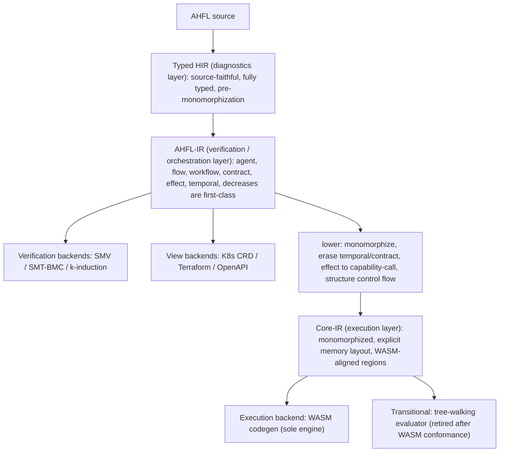
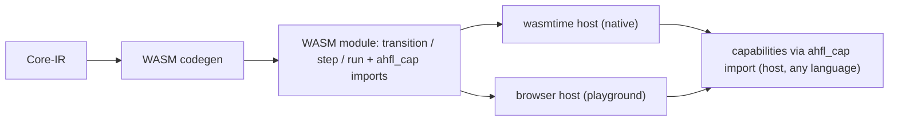

# RFC 0026: IR Tower and Execution Model

## Summary

本 RFC 把 [RFC 0020](0020-strategic-positioning-embeddable-workflow-dsl.zh.md)
「架构北极星」的前两条（IR 塔、WASM 唯一执行引擎）从定位判据展开为可实施的设计。它做两件事：

1. **用三层 IR 塔取代当前的单层 IR**：`Typed HIR`（诊断层，已有）→ `AHFL-IR`（验证 / 编排层）→
   `Core-IR`（执行层）。验证后端（SMV/SMT/BMC）消费 `AHFL-IR`，执行后端（WASM）消费 `Core-IR`，
   两条路径在塔上**分叉**（Dafny 式），互不污染。
2. **确立 WASM 为唯一执行引擎**：`Core-IR → WASM` codegen 消费 [RFC 0019](0019-wasm-runtime-model.zh.md)
   的 `ahfl_cap` capability import 契约；当前的 tree-walking evaluator
   （`src/runtime/evaluator/evaluator.cpp`）判定为**过渡形态**，在 WASM codegen 通过一致性
   （conformance）验收后**原子删除**。不自研虚拟机。

本 RFC 是**架构与分片计划**决策；具体的 WASM 字节序列 lowering 规则由本 RFC 的
Implementation Plan 分片承载并逐片落地，不在本文一次写死指令级细节。

## Motivation

当前 IR 是**单层**的：`ir::Program`（`include/ahfl/compiler/ir/program.hpp`）持有一个扁平
`ExprArena`，`ExprNode` 是一个 20-alternative 的 `std::variant`
（`include/ahfl/compiler/ir/expr.hpp:347`），`Decl` 覆盖 module/const/struct/enum/agent/flow/
workflow/contract/fn/trait/impl 等（`include/ahfl/compiler/ir/decl.hpp`）。**同一层 IR 同时**
被以下所有消费者共享：

- 形式化验证：`src/compiler/backends/smv/smv.cpp`、`src/verification/formal/`（SMT-BMC、
  k-induction、counterexample）。
- 执行：`src/runtime/evaluator/evaluator.cpp`（tree-walking，2000+ 行）。
- 五个 emit backend：WASM（`src/compiler/backends/infra/wasm_backend.cpp`，当前仅 WAT 骨架）、
  K8s CRD / Terraform / OpenAPI（`src/compiler/backends/infra/`）、IR-JSON
  （`src/compiler/ir/ir_json.cpp`）。

这带来三个不做决策就无法消除的结构性问题：

1. **Altitude 冲突（海拔混装）**：`TemporalExprNode`（`expr.hpp:421`，temporal 算子只有验证
   关心）与执行相关节点、`ContractDecl`（`decl.hpp:213`，验证语义）与 `FnDecl` 执行体挤在
   同一套 IR 里。每个执行后端都被迫"处理或显式拒绝"自己根本不消费的验证节点，反之亦然。
   单态化（执行必需）与 temporal/contract 保真（验证必需）是**互相冲突的降级方向**，压在
   一层 IR 上无法同时最优。

2. **`8-location sweep` 是设计债**：`expr.hpp:329-344` 有一份权威 checklist——每新增一个
   `ExprNode` alternative，必须手改 8 个文件（analysis / ir_print / verify / ir_json /
   opt_lower / visitor / typed_hir_lower / assurance），"漏一处即静默 data-loss bug"。这不是
   纪律问题，是**单层 IR 无分层职责 + 无单一真相源**的必然结果。（消灭 sweep 的机制由
   [RFC 0027](0027-query-frontend-and-ir-ssot.zh.md) 承载；本 RFC 负责把节点按层拆开，缩小每层
   的 variant 面。）

3. **执行路径不是顶尖形态**：唯一执行器是 tree-walking 解释器，无法产出可部署产物、无法上
   浏览器、无法达到编译执行的性能。[RFC 0019](0019-wasm-runtime-model.zh.md) 明确把完整 WASM
   codegen 列为 Non-Goal（只定了 ABI 契约与 WAT 骨架），留下"能 emit 一段跑不了真实 agent 的
   WAT"的缺口。

不做本决策，AHFL 的编译器基座停在"单层 IR + 解释执行",与 RFC 0020 声称的"可验证 + 可高效
嵌入多宿主"北极星有结构性差距。

## Goals

1. **确立三层 IR 塔的职责边界**：明确每层持有什么、擦除什么、被谁消费，使"某构造属于哪一层"
   与"某后端消费哪一层"成为架构约束而非惯例。
2. **确立验证路径与执行路径在塔上的分叉点**：验证后端消费 `AHFL-IR`；执行后端消费 `Core-IR`。
3. **定义 `AHFL-IR → Core-IR` 的降级语义**：单态化、effect 降为显式 capability-call、
   temporal/contract 擦除、控制流结构化（对齐 WASM region）、ADT/闭包显式内存表示。
4. **确立 WASM 为唯一执行引擎**，并定义 `Core-IR → WASM` codegen 的值表示 / 内存模型 /
   capability import 绑定 / 分片交付顺序。
5. **定义 tree-walking evaluator 的退役路径**：conformance 验收标准 + 原子删除条件，使"删除"
   成为可执行的验收门，而非口号。
6. **保持 `AGENTS.md` 非协商原则**：索引式身份、hash-consed 类型 + flat store、
   `std::variant` + visitor、诊断带 `SourceRange`；并保持 RFC 0020 定位不变（计算留宿主、
   capability 是唯一外部效应入口）。

## Non-Goals

1. **不在本 RFC 写死指令级 lowering 表**。`Core-IR → WASM` 的逐节点字节序列由 Implementation
   Plan 分片承载、随实现落地为文档；本 RFC 定层、定值表示、定分叉、定分片。
2. **不引入 MLIR / LLVM**。见 Alternatives：对 AHFL 体量属过度工程；塔用现有
   `std::variant` + flat arena + hash-consing 手写。
3. **不改变 RFC 0020 定位或 A/B 型表达力边界**。计算仍留宿主；本 RFC 只重构编译器内部结构。
4. **不改 capability 嵌入 ABI 的字节契约**。复用 [RFC 0019](0019-wasm-runtime-model.zh.md) /
   [RFC 0021](0021-capability-embedding-abi.zh.md) 的 `ahfl_cap` `(ptr,len)->ptr` 契约。
5. **不做 query 化前端与 IR 单一真相源派生**。那是 [RFC 0027](0027-query-frontend-and-ir-ssot.zh.md)。
   本 RFC 的分层为其铺路，但两者可独立评审。
6. **不承诺 GC**。Core-IR 的内存模型倾向 arena / 区域式管理（见 Open Questions），不引入
   通用垃圾回收。

## Design

### 塔的总览

三层各自的职责、身份、消费者：

| 层 | 持有 | 擦除 / 尚未做 | 主消费者 | 现状锚点 |
| --- | --- | --- | --- | --- |
| **Typed HIR** | 源码 range、完整类型、泛型参数、trait bound、诊断上下文 | 未 lower 到 IR | 诊断 / LSP / const eval | `include/ahfl/compiler/semantics/typed_hir.hpp`、`typed_hir_lower.cpp` |
| **AHFL-IR** | agent 状态机 / flow / workflow DAG / contract / effect 分级 / temporal 算子 / decreases 度量，全为一等公民；泛型**未**单态化 | 无内存布局、无指令级控制流 | 验证后端、视图后端 | 当前 `ir::Program` 的编排 + 验证子集 |
| **Core-IR** | 单态化后的函数体、显式 capability-call、结构化控制流（block/loop/if region）、ADT/闭包显式内存表示、值表示（见下） | temporal / contract / decreases **已擦除**（验证在上层完成）；无源码级泛型 | 执行后端（WASM）、过渡期 evaluator | 新增层 |

**关键不变式**：一个构造只在它该在的层出现。`temporal` / `contract` / `decreases` 在
`AHFL-IR` 是一等公民、在 `Core-IR` 不存在（已被验证消费并擦除）；单态化实例、内存布局在
`Core-IR` 存在、在 `AHFL-IR` 不存在。这消除 Motivation §1 的 altitude 冲突。

### 为什么是三层，而不是两层或四层

- **不能两层**（Typed HIR + 单一 IR，即现状）：验证要保 temporal/contract、执行要单态化擦除
  temporal/contract——同一层无法同时满足，就是今天的冲突。
- **不必四层**（如再插一个 STG/CPS 层）：AHFL 的执行语义是**结构化编排 + capability 调用**，
  不是通用高阶函数求值；闭包是受限的（RFC 0013 Non-Goal：无捕获列表首版），不需要 GHC 那样
  的 STG。Core-IR 直接对齐 WASM 结构化控制流即可。
- **三层的每层都有明确、互斥的消费者**：诊断 / 验证 / 执行。这是 Rust（HIR/MIR 面向不同
  消费者）与 Swift（SIL raw/canonical 分相）验证过的划分。

### AHFL-IR：验证 / 编排层

`AHFL-IR` 是 AHFL 的独特价值层，保留当前 `ir::Program` 里所有**编排与验证语义**：

- **一等公民**：`AgentDecl`（`decl.hpp:180`）状态机、`FlowDecl`（`decl.hpp:261`）、
  `WorkflowDecl`（`decl.hpp:293`）DAG、`ContractDecl`（`decl.hpp:213`）、`CapabilityDecl`
  的 effect 分级（`CapabilityEffectKind`）、`TemporalExprNode`（`expr.hpp:421`）、decreases
  度量（RFC 0013 KR5.3 已接入的 `decreases_recognizer`）。
- **泛型未单态化**：`FnDecl` / `TraitDecl` / `ImplDecl`（`decl.hpp:340/384/402`）保留类型参数与
  trait bound——验证在这一抽象层进行（SMV 建模状态机/temporal，SMT-BMC 建模 bounded 契约）。
- **消费者**：`src/compiler/backends/smv/smv.cpp`、`src/verification/formal/*`、视图后端
  （K8s/Terraform/OpenAPI 投影编排结构）。

`AHFL-IR` 相对今天 `ir::Program` 的**净化**：移出纯执行细节（如把容器字面量 lower 成
`CallExpr` 这类"为执行方便"的构造下沉到 Core-IR 的降级步骤里，`AHFL-IR` 保留更贴近源码语义
的形式），使验证后端看到的 IR 不含"为跑而做"的噪声。

### Core-IR：执行层

`Core-IR` 是 `AHFL-IR` 经 `lower` 得到的执行专用层。降级步骤（每步都是一个 pass，
Implementation Plan 分片）：

1. **单态化（monomorphization）**：泛型 `FnDecl`/`ImplDecl` 按具体类型实例化为单态副本
   （Rust MIR 式，索引式实例身份，复用现有 `include/ahfl/compiler/ir/mangling.hpp` 的
   name mangling 作为实例 key）。Core-IR 无类型参数。
2. **effect 降为显式 capability-call**：`AHFL-IR` 的 capability 调用（带 effect 分级）在
   Core-IR 降为一个显式的 `CapabilityCall{ symbol_id, args_ptr, args_len }` 节点，直接对应
   [RFC 0019](0019-wasm-runtime-model.zh.md) 的 `ahfl_cap` import 帧。这是"计算留宿主"在
   执行层的落点。
3. **temporal / contract / decreases 擦除**：验证已在 `AHFL-IR` 完成，Core-IR 不含这些节点。
   （契约的**运行时检查**若需要，降为普通的 `assert` + 分支，而非 temporal 节点。）
4. **控制流结构化**：`MatchExpr`（`expr.hpp:289`）等降为对齐 WASM `block`/`loop`/`if` 的
   结构化 region（WASM 无任意跳转，必须结构化）；`decreases`-verified 的递归/迭代降为
   WASM `loop`。
5. **ADT / 闭包显式内存表示**：enum payload（RFC 0001 的 variant 形式）、struct、容器
   （RFC 0025 bounded 容量）获得显式线性内存布局；闭包（RFC 0013 首版无捕获列表）降为
   WASM `table` 中的函数索引 + 环境指针。

**值表示（value representation）** —— Core-IR 的核心决策：

| AHFL 类型 | Core-IR / WASM 表示 |
| --- | --- |
| `Bool` / `Int`（有界 `BoundedIntT`） | `i32` / `i64`（按 refinement 宽度选择） |
| `Float` | `f64` |
| `Decimal` / `Duration` | 定点 / 整数纳秒（`i64`），语义见 spec |
| `String` | 线性内存 `(ptr, len)`，UTF-8 |
| enum（带 payload） | `(tag: i32, payload...)`，payload 按最大 variant 对齐 |
| struct | 字段按声明序的线性内存布局 |
| bounded 容器（RFC 0025） | 定长数组 `(ptr, len<=cap)`，cap 是编译期常量 |
| 闭包 | `(func_index: i32, env_ptr: i32)`，env 在线性内存 |
| capability 结果 | `(ptr, len)` 帧，宿主经 `ahfl_cap` 回填 |

内存管理倾向 **arena / bump 分配**（workflow 执行是有界、阶段化的，天然适合区域回收），
**不引入 GC**（见 Open Questions Q1）。

### 执行模型：WASM 唯一引擎 + evaluator 退役

- **唯一执行引擎**：`Core-IR → WASM`，capability 经 `ahfl_cap` import 回调宿主（复用 RFC 0019
  契约与 `emit_capability_imports`）。执行由成熟宿主（wasmtime / 浏览器）承担，**不自研 VM**。
- **evaluator 退役路径**（可执行的验收门，非口号）：
  1. WASM codegen 覆盖 Core-IR 全部节点；
  2. **conformance 套件**：现有 evaluator 的 e2e/golden 测试（`tests/` 下 evaluator 驱动的
     用例）迁移为"输入 `.ahfl` + 期望 output"的**引擎无关** conformance 用例；WASM 执行结果
     逐一匹配；
  3. capability 调用序列、状态迁移序列、workflow output 在 WASM 与旧 evaluator 上对齐（迁移
     期的差分测试，仅作过渡验收，**不长期保留第二引擎**）；
  4. 全绿后，**同一个 commit 内删除 `src/runtime/evaluator/`**（及其 evaluator-only 依赖），
     WASM 成为唯一执行路径。删除是 Implementation Plan 的显式最后一片。

  正确性此后由 conformance 套件 + AHFL 自身的语义保持验证（CompCert 式，长期可选，见 Open
  Questions Q3）保证，**而非**靠养一个慢解释器。

### backend / target 各消费哪一层（分类学落地）

| 类别 | 成员 | 消费层 |
| --- | --- | --- |
| 执行后端 | WASM codegen | Core-IR |
| 验证后端 | SMV / SMT-BMC / k-induction | AHFL-IR |
| 视图后端 | K8s CRD / Terraform / OpenAPI | AHFL-IR |
| 交换格式 | IR-JSON（每层可各有投影） | 对应层 |

IR-JSON（`src/compiler/ir/ir_json.cpp`，RFC 0013 KR5.9 已做到逐字节 round-trip）扩展为
**每层各有一个 JSON 投影**，作为层间边界的机器可读快照与差分测试锚点。

## User Impact

- **产物形态**：`ahflc emit wasm` 从"WAT 骨架"变为"可在 wasmtime / 浏览器真正执行的 WASM
  模块"。这解锁可部署产物与 Online Playground（后者仍是独立冻结项，本 RFC 只提供执行地基）。
- **执行语义唯一化**：开发内循环（REPL `:eval`、DAP、`ahflc run`）最终统一走 WASM 引擎；
  evaluator 删除后不再有"两套执行语义可能不一致"的风险。
- **诊断 / 验证不变**：Typed HIR 诊断与 SMV/SMT 验证的用户可观察行为不变（它们消费的层未改
  语义，只是从"单层"净化为"AHFL-IR"）。
- **IR-JSON 消费者**：下游工具会看到分层的 IR-JSON 投影；这是新增能力，旧的单层 IR-JSON 在
  过渡期保留直至消费者迁移。

## Compatibility and Migration

**这是一次大型内部重构，对语言语义非 breaking，对内部 IR 消费者 breaking。**

- **语言 / 源码层**：非 breaking。`.ahfl` 源码语义不变。
- **IR 内部结构**：breaking。`ir::Program` 单层结构被三层替代；所有直接依赖当前 `ExprNode` /
  `Decl` 布局的内部代码（analysis / verify / ir_json / opt / visitor / assurance / evaluator /
  backends）随分片迁移。这是内部 API，项目不承诺其前向兼容（见 `AGENTS.md`）。
- **执行行为**：evaluator 删除前，`ahflc run` 行为不变；删除后由 WASM 承担，行为须经
  conformance 套件证明等价。**迁移策略**：evaluator 与 WASM 引擎在过渡期并存并差分测试，
  仅当全套件绿才原子删除 evaluator——用户不会经历"能跑变不能跑"的中间态。
- **持久化 artifact**：IR-JSON 分层投影是新格式；旧单层投影在过渡期保留。artifact 仍
  secret-free、确定性（无 wall-clock/pid/host-path），遵守 artifact-chain 边界。

破坏范围与迁移步骤按 Implementation Plan 分片逐片记录；涉及内部 IR schema 的 commit 在 footer
标注 `BREAKING CHANGE:` 及影响子系统。

## Implementation Plan

按分片交付，每片一个可独立评审、可回归的 Conventional Commit。分片顺序尊重依赖：

1. **P1 塔骨架**：定义 `AHFL-IR` 与 `Core-IR` 的头（`include/ahfl/compiler/ir/` 下新增
   `ahfl_ir.hpp` / `core_ir.hpp` 或等价），先建**空壳类型 + 层边界**,不改行为。
2. **P2 AHFL-IR 净化**：把当前 `ir::Program` 的编排 + 验证子集迁移为 `AHFL-IR`；验证后端
   （smv/smt）改为消费 `AHFL-IR`；golden 无回归。
3. **P3 lower pass：AHFL-IR → Core-IR（骨架）**：单态化 + temporal/contract 擦除 + effect→
   capability-call，先覆盖 agent 状态机 + flow/workflow 编排（不含复杂表达式），产出 Core-IR。
4. **P4 Core-IR 值表示 + 内存布局**：实现 Design §值表示表；ADT/struct/bounded 容器/闭包的
   显式布局；单元 + golden。
5. **P5 WASM codegen（编排层）**：`Core-IR → WASM`，agent transition / flow / workflow +
   `ahfl_cap` import；产物在 wasmtime 真正跑起来；conformance 子集绿。
6. **P6 WASM codegen（计算层）**：表达式 / 算术 / 控制流 / match / 闭包全部 lower 到 WASM 指令。
7. **P7 conformance 套件**：把 evaluator e2e/golden 迁移为引擎无关 conformance 用例；WASM 全绿；
   WASM vs evaluator 差分测试通过。
8. **P8 evaluator 退役**：删除 `src/runtime/evaluator/`；`ahflc run` / REPL / DAP 切到 WASM 引擎；
   全套件绿。`BREAKING CHANGE:` 标注。
9. **P9 IR-JSON 分层投影**：每层 JSON 投影 + round-trip；旧单层投影标记弃用。

每片落地后追加 `implementation_prs` 与 Decision History 条目。

## Test Plan

- **单元**：每层 IR 的构造 / visitor / 布局计算；lower pass 的单态化正确性、temporal/contract
  擦除完备性、effect→capability-call 映射。
- **golden（正 + 负）**：`AHFL-IR` 与 `Core-IR` 的文本 dump golden；`Core-IR → WASM` 的 WAT/WASM
  golden；负例覆盖"验证节点误入 Core-IR""未单态化残留"等结构违规（由分层 verifier 捕获）。
- **conformance（引擎无关）**：`.ahfl` + 期望 output，同时喂 WASM 与（过渡期）evaluator，逐一
  匹配。这是 evaluator 退役的验收门。
- **一致性 / 差分**：WASM 执行的状态迁移序列 / capability 调用序列 / output vs evaluator（过渡期）。
- **round-trip**：分层 IR-JSON 逐字节 round-trip（沿用 RFC 0013 KR5.9 的方法）。
- **真实执行**：`ahflc emit wasm` 产物在 wasmtime 加载执行的集成测试（对标 RFC 0019 的真实
  执行边界）；浏览器 profile 的最小 smoke。
- **fuzz / property**：lower pass 的语义保持 property（对随机合法程序，Core-IR 执行 ≡ AHFL-IR
  参考语义，延续 RFC 0013 KR5.10 lowering-equivalence 的思路）。
- **release-evidence / budget**：WASM 产物 size budget、codegen compile-time budget（沿用现有
  `quality-gates`）。

## Rollout and Stabilization

1. `draft → review`：清零 Open Questions（内存管理、controlflow 结构化边界、语义保持验证
   深度、单态化爆炸预算），compiler + runtime owner sign-off。
2. `accepted`：塔与执行模型被采纳；开始 P1 分片。
3. `implementing`：填 `tracking_issue` / `discussion`，按分片落地，逐片记 Decision History。
4. `implemented`：P1–P9 全部落地，evaluator 已删除，WASM 为唯一引擎，conformance 全绿。
5. `stabilized`：三层塔在 `docs/design` 稳定表述，`docs/spec` 的执行语义引用 WASM 引擎为准，
   路线图以本架构为组织轴。

## Alternatives

1. **保持单层 IR，只加 pass**（现状延续）。**失败原因**：无法解决 altitude 冲突——验证要保
   temporal/contract、执行要单态化擦除,同层不可兼得；`8-location sweep` 债务随节点增长线性
   恶化。这是"一百个小 workaround"，违反 `AGENTS.md` Principle 1。
2. **采用 MLIR 作为 IR 基础设施**。MLIR 提供 dialect / region / 自动化 pass 基建,看似省事。
   **失败原因**:对 AHFL 体量是过度工程——引入巨大 C++ 依赖与构建复杂度、学习曲线陡、且其
   通用性换来的抽象与 AHFL 已验证的 `std::variant` + flat arena + hash-consing 风格
   （`AGENTS.md` Principle 2/3/4）冲突。Rust 手写 MIR 塔、GHC 手写 Core/STG 都没用 MLIR;
   AHFL 该学它们,不该把地基押在一个重依赖上。
3. **采用 LLVM 直接做 native codegen**（跳过 WASM）。**失败原因**:①与 RFC 0020"多宿主 + 可
   移植沙箱"定位冲突——native 产物不可移植、无沙箱;②LLVM 依赖极重;③放弃浏览器 Playground;
   ④WASM 已提供成熟引擎生态,`ahfl_cap` 契约已定,是更短且战略自洽的路径。
4. **自研字节码 VM**。**失败原因**:自定义字节码 + 解释器/JIT + GC + 跨平台 + 调试接入是
   数十人年工程,换来的东西 WASM 生态（wasmtime/浏览器/组件模型/调试）已免费提供且更成熟。
   今天的新语言（MoonBit/Grain/AssemblyScript）全选 WASM 而非自研 VM。
5. **保留 evaluator 作为长期"参考实现",与 WASM 双引擎共存**。**失败原因**:AHFL 只有一家
   实现,不需要"给第三方对齐用的基准";双引擎意味着两套执行语义要永久同步,是持续的
   一致性负担,且违反 Principle 1 的"禁止 just-in-case 死代码"。正确做法是 conformance 套件 +
   语义保持验证保正确性,evaluator 用完即删。

## Open Questions

进入 `review` 前,五个设计问题已给出**决策 + 理由**(共同哲学:执行层薄而确定、内存有界、
爆炸可控;验证深度分"必做工程级"与"长期可选证明级")。具体阈值与证明深度的落地细节由
Implementation Plan 对应分片承载。

1. **Core-IR 内存管理模型** → **决策:arena / region-based,不引入 GC。** workflow 执行是
   有界、阶段化的(agent 状态迁移 / flow 步 / workflow DAG 节点),天然适合按执行 region 分配
   与整体回收;bounded 容器(RFC 0025)容量编译期已知,布局定长。闭包(RFC 0013 首版无捕获
   列表)的环境是受限的,其跨阶段存活用**显式 region 提升**处理(把需跨阶段存活的环境分配到
   更外层 region),而非引入通用 GC。**理由**:GC 与 WASM 线性内存 + 形式化验证的确定性诉求
   冲突(GC 引入非确定回收时机);arena 的分配/回收确定、可建模、与 bounded 验证子集一致。
   若未来出现 region 无法覆盖的真实存活场景,再按数据升级到区域推断,不预先过度设计。
2. **控制流结构化边界** → **决策:全部降为 WASM 结构化 region,不需 relooper。** AHFL 无任意
   goto;`MatchExpr`(`expr.hpp:289`)降为嵌套 `block`/`br_table`,`?`(RFC 0014 try 算子)与
   early-return 降为 `block` + `br` 到块末(结构化 early-exit,WASM 原生支持)。AHFL 的控制流
   本就是结构化的,不会产生不可归约(irreducible)控制流图,故无需 relooper 级算法。**理由**:
   语言层已无 goto,结构化 lowering 是自然映射;这也与"decreases 可验证终止"一致(结构化
   循环才好证终止)。
3. **语义保持验证的深度** → **决策:conformance 差分测试为必做验收门(工程级);CompCert 式
   形式化 lower-证明为长期可选,本 RFC 只留接口不承诺。** evaluator 退役(KR6.8)严格门控在
   conformance 全绿(KR6.7),这是必做。是否把"lower pass 保持参考语义"上升为形式化证明,作为
   AHFL 验证护城河的延伸,列为 accepted 后可独立立项的增强,不阻塞本 RFC 落地。**理由**:
   工程级差分已足以安全退役 evaluator;形式化证明 ROI 高但工程量大,不该绑死在架构落地的
   关键路径上。
4. **单态化爆炸预算** → **决策:复用 RFC 0013 §Design 的"编译期预算 + 缓存"策略,超限
   fail-closed 报诊断。** 单态化实例按 mangled key(`include/ahfl/compiler/ir/mangling.hpp`)
   缓存去重;设一个编译期实例数预算(具体阈值由 KR6.4 分片定,可配置),超限时报一条带
   SourceRange 的可操作诊断(指出爆炸源的泛型调用链),而非静默生成或 OOM。**理由**:
   fail-closed + 可操作诊断符合 Principle 5;预算可配置留调优空间。
5. **过渡期双 IR-JSON 的弃用时点** → **决策:旧单层 IR-JSON 在 evaluator 退役(KR6.8)后、
   所有下游消费者迁移到分层投影(KR6.9)时删除,以 `BREAKING CHANGE:` 标注。** 过渡期两者
   并存,用 round-trip golden 双守护。**理由**:artifact 消费者迁移是渐进的,弃用时点绑定到
   一个明确的里程碑(KR6.9 完成)而非悬空。

## Decision History

- 2026-08-28: Draft opened。承接 [RFC 0020](0020-strategic-positioning-embeddable-workflow-dsl.zh.md)
  「架构北极星」的北极星一（IR 塔）与北极星二（WASM 唯一执行引擎),展开为三层塔设计 +
  `AHFL-IR → Core-IR` 降级语义 + WASM codegen 值表示/内存模型 + evaluator 退役路径 + 9 片
  Implementation Plan。query 化前端与 IR 单一真相源派生转交
  [RFC 0027](0027-query-frontend-and-ir-ssot.zh.md)。
- 2026-08-28: Status draft → review(KR6.1 部分)。五个 Open Questions 全部给出决策 + 理由:
  Core-IR 内存 = arena/region(无 GC);控制流全部降 WASM 结构化 region(无 relooper);
  语义保持 = conformance 差分必做、形式化证明长期可选;单态化 = 编译期预算 + 缓存 + 超限
  fail-closed 诊断;双 IR-JSON 弃用绑定 KR6.9 里程碑。填 shepherd/tracking/discussion。
  **`review → accepted` 待 compiler + runtime owner sign-off**——该步授权一场删除现役
  evaluator、重写 IR 分层的大型重构,须显式批准。
- 2026-08-28: Status review → accepted(KR6.1 达成)。sign-off 经项目 lead 于 Q4 路线图
  Objective 6 确认:路线图已把本 RFC 的完整落地(三层塔 + WASM 唯一引擎 + evaluator 退役)
  列为 Q4 验收项(KR6.1–6.9)并从"明确排除"表移除"完整 WASM codegen",即授权本 RFC 进入
  实现。实现按 §Implementation Plan 9 片推进,KR6.2 起为**零行为变更**的塔骨架;evaluator
  删除(P8/KR6.8)严格门控在 conformance 全绿(P7/KR6.7)之后,过渡期不破坏 `ahflc run`。
- 2026-08-28: Status accepted → implementing。**P1 塔骨架落地(KR6.2,commit `0243ff10`)**:
  新增 `include/ahfl/compiler/ir/tower.hpp`——`Layer` 枚举(TypedHir=0 → AhflIr=1 → CoreIr=2,
  索引式身份)、`Path` 枚举、`path_of()` 编码 Dafny 式分叉(验证消费 AhflIr、执行消费 CoreIr、
  诊断在分叉之上)、零成本 `LayerTag<L>`(后续分片可把"层身份"带进类型,使读错层成为编译错误)。
  `src/compiler/ir/tower.cpp` 用 `static_assert` 锁死层序与层→路径分叉;`tests/unit/compiler/ir/
  tower.cpp` 3 个 doctest 用例。**零行为变更**:无消费者,现有 backend 仍走 `ir::Program`。
  全套件 463/463 绿。
- 2026-08-28: **P2 AHFL-IR 层边界落地(KR6.3,commit `a1a38d1a`)**:alias-first 增量——
  `program.hpp` 新增 `using AhflIr = Program`(doc 注明这是 `tower::Layer::AhflIr` 验证/编排层,
  今日结构同 Program,节点集净化留后续片)。验证/视图后端入口签名 re-point 到 `const ir::AhflIr&`:
  `print_program_smv` / `SmvPrinter::print`(smv)、`lower_k8s_crd` / `lower_openapi` /
  `lower_terraform` / `lower_wasm` / `build_capability_effects`(infra)、`emit_program_smt`(smt)。
  内部 indexing/collection helper 保留 `ir::Program`(别名同型,只标注顶层边界)。**零行为变更**:
  8 文件 +58/-19,SMV/emit-ir/k8s/openapi/terraform golden 逐字节不变;全套件 exit 0。
- 2026-08-28: **P3 Core-IR 骨架 + lower 脚手架首增量(KR6.4 部分,commit `31eded7f`)**:新增
  `include/ahfl/compiler/ir/core_ir.hpp`(namespace `ahfl::ir::core`)——`CoreProgram`(format
  version `ahfl.core.v1`,flat store)、`CoreDecl = variant<CoreAgentDecl>`(最小起步)、
  `CoreAgentDecl`(状态机投影:`SymbolRef` + `mangle_instance` 实例 key + 索引式 `CoreStateId`
  states/initial/finals/`CoreTransition`)。header 注明 temporal/contract/decreases/quota 在此层
  **不可表示(已擦除)**。新增 `src/compiler/ir/core_lower.cpp` 的 `lower_ahfl_to_core(const
  AhflIr&) -> CoreProgram`:lower AgentDecl 状态机(状态 intern 成索引、确定性),其余 Decl kind
  catch-all 跳过(留后续子片)。3 doctest(states/initial/finals/transitions 保真 + contract 不
  泄漏 + 二次 lower 相等)。**additive、零行为变更**:无 backend/evaluator 消费 CoreProgram(WASM
  codegen 是 KR6.5);3 新文件 + 2 CMake 行,全套件 463/463 绿。**KR6.4 剩余子片**:完整单态化、
  effect→capability-call、flow/workflow lower、值表示/内存布局(P4)。
- 2026-08-28: **P3 effect→capability-call lower 子片(KR6.4,commit `c48e2c18`)**:`core_ir.hpp`
  的 `CoreDecl` variant 扩为 `variant<CoreAgentDecl, CoreCapabilityDecl>`。`CoreCapabilityDecl`
  持 `SymbolRef`(canonical 身份)+ `CapabilityEffectKind`(复用枚举)+ `param_types`(ahfl_cap
  marshalling 签名)+ `return_type_ref`——即 [RFC 0019](0019-wasm-runtime-model.zh.md)/[RFC 0020]
  (0020-strategic-positioning-embeddable-workflow-dsl.zh.md) 的 `ahfl_cap` import 显式边界
  (「计算留宿主」的执行层落点);effect kind 之外的 domain/idempotency/receipt/retry/timeout/
  compensation 全部擦除,param name 丢弃。`lower_ahfl_to_core` 加 `CapabilityDecl` visitor 臂
  (确定性、源序;含 per-TU `clone_type_ref` 深拷贝,TypeRef 是 move-only)。3 新 doctest。
  **additive、零行为变更**:仍无 backend 消费;3 文件,ir 测试 59/59、全套件 463/463 绿。
- 2026-08-31: **P4 coercion(annotated-let 类型调整)三段实现链闭合(KR6.4 子片)**。设计
  `docs/design/core-ir-p4-coercion.zh.md`(Codex-approved rev 4,commit `eff693ac`);实现者
  Codex、审查者 Claude 的分工评审循环。**F1(变体/泛型-decl 元数据 + inert typed
  adjustment-plan 数据模型 + IR-JSON 保真)**:`c3aa3ec2` 落地,`ddf7f391` forward-fix
  (显式 RegistrationOrigin、fail-closed wire enum、真实 variance gate、单 SSOT、mono 保真),
  `fc06245b` 二次 forward-fix(无条件 BackendReady variance 长度门 + typed-HIR 内层 kind 校验),
  roadmap 验收记于 `17fb4cc6`。**F2(witness-carrying memoized solver + let 产出)**:`1e676d3b`
  `feat(sema): persist coercion witnesses for annotated lets`——RelationDecision/witness arena、
  producer 接 annotated-let、BackendReady adjustment verifier。评审发现并修复 1 个 P0:top/bottom
  边界(`let x: Any = y`)产空-ops witness,IR verifier 必拒——修法是新增 `ToAny`/`FromNever`
  双 leaf op 贯通 solver→wire→bridge→verifier,`has_top_bottom` 纳入节点末尾短路。**F3(Core
  plan/expr lowering + verifier + probes)**:`814d3378`
  `feat(core-ir): lower and verify coercion plans`——CoreCoercionPlanId/Op/PlanNode + CoreCoerceExpr
  进 CoreExprNode,flow/workflow 各自 normalized proof arena;Core op **不含** variance/ToAny/
  FromNever/VariantToEnum(方向从 `CoreTypeDecl.variances` SSOT 读)。lower_let_boundary 非
  identity 一律 bind_pure(CoreCoerceExpr) 产 fresh SSA(**绝不 re-label**,P0-4);ToAny/FromNever
  在任何 Core type intern 前早拒(唯一 `core.INVALID_COERCION`,不泄漏 Any/Never materialize
  错误);VariantToEnum 仅 Core source==result 擦除;缺 plan 且 Core 类型不同 -> `core.MISSING_ADJUSTMENT`。
  verifier:从 CoreCoerceExpr root 可达性(no-orphan)、全局 3-color 无环、per-op canonical order +
  唯一性 + bounds + TypeArg cov/contra 方向(读 `CoreTypeDecl.variances`,invariant/非法拒)+
  Fn param-contra/return-cov + unnamed 维度覆盖。新增码 `core.MISSING_ADJUSTMENT`/
  `core.INVALID_COERCION` + `core.verify.{COERCION_INVALID,COERCION_KIND_MISMATCH,
  COERCION_VARIANCE_INVALID,COERCION_IDENTITY}`。**additive、零行为变更**(无 backend 消费
  CoreCoerceExpr;物理实现留待 P4-D):dev -Werror 全量 build clean,ir 262/262
  (1743 assertions)、ir_equal 9、ir_json 10、ir_opt 16 绿。KR6.4 剩余:完整单态化、值表示/
  内存布局(P4 主体)、WASM codegen(KR6.5)。
- 2026-08-31: **P4-C nominal member templates 两段实现链闭合(KR6.4 子片,P4-D layout 硬前置)**。
  目标:消除 struct field / enum payload 的 `kInvalid` 类型洞,让后端能跨成员算 layout。旧
  二元 `CoreTypeTemplateRef{Concrete|Param}` 无法表示 `Option<T>` / `Map<String,T>` /
  `Fn(T)->List<T>(4)`,改为**声明拥有的 flat compositional arena**(kind Concrete|Param|Nominal|Fn,
  postorder child<parent,全节点 root-reachable,无 orphan)。**sourcing pin(P0)**:模板 arena 的
  `Param{index}` 只在 `typed_hir_lower.cpp` 从 semantics 层 `StructTypeInfo.fields[].type` /
  `EnumVariantInfo.payload` / `EnumVariantFieldInfo.type`(保留 `TypeVarT::index` 的 TypePtr)构建,
  绝不从已 Any-erased 的 `ir::FieldDecl.type_ref` 反推(与 F1 variance 同一 bridge SSOT)。
  **C1(inert AHFL bridge,commit `98da0bd9`)**:`feat(ir): persist nominal member type templates`
  ——`ir::MemberTypeTemplateNode` arena 挂 `StructDecl`(`member_type_templates` +
  `field_type_template_roots`)/ `EnumDecl`(共享 arena + 每 variant `payload_type_template_roots`);
  ir_json fail-closed wire;`verify.cpp` BackendReady 锁(roots↔slot 数量、kind field mask、
  param bounds、postorder、nominal arity 含"std 未 inline→交 Core SSOT"fallback、Fn return、
  orphan reachable;enum 聚合全 variant roots 后一次性校验共享 arena)。无 Core consumer。
  **C2(Core consumer,commit `86ea43f3`)**:`feat(core): materialize nominal member type templates`
  ——`CoreMemberTypeTemplateNode` arena 挂 `CoreTypeDecl`;`VariantPayload.slot_types` 替换为
  `slot_type_template_roots`,`field_types` 更名 `field_nominal_types`(注释锁 navigation-only、
  禁 layout/codegen 当逻辑类型)。公共 `instantiate_member_template(program,owner,root,owner_args)`:
  memoized DAG + cycle guard、per-kind field mask、Param 从 owner_args 代入、Nominal/Fn 走同一
  shared `ValueTypeArena` hash-cons(重复实例化得同一 CoreValueTypeId、arena 不增长)、**不展开字段**
  (递归 layout 留 P4-D)。`finalize_member_templates` 时序:全 nominal 注册 + `fixup_field_nominal_types`
  后建 shared arena、按声明序转换、原子 publish(完整成功才 move 到 target),失败
  `core.INVALID_MEMBER_TEMPLATE` 带 range。builtin SSOT:`BuiltinEnumDescriptor.Variant` 从
  `payload_arity` 升为 `payload_type_params`(slot→param position:Option::Some=P0/Result::Ok=P0/
  Err=P1),real builtin cross-check 每 slot root 必是 Param 且 param_index 对上 descriptor,否则
  `core.BUILTIN_METADATA_DRIFT`。variance 仍唯一 SSOT 在 `CoreTypeDecl.variances`,模板不复制。
  **additive、零行为变更**(仍无 backend 消费模板;物理 layout 留 P4-D):dev -Werror 全量 build clean,
  ir 269/269(1902 assertions)、ir_equal 9、ir_json 12、ir_opt 16 绿。KR6.4 剩余:值表示/内存
  布局(P4-D 递归 layout)、WASM codegen(KR6.5)。
- 2026-08-31: **P4-D 值表示/内存布局设计硬化(D0,commit `89109d1e`,docs only)**。硬化
  `docs/design/core-ir-p4-value-representation.zh.md` 并同步 coercion 文档的 layout-equality 措辞。
  裁决(reviewer-ruled):**递归 = 方案 A**——Inline 边(struct field / enum payload aggregate)
  vs Indirect 边(collection element/key/value / 未来 closure env);首访 reserve stable placeholder;
  Inline 重入 => `core.layout.INFINITE_RECURSION`;Indirect 回 placeholder;final verifier 只沿
  Inline 三色判环 + 拒 dangling placeholder。**判等 = `value_layouts_equivalent`**:同
  `CoreValueTypeId` 快路径,否则 pair-memo cycle-safe bisimulation;原始 `CoreLayoutId` 相等
  ≠ 物理等价;`value_layouts` 不 hash-cons、每 CoreValueType 唯一。**P0**:`instantiate_member_template`
  当前 mutate program arena,D1 须把 template evaluator 抽成 supplied `ValueTypeArena` 的同一实现,
  layout 用以 `program.value_types` 副本 seed 的 layout-private arena、绝不回写 `CoreProgram`,
  `value_layouts` domain 严格等于原 program arena。**Decimal = i64 unscaled mantissa**(scale 是
  type metadata;literal/const 越界 fail-closed;dynamic overflow runtime trap;无 silent truncation;
  非 bignum handle)——依据 std/decimal + const_sema + runtime `decimal_raw_*` 现有语义。UUID
  inline16/align1;Fn i32 table index;Closure 任意可达路径显式 `core.layout.UNSUPPORTED`(env 布局
  留 D2);Unit size0/align1;Never Uninhabited(非 loadable ZST);unbounded collection
  `core.layout.UNBOUNDED`;align-up/`stride*capacity` checked → `core.layout.OVERFLOW`。
  `compute_core_layouts` 纯函数/确定性(源序 placeholder、确定性 append、原子 publish、二次 compute
  结构相等)。side artifact `CoreLayoutTable` 绝不进 `CoreProgram`。**D1(实现:supplied-arena
  evaluator 重构 + core_layout model/builder/equivalence/verifier + focused matrix)未开始**;D1
  LGTM 后 P4-D 闭合、解锁 WASM codegen(KR6.5)。
- 2026-08-31: **P4-D layout 实现落地(D1,commit `c60b46fc`)**,`feat(core-ir): compute deterministic
  wasm32 layouts`。新增独立 side artifact `include/ahfl/compiler/ir/core_layout.hpp` +
  `src/compiler/ir/core_layout.cpp`(`compute_core_layouts(const CoreProgram&, TargetDataLayout)` +
  `verify_core_layout_table` + `layouts_equivalent`/`value_layouts_equivalent`),`CoreLayoutTable`
  绝不进/改 `CoreProgram`(builder 持 `const CoreProgram&`,编译期强制只读;scratch 用
  `program.value_types` 副本)。P4-C `instantiate_member_template` 抽成
  `instantiate_member_template_into(value_types,types,...)` 共享 evaluator,原 `CoreProgram&` API 转
  forwarding wrapper(行为不变),layout 以私有副本复用同一 evaluator。**递归 = 方案 A 两阶段**:states
  三色 DFS,Inline 重入 => `core.layout.INFINITE_RECURSION`,Indirect 重入回 stable placeholder;
  container header 先 finalize、`stride`/`value_offset`/`backing_size` 在 inline roots finalize 后
  统一 fixup(checked overflow),故 `Node{children:List<Node>(4)}` 终止;final 拒任何 Pending。
  **verifier 双层**:独立 local(target/root 唯一/shape 算术/bounds/no Pending/inline-acyclic/
  reachable-no-orphan)+ **reprojection**(同一 deterministic builder 重算整表、要求
  `*expected == table`,堵"自洽但 Bool root 被篡成 i64"的 mapping 漏洞)。`CoreTypeDecl` 加
  `source_range`,递归/overflow 诊断带 decl range。representation:i32/i64/f64、PtrLen 8/4、UUID
  Bytes16/align1、FnRef i32、Struct/Tuple decl-order、Enum tag+per-variant aggregate、Container
  element/value/capacity/value_offset/stride/backing;Closure/unbounded/overflow/bad-target 全
  fail-closed(`core.layout.{UNSUPPORTED,UNBOUNDED,OVERFLOW,INFINITE_RECURSION,INVALID}`)。
  **additive、零行为变更**(无 backend 消费 layout;`CoreProgram` 不变——probe 实测
  `program.value_types` 布局后相等 + 二次 compute 结构相等):dev -Werror 全量 build clean,
  ir 277/277(1996 assertions)、P4-D focused 8/8(94)、ir_equal 9、ir_json 12、ir_opt 16 绿。
  **P4-D 闭合,KR6.5 WASM codegen 解锁**;KR6.4 值表示/内存布局收尾。
- 2026-08-31: **KR6.5(P5)WASM 编排 codegen 首片 E1 设计(commit `5c8613f5`,docs only)**。
  新增 `docs/design/core-ir-kr6-5-wasm-codegen.zh.md`(rev2,commit `43918af8`;rev1 `5c8613f5` 的
  "empty final handler" 前提被真实 frontend 否定——grammar 要求 `return expr`、validation 要求
  final handler 必须 return-on-all-paths,故空 final 不可构造)。E1 是**最小可执行 vertical
  slice**:编排结构真跑、表达式计算不 lower(严守 P5/P6 层界——RFC:280-282,P5=编排层不含复杂
  表达式,P6=表达式/算术/控制流/match/闭包)。E1 只收单 agent + 单 flow、非 final handler 恰一个
  `CoreGotoStmt`、final handler = **canonical opaque identity return**(精确 ANF
  `CoreLetStmt(CorePathExpr{root=Input, projection=[]})` + `CoreReturnStmt` 同一 SSA、
  input_type==output_type、逐位 CoreValueTypeId 相等)、goto 图全覆盖且必达 final;
  expr/非-identity let/非-canonical return/if/match/cap/workflow + member-projection/literal/
  construct/coerce/output-type-mismatch 全部 `wasm.UNSUPPORTED_ORCHESTRATION`(identity 是结构识别
  + opaque 指针透传,非 Core 值求值,不偷做 P6)。
  纯函数 `emit_core_wasm(const CoreProgram&, const CoreLayoutTable&, target)`;Core + layout 双
  verifier 前置;**P4-D 是唯一 layout 权威**(codegen 零自算 size/offset/align);in-tree canonical
  wasm binary encoder(不经 WAT/wat2wasm,fixed index 表 + canonical LEB128 + 无 names section →
  确定性逐字节相等);initial/finals 读 Core SSOT(不猜 state0/不从出边推 final)。CLI `emit wasm`
  E1 单 agent 切真 binary、多 agent/workflow fail-closed(不拼接/不选 first)。**差分锚点**:repo
  无 Core evaluator(新增会违背 RFC 0026 删引擎目标),故同一 checked frontend 分叉——旧
  AgentRuntime/evaluator vs AHFL→Core→layout→wasm,`wasmtime --invoke step` 比 final CoreStateId;
  transition_count exact-increment 由 always-on binary/structural probe 锁,跨 instance 完整 trace
  留后续 embedded-host harness(不虚报 CLI 可观测)。**ABI 不偷改**:E1 `run` 返 input ptr 不变(纯
  透传,无 load/store/parse/copy/alloc),output aliases input、len==in_len、host 拥有并只 dealloc 一次;
  该 identity alias 是 E1 唯一窄例外、非通用先例,RFC0019(ptr)vs RFC0021(ptr+len)张力显式记录、
  值返回的 `run2` 类方案留独立评审、不 pre-approve。wasmtime
  optional-gated(P-6A provenance:无工具 exit 77 visible SKIP、显式失败 hard FAIL);无 non-skipped
  evidence 不宣称 KR6.5 execution-proven。诊断码 `wasm.{INVALID_CORE,INVALID_LAYOUT,
  UNSUPPORTED_TARGET,ENTRY_AMBIGUOUS,UNSUPPORTED_ORCHESTRATION,NONTERMINATING_E1_RUN,
  BINARY_OVERFLOW,INTERNAL_INVALID}`。后续片:E2 capability boundary、E3 workflow DAG、E4 P5
  conformance,之后才 KR6.6/P6 表达式/算术/match/闭包。**E1 codegen 实现未开始**(design-only)。
- 2026-08-31: **KR6.5 E1 codegen 落地(commit `3334fba0`)**,`feat(wasm): add Core-IR E1
  orchestration codegen`。新增 `src/compiler/backends/infra/core_wasm_codegen.{hpp,cpp}`——纯函数
  `emit_core_wasm(const CoreProgram&, const CoreLayoutTable&, target)`:Core + layout 双 verifier
  前置、single-agent/flow、canonical identity 7 项校验(两句 ANF、Input root/root_type、
  members+projection 空、resolved、result nominal base==input、input==output type、SSA/expr
  CoreValueTypeId 逐位相等、ret==let SSA、no-orphan)、goto total + 三色终止、临时 bytes 完成才
  publish。in-tree 确定性 wasm32 encoder(固定 sections/indices、canonical LEB128、无 import/name/
  custom;`run` 结尾仅 `local.get 0`、frame 零 load/store)。CLI `ahflc emit wasm` 改走
  AHFL→Core→P4-D→binary(不再 lower_wasm/WasmAgentConfig/拼 WAT);多 agent/workflow fail-closed。
  reference-runtime 窄修:`AgentRuntime` 额外 bind reserved local `input`(aggregate),使真实 frontend
  `return input;` 可解析,原 input.field 路径不变。**identity output = E1 唯一窄 alias 例外**
  (run 返 input ptr、len==in_len、host 拥有并只 dealloc 一次、module 不读写 frame),不 pre-approve
  run2。诊断码 `wasm.*` fail-closed 矩阵齐(member-projection/literal/construct/coerce/output-mismatch/
  noncanonical-return -> UNSUPPORTED_ORCHESTRATION 无 artifact;cycle -> NONTERMINATING;multi-agent ->
  ENTRY_AMBIGUOUS;tampered layout -> INVALID_LAYOUT)。**证据分类严格**:always-on binary/structural
  gate(binary_gate/same_frontend_probe/profile/preflight)全绿;real-wasmtime execution differential
  optional-gated,dev 机无 wasmtime 如实 SKIP(exit 77)。**KR6.5 尚未 execution-proven**——需 CI/
  release 有 non-skipped wasmtime pass 才可宣称;本片仅闭合 E1 orchestration spine。验证:full build
  -Werror clean、wasm 33/33、AgentRuntime 43/43、IR 277/1996、ir_equal 9、ir_json 12;reviewer
  独立复核 emit 真 wasm(WebAssembly.validate=true、node 执行 initial_state=1→final=0、
  transition_count=1、run identity alias 运行时确认、双 emit 逐字节相等)。后续:E2 capability
  boundary、E3 workflow DAG、E4 P5 conformance。
- 2026-08-31: **KR6.5 E2 capability boundary 设计(`9ce5f6ef`)+ C1 Core foundation 落地
  (commit `2df0357c`)**。设计 `docs/design/core-ir-kr6-5-e2-capability.zh.md`。审计发现两个 Core-side
  P0 先收成 index-based SSOT(C1,`feat(core): materialize capability signatures and authorization`):
  (1) `CoreCapabilityDecl` 原持 `ir::TypeRef` param/return(双 SSOT、verifier 只能验 arity)→ 收为
  program-global `CoreValueTypeId`(经 body SSA 同一 shared ValueTypeArena 物化,ir::TypeRef 删除)
  + source_range;(2) `CoreAgentDecl` 无 capability whitelist(frontend typecheck_expr.cpp:5006 已验
  agent_info->capability_symbols,但 Core 无法自证)→ 加 declaration-order `vector<CoreCapabilityId>`
  + source_range;两者补 default equality。`CapabilityIndex` 改 strict id-first(present-but-miss
  SymbolId 返 nullopt,不降级 display name)。lower fail-closed:unresolved signature →
  `core.UNRESOLVED_CAPABILITY_SIGNATURE`、unresolved/duplicate agent cap →
  `core.UNRESOLVED_AGENT_CAPABILITY`/`core.DUPLICATE_AGENT_CAPABILITY`,绝不 synth id0。verifier 锁
  capability kind==Capability + 唯一 SymbolId、param/return materialized 非 Never、agent whitelist
  bounds+unique、flow call 逐 arg/result exact CoreValueTypeId + target-agent 授权;**workflow region
  先做同一 signature 检查,再以独立 `CAPABILITY_OUTSIDE_FLOW` 拒(两条 code/两条 path、signature-before-
  reject、不猜 workflow whitelist)**——对齐 frontend「cap 仅 Flow 可调用」语义(typecheck_expr.cpp:4996)。
  新增 verify 码 kCapability{SymbolInvalid,SignatureInvalid,WhitelistInvalid,ArgumentTypeMismatch,
  ResultTypeMismatch,Unauthorized,OutsideFlow}。**additive、零行为变更**(C1 纯 Core foundation、无
  wasm consumer,E1 codegen 不变):dev -Werror clean、compiler_ir 285/285(2077 assertions)、ir_equal 9、
  ir_json 12、wasm 33/33、AgentRuntime 43/43、native_host 17/17、native_wasm_diff 17/17 绿;reviewer
  独立复跑确认。**C2 consumer(wasm import + append-only `run2(in_ptr,in_len)->(status,out_ptr,out_len)`
  + OK/ERROR/PENDING ownership + PENDING latch trap;ahfl_cap 字节契约零改、wire=value_json 非 layout)
  未开始**。KR6.5 仍非 execution-proven(须 CI/release non-skipped conforming-OK wasmtime host)。
- 2026-08-31: **KR6.5 E2-C2 capability consumer 落地(commit `a143cd7f`)**,`feat(wasm): add
  capability run2 boundary`。wasm import section 最小权限(只 import 从 initial 可达的 terminal
  capability,unreachable final cap 不获授权)+ 精确 `ahfl_cap.cap_<SymbolId>` `(i32,i32)->(i32,i32,i32)`
  multi-value ABI、imports 按 CoreCapabilityId 升序、无 source name 泄漏。append-only
  `run2(in_ptr,in_len)->(status,out_ptr,out_len)`、import-aware function indices、ABI ver 仍 1;含 cap
  的 artifact 中 v1 `run` 在任何 effect 前 `unreachable`(不丢 status/len)。三态归一化:OK(nonzero
  ptr+len 透传所有权)/OK-empty→ERROR/ERROR(0,0)/PENDING-null→latch+(PENDING,0,0)/PENDING-nonnull+
  unknown→ERROR。`pending_latched` global 作 run2 **首指令**门禁——suspended instance 再 run2 在读/
  转移新 input 前 `unreachable`(无清 latch 操作,resume 留 E4/RFC0022)。`region_contains_capability`
  递归 CoreIf/CoreMatch,nested/non-final cap → `wasm.UNSUPPORTED_CAPABILITY_FRAME`(不误降 generic
  orchestration)。**零 layout 算术**(P4-D 只读)、wire=value_json opaque forwarding、不做 serializer。
  新增码 `wasm.INVALID_CAPABILITY_ABI`/`wasm.UNSUPPORTED_CAPABILITY_FRAME`。**证据分层诚实**:always-on
  binary/structural 覆盖完整 OK/ownership 路径;Node embedded-host 真执行 run2 OK/result bytes +
  ERROR + PENDING + latch(reviewer 亲跑 PASS);wasmtime CLI `--preload` 仅证 import linkage +
  ERROR/PENDING(无 result frame——preloaded module 无法 alloc target 私有 memory,OK frame 不经此宣称)。
  验证:dev -Werror clean、wasm 50/50、11 wasm ctest(Node + same-frontend + binary gate Passed、
  E1+E2 wasmtime 本机无工具如实 Skipped)、compiler_ir/AgentRuntime/native-host 全绿(reviewer 独立复跑)。
  **KR6.5 仍非 execution-proven**——OK 路径本机 Node 证、wasmtime CLI SKIP,须 CI/release non-skipped
  conforming-OK wasmtime host 才坐实。**E2 完成(C1 `2df0357c` + C2 `a143cd7f`)**;后续 E3 workflow
  DAG scheduler + multi-agent packaging、E4 P5 conformance,之后 KR6.6/P6 表达式/算术/match/闭包。
- 2026-08-31: **KR6.5 E3 workflow DAG + multi-agent packaging 设计(commit `c80a06ac`,docs only)**。
  `docs/design/core-ir-kr6-5-e3-workflow.zh.md`。拆 C1(typed entry + 严格 CLI entry resolution +
  selected-agent plan refactor + deterministic workflow plan/validator,不启 workflow bytes)/ C2
  (workflow codegen)。裁决:**entry identity 解 ENTRY_AMBIGUOUS**——typed
  `CoreWasmEntry = variant<CoreAgentId, CoreWorkflowId>` 为唯一 entry,explicit 缺失无 SymbolId/name
  fallback,metadata-free 仅保 E1 单-agent 兼容、**绝不选 first workflow**,选中 workflow 只 package
  reachable CoreInstanceId(排序去重)、一 module 一 entry。**确定性 topo**:declaration-order FIFO
  Kahn、zero-indegree + successor 升序 CoreWorkflowNodeId、tie 用 node id 破、每 node 恰一次、无
  liveness pruning、与 native WorkflowRuntime 同序。**(A) identity-only borrowed routing**:frame 是
  borrowed opaque wire alias(host 单一所有权、identity runner 不读写不 free、所有 node pair 可 alias),
  首个 reachable capability action/非 identity producer → `wasm.UNSUPPORTED_WORKFLOW_FRAME`;E2
  capability composition(跨 node result ownership/pending/resume)留 E4。**(B) workflow-entry ABI**:
  run2 跑完整 schedule + reset/inc workflow_completed_count;legacy run 安全(本片无 ERROR/PENDING/
  new-length);transition_count 聚合 goto;**step/current_state 在 effect 前 trap**(DAG 无单一 agent
  state);append-only workflow_node_count + workflow_completed_count i32 global;pending_latched 缺席
  (无 cap);E1/E2 agent-entry ABI/bytes 锁不变。workflow-cap 仍 Core-outside-Flow(C1/E2 规则保留);
  P4-D 只读(零 layout 算术);wire=value_json。新增码 `wasm.ENTRY_NOT_FOUND`/
  `wasm.UNSUPPORTED_WORKFLOW_FRAME`(ENTRY_AMBIGUOUS 保留给 metadata-free multi-agent)。证据:
  same-frontend 对 native WorkflowRuntime 差分;Node persistent-instance host 证 counters/schedule/
  OK identity/trap;wasmtime CLI 因分离 instance 不能观测 persistent counter,只证 run passthrough、
  本机无工具 SKIP 77。**KR6.5 仍非 execution-proven**。**E3 codegen(C1/C2)未开始**(design-only)。
- 2026-08-31: **KR6.5 E3-C1 workflow planning foundation 落地(commit `6a2eb394`)**,`feat(wasm):
  add E3 workflow planning foundation`。typed `CoreWasmEntry=variant<CoreAgentId,CoreWorkflowId>`
  成为 target/artifact 唯一 entry(artifact 加 sorted reachable instance metadata);
  `resolve_core_wasm_entry` 是 CLI/package 解析 SSOT:explicit exact-canonical + kind、miss/dup →
  `ENTRY_NOT_FOUND`、unknown ExecutableKind → `ENTRY_NOT_FOUND`(fail-closed,不再 `if Agent else
  Workflow` 误判)、present metadata 无 entry → `ENTRY_AMBIGUOUS`、metadata-free 仅 single-agent/
  no-workflow 兼容、**绝不选 first**;driver 去掉硬编码 agent0。`build_agent_plan` policy 化(去
  whole-program size/workflow gate,explicit agent 在多声明 program 中只取 unique target flow);
  **E1/E2 agent-entry emit 字节逐字节不变**(probe 钉死,reviewer 亲手 emit E1 复核 final_state/
  transition_count/identity 与 node 执行一致),E2 encoder 未改。E3 WorkflowPlan foundation:FIFO Kahn
  (initial/successor 均 id 升序、tie 用 node id)、schedule completeness、reachable CoreInstanceId
  sort+dedup、每 instance 复用同一 agent rule engine(policy 禁 cap)、canonical Path+Yield、exact
  dispatch CVT/node-output/ancestor + schedule/type/finalized-layout,**无二次 subtyping/layout
  engine**;valid plan 返 C1 sentinel `UNSUPPORTED_ORCHESTRATION` 无 bytes(workflow codegen 留 C2)。
  新增码 `wasm.ENTRY_NOT_FOUND`/`wasm.UNSUPPORTED_WORKFLOW_FRAME`。**additive、agent-entry 零回归**:
  dev -Werror clean、wasm 67/67、compiler_ir 285/285、AgentRuntime 43/43、native_host 17/17、
  native_wasm_diff 17/17、11 wasm ctest(Node/gate Passed、3 wasmtime SKIP);reviewer 独立复跑。
  **C2 workflow codegen(internal runner 表 + Kahn dispatch + borrowed alias + run2 schedule +
  counters + step/current_state trap)未开始**;KR6.5 仍非 execution-proven。
- 2026-08-31: **KR6.5 E3-C2 workflow codegen 落地(commit `eb26502f`)**,`feat(wasm): emit
  deterministic E3 workflow modules`。**E3 完成(设计 `c80a06ac` + C1 `6a2eb394` + C2 `eb26502f`)——
  P5 编排 codegen 塔完整:E1 agent + E2 capability + E3 workflow。** 独立 `encode_workflow_module`
  (agent `encode_module` 路径/字节零改——reviewer 亲测 E1 emit md5 C1==C2 相同,证明隔离);private
  runner 按 packaged_instances 升序、逐条执行 C1 已证 goto 链、聚合 transition count、返回
  `(OK,in_ptr,in_len)` **无 frame memory op**。workflow run2 按 C1 Kahn schedule unrolled call、每
  runner OK gate 后 completed++、入口 reset transition/completed、return source 只选 input/completed
  node;legacy run 调 run2 返 ptr;`step`/`current_state` body 首指令 `unreachable` trap(DAG 无单一
  agent state)。globals immutable workflow_node_count/ABI + mutable transition/completed/heap,无
  imports/pending latch。P4-D 仅 C1 finalized-root gate、C2 零 layout 算术;wire=value_json opaque。
  CLI 闭环:EmitWasm 进 package-supported SSOT,`--manifest --target workflow` 真加载 metadata +
  strict typed entry;package CLI vs direct Core target byte-identical(实测 470 bytes)。**additive、
  agent-entry 零回归**:dev -Werror no-work、wasm 69/69、compiler_ir 285/285、AgentRuntime 43/43、
  WorkflowRuntime 194/194、native-wasm 17/17、CLI routing 91/91、15 wasm ctest(Node persistent
  workflow Passed、E3 wasmtime 等 4 项诚实 SKIP);reviewer 独立复跑 + 亲手 emit/Node 执行 workflow
  (schedule=first,second、completed=2、transition=2、identity)。**KR6.5 仍非 execution-proven**——
  workflow 亦 Node 证、wasmtime SKIP。后续 E4 P5 conformance(把 E1-E3 的 wasmtime SKIP 收成真跑
  evidence、坐实 execution-proven),之后 KR6.6/P6 表达式/算术/match/闭包;evaluator 退役(KR6.8)
  严格门控在 conformance 全绿之后。
- 2026-08-31: **KR6.5 E4-A real-Wasmtime conformance closure 设计(commit `3c326f85`,docs only)**。
  `docs/design/core-ir-kr6-5-e4-conformance.zh.md`。**诚实拆 E4-A/E4-B**:E4-A 只把已实现 E1-E3 从
  optional/SKIP 升成 **required real-Wasmtime evidence**,**零 Core/codegen/ABI/字节改动**(reviewer
  后续用 byte-identical gate 证);A 后仅可称"implemented E1-E3 subset execution-evidenced",
  **KR6.5 仍 false**。E4-B(later)才做 capability chain、workflow capability ownership、durable
  resume(RFC0022 P0:runtime type check 不能用 host type-id/layout-id/byte-hash 冒充类型证明,须独立
  design 解)、exact runtime node order。§2.4 honest-status 表 + manifest gate 保 composite-not-exact
  (workflow order 仍 native+structural+executed counters、**非 event log**;`runtime_node_order_observed`
  /`durable_resume_observed` 强制 false)。claim gate fail-closed:拒 any `<skipped>`、错 provenance、
  `execution_proven:true` while resume/order false、unknown manifest field;manifest secret-free +
  deterministic(无 wall-clock/pid/path/allocator/hostname/map-order)。E2 OK 所有权守住(result 从
  callee/target allocator、preallocation 非 shortcut)。**环境 decision gate 显式留 owner**:是否在 CI
  加 Ubuntu required job + wasmtime CLI 28.0.0 + python binding 28.0.0 + importlib_resources 7.1.0
  (全 SHA-256 pin、官方 Bytecode Alliance 源);设计头标 pending,**owner 拍板前不落任何 CI/依赖实现**。
  feasibility audit(文档明确非 evidence):pin 的 toolchain 亲跑 4 harness 全 non-skipped PASS。
  **E4-A 实现(harness required 化 + manifest + checker + CI job)blocked on owner decision**;KR6.5
  仍非 execution-proven。
- 2026-08-31: **KR6.5 E4-B0 wire-type-check / durable-resume seam 设计(commit `7c432b74`,docs only)**。
  `docs/design/core-ir-kr6-5-e4b-wire-resume-seam.zh.md`。E4-B 前置调研,解最硬的 wire runtime type-check
  与 resume record seam。结论:(1) **唯一有资格 decode/验型的是 trusted host adapter**,wasm 保持
  opaque `(ptr,len)`、P4-D 不入 wire,live-args/OK/memo/pending 四路同一规则引擎。(2) **现有两套 check
  不够**(reviewer 独立在代码证实):`value_matches_return_type`(workflow_runtime.cpp:286) 只验外层
  variant(Struct/Enum 不深验、Never→true、bounds 忽略);schema-free `value_from_json`(value_json.cpp:336)
  丢类型(String→String、Array→List、Null→None),故必须 **schema-guided decode**、不能 decode-then-validate。
  (3) SSOT = 从 verified CoreValueType + P4-C member template 投影的 flat cyclic `WireSchemaTable`(index
  identity、非 subtype/layout engine),经确定性 `ahfl.wire-schema.v1` custom section 传输(strict verify +
  import cross-check);module/schema SHA 只 bind artifact、不充当 type proof。(4) **安全**:"literal
  secret-free resume state 不可能"(node input/cap result 是应用数据、可能含 secret)——control record 只
  含 `PayloadSlotId`(无 raw value_json)、payload 走 host-owned confidential+integrity store、现有 plaintext
  `ahfl.workflow-recovery.v2` 不 relabel 成 production-safe;RFC0022 `arg_hash` 只 replay/idempotency、
  命中仍深验;RFC0022 "interned TypeContext handle pointer-equality" 在 fresh process 是 stale 句、expected
  root 从 verified schema table 派生。分片门控:B0-C1 schema model/projector/verifier(无 wasm byte)→
  B0-C2 shared codec + 删 shallow checker(无 resume)→ B1 custom-section transport(首个 capability wasm
  byte change,E1/E3 identity 不变)→ **B2 resume ABI/atomicity/ownership 另审**。**E4-B 实现未开始**
  (design-only);优先级:owner 拍 E4-A 环境 gate 后 E4-A 优先。
- 2026-08-31: **KR6.5 E4-B0-C1 wire-schema projector/verifier/encoder 落地**,链
  `0109054046 -> 049465f2 -> 9abd0569`(均可达、无 amend)。Claude 实现 / Codex 独立复审(FINAL LGTM)。
  - `0109054046` `feat(ir): add Core wire-schema projector/verifier/encoder`:新 `core_wire_schema.{hpp,cpp}`。
    `project_core_wire_schema` 从 verified `CoreProgram` + 严格递增去重的 capability selection 投影 flat
    `CoreWireSchemaTable`(15-shape variant arena、node-id 索引、per-cap params+result);`const CoreProgram&`
    + scratch value-type arena(P4-C `instantiate_member_template_into` 零改 program);reserve-before-descend
    可环;fail-closed:Never/Fn/Closure→`kUnsupported`、非-String Map key→`kUnsupportedMapKey`、
    非 canonical/OOR selection→`kInvalidSelection`、unverified Core→`kInvalidCore`。`verify_core_wire_schema_table`
    = local 图不变量 + 确定性 Core reprojection 等值;`encode_core_wire_schema_table` = magic `AHFLWS` +
    canonical LEB128(**不追加 wasm custom section,transport 属 B1**)。
  - `049465f2` `fix(ir): forward-fix E4-B0-C1 review`:Codex ASan 实锤 2 个同根 P0 + 2 P1。**P0(wire)+P0
    sibling(layout `core_layout.cpp`)**:visitor 前持 scratch arena 的 `const` 引用,descend 中
    `instantiate_member_template_into` hash-cons append 触发 realloc → 第二个 generic field/slot 读悬垂
    nominal = heap-use-after-free;两处均改 **按值 snapshot node 再 visit**。**layout 那处是已落 D1 的
    latent supplied-arena UAF,被本次缺失的 multi-field-generic probe 一并暴露并修复**。P1-1:orphan gate 只在
    首次 `mark()` 才 size `reachable_`,empty-caps 漏检 → `run()` 无条件 `reachable_.assign(nodes.size())`。
    P1-2:node 序改按设计 §2.2 program-global `CoreValueTypeId` first-discovered(原为 cap params/result DFS),
    `canonicalize()` 显式 old→new map 一次 remap 全部 node edge + cap root 后 publish。
  - `9abd0569` `test(ir): close E4-B0-C1 wire-schema coverage per design 7.1`(test-only):补直达
    scalar/refinement(bounds/scale verbatim)、enum Struct payload、shared 两字段 generic UAF regression
    (wire + P4-D layout 双跑 ASan clean)、recursive nominal、Result、以及 dup cap(local gate)/wrong
    source_symbol(reprojection gate)/wrong arity(`kInvalidCore`)/unknown Sequence|Payload kind(local shape
    gate + encoder refuse) negatives(distinctive-message 锁实际 gate)。`compiler_ir 313/313`(dev + 独立
    ASan,detect_leaks=1);**E1 emit md5 `5afff711e859e6db179a1bddd1487333` 不变**;wasm 69/69 + 17 ctest
    (4 real-wasmtime honest SKIP)、agent_runtime 43/43 保持。**下一片:B0-C2 shared schema-guided codec +
    删 shallow `value_matches_return_type`(无 resume)。**
- 2026-09-01: **KR6.5 E4-B0-C2 shared schema-guided codec + durable-resume seam + 全 ingress demotion 落地(C2b/G4 CLOSED)**。
  链:C2b-1/2 codec `e97aa76d`(+ 共享门 P0-9 `6fb77bc7` / P0-10 `6af98e82` / P0-11 `ec21ee7a`)→ durable-resume Stage 3 G1 `9d35464f`(recovery format)→ G2 `58c5ac57`(legacy codec decode)→ G3 `0c599d94`(runtime trust paths)→ ingress demotion G4a `9821046f`(live seam + admission helper)→ G4b `471613af`(two-phase CLI admission)→ G4c `187ca7ad`(raw pending-result subgate)→ G4d `1bc21acc`(删除 legacy `response_schema_validator`)。
  - 行为边界:schema-guided codec 成为下述 schema-guided trust paths 的唯一 type-validation 权威(`decode_json` 处理 raw JSON、`validate_value` 处理 native Value,均 against a verified wire binding;非全局唯一 native-Value 校验器 —— tool-catalog 等 schema-free materialization path 不在此列);CLI `--input` / `--resume-pending-result`、HTTP/gRPC capability response、durable-resume memo/pending 全部 demote 到 verified binding;raw pending-result 走两相 CLI admission(Phase A syntax + runtime identity→binding→decode exact),native/raw 互斥 fail-closed;legacy `response_schema_validator` 及其 TypeRef 递归删除。
  - 项目原生 gates(已独立复核):compiler_ir / core_wire_codec / workflow_runtime / capability_bridge focused、broader `ahflc.run.*`、ASan、`ahfl.product.stdlib_container_evidence_smoke` 均 PASS。**C2 未改 Wasm emitter,E1 emit md5 `5afff711e859e6db179a1bddd1487333` 不变(既有 no-Wasm-byte-change gate);G4a-d 亦未触 Wasm emitter。** 环境限制诚实披露:`beta_evidence_bundle_ready` 因 `pnpm` 未安装(VSIX packaging)FAIL,非 C2 回归,不计为绿。
  - remaining:B1(`ahfl.wire-schema.v1` custom-section transport,首个 reviewed Wasm byte change)、B2(durable-resume ABI/control-record/protected payload/atomic-crash/ownership/node-order 全量)、E4-A(owner-approved pinned Wasmtime,独立且批准后higher priority)。
- 2026-09-02: **KR6.5 E4-B1 wire-schema transport 落地**。链:C1 payload decoder `2d25aa3b` → C2 reachable-cap E2 EOF writer `a73a8991` → C3 internal runtime inspector / reference-host `b75fc8ec`。
  - C1(`2d25aa3b`):`decode_core_wire_schema_table` —— transported payload 的唯一 admission 权威(magic / format_version / local-verify / canonical re-encode byte-equality)。
  - C2(`a73a8991`):`core_wasm_codegen` 只为 `plan.imports` 非空的 E2 agent artifact 在 Code section 之后(module EOF)追加 exactly-one `ahfl.wire-schema.v1`;E1/E3/no-import artifact 逐字节不变。
  - C3(`b75fc8ec`):`core_wasm_schema_transport` runtime inspector —— frame transported module(header + Type/Import exact-consume,其余 section 仅按 canonical size bounded-skip)、定位 EOF 唯一 target custom、剥 name framing 交 C1 decode、再对 module `ahfl_cap` import table 与 schema table 逐 ordinal cross-check(count + source_symbol + 任意 in-range typeidx 的 exact `(i32,i32)->(i32,i32,i32)` 签名),最后经既有 transported-table factory mint 一个 typed verified binding。
  - 分层证据(诚实归因):C++ production inspector symbol;hand-built canonical-framing 矩阵(`native_wasm_differential`,含 single-gate framing/tamper/selector 负例 + uint64 cap-field 边界);real-emitter E2 probe(`emit_core_wasm` → inspector → `decode_json` / `validate_value`);Node `WebAssembly.validate`/instantiate/execute(仅证明 live acceptance,不替代 C++ inspector)。**仓内仍无 production Wasm VM / generic embedder,C3 production symbol 本片真实 caller 是 project-native reference-host test;Wasmtime env lane 4 项 SKIP,不计为绿。**
  - 兼容边界:public C ABI / ABI version / `run` / `run2` / import signature 均未变;新增的是 `src/` 内 `ahfl_runtime_engine` 的 internal C++ symbol(additive,直接内部链接者需重建);single inspect + mint,无 batch / cache / shared-table。§3.2 的 module/schema SHA-256 digest + control record 仍属 **B2 future**,B1/C3 未落任何 digest。
  - 状态:**B1 complete,但 KR6.5 仍非 execution-proven**;remaining = B2(durable-resume ABI/control/payload 等)+ required real-Wasmtime execution proof(前置 P-6A 工具链 preflight)。
- 2026-09-02: **KR6.5 E4-B2-0 durable-resume FOUNDATION design 落定(docs only,设计,未实现)**。owning seam `docs/design/core-ir-kr6-5-e4b-wire-resume-seam.zh.md` §4.2/§4.4/§5/§6 记录设计决定;本条为同一 docs commit,故不自引 hash。
  - 设计决定:full-workflow per-node replay ledger(memo identity =(workflow_node_id, invocation_ordinal),per-node dense/ascending;schedule_pos dense、node_id 仅 unique+plan 一致;control record `resume_state` 仅 Suspended/Injected 两态,完成态由 commit manifest 的 Consumed tombstone 记录,非 record 第三态);Approach A(compiler-emitted `ahfl.wasm-exec-manifest.v1`,无 runtime HMAC/无 bare NodeId,import-time cursor 作 pre-import locator,full coordinate+arg_hash 作 identity,module 40-byte 事件 buffer 作 post-run2 独立完成/顺序证据;既有 `run`/`run2`/`ahfl_cap` 的 public signature 与 function index 不变、E1/E3 no-cap fixture bytes 冻结、E2 agent artifact 不被改写——但新 capability-workflow artifact 的 run2 BODY 必然改变(PENDING 传播 + 事件写入),即首个 capability-workflow byte change;Approach B 为 rejected/history);record `body||auth_header||tag` HMAC-SHA256 integrity-only;admission order framing/authenticity → digest → invariants → identity(cap+source+REQUIRED pending arg_hash)→ binding → source-state → typed payload → atomic append/ownership,loader 对 missing/corrupt fail-closed;txn/KMS CLAIM-fence/kernel advisory lock/resource preflight 均为 FUTURE production contract。
  - 诚实边界(未闭合,均为 named future gate):at-rest confidential `ProtectedPayloadStore`、production key/KMS authority、real rollback protection、self-authored SHA/HMAC security-primitive 实现、production Wasm host/generic embedder。仓内现状仍无 KMS、无 key authority、无 confidential store、无 production Wasm VM;`atomic_file` 仍 rename-only。
  - source_state(memo/injected/live)由 production host 在 import callback 记录,并在 run2 边界按 manifest coordinate join 成 HMAC-authenticated host envelope;module 事件 record tail 保留 0,不单独 attest source_state。no-reinvoke 由该 authenticated envelope + ledger/manifest gate 证明。
  - 状态:**B2-0 仅 foundation design,B2 与 KR6.5 仍 false / 未 execution-proven**;slice ladder B2-S(security primitive)→ B2-A-pre(shared verified-table authority)→ B2-A(record codec + runtime module-context)→ B2-B(integrity-only local store)/ B2-B1/B2-B2(confidential store,UNRESOLVED)→ B2-C(capability-workflow + manifest + module event bytes,首个 capability-workflow byte change)→ B2-D(production host + confidential store/key/KMS/real rollback + fresh replay)→ B2-E(exact evidence/claim gate),每片 foundation-vs-production closure 显式标注。
- 2026-09-02: **KR6.5 E4-B2-S security-primitive FOUNDATION 落地**(base-support,非 B2 闭合)。链:S1 `b0628f25`(`feat(support): add raw SHA-256 digest API`)→ S2 `147da993`(`feat(support): add HMAC-SHA-256 keyed digest`)。
  - S1:新增 `ahfl::support::sha256(span)->Sha256Digest` / `sha256_hex(span)`(raw-byte span 输入 + typed 32-byte digest 输出);保留 `sha256_hex(string_view)` byte-for-byte(委托 span core、raw bytes、不因 NUL 截断),其既有 package/registry/cache/LSP/CLI/compiler 调用方 in-domain 行为不变。`sha256(span)` 增量 digest core 为 allocation-free(无 whole-message vector;`sha256_hex` 仍为返回的 `std::string` 分配);length domain:`> floor(UINT64_MAX/8)` bytes 抛固定 no-echo `std::length_error`,先于任何状态改动。KAT=published FIPS 180-4 向量(empty/abc/56B/1M-'a')+ 独立固定 block-boundary(55..65)/embedded-NUL 向量,硬编码非自比。
  - S2:新增 additive `hmac_sha256(key,data)->Sha256Digest`(RFC 2104/FIPS 198-1,block=64/digest=32,key>64 先 SHA,空/NUL/任意字节)。allocation-free digest path 复用 `Sha256State`(inner=ipad||data 两次 update、outer=opad||inner;无 concat);length preflight 先于 key derivation;`finalize_into(Sha256Digest&)` 令 state 直接写 caller-owned scratch,消除可避免的 key-derived by-value 临时;单一 `best_effort_wipe`(volatile `unsigned char`)覆盖 state/message-schedule/scratch,explicit 非保证(擦不掉寄存器/编译器副本,非 production key erasure / constant-time compare / AEAD / keyring)。KAT=published RFC 4231 cases 1/2/3/4/6/7;`> block` 64/65-byte key boundary + empty-key/data + embedded-NUL + input-immutability 为独立固定 + OpenSSL 交叉核验向量(非 FIPS/RFC 逐字条目)。
  - 诚实边界:FOUNDATION only,新 raw `Sha256Digest`/span API 与 `hmac_sha256` 尚无 B2 production consumer(首个计划消费者为 B2-A);未含 keyring/KMS/AEAD/at-rest confidentiality/`PayloadStore`/record codec;public C ABI 与既有持久化格式未变。**B2 与 KR6.5 仍 false / 未 execution-proven。**
- 2026-09-02: **KR6.5 E4-B2-A-pre shared verified wire-schema table authority 落地**(compiler_ir,FOUNDATION,非 B2 闭合)。commit `5c9dd67c`。
  - `core_wire_migration` 新增 OPAQUE、copy-only `VerifiedWireSchemaTable`(私有持 `shared_ptr<const CoreWireSchemaTable>`,无 raw-table/node/NodeId accessor,无 public/default ctor,仅 verifying factory 可造)+ `VerifiedWireSchemaTableResult` + `make_verified_wire_schema_table`(local-verify 一次/authority,bag 为空才 mint)+ `make_wire_binding_from_verified_table`(零 local 再验,仅跑既有 derive_root SSOT,mint 出的 binding 共享同一 `CoreWireSchemaTable` backing)。`VerifiedWireSchemaBinding::Payload` 改持 `shared_ptr<const CoreWireSchemaTable>`(原按值),`binding.table()` const-ref 签名不变。
  - caller 现状(诚实):新 public factories 尚无 DIRECT production caller(首个计划 consumer 为 B2-A);但既有 `migrate_type_ref_to_wire_binding` / `make_wire_binding_from_transported_table` production paths 已经内部经同一 shared backing 运行——其 source signatures、admission/root-derivation semantics、diagnostic ordering/messages 均保留。`compiler_ir` 不获得任何 Wasm/import/manifest/call-sequence 知识;包裹此 authority 的 runtime module-context 属 future B2-A。
  - 诚实边界:FOUNDATION only,无 runtime `VerifiedCoreWasmSchemaModule`、无 record codec/HMAC consumer、无 manifest/import parsing。additive SOURCE API;installed C++ binary compatibility 不保留(私有 Payload + inline `table()` 解释改变 → 已编译 C++ 消费方须干净重编译);public C ABI、持久化格式、CLI、emitted Wasm bytes 均不变。**B2 与 KR6.5 仍 false / 未 execution-proven。**
- 2026-09-02: **KR6.5 E4-B2-A record codec + runtime module-context 落地**(runtime,FOUNDATION,非 B2 闭合)。链:A1 record codec `8a987ca1`(`feat(runtime): add durable-resume record codec`)→ A2 module-context `5bd812b2`(`feat(runtime): add verified Core-Wasm schema module context`)。本条 SUPERSEDES 上面 B2-S / B2-A-pre 条目里的 current-caller state(旧 dated entries append-only 不改)。
  - A1:`ahfl.wasm-resume.v1`(magic AHFLWR)full-workflow ledger codec —— `encode_and_authenticate`/`decode_and_authenticate`,body||25B auth_header||32B tag,单次 HMAC over on-wire prefix `[0,tag)`(magic||format_version 为 domain sep),TWO-PASS admission(untrusted 57B-tail bounds-only,不读 count/不按 attacker count 分配,fixed-work no-early-exit key_id+tag 比较;authenticated 后才 semantic decode + canonical re-encode)。强类型 ledger(CoreWorkflowId、CoreWorkflowNodeId、CoreCapabilityId、新 PayloadSlotId、InvocationOrdinal)+ sentinel reject;record-internal 结构不变量(dense/unique/frontier/Suspended·Injected)。GREENFIELD on-wire codec,不迁移/不 relabel `ahfl.workflow-recovery.v1|v2`;仅存/解析三个 64-hex digest FIELD,不计算/比较 artifact digest(=B2-D)。`hmac_sha256`(B2-S)由本 codec 直接消费。
  - A2:`make_verified_core_wasm_schema_module` —— frame 一次(A2 自持 framer),AHFLXM(`ahfl.wasm-exec-manifest.v1`)EXACTLY ONCE IMMEDIATELY BEFORE EOF AHFLWS;C1 decode wire-schema + 自带 AHFLXM decoder(canonical ULEB/count-before-reserve/exact-EOF/re-encode);EXACT set-equality(C3 strict import<->schema one-to-one + unique(manifest caps)==authority set,sparse lower_bound→iterator ordinal);EAGER Param{0}+Result mint(param cardinality==1),admitted module 保证每个 call site 可用。opaque copy-only `VerifiedCoreWasmSchemaModule` + `VerifiedCoreWasmCallSite`/`VerifiedCoreWasmNode` 共享单一 immutable payload(module drop 后仍有效,无 raw table/NodeId/manifest);三个不同强类型 ordinal;binding getters 按值。B2-A-pre 的 `make_verified_wire_schema_table`/`make_wire_binding_from_verified_table` 由 A2 直接消费。**consumer-only:A2 不 emit manifest(=B2-C)、不做 artifact digest 比较(=B2-D)、无 production host**;C3 single-shot inspector 行为不变(仅收窄两句陈旧注释);emitter 依赖仅 test-only,production `ahfl_runtime_engine` 无 emitter edge。
  - 诚实边界:FOUNDATION only。A1 是 codec-only,尚无 production persistence caller;A2 是 manifest consumer-only,尚无 non-test production host caller;A1/A2 首个 production caller 为 future B2-D。complexity = 两次线性 wire-schema local verify(C1 decode + authority admission),per-mint 零 verify/copy。public C ABI 与 existing `ahfl.workflow-recovery.v1|v2` formats 不变/无迁移或 relabel、emitted Wasm bytes 不变;`AHFLWR` 是 NEW internal on-wire codec,尚无 production persistence caller。current verification environment 下 Wasmtime lane SKIP,无 real-Wasm durable-resume 证明(Node/native 非 resume evidence)。**B2 与 KR6.5 仍 false / 未 execution-proven。**
- 2026-09-02: **KR6.5 E4-B2-B integrity-only LOCAL durable-resume payload store FOUNDATION 落地**(runtime,FOUNDATION,非 B2 闭合)。链:B0 artifact codecs `d355171b`(`feat(runtime): add payload-store artifact codecs`)→ B1a `IntegrityPayloadStore` `72a062e0`(`feat(runtime): add integrity payload store`)→ B1b cross-process crash evidence `c710a997`(`test(runtime): add payload-store crash-reopen coverage`)。本条 SUPERSEDES 上面 B2-0 条目(line 752 ladder)里 B2-B 的 current-state 命名(旧 dated entries append-only 不改;历史那条仍保留其旧 numbered ladder text)。
  - B0:三类 integrity-only artifact codec —— slot `AHFLPS` / commit-manifest `AHFLCM`(Available + Consumed 两 variant)/ pointer `AHFLGP`,magic 与 A1 `AHFLWR` / A2 `AHFLXM` / wire `AHFLWS` distinct;各 `body || auth_header(alg | key_id16 | generation u64-LE) || tag32 = HMAC(key,[0,tag))`,magic||format_version 作 domain sep。所有 generation-class 字段(current / auth-header / consumed 等)均 fixed u64-LE;其余 numeric 字段 canonical ULEB;digest 64-hex。TWO-PASS admission(pass1 EOF bounds-only、pass2 decode + canonical re-encode byte-equality,无二次 HMAC),`std::expected<T,PayloadStoreError>` bare-enum no-echo。新 strong id `ResumeCheckpointId`(既有 `runtime::CheckpointId` 是 size_t index、非 wire id)。
  - B1a:Linux-only(else `UnsupportedPlatform`)immutable generation-dir publish + atomic pointer swap 的 integrity-only LOCAL 后端。`flock(LOCK_EX)` writer(死进程自动释放)、lock-free single-pointer-read reader、`expected_current_generation` CAS;PURE build(encode + cap + distinct-set)在 directory 创建 / lock 获取 / CAS 检查之后、任何 STAGE / orphan transaction mutation 之前完成;durable syscall order(parent mkdir+fsync、per-file O_EXCL+write_all+fsync、stage fsync、`renameat2(RENAME_NOREPLACE)`[ENOSYS/EOPNOTSUPP/EINVAL→`UnsupportedFilesystem`]、pointer.tmp O_EXCL+fsync+renameat、ckpt fsync)。traversal:caller-supplied root prefix / parent path 是 TRUSTED input,由 normal kernel path resolver 解析——仅 final root(O_NOFOLLOW 打开后 pin 成 root fd)及其下 openat/O_NOFOLLOW traversal 受保护,parent-of-root 不受保护;same-fd fstat(S_ISREG + st_dev==root + euid owner + no group/other write)、EXT-family(0xEF53)/XFS/Btrfs allowlist(NO tmpfs)、12 StorePhase post-syscall observer。已知 classification quirk(landed、header-public internal API 可观察行为):要求 pre-existing root,missing / non-openable root 当前映射为 `UnsupportedFilesystem`(非独立 NotFound)。nlink==0 read race + root 下 `st_dev` submount 仅 code-path review、未 test 覆盖。
  - B1b:cross-process SIGKILL/reopen 证 old-or-new atomic visibility + rebuild-not-adopt + CAS 单赢(worker + Python selectors harness);exit 77 仅 store 自报 `UnsupportedPlatform`/`UnsupportedFilesystem`。诚实:SIGKILL 证 process-death visibility ONLY,NOT power-loss durability(page cache 存活 SIGKILL);rendezvous marker 是 control-plane 信号,非 store durability evidence。
  - 诚实边界:integrity-only FOUNDATION,NON-CONFORMING to seam §4.3 `ProtectedPayloadStore`(`guarantees` bit0 rollback_protected=0 AND bit1 confidential_at_rest=0),绝不可当 conforming protected store 描述;`atomic_file` 仍 rename-only 未改(store 自带 flock/fsync/renameat2);无 KMS/keyring/AEAD/rollback/cross-host/GC/production caller;`ahfl.workflow-recovery.v1|v2` 未改/未 relabel。at-rest confidentiality 仍为 SEPARATE / UNRESOLVED / UNNUMBERED follow-on(不发明新编号)。**B2 与 KR6.5 仍 false / 未 execution-proven。**
- 2026-09-02: **KR6.5 E4-B2-C capability-bearing workflow emitter FOUNDATION 落地**(compiler backend,FOUNDATION,非 B2 闭合)。commit `4224a52f`(`feat(wasm): emit capability-bearing workflow modules`)。
  - 首个 capability-workflow Wasm-byte change:workflow emitter 在 capability-workflow lane 解除 `allow_capability=false` 拒绝;node capability `PENDING` 于 import-time 传播出 schedule(module-side capability-status scheduling,非 host resume state machine);compiler 发 `ahfl.wasm-exec-manifest.v1`(AHFLXM)exec-manifest —— EXACTLY ONCE IMMEDIATELY BEFORE EOF `ahfl.wire-schema.v1`(AHFLWS)—— + module-written node-event buffer(event_log_base 1024、event_count u32-LE、40-byte tagged records、body-before-count publish、defensive coordinate gate)。WorkflowFunctionTable 复用既有 `import_count + base` 函数索引 rule(cap-lane indices 按 import_count 位移,无新 ABI symbol/signature);cap-private checked alloc(超 64KiB 页返 0 不前移)+ 两阶段 sizing(checked wasm32 arith→`wasm.BINARY_OVERFLOW`、legal heap_base>65536→`wasm.RESOURCE_EXHAUSTED`,N=1612 fit@65512 / N=1613 reject@65552);run2 首指令 pending-latch gate + legacy run pre-effect trap(均 cap-lane only)。
  - 冻结/边界:pre-existing E1/E2 与 no-capability E3 fixtures byte-frozen(E1 与 no-cap E3 import_count=0;E2 为既有 ahfl_cap import-bearing artifact、import_count=1、不变;no-cap E3 identity SHA-256 7485b0f9… size 470 gate);新 capability-workflow baseline 加。source_symbol i64.const 受既有 E2 host-ABI gate(<=UINT32_MAX,`a143cd7f`)约束,非本片扩域。emit-only probe 仅链 compiler backend(不链 runtime_engine);genuine emitter→A2 admission 归 runtime schema-module 单测(source_symbol==1 与 binary gate AHFLXM golden 交叉锁)。
  - 诚实边界:FOUNDATION only。module event buffer 是 completion/ordering evidence,非 no-reinvoke 证明(=B2-D host envelope);resume state machine 的 HOST 侧 fresh-instance replay/injection + artifact-digest gate 仍 future B2-D,exact evidence/claim gate 仍 B2-E。Node = 真实 Node-engine layout/count 证据,非 Wasmtime、非 durable-resume;binary gate = structural(非 execution);current verification environment 下 Wasmtime lane SKIP。public C ABI + CLI syntax / established external invocation contract 不变,CLI accepted subset 现额外接纳 capability-bearing workflow,emitted bytes 仅新 capability-workflow baseline 改变;native recovery(`workflow-recovery.v1|v2`)/store formats 不变;driver/LabelTests 未改。**B2 与 KR6.5 仍 false / 未 execution-proven。**
- 2026-09-02: **KR6.5 E4-B2-D0 durable-resume closure CONTRACT correction (docs only; design, not implemented)**. owning seam `docs/design/core-ir-kr6-5-e4b-wire-resume-seam.zh.md` §3.2/§4.2/§4.4/§5/§6 + `docs/design/core-ir-kr6-5-wasm-codegen.zh.md` §6 host-catalogue clause + roadmap KR6.5 remaining-gate cell in-place corrected; this entry is the append-only RFC record (prior dated entries byte-unchanged).
  - Decisions: (1) A1 v1 gains a REQUIRED non-invalid `entry_input_slot: PayloadSlotId` placed after `entry` and before `suspended_node_id`, DISTINCT from every `memo.result_slot`; the B1 store's exact expected DISTINCT slot set becomes {entry_input_slot} U memo result slots and its manifest-cap upper bound is raised by a CHECKED +1; the A1 record field and the B1 set/staged-admission change land in ONE code commit / ONE verification gate; the fresh instance replays that exact opaque entry frame verbatim into run2. AHFLWS carries no entry schema, so the entry frame is admitted OPAQUE (slot auth/length/cap only) and is NOT type-checked; each capability import Param is still Verified-decoded. THIS DOCS COMMIT changes no bytes; the FUTURE D1a code WILL change internal A1 (`AHFLWR`) bytes as a no-production-caller INTERNAL pre-production grammar correction — the new decoder's fixed field order + invariants are the admission authority, enforced by a PERMANENT old-golden reject gate (not by canonical re-encode alone); public C ABI and `ahfl.workflow-recovery.v1|v2` are unchanged, no persisted-data migration (no production persistence caller).
  - (2) The three artifact digests are whole module / raw AHFLWS payload (no custom-name framing) / raw AHFLXM payload (no custom-name framing), computed during A2's SINGLE framing pass and exposed as three named getters returning a header-local `using ArtifactDigest = std::array<uint8_t,32>` by value (no base_support header leak, no wrapper trio, no new dep edge); B2-D compares them AFTER record HMAC authenticity (never digests-first); a mismatch fails even when numeric ids coincide; digests are not a type proof.
  - (3) B2-D is laddered D1a (internal authorities incl. the IdempotencyToken contract) / D1b (host-independent controller, FOUNDATION, deterministic transitions only) / D2a (production VM/host adapter + >=1 non-test caller, Shared-Change Gate, the production-host step) / D2b (durable-effect intent/result authority with read/recover/dedup/result, NOT a write-only hook). The exactly-once dedup authority is an opaque 32B `IdempotencyToken` = SHA-256 over the FIXED preimage: ASCII domain `AHFL-IDEMPOTENCY-v1` (no NUL) || authority_id[16] || CoreWorkflowId u32-LE || ResumeCheckpointId u64-LE || CoreWorkflowNodeId u32-LE || InvocationOrdinal u64-LE || CoreCapabilityId u32-LE || source_symbol u64-LE || SHA-256(canonical typed Param bytes)[32], all integers fixed little-endian, generation/attempt EXCLUDED; it is identity/collision authority only, never authenticity/rollback. `authority_id` is a strong type `IdempotencyAuthorityId` (opaque fixed 16 raw bytes; the preimage `authority_id[16]` is exactly its raw bytes, no wrapper trio), the dedup/intent backend's IMMUTABLE identity (never key_id/path/hostname; not switchable within a checkpoint lifetime); within an `authority_id` scope `(CoreWorkflowId, ResumeCheckpointId)` is the stable checkpoint namespace (no separate WorkflowInstanceId gate raised). This token is SELECTED for Core-Wasm cross-process authority instead of reusing the native process-local key (native `compute_idempotency_key` = workflow index + RunId{0}); the native path is NOT replaced and its void intent sink is unchanged; D1 does NOT claim exactly-once (persisting authority_id into authenticated checkpoint metadata is a D2b gate).
  - (4) The conforming confidential/KMS/rollback protected store is a PREREQUISITE sub-slice of FULL B2-D closure (own owner gate), NOT out-of-Objective; B2-D is NOT FULLY CLOSED until it + the production host/fresh replay + the digest gate all have evidence.
  - (5) The single admission/replay order is framing -> HMAC authenticity -> artifact digests -> coordinate cross-check -> slot-set/typed-payload (entry_input_slot OPAQUE; memo/injected/live Result Verified; Param Verified in callback) -> transition eligibility -> TOTAL result-size preflight -> effect-free replay of below-frontier imports to the pending coordinate -> CAS publish + pending ownership transfer -> frontier-forward live import; the effect-free replay is BEFORE the CAS (a trap during replay leaves no mutation) and every CAS/mutation/live effect is AFTER the preflight. A store-owned STAGED admission is the necessary shared change to make this order implementable (the current atomic `load()` cannot): phase 1 opens a move-only RAII `ResumeSnapshot` that PINS the verified immutable-generation directory fd AND HOLDS the NON-secret authenticated pointer/manifest/record metadata (never any key bytes), auth/canonical-checks the pointer + manifest THEMSELVES, and authenticates + cross-checks the A1 record (record len/digest/namespace/generation against the manifest), but does NOT admit the expected slot set or any slot payload (no reopen-by-name in phase 2); the handle stores NO key bytes and phase 2 RE-BORROWS `(expected_key_id, key)` to admit the exact slot set on the same pinned snapshot; `load()` is unchanged. The 16 `PayloadStoreError` variants map to fixed range-less no-echo host codes (GenerationMismatch -> `resume.store.generation_mismatch`; Truncated/TrailingBytes/Malformed -> `resume.store.artifact_malformed`; IntegrityFailed -> `resume.auth.integrity_failed` with record integrity in phase 1 / slot integrity in phase 2; plus new host codes `resume.event.malformed`, `resume.coordinate.mismatch`, `resume.digest.*`, `resume.payload.schema_invalid`, `resume.transition.invalid`, `resume.preflight.unbounded`, `resume.preflight.resource_exhausted`, `resume.module.error`, `resume.module.trap`). The host result-size preflight owns a runtime catalogue (host `resume.preflight.unbounded` + host `resume.preflight.resource_exhausted`) distinct in owner/call-site from the compile-time `wasm.BINARY_OVERFLOW` / `wasm.RESOURCE_EXHAUSTED` and never reusing them. Host admission/controller/gate failures terminate host execution + keep the record unconsumed and never masquerade as a Wasm status; only real import callbacks return OK/ERROR/PENDING. B2 & KR6.5 stay false / not execution-proven.
- 2026-09-02: **KR6.5 E4-B2-D1a-1..4 internal code/evidence 落地**(runtime,host-independent internal authorities FOUNDATION,非 B2 闭合)。链:D1a-1 `9b8053cc`(`feat(runtime): add staged durable-resume admission`)→ D1a-2 `9a859224`(`feat(runtime): expose Core Wasm artifact digests`)→ D1a-3 `c59a235d`(`feat(runtime): add Core Wasm node-event decoder`)→ locale prerequisite `abf6bd23`(`fix(runtime): make value JSON integers locale-independent`)→ D1a-4 `5fbd1a9b`(`feat(runtime): add canonical wire-JSON size bound`)。
  - D1a-1:A1 `AHFLWR` record 增 REQUIRED non-invalid `entry_input_slot: PayloadSlotId`(entry_id 后 / suspended_node_id 前);GREENFIELD internal grammar change,PERMANENT old-golden reject(pre-`entry_input_slot` golden 永久拒绝,非 canonical re-encode 放行);B1 store expected DISTINCT slot set 变为 {entry_input_slot} U memo result slots + manifest-cap CHECKED +1;新增 additive `open_snapshot` 返回 move-only 一次性 `ResumeSnapshot`(`admit_slots(...)` 消费 pin,二次调用 fail-closed)的 pinned-fd two-phase staged admission(phase1 auth pointer/manifest/record 不 admit slot;phase2 re-borrow (expected_key_id,key) admit exact set,不 reopen-by-name)。既有 `load()` API/observable semantics 保留(additive path);public C ABI 与 `ahfl.workflow-recovery.v1|v2` 不变;无 production persistence caller / 无迁移。
  - D1a-2:A2 `make_verified_core_wasm_schema_module` 在单次 framing pass 计算并暴露三个 raw SHA-256 digest(whole module / raw AHFLWS payload / raw AHFLXM payload,均无 custom-name framing),经三个 named getter 按值返回 header-local `using ArtifactDigest = std::array<uint8_t,32>`(无 base_support header leak / 无 wrapper trio / 无新 dep edge)。仅 COMPUTE + EXPOSE,不做 artifact-digest COMPARISON(比较 gate = future B2-D)。
  - D1a-3:runtime-owned `decode_node_events(span,node_count) -> std::expected<std::vector<NodeEventRecord>,NodeEventError>` —— B2-C node-event buffer 的纯 STRUCTURAL framing decoder(span 为唯一 size authority,decoder 内部从 node_count 重算 heap_base(host 仅提供 span + node_count);13-variant no-echo NodeEventError;固定 validation order)。common-KAT bridge:真实 Node memory[1024:1112] == contract-derived golden == C++ decoder 输入。仅 framing/completion-ordering 证据;Node common-KAT != Wasmtime != durable-resume/no-reinvoke/B2-E。
  - D1a-4:runtime-owned per-Verified-Result CONSERVATIVE never-underestimating max-canonical-JSON-size bound `core_wire_canonical_size` —— `max_canonical_json_size(binding) -> std::expected<std::uint64_t, MaxCanonicalSizeError>`,值 `MaxCanonicalSizeError::Unbounded` / `MaxCanonicalSizeError::SizeOverflow`(后者为 finite-schema bound 的 checked u64 add/mul overflow;不做 size_t/align/one-page verdict);两遍非递归 explicit-worklist(productive-edge reachability + productive-cycle 判定,capacity==0 剪枝;postorder memoized checked-u64 size)。仅 per-Verified-Result 上界,emits no `resume.*` diagnostic string;first production consumer remains future D1b;TOTAL reservation / one-page verdict / u32-host cast / `MaxCanonicalSizeError`->host `resume.preflight.*` 映射 = future D1b。prerequisite:locale commit `abf6bd23` 是 D1a-4 soundness 前提(共享 evaluator value_to_json/write_value_json/hash_values 整数改经 std::to_chars locale-independent;classic/C locale bytes inert,仅纠正 non-classic-locale / 非默认整数 fmtflag)。
  - 诚实边界:FOUNDATION,host-INDEPENDENT internal authorities ONLY;本条限定 D1a-1..4 internal code/evidence closed,不称 'D1a complete'。未落:D1b replay controller、TOTAL reservation/one-page verdict/u32-host casts、artifact-digest COMPARISON gate、event<->manifest coordinate join、real VM/fresh replay、production caller、durable-effect authority、conforming confidential/KMS/rollback store、B2-E。IdempotencyToken 仍 contract-only(code owner D2b,非 D1a landed code)。current env Wasmtime lane SKIP。**B2 与 KR6.5 仍 false / 未 execution-proven。**
- 2026-09-02: **KR6.5 E4-B2-D1b0 durable-resume replay-controller CONTRACT correction (docs only; design, not implemented)**. owning seam §5 步骤 4/6/7 + §5.1 admission-order (5) 与 (8)-(10) + §5 顶部 SINGLE-order 摘要 + §5.2 status/body + §6 D1b bullet in-place 修正;本条为 append-only RFC 记录(此前 dated entries byte-unchanged,B2-D0 的旧 singular 措辞 append-only 保留、由本条 forward-correct)。修正未来 D1b TOTAL result-size preflight 及 replay 状态机,使其 sound:
  - TOTAL 内存基线为精确 heap_base(`align_up(event_log_base + checked(8 + node_count*40), 8)`,已含 [0,1024) baseline + event header + 全部 node-record slots + align),checked_total = heap_base + entry_input_slot ACTUAL bytes + 每个 memo occurrence ACTUAL slot length(按 occurrence 计,重复 result_slot 重复计,含 Injected frontier 的 committed injected memo)+(仅 Suspended)Verified-decode 后的 external injected frame ACTUAL bytes + 未来 UNKNOWN live Result bounds(仅 schedule_pos STRICTLY AFTER frontier 的 call-sites,取 `max_canonical_json_size`);require checked_total <= linear-memory capacity。删除虚构 "allocator framing"(cap-private checked bump 每次仅前进 len,无 framing/align overhead);identity nodes 0;frontier 只计一次(Suspended actual injected / Injected committed memo),绝不 actual+bound 双计;非 distinct-slot 求和;Suspended 无 injected payload 时停在 NeedsInjectedResult、preflight 前,不用 bound 假装 ready。
  - 两遍优先级(traversal-order-independent):pass 1 访问 ALL future-live Result bindings,记录 seen_unbounded 与 seen_size_overflow —— 单个 binding 的 `MaxCanonicalSizeError::SizeOverflow` 只 RECORD 不早退(早退会遮蔽后续 binding 的 Unbounded);任一 Unbounded -> `resume.preflight.unbounded`(先于任何 total 算术);仅当无 Unbounded 时 pass 2 才把 recorded SizeOverflow、event-layout checked add/mul/align overflow、checked total add overflow、size_t/u32-host cast、one-page capacity failure 一起映射 `resume.preflight.resource_exhausted`;early overflow 绝不遮蔽后出现的 Unbounded。
  - §5.1 step (5) 四 owner decode split:ResumeSnapshot phase 2 / payload store 只认证并 admit exact distinct STORED slot bytes({entry_input_slot} U memo result slots),不做 schema decode;THEN D1b controller 对每个 STORED memo occurrence 按该 coordinate Result binding Verified-decode(同 slot 复用 authenticated bytes,但每 coordinate 仍过 gate);Suspended external injected frame 属 D1b PREPARE(frontier binding,仅当已提供,否则 NeedsInjectedResult);module Param 属 IMPORT CALLBACK(Verified-Param decode + arity-1 arg_hash);future LIVE Result 属 live-return(Verified-decode + canonical re-encode + canonical length <= reserved bound,方可 alloc/transfer/persist,schema-invalid 或超界 fail closed)。entry_input_slot 恒 verbatim opaque;committed memo/injected 按 authenticated 原字节 replay、按 actual length 计,不 re-canonicalize(否则改变 B2-C opaque spelling)。
  - A2-baseline coordinate gate(在 record/module/manifest coordinate cross-check、slot admission/preflight 之前):record prefix node_count <= module node_count;identity node memo empty + no pending;每个 non-frontier capability node EXACTLY one memo ordinal 0;Suspended frontier memo empty + exactly one pending ordinal 0;Injected frontier exactly one memo ordinal 0 + no pending;任意 capability node memo_count>1 或 memo/pending ordinal!=0 -> fail closed(host `resume.coordinate.mismatch`,内部可有 typed reason)。此为对当前 A2(cap_call_count∈{0,1}、`invocation_ordinal()`==0)可见证内容的 baseline gate,NOT A1-grammar relaxation;重复 result_slot 跨不同 node/occurrence 仍合法,每 node 各自 ordinal 0、按 occurrence 计。
  - import-step 状态机:每个 import 共通 gate = expected call-site/cursor + event_count == CURRENT expected call-site.schedule_pos + Param Verified-decode + 精确 arity-1 vector + `evaluator::hash_values` compute + 与 A2 manifest call-site 比 capability/source_symbol/invocation_ordinal;ledger arg_hash equality 仅在有 expected hash 处(below-frontier + Injected-frontier ReturnMemo 比 memo entry;Suspended-frontier 比 pending entry)。below-frontier capability = ReturnMemo exact bytes,no CAS/no live;Injected frontier = ReturnMemo committed injected memo,NO second CAS;Suspended frontier(event_count == frontier.schedule_pos 后)= D1b 产生 PublishInjected command -> adapter CAS -> 显式 CAS-success ACK 后才 transfer NEW pending frame(CAS 失败不 transfer,generation 保持 Available/unconsumed)。
  - strictly-after-frontier = ReadyForLive command-only:record 无 expected arg_hash,故无 ledger equality;computed 64-bit arg_hash 不是 D2b IdempotencyToken(D0 锁定 token = SHA-256(canonical typed Param bytes),不用 arg_hash),仅在该 live call 之后形成新 pending/memo coordinate 时写入其 arg_hash 字段。ReadyForLive 不是 terminal 捷径:真实 live call 返回 OK(Result Verified-decode + canonical re-encode + canonical length <= reserved bound 后方 alloc/transfer/persist 并继续)/ PENDING(不伪造 Result frame,形成后续 typed suspend/persist decision,新 pending coordinate 含本步 computed arg_hash,durable publication 属 D2b)/ ERROR·unknown·trap(fail closed,不 transfer/persist/不声称成功);此 OK/PENDING/ERROR response API 为 D1b/D2b follow-on,本 docs slice 不完整定义,不从 ReadyForLive 直达 terminal OK;仅 run2 最终 OK 才做 full-event-prefix terminal gate。
  - 失败按时间边界(替换旧 blanket "invokes no live capability"):gate 在发当前 step command 前失败 -> 当前 step 无 frame transfer/CAS/live command;首个 PublishInjected/ReadyForLive 之前失败 -> 无新 CAS/live effect,当前 authenticated generation 保持 Available;PublishInjected CAS 成功后的后续失败 -> 不回滚/不伪装旧 generation,最新 authenticated generation 保持 Available/unconsumed;一个或多个 live call 已发生后的失败 -> 只 fail closed(不 transfer/persist fabricated result、不声称成功),不可声称 "未调用 live capability",其 durable-effect recovery/exactly-once 仍依赖 D2b。
  - §5.3 frame-lifetime/ownership correction:frame lifetimes 由 five 扩为 SIX,新增 L0 entry-input transfer frame(authenticated entry_input_slot opaque/verbatim/actual-length,D2a alloc+write fresh-instance memory、run2 invocation transfer、不 schema-decode、pre-transfer failure 不交 module);L1 改为按各 owner gate 临时产生的 host-private decoded Value(stored/injected/live Result 作 schema validation、future live 另 canonicalize+bound check;Param Value 在 import callback 作 hash_values;各 gate 后释放、不入 module);L2 澄清为 module-owned import Param VIEW(指向 L0/L3/L4/future-live OK Result 的既有 module-owned storage,经 identity/fan-out routing 到 import,本步 NO new bump allocation,host 仅 borrow decode/hash);L3 ReturnMemo 覆盖 below-frontier + Injected frontier(exact authenticated bytes,no CAS);L4 仅 Suspended frontier NEW injected frame(CAS-success ACK 后 transfer,去除过时的无条件 "step 9" 引用);L5 澄清为 node-output/fan-out VIEW(identity 复用输入 pointer、capability output 复用已 transfer 的 L3/L4/future-live Result storage,scheduler/fan-out NO extra allocation/copy);ownership summary 明确唯一 host bump allocations = L0 entry + 每次 L3 memo return + L4 Suspended injected transfer + future-live OK Result transfer(与 §5.2 checked_total 项完全一致),L2/L5 是 aliases/views、不计入 checked_total,保持 instance-lifetime/no reclaim。
  - D1b 仍是 DECISION-ONLY FOUNDATION(输出 typed commands + terminal verdict;不 instantiate VM、不 produce Param frame、不执行 CAS、不发 live call)。SCG-R4:后续对 core_wasm_node_events 的 additive checked event-region layout authority(decoder 与 D1b 共用一个 SSOT,保留 decoder supplied-span-as-sole-size-authority 语义)记为 DEPENDENCY,本条不实现。roadmap/wasm-codegen 无 active contradiction、未改;KR6.5 ⬜。**B2 与 KR6.5 仍 false / 未 execution-proven。**
- 2026-09-02: **KR6.5 E4-B2-D1b durable-resume replay controller LANDED** (`6d311320`;host-independent decision-only FOUNDATION,code+tests). first production-in-src/runtime direct consumer of the A1 record / A2 module-context+3 digests / B1 staged ResumeSnapshot / D1a-4 canonical-size / SCG-R4 `event_region_heap_base` authorities;first non-test production caller remains D2a. two-phase admission:`open_gated_resume`(fixed-work three-artifact-digest COMPARISON,priority Module→WireSchema→ExecManifest,A1 64-hex canonicalized vs A2 raw 32B;THEN A2-baseline coordinate/state-matrix gate;NO slot admit)then `admit_and_preflight`(one-shot store admit → per-occurrence Verified-decode of EVERY committed memo → input-matrix eligibility → `PendingInjection` outcome or two-pass TOTAL),`supply_injected_result` 跑 FULL pass1+pass2。in-place `PreparedResume&` state machine {Replaying,AwaitingSlot,AwaitingPublishAck,AwaitingLiveResult,AwaitingConsumedAck,Failed,Consumed}:`next_import`(cursor authority → observed-ordinal → event<->manifest join → Param Verified-decode → arity-1 hash → `ReturnMemo{span}` / `NeedInjectedSlot` decision / `ReadyForLive{call_site,arg_hash,owned arity-1 Value}`);publish 握手 `bind_publish_injected`→PublishInjectedPlan(Suspended→Injected,frontier pending 转 ordinal-0 memo 绑 chosen slot,exact distinct slot set = admitted set + {chosen: real injected bytes})then `ack_publish_injected`(checked N+1==M,返回 stable injected span);terminal `finish_run` 按 `ahfl_host.h` SSOT 分类 raw run2 exit(OK=0 须 replay_cursor==call_site_count + full-prefix event join → MarkConsumedPlan;PENDING=2 → TransitionInvalid;ERROR=1/unknown → ModuleError;trap → ModuleTrap)then `ack_mark_consumed`(仅 checked N+1==M;真 store TEST 随后 load() 断言 ResolvedConsumed{M,N})。errors = exact `ResumePrepareReason`(8)/`ResumeStepReason`(6)= `variant<Reason, payload_store::PayloadStoreError>`;coordinate/event/schema/module 类 fault 各保留其 StepReason 并入 Failed,仅 phase/slot/generation/ACK transition fault 用 TransitionInvalid;store error 原样携带;NO `resume.*` 字符串(稳定 host-code catalogue/mapping 属 future D2)。TOTAL pass 2:future-live STRICTLY after frontier(不双计),显式 u32 host-transfer-domain gate(total>UINT32_MAX → ResourceExhausted,即使 capacity 更大)+ caller-supplied-capacity verdict(不做 fixed-single-page verdict,绑定真实单页容量属 D2a);Unbounded-before-overflow all-binding scan。view-based ownership:admitted_slots 为 committed-slot 唯一 byte owner,entry/memo span 视图指向它(重复 result_slot → 同一 `.data()`),injected buffer 独立;span 稳定(unique_ptr state mint 后不移动)。证据 = 238 断言 7-group hand-built A2-admitted deterministic-controller 测试(真 IntegrityPayloadStore round-trip 含 Consumed{M,N};per-API fresh AwaitingLiveResult fixtures;StateMismatch cross-artifact-digest tamper);链接 + 测试 PRIVATE-only ahfl_runtime_engine,module bytes 为 hand-built A2-admitted canonical fixtures(非 emitter/VM)。诚实:decision-only FOUNDATION —— 无 production VM/host adapter(=D2a)、无 durable-effect intent/result(=D2b)、无 confidential/KMS/rollback store、无 B2-E exact events、无 E4-A、无 real-Wasmtime proof;ReadyForLive command-only / AwaitingLiveResult follow-on。**B2 与 KR6.5 仍 false / 未 execution-proven。**
- 2026-09-15: **KR6.5 E4-B2-D2b-1 IdempotencyToken + IdempotencyAuthorityId codec FOUNDATION LANDED** (`647e5287`;host-independent pure authority,code+tests). 逐字节转录 seam doc §3 LOCKED preimage:`core_wasm_idempotency_token.{hpp,cpp}` 新增强类型 `IdempotencyToken`(opaque `std::array<uint8_t,32>` 原始字节)与 `IdempotencyAuthorityId`(EXACTLY 16 raw bytes,仅 `std::array<uint8_t,16>` / `std::span<const uint8_t,16>` 构造 —— 无 key_id/path/hostname/string/integer/dynamic-extent-span 构造,identity is raw bytes only);pure `compute_idempotency_token(IdempotencyCoordinate const&)` over 单一固定 103 字节 stack preimage(compile-time-constant bounded offsets,无堆分配、无截断路径):19-byte ASCII domain `"AHFL-IDEMPOTENCY-v1"`(static_assert 长度/拼写,no trailing NUL)|| authority_id[16] || CoreWorkflowId u32-LE || ResumeCheckpointId u64-LE || CoreWorkflowNodeId u32-LE || InvocationOrdinal u64-LE || CoreCapabilityId u32-LE || source_symbol u64-LE || SHA-256(canonical typed Param bytes)[32],全部 fixed little-endian。`IdempotencyCoordinate` 按构造无 `generation`/`attempt` 字段(replay-changing 值不可能入 preimage)。与 native process-local FNV-1a u64 `compute_idempotency_key`(workflow_runtime.cpp)身份完全隔离:两类型不互转/不可比较,native void intent sink 未改、未替换。证据 = hand-rolled check()/main 单测:(a) 独立手装 103-byte preimage 再 sha256 的 KAT + pinned baseline digest `589bbe289f16bb74dd7fa431d6b5483a1c2fba9e55d2e07c6a4576b0fd938127`(独立 Python SHA-256 核验,锁死 layout/LE order/domain);(b) determinism;(c) authority/wf/checkpoint/node/ordinal/cap/symbol/param-digest 逐字段 one-bit + byte-swap 差分;(d) `sizeof==16/32` static_assert + raw-bytes-only 构造集(含拒绝 string/const char*/string_view/u64/dynamic span 的 static_assert);(e) cap 0 / symbol 0 / checkpoint 0 / 全零坐标合法;(f) 固定向量证明 32B token 四个 LE u64 lane 及 LE/BE 零扩展均不等于同坐标 native FNV u64。诚实:PURE FOUNDATION —— 无 VM、无 store、无 persistence、无 publication/dedup/read/recover/result gate(authority_id 持久绑定进 authenticated checkpoint metadata 仍是后续 D2b gate)、无 D2a production host、无 authenticity/rollback 主张;D1 不 claim exactly-once。**B2 与 KR6.5 仍 false / 未 execution-proven。**
- 2026-09-16: **KR6.5 E4-B2-D2b-2 typed DurableEffectIntent record + IntentCoordinate + frozen-authority namespace builder LANDED** (`a4c1af7a`;host-independent typed value + constructor,code+tests)。把 seam §3 lines 497-511 的 namespace 规则编码为编译/运行期不变式,直接消费 slice-1 token authority(不自算 digest):`durable_effect_intent.{hpp,cpp}` 新增 `CheckpointNamespace`(强类型 `(CoreWorkflowId, ResumeCheckpointId)`)与 `IntentCoordinate`(namespace + `CoreWorkflowNodeId` / `InvocationOrdinal` / `CoreCapabilityId` / source_symbol u64 / canonical typed Param 的 SHA-256;**坐标不携带 authority** —— 在 builder 上一次性绑定;按构造无 `generation`/`attempt` 字段,只改 attempt number 的模拟重试重铸同一 token);`FrozenAuthorityNamespaceBuilder` 对一生仅 bind 一次 authority+namespace —— bind 前 mint = `IntentMintError::NotBound`、外 namespace 坐标 = `NamespaceMismatch`(绝不跨 namespace 静默铸 token)、二次 bind = `IntentBindError::AlreadyBound`(绝不生命周期内换 authority),workflow/checkpoint/node 的 `kInvalid` 哨兵 fail-closed,capability id 0 与 slice-1 一致仍合法(只有 UINT32_MAX 被拒);`DurableEffectIntent` 为 immutable 值记录(私有数据、仅 const noexcept accessor、builder 是唯一 friend/minter),身份 `operator==` = bound authority + 全坐标(token 是其确定性 digest,不参与比较也够),lifecycle `variant<IntentPending, IntentSucceeded, IntentFailed>` 须以 `Overloaded` 穷尽访问(新增第四臂即编译失败),optional display name 仅用于诊断、**同时排除出 token 与 equality**。证据 = hand-rolled check()/main 单测:(a) bind+mint 全流程且 record token 等于独立投影的 slice-1 preimage token;(b) const-accessor-only/无私有 ctor/无 mutable view 的 static_assert;(c) 只改 attempt 的重试 token+identity 不变;(d) namespace swap 与 authority swap 均改 token/identity + 跨 namespace 铸 token 被类型化拒绝 + rebind AlreadyBound 且原绑定保持 + bind/mint 哨兵 fail-closed(失败 bind 后仍可合法 bind);(e) 三臂 variant_size/alternative static_assert + 穷尽 Overloaded visitor;(f) display name 不进 token/equality,但同 display name + 不同 param digest 仍区分。**NEW Core-Wasm 身份类型:native void intent sink 未改(RFC line 777)**;诚实:无 VM、无 store、无 persistence、无 read/recover/dedup/result gate(D2b-3)、authority_id 不持久化进 A1 record(被单独阻塞的 grammar change;由未来 host/controller 一次绑定,seam lines 500-503)。**B2 与 KR6.5 仍 false / 未 execution-proven。**
- 2026-09-16: **KR6.5 E4-B2-D2b-3 host-independent durable-effect dedupe/recover/result authority (in-memory backend) LANDED** (`ba53180e`;read/recover/dedup/result authority,非 write-only hook,code+tests)。直接落实 seam lines 1669-1671 与 RFC line 777 对 D2b 的定义,在 slice-1 token (`647e5287`) 与 slice-2 immutable intent (`a4c1af7a`) 之上加入决策内核:新增 `durable_effect_authority.{hpp,cpp}`。(1) `DurableEffectAuthority` 驱动狭窄后端缝 `IDurableEffectBackend`:`begin_effect(intent)` -> 闭集 `DedupDecision = New | ReplayPending | ReplaySucceeded(handle) | ReplayFailed(handle) | Diverged`;`record_result` / `record_failure(token, opaque typed bytes)` -> 扁平库索引 `ResultHandle`;`resolve(token)` -> `Unknown | Pending | Succeeded(handle) | Failed(handle)`;`recover(namespace)` 仅列 Pending 行供 host 对账;结果字节只经 `read_result(ResultHandle)` 离开 authority。(2) begin fail-closed 且幂等:结果前相同坐标重入 = `ReplayPending`(绝不第二次 New);终态记录后重入 = `ReplaySucceeded/ReplayFailed` 携带同一索引 handle;同 authority/namespace/call-site 但 param digest 不同 = `Diverged` 且不封存任何行(绝不静默发第二个 effect、绝不泄露前序字节);同一 call-site 上**不同 authority** 的坐标 = `New(AuthorityIsolated)` 命名空间隔离裁决,绝不跨 authority replay。(3) 后端缝是 CAS 形状(`insert_pending` token 键 compare-and-seal + `complete_pending` Pending->terminal CAS),任何合规后端下竞速双 begin 都不可能产生两个 New;存储冲突是闭集 `RegistrationConflict{Unknown,AlreadyTerminal}` / `DurableEffectBackendError{StorageUnavailable,StorageCorrupt}` variant,全部以 `Overloaded` 穷尽访问,无 bool/string 错误通道;二次终态记录 = `EffectTerminalError::TerminalAlreadyRecorded`,从未 begin 的 token = `UnknownToken`,陈旧/越界 handle = `ResultReadError::UnknownHandle`。(4) 随片交付 `InMemoryDurableEffectBackend`:进程内 flat append-only 库(registrations + payloads 两个 vector,token std::map 索引 + digest-excluding call-site 扫描)+ 进程内线性化 mutex;"崩溃" = 同一活后端实例上换一个全新 authority 实例;持久 POSIX/AEAD 生产 store 是被单独阻塞项,落地时实现同一缝而不改任何决策类型。(5) 类型化 `DurableEffectGuarantee` 表 + constexpr 全 switch 编译期钉死:`IdentityAndCollisionDedup` 与 `SameProcessRecovery` 由内存后端提供,`CrossProcessDurability` / `Authenticity` / `Rollback` 明确**不**提供 —— 本 authority 仅是 identity/collision authority(RFC line 777),不做 HMAC/加密/租约/at-most-once,**不**借 IntegrityPayloadStore 槽声称 exactly-once(integrity-only guarantees 为空),也不声称崩溃/掉电持久性;决策/解析/恢复行/错误中从不出现结果字节(仅 handle 索引)。证据 = hand-rolled check()/main 单测 `ahfl.runtime.durable_effect_authority`:(a) 新鲜 token -> New(FreshCoordinate);(b) 结果前同坐标重试恒 ReplayPending 且 resolve Pending;(c) record_result 后 begin ReplaySucceeded 且 resolve 返回同一 handle,字节仅经 handle 原样往返,二次记录 TerminalAlreadyRecorded、未 begin 记录 UnknownToken;(d) 同 authority 不同 param digest -> Diverged 且不封存/不可 recover/重试仍 Diverged,原 effect 不受影响;(e) authority 不匹配的同坐标 -> AuthorityIsolated 新行且双方各只 replay 自己的 Pending,A 完成后 B 仍 Pending;不同 namespace 同 authority 仍 FreshCoordinate;(f) 同后端重开(模拟崩溃)recover 恰好列出 3 个 Pending(含外 authority 行且回带其 authority id),不含 Succeeded/Failed,按 namespace 隔离,重开后 dedup 仍正确;(g) static_assert 证明 ReplayPending/Diverged 为空臂、replay 臂仅持 ResultHandle、不能从字节向量构造,字节只从精确 handle 读出且 handle 间隔离;(h) variant_size 5/4 + alternative 顺序 + 穷尽 Overloaded visitor 钉死闭集。**NEW Core-Wasm 身份类型:native void intent sink 未改(RFC line 777)**。诚实:无 VM、无跨进程持久化、无真实崩溃证据、无 authenticity/rollback、D1 不 claim exactly-once;D2b 垂直内核(读/恢复/去重/结果裁决)就位于此。**B2 与 KR6.5 仍 false / 未 execution-proven。**
- 2026-09-16: **KR6.5 E4-B2-D2b-3 FIX-FORWARD: atomic seal_or_load begin seam + corruption-preserving read_result** (`ba53180e` 的并发正确性修复)。上一条所述 CAS 形状缝(`insert_pending` 仅以 32 字节 token 为键 compare-and-seal,决策层再分离调用 `find_registration` / `find_at_call_site` / `insert_pending`)在并发下是 check-then-act:三次调用之间后端 mutex 已释放,token 键 CAS 无法串行化同 (authority, namespace, node, ordinal, capability, source_symbol) 但**不同 param_digest** 的两个 distinct-token begin —— 二者都观察到空 sibling 集、各自 token insert 均成功,于是同一 call site 封存两行 Pending 并都返回 `EffectNew`,而非一个 New + 一个封存零行的 `Diverged`(独立复现:持久线程池旧档 divergent 34/600 bad round);且同一 intent 的竞态 begin 会把 find 与 sibling scan 之间插入的等摘要行误报为 `StorageCorrupt`(旧档 identical 41/600 bad round)。修复:把整个 begin 收敛为后端单一原子操作 `IDurableEffectBackend::seal_or_load(candidate) -> std::expected<SealOutcome, DurableEffectBackendError>`,闭集 `SealOutcome = SealSealed{NewEffectScope} | SealDiverged | SealExisting{SealedEffectRegistration}`;`InMemoryDurableEffectBackend` 在同一 mutex 临界区内完成 by_token 命中回放、digest-excluding call-site 扫描(同 authority 异 digest -> Diverged fail-closed;仅外 authority 行 -> AuthorityIsolated)与 Pending append,决策层只经新增 `project_seal` 投影(Existing 仍校验 authority + 全坐标,不一致即 StorageCorrupt),两个 TOCTOU 窗口同时消除;删除随之死亡的 `insert_pending` / `find_at_call_site` 与公开 `EffectCallSiteLocation`(call-site 谓词下沉为后端 .cpp 匿名命名空间内部细节);未来持久 store 以单事务实现同一语义(token 唯一约束 + 条件 sibling 检查)。另修 read_result 错误折叠:`read_payload` 返回类型改为 `std::variant<PayloadReadConflict{UnknownHandle}, DurableEffectBackendError>`,真正的 torn/truncated/密封态不一致作为 `StorageCorrupt` 原样透传(与 StorageUnavailable 一致),仅 authority-local 的 kInvalid/越界 handle 才映射 `ResultReadError::UnknownHandle`;新增闭集 `PayloadReadConflict`。证据 = `ahfl.runtime.durable_effect_authority` 新增持久线程池(`RacingPool`:跨 round 保活 worker + 三重 barrier,避免逐 round 建/销线程把 begin 串行化从而掩盖窗口)并发组:i.1 24 线程 x600 round identical begin 恒恰 1 New、其余 ReplayPending、0 错误且 recover 恰 1 Pending 行(钉死前 P1 假 StorageCorrupt);i.2 24 线程 x600 `record_result` 恒恰 1 成功、其余 TerminalAlreadyRecorded;i.3 8 线程 x600 同 authority 异 param_digest 恒恰 1 New、recover 恰 1 Pending、败方 digest 封存零行且 resolve Unknown(钉死前 P0 双 New);i.4 2 线程 x600 双外 authority 同坐标各得隔离 New、recover 恰 2 行;另以 `CorruptReadBackend` 证明 read_result 透传 StorageCorrupt 而非折叠成 UnknownHandle,并以 `static_assert(variant_size_v<SealOutcome> == 3)` + alternative 顺序编译期钉死闭集。修复后同形状压力 identical 0/3000、divergent 0/10000 bad round;串行 (a)-(h) 全保持通过。B2 与 KR6.5 仍 false / 未 execution-proven。
- 2026-09-17: **KR6.5 E4-B2-D2b-4 token-aware replay decision seam at the ReadyForLive frontier LANDED** (`5db4a73c`;host-independent decision-only controller extension,code+tests;同时落地 D2a-F4 强制的 `resume_test_support.hpp` fixture 提取)。在 D2b-1 token (`647e5287`) / D2b-2 immutable intent (`a4c1af7a`) / D2b-3 authority (`ba53180e`) 之上,把 dedup 裁决接到 D1b 纯决策控制器的 AFTER-frontier `ReadyForLive` 边界(RFC line 792 的 "durable publication 属 D2b" 挂载点),**不执行任何 effect / CAS / seal**。(1) 命名空间 SSOT:`(CoreWorkflowId, ResumeCheckpointId)` 不由调用方再供参,而是直接读 `ResumeSnapshot` 内 HMAC 认证、且 `read_live_pointer` 已对 open_snapshot 入参 cross-check 过(CrossCheckpointRejected)的 commit manifest —— 新增 `ResumeSnapshot::workflow_id()/checkpoint_id()` 窄访问器,杜绝并行/不一致命名空间副本;`GatedResumeOptions{ IdempotencyAuthorityId, const DurableEffectAuthority* }` 只携带一次性 host-bound authority id 与可选借用只读 authority(nullptr = 旧行为,恒 ReadyForLive)。(2) 新闭集裁决臂 `ImportStepDecision` 由 3 臂扩为 6 臂,新增 `DedupReplay{token,handle}` / `DedupReplayFailure{token,handle}` / `RecoverPending{token}`(handle 仍是结果字节离开 authority 的唯一索引通道);`next_import` 仅在 AFTER-frontier 以"认证命名空间 + authority id + 调用点 node/ordinal/capability/source_symbol + SHA-256(canonical typed Param bytes)"铸 D0 token 并做**只读**咨询,canonical 字节复用 `value_to_json`(与 arg_hash 同一个 canonical SSOT,不另立编码)。同 call-site param-digest 分歧 fail-closed `CoordinateMismatch` 并入终态 Failed;真实后端存储故障作为新增第三 `ResumeStepError` 臂 `DurableEffectBackendError` 原样携带(不新增 locked host-code catalogue 条目 —— 该 catalogue 无 dedup 码,host-codes mapper 仅映射 reason enum)。所有裁决(含 ReadyForLive)都停在 `AwaitingLiveResult`;真正抑制/回灌 live 调用依赖未定义的 OK/PENDING/ERROR response API(blocked),本 slice 只 surface verdict。(3) 只读 authority 缝:后端新增 `find_registration_at_call_site(authority, namespace, node, ordinal, capability, source_symbol) -> CallSiteLookup{own_registration?, foreign_authority_present}`(同一 authority 在 digest-excluding call-site 至多一行,第二行即 StorageCorrupt;外 authority 行按 namespace isolation 不参与裁决),决策层新增非变更 `preview_begin(intent) -> BeginPreview = Fresh(scope) | ReplayPending(token) | ReplaySucceeded(token,handle) | ReplayFailed(token,handle) | Diverged`,投影与 `seal_or_load` 相同的状态但**绝不封存**;mutating `seal_or_load` 仍是 host 真正发 live effect 时的唯一 begin 路径(preview 之后 begin 仍可 New,preview 是 advisory evidence 而非 exactly-once 主张)。(4) 证据:`ahfl.runtime.core_wasm_resume_controller` 新增 GROUP H(238 -> 269 断言,真 IntegrityPayloadStore round-trip):未知 token -> ReadyForLive 且随后 begin 仍 New(证明 preview 零封存)/ ReplaySucceeded -> DedupReplay 且 handle 字节往返 / 同后端换全新 authority(模拟崩溃)-> RecoverPending / param 分歧 -> CoordinateMismatch 且 Failed 终态 / ReplayFailed / 经 fault-injecting 后端双打的真实 StorageUnavailable 原样透传 / 外 authority 隔离仍 ReadyForLive / nullptr legacy;`ahfl.runtime.durable_effect_authority` 新增组 (k) 钉死 preview_begin 五臂 + 只读契约(Fresh/Pending/Succeeded/Failed/Diverged + 外 authority AuthorityIsolated + recover 前后行数不变)。F4:`tests/unit/runtime/engine/resume_test_support.hpp` 提升 D1b 测试 TU 匿名命名空间全部 module/event/store builder(单一 fixture authority,测试 TU 只消费、零重复定义),供未来 production resume-host 驱动与 Node e2e 复用。诚实:decision-only FOUNDATION —— 无 VM、无真实 live 抑制/回灌、无跨进程持久 POSIX/AEAD 后端、无 authenticity/rollback、D1 不 claim exactly-once。**B2 与 KR6.5 仍 false / 未 execution-proven。**
- 2026-09-17: **KR6.5 E4-B2-E-1 host-independent import-observation model + exact-order/no-reinvoke verdict engine LANDED** (`c02bfcae`;host-independent PURE evidence authority,code+tests;无 VM、无 host、无 persistence、无 HMAC wire envelope)。落实 seam lines 751-752:module 无法自证一次 `ahfl_cap` callback 是 memo-replayed / injected / live(import 只见 `(status,ptr,len)`),source_state 由 PRODUCTION HOST 在 callback 记录并在 run2 边界按 manifest coordinate join 进 authenticated host envelope,no-reinvoke 由该 envelope + ledger/manifest gate 共同证明。本片落地 host-INDEPENDENT 纯半:`host_event_envelope.{hpp,cpp}` 新增 `HostCallbackObservation`(坐标 = A2 call-site index,携带 `CallbackSourceState{MemoReplayed,Injected,Live}` + raw AHFL_CAP_* status + `CapabilityImportOrdinal`,schedule/capability/source_symbol 全部可由 call site 经 A2 导出故不复制定义,Principle 2 无并行 SSOT)与 PURE `join_host_observations(observations, decoded NodeEventRecords, A2 module, A1 ledger) -> variant<EnvelopeExact, EnvelopeDiverged{reason}>`,把 D1b controller 私有 `event_join` 泛化为可复用 evidence authority(controller 暂保留自己的 join 副本,未来 production host 统一经此 authority)。join 门禁:(1) ledger 必须 Suspended、末节点为 pending capability frontier;(2) ledger 节点按 dense schedule 逐节点 join A2 manifest(kind/workflow id/cap_call_count/capability/symbol/ordinal-0),严格 frontier 以下 capability 恒有唯一 memo,frontier 恒唯一 pending;(3) module completion record 必须是**严格低于 frontier 的 dense prefix**(少 = `EventPrefixIncomplete`,到达/越过 frontier = `EventPrefixBeyondFrontier`),逐条 kind/id/schedule/cap/symbol/status==AHFL_CAP_OK join A2;(4) host observation 按 call-site 游标 dense 精确序:期望序由 manifest map 按 schedule 升序派生(不依赖 A2 call-site 存储序),多/少 = `ObservationExtra`/`ObservationMissing`,重复 = `ObservationDuplicate`,乱序/跳号 = `ObservationOrderGap`,坐标越界 = `ObservationCoordinateInvalid`,import ordinal 不符 = `ImportOrdinalMismatch`,非 OK status = `ObservationStatusNotOk`;(5) frontier 以下出现 Live = `LiveBelowFrontier`(no-reinvoke 违反)、Injected = `InjectedBelowFrontier`,仅 MemoReplayed 放行。`EnvelopeExact` 输出两个 claim 布尔:`runtime_node_order_observed` 恒 true(Exact 即 dense module completion 序匹配 manifest),`durable_resume_observed` 仅当存在**非空** memo-replayed capability prefix(全 identity prefix 顺序精确但 durable claim false)。全部缺陷为 16 臂闭集 `DivergenceReason`,以穷尽 `std::visit(Overloaded{...})` 消费,无 bool/string 错误通道。证据 = 新增常驻(无 store/无 VM、不 SKIP)hand-rolled check()/main 单测 `ahfl.runtime.host_event_envelope`,复用 F4 已落地的 `resume_test_support.hpp` 单一 A2/event fixture authority(零重复 fixture),node event 经 landed D1a-3 `decode_node_events` 解码 40-byte record page:(a) identity+两 cap 全 MemoReplayed 低于 Suspended frontier -> Exact 且两 claim 皆 true;(b) frontier 以下 Live -> `LiveBelowFrontier`、Injected -> `InjectedBelowFrontier`;(c) 缺/多/重复/乱序 observation 与 event schedule gap / 越界 frontier 各命中独立 typed reason;(d) observation OK 但缺对应 module completion record -> `EventPrefixIncomplete`,非 OK status -> `ObservationStatusNotOk`;(e) ledger memo coordinate 不符 / 缺 memo / import ordinal 不符 / 非 Suspended / event capability 不符 各 fail-closed;(f) 首个 cap 即 frontier 的全 identity prefix -> Exact 且 `durable_resume_observed=false`。诚实:本片仅在两类已落地证据上做 joiner,**不**做 authenticated HMAC wire envelope、不接 production host、不触 VM/store/key、**不**翻转 conformance release claim(`runtime_node_order_observed`/`durable_resume_observed` 真实 run 仍 false,符合 conformance §4.1)。**B2 与 KR6.5 仍 false / 未 execution-proven。**
