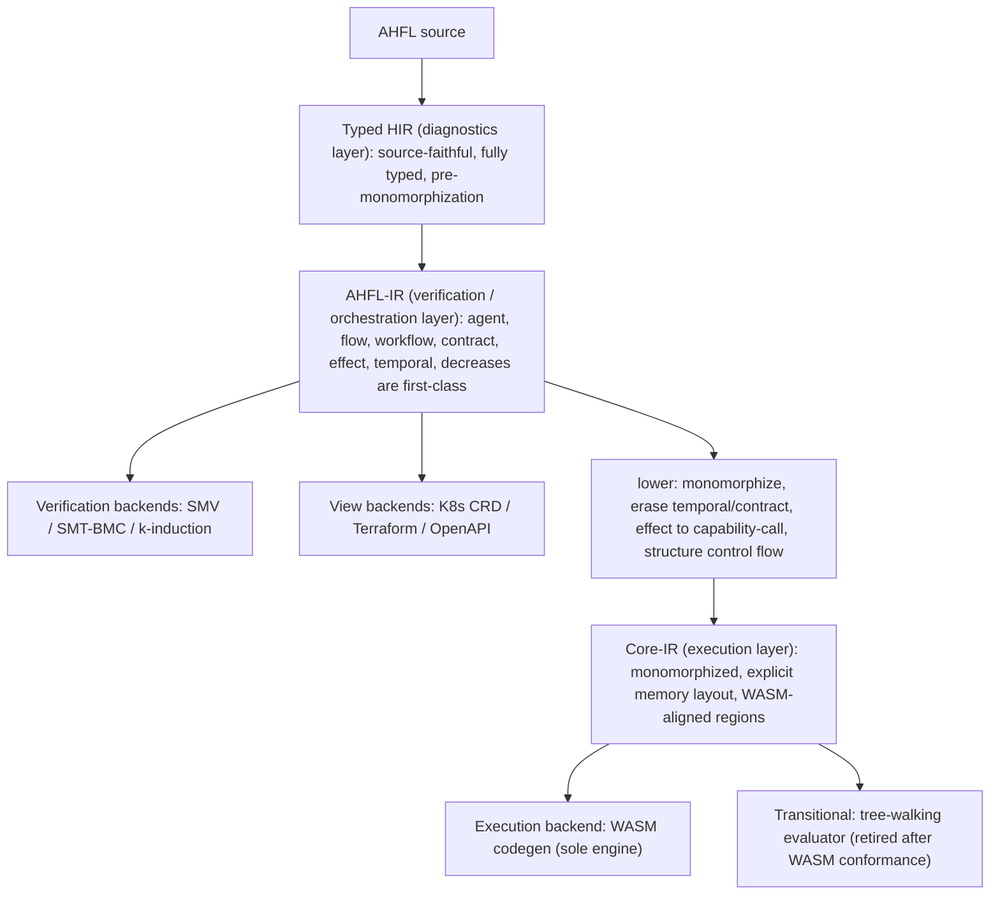
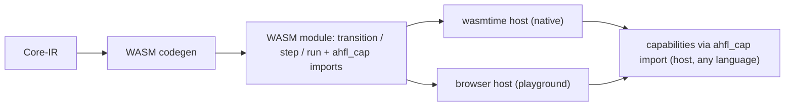

# RFC 0026: IR Tower and Execution Model

## Summary

本 RFC 把 [RFC 0020](0020-strategic-positioning-embeddable-workflow-dsl.zh.md)
「架构北极星」的前两条（IR 塔、WASM 唯一执行引擎）从定位判据展开为可实施的设计。它做两件事：

1. **用三层 IR 塔取代当前的单层 IR**：`Typed HIR`（诊断层，已有）→ `AHFL-IR`（验证 / 编排层）→
   `Core-IR`（执行层）。验证后端（SMV/SMT/BMC）消费 `AHFL-IR`，执行后端（WASM）消费 `Core-IR`，
   两条路径在塔上**分叉**（Dafny 式），互不污染。
2. **确立 WASM 为唯一执行引擎**：`Core-IR → WASM` codegen 消费 [RFC 0019](0019-wasm-runtime-model.zh.md)
   的 `ahfl_cap` capability import 契约；当前的 tree-walking evaluator
   （`src/runtime/evaluator/evaluator.cpp`）判定为**过渡形态**，在 WASM codegen 通过一致性
   （conformance）验收后**原子删除**。不自研虚拟机。

本 RFC 是**架构与分片计划**决策；具体的 WASM 字节序列 lowering 规则由本 RFC 的
Implementation Plan 分片承载并逐片落地，不在本文一次写死指令级细节。

## Motivation

当前 IR 是**单层**的：`ir::Program`（`include/ahfl/compiler/ir/program.hpp`）持有一个扁平
`ExprArena`，`ExprNode` 是一个 20-alternative 的 `std::variant`
（`include/ahfl/compiler/ir/expr.hpp:347`），`Decl` 覆盖 module/const/struct/enum/agent/flow/
workflow/contract/fn/trait/impl 等（`include/ahfl/compiler/ir/decl.hpp`）。**同一层 IR 同时**
被以下所有消费者共享：

- 形式化验证：`src/compiler/backends/smv/smv.cpp`、`src/verification/formal/`（SMT-BMC、
  k-induction、counterexample）。
- 执行：`src/runtime/evaluator/evaluator.cpp`（tree-walking，2000+ 行）。
- 五个 emit backend：WASM（`src/compiler/backends/infra/wasm_backend.cpp`，当前仅 WAT 骨架）、
  K8s CRD / Terraform / OpenAPI（`src/compiler/backends/infra/`）、IR-JSON
  （`src/compiler/ir/ir_json.cpp`）。

这带来三个不做决策就无法消除的结构性问题：

1. **Altitude 冲突（海拔混装）**：`TemporalExprNode`（`expr.hpp:421`，temporal 算子只有验证
   关心）与执行相关节点、`ContractDecl`（`decl.hpp:213`，验证语义）与 `FnDecl` 执行体挤在
   同一套 IR 里。每个执行后端都被迫"处理或显式拒绝"自己根本不消费的验证节点，反之亦然。
   单态化（执行必需）与 temporal/contract 保真（验证必需）是**互相冲突的降级方向**，压在
   一层 IR 上无法同时最优。

2. **`8-location sweep` 是设计债**：`expr.hpp:329-344` 有一份权威 checklist——每新增一个
   `ExprNode` alternative，必须手改 8 个文件（analysis / ir_print / verify / ir_json /
   opt_lower / visitor / typed_hir_lower / assurance），"漏一处即静默 data-loss bug"。这不是
   纪律问题，是**单层 IR 无分层职责 + 无单一真相源**的必然结果。（消灭 sweep 的机制由
   [RFC 0027](0027-query-frontend-and-ir-ssot.zh.md) 承载；本 RFC 负责把节点按层拆开，缩小每层
   的 variant 面。）

3. **执行路径不是顶尖形态**：唯一执行器是 tree-walking 解释器，无法产出可部署产物、无法上
   浏览器、无法达到编译执行的性能。[RFC 0019](0019-wasm-runtime-model.zh.md) 明确把完整 WASM
   codegen 列为 Non-Goal（只定了 ABI 契约与 WAT 骨架），留下"能 emit 一段跑不了真实 agent 的
   WAT"的缺口。

不做本决策，AHFL 的编译器基座停在"单层 IR + 解释执行",与 RFC 0020 声称的"可验证 + 可高效
嵌入多宿主"北极星有结构性差距。

## Goals

1. **确立三层 IR 塔的职责边界**：明确每层持有什么、擦除什么、被谁消费，使"某构造属于哪一层"
   与"某后端消费哪一层"成为架构约束而非惯例。
2. **确立验证路径与执行路径在塔上的分叉点**：验证后端消费 `AHFL-IR`；执行后端消费 `Core-IR`。
3. **定义 `AHFL-IR → Core-IR` 的降级语义**：单态化、effect 降为显式 capability-call、
   temporal/contract 擦除、控制流结构化（对齐 WASM region）、ADT/闭包显式内存表示。
4. **确立 WASM 为唯一执行引擎**，并定义 `Core-IR → WASM` codegen 的值表示 / 内存模型 /
   capability import 绑定 / 分片交付顺序。
5. **定义 tree-walking evaluator 的退役路径**：conformance 验收标准 + 原子删除条件，使"删除"
   成为可执行的验收门，而非口号。
6. **保持 `AGENTS.md` 非协商原则**：索引式身份、hash-consed 类型 + flat store、
   `std::variant` + visitor、诊断带 `SourceRange`；并保持 RFC 0020 定位不变（计算留宿主、
   capability 是唯一外部效应入口）。

## Non-Goals

1. **不在本 RFC 写死指令级 lowering 表**。`Core-IR → WASM` 的逐节点字节序列由 Implementation
   Plan 分片承载、随实现落地为文档；本 RFC 定层、定值表示、定分叉、定分片。
2. **不引入 MLIR / LLVM**。见 Alternatives：对 AHFL 体量属过度工程；塔用现有
   `std::variant` + flat arena + hash-consing 手写。
3. **不改变 RFC 0020 定位或 A/B 型表达力边界**。计算仍留宿主；本 RFC 只重构编译器内部结构。
4. **不改 capability 嵌入 ABI 的字节契约**。复用 [RFC 0019](0019-wasm-runtime-model.zh.md) /
   [RFC 0021](0021-capability-embedding-abi.zh.md) 的 `ahfl_cap` `(ptr,len)->ptr` 契约。
5. **不做 query 化前端与 IR 单一真相源派生**。那是 [RFC 0027](0027-query-frontend-and-ir-ssot.zh.md)。
   本 RFC 的分层为其铺路，但两者可独立评审。
6. **不承诺 GC**。Core-IR 的内存模型倾向 arena / 区域式管理（见 Open Questions），不引入
   通用垃圾回收。

## Design

### 塔的总览

三层各自的职责、身份、消费者：

| 层 | 持有 | 擦除 / 尚未做 | 主消费者 | 现状锚点 |
| --- | --- | --- | --- | --- |
| **Typed HIR** | 源码 range、完整类型、泛型参数、trait bound、诊断上下文 | 未 lower 到 IR | 诊断 / LSP / const eval | `include/ahfl/compiler/semantics/typed_hir.hpp`、`typed_hir_lower.cpp` |
| **AHFL-IR** | agent 状态机 / flow / workflow DAG / contract / effect 分级 / temporal 算子 / decreases 度量，全为一等公民；泛型**未**单态化 | 无内存布局、无指令级控制流 | 验证后端、视图后端 | 当前 `ir::Program` 的编排 + 验证子集 |
| **Core-IR** | 单态化后的函数体、显式 capability-call、结构化控制流（block/loop/if region）、ADT/闭包显式内存表示、值表示（见下） | temporal / contract / decreases **已擦除**（验证在上层完成）；无源码级泛型 | 执行后端（WASM）、过渡期 evaluator | 新增层 |

**关键不变式**：一个构造只在它该在的层出现。`temporal` / `contract` / `decreases` 在
`AHFL-IR` 是一等公民、在 `Core-IR` 不存在（已被验证消费并擦除）；单态化实例、内存布局在
`Core-IR` 存在、在 `AHFL-IR` 不存在。这消除 Motivation §1 的 altitude 冲突。

### 为什么是三层，而不是两层或四层

- **不能两层**（Typed HIR + 单一 IR，即现状）：验证要保 temporal/contract、执行要单态化擦除
  temporal/contract——同一层无法同时满足，就是今天的冲突。
- **不必四层**（如再插一个 STG/CPS 层）：AHFL 的执行语义是**结构化编排 + capability 调用**，
  不是通用高阶函数求值；闭包是受限的（RFC 0013 Non-Goal：无捕获列表首版），不需要 GHC 那样
  的 STG。Core-IR 直接对齐 WASM 结构化控制流即可。
- **三层的每层都有明确、互斥的消费者**：诊断 / 验证 / 执行。这是 Rust（HIR/MIR 面向不同
  消费者）与 Swift（SIL raw/canonical 分相）验证过的划分。

### AHFL-IR：验证 / 编排层

`AHFL-IR` 是 AHFL 的独特价值层，保留当前 `ir::Program` 里所有**编排与验证语义**：

- **一等公民**：`AgentDecl`（`decl.hpp:180`）状态机、`FlowDecl`（`decl.hpp:261`）、
  `WorkflowDecl`（`decl.hpp:293`）DAG、`ContractDecl`（`decl.hpp:213`）、`CapabilityDecl`
  的 effect 分级（`CapabilityEffectKind`）、`TemporalExprNode`（`expr.hpp:421`）、decreases
  度量（RFC 0013 KR5.3 已接入的 `decreases_recognizer`）。
- **泛型未单态化**：`FnDecl` / `TraitDecl` / `ImplDecl`（`decl.hpp:340/384/402`）保留类型参数与
  trait bound——验证在这一抽象层进行（SMV 建模状态机/temporal，SMT-BMC 建模 bounded 契约）。
- **消费者**：`src/compiler/backends/smv/smv.cpp`、`src/verification/formal/*`、视图后端
  （K8s/Terraform/OpenAPI 投影编排结构）。

`AHFL-IR` 相对今天 `ir::Program` 的**净化**：移出纯执行细节（如把容器字面量 lower 成
`CallExpr` 这类"为执行方便"的构造下沉到 Core-IR 的降级步骤里，`AHFL-IR` 保留更贴近源码语义
的形式），使验证后端看到的 IR 不含"为跑而做"的噪声。

### Core-IR：执行层

`Core-IR` 是 `AHFL-IR` 经 `lower` 得到的执行专用层。降级步骤（每步都是一个 pass，
Implementation Plan 分片）：

1. **单态化（monomorphization）**：泛型 `FnDecl`/`ImplDecl` 按具体类型实例化为单态副本
   （Rust MIR 式，索引式实例身份，复用现有 `include/ahfl/compiler/ir/mangling.hpp` 的
   name mangling 作为实例 key）。Core-IR 无类型参数。
2. **effect 降为显式 capability-call**：`AHFL-IR` 的 capability 调用（带 effect 分级）在
   Core-IR 降为一个显式的 `CapabilityCall{ symbol_id, args_ptr, args_len }` 节点，直接对应
   [RFC 0019](0019-wasm-runtime-model.zh.md) 的 `ahfl_cap` import 帧。这是"计算留宿主"在
   执行层的落点。
3. **temporal / contract / decreases 擦除**：验证已在 `AHFL-IR` 完成，Core-IR 不含这些节点。
   （契约的**运行时检查**若需要，降为普通的 `assert` + 分支，而非 temporal 节点。）
4. **控制流结构化**：`MatchExpr`（`expr.hpp:289`）等降为对齐 WASM `block`/`loop`/`if` 的
   结构化 region（WASM 无任意跳转，必须结构化）；`decreases`-verified 的递归/迭代降为
   WASM `loop`。
5. **ADT / 闭包显式内存表示**：enum payload（RFC 0001 的 variant 形式）、struct、容器
   （RFC 0025 bounded 容量）获得显式线性内存布局；闭包（RFC 0013 首版无捕获列表）降为
   WASM `table` 中的函数索引 + 环境指针。

**值表示（value representation）** —— Core-IR 的核心决策：

| AHFL 类型 | Core-IR / WASM 表示 |
| --- | --- |
| `Bool` / `Int`（有界 `BoundedIntT`） | `i32` / `i64`（按 refinement 宽度选择） |
| `Float` | `f64` |
| `Decimal` / `Duration` | 定点 / 整数纳秒（`i64`），语义见 spec |
| `String` | 线性内存 `(ptr, len)`，UTF-8 |
| enum（带 payload） | `(tag: i32, payload...)`，payload 按最大 variant 对齐 |
| struct | 字段按声明序的线性内存布局 |
| bounded 容器（RFC 0025） | 定长数组 `(ptr, len<=cap)`，cap 是编译期常量 |
| 闭包 | `(func_index: i32, env_ptr: i32)`，env 在线性内存 |
| capability 结果 | `(ptr, len)` 帧，宿主经 `ahfl_cap` 回填 |

内存管理倾向 **arena / bump 分配**（workflow 执行是有界、阶段化的，天然适合区域回收），
**不引入 GC**（见 Open Questions Q1）。

### 执行模型：WASM 唯一引擎 + evaluator 退役

- **唯一执行引擎**：`Core-IR → WASM`，capability 经 `ahfl_cap` import 回调宿主（复用 RFC 0019
  契约与 `emit_capability_imports`）。执行由成熟宿主（wasmtime / 浏览器）承担，**不自研 VM**。
- **evaluator 退役路径**（可执行的验收门，非口号）：
  1. WASM codegen 覆盖 Core-IR 全部节点；
  2. **conformance 套件**：现有 evaluator 的 e2e/golden 测试（`tests/` 下 evaluator 驱动的
     用例）迁移为"输入 `.ahfl` + 期望 output"的**引擎无关** conformance 用例；WASM 执行结果
     逐一匹配；
  3. capability 调用序列、状态迁移序列、workflow output 在 WASM 与旧 evaluator 上对齐（迁移
     期的差分测试，仅作过渡验收，**不长期保留第二引擎**）；
  4. 全绿后，**同一个 commit 内删除 `src/runtime/evaluator/`**（及其 evaluator-only 依赖），
     WASM 成为唯一执行路径。删除是 Implementation Plan 的显式最后一片。

  正确性此后由 conformance 套件 + AHFL 自身的语义保持验证（CompCert 式，长期可选，见 Open
  Questions Q3）保证，**而非**靠养一个慢解释器。

### backend / target 各消费哪一层（分类学落地）

| 类别 | 成员 | 消费层 |
| --- | --- | --- |
| 执行后端 | WASM codegen | Core-IR |
| 验证后端 | SMV / SMT-BMC / k-induction | AHFL-IR |
| 视图后端 | K8s CRD / Terraform / OpenAPI | AHFL-IR |
| 交换格式 | IR-JSON（每层可各有投影） | 对应层 |

IR-JSON（`src/compiler/ir/ir_json.cpp`，RFC 0013 KR5.9 已做到逐字节 round-trip）扩展为
**每层各有一个 JSON 投影**，作为层间边界的机器可读快照与差分测试锚点。

## User Impact

- **产物形态**：`ahflc emit wasm` 从"WAT 骨架"变为"可在 wasmtime / 浏览器真正执行的 WASM
  模块"。这解锁可部署产物与 Online Playground（后者仍是独立冻结项，本 RFC 只提供执行地基）。
- **执行语义唯一化**：开发内循环（REPL `:eval`、DAP、`ahflc run`）最终统一走 WASM 引擎；
  evaluator 删除后不再有"两套执行语义可能不一致"的风险。
- **诊断 / 验证不变**：Typed HIR 诊断与 SMV/SMT 验证的用户可观察行为不变（它们消费的层未改
  语义，只是从"单层"净化为"AHFL-IR"）。
- **IR-JSON 消费者**：下游工具会看到分层的 IR-JSON 投影；这是新增能力，旧的单层 IR-JSON 在
  过渡期保留直至消费者迁移。

## Compatibility and Migration

**这是一次大型内部重构，对语言语义非 breaking，对内部 IR 消费者 breaking。**

- **语言 / 源码层**：非 breaking。`.ahfl` 源码语义不变。
- **IR 内部结构**：breaking。`ir::Program` 单层结构被三层替代；所有直接依赖当前 `ExprNode` /
  `Decl` 布局的内部代码（analysis / verify / ir_json / opt / visitor / assurance / evaluator /
  backends）随分片迁移。这是内部 API，项目不承诺其前向兼容（见 `AGENTS.md`）。
- **执行行为**：evaluator 删除前，`ahflc run` 行为不变；删除后由 WASM 承担，行为须经
  conformance 套件证明等价。**迁移策略**：evaluator 与 WASM 引擎在过渡期并存并差分测试，
  仅当全套件绿才原子删除 evaluator——用户不会经历"能跑变不能跑"的中间态。
- **持久化 artifact**：IR-JSON 分层投影是新格式；旧单层投影在过渡期保留。artifact 仍
  secret-free、确定性（无 wall-clock/pid/host-path），遵守 artifact-chain 边界。

破坏范围与迁移步骤按 Implementation Plan 分片逐片记录；涉及内部 IR schema 的 commit 在 footer
标注 `BREAKING CHANGE:` 及影响子系统。

## Implementation Plan

按分片交付，每片一个可独立评审、可回归的 Conventional Commit。分片顺序尊重依赖：

1. **P1 塔骨架**：定义 `AHFL-IR` 与 `Core-IR` 的头（`include/ahfl/compiler/ir/` 下新增
   `ahfl_ir.hpp` / `core_ir.hpp` 或等价），先建**空壳类型 + 层边界**,不改行为。
2. **P2 AHFL-IR 净化**：把当前 `ir::Program` 的编排 + 验证子集迁移为 `AHFL-IR`；验证后端
   （smv/smt）改为消费 `AHFL-IR`；golden 无回归。
3. **P3 lower pass：AHFL-IR → Core-IR（骨架）**：单态化 + temporal/contract 擦除 + effect→
   capability-call，先覆盖 agent 状态机 + flow/workflow 编排（不含复杂表达式），产出 Core-IR。
4. **P4 Core-IR 值表示 + 内存布局**：实现 Design §值表示表；ADT/struct/bounded 容器/闭包的
   显式布局；单元 + golden。
5. **P5 WASM codegen（编排层）**：`Core-IR → WASM`，agent transition / flow / workflow +
   `ahfl_cap` import；产物在 wasmtime 真正跑起来；conformance 子集绿。
6. **P6 WASM codegen（计算层）**：表达式 / 算术 / 控制流 / match / 闭包全部 lower 到 WASM 指令。
7. **P7 conformance 套件**：把 evaluator e2e/golden 迁移为引擎无关 conformance 用例；WASM 全绿；
   WASM vs evaluator 差分测试通过。
8. **P8 evaluator 退役**：删除 `src/runtime/evaluator/`；`ahflc run` / REPL / DAP 切到 WASM 引擎；
   全套件绿。`BREAKING CHANGE:` 标注。
9. **P9 IR-JSON 分层投影**：每层 JSON 投影 + round-trip；旧单层投影标记弃用。

每片落地后追加 `implementation_prs` 与 Decision History 条目。

## Test Plan

- **单元**：每层 IR 的构造 / visitor / 布局计算；lower pass 的单态化正确性、temporal/contract
  擦除完备性、effect→capability-call 映射。
- **golden（正 + 负）**：`AHFL-IR` 与 `Core-IR` 的文本 dump golden；`Core-IR → WASM` 的 WAT/WASM
  golden；负例覆盖"验证节点误入 Core-IR""未单态化残留"等结构违规（由分层 verifier 捕获）。
- **conformance（引擎无关）**：`.ahfl` + 期望 output，同时喂 WASM 与（过渡期）evaluator，逐一
  匹配。这是 evaluator 退役的验收门。
- **一致性 / 差分**：WASM 执行的状态迁移序列 / capability 调用序列 / output vs evaluator（过渡期）。
- **round-trip**：分层 IR-JSON 逐字节 round-trip（沿用 RFC 0013 KR5.9 的方法）。
- **真实执行**：`ahflc emit wasm` 产物在 wasmtime 加载执行的集成测试（对标 RFC 0019 的真实
  执行边界）；浏览器 profile 的最小 smoke。
- **fuzz / property**：lower pass 的语义保持 property（对随机合法程序，Core-IR 执行 ≡ AHFL-IR
  参考语义，延续 RFC 0013 KR5.10 lowering-equivalence 的思路）。
- **release-evidence / budget**：WASM 产物 size budget、codegen compile-time budget（沿用现有
  `quality-gates`）。

## Rollout and Stabilization

1. `draft → review`：清零 Open Questions（内存管理、controlflow 结构化边界、语义保持验证
   深度、单态化爆炸预算），compiler + runtime owner sign-off。
2. `accepted`：塔与执行模型被采纳；开始 P1 分片。
3. `implementing`：填 `tracking_issue` / `discussion`，按分片落地，逐片记 Decision History。
4. `implemented`：P1–P9 全部落地，evaluator 已删除，WASM 为唯一引擎，conformance 全绿。
5. `stabilized`：三层塔在 `docs/design` 稳定表述，`docs/spec` 的执行语义引用 WASM 引擎为准，
   路线图以本架构为组织轴。

## Alternatives

1. **保持单层 IR，只加 pass**（现状延续）。**失败原因**：无法解决 altitude 冲突——验证要保
   temporal/contract、执行要单态化擦除,同层不可兼得；`8-location sweep` 债务随节点增长线性
   恶化。这是"一百个小 workaround"，违反 `AGENTS.md` Principle 1。
2. **采用 MLIR 作为 IR 基础设施**。MLIR 提供 dialect / region / 自动化 pass 基建,看似省事。
   **失败原因**:对 AHFL 体量是过度工程——引入巨大 C++ 依赖与构建复杂度、学习曲线陡、且其
   通用性换来的抽象与 AHFL 已验证的 `std::variant` + flat arena + hash-consing 风格
   （`AGENTS.md` Principle 2/3/4）冲突。Rust 手写 MIR 塔、GHC 手写 Core/STG 都没用 MLIR;
   AHFL 该学它们,不该把地基押在一个重依赖上。
3. **采用 LLVM 直接做 native codegen**（跳过 WASM）。**失败原因**:①与 RFC 0020"多宿主 + 可
   移植沙箱"定位冲突——native 产物不可移植、无沙箱;②LLVM 依赖极重;③放弃浏览器 Playground;
   ④WASM 已提供成熟引擎生态,`ahfl_cap` 契约已定,是更短且战略自洽的路径。
4. **自研字节码 VM**。**失败原因**:自定义字节码 + 解释器/JIT + GC + 跨平台 + 调试接入是
   数十人年工程,换来的东西 WASM 生态（wasmtime/浏览器/组件模型/调试）已免费提供且更成熟。
   今天的新语言（MoonBit/Grain/AssemblyScript）全选 WASM 而非自研 VM。
5. **保留 evaluator 作为长期"参考实现",与 WASM 双引擎共存**。**失败原因**:AHFL 只有一家
   实现,不需要"给第三方对齐用的基准";双引擎意味着两套执行语义要永久同步,是持续的
   一致性负担,且违反 Principle 1 的"禁止 just-in-case 死代码"。正确做法是 conformance 套件 +
   语义保持验证保正确性,evaluator 用完即删。

## Open Questions

进入 `review` 前,五个设计问题已给出**决策 + 理由**(共同哲学:执行层薄而确定、内存有界、
爆炸可控;验证深度分"必做工程级"与"长期可选证明级")。具体阈值与证明深度的落地细节由
Implementation Plan 对应分片承载。

1. **Core-IR 内存管理模型** → **决策:arena / region-based,不引入 GC。** workflow 执行是
   有界、阶段化的(agent 状态迁移 / flow 步 / workflow DAG 节点),天然适合按执行 region 分配
   与整体回收;bounded 容器(RFC 0025)容量编译期已知,布局定长。闭包(RFC 0013 首版无捕获
   列表)的环境是受限的,其跨阶段存活用**显式 region 提升**处理(把需跨阶段存活的环境分配到
   更外层 region),而非引入通用 GC。**理由**:GC 与 WASM 线性内存 + 形式化验证的确定性诉求
   冲突(GC 引入非确定回收时机);arena 的分配/回收确定、可建模、与 bounded 验证子集一致。
   若未来出现 region 无法覆盖的真实存活场景,再按数据升级到区域推断,不预先过度设计。
2. **控制流结构化边界** → **决策:全部降为 WASM 结构化 region,不需 relooper。** AHFL 无任意
   goto;`MatchExpr`(`expr.hpp:289`)降为嵌套 `block`/`br_table`,`?`(RFC 0014 try 算子)与
   early-return 降为 `block` + `br` 到块末(结构化 early-exit,WASM 原生支持)。AHFL 的控制流
   本就是结构化的,不会产生不可归约(irreducible)控制流图,故无需 relooper 级算法。**理由**:
   语言层已无 goto,结构化 lowering 是自然映射;这也与"decreases 可验证终止"一致(结构化
   循环才好证终止)。
3. **语义保持验证的深度** → **决策:conformance 差分测试为必做验收门(工程级);CompCert 式
   形式化 lower-证明为长期可选,本 RFC 只留接口不承诺。** evaluator 退役(KR6.8)严格门控在
   conformance 全绿(KR6.7),这是必做。是否把"lower pass 保持参考语义"上升为形式化证明,作为
   AHFL 验证护城河的延伸,列为 accepted 后可独立立项的增强,不阻塞本 RFC 落地。**理由**:
   工程级差分已足以安全退役 evaluator;形式化证明 ROI 高但工程量大,不该绑死在架构落地的
   关键路径上。
4. **单态化爆炸预算** → **决策:复用 RFC 0013 §Design 的"编译期预算 + 缓存"策略,超限
   fail-closed 报诊断。** 单态化实例按 mangled key(`include/ahfl/compiler/ir/mangling.hpp`)
   缓存去重;设一个编译期实例数预算(具体阈值由 KR6.4 分片定,可配置),超限时报一条带
   SourceRange 的可操作诊断(指出爆炸源的泛型调用链),而非静默生成或 OOM。**理由**:
   fail-closed + 可操作诊断符合 Principle 5;预算可配置留调优空间。
5. **过渡期双 IR-JSON 的弃用时点** → **决策:旧单层 IR-JSON 在 evaluator 退役(KR6.8)后、
   所有下游消费者迁移到分层投影(KR6.9)时删除,以 `BREAKING CHANGE:` 标注。** 过渡期两者
   并存,用 round-trip golden 双守护。**理由**:artifact 消费者迁移是渐进的,弃用时点绑定到
   一个明确的里程碑(KR6.9 完成)而非悬空。

## Decision History

- 2026-08-28: Draft opened。承接 [RFC 0020](0020-strategic-positioning-embeddable-workflow-dsl.zh.md)
  「架构北极星」的北极星一（IR 塔）与北极星二（WASM 唯一执行引擎),展开为三层塔设计 +
  `AHFL-IR → Core-IR` 降级语义 + WASM codegen 值表示/内存模型 + evaluator 退役路径 + 9 片
  Implementation Plan。query 化前端与 IR 单一真相源派生转交
  [RFC 0027](0027-query-frontend-and-ir-ssot.zh.md)。
- 2026-08-28: Status draft → review(KR6.1 部分)。五个 Open Questions 全部给出决策 + 理由:
  Core-IR 内存 = arena/region(无 GC);控制流全部降 WASM 结构化 region(无 relooper);
  语义保持 = conformance 差分必做、形式化证明长期可选;单态化 = 编译期预算 + 缓存 + 超限
  fail-closed 诊断;双 IR-JSON 弃用绑定 KR6.9 里程碑。填 shepherd/tracking/discussion。
  **`review → accepted` 待 compiler + runtime owner sign-off**——该步授权一场删除现役
  evaluator、重写 IR 分层的大型重构,须显式批准。
- 2026-08-28: Status review → accepted(KR6.1 达成)。sign-off 经项目 lead 于 Q4 路线图
  Objective 6 确认:路线图已把本 RFC 的完整落地(三层塔 + WASM 唯一引擎 + evaluator 退役)
  列为 Q4 验收项(KR6.1–6.9)并从"明确排除"表移除"完整 WASM codegen",即授权本 RFC 进入
  实现。实现按 §Implementation Plan 9 片推进,KR6.2 起为**零行为变更**的塔骨架;evaluator
  删除(P8/KR6.8)严格门控在 conformance 全绿(P7/KR6.7)之后,过渡期不破坏 `ahflc run`。
- 2026-08-28: Status accepted → implementing。**P1 塔骨架落地(KR6.2,commit `0243ff10`)**:
  新增 `include/ahfl/compiler/ir/tower.hpp`——`Layer` 枚举(TypedHir=0 → AhflIr=1 → CoreIr=2,
  索引式身份)、`Path` 枚举、`path_of()` 编码 Dafny 式分叉(验证消费 AhflIr、执行消费 CoreIr、
  诊断在分叉之上)、零成本 `LayerTag<L>`(后续分片可把"层身份"带进类型,使读错层成为编译错误)。
  `src/compiler/ir/tower.cpp` 用 `static_assert` 锁死层序与层→路径分叉;`tests/unit/compiler/ir/
  tower.cpp` 3 个 doctest 用例。**零行为变更**:无消费者,现有 backend 仍走 `ir::Program`。
  全套件 463/463 绿。
- 2026-08-28: **P2 AHFL-IR 层边界落地(KR6.3,commit `a1a38d1a`)**:alias-first 增量——
  `program.hpp` 新增 `using AhflIr = Program`(doc 注明这是 `tower::Layer::AhflIr` 验证/编排层,
  今日结构同 Program,节点集净化留后续片)。验证/视图后端入口签名 re-point 到 `const ir::AhflIr&`:
  `print_program_smv` / `SmvPrinter::print`(smv)、`lower_k8s_crd` / `lower_openapi` /
  `lower_terraform` / `lower_wasm` / `build_capability_effects`(infra)、`emit_program_smt`(smt)。
  内部 indexing/collection helper 保留 `ir::Program`(别名同型,只标注顶层边界)。**零行为变更**:
  8 文件 +58/-19,SMV/emit-ir/k8s/openapi/terraform golden 逐字节不变;全套件 exit 0。
- 2026-08-28: **P3 Core-IR 骨架 + lower 脚手架首增量(KR6.4 部分,commit `31eded7f`)**:新增
  `include/ahfl/compiler/ir/core_ir.hpp`(namespace `ahfl::ir::core`)——`CoreProgram`(format
  version `ahfl.core.v1`,flat store)、`CoreDecl = variant<CoreAgentDecl>`(最小起步)、
  `CoreAgentDecl`(状态机投影:`SymbolRef` + `mangle_instance` 实例 key + 索引式 `CoreStateId`
  states/initial/finals/`CoreTransition`)。header 注明 temporal/contract/decreases/quota 在此层
  **不可表示(已擦除)**。新增 `src/compiler/ir/core_lower.cpp` 的 `lower_ahfl_to_core(const
  AhflIr&) -> CoreProgram`:lower AgentDecl 状态机(状态 intern 成索引、确定性),其余 Decl kind
  catch-all 跳过(留后续子片)。3 doctest(states/initial/finals/transitions 保真 + contract 不
  泄漏 + 二次 lower 相等)。**additive、零行为变更**:无 backend/evaluator 消费 CoreProgram(WASM
  codegen 是 KR6.5);3 新文件 + 2 CMake 行,全套件 463/463 绿。**KR6.4 剩余子片**:完整单态化、
  effect→capability-call、flow/workflow lower、值表示/内存布局(P4)。
- 2026-08-28: **P3 effect→capability-call lower 子片(KR6.4,commit `c48e2c18`)**:`core_ir.hpp`
  的 `CoreDecl` variant 扩为 `variant<CoreAgentDecl, CoreCapabilityDecl>`。`CoreCapabilityDecl`
  持 `SymbolRef`(canonical 身份)+ `CapabilityEffectKind`(复用枚举)+ `param_types`(ahfl_cap
  marshalling 签名)+ `return_type_ref`——即 [RFC 0019](0019-wasm-runtime-model.zh.md)/[RFC 0020]
  (0020-strategic-positioning-embeddable-workflow-dsl.zh.md) 的 `ahfl_cap` import 显式边界
  (「计算留宿主」的执行层落点);effect kind 之外的 domain/idempotency/receipt/retry/timeout/
  compensation 全部擦除,param name 丢弃。`lower_ahfl_to_core` 加 `CapabilityDecl` visitor 臂
  (确定性、源序;含 per-TU `clone_type_ref` 深拷贝,TypeRef 是 move-only)。3 新 doctest。
  **additive、零行为变更**:仍无 backend 消费;3 文件,ir 测试 59/59、全套件 463/463 绿。
- 2026-08-31: **P4 coercion(annotated-let 类型调整)三段实现链闭合(KR6.4 子片)**。设计
  `docs/design/core-ir-p4-coercion.zh.md`(Codex-approved rev 4,commit `eff693ac`);实现者
  Codex、审查者 Claude 的分工评审循环。**F1(变体/泛型-decl 元数据 + inert typed
  adjustment-plan 数据模型 + IR-JSON 保真)**:`c3aa3ec2` 落地,`ddf7f391` forward-fix
  (显式 RegistrationOrigin、fail-closed wire enum、真实 variance gate、单 SSOT、mono 保真),
  `fc06245b` 二次 forward-fix(无条件 BackendReady variance 长度门 + typed-HIR 内层 kind 校验),
  roadmap 验收记于 `17fb4cc6`。**F2(witness-carrying memoized solver + let 产出)**:`1e676d3b`
  `feat(sema): persist coercion witnesses for annotated lets`——RelationDecision/witness arena、
  producer 接 annotated-let、BackendReady adjustment verifier。评审发现并修复 1 个 P0:top/bottom
  边界(`let x: Any = y`)产空-ops witness,IR verifier 必拒——修法是新增 `ToAny`/`FromNever`
  双 leaf op 贯通 solver→wire→bridge→verifier,`has_top_bottom` 纳入节点末尾短路。**F3(Core
  plan/expr lowering + verifier + probes)**:`814d3378`
  `feat(core-ir): lower and verify coercion plans`——CoreCoercionPlanId/Op/PlanNode + CoreCoerceExpr
  进 CoreExprNode,flow/workflow 各自 normalized proof arena;Core op **不含** variance/ToAny/
  FromNever/VariantToEnum(方向从 `CoreTypeDecl.variances` SSOT 读)。lower_let_boundary 非
  identity 一律 bind_pure(CoreCoerceExpr) 产 fresh SSA(**绝不 re-label**,P0-4);ToAny/FromNever
  在任何 Core type intern 前早拒(唯一 `core.INVALID_COERCION`,不泄漏 Any/Never materialize
  错误);VariantToEnum 仅 Core source==result 擦除;缺 plan 且 Core 类型不同 -> `core.MISSING_ADJUSTMENT`。
  verifier:从 CoreCoerceExpr root 可达性(no-orphan)、全局 3-color 无环、per-op canonical order +
  唯一性 + bounds + TypeArg cov/contra 方向(读 `CoreTypeDecl.variances`,invariant/非法拒)+
  Fn param-contra/return-cov + unnamed 维度覆盖。新增码 `core.MISSING_ADJUSTMENT`/
  `core.INVALID_COERCION` + `core.verify.{COERCION_INVALID,COERCION_KIND_MISMATCH,
  COERCION_VARIANCE_INVALID,COERCION_IDENTITY}`。**additive、零行为变更**(无 backend 消费
  CoreCoerceExpr;物理实现留待 P4-D):dev -Werror 全量 build clean,ir 262/262
  (1743 assertions)、ir_equal 9、ir_json 10、ir_opt 16 绿。KR6.4 剩余:完整单态化、值表示/
  内存布局(P4 主体)、WASM codegen(KR6.5)。
