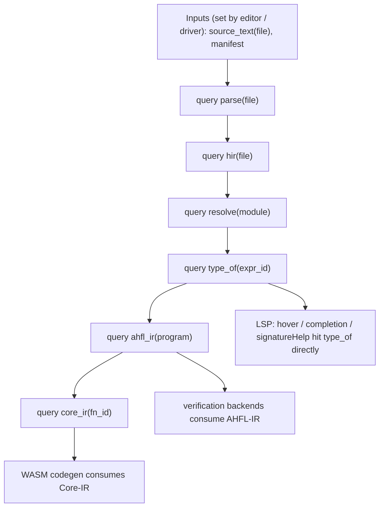
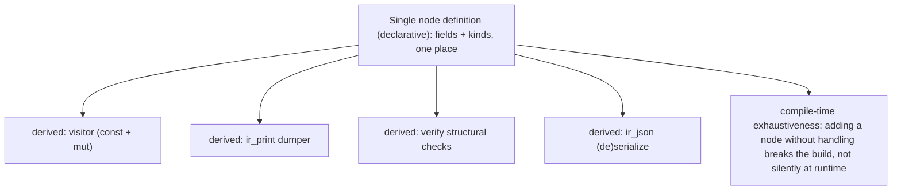

# RFC 0027: Query-Based Frontend and IR Single Source of Truth

## Summary

本 RFC 把 [RFC 0020](0020-strategic-positioning-embeddable-workflow-dsl.zh.md)
「架构北极星」的第四条（query 化前端 + IR 单一真相源）展开为可实施设计。它做两件正交但互补
的事：

1. **query 化前端**：把 AHFL 的编译前端（parse → resolve → typecheck → lower）从"从头跑到尾的
   pass 流水线"重构为**带缓存、按需求值、自动失效的 query 图**（salsa / Roslyn / rust-analyzer
   式）。目标是让 **LSP 的增量、缓存、亚秒级响应成为架构自然产物**，取代
   `src/tooling/incremental/` 在流水线外**手工模拟**依赖图与失效的现状。
2. **IR 节点单一真相源（SSOT）**：用一个声明式定义（宏 / 内建 DSL）一次定义每个 IR 节点，
   **自动派生** visitor / printer / verifier / serializer，**消灭** `include/ahfl/compiler/ir/expr.hpp:329-344`
   记录的 `8-location sweep`——每加一个 IR 节点必须手改 8 个文件、漏一处即静默 data-loss bug。

本 RFC 是**编译器架构与机制**决策；它不改语言语义,也不改 [RFC 0026](0026-ir-tower-and-execution-model.zh.md)
定义的 IR 塔**分层**,而是改这些层**如何被计算（query）与如何被定义（SSOT）**。

## Motivation

### 问题一：前端是 pass 流水线，增量靠手工模拟

当前编译是一条串行流水线（`src/tooling/cli/cli_driver.cpp`：`resolver.resolve()` →
`type_checker.check()` → `lower_program_ir()`）。IDE 的增量能力靠一个**独立子系统**
`src/tooling/incremental/`（dependency graph + IR cache + changed-compile）**在流水线之外手工
重建**"改了什么、什么要重算"。这有三个结构问题：

1. **两套真相**：流水线是一套求值顺序，incremental 子系统是另一套手工维护的依赖/失效模型。
   两者可能不一致——增量结果与全量结果 diverge 就是 latent bug。
2. **粒度粗**：手工依赖图难以做到"改一个字符只重算依赖它的 query"。顶尖 IDE（rust-analyzer /
   Roslyn）的亚秒级响应来自**细粒度、自动失效**的 query 缓存,手工模拟难以企及。
3. **hover/completion 用文本启发**：`docs/plans/issue-backlog-global-gaps.zh.md` §3.3 明确记录
   "hover/completion/signatureHelp 目前只依赖轻量文本/符号启发,而非 Typed HIR + condition
   facts"。根因是"按需拿某个位置的类型信息"在 pass 流水线里代价高（要跑整条链）,只有 query
   化（`type_of(pos)` 是一个带缓存的 query）才能廉价按需求值。

顶尖前端（rust-analyzer 基于 salsa、Roslyn 基于 red-green tree + incremental、rustc 正在
query 化）无一例外建立在 **demand-driven query 引擎**上。AHFL 现在是在用一个旁路子系统**模拟**
这件本该是架构地基的事。

### 问题二：IR 节点无单一真相源，靠 8-location sweep 手工同步

`include/ahfl/compiler/ir/expr.hpp:329-344` 有一份权威 checklist：每新增一个 `ExprNode`
alternative，必须手改 8 个文件——

```
1. src/compiler/ir/analysis.cpp        2. src/compiler/ir/ir_print.cpp
3. src/compiler/ir/verify.cpp          4. src/compiler/ir/ir_json.cpp
5. src/compiler/ir/opt/opt_lower.cpp   6. src/compiler/ir/visitor.cpp
7. src/compiler/ir/typed_hir_lower.cpp 8. src/compiler/assurance/assurance.cpp
```

注释原文："Missing any one of these produces a silent data-loss bug (default branches tend to
skip the new node)。" 这在实践中已咬人——项目记忆记录过 `substitute_type` "silently drops"
新增字段的事故。这**不是纪律问题,是缺少单一真相源的必然结果**：节点的"结构"散落在 8 处手写
的 switch/visit 里,没有一个地方是唯一定义。

顶尖编译器用**代码生成 / 派生**解决：Rust 用 `#[derive]` 宏自动派生 visitor/fold/`Debug`；
MLIR 用 TableGen 从 `.td` 生成 printer/parser/verifier；GHC 用 `deriving`。AHFL 缺这一层。

不做本决策,前端增量与 IR 维护成本随规模线性恶化,IDE 体验停在"文本启发"档,IR 每次演进都
在赌"8 处别漏"。

## Goals

1. **确立 query 引擎模型**：定义 query 的身份（索引式 key）、缓存、依赖追踪、失效
   （invalidation）与循环处理,使增量成为求值引擎的内建性质而非旁路模拟。
2. **把前端表述为 query**：`parse(file)` / `resolve(module)` / `type_of(expr)` / `hir(file)` /
   `lower(...)` 等成为带缓存的 query;LSP 请求直接命中 query,改动只失效依赖子图。
3. **统一增量与全量**：删除 `src/tooling/incremental/` 的手工依赖/失效模拟,增量 = query 引擎
   在脏输入下的自然重算;全量 = 冷缓存下的同一套求值。二者**同一真相**。
4. **确立 IR 单一真相源机制**：一个声明式节点定义,自动派生 visitor（const + mut）/ printer /
   verifier / (de)serializer,使 `expr.hpp` 的 8-location sweep checklist 变为**编译期不可能
   漏**。
5. **保持 `AGENTS.md` 原则**：query key 与节点身份索引式（非字符串）;派生代码保持
   `std::variant` + visitor 形态、flat arena、hash-consing;诊断带 `SourceRange`。
6. **与 [RFC 0026](0026-ir-tower-and-execution-model.zh.md) 协同**：query 产出 IR 塔各层;SSOT
   机制同时服务三层（Typed HIR / AHFL-IR / Core-IR）的节点定义。

## Non-Goals

1. **不改语言语义**,不改 IR 塔的**分层**（那是 RFC 0026）。本 RFC 改"如何算"与"如何定义"。
2. **不引入外部 query 框架依赖**（如把 Rust 的 salsa crate 搬进来)。AHFL 是 C++23,自研一个
   小而专的 query 引擎（见 Design）,不引重依赖——与"不引 MLIR"同一判断。
3. **不引入 procedural macro 系统**。SSOT 用 C++ 可用的机制（X-macro / `constexpr` 反射的
   受控子集 / 代码生成脚本三选一,见 Open Questions),不发明通用宏语言。
4. **不做分布式 / 持久化 query 缓存的生产化**。首版内存内 query 缓存;持久化 cache contract
   已有 [RFC 0016](0016-incremental-cache-contract.zh.md),两者衔接点在 Design 说明,但持久化
   生产化不在本 RFC。
5. **不重写验证 / 执行后端**。后端继续消费 RFC 0026 的层;本 RFC 只改这些层的**生产方式**。

## Design

### query 引擎模型



- **输入（inputs）**：编辑器/驱动设置的原子事实——`source_text(file)`、manifest、编译选项。
  改一个文件 = 重设一个 input。
- **query**：纯函数 + 缓存。`type_of(expr_id)` 只在其**依赖的输入或上游 query**变化时重算;
  否则命中缓存。依赖关系由引擎在求值时**自动记录**（谁读了谁),无需手写依赖图。
- **失效（invalidation）**：input 变化 → 引擎标记依赖它的 query 为脏 → 下次读取按需重算
  （demand-driven,不主动全算)。这正是 salsa 的 red-green 算法思路。
- **身份**：query key 是索引式（`FileId` / `ExprId` / `SymbolId` / `ModuleId`,复用现有
  `SymbolId` 等 ID 体系,`AGENTS.md` Principle 2）,非字符串。
- **循环**：编译器 query 图理论上无环（HIR 依赖 parse,不反向);潜在环（如相互递归类型的
  `type_of`)用引擎的 cycle 策略处理（fixpoint 或报诊断),与 RFC 0013 关系求解已用的
  coinductive 假设一致。

**自研而非引入 salsa**：实现一个小的 C++ query 引擎（`QueryEngine` 持有 input storage +
memo table + 依赖追踪栈 + revision 计数),query 以函数 + 缓存槽注册。对标 salsa 的核心机制
（inputs / derived queries / revision-based invalidation),但只做 AHFL 需要的子集,不引 crate。

### 前端 query 化：删除手工 incremental 子系统

当前 `src/tooling/incremental/`（dependency graph + IR cache + changed-compile + 独立
`ahfl-incremental` 入口)是在**模拟** query 引擎该做的事。query 化后：

- **全量编译** = 冷 QueryEngine 上求值 `ahfl_ir(program)` / `core_ir(...)`。
- **增量编译** = 编辑器重设若干 `source_text(file)` input,QueryEngine 自然只重算脏子图。
- `src/tooling/incremental/` 的手工依赖/失效逻辑**删除**;其对外能力（changed-compile、
  IR cache)由 QueryEngine 原生提供。[RFC 0016](0016-incremental-cache-contract.zh.md) 的
  cache contract 成为 QueryEngine **持久化层**的契约（哪些 query 结果可跨进程持久化、如何
  key、如何验真),而非一个独立子系统。

**LSP 直接受益**：`textDocument/hover` / `completion` / `signatureHelp` 从"文本/符号启发"
改为直接读 `type_of(expr_at(pos))` / `hir(file)` query——因为按需拿单点类型信息现在是廉价的
缓存命中,不再需要跑整条流水线。这关闭 backlog §3.3 的核心缺口。

### IR 单一真相源（SSOT）

目标：每个 IR 节点**只定义一次**,visitor（const + mut）/ printer / verifier /
(de)serializer **自动派生**,使 `expr.hpp:329-344` 的 8-location sweep 变为编译期不可能漏。



- **单一定义**：节点的字段、种类、子节点引用（`ExprRef` 等)在**一个声明式表**里定义。三个
  候选机制（Open Questions Q1 定选型):
  1. **X-macro**（纯 C++ 预处理器,零依赖,AHFL 已在别处用过模式):一个 `.def` 文件列节点,
     多处 `#include` 展开成 variant / visitor / printer。
  2. **代码生成脚本**（如 Python 从一个 schema 生成 `.hpp`/`.cpp`,类似 MLIR TableGen 的轻量
     版):构建期生成,可读性最好,但引入生成步骤。
  3. **`constexpr` + 受控反射习语**：用聚合体 + `std::variant` 索引在编译期驱动通用 visit,
     减少手写 switch。
- **关键性质：编译期穷尽性**。派生的 visitor 用 `std::visit` + 对 variant 全 alternative 的
  编译期穷尽检查——**加一个节点却没在单一定义里补齐,构建失败,而不是运行时静默丢数据**。
  这把"漏一处 = silent bug"变成"漏 = 编译不过"。
- **保持现有形态**：派生产物仍是 `std::variant` + visitor（Principle 4)、扁平 arena
  （Principle 3);SSOT 只是消除**手写重复**,不改存储策略,不引入继承/虚函数。
- **服务三层**：同一 SSOT 机制定义 Typed HIR / AHFL-IR / Core-IR（RFC 0026）三层的节点,
  三层各自的 print/verify/serialize 全部派生。

### 与 RFC 0026 的接缝

- RFC 0026 定义**层与降级语义**（IR 塔有哪些层、每层持有什么);本 RFC 定义**这些层如何被
  计算（query）与如何被定义（SSOT）**。
- `ahfl_ir(program)` / `core_ir(fn_id)` 是 query;它们的**节点**由 SSOT 定义。两 RFC 在
  "IR 节点集合"上交汇,但可独立评审、独立分片:RFC 0026 可先落层（用当前手写 sweep),
  本 RFC 再叠加 SSOT 派生;或反之。依赖是**软**的。

## User Impact

- **IDE 体验跃升**：hover/completion/signatureHelp 变为类型驱动（读 `type_of` query),而非
  文本启发;大文件/大项目下编辑响应从"重跑流水线"变为"亚秒级缓存命中"。对标 rust-analyzer。
- **`ahfl-incremental` 入口**：其能力并入主编译路径（QueryEngine 原生增量),独立子系统
  退役;用户看到的是"编辑器/CLI 增量更快更准",而非一个旁路工具。
- **贡献者体验**：新增 IR 节点从"改 8 个文件 + 祈祷没漏"变为"改 1 处单一定义,编译器逼你补
  齐"。这直接降低 IR 演进的事故率。
- **语言语义 / 验证 / 执行**:用户可观察的语义不变——本 RFC 改"怎么算/怎么定义",不改"算出
  什么"。

## Compatibility and Migration

**对语言语义非 breaking;对编译器内部前端架构 breaking。**

- **源码 / 语义**:非 breaking。
- **前端内部**:breaking。串行流水线驱动改为 QueryEngine 驱动;`src/tooling/incremental/`
  删除。属内部 API,项目不承诺前向兼容。
- **迁移策略**:query 化按子系统渐进——先把 parse/hir/typecheck 包成 query 而**保持** driver
  行为等价（全量结果逐位一致),再切 LSP 到 query,再删 incremental 子系统。每步用"全量 vs
  query 结果等价"回归守护,避免中间态回归。
- **SSOT 迁移**:节点逐类迁到单一定义,派生产物与手写产物做**逐字节 golden 对比**(IR dump /
  IR-JSON 不变)后再删手写 switch。sweep checklist 在全部迁完后从 `expr.hpp` 删除。
- **artifact**:IR-JSON 输出在迁移后须与迁移前逐字节一致(用 RFC 0013 KR5.9 的 round-trip
  golden 守护);持久化 query cache 遵守 [RFC 0016](0016-incremental-cache-contract.zh.md)
  的 secret-free / 确定性 / 索引式 key 契约。

## Implementation Plan

1. **P1 QueryEngine 内核**:实现 input storage + memo table + 依赖追踪 + revision-based
   失效 + cycle 策略,纯库 + 单测,先不接前端。
2. **P2 parse/hir query 化**:`parse(file)` / `hir(file)` 包成 query;driver 改为经 QueryEngine
   求值;全量结果与旧流水线逐位等价回归。
3. **P3 resolve/typecheck query 化**:`resolve(module)` / `type_of(expr)` 等;等价回归。
4. **P4 LSP 切 query**:hover/completion/signatureHelp 改读 `type_of` / `hir`;
   `src/tooling/lsp/` 相关 handler 迁移;真实编辑序列回归。
5. **P5 删除手工 incremental 子系统**:`src/tooling/incremental/` 退役,能力并入 QueryEngine;
   `BREAKING CHANGE:` 标注;[RFC 0016](0016-incremental-cache-contract.zh.md) cache contract
   重锚为 QueryEngine 持久化层。
6. **P6 SSOT 机制选型 + 试点**:按 Open Questions Q1 选定机制,先对**一个** IR 节点集合
   (如 Typed HIR 的 Expr)落 SSOT,派生 visitor/print/verify/json,与手写产物逐字节等价。
7. **P7 SSOT 铺开**:三层 IR 全部节点迁到单一定义;删除 8 处手写 sweep;从 `expr.hpp` 删除
   sweep checklist 注释。
8. **P8 编译期穷尽性门禁**:加静态断言/构建检查,确保新增节点未补齐即编译失败。

（P1–P5 query 化 与 P6–P8 SSOT 是两条可并行的子线,共享"等价回归"方法。)

## Test Plan

- **单元**:QueryEngine 的缓存命中/失效/revision/cycle 语义;SSOT 派生 visitor 的穷尽性。
- **等价回归（迁移守护）**:同一输入下 query 引擎全量结果 vs 旧流水线逐位一致;SSOT 派生
  产物 vs 手写产物逐字节一致(IR dump、IR-JSON)。
- **增量正确性**:一批编辑序列下,QueryEngine 增量结果 == 冷缓存全量结果(增量不得与全量
  diverge)——这是 query 化的核心验收性质。
- **golden(正 + 负)**:IR dump / IR-JSON golden 不变;SSOT 负例——故意加一个未处理节点,断言
  **编译失败**(编译期穷尽性)。
- **LSP 集成**:真实 open/change/save/close 编辑序列下 hover/completion 的类型驱动结果 +
  响应延迟回归(对标 backlog §3.3 的 IDE 可用性)。
- **性能 / budget**:大项目增量重算耗时 budget;query 缓存内存 budget(并入 `quality-gates`)。
- **fuzz**:随机编辑序列下"增量 == 全量"property(differential,守护失效逻辑正确)。

## Rollout and Stabilization

1. `draft → review`:清零 Open Questions(SSOT 机制选型、cycle 策略、持久化衔接、query 粒度),
   compiler + tooling owner sign-off。
2. `accepted`:query 模型 + SSOT 机制被采纳;开始 P1 / P6。
3. `implementing`:填 `tracking_issue` / `discussion`,按分片落地。
4. `implemented`:前端全 query 化、`src/tooling/incremental/` 已删、SSOT 铺开、8-location
   sweep 消除、编译期穷尽性门禁生效,全回归绿。
5. `stabilized`:query 架构在 `docs/design` 稳定表述,LSP 体验在 reference 文档更新,cache
   contract(RFC 0016)重锚完成。

## Alternatives

1. **保持 pass 流水线 + 优化手工 incremental 子系统**(现状延续)。**失败原因**:两套真相
   (流水线 + 手工依赖图)的一致性风险不消除;粒度难做细到单点类型查询;hover/completion 永远
   停在文本启发。是"给旁路模拟打补丁",非架构修复。
2. **引入外部 query 框架(把 salsa 思路作为重依赖搬入,或换语言)**。**失败原因**:salsa 是
   Rust crate,AHFL 是 C++23,无法直接用;为它换语言荒谬。自研小 query 引擎(只做 AHFL 需要的
   inputs/derived/revision 子集)零重依赖,与"不引 MLIR/LLVM"同一工程判断。
3. **SSOT 用完整 procedural macro / 通用元编程系统**。**失败原因**:发明一套通用宏语言是
   过度工程;X-macro / 轻量代码生成脚本 / 受控 constexpr 三者已足以派生 visitor/print/verify/
   json,且更易读易调。学 Rust derive 的**效果**,不搬 Rust 的**宏系统重量**。
4. **只做 SSOT,不做 query 化**(或反之)。**失败原因**:两者解决不同痛点(维护成本 vs 增量
   体验),都要;但它们**可独立分片**,故本 RFC 同时立项、分两条子线推进,而非二选一。

## Open Questions

1. **SSOT 机制选型**:X-macro vs 轻量代码生成脚本 vs `constexpr` 反射习语。倾向先试
   X-macro(零依赖、纯 C++、可增量引入),若可读性/表达力不足再升级到代码生成脚本。**在
   accepted 前定选型,或定"先 X-macro 后按需升级"的策略。**
2. **query 粒度**:query 到 per-file / per-module / per-expr 哪一级?过细则缓存开销大,过粗则
   增量收益小。倾向 rust-analyzer 的分级(文件级 parse,符号级 resolve,表达式级 type_of)。
3. **cycle 策略**:相互递归类型 `type_of` 等潜在环用 fixpoint 还是报诊断?与 RFC 0013 关系求解
   的 coinductive 假设如何统一。
4. **持久化衔接**:QueryEngine 持久化层与 [RFC 0016](0016-incremental-cache-contract.zh.md)
   cache contract 的确切边界(哪些 query 结果可持久化、如何 key、跨进程验真)。
5. **穷尽性门禁的实现手段**:静态断言 / 构建期检查 / 派生代码里的 `static_assert`——选最能
   给出可读诊断的方式(Principle 5:诊断可操作)。

## Decision History

- 2026-08-28: Draft opened。承接 [RFC 0020](0020-strategic-positioning-embeddable-workflow-dsl.zh.md)
  「架构北极星」的北极星四(query 前端 + IR 单一真相源),展开为自研 QueryEngine 模型 + 前端
  query 化(并删除 `src/tooling/incremental/` 手工模拟)+ IR 节点 SSOT 派生(消灭
  `expr.hpp:329-344` 的 8-location sweep)。与 [RFC 0026](0026-ir-tower-and-execution-model.zh.md)
  的 IR 塔分层软依赖、可独立分片。
