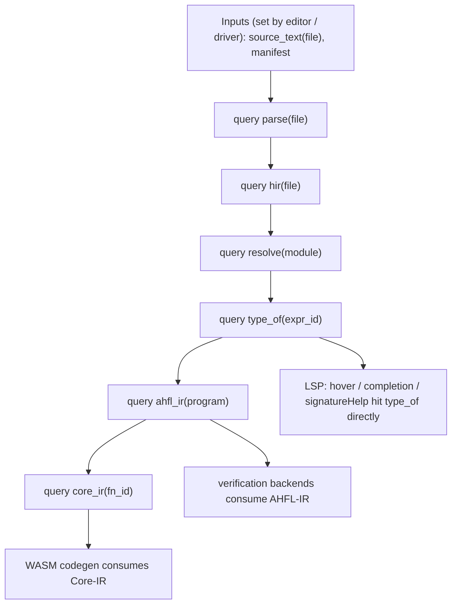
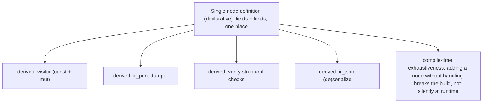

# RFC 0027: Query-Based Frontend and IR Single Source of Truth

## Summary

本 RFC 把 [RFC 0020](0020-strategic-positioning-embeddable-workflow-dsl.zh.md)
「架构北极星」的第四条（query 化前端 + IR 单一真相源）展开为可实施设计。它做两件正交但互补
的事：

1. **query 化前端**：把 AHFL 的编译前端（parse → resolve → typecheck → lower）从"从头跑到尾的
   pass 流水线"重构为**带缓存、按需求值、自动失效的 query 图**（salsa / Roslyn / rust-analyzer
   式）。目标是让 **LSP 的增量、缓存、亚秒级响应成为架构自然产物**，取代
   `src/tooling/incremental/` 在流水线外**手工模拟**依赖图与失效的现状。
2. **IR 节点单一真相源（SSOT）**：用一个声明式定义（宏 / 内建 DSL）一次定义每个 IR 节点，
   **自动派生** visitor / printer / verifier / serializer，**消灭** `include/ahfl/compiler/ir/expr.hpp:329-344`
   记录的 `8-location sweep`——每加一个 IR 节点必须手改 8 个文件、漏一处即静默 data-loss bug。

本 RFC 是**编译器架构与机制**决策；它不改语言语义,也不改 [RFC 0026](0026-ir-tower-and-execution-model.zh.md)
定义的 IR 塔**分层**,而是改这些层**如何被计算（query）与如何被定义（SSOT）**。

## Motivation

### 问题一：前端是 pass 流水线，增量靠手工模拟

当前编译是一条串行流水线（`src/tooling/cli/cli_driver.cpp`：`resolver.resolve()` →
`type_checker.check()` → `lower_program_ir()`）。IDE 的增量能力靠一个**独立子系统**
`src/tooling/incremental/`（dependency graph + IR cache + changed-compile）**在流水线之外手工
重建**"改了什么、什么要重算"。这有三个结构问题：

1. **两套真相**：流水线是一套求值顺序，incremental 子系统是另一套手工维护的依赖/失效模型。
   两者可能不一致——增量结果与全量结果 diverge 就是 latent bug。
2. **粒度粗**：手工依赖图难以做到"改一个字符只重算依赖它的 query"。顶尖 IDE（rust-analyzer /
   Roslyn）的亚秒级响应来自**细粒度、自动失效**的 query 缓存,手工模拟难以企及。
3. **hover/completion 用文本启发**：`docs/plans/issue-backlog-global-gaps.zh.md` §3.3 明确记录
   "hover/completion/signatureHelp 目前只依赖轻量文本/符号启发,而非 Typed HIR + condition
   facts"。根因是"按需拿某个位置的类型信息"在 pass 流水线里代价高（要跑整条链）,只有 query
   化（`type_of(pos)` 是一个带缓存的 query）才能廉价按需求值。

顶尖前端（rust-analyzer 基于 salsa、Roslyn 基于 red-green tree + incremental、rustc 正在
query 化）无一例外建立在 **demand-driven query 引擎**上。AHFL 现在是在用一个旁路子系统**模拟**
这件本该是架构地基的事。

### 问题二：IR 节点无单一真相源，靠 8-location sweep 手工同步

`include/ahfl/compiler/ir/expr.hpp:329-344` 有一份权威 checklist：每新增一个 `ExprNode`
alternative，必须手改 8 个文件——

```
1. src/compiler/ir/analysis.cpp        2. src/compiler/ir/ir_print.cpp
3. src/compiler/ir/verify.cpp          4. src/compiler/ir/ir_json.cpp
5. src/compiler/ir/opt/opt_lower.cpp   6. src/compiler/ir/visitor.cpp
7. src/compiler/ir/typed_hir_lower.cpp 8. src/compiler/assurance/assurance.cpp
```

注释原文："Missing any one of these produces a silent data-loss bug (default branches tend to
skip the new node)。" 这在实践中已咬人——项目记忆记录过 `substitute_type` "silently drops"
新增字段的事故。这**不是纪律问题,是缺少单一真相源的必然结果**：节点的"结构"散落在 8 处手写
的 switch/visit 里,没有一个地方是唯一定义。

顶尖编译器用**代码生成 / 派生**解决：Rust 用 `#[derive]` 宏自动派生 visitor/fold/`Debug`；
MLIR 用 TableGen 从 `.td` 生成 printer/parser/verifier；GHC 用 `deriving`。AHFL 缺这一层。

不做本决策,前端增量与 IR 维护成本随规模线性恶化,IDE 体验停在"文本启发"档,IR 每次演进都
在赌"8 处别漏"。

## Goals

1. **确立 query 引擎模型**：定义 query 的身份（索引式 key）、缓存、依赖追踪、失效
   （invalidation）与循环处理,使增量成为求值引擎的内建性质而非旁路模拟。
2. **把前端表述为 query**：`parse(file)` / `resolve(module)` / `type_of(expr)` / `hir(file)` /
   `lower(...)` 等成为带缓存的 query;LSP 请求直接命中 query,改动只失效依赖子图。
3. **统一增量与全量**：删除 `src/tooling/incremental/` 的手工依赖/失效模拟,增量 = query 引擎
   在脏输入下的自然重算;全量 = 冷缓存下的同一套求值。二者**同一真相**。
4. **确立 IR 单一真相源机制**：一个声明式节点定义,自动派生 visitor（const + mut）/ printer /
   verifier / (de)serializer,使 `expr.hpp` 的 8-location sweep checklist 变为**编译期不可能
   漏**。
5. **保持 `AGENTS.md` 原则**：query key 与节点身份索引式（非字符串）;派生代码保持
   `std::variant` + visitor 形态、flat arena、hash-consing;诊断带 `SourceRange`。
6. **与 [RFC 0026](0026-ir-tower-and-execution-model.zh.md) 协同**：query 产出 IR 塔各层;SSOT
   机制同时服务三层（Typed HIR / AHFL-IR / Core-IR）的节点定义。

## Non-Goals

1. **不改语言语义**,不改 IR 塔的**分层**（那是 RFC 0026）。本 RFC 改"如何算"与"如何定义"。
2. **不引入外部 query 框架依赖**（如把 Rust 的 salsa crate 搬进来)。AHFL 是 C++23,自研一个
   小而专的 query 引擎（见 Design）,不引重依赖——与"不引 MLIR"同一判断。
3. **不引入 procedural macro 系统**。SSOT 用 C++ 可用的机制（X-macro / `constexpr` 反射的
   受控子集 / 代码生成脚本三选一,见 Open Questions),不发明通用宏语言。
4. **不做分布式 / 持久化 query 缓存的生产化**。首版内存内 query 缓存;持久化 cache contract
   已有 [RFC 0016](0016-incremental-cache-contract.zh.md),两者衔接点在 Design 说明,但持久化
   生产化不在本 RFC。
5. **不重写验证 / 执行后端**。后端继续消费 RFC 0026 的层;本 RFC 只改这些层的**生产方式**。

## Design

### query 引擎模型



- **输入（inputs）**：编辑器/驱动设置的原子事实——`source_text(file)`、manifest、编译选项。
  改一个文件 = 重设一个 input。
- **query**：纯函数 + 缓存。`type_of(expr_id)` 只在其**依赖的输入或上游 query**变化时重算;
  否则命中缓存。依赖关系由引擎在求值时**自动记录**（谁读了谁),无需手写依赖图。
- **失效（invalidation）**：input 变化 → 引擎标记依赖它的 query 为脏 → 下次读取按需重算
  （demand-driven,不主动全算)。这正是 salsa 的 red-green 算法思路。
- **身份**：query key 是索引式（`FileId` / `ExprId` / `SymbolId` / `ModuleId`,复用现有
  `SymbolId` 等 ID 体系,`AGENTS.md` Principle 2）,非字符串。
- **循环**：编译器 query 图理论上无环（HIR 依赖 parse,不反向);潜在环（如相互递归类型的
  `type_of`)用引擎的 cycle 策略处理（fixpoint 或报诊断),与 RFC 0013 关系求解已用的
  coinductive 假设一致。

**自研而非引入 salsa**：实现一个小的 C++ query 引擎（`QueryEngine` 持有 input storage +
memo table + 依赖追踪栈 + revision 计数),query 以函数 + 缓存槽注册。对标 salsa 的核心机制
（inputs / derived queries / revision-based invalidation),但只做 AHFL 需要的子集,不引 crate。

### 前端 query 化：删除手工 incremental 子系统

当前 `src/tooling/incremental/`（dependency graph + IR cache + changed-compile + 独立
`ahfl-incremental` 入口)是在**模拟** query 引擎该做的事。query 化后：

- **全量编译** = 冷 QueryEngine 上求值 `ahfl_ir(program)` / `core_ir(...)`。
- **增量编译** = 编辑器重设若干 `source_text(file)` input,QueryEngine 自然只重算脏子图。
- `src/tooling/incremental/` 的手工依赖/失效逻辑**删除**;其对外能力（changed-compile、
  IR cache)由 QueryEngine 原生提供。[RFC 0016](0016-incremental-cache-contract.zh.md) 的
  cache contract 成为 QueryEngine **持久化层**的契约（哪些 query 结果可跨进程持久化、如何
  key、如何验真),而非一个独立子系统。

**LSP 直接受益**：`textDocument/hover` / `completion` / `signatureHelp` 从"文本/符号启发"
改为直接读 `type_of(expr_at(pos))` / `hir(file)` query——因为按需拿单点类型信息现在是廉价的
缓存命中,不再需要跑整条流水线。这关闭 backlog §3.3 的核心缺口。

### IR 单一真相源（SSOT）

目标：每个 IR 节点**只定义一次**,visitor（const + mut）/ printer / verifier /
(de)serializer **自动派生**,使 `expr.hpp:329-344` 的 8-location sweep 变为编译期不可能漏。



- **单一定义**：节点的字段、种类、子节点引用（`ExprRef` 等)在**一个声明式表**里定义。三个
  候选机制（Open Questions Q1 定选型):
  1. **X-macro**（纯 C++ 预处理器,零依赖,AHFL 已在别处用过模式):一个 `.def` 文件列节点,
     多处 `#include` 展开成 variant / visitor / printer。
  2. **代码生成脚本**（如 Python 从一个 schema 生成 `.hpp`/`.cpp`,类似 MLIR TableGen 的轻量
     版):构建期生成,可读性最好,但引入生成步骤。
  3. **`constexpr` + 受控反射习语**：用聚合体 + `std::variant` 索引在编译期驱动通用 visit,
     减少手写 switch。
- **关键性质：编译期穷尽性**。派生的 visitor 用 `std::visit` + 对 variant 全 alternative 的
  编译期穷尽检查——**加一个节点却没在单一定义里补齐,构建失败,而不是运行时静默丢数据**。
  这把"漏一处 = silent bug"变成"漏 = 编译不过"。
- **保持现有形态**：派生产物仍是 `std::variant` + visitor（Principle 4)、扁平 arena
  （Principle 3);SSOT 只是消除**手写重复**,不改存储策略,不引入继承/虚函数。
- **服务三层**：同一 SSOT 机制定义 Typed HIR / AHFL-IR / Core-IR（RFC 0026）三层的节点,
  三层各自的 print/verify/serialize 全部派生。

### 与 RFC 0026 的接缝

- RFC 0026 定义**层与降级语义**（IR 塔有哪些层、每层持有什么);本 RFC 定义**这些层如何被
  计算（query）与如何被定义（SSOT）**。
- `ahfl_ir(program)` / `core_ir(fn_id)` 是 query;它们的**节点**由 SSOT 定义。两 RFC 在
  "IR 节点集合"上交汇,但可独立评审、独立分片:RFC 0026 可先落层（用当前手写 sweep),
  本 RFC 再叠加 SSOT 派生;或反之。依赖是**软**的。

## User Impact

- **IDE 体验跃升**：hover/completion/signatureHelp 变为类型驱动（读 `type_of` query),而非
  文本启发;大文件/大项目下编辑响应从"重跑流水线"变为"亚秒级缓存命中"。对标 rust-analyzer。
- **`ahfl-incremental` 入口**：其能力并入主编译路径（QueryEngine 原生增量),独立子系统
  退役;用户看到的是"编辑器/CLI 增量更快更准",而非一个旁路工具。
- **贡献者体验**：新增 IR 节点从"改 8 个文件 + 祈祷没漏"变为"改 1 处单一定义,编译器逼你补
  齐"。这直接降低 IR 演进的事故率。
- **语言语义 / 验证 / 执行**:用户可观察的语义不变——本 RFC 改"怎么算/怎么定义",不改"算出
  什么"。

## Compatibility and Migration

**对语言语义非 breaking;对编译器内部前端架构 breaking。**

- **源码 / 语义**:非 breaking。
- **前端内部**:breaking。串行流水线驱动改为 QueryEngine 驱动;`src/tooling/incremental/`
  删除。属内部 API,项目不承诺前向兼容。
- **迁移策略**:query 化按子系统渐进——先把 parse/hir/typecheck 包成 query 而**保持** driver
  行为等价（全量结果逐位一致),再切 LSP 到 query,再删 incremental 子系统。每步用"全量 vs
  query 结果等价"回归守护,避免中间态回归。
- **SSOT 迁移**:节点逐类迁到单一定义,派生产物与手写产物做**逐字节 golden 对比**(IR dump /
  IR-JSON 不变)后再删手写 switch。sweep checklist 在全部迁完后从 `expr.hpp` 删除。
- **artifact**:IR-JSON 输出在迁移后须与迁移前逐字节一致(用 RFC 0013 KR5.9 的 round-trip
  golden 守护);持久化 query cache 遵守 [RFC 0016](0016-incremental-cache-contract.zh.md)
  的 secret-free / 确定性 / 索引式 key 契约。

## Implementation Plan

1. **P1 QueryEngine 内核**:实现 input storage + memo table + 依赖追踪 + revision-based
   失效 + cycle 策略,纯库 + 单测,先不接前端。
2. **P2 parse/hir query 化**:`parse(file)` / `hir(file)` 包成 query;driver 改为经 QueryEngine
   求值;全量结果与旧流水线逐位等价回归。
3. **P3 resolve/typecheck query 化**:`resolve(module)` / `type_of(expr)` 等;等价回归。
4. **P4 LSP 切 query**:hover/completion/signatureHelp 改读 `type_of` / `hir`;
   `src/tooling/lsp/` 相关 handler 迁移;真实编辑序列回归。
5. **P5 删除手工 incremental 子系统**:`src/tooling/incremental/` 退役,能力并入 QueryEngine;
   `BREAKING CHANGE:` 标注;[RFC 0016](0016-incremental-cache-contract.zh.md) cache contract
   重锚为 QueryEngine 持久化层。
6. **P6 SSOT 机制选型 + 试点**:按 Open Questions Q1 选定机制,先对**一个** IR 节点集合
   (如 Typed HIR 的 Expr)落 SSOT,派生 visitor/print/verify/json,与手写产物逐字节等价。
7. **P7 SSOT 铺开**:三层 IR 全部节点迁到单一定义;删除 8 处手写 sweep;从 `expr.hpp` 删除
   sweep checklist 注释。
8. **P8 编译期穷尽性门禁**:加静态断言/构建检查,确保新增节点未补齐即编译失败。

（P1–P5 query 化 与 P6–P8 SSOT 是两条可并行的子线,共享"等价回归"方法。)

## Test Plan

- **单元**:QueryEngine 的缓存命中/失效/revision/cycle 语义;SSOT 派生 visitor 的穷尽性。
- **等价回归（迁移守护）**:同一输入下 query 引擎全量结果 vs 旧流水线逐位一致;SSOT 派生
  产物 vs 手写产物逐字节一致(IR dump、IR-JSON)。
- **增量正确性**:一批编辑序列下,QueryEngine 增量结果 == 冷缓存全量结果(增量不得与全量
  diverge)——这是 query 化的核心验收性质。
- **golden(正 + 负)**:IR dump / IR-JSON golden 不变;SSOT 负例——故意加一个未处理节点,断言
  **编译失败**(编译期穷尽性)。
- **LSP 集成**:真实 open/change/save/close 编辑序列下 hover/completion 的类型驱动结果 +
  响应延迟回归(对标 backlog §3.3 的 IDE 可用性)。
- **性能 / budget**:大项目增量重算耗时 budget;query 缓存内存 budget(并入 `quality-gates`)。
- **fuzz**:随机编辑序列下"增量 == 全量"property(differential,守护失效逻辑正确)。

## Rollout and Stabilization

1. `draft → review`:清零 Open Questions(SSOT 机制选型、cycle 策略、持久化衔接、query 粒度),
   compiler + tooling owner sign-off。
2. `accepted`:query 模型 + SSOT 机制被采纳;开始 P1 / P6。
3. `implementing`:填 `tracking_issue` / `discussion`,按分片落地。
4. `implemented`:前端全 query 化、`src/tooling/incremental/` 已删、SSOT 铺开、8-location
   sweep 消除、编译期穷尽性门禁生效,全回归绿。
5. `stabilized`:query 架构在 `docs/design` 稳定表述,LSP 体验在 reference 文档更新,cache
   contract(RFC 0016)重锚完成。

## Alternatives

1. **保持 pass 流水线 + 优化手工 incremental 子系统**(现状延续)。**失败原因**:两套真相
   (流水线 + 手工依赖图)的一致性风险不消除;粒度难做细到单点类型查询;hover/completion 永远
   停在文本启发。是"给旁路模拟打补丁",非架构修复。
2. **引入外部 query 框架(把 salsa 思路作为重依赖搬入,或换语言)**。**失败原因**:salsa 是
   Rust crate,AHFL 是 C++23,无法直接用;为它换语言荒谬。自研小 query 引擎(只做 AHFL 需要的
   inputs/derived/revision 子集)零重依赖,与"不引 MLIR/LLVM"同一工程判断。
3. **SSOT 用完整 procedural macro / 通用元编程系统**。**失败原因**:发明一套通用宏语言是
   过度工程;X-macro / 轻量代码生成脚本 / 受控 constexpr 三者已足以派生 visitor/print/verify/
   json,且更易读易调。学 Rust derive 的**效果**,不搬 Rust 的**宏系统重量**。
4. **只做 SSOT,不做 query 化**(或反之)。**失败原因**:两者解决不同痛点(维护成本 vs 增量
   体验),都要;但它们**可独立分片**,故本 RFC 同时立项、分两条子线推进,而非二选一。

## Open Questions

进入 `review` 前,五个设计问题已给出**决策 + 理由**(共同哲学:零重依赖、可增量引入、
穷尽性靠编译期而非运行时)。

1. **SSOT 机制选型** → **决策:先 X-macro,按需升级到轻量代码生成脚本。** 首版用 X-macro
   (纯 C++ 预处理器、零依赖、可对单个节点集合增量引入),先在一个节点集合(Typed HIR 的
   Expr)试点(KR6.13 / RFC P6);若 X-macro 的可读性 / 表达力在铺开(P7)时不足,再升级到
   构建期代码生成脚本(从 schema 生成 `.hpp`/`.cpp`)。**理由**:与"不引 MLIR/LLVM/salsa
   crate"同一工程判断——先用最轻、零依赖的机制拿到"单一定义 + 编译期穷尽"的核心收益,把
   引入生成步骤的成本推迟到确有需要时。
2. **query 粒度** → **决策:分级粒度,对齐 rust-analyzer。** 文件级 `parse(file)`/`hir(file)`、
   符号/模块级 `resolve(module)`、表达式级 `type_of(expr_id)`。**理由**:分级在缓存开销与
   增量收益间取平衡;单点类型查询(LSP hover/completion 需要)必须做到表达式级才廉价,而
   parse 做到文件级即可,无谓细分只增开销。
3. **cycle 策略** → **决策:query 图默认无环;潜在环(相互递归类型 `type_of`)用引擎的
   fixpoint / 已访问哨兵处理,与 RFC 0013 关系求解的 coinductive 假设统一(遇到正在求值的
   同一 key 返回保守假设,收敛后定值)。** 真正的非法环报带 SourceRange 的诊断。**理由**:
   复用项目已验证的 coinductive 关系求解习语(`type_relations.cpp`),避免两套环处理语义。
4. **持久化衔接** → **决策:QueryEngine 持久化层承接 [RFC 0016](0016-incremental-cache-contract.zh.md)
   的 cache contract——只持久化确定性、可 key 化(索引式 query key + input revision 指纹)、
   secret-free 的 derived query 结果;跨进程验真靠 input 指纹比对。** 具体哪些 query 结果进
   持久化层由 KR6.12 分片按收益定,首版可只持久化 parse/hir 级。**理由**:RFC 0016 已定
   cache contract 的 secret-free / 确定性 / 索引式 key 原则,QueryEngine 持久化层是它的实现
   载体而非新契约。
5. **穷尽性门禁的实现手段** → **决策:派生代码里用 `std::visit` + variant 全 alternative 的
   编译期穷尽 + `static_assert`,漏节点即编译失败,并附可读的 `static_assert` 消息指出缺失的
   节点种类(Principle 5)。** **理由**:编译期失败 + 可读消息把"运行时静默丢数据"变成"构建期
   可操作错误",是 8-location sweep 问题的根治手段。

## Decision History

- 2026-08-28: Draft opened。承接 [RFC 0020](0020-strategic-positioning-embeddable-workflow-dsl.zh.md)
  「架构北极星」的北极星四(query 前端 + IR 单一真相源),展开为自研 QueryEngine 模型 + 前端
  query 化(并删除 `src/tooling/incremental/` 手工模拟)+ IR 节点 SSOT 派生(消灭
  `expr.hpp:329-344` 的 8-location sweep)。与 [RFC 0026](0026-ir-tower-and-execution-model.zh.md)
  的 IR 塔分层软依赖、可独立分片。
- 2026-08-28: Status draft → review(KR6.10 部分)。五个 Open Questions 全部给出决策 + 理由:
  SSOT 先 X-macro 后按需升级;query 分级粒度(文件/符号/表达式)对齐 rust-analyzer;cycle 用
  coinductive fixpoint 统一 RFC 0013 习语;持久化承接 RFC 0016 cache contract;穷尽性用
  编译期 `static_assert` + 可读消息。填 shepherd/tracking/discussion。**`review → accepted`
  待 compiler + tooling owner sign-off**——该步授权删除 `src/tooling/incremental/` 与前端
  query 化重构,须显式批准。
- 2026-08-28: Status review → accepted(KR6.10 达成)。sign-off 经项目 lead 于 Q4 路线图
  Objective 6 确认(KR6.10–6.13)。实现按 §Implementation Plan 推进;QueryEngine 内核 +
  前端 query 化(P1–P3)为等价重构(全量结果与旧流水线逐位一致守护),`src/tooling/incremental/`
  删除(P5/KR6.12)门控在 LSP 切 query + 等价回归全绿之后。与
  [RFC 0026](0026-ir-tower-and-execution-model.zh.md) 软依赖,两条子线可并行。
- 2026-09-19: **RFC 0027 P2 (KR6.11-S3) parse(file) derived query over source_text(file) + query-vs-direct equivalence guard LANDED**(`bc38793741e306b7fb26d398bda5cea1af7f54de`;compiler query + tests;无 wasm 节点变更)。把 parse 这一 frontend stage 落成 QueryEngine 图上的第一个 derived query,并用 golden corpus 上的**逐字节等价**守护钉死该迁移方法学(后续 resolve/typecheck P3 复用同一守护)。新增 `include/ahfl/compiler/query/frontend_queries.hpp` + `src/compiler/query/frontend_queries.cpp`(+ `src/compiler/query/CMakeLists.txt`,`ahfl_compiler_query` PUBLIC `ahfl_base_query` `ahfl_compiler_syntax`,已登记进 `AhflInstall.cmake` 的 internal target 列表)。(1) **两个 family,身份索引式**(CLAUDE.md Principle 2):`source_text(FileId)` 是 input(原子编辑事实 = display_name + text,含 `operator==`,故等文本写入是 no-op),`parse(FileId)` 是 derived;`FileId = QueryKey<FileTag>` 是强类型槽索引,**绝不**用路径字符串做身份。`set_source_text` 按 slot 索引写入;`parse` 返回 `std::expected<ParseSnapshot, CycleError>`。(2) **结果身份唯一 SSOT**:`ParseSnapshot` 是 `ParseResult` 的两个可逐字节比较投影(canonical AST outline via `dump_program_outline` + canonical diagnostic report JSON via `serialize_diagnostic_report_json(DiagnosticReport::from_bag(...))`)加 `has_errors`;`snapshot_parse_result` 是**生产侧唯一定义**(query body 只经它);等价守护 `direct_snapshot` **刻意独立重推**同一对投影而不调用它,故定义内部回归会被**抓住**而非被复现 —— 两份实现必须保持独立,不得「去重」。owns 的 AST(`Owned<ast::Program>`)不可拷贝/不可比较,故不进引擎的类型擦除 memo,而存于 `FrontendQueries` 自己的 `std::deque<ParseResult>`(按 FileId 索引,deque 使新增文件**从不**移动既有 `ParseResult`、因而不失效已借出的 `ast::Program`),`program(FileId)` 在对象存活期内借出,但**每次调用都做 revision 校验**(经 `QueryEngine::inspect_slot` 只借出当前 revision 下 Clean/Verified 的槽;文本一改槽即 Dirty,返回 nullptr,绝不交出上一版文本的 AST)—— 这正是 Slice 4 的 resolve/typecheck query body 要复用的存储-生命周期模式。每槽状态亦收敛为**单一** `SlotRecord{ParseResult result; std::size_t computes;}`,`std::deque<SlotRecord>` 按 FileId 索引,取代此前两个手工同步的平行 deque。(3) **证据**:新增 doctest `ahfl_compiler_query_tests` + ctest `ahfl.query.parse_equiv_all`(6 cases / 645 assertions 全绿),含 (a) 手写源 query==direct(outline / diagnostics JSON / has_errors 且借出的 AST 与 direct outline 一致)、(b) **malformed 源** query==direct(harness 侧显式失败投影:两者 has_errors 一致、diagnostic JSON 逐字节一致、outline 均为空、`program()==nullptr`)、(c) 重复 eval = memo hit(compute 计数恒 1,`stats().memo_hits==2`)、(d) 等文本写入不重算 / 改文本恰一次重算且新 outline 与 direct 一致、(e) 改 A 文件不影响 B 文件的 parse memo、(f) **corpus 等价回环**:`tests/golden/**/*.ahfl` + `examples/**/*.ahfl` 共 **120 文件**(1 个含 diagnostics)每个均 direct vs query 逐字节等价(断言非空 + 每个期望根目录在盘上均有文件,避免空 walk 假绿;**不**硬编码数量阈值,以免无关的 golden 清理触发假红)。whole-fleet 守护 `ctest -R ahflc.dump_ast` 保持绿。(4) **顺带消除重复 SSOT**:`SourceId`(struct,非 enum)的 hasher 此前在 `analysis_service.cpp` 与 `import_graph_discovery.cpp` 各有一份逐字节相同的匿名副本;按 CLAUDE.md「不得有并行 SSOT 副本」提升为 `ahfl/base/support/source.hpp` 中的唯一 `SourceIdHash`,两处本地拷贝删除(行为等价,已跑 lsp / incremental 全套件)。
- 2026-09-19: **RFC 0027 P2 (KR6.11-S5) differential property guard: random edit sequences must leave the incremental engine == cold-cache recomputation LANDED**(`66d0ae2fddc04937cd9e7789f0b81b19c64aeaff`;tests only,micro生产代码零变更)。RFC 0027 Test Plan 把这条点名为 query 化的**核心验收性质**(「一批编辑序列下,QueryEngine 增量结果 == 冷缓存全量结果」);S3 的守护只在**单个静态**比较上钉死了方法学(query == direct over corpus),本分片补上**动态**那一半 —— 失效机制在任意编辑序列之后仍保持该等式,这正是 KR6.12 开始删除手工 incremental 子系统时所依赖的不变量。新增 `tests/common/query_edit_property.hpp` 作为该 property 的**唯一定义**(CLAUDE.md「不得有并行 SSOT 副本」):编辑算子、可观测投影、「增量 == 冷」的判据都只此一份,两个 driver 只在「谁给编辑脚本 / 如何报告违规」上不同。(1) **编辑算子与确定性 RNG**:`EditKind = {Insert, Delete, Replace, ResetEqual}` 四算子,`Edit` 的身份是 (kind 标签 + 数值参数) 的**索引式**身份,**绝不**是文本描述;`offset`/`length` 在 apply 时对当前文本长度取模,故一个编辑脚本在文本长度变化后仍逐字可复现。RNG 是自带的 splitmix64(不依赖 `std::mt19937` 的引擎↔libstdc++ 映射),失败可从打印的 seed 复现;`ResetEqual` 是**特意**的 identity 算子,专门打等值写入的 no-op 路径。(2) **每步的完整 property**:(a) 长寿命引擎的 `parse(file)` == 全新冷缓存 `FrontendQueries`(只见过本步最终文本)—— 这就是字面上的「增量 == 冷缓存全量」;(b) 同一快照 == **独立重推**的直接前端投影(`dump_program_outline` + `serialize_diagnostic_report_json`),故 `snapshot_parse_result` 内部回归会被**抓住**而非复现(S3 纪律,不得改道经它);(c) 引擎**持有的那份 AST** 驱动 resolve→typecheck→lower 得到的 diagnostic JSON 与 IR JSON,与「同一文本重新 parse 出的 AST」**逐字节**一致 —— resolve/typecheck 目前仍是直接流水线阶段(P3/KR6.11-S4 未落),因其 diagnostic JSON 已纳入投影,该守护在它们上图后**无需改动**即自动获得新的一侧;(d) 重算计数器**当且仅当**文本真的变了才 +1(所谓「invalidation precision」:多算一次与少算一次都是失败);(e) **脏窗口**:改文本后、重新求值前,`program(file)` 必须 fail-closed 返回 null,绝不交出上一版文本的 AST —— 即 S3 修掉的那类 stale borrow,此处是在 500 条随机历史下断言,而单条手写编辑**碰不到**这个窗口。(3) **证据**:新增 doctest `ahfl_compiler_query_edit_property_tests` + ctest `ahfl.query.incremental_equiv_all`,3 cases / 2774 assertions 全绿(dev 约 39s;asan 约 169s 亦全绿、无 sanitizer 报告)。Case 1 跑 **500 条确定性编辑序列**(RFC 的「random edit sequences」)/ **3095 步**,覆盖 14 个种子文件(2 个合成:一 clean 一 malformed,后者保证**从第 0 步**就覆盖 erroring 投影;12 个取自已排序的 `tests/golden/**` + `examples/**` 小文件子集,门槛是**选择**不变量而非语料规模阈值,免无关 golden 清理触发假红);3095 步中 2711 步真实改了文本,故非空转:346 次 clean parse / 2749 次 erroring parse / 144 次产出**非空 IR**(下游那一侧非空转)。Case 2 单独钉等值编辑:32 次等值写入必须 0 重算、revision 时钟不动、`input_update_noops >= 32`。Case 3 钉**跨文件**精度:24×5 次编辑打文件 A,文件 B 的 compute 计数恒 1 且投影与首次求值**逐字节相同**(「invalidates too much」作为精确计数器断言,而非计时)。(4) **负向验证(本守护确实会咬)**:手工注入两类回归并确认被捕获后回滚 —— (i) 去掉 `program(FileId)` 的 revision 校验(S3 那个 P1 修复)S3 旧守护**测不出**(其 driver 总是先求值再借用),本守护在 fuzz 与 doctest 两侧均**立刻**报「stale AST borrow / borrowed outline != direct outline」;(ii) 让引擎的等值写入不再 no-op,则 Case 2/3 的计数器与 revision 断言全红。(5) **fuzz driver**:新增 `tests/fuzz/fuzz_query_edits.cpp` + `tests/fuzz/CMakeLists.txt` 条目,沿用仓库既有 `AHFL_FUZZ_STANDALONE` 双模式(fuzz_parser.cpp 先例):默认编成 `fuzz_query_edits_check` 并注册 ctest `ahfl.fuzz.query_edits_check`(固定 4 类脚本:identity / empty / mutating / oversized);`AHFL_ENABLE_FUZZING=ON` 时编成 libFuzzer 入口并把 `tests/fuzz/crashes/fuzz_query_edits/` 接入 `crash_replay.sh`(README + .gitkeep 已放,目录初始为空)。字节脚本按 5 字节/编辑解码(kind, 16-bit offset, length, token index),上限 12 步以免单次迭代拖垮搜索循环;违规即 `std::abort()` 并打印首个不匹配的步号与两侧投影,故输入会被 libFuzzer 存为 crash artifact、再由 crash_replay 变成永久回归守护。`tests/fuzz/README.md` 同步登记新 target(目录树 / 构建模式表 / crashes 目录)。(6) **边界诚实**:本分片**零生产代码改动**(仅测试与构建注册;`src/` 无 diff),观测到的最新只到 `parse(FileId)`;resolve/typecheck 上图(P3/KR6.11-S4)与 driver 切换、`src/tooling/incremental/` 删除(P5/KR6.12)未动。whole-fleet `ctest -R ahfl.query|ahfl.fuzz` 全绿,`scripts/check-architecture.py` 绿。
- 2026-09-19: **RFC 0027 P6/P7 (KR6.13-E) ExprNode X-list: generated variant + single wire-name table shared by JSON writer and reader LANDED**(`8bd5002858bf36d121eac4e5142fd79ad900e896`;IR 前端 + tests;无 wasm 节点变更)。把 20 个 ExprNode 备选及其 JSON `"kind"` wire 拼写收敛为**单一 X-macro 节点表** `include/ahfl/compiler/ir/expr_nodes.def`(严格照搬 `core_value_types.def` 先例):每行 `HANDLE_EXPR_NODE(Name, Wire)`,声明顺序同时是 variant 备选顺序、`ExprNodeIndex` 强类型枚举顺序、`kExprNodeWireNames` 表顺序 —— 改节点只改这一处。(1) **variant 自动派生**:`expr.hpp` 经 tuple-tag 间接(模板实参列表不容尾随逗号,故宏发 tag 类型再由 `variant_from_tags` 重建 `std::variant<...>`)从 .def 生成 `ExprNode`;备选顺序**逐字节不变**,所有 `std::variant::index()` 保持不变,`static_assert(variant_size==20)` 卡口保留。(2) **wire 名唯一表**:同一 .def 再派生出 `ExprNodeIndex` 枚举 + `kExprNodeWireNames`,经 `expr_node_wire_name()` 暴露。`ir_json.cpp` 写侧 20 处 `write_string("<wire>")` 字面量全部改为 `write_string(expr_node_wire_name(expr.node))`;读侧 20 分支 `if (kind == "<wire>")` 链改为 `resolve_expr_node_identity(kind)` 查出共享身份枚举后 `switch`(`-Wswitch` 穷尽,新节点漏 case 即编译失败),每节点的字段级 parse/emit 体**原样保留**。消灭了第三份、也是最危险的副本:此前写侧字面量与读侧字符串链各自手工维护,一个拼写笔误会把未知 kind 静默降级为 nullopt;现在两侧同源,读侧对未知 kind **fail-closed**。**JSON wire 格式无变化**(golden 逐字节一致)。(3) **删除并行 SSOT 副本**:删掉 `tests/fixtures/ir/ssot/expr_nodes.def`(类型列表的第二份拷贝),负例编译测试 fixture 与覆盖单测改为直接消费**生产** .def(Core fixture 早已如此),故生产表加节点而漏 visitor 处理器无需维护第二份列表即被捕获。(4) **替换 SWEEP CHECKLIST**:`expr.hpp` 里 ExprNode 的 8-location 手工清单替换为指向 .def 的说明;其余 IR family(Statement / TemporalExpr / MatchPattern / Decl 等)在后续 KR6.13 分片迁移前保留各自清单。(5) **证据**:`ahfl_compiler_ir_tests` 新增断言把 wire 名表 + `ExprNodeIndex` 顺序对 .def 再展开做钉死(377 cases / 3109 assertions 全绿);`ahfl_compiler_ir_json_round_trip_tests` 新增「未知 expr kind fail-closed」用例(13 cases / 105 assertions)。逐字节 IR 文本 + JSON golden 全绿(`ahfl.ir.json_round_trip`、`ahflc.emit_ir.*`、`ahflc.emit_ir_json.*`),穷尽性门禁 `ahfl.ir.ssot_compile_fail` 绿,全量 dev ctest 仅剩既有 env-gate 失败(beta-evidence / LLM-provider smoke,与本改动无关)。
- 2026-09-20: **RFC 0027 P6/P7 (KR6.13-T) ExprNode child-traversal edges DERIVED from expr_nodes.def field metadata; the two hand-written 20-case walks deleted LANDED**(`dc662cb6817c4a0117a88c6c610a40a60037b374`;IR 前端 + tests;无 wasm 节点变更)。KR6.13-E 把 20 个 ExprNode 备选、wire 名收敛成单一 X-macro 表,但那只是**名字**的派生;本分片是**首个行为派生**(behavior derivation),证明字段元数据足以表达遍历语义,并消灭 RFC 引用的那类「新节点被静默跳过」的数据丢失。`ProgramVisitor::visit_expr` 与 `ProgramRewriter::rewrite_expr`(`src/compiler/ir/visitor.cpp`)此前各自手写一份 20 个 lambda 的子边枚举(两份需同形维护,漏一处该 walk 就**静默**跳过该节点的子节点);两份枚举**整体删除**(visitor.cpp 23 增 / 233 删,净 −210 行;946 → 736 行),改为在 `expr_nodes.def` 的每行增加第三个参数 —— 有序**子边列表** —— 并由新增的 `include/ahfl/compiler/ir/expr_child_edges.hpp` 派生 const 与 mut 两条 walk。pre/post/Skip/Abort 协议(`visitor.hpp`)**原样不变**,只有「哪些字段是子节点、按什么顺序」被派生;两条 walk 现在是**同一份**推导,再也不会漂移。(1) **边语法**(顺序即访问顺序,是契约的一部分):`()` = 叶子无子节点;`AHFL_EXPR_BRANCH(&N::m)` = `m` 是 `ExprRef` 成员(一个子节点);`AHFL_EXPR_FANOUT(&N::m)` = `m` 是 `std::vector<ExprRef>` 成员(每元素一个子节点);`AHFL_EXPR_PER(&N::m, AHFL_EXPR_ELEM(&E::f), ...)` = `m` 是 `std::vector<E>` 成员,**逐元素**按序取每个列出的 `E::f`。分组式 PER 形式专门保住 `MatchExpr` 的「逐 arm 先 guard 后 body」交错顺序 —— 扁平的「逐成员扇出」(先所有 guard 再所有 body)会**静默重排**遍历,故 PER 不是可选糖而是语义必需(本分片在实现中确实先写错过这一版,靠测试的两-guard arm 修正)。(2) **编译期穷尽性**(不是约定):`ChildEdges<Node>` 主模板带 `always_false<Node>` static_assert,每节点由 .def 展开特化一次;`.def` 加了一个带子节点却漏写边列表的节点,则 `visitor.cpp` 中派生 `std::visit`(覆盖全部 20 备选)对该类型**编译失败并点名类型**;某条边指向非子节点字段则该行自身的 `static_assert(EdgeList::valid())` 失败。两条性质由新增负例编译 fixture `tests/fixtures/ir/ssot/expr_child_edges_negative.cpp`(接入 `tests/scripts/ir_ssot_compile_fail.py`,ctest `ahfl.ir.ssot_compile_fail`)双向钉死:注入哨兵节点 `SsotUnhandledChildExpr` 后**必须**失败且诊断含该名,不注入**必须**编译通过。(3) **接口忽略第三列**:`expr.hpp` 的 variant 派生 / `ExprNodeIndex` 枚举 / `kExprNodeWireNames` 表三种消费方(以及 `node_variant_coverage.cpp`、`expr_exhaustiveness_negative.cpp`)把宏签名改成三参并忽略第三列,**备选顺序与 wire 名逐字节不变**(golden 全绿)。(4) **证据**:`identity_visitor.cpp` 新增 4 个 doctest 用例 —— 构造全部 **20 种节点各一**,断言 (a) const walk 的子节点集合与顺序(叶子为空;`method_call` = receiver+args;`match` = scrutinee + **逐 arm** guard/body;`struct_literal` 逐字段;`quantifier`/`unwrap`/`binary`/`index` 双向),(b) mut walk 到达**完全相同**的子集(两条曾经可漂移的枚举现为一条),(c) sink 返回 false 时**短路**(`Abort` 依赖此性质),(d) 生产 `ProgramVisitor`/`ProgramRewriter` 经公开协议到达同一批节点且能改到每个。`ahfl_compiler_ir_tests` 385 cases / 3180 assertions 全绿(含新 4 例)。(5) **差分验证(本重构确实等价)**:一次性 oracle 把派生 preorder 与**逐字转录自被删代码**的旧手写顺序在 `tests/golden/**` + `examples/**` 共 **124 文件**(86 个成功 lower,927 次根 preorder,语料覆盖 10/20 节点种类;其余 10 种由上述手写用例覆盖)上比较 —— **0 mismatch**。(6) **回归面**:`ctest -R 'ahfl\.ir\.|ahflc\.emit_ir|ahfl\.handoff'`(32)、`-R 'ahfl\.wasm|ahfl\.core_wasm|ahfl\.assurance|ahfl\.semantics|ahfl\.opt|ahfl\.passes'`(49)全绿;P6 字节冻结探针 `ahfl.wasm.p6_*` 全绿;`scripts/check-architecture.py` 绿;ASan 版 `ahfl_compiler_ir_tests` 全绿无 sanitizer 报告。同一技法(声明式字段元数据派生遍历)后续可平移到 temporal/stmt/pattern 三族。
- 2026-09-20: **RFC 0027 P6/P7/P8 (KR6.13-F) every genuinely-silent generic fallback over the AHFL-IR node families closed with X-list-forced explicit no-op allowlists LANDED**(`3a4ce7cc4249c9bbf9add34f719f876fb16505a6`;IR 前端 + backends + runtime + tests;无 wasm 节点变更)。KR6.13-E 派生了 ExprNode 的**名字**,KR6.13-T 派生了它的**子边遍历**;本分片补上 RFC 引用的那类数据丢失的另外一半 —— 手写的 `[](const auto&){}` 兜底:它让新加的 IR 节点变成**静默**不校验 / 不渲染 / 不执行的分支,而不是构建期可操作的错误。(1) **SSOT 节点表**:新增四个 X-macro 片段作为其余 AHFL-IR 族的唯一真相源(与 `expr_nodes.def` 并列)—— `stmt_nodes.def`(11)、`temporal_nodes.def`(7)、`pattern_nodes.def`(7)、`decl_nodes.def`(16)。每个消费方必须先定义「每节点一个处理器」的驱动宏,故 .def 加节点而漏任何一处 per-node 处理器即**编译失败并点名类型**(Principle 5)。此前在 `expr.hpp` 与 `core_ir.hpp` 各有一份的 tag-tuple → variant 重建机制上提到新头 `include/ahfl/compiler/ir/node_tags.hpp`(`node_detail::variant_from_tags_t`);`StatementNode` / `TemporalExprNode` / `MatchPatternNode` / `Decl` 四个 variant 现由各自 .def 生成,故 .def 的声明顺序**就是**备选顺序。(2) **每个真正静默的兜底被关闭**,每个都用**一个显式命名**的 no-op 宏绑定到语义确实为空的节点(校验器叶子、仅索引的声明、非嵌套 temporal 原子、非 bounded 表达式形状),取代无名 catch-all:`verify.cpp` 的 `verify_expr_children` / `verify_statement` / temporal walk / `verify_match_pattern_node` / `collect_decl_symbol_identities`;`core_verify.cpp` 的三处 `[](const auto&){}`(expr / pattern 无环 walk、`visit_expr_paths`),并加编译期基数 static_assert 把已处理集钉到 variant;`assurance.cpp` 的 `render_decreases_subject` `"<expr>"` 兜底(拆成具名 per-node renderer + `RENDER_UNSUPPORTED` 叶子);`smv_helpers.hpp` / `smv_formula.cpp` / `smv_indexing.cpp` 的 bounded 表达式渲染、两条 temporal 公式渲染、decreases bounded-rank 匹配、声明与 embedded-atom 索引;`ir_lower.cpp` 的 formal-observation 声明与 temporal walk;`executor.cpp` / `evaluator.cpp` 两条 if-constexpr 分派链改为 .def 驱动的具名 per-node exec/eval 函数。(3) **顺带修好一处真实静默缺口**:trait 声明自身的 `symbol_ref` 此前被旧的 `collect_decl_symbol_identity` catch-all 跳过,从未参与跨声明符号身份一致性检查;`TraitDecl` 现路由到 per-node 收集器。(4) **负例编译测试**:新增四个 fixture(`tests/fixtures/ir/ssot/{stmt,temporal,pattern,decl}_nodes_negative.cpp`)接入 `ir_ssot_compile_fail.py`;每个直接消费**生产** .def,故注入哨兵必须失败且诊断含其名、干净构建必须通过(本地验证 8 项全绿)。`node_variant_coverage.cpp` 另加 static_assert 把每份生产 .def 钉为对应 variant 的精确**保序**镜像。(5) **等价性 / 回归面**:IR 文本 / JSON / SMV golden 无变化,P6 字节冻结探针全绿;全量 dev ctest(521 tests)仅剩既有 beta-evidence env 门(缺 `build/release-evidence`,与本改动无关)失败;`scripts/check-architecture.py` 与 `scripts/check-rfc.py` 绿。同一技法(声明式 X-list + 编译期穷尽)后续可继续平移到 Core 的其余族。
- 2026-09-21: **RFC 0027 P7 SSOT 铺开收口 (KR6.13-P7):Core-IR 三族迁到 X-list;AHFL-IR Pattern/Temporal/Stmt/Decl 四族的 JSON wire 表收敛为单一派生表;移除最后的 SWEEP CHECKLIST 文本;新增 IR SSOT 结构门禁 LANDED**(三提交:`bff3ee3ee7cc14858c4095eb15f34e7fa84c0819` / `83b5dd1b76e147da3578b1e6032758f53d6afb7d` / `f87a2fdd711f0e27dce2bbe5d755df4a612e3ecb`;IR 前端 + backends + runtime + tests + scripts;无 wasm 节点变更)。P6/E/T/F 已派生了 ExprNode 的名字、子边遍历,以及其余 AHFL-IR 族的 variant 与「静默兜底」清单;本分片补上 P7 真正剩余的**铺开**面:(1) **Core-IR 三族入表**(`core_expr_nodes.def` 10 / `core_pattern_nodes.def` 7 / `core_stmt_nodes.def` 9,与 `core_value_types.def` 并列):`core_ir.hpp` 经共享 `node_detail::variant_from_tags_t` 从三张表生成 `CoreExprNode` / `CorePatternNode` / `CoreStmtNode`,`.def` 声明顺序**就是**备选顺序,P8 基数 static_assert 保留(数字改由表派生)。每个手写 Core 消费者改为对生产 .def 逐节点展开:region-exit 链(`core_ir.hpp`)、`core_verify.cpp` 五处(expr 无环 / pattern shape / pattern 无环 / expr path walk / statement walk / region path walk)、`core_lower.cpp` 四处(`collect_arm_bindings` / statement lowering / `expr_kind_name` / `expr_has_capability_call`)、`core_wasm_codegen.cpp` 的 `p6_region_always_diverges`。两处**真正静默**的兜底被关闭:`expr_kind_name` 的 `"Expr"` 默认与 `expr_has_capability_call` 的 `[](const auto&){ return false; }` —— 后者此前可能**隐藏**新节点里的 capability call。新增三个负例 `core_{expr,pattern,stmt}_nodes_negative.cpp` 接入 `ir_ssot_compile_fail.py`(13/13 绿),`node_variant_coverage.cpp` 把每张生产表钉为其生成的 variant 的精确保序镜像。(2) **JSON wire 表单一化**:`pattern_nodes.def` / `temporal_nodes.def` / `stmt_nodes.def` / `decl_nodes.def` 各增第二个宏参数 `Wire`,与 ExprNode(KR6.13-E)完全同构;`expr.hpp` 暴露 `match_pattern_node_wire_name` / `temporal_node_wire_name` / `stmt_node_wire_name`(及各自 index 枚举),`program.hpp` 暴露 `decl_node_wire_name` + `DeclNodeIndex`。`ir_json.cpp` 的写侧所有 `"kind"` 字面量改由共享表发射,读侧 4 条 `if (kind == ...)` 链改为经共享表解析身份后 `switch`(`-Wswitch` 穷尽),故未知/错拼 wire **fail-closed**,不再静默降级。**JSON wire 字节无变化**(全 corpus golden 逐字节一致)。一处附带修复:`print_decl` 的 `InstanceDecl` 内层 `instance_kind` 判别器(复用同名拼写但语义不同)在本提交内复原。`node_variant_coverage.cpp` 另把 pattern 的 wire 列对派生表钉死。(3) **移除 SWEEP CHECKLIST 文本**:`expr.hpp` 里 KR6.13-E 留下的「其余族仍保留各自清单」注释改写为 P7 收口事实 —— 每个 AHFL-IR 与 Core-IR 族现均由自己的 .def 派生,清单概念消失。(4) **结构门禁**:`scripts/check-architecture.py` 新增 `check_ir_node_ssot_shape`,对 8 个 (header, alias, .def, macro) 元组断言每个 IR variant 别名经 `variant_from_tags_t` 从 `.def` 派生(手写 `using X = std::variant<...>` 块即失败)且 header 确 include 该 `.def`,故「迁回手写 variant」是 CI 可操作的错误而非约定。(5) **证据**:全量 dev build 在 `-Wall -Wextra -Werror` 下干净;目标 ctest 82 项全绿(`ahfl.ir.*` / `ahflc.emit_ir*` / `ahfl.core*` / `ahfl.wasm.*` / `ahfl.handoff` / `ahfl.semantics` / `ahfl.assurance` / `ahfl.passes` / `ahfl.opt`);`ahfl.architecture.boundaries` 绿;`ir_ssot_compile_fail` 13/13 绿。**边界诚实**:Core-IR 仍无 JSON 序列化(`kCoreFormatVersion` 无 writer/reader/CLI 消费者,P9/KR6.9 B1–B4 未落);前端 query 化(KR6.11-S4 driver 切换)未动;evaluator 未退役。
- 2026-09-21: **RFC 0027 P3 (KR6.11-S4B) `parse_project` query 化:package/workspace 路径也进 query 图,CLI 两个 `run_analysis` 实例在同一开关下均经引擎求值 LANDED**(compiler syntax + compiler query + tooling cli + tests;无 wasm 节点变更)。S4 把语义级 stage(resolve/typecheck/type_of)搬上图并让 CLI 经 QueryEngine 求值,但留下了结构性切分边界:**只**切 `run_analysis<ast::Program>`,package/workspace(`SourceGraph`)保留直接流水线 —— 因为 (a) `SourceGraph` 不可 `equality_comparable`(`SourceUnit` 持 `Owned<ast::Program>`),(b) 一个 SourceUnit 的 AST 不是其文本的函数(`parse_project` 在 parse **之后**注入 prelude、发现 module root、解析文件系统 import 边),故它无法作引擎 input。只切一个实例会让同一条命令随到达路径行为不同(半切分),所以当时选择"opt-in 且单文件"。S4B 清除该障碍,**不翻转默认**,从而让两个实例都可在同一开关下经引擎求值。(1) **`ProjectInputModel`:把 package 输入提成值**(`src/compiler/syntax/frontend/project.hpp`):`ProjectSource{path, optional<string> text, bool exists_on_disk}` + `ProjectInputModel{entry_files, search_roots, 已 effective 的 module_roots, inject_prelude, enforce_package_dependencies, 按路径排序去重的 sources}`,全部 `operator==` defaulted。`resolve_project_input(const ProjectInput&) -> ProjectInputModel` 是**唯一**不纯边界:读盘,把**可达的每个源**(entry + search/module root 下所有 `.ahfl` + overlay/cache 文本)冻结进快照。`exists_on_disk` 保留直接流水线语义:直接路径只在 `std::filesystem::exists` 判定候选**之后**才用 overlay 替换文本,故一个不在盘上的 overlay 路径**不能**仅凭自己被 import 解析选中 —— 该细节由 `resolve_import_path` 改读快照复现(以前它直接探盘)。(2) **`parse_project` 变成纯函数**:`parse_project(frontend, const ProjectInputModel&)` 在该 model 上完成 prelude 注入 / module root 选择 / import 边解析,**不再探盘**;原 `parse_project(frontend, const ProjectInput&)` 保留并**委托**为 `parse_project(frontend, resolve_project_input(input))`,故直接路径与查询路径是**同一份函数体**(不可能漂移)。这同时解决 (b):把 prelude 等依赖的**其他文件也纳入快照**后,"单元的 AST 是其文本的函数"成立。(3) **项目 stage 入图**(`include/ahfl/compiler/query/frontend_queries.hpp` + `.cpp`):新增 `ProjectId = QueryKey<ProjectTag>`(与 FileId/ModuleId 同为 phantom tag 索引 key),三族 `parse_project(ProjectId)` / `project_resolve(ProjectId)` / `project_typecheck(ProjectId)`。值身份 `ProjectParseSnapshot{graph_outline, diagnostics_json, has_errors}`,`graph_outline` 由新 `dump_project_graph_outline` 生成:entry_sources、每个 SourceUnit 的 id/module_name/package_prefix/exported+artifact+dependency/intrinsics allow/module_range/imports、其 AST(经 `dump_program_outline`,**span- 与内容敏感**)、排序后的 module_to_source、全部 import 边 —— 刻意**不含** `path`(显示产物;同一逻辑项目拷到临时目录应相等),**含** `id`(图内所有引用的索引身份)。`SourceGraph`(持 Owned AST)仍存于 deque 存储,由 `project_graph(ProjectId)` 在 revision 校验后借出(契约同 `program(FileId)`);resolve/typecheck 借用它,投影复用既有 `ResolveSnapshot`/`TypecheckSnapshot`(**单一 SSOT**,无第二套定义)。短路语义与文件级一致(parse 错→resolve 不跑,resolve 错→typecheck 不跑,由 `ran` 位记录)。公共头只用**前置声明**引用 model/result(它们属 `src/` 内部),不在 `include/` 引入 src-relative include。(4) **driver 切换**(`src/tooling/cli/cli_driver.cpp`):`run_analysis<InputT>` 加一个可选 `const ProjectInputModel*` 参数,**两个**实例在 `AHFL_QUERY_ENGINE` 下都尝试引擎路径;新增 `run_project_analysis(ahfl::ProjectInput)` 作为 package 路径的**单一**分析入口(冻结 → 直接 parse 渲染项目级 parse 诊断 → 把 model 一并交给 `run_analysis`),取代三处逐字节相同的拷贝。关键是**分析输入本身也随路由重绑**(`analysis_input` 指针):引擎路径下 tail 消费的是引擎持有的 AST / SourceGraph,而非直接流水线的产物 —— 否则借用到的 stage 结果与 IR lowering 指向两份不同 AST,即"表层切换、底下半切换"。route 迹现对**两个**实例都打。(5) **证据**:(a) `tests/unit/compiler/query/frontend_queries_equiv.cpp` 扩两个项目用例:`parse_project`/`project_resolve`/`project_typecheck` 对 `tests/integration/check_ok` 的 workspace→package-graph→ProjectInput 路径与直接流水线逐字节等价(含引擎持有 graph + 借用 stage 结果驱动的 IR JSON、断言多单元形态);以及"改**非 entry** 模块文本 → 整链重算一次"(parse compute 1→2、typecheck 1→2)—— 这是内容盲 input model 会藏住的失败模式,且等 model 重设必须 0 重算。(b) `tests/scripts/query_engine_cli_equiv.py` 扩为**双 corpus**:裸文件(`tests/golden`+`examples` 无 package 祖先,`check`)**加**项目(`tests/integration/package_golden/**` 声明 workflow target 的 fixture,`check` **与** `emit ir-json`,`emit` 把分析输入一路驱动到 IR lowering+printing)。实测 **129 runs(117 file + 12 project),128 经引擎路由**全绿。(c) **全舰队核验**:`AHFL_QUERY_ENGINE=1 ctest -R 'ahflc\.'` 的 **261 项全绿** —— 不改默认路径的前提下,整支 CLI golden 舰队在引擎路由下也逐位通过。(d) **负向验证(门禁确实会咬)**:令 `query_engine_route_requested` 恒假、重建 `ahflc`、跑门禁 → **file 与 project 两侧都**报 "fell back to the direct route" 并最终报 "vacuous gate";还原 → 通过。(6) **边界诚实**:默认路径**未翻转**(仍直接流水线,故 `tests/golden/ir` 与 `ahflc.*` 按构造不变);翻转默认(令引擎恒为默认)是独立可后置的一步,已记录在设计文档。语言语义、IR 塔、LSP、`src/tooling/incremental/` 均未动(`docs/design/query-frontend-p3-migration.zh.md` §3 已改为记录撤销)。
