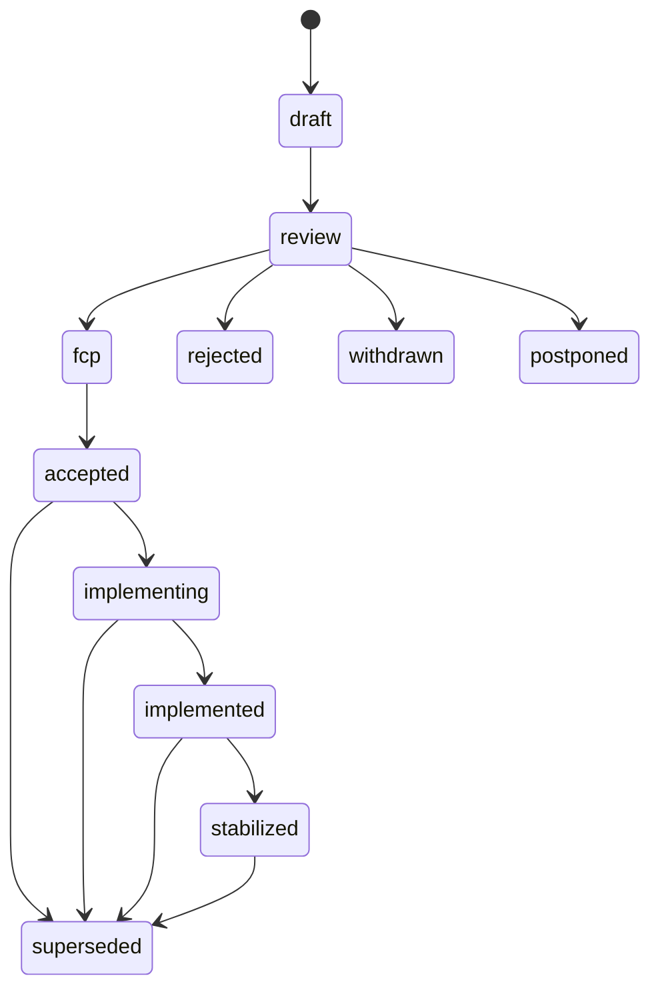

# AHFL RFC Registry

`docs/rfcs/` records design decisions that are too large or too durable for a single PR description. It is a deliberate exception to the typed `docs/` directory taxonomy and is guarded by `scripts/check-rfc.py`.

The final language contract still lives in `docs/spec/`. An accepted RFC explains why a decision was made; it does not replace the spec, design, reference, tests, or release notes that make the decision operational.

## Required Files

- `README.md`: this registry guide.
- `index.yml`: machine-readable list of canonical RFC files.
- `0000-template.zh.md`: template for new RFCs.
- `NNNN-kebab-slug.zh.md`: canonical RFC records.

## Status Model



Allowed status values are lowercase:

| Status | Meaning |
| --- | --- |
| `draft` | The author is still shaping the design. `TBD` is allowed. |
| `review` | The RFC is complete enough for owner review. Critical fields must not be `TBD`. |
| `fcp` | Final comment period. Only blocking concerns should change the design. |
| `accepted` | The design decision is approved but not necessarily implemented. |
| `implementing` | Implementation is in progress and must have tracking links. |
| `implemented` | Code, tests, and docs have landed, but the feature is not necessarily stable. |
| `stabilized` | The decision is reflected in spec/reference/release evidence. |
| `rejected` | The proposal was rejected and remains archived. |
| `withdrawn` | The author withdrew the proposal. |
| `postponed` | The direction may be valid later, but it is not active now. |
| `superseded` | A later RFC replaced this decision. |

## Required Sections

Canonical RFC files must contain these sections in this order:

1. `Summary`
2. `Motivation`
3. `Goals`
4. `Non-Goals`
5. `Design`
6. `User Impact`
7. `Compatibility and Migration`
8. `Implementation Plan`
9. `Test Plan`
10. `Rollout and Stabilization`
11. `Alternatives`
12. `Open Questions`
13. `Decision History`

## Areas And Owners

Every RFC lists one or more areas in frontmatter. Each area must have an entry in `owners`.

| Area | Scope |
| --- | --- |
| `language` | Grammar, type system, static semantics, verification subset |
| `compiler` | Parser, frontend, resolver, type checker, lowering |
| `ir` | Semantic IR, JSON IR, Typed HIR serialization, backend input contract |
| `stdlib` | `std/`, prelude, builtin hooks, public surface |
| `runtime` | Evaluator, runtime engine, LLM/capability providers |
| `tooling` | CLI, LSP, formatter, VS Code extension, diagnostics UX |
| `formal` | SMV and formal verification semantics |
| `process` | Release gates, docs governance, RFC process |

Drafts may use `TBD` while a shepherd is being assigned. `review` and later statuses may not use `TBD` for shepherd, owner, tracking, discussion, or required decision fields. Wave-local IDs are forbidden in this registry.

## Local Check

Run this before opening a PR that touches RFCs:

```bash
python3 scripts/check-rfc.py
```

The same command runs in CI.
